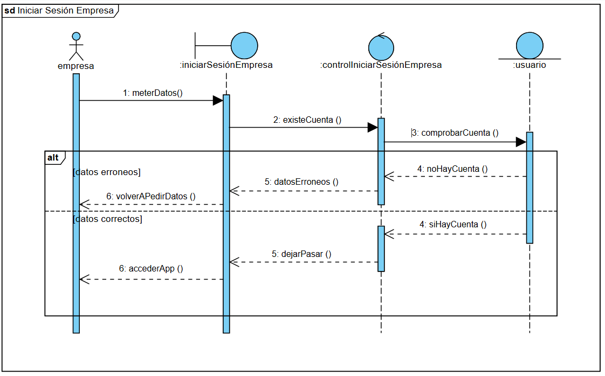

# Test Aggressive

> **Descripción del diagrama:**
> The diagram you've provided is a **Sequence Diagram**, which is a type of interaction diagram used in UML (Unified Modeling Language) to describe how objects interact with each other over time. It shows the sequence of messages exchanged between objects to perform a specific operation or achieve a particular goal.

---

### **1. Main Elements and Their Attributes/Labels**

The diagram includes the following main elements:

#### **Participants (Lifelines):**
- **Usuario (User):** Represented by a stick figure, indicating the user interacting with the system.
- **iCompetir (Compete Interface):** A component or interface related to competition.
- **ControlObjetivos (Control Objectives):** A control object responsible for managing objectives.
- **usuario (User - another instance):** Another user entity, possibly representing a remote or external user.
- **objetivos (Objectives):** An entity representing objectives or goals.

Each participant has a vertical dashed line extending downward, representing their lifeline (the timeline of their existence during the interaction).

#### **Messages (Arrows):**
- Messages are represented by horizontal arrows between lifelines, showing the flow of communication.
- Each message has a label indicating the action being performed, such as `getMenuAmigos()`, `getUser(username)`, `InvitarAmigo(telefono)`, etc.
- Some messages have numbers (e.g., `1.1 getMenuAmigos()`) to indicate the order of messages in the sequence.

#### **Combined Fragments:**
- **alt (Alternative):** Represents alternative paths in the interaction. For example, if an amigo (friend) is found or not found.
- **opt (Optional):** Represents optional interactions. For example, inviting a friend via telephone.
- **Note:** A note at the bottom left corner says, "estaría dentro de un bucle para actualizar los cambios de la tabla en todo momento," which translates to "it would be inside a loop to update table changes at all times."

---

### **2. Relationships and Multiplicities**

- **Relationships:** The relationships are defined by the messages exchanged between participants. Each message represents a call or response between objects.
  - For example, `Usuario` sends a message to `iCompetir` to select friends (`SeleccionaAmigos`), and `iCompetir` responds with a menu of friends (`MenuAmigos`).
  - The `alt` fragment shows two possible outcomes: one where a friend is found (`amigo encontrado`) and another where a friend is not found (`amigo no encontrado`).
  - The `opt` fragment shows an optional step where a friend can be invited via telephone.

- **Multiplicities:** There are no explicit multiplicities shown in this diagram, as it focuses on the sequence of interactions rather than the number of instances involved.

---

### **3. Notation Used**

- **Lifelines:** Vertical dashed lines represent the participants' lifelines.
- **Activation Bars:** Small rectangles on the lifelines indicate when a participant is active (performing an action).
- **Messages:** Horizontal arrows with labels represent messages exchanged between participants.
  - Solid arrows with filled arrowheads (`->`) represent synchronous calls.
  - Dashed arrows with open arrowheads (`-->)`) represent asynchronous messages or return messages.
- **Combined Fragments:**
  - `alt`: Enclosed in a rectangle with a dashed border, labeled with conditions (`[amigo encontrado]` or `[amigo no encontrado]`).
  - `opt`: Enclosed in a rectangle with a dashed border, labeled with a condition (`[InvitarAmigo telefono]`).
- **Notes:** Rectangular boxes with text provide additional information or context.

---

### **4. Visible Text or Titles**

- **Title:** The title of the diagram is partially visible at the top left corner: "sd comp... con amigos" (likely short for "sequence diagram compet... with friends").
- **Text Labels:**
  - Messages like `SeleccionaAmigos`, `getMenuAmigos()`, `getUser(username)`, `InvitarAmigo(telefono)`, etc.
  - Conditions in combined fragments: `[amigo encontrado]`, `[amigo no encontrado]`, `[InvitarAmigo telefono]`.
  - Note at the bottom: "estaría dentro de un bucle para actualizar los cambios de la tabla en todo momento."

---

### **Summary**

This is a **Sequence Diagram** that illustrates the interaction between various entities (Usuario, iCompetir, ControlObjetivos, usuario, objetivos) in a system, likely related to a social or competitive application. The diagram shows the step-by-step process of selecting friends, checking for their existence, inviting them, and synchronizing data. It uses standard UML notation, including lifelines, messages, activation bars, and combined fragments (`alt` and `opt`) to depict conditional and optional behaviors. The note at the bottom suggests that the system updates changes in real-time, possibly through a loop.

> **Descripción del diagrama:**
> The diagram you've provided is a **Sequence Diagram**, which is a type of interaction diagram used in UML (Unified Modeling Language) to describe how objects interact with each other over time. It shows the sequence of messages exchanged between objects to perform a specific operation or achieve a particular goal.

### Detailed Description:

#### 1. Main Elements and Their Attributes/Labels:

- **Participants (Lifelines):**
  - **empresa (Company):** Represented by a stick figure icon, indicating a human actor or an external entity.
  - **iniciarSesiónEmpresa (Start Company Session):** A system component or object responsible for initiating the session.
  - **controlIniciarSesiónEmpresa (Control Start Company Session):** Another system component or object that controls the session initiation process.
  - **usuario (User):** Represented by a circle icon, indicating another system component or object, likely related to user management.

- **Messages (Arrows):**
  - Messages are represented by arrows between the lifelines, showing the flow of communication.
  - Each message has a label and a number, indicating the order of the interaction.

- **Activation Bars:**
  - Vertical blue bars on the lifelines indicate the period during which an object is active or performing an operation.

- **Alternative Fragment (alt):**
  - A rectangular box labeled "alt" indicates an alternative path in the sequence, depending on certain conditions.

#### 2. Relationships and Multiplicities:

- **Relationships:**
  - The relationships are shown through the messages exchanged between the participants.
  - The sequence of messages defines the interaction flow, with each message triggering a response from another participant.

- **Multiplicities:**
  - There are no explicit multiplicities shown in this diagram, as it focuses on the sequence of interactions rather than the number of instances involved.

#### 3. Notation Used:

- **Lifelines:** Represented by vertical dashed lines extending from the participant icons.
- **Activation Bars:** Blue rectangles on the lifelines indicating when an object is active.
- **Messages:** Arrows with labels and numbers, showing the direction and content of the communication.
- **Alternative Fragment (alt):** A rectangular box with a label "alt" and two sections separated by a horizontal line, indicating different paths based on conditions.
  - **Condition 1:** `datos erroneos` (incorrect data)
  - **Condition 2:** `datos correctos` (correct data)

#### 4. Visible Text or Titles:

- **Title:** "sd Iniciar Sesión Empresa" (Sequence Diagram Start Company Session)
- **Participant Labels:**
  - empresa
  - iniciarSesiónEmpresa
  - controlIniciarSesiónEmpresa
  - usuario

- **Message Labels:**
  - 1: meterDatos()
  - 2: existeCuenta()
  - 3: comprobarCuenta()
  - 4: noHayCuenta()
  - 4: siHayCuenta()
  - 5: datosErroneos()
  - 5: dejarPasar()
  - 6: volverAPedirDatos()
  - 6: accederApp()

### Summary:

This Sequence Diagram illustrates the process of starting a company session, involving interactions between a company, a session initiation component, a session control component, and a user. The diagram shows the sequence of messages exchanged, including checks for account existence and data validation. Depending on whether the data is correct or incorrect, the process either prompts the user to re-enter data or allows access to the application. The use of an alternative fragment highlights the conditional paths based on the validation results.

> **Descripción del diagrama:**
> The diagram provided is a **Sequence Diagram**, which is a type of interaction diagram used in UML (Unified Modeling Language) to describe how objects interact with each other over time. It shows the sequence of messages exchanged between objects to perform a specific operation or achieve a particular goal.

### Detailed Description:

#### 1. Main Elements and Their Attributes/Labels:

- **Participants (Lifelines):**
  - **Admin. Gestión Usuarios (Administrator User Management):** Represented by a stick figure icon, indicating a human actor or an external system interacting with the system.
  - **IGestiónUsuarios (User Management Interface):** Represented by a blue circle with a stick figure inside, indicating an interface or boundary object that handles user management operations.
  - **ControlGestiónUsuarios (User Management Control):** Represented by a blue circle with a stick figure inside, indicating a control object responsible for managing the flow of operations related to user management.

- **Messages (Arrows):**
  - **Solid Arrows with Filled Arrowheads:** Indicate synchronous method calls or messages where the sender waits for a response from the receiver.
  - **Dashed Arrows with Open Arrowheads:** Indicate asynchronous messages or return messages where the sender does not wait for a response.

- **Activation Bars:** 
  - Vertical rectangles on the lifelines indicate the period during which an object is active and performing an operation.

- **Combined Fragments:**
  - **alt (Alternative):** A rectangular frame with a dashed line dividing it into two sections, labeled "Permisos==Denegados" (Permissions==Denied) and "Permisos==Aceptados" (Permissions==Accepted). This indicates that the sequence of messages within the fragment depends on a condition (permissions being denied or accepted).

#### 2. Relationships and Multiplicities:

- **Relationships:**
  - The relationships are depicted through the messages exchanged between the participants. Each message represents a call or interaction between the objects.
  - The sequence of messages shows the flow of control from one object to another, indicating the order in which operations are performed.

- **Multiplicities:**
  - There are no explicit multiplicities shown in this diagram, as it focuses on the sequence of interactions rather than the number of instances of objects involved.

#### 3. Notation Used:

- **Lifelines:** Represent the participants in the interaction.
- **Messages:** Represent the communication between participants.
- **Activation Bars:** Show the duration of an object's activity.
- **Combined Fragments:** Used to represent conditional logic (e.g., `alt` for alternative paths).
- **Text Labels:** Provide descriptions of the messages and conditions.

#### 4. Visible Text or Titles:

- **Title:** "sd Gestión Usuarios" (SD User Management), indicating the scope or context of the diagram.
- **Participant Names:**
  - Admin. Gestión Usuarios
  - IGestiónUsuarios
  - ControlGestiónUsuarios
- **Message Labels:**
  - 1. GestionarUsuario()
  - 1.1 ListaDeUsuarios()
  - 2. SeleccionarUsuario()
  - 2.1 EnviarDatosUsuario()
  - 2.2 VerificarPermisos()
  - 2.2.3 ErrorPermisos()
  - 2.2.4 MensajeErrorPermisos()
  - 2.2.5 SolicitarAccionCRUD()
  - 2.2.6 SolicitarAccionCRUD()

### Summary:

This Sequence Diagram illustrates the process of user management within a system, showing the interaction between an administrator, a user management interface, and a control object. The diagram captures the sequence of messages exchanged, including the verification of permissions and the handling of different outcomes based on whether permissions are denied or accepted. The use of combined fragments (`alt`) allows for the representation of conditional logic in the interaction flow. The diagram is well-structured, providing a clear view of the system's behavior in managing user-related operations.

> **Descripción del diagrama:**
> The diagram you provided is a **Sequence Diagram**. Sequence diagrams are used to illustrate the order of interactions between objects in a system over time. They are particularly useful for showing how different components or actors collaborate to achieve a specific goal.

### Detailed Description

#### 1. Main Elements and Their Attributes/Labels

- **Actors/Participants:**
  - **Administrador Gestión (Management Administrator):** Represents the user or system component responsible for initiating the payment management process.
  - **I gestión Pagos (Payment Management System):** Represents the system that handles the payment management logic.
  - **Control Gestión Pagos (Payment Control System):** Represents the system that controls the payment process, possibly validating payments.
  - **Usuario (User):** Represents the end-user who interacts with the system.

- **Lifelines:** Each actor has a vertical dashed line extending downward, representing their presence over time. The lines are labeled with the actor's name.

- **Messages/Actions:**
  - **Synchronous Messages:** Represented by solid lines with filled arrowheads. These indicate a call from one object to another.
    - `1. OP Gestión Pagos()`: Initiated by the Management Administrator.
    - `1.1 OP Gestión Pagos()`: Sent to the Payment Management System.
    - `1.4 Selección Pago()`: Returned to the Management Administrator.
    - `2. Seleccionar Pago()`: Sent to the Payment Management System.
    - `3. Validar Pago()`: Sent to the Payment Control System.
    - `3.1 Pago Ok()`: Returned to the Payment Management System.
    - `3.3 Mensaje Error()`: Returned to the Payment Management System.
    - `3.4 Mensaje Error()`: Returned to the User.
  - **Asynchronous Messages:** Represented by dashed lines with open arrowheads. These indicate a return message or an asynchronous call.
    - `1.3 Selección Pago()`: Returned to the Payment Management System.
    - `3.2 Solicitar Repetir Donación()`: Sent to the User.

- **Combined Fragments:**
  - **alt (Alternative):** This fragment represents a conditional interaction. It has two branches:
    - **Donación = True:** If the donation is successful, the flow proceeds to `3.1 Pago Ok()`.
    - **Donación = False:** If the donation fails, the flow proceeds to `3.3 Mensaje Error()` and then `3.4 Mensaje Error()`.

#### 2. Relationships and Multiplicities

- **Relationships:**
  - The relationships are depicted through the messages exchanged between the participants. Each message represents a method call or a response.
  - The `alt` fragment shows a conditional relationship where the flow depends on the outcome of the payment validation.

- **Multiplicities:**
  - The diagram does not explicitly show multiplicities (e.g., 1..*), as it focuses on the sequence of interactions rather than the number of instances involved.

#### 3. Notation Used

- **Lifelines:** Vertical dashed lines represent the existence of an object over time.
- **Activation Bars:** Rectangles on the lifelines indicate the period during which an object is performing an action.
- **Messages:** Lines connecting the lifelines represent messages or method calls.
  - **Solid Arrowhead:** Indicates a synchronous message.
  - **Open Arrowhead:** Indicates an asynchronous message or a return message.
- **Combined Fragments:** Enclosed boxes with labels (e.g., `alt`) represent conditional or alternative flows.
- **Text Labels:** Each message is labeled with a number and a description, indicating the sequence and purpose of the interaction.

#### 4. Visible Text or Titles

- **Title:** `sd Gestión Pagos` (Payment Management Sequence Diagram)
- **Participant Names:**
  - Administrador Gestión
  - I gestión Pagos
  - Control Gestión Pagos
  - Usuario
- **Message Labels:**
  - `1. OP Gestión Pagos()`
  - `1.1 OP Gestión Pagos()`
  - `1.4 Selección Pago()`
  - `2. Seleccionar Pago()`
  - `3. Validar Pago()`
  - `3.1 Pago Ok()`
  - `3.2 Solicitar Repetir Donación()`
  - `3.3 Mensaje Error()`
  - `3.4 Mensaje Error()`
- **Combined Fragment Label:**
  - `alt` (Alternative)

### Summary

This Sequence Diagram illustrates the step-by-step interaction between the Management Administrator, Payment Management System, Payment Control System, and the User during a payment management process. It shows the initiation of the payment process, selection of payment options, validation of payments, and the handling of both successful and failed payment scenarios. The use of combined fragments (`alt`) allows for the depiction of conditional logic based on the outcome of the payment validation. The diagram effectively communicates the flow of control and data between the different components involved in the payment management system.

> **Descripción del diagrama:**
> The diagram you've provided is a **UML Class Diagram**. This type of diagram is used to describe the structure of a system by showing the system's classes, their attributes, operations (or methods), and the relationships among objects.

### Detailed Description:

#### 1. Main Elements and Their Attributes/Labels:

- **Usuario (User)**:
  - Attributes: `Nombre` (String), `Apellido` (String), `Contraseña` (String)
  - Relationships: 
    - `Envia` (Sends) to `Donación`
    - `Recibe` (Receives) from `Donación`
    - `Crea` (Creates) `Ruta Predeterminada`
    - `Compara` (Compares) with `Objetivos`

- **Donación (Donation)**:
  - Attributes: `Líneas de Cuerpo` (String), `Cantidad` (Float)
  - Relationships:
    - `Envia` from `Usuario`
    - `Recibe` to `Usuario`

- **Ruta Predeterminada (Predefined Route)**:
  - Attributes: `Punto de inicio` (String), `Punto de fin` (String), `Nombre` (String)
  - Relationships:
    - `Creada por` `Usuario`
    - `Asociada con` `Arbol` (Tree)

- **Arbol (Tree)**:
  - Attributes: `Nombre` (String), `Contraseña` (String)
  - Relationships:
    - `Contiene` `Zona` (Zone)
    - `Asociada con` `Ruta Predeterminada`

- **Zona (Zone)**:
  - Attributes: `Mantenimiento` (String), `Membrillo` (Boolean)
  - Relationships:
    - `Parte de` `Arbol`
    - `Relacionada con` `Manutención`

- **Manutención (Maintenance)**:
  - Attributes: `Mantenimientos realizados` (Boolean)
  - Relationships:
    - `Realizada por` `Zona`

- **Objetivos (Objectives)**:
  - Attributes: `Descripción` (String), `Completo` (Boolean)
  - Relationships:
    - `Comparado con` `Usuario`

- **Hacer ruta (Make route)**:
  - Attributes: `Fecha` (Date), `HoraInicio` (String), `HoraFin` (String), `Distancia` (Float), `Tipo de transporte` (String)
  - Relationships:
    - `Asociada con` `Ruta no predeterminada`

- **Ruta no predeterminada (Non-predefined Route)**:
  - Attributes: `Jugador` (Book), `Puntos` (Book), `Transporte` (Tipo de transporte)
  - Relationships:
    - `Asociada con` `Hacer ruta`

- **«consumir» Tipo transporte (Consume Transport Type)**:
  - Attributes: `Andar` (Integer), `Bici` (Integer), `Auto` (Integer), `Permite escojer` (Boolean)

#### 2. Relationships and Multiplicities:

- **Usuario ↔ Donación**:
  - `Usuario` sends `Donación` (0..*) and receives `Donación` (0..*).
  - Indicates that a user can send and receive multiple donations.

- **Usuario ↔ Ruta Predeterminada**:
  - `Usuario` creates `Ruta Predeterminada` (1..*).
  - Indicates that a user can create one or more predefined routes.

- **Usuario ↔ Objetivos**:
  - `Usuario` compares with `Objetivos` (1..*).
  - Indicates that a user can compare with one or more objectives.

- **Ruta Predeterminada ↔ Arbol**:
  - `Ruta Predeterminada` is associated with `Arbol` (0..*).
  - Indicates that a predefined route can be associated with zero or more trees.

- **Arbol ↔ Zona**:
  - `Arbol` contains `Zona` (0..*).
  - Indicates that a tree can contain zero or more zones.

- **Zona ↔ Manutención**:
  - `Zona` is related to `Manutención` (1..1).
  - Indicates that each zone has exactly one maintenance record.

- **Hacer ruta ↔ Ruta no predeterminada**:
  - `Hacer ruta` is associated with `Ruta no predeterminada` (1..*).
  - Indicates that making a route can result in one or more non-predefined routes.

- **Ruta no predeterminada ↔ «consumir» Tipo transporte**:
  - `Ruta no predeterminada` consumes `Tipo transporte` (1..1).
  - Indicates that each non-predefined route consumes exactly one transport type.

#### 3. Notation Used:

- **Classes**: Represented by blue rectangles with the class name at the top.
- **Attributes**: Listed below the class name, prefixed with a minus sign (`-`) to indicate private visibility.
- **Relationships**: Lines connecting classes, often labeled to describe the nature of the relationship.
- **Multiplicities**: Shown as numbers or ranges (e.g., `0..*`, `1..1`) near the ends of the lines to indicate how many instances of one class can be associated with instances of another class.
- **Associations**: Lines connecting classes to show relationships, often with roles or navigability indicated.
- **Aggregation/Composition**: Indicated by hollow or filled diamonds on the lines, though not explicitly shown here, the relationships suggest aggregation.

#### 4. Visible Text or Titles:

- The diagram is titled implicitly by the class names and their relationships.
- The top right corner includes a logo and text: "Made with Visual Paradigm for non-commercial use," indicating the tool used to create the diagram.

### Summary:

This UML Class Diagram models a system related to user interactions, donations, predefined and non-predefined routes, trees, zones, maintenance, and transport types. It shows how these entities are structured and related to each other, providing a clear view of the system's static structure. The diagram is well-organized, with clear labels and relationships, making it easy to understand the system's components and their interactions.

