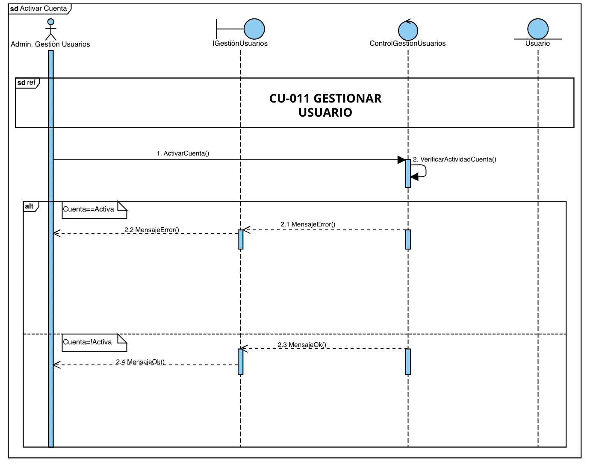
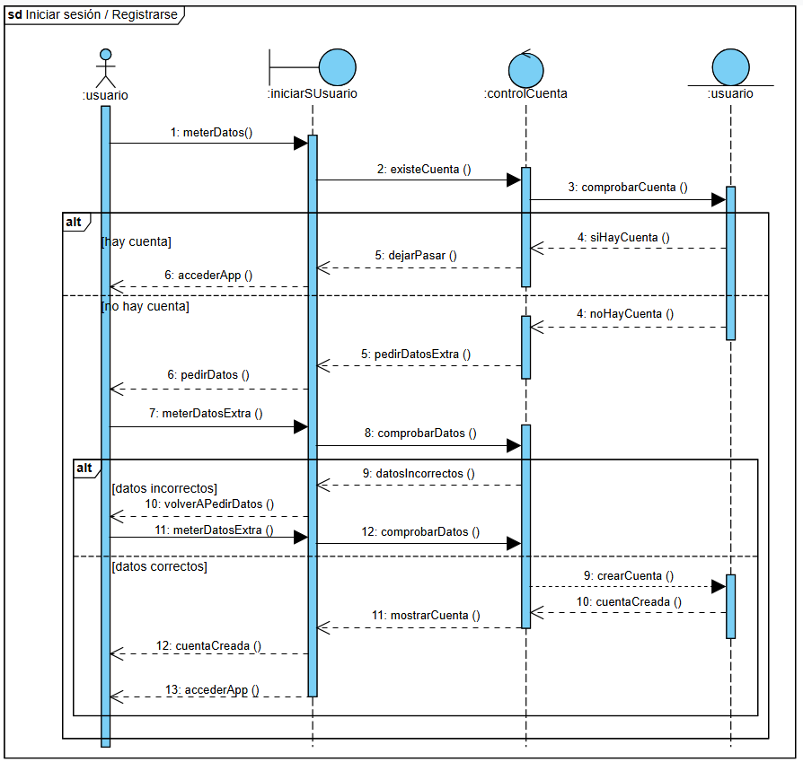

20 de mayo de 2025 - tercera versión

Ingeniería del software I

# MOVE&GROW

___

Beatriz del Barrio González

Camila Escobar Concha

Carolina Galán García

Lucía Carral Baleztena

Naroa Centurión Velasco

CAMINA, CUIDA, TRANSFORMA

Sembrando árboles gracias a tus pasos, construyendo un futuro más verde

Cada paso que das contribuye a un planeta más saludable. Los árboles son esenciales para combatir el cambio climático, absorber el dióxido de carbono y generar oxígeno.

Al caminar o usar el transporte público en lugar del coche, estás ayudando a reducir la huella de carbono y, gracias a tus pasos, estamos sembrando árboles para devolver al mundo un poco de lo que le hemos quitado.

CONTENIDOS:

## 1. Registro de Cambios

Hemos modificado la matriz de objetivos-requisitos, para que todos estén relacionados con los objetivos. Atendiendo a esta matriz los objetivos han sido añadidos correctamente a las tablas de los requisitos y los casos de uso.

Se han modificado los requisitos de acuerdo a las correcciones (han sido añadidos, eliminados y modificados), se han añadido sus tablas y se han rellenado en su mayoría. Como consecuencia, también ha habido que cambiar la matriz de requisitos con requisitos.

También hemos añadido un caso de uso más, el que ahora es el CU-004 Configurar objetivos, además de añadir las correcciones de los casos de uso indicadas en el Hito 1.

Para el Hito 3 hemos modificado los requisitos y los casos de uso. Algunos requisitos de información han sido omitidos, y se han añadido casos de uso en base a las opciones para gestionar los usuarios. Por ello, la matriz de objetivos-requisitos y la matriz de requisitos-requisitos se han corregido.

En el apartado de la memoria técnica hemos añadido información en las técnicas y herramientas.

El diagrama de clases del modelo de dominio también ha sido corregido, lo que ha implicado la creación de una tabla en el glosario de clases (la clase zona).

Se han añadido dos nuevos actores y el caso de uso gestionar usuario ha sido dividido en diferentes casos de uso.

## 2. Registro de uso de IA generativa

Durante la realización de este proyecto, hemos utilizado herramientas de inteligencia artificial generativa, como ChatGPT, de manera puntual y controlada. La hemos utilizado principalmente para reescribir algunos textos y resolver dudas puntuales que nos han ido surgiendo.

## 3. Memoria técnica

### 3.1. Introducción general del trabajo

La aplicación busca incentivar el uso de transporte sostenible (caminar, bicicleta, transporte público) de una manera divertida y competitiva. Los usuarios establecen rutas sostenibles en su vida diaria y, a medida que van logrando objetivos, se van plantando árboles en su nombre, contribuyendo así a la reforestación global y la lucha contra el cambio climático.

Esta memoria se organiza en varios apartados para facilitar su comprensión. En primer lugar, se introduce de forma general que aborda nuestra aplicación, seguida de la exposición de los objetivos funcionales identificados en la primera fase del proyecto. A continuación, se detallan las técnicas y herramientas utilizadas a lo largo del desarrollo, así como la organización interna del grupo de trabajo y la distribución de tareas. Posteriormente, se destacan los aspectos más relevantes que surgieron durante la realización de la práctica. Finalmente, se presentan las conclusiones que resumen la experiencia y los aprendizajes obtenidos durante el proyecto.

### 3.2. Objetivos

#### Rutas sostenibles:

La aplicación permitirá al usuario registrar todas sus rutas que sean beneficiosas para el medio ambiente, entre ellas el uso de transporte público (autobús, tren), caminar, utilizar bicicletas, patinete, entre otros. Permitirá registrarlas de varias maneras: rutas predeterminadas o no predeterminadas.

Rutas predeterminadas: Son aquellas que el usuario tenga ya registradas, como puede ser ir al trabajo, a la universidad o al supermercado

Rutas no predeterminadas: Son rutas espontáneas, como puede ser salir a correr, salir a dar una vuelta con amigos o pasear.

Se hace cuenta del tiempo total de estas rutas y al llegar a cierto objetivo, se planta un árbol en nombre del usuario.

#### Plantación de árboles:

A través de la donación de los usuarios a la aplicación, diversas empresas de reforestación que estén de voluntarios en el proyecto utilizaran los fondos para plantar árboles en zonas preasignadas. De esta manera se contribuye activamente al cuidado y recuperación del ecosistema.

#### Competencia amistosa:

La aplicación también fomentará la interacción entre usuarios. Estos podrán añadir amigos, y compartir con ellos sus logros y árboles que han ayudado a plantar. Este intercambio refuerza la motivación de los usuarios y su compromiso con el medio ambiente.

#### Promover actividad física:

Buscamos fomentar la actividad física incentivando a las personas a moverse más mediante el uso de la aplicación. Los usuarios serán motivados a través de recompensas relacionadas con la plantación y la interacción con amigos. De esta manera se fomenta el interés por la actividad física.

### 3.3. Técnicas y herramientas

La principal herramienta que hemos usado para este trabajo es Google Drive, esta plataforma la han sugerido los profesores para entregar el trabajo. En ella hemos creado una carpeta que luego hemos compartido con la profesora, y en ella hemos creado el documento principal, que este, y uno en sucio para poder compartir material entre nosotras más fácilmente. Como el documento principal estaba compartido entre todos los miembros, todos podíamos editarlo cuando quisiésemos, incluidos los profesores. En la corrección los profesores añadieron comentarios a ciertas partes para que nosotros pudiésemos verlos y corregir el trabajo.

Además también hemos usado mucho Telegram, una aplicación de mensajería. Creamos un chat grupal para hablar entre nosotras, al que también fue añadido un bot. Este bot ha estado registrando nuestros mensajes, y ha elaborado un informe con la participación de cada miembro que han podido leer los profesores. A través de esta aplicación nosotras hemos podido hablar y organizarnos cuando no podíamos hacerlo presencialmente. Y también hemos utilizado Trello, que era también una herramienta de comunicación. Es una especie de agenda virtual donde dejábamos constancia del trabajo realizado y a realizar para que el resto de integrantes lo viesen.

Otras herramientas usadas han sido: Studium, el campus virtual oficial de la Universidad de Salamanca, donde los profesores han colgado material de ayuda y guía; Whatsapp, otra aplicación de mensajería que también hemos usado para comunicarnos; ChatGPT, una inteligencia artificial online que hemos usado en ciertas partes específicas como recurso de información; y Google Meet, una aplicación de videollamadas que hemos usado para trabajar juntas.

Dentro del material proporcionado por los profesores, destacan el Proceso Unificado con enfoque ágil que establece los pasos principales y las herramientas necesarias para el desarrollo de un software , y el método de Durán y Bernárdez, que establece una metodología para la elicitación de requisitos. Ambos los hemos visto en clase y además disponemos de vídeos y documentos sobre ellos.

Nuestro principal método de trabajo ha sido llamarnos y repartirnos el trabajo, así si alguna tenía alguna duda o problema enseguida lo podía comunicar y pedir ayuda, ha sido muy práctico y cómodo porque hablábamos mientras trabajábamos, y también ha ayudado que este trabajo haya sido tan fácil de repartir.

### 3.4. Descripción del grupo de trabajo

Los datos de los miembros del grupo son los siguientes:

- Beatriz del Barrio González.

- Carolina Galán García.

- Camila Escobar Concha.

- Lucía Carral Baleztena.

- Naroa Centurión Velasco.

En un principio decidimos que tendríamos los siguientes roles:

- Coordinadora, Lucía.

- Controlador de Trello, Camila.

- Supervisor de tareas o analista, Carol.

- Portavoz, Naroa.

- Mediadora, Beatriz.

Finalmente, durante la realización de los dos primeros hitos no hemos dado demasiada importancia a los roles y todas hemos ido adoptando en algún momento cada rol sin darnos cuenta ni dejándolo reflejado en ningún documento.

Para el primer hito, nos organizamos repartiendo los diferentes apartados indicados en la rúbrica de evaluación, asegurándonos de que todas las secciones quedaran correctamente cubiertas. El diagrama de casos de uso fue elaborado de manera conjunta por todo el grupo.

Beatriz se encargó de la parte estética del documento, incluyendo la creación de la portada, la tabla de contenidos y la definición del estilo general. Además, junto a Carolina, desarrolló los apartados de requisitos de información y requisitos no funcionales.

Carolina, de manera individual, realizó también la matriz de rastreabilidad entre requisitos.

Por su parte, Lucía y Camila se ocuparon de describir los objetivos del proyecto y de confeccionar las tablas de casos de uso.

Naroa se encargó de la descripción de los actores y de la elaboración de la matriz de rastreabilidad entre objetivos y requisitos.

Una vez tuvimos la primera corrección cada una de las integrantes se encargó de corregir sus respectivas partes atendiendo a las anotaciones del documento.

Para la realización del segundo hito, comenzamos trabajando en conjunto en la elaboración del diagrama de clases del modelo de dominio, el cual expusimos posteriormente en clase.
Posteriormente, organizamos una reunión mediante Google Meet, en la que cada integrante se encargó de redactar una parte de la memoria técnica, además de resolver en equipo las dudas pendientes por corregir.

Para la elaboración del glosario de clases, decidimos dividirnos el trabajo: asignamos a cada integrante varias clases del diagrama para completar las respectivas tablas de manera individual.

Por otro lado, tratamos de mantener actualizado el tablero de Trello para reflejar el estado de las tareas. Sin embargo, esta herramienta no tuvo demasiado éxito, ya que al organizarnos principalmente a través de Telegram, donde resolvíamos dudas y repartíamos tareas de forma más ágil, acabamos dejando de lado el uso de Trello.

Para el tercer y último hito, usamos la misma técnica, repartir el trabajo. En una llamada nos repartimos los diagramas de secuencia, Naroa y Carolina realizaron el glosario de términos y Lucía, Camila y Beatriz se encargaron del modelo C4 y la propuesta de arquitectura.

### 3.5. Aspectos relevantes

La creación del diagrama de casos de uso ha sido una de las partes del Hito 1 que más  se nos dificultó. Definir los actores no lo fue tanto, pero identificar cada caso de uso sí, al igual que definirlo posteriormente. Además, el diseño del paso a paso de cada caso de uso en la parte de las tablas, aunque algunos no tenían gran dificultad, otros sí han sido más complejos de definir. A la hora de definir algún caso de uso, tuvimos que volver a diseñar el diagrama, lo que requería volver a invertirle tiempo a esa parte del trabajo.

A la hora de hacer la matriz de relación de objetivos con requisitos también le tuvimos que dar vueltas en conjunto, aunque algunos requisitos eran más claros con qué objetivo iban, otros en un inicio no le encontrábamos relación con ninguno.

La parte que nos resultó más difícil del segundo hito fue la del modelo de dominio. Nos costó bastante identificar las clases correctas, ya que decidir qué objetos deberían ser clases y qué relaciones debían existir entre ellas fue todo un reto, las relaciones entre clases también fueron complicadas, ya que tuvimos que definir si debían ser uno a muchos, muchos a muchos, o si había relaciones jerárquicas, lo que requirió mucho análisis y reflexión para asegurarnos de que el modelo fuera lo más preciso y eficiente posible.

### 3.6. Conclusiones

La realización de este proyecto nos ha permitido no solo aplicar los conocimientos teóricos adquiridos en clase, sino también desarrollar habilidades prácticas fundamentales para el trabajo en equipo y la gestión de proyectos. A lo largo de las distintas fases del trabajo, hemos aprendido la importancia de una buena comunicación interna, de la correcta distribución de tareas y de la flexibilidad a la hora de adaptarnos a imprevistos y dificultades.

Asimismo, hemos experimentado de primera mano el valor de combinar herramientas digitales para la colaboración, aunque también hemos aprendido que no todas las herramientas son igual de efectivas según el contexto del grupo. En nuestro caso, Telegram se consolidó como la vía principal de organización frente a otras plataformas como Trello.

Desde el punto de vista personal y grupal, este proyecto nos ha ayudado a mejorar nuestras habilidades de comunicación, organización, gestión del tiempo y resolución de conflictos, así como a reforzar nuestro compromiso con un objetivo común. Además, nos ha motivado especialmente el propósito sostenible y social de la aplicación, lo que añadió un componente de motivación y responsabilidad extra al trabajo realizado.

En conclusión, el desarrollo de este proyecto ha sido una experiencia enriquecedora tanto a nivel académico como personal, permitiéndonos consolidar conocimientos, identificar áreas de mejora y adquirir competencias esenciales para nuestro futuro profesional.

## 4. Objetivos:

### 4.1. Rutas sostenibles:

### 4.2. Plantación de árboles:

### 4.3. Competencia amistosa:

### 4.4. Promover la actividad física:

## 5. Requisitos de información (IRQ)

### 5.1.IRQ-001- Usuario

### 5.2. IRQ-002-Ruta nueva

### 5.3. IRQ- 003 Ruta predeterminada

### 5.4.IRQ-004 Objetivos

### 5.5. IRQ-005 Historial de objetivos.

### 5.6. IRQ-006 Compartir logros.

### 5.7. IRQ-007 Donación.

### 5.8. IRQ-008 Empresa.

## 6. Requisitos no funcionales (NFR)

### 6.1. NFR-001 Seguridad de los datos

### 6.2. NFR-002 Interfaz sencilla e intuitiva

### 6.3. NFR-003 Plazo de plantación

### 6.4. NFR-004 Leyes del país donde se realice la plantación

### 6.5. NFR-005 Aplicación móvil

### 6.6. NFR-006 Contestación del sistema

### 6.7. NFR-007 Actualización del código

### 6.8. NFR-008 Uso de buenas prácticas de desarrollo

### 6.9. NFR-009 Prevención de caídas

## 7 .Diagrama de casos de uso

## 8. Descripción de los actores

### 8.1. ACT-001 usuario

### 8.2. ACT-002 personal de árboles

### 8.3. ACT-003 administrador técnico

### 8.4. ACT-004 administrador de gestión

### 8.5. ACT-005 GPS

### 8.6. ACT-006 CUENTA BANCARIA

## 9. Tablas de casos de uso

Se utiliza esta tabla en vez de la tabla de Requisitos Funcionales:

### 9.1. CU-001 Iniciar sesión/registrarse

### 9.2. CU-002 Hacer ruta

### 9.3. CU 003 Ver logros/objetivos

### 9.4. CU-004 Configurar objetivos

### 9.5. CU-005 Competir con amigos

### 9.6. CU-006 Hacer donación

### 9.7. CU-007 Iniciar sesión empresa

### 9.8. CU-008 Plantar

### 9.9. CU-009 Mantenimiento de árboles

### 9.10. CU-010 Registrar árboles.

### 9.11. CU-011. Gestionar usuarios.

### 9.12. CU-012. Activar usuario.

### 9.13. CU-013. Desactivar usuario.

### 9.14. CU-014. Modificar usuarios.

### 9.15. CU-015 Gestionar pagos

## 10. Matriz de objetivos con requisitos

## 11. Matriz de requisitos con requisitos

## 12 .Diagrama de clases del modelo de dominio

## 13. Glosario de clases

## 14. Vista de interacción

A continuación se muestran los diagramas de secuencia de los diferentes casos de uso.

### 14.1. DS CU-001 Iniciar sesión/registrarse

### 14.2. DS CU-002 Hacer ruta

### 14.3. DS CU-003 Ver logros/objetivos

### 14.4. DS CU-004 Configurar objetivos

### 14.5. DS CU-005 Competir con amigos

### 14.6. DS CU-006 Hacer donación

### 14.7. DS CU-007 Iniciar sesión empresa

### 14.8. DS CU-008 Plantar

### 14.9. DS CU-009 Mantenimiento de árboles

### 14.10. DS CU-010 Registrar árboles

### 14.11. DS CU-011 Gestionar usuarios

### 14.12. DS CU-014 Activar usuario

### 14.13. DS CU-013 Desactivar Usuario

### 14.14. DS CU-014 Modificar usuario

### 14.15. DS CU-015 Gestionar pagos

## 15. Propuesta de arquitectura

## 16. Modelo C4

### Nivel de contexto

### Nivel de contenedores

### Nivel de componentes

### Nivel de código

## 17. Glosario de términos

Actores. Es un clasificador que modela un tipo de rol que juega una entidad que interacciona con el sujeto pero que es externa a él, un actor puede tener múltiples instancias físicas, una instancia física de un actor puede jugar diferentes papeles. Vendrán definidos por las plantillas del Método de Durán y Bernández, solo pueden tener asociaciones con casos de uso, subsistemas, componentes y clases, las asociaciones deben ser binarias.

Hay tres tipos de actores:

Principales: Tienen objetivos de usuario que se satisfacen mediante el uso de los servicios del sistema. Se identifican para encontrar los objetivos de usuario, los cuales dirigen los casos de uso.

De apoyo: Proporcionan un servicio al sistema, normalmente se trata de un sistema informático, pero podría ser una organización o una persona. Se identifican para clarificar las interfaces externas y los protocolos.

Pasivos: Están interesados en el comportamiento del caso de uso, pero no es principal ni de apoyo. Se identifican para asegurar que todos los intereses necesarios se han identificado y satisfecho.

Casos de uso. Conjunto de acciones realizadas por el sistema que dan lugar a un resultado observable. Especifica un comportamiento que el sujeto puede realizar en colaboración con uno o más actores, pero sin hacer referencia a su estructura interna. Puede contener posibles variaciones de su comportamiento básico incluyendo manejo de errores y excepciones. Vendrán definidos por las plantillas del Método de Durán y Bernández.

Clases. Clasificador que describe un conjunto de objetos que comparten la misma especificación de características, restricciones y semántica. Describe las propiedades y comportamiento de un grupo de objetos.

Diagrama de clases. Representación gráfica que muestra la relación entre los actores y los casos de uso o funcionalidades del sistema.

Diagrama de secuencia. Unidad de comportamiento que se centra en el intercambio de información observable entre elementos que pueden conectarse. Hacen hincapié en la secuencia de intercambio de mensajes entre objetos.

Tiene dos usos diferentes:

Forma de instancia, describe un escenario específico, una posible interacción.

Forma genérica, describe todas las posibles alternativas en un escenario. Puede incluir ramas, condiciones y bucles.

Memoria técnica. Introducción al trabajo, indica los aspectos técnicos principales y los explica.

Matriz de rastreabilidad obj-req. Matriz que relaciona los requisitos y los casos de uso con los objetivos. Si un requisito o caso de uso está relacionado con un objetivo (si viene definido en la tabla) se anota una cruz (o un 1, dependiendo de la notación).

Matriz de rastreabilidad req-req. Matriz que relaciona los requisitos entre ellos y los casos de uso. Si un requisito está relacionado con otro requisito o con un caso de uso (si viene definido en la tabla) se anota una cruz (o un 1, dependiendo de la notación).

Modelo C4.  Surge como solución para aliviar la brecha entre modelo y código, permite comunicar la arquitectura de un sistema en función del detalle que se quiera proporcionar. Está basado en cuatro niveles que describen el sistema con distintos grados de granularidad:

El nivel de contexto.

El nivel de contenedores.

El nivel de componentes.

El nivel de código.

Modelo de dominio. Representación de las clases conceptuales del mundo real, no de componentes software. No se trata de un conjunto de diagramas que describen clases software, u objetos software con responsabilidades.

Objetivos. La aplicación será creada y desarrollada para cumplir unos objetivos, pueden ser económicos, sociales, medioambientales, u otros. Vendrán definidos por las plantillas del Método de Durán y Bernández.

Propuesta arquitectónica. Define la estructura y organización de un sistema de software, incluyendo los componentes, sus interacciones y cómo se adaptan a los requisitos funcionales y no funcionales del sistema.

Requisitos de información. Condición o capacidad que un usuario necesita para resolver un problema o lograr un objetivo. Vendrán definidos por las plantillas del Método de Durán y Bernández.

Requisitos no funcionales. Condición o capacidad que debe tener un sistema o un componente de un sistema para satisfacer un contrato, una norma, una especificación u otro documento formal. Vendrán definidos por las plantillas del Método de Durán y Bernández.

### Tabla 1

| OBJ-<001> | Rutas sostenibles |

| --- | --- |

| Versión | 1.0  |

| Autores | Lucía Carral Baleztena
Camila Escobar Concha
Beatriz del Barrio González
Naroa Centurión Velasco
Carolina Galán García |

| Fuentes |  |

| Descripción | La aplicación permitirá al usuario registrar todas sus rutas que sean beneficiosas para el medio ambiente, entre ellas el uso de transporte público (autobús, tren), caminar, utilizar bicicletas, patinete, entre otros. Permitirá registrarlas de varias maneras: rutas predeterminadas o no predeterminadas. 
Rutas predeterminadas: Son aquellas que el usuario tenga ya registradas, como puede ser ir al trabajo, a la universidad o al supermercado
Rutas no predeterminadas: Son rutas espontáneas, como puede ser salir a correr, salir a dar una vuelta con amigos o pasear.
Se hace cuenta del tiempo total de estas rutas y al llegar a cierto objetivo, se planta un árbol en nombre del usuario.  |

| Importancia | Alta |

| Estado | Implementado |

### Tabla 2

| OBJ-<002> | Plantación de árboles |

| --- | --- |

| Versión |  1.0  |

| Autores | Lucía Carral Baleztena
Camila Escobar Concha
Beatriz del Barrio González
Naroa Centurión Velasco
Carolina Galán García |

| Fuentes |  |

| Descripción | A través de la donación de los usuarios a la aplicación, diversas empresas de reforestación que estén de voluntarios en el proyecto utilizaran los fondos para plantar árboles en zonas preasignadas. De esta manera se contribuye activamente al cuidado y recuperación del ecosistema.
 |

| Importancia | Alta |

| Estado | Implementado |

### Tabla 3

| OBJ-<003> | Competencia amistosa |

| --- | --- |

| Versión |  1.0  |

| Autores | Lucía Carral Baleztena
Camila Escobar Concha
Beatriz del Barrio González
Naroa Centurión Velasco
Carolina Galán García |

| Fuentes |  |

| Descripción | La aplicación también fomentará la interacción entre usuarios. Estos podrán añadir amigos, y compartir con ellos sus logros y árboles que han ayudado a plantar. Este intercambio refuerza la motivación de los usuarios y su compromiso con el medio ambiente. |

| Importancia | Alta |

| Estado | Implementado |

### Tabla 4

| OBJ-<004> | Promover la actividad física |

| --- | --- |

| Versión |  1.0  |

| Autores | Lucía Carral Baleztena
Camila Escobar Concha
Beatriz del Barrio González
Naroa Centurión Velasco
Carolina Galán García |

| Fuentes |  |

| Descripción | Buscamos fomentar la actividad física incentivando a las personas a moverse más mediante el uso de la aplicación. Los usuarios serán motivados a través de recompensas relacionadas con la plantación y la interacción con amigos. De esta manera se fomenta el interés por la actividad física. |

| Importancia | Alta |

| Estado | Implementado |

### Tabla 5

| IRQ-001 | Usuario | Usuario |

| --- | --- | --- |

| Versión | 2.0 (13 de mayo) | 2.0 (13 de mayo) |

| Autores | Camila Escobar Concha
Lucía Carral Baleztena
Beatriz del Barrio González
Carolina Galán García
Naroa Centurión Velasco
 (Universidad de Salamanca) | Camila Escobar Concha
Lucía Carral Baleztena
Beatriz del Barrio González
Carolina Galán García
Naroa Centurión Velasco
 (Universidad de Salamanca) |

| Fuentes |  |  |

| Objetivos asociados | ·        OBJ - 001 Rutas sostenibles.
·        OBJ - 002 Plantación de árboles.
·        OBJ - 003 Competición amistosa.
·        OBJ - 004 Promover la actividad física. | ·        OBJ - 001 Rutas sostenibles.
·        OBJ - 002 Plantación de árboles.
·        OBJ - 003 Competición amistosa.
·        OBJ - 004 Promover la actividad física. |

| Requisitos asociados | IRQ- 007 Compartir logros. | IRQ- 007 Compartir logros. |

| Descripción | El sistema deberá permitir al usuario:
 Registrarse, si no tiene una cuenta: deberá almacenar la información correspondiente al registro del usuario. En concreto: los datos personales del usuario.
Iniciar sesión, si ya tiene una cuenta registrada: para ello requerirá ciertos datos. En concreto: el nombre de usuario y la contraseña. 
Tener amistades, para lo que tendrá un buscador para poder encontrar a sus amigos y establecer amistades entre los usuarios. Deberá almacenar el nombre de usuario de estos. | El sistema deberá permitir al usuario:
 Registrarse, si no tiene una cuenta: deberá almacenar la información correspondiente al registro del usuario. En concreto: los datos personales del usuario.
Iniciar sesión, si ya tiene una cuenta registrada: para ello requerirá ciertos datos. En concreto: el nombre de usuario y la contraseña. 
Tener amistades, para lo que tendrá un buscador para poder encontrar a sus amigos y establecer amistades entre los usuarios. Deberá almacenar el nombre de usuario de estos. |

| Datos  | Nombre.
Apellidos. 
Edad.
Correo electrónico/número de teléfono
Contraseña.
Nombre de usuario 
Contraseña
Nombre de usuario de las amistades | Nombre.
Apellidos. 
Edad.
Correo electrónico/número de teléfono
Contraseña.
Nombre de usuario 
Contraseña
Nombre de usuario de las amistades |

| Tiempo de vida | Medio | Máximo |

| Tiempo de vida | <tiempo medio de vida> | <tiempo máximo de vida> |

| Ocurrencias simult. | Medio | Máximo |

| Ocurrencias simult. | <nº medio de ocurr. simult.> | <nº máximo de ocurr. simult.> |

| Importancia | <importancia del requisito> | <importancia del requisito> |

| Urgencia | <urgencia del requisito> | <urgencia del requisito> |

| Estado | <estado del requisito> | <estado del requisito> |

| Estabilidad | <estabilidad del requisito> | <estabilidad del requisito> |

| Comentarios | La información se comprueba y si algo no es correcto se vuelve a pedir.
Si todo sale bien se accede a la página de inicio | La información se comprueba y si algo no es correcto se vuelve a pedir.
Si todo sale bien se accede a la página de inicio |

### Tabla 6

| IRQ-002 | Ruta nueva | Ruta nueva |

| --- | --- | --- |

| Versión | 1.0 (9 de abril) | 1.0 (9 de abril) |

| Autores | Camila Escobar Concha
Lucía Carral Baleztena
Beatriz del Barrio González
Carolina Galán García
Naroa Centurión Velasco
 (Universidad de Salamanca) | Camila Escobar Concha
Lucía Carral Baleztena
Beatriz del Barrio González
Carolina Galán García
Naroa Centurión Velasco
 (Universidad de Salamanca) |

| Fuentes |  |  |

| Objetivos asociados | OBJ- 001 Rutas sostenibles. | OBJ- 001 Rutas sostenibles. |

| Requisitos asociados | 
 | 
 |

| Descripción | El sistema deberá permitir al usuario inicializar y finalizar nuevas rutas, para ello requerirá cierta información sobre ella. | El sistema deberá permitir al usuario inicializar y finalizar nuevas rutas, para ello requerirá cierta información sobre ella. |

| Datos  | Ubicación de origen y destino.
Tipo de ruta.
Método de transporte ( caminar, bicicleta, patinete, autobús y metro). | Ubicación de origen y destino.
Tipo de ruta.
Método de transporte ( caminar, bicicleta, patinete, autobús y metro). |

| Tiempo de vida | Medio | Máximo |

| Tiempo de vida | <tiempo medio de vida> | <tiempo máximo de vida> |

| Ocurrencias simult. | Medio | Máximo |

| Ocurrencias simult. | <nº medio de ocurr. simult.> | <nº máximo de ocurr. simult.> |

| Importancia | <importancia del requisito> | <importancia del requisito> |

| Urgencia | <urgencia del requisito> | <urgencia del requisito> |

| Estado | <estado del requisito> | <estado del requisito> |

| Estabilidad | <estabilidad del requisito> | <estabilidad del requisito> |

| Comentarios |  La información sobre cada ruta que hace el usuario debe quedar guardada en un historial asociado a la cuenta.
 Si al finalizar la ruta se ha alcanzado algún objetivo, se actualiza la información de objetivos asociada. |  La información sobre cada ruta que hace el usuario debe quedar guardada en un historial asociado a la cuenta.
 Si al finalizar la ruta se ha alcanzado algún objetivo, se actualiza la información de objetivos asociada. |

### Tabla 7

| IRQ-003 | Ruta predeterminada  | Ruta predeterminada  |

| --- | --- | --- |

| Versión | 1.0 (9 de abril) | 1.0 (9 de abril) |

| Autores | Camila Escobar Concha
Lucía Carral Baleztena
Beatriz del Barrio González
Carolina Galán García
Naroa Centurión Velasco
 (Universidad de Salamanca) | Camila Escobar Concha
Lucía Carral Baleztena
Beatriz del Barrio González
Carolina Galán García
Naroa Centurión Velasco
 (Universidad de Salamanca) |

| Fuentes |  |  |

| Objetivos asociados | OBJ- 001 Rutas sostenibles. | OBJ- 001 Rutas sostenibles. |

| Requisitos asociados | 
IRQ- 002 Ruta nueva. | 
IRQ- 002 Ruta nueva. |

| Descripción | El sistema deberá permitir al usuario establecer una ruta predeterminada, para ello guardará los datos obtenidos al crear una ruta y los guardará como una ruta predeterminada bajo un nombre. | El sistema deberá permitir al usuario establecer una ruta predeterminada, para ello guardará los datos obtenidos al crear una ruta y los guardará como una ruta predeterminada bajo un nombre. |

| Datos  | Nombre de la ruta.
Ubicación de origen y destino.
Tipo de ruta.
Método de transporte ( caminar, bicicleta, patinete, autobús y metro). | Nombre de la ruta.
Ubicación de origen y destino.
Tipo de ruta.
Método de transporte ( caminar, bicicleta, patinete, autobús y metro). |

| Tiempo de vida | Medio | Máximo |

| Tiempo de vida | <tiempo medio de vida> | <tiempo máximo de vida> |

| Ocurrencias simult. | Medio | Máximo |

| Ocurrencias simult. | <nº medio de ocurr. simult.> | <nº máximo de ocurr. simult.> |

| Importancia | <importancia del requisito> | <importancia del requisito> |

| Urgencia | <urgencia del requisito> | <urgencia del requisito> |

| Estado | <estado del requisito> | <estado del requisito> |

| Estabilidad | <estabilidad del requisito> | <estabilidad del requisito> |

| Comentarios |  La información sobre cada ruta que hace el usuario debe quedar guardada en un historial asociado a la cuenta.
 Si al finalizar la ruta se ha alcanzado algún objetivo, se actualiza la información de objetivos asociada. |  La información sobre cada ruta que hace el usuario debe quedar guardada en un historial asociado a la cuenta.
 Si al finalizar la ruta se ha alcanzado algún objetivo, se actualiza la información de objetivos asociada. |

### Tabla 8

| IRQ-004 | Objetivos  | Objetivos  |

| --- | --- | --- |

| Versión | 1.0 (9 de abril) | 1.0 (9 de abril) |

| Autores | Camila Escobar Concha
Lucía Carral Baleztena
Beatriz del Barrio González
Carolina Galán García
Naroa Centurión Velasco
 (Universidad de Salamanca) | Camila Escobar Concha
Lucía Carral Baleztena
Beatriz del Barrio González
Carolina Galán García
Naroa Centurión Velasco
 (Universidad de Salamanca) |

| Fuentes |  |  |

| Objetivos asociados | OBJ- 003  Competición amistosa.
OBJ- 004  Promover la actividad física. | OBJ- 003  Competición amistosa.
OBJ- 004  Promover la actividad física. |

| Requisitos asociados | 
IRQ- 002 Ruta nueva.
IRQ- 003 Ruta predeterminada.
 | 
IRQ- 002 Ruta nueva.
IRQ- 003 Ruta predeterminada.
 |

| Descripción | El sistema deberá permitir al usuario crear objetivos y ver los detalles de los objetivos establecidos por el sistema, este guardará los siguientes datos respecto a los objetivos: | El sistema deberá permitir al usuario crear objetivos y ver los detalles de los objetivos establecidos por el sistema, este guardará los siguientes datos respecto a los objetivos: |

| Datos  | Nombre del objetivo.
Descripción del objetivo.
Estado del objetivo (booleano). | Nombre del objetivo.
Descripción del objetivo.
Estado del objetivo (booleano). |

| Tiempo de vida | Medio | Máximo |

| Tiempo de vida | <tiempo medio de vida> | <tiempo máximo de vida> |

| Ocurrencias simult. | Medio | Máximo |

| Ocurrencias simult. | <nº medio de ocurr. simult.> | <nº máximo de ocurr. simult.> |

| Importancia | <importancia del requisito> | <importancia del requisito> |

| Urgencia | <urgencia del requisito> | <urgencia del requisito> |

| Estado | <estado del requisito> | <estado del requisito> |

| Estabilidad | <estabilidad del requisito> | <estabilidad del requisito> |

| Comentarios | Una vez un objetivo se marca completado (estado), este se convierte en un logro (objetivo cumplido). | Una vez un objetivo se marca completado (estado), este se convierte en un logro (objetivo cumplido). |

### Tabla 9

| IRQ-005 | Historial de objetivos  | Historial de objetivos  |

| --- | --- | --- |

| Versión | 1.0 (9 de abril) | 1.0 (9 de abril) |

| Autores | Camila Escobar Concha
Lucía Carral Baleztena
Beatriz del Barrio González
Carolina Galán García
Naroa Centurión Velasco
 (Universidad de Salamanca) | Camila Escobar Concha
Lucía Carral Baleztena
Beatriz del Barrio González
Carolina Galán García
Naroa Centurión Velasco
 (Universidad de Salamanca) |

| Fuentes |  |  |

| Objetivos asociados | OBJ- 004  Promover la actividad física. | OBJ- 004  Promover la actividad física. |

| Requisitos asociados | IRQ- 002 Ruta nueva.
IRQ- 003 Ruta predeterminada.
IRQ- 004 Objetivos  | IRQ- 002 Ruta nueva.
IRQ- 003 Ruta predeterminada.
IRQ- 004 Objetivos  |

| Descripción | El sistema deberá mostrar la información correspondiente a los objetivos y los logros, ya sean creados por el usuario o establecidos por el sistema. En concreto: | El sistema deberá mostrar la información correspondiente a los objetivos y los logros, ya sean creados por el usuario o establecidos por el sistema. En concreto: |

| Datos  | Nombre del objetivo
Descripción del objetivo.
Estado del objetivo. | Nombre del objetivo
Descripción del objetivo.
Estado del objetivo. |

| Tiempo de vida | Medio | Máximo |

| Tiempo de vida | <tiempo medio de vida> | <tiempo máximo de vida> |

| Ocurrencias simult. | Medio | Máximo |

| Ocurrencias simult. | <nº medio de ocurr. simult.> | <nº máximo de ocurr. simult.> |

| Importancia | <importancia del requisito> | <importancia del requisito> |

| Urgencia | <urgencia del requisito> | <urgencia del requisito> |

| Estado | <estado del requisito> | <estado del requisito> |

| Estabilidad | <estabilidad del requisito> | <estabilidad del requisito> |

| Comentarios | En cuanto al estado de un objetivo, al marcarse como completado (estado), este se convierte en un logro (objetivo cumplido). | En cuanto al estado de un objetivo, al marcarse como completado (estado), este se convierte en un logro (objetivo cumplido). |

### Tabla 10

| IRQ-006 | Compartir logros | Compartir logros |

| --- | --- | --- |

| Versión | 1.0 (9 de abril) | 1.0 (9 de abril) |

| Autores | Camila Escobar Concha
Lucía Carral Baleztena
Beatriz del Barrio González
Carolina Galán García
Naroa Centurión Velasco
 (Universidad de Salamanca) | Camila Escobar Concha
Lucía Carral Baleztena
Beatriz del Barrio González
Carolina Galán García
Naroa Centurión Velasco
 (Universidad de Salamanca) |

| Fuentes |  |  |

| Objetivos asociados |             ·        OBJ - 003 Competición amistosa.
·        OBJ - 004 Promover la actividad física. |             ·        OBJ - 003 Competición amistosa.
·        OBJ - 004 Promover la actividad física. |

| Requisitos asociados | IRQ- 004 Objetivos 
IRQ- 005 Historial de objetivos. | IRQ- 004 Objetivos 
IRQ- 005 Historial de objetivos. |

| Descripción | El sistema deberá permitir al usuario compartir con sus amigos los logros alcanzados. | El sistema deberá permitir al usuario compartir con sus amigos los logros alcanzados. |

| Datos  | Nombre del logro.
Descripción del logro. | Nombre del logro.
Descripción del logro. |

| Tiempo de vida | Medio | Máximo |

| Tiempo de vida | <tiempo medio de vida> | <tiempo máximo de vida> |

| Ocurrencias simult. | Medio | Máximo |

| Ocurrencias simult. | <nº medio de ocurr. simult.> | <nº máximo de ocurr. simult.> |

| Importancia | <importancia del requisito> | <importancia del requisito> |

| Urgencia | <urgencia del requisito> | <urgencia del requisito> |

| Estado | <estado del requisito> | <estado del requisito> |

| Estabilidad | <estabilidad del requisito> | <estabilidad del requisito> |

| Comentarios | Los logros solo podrán compartirse si existe una relación de amistad entre los usuarios. | Los logros solo podrán compartirse si existe una relación de amistad entre los usuarios. |

### Tabla 11

| IRQ-007 | Donación | Donación |

| --- | --- | --- |

| Versión | 1.0 (9 de abril) | 1.0 (9 de abril) |

| Autores | Camila Escobar Concha
Lucía Carral Baleztena
Beatriz del Barrio González
Carolina Galán García
Naroa Centurión Velasco
 (Universidad de Salamanca) | Camila Escobar Concha
Lucía Carral Baleztena
Beatriz del Barrio González
Carolina Galán García
Naroa Centurión Velasco
 (Universidad de Salamanca) |

| Fuentes |  |  |

| Objetivos asociados | OBJ- 002  Plantación de árboles. | OBJ- 002  Plantación de árboles. |

| Requisitos asociados |  |  |

| Descripción | Los usuarios podrán realizar donaciones para contribuir con la aplicación y favorecer la plantación de árboles. | Los usuarios podrán realizar donaciones para contribuir con la aplicación y favorecer la plantación de árboles. |

| Datos  | Cantidad a abonar.
Método de pago.
Datos necesarios para el pago. | Cantidad a abonar.
Método de pago.
Datos necesarios para el pago. |

| Tiempo de vida | Medio | Máximo |

| Tiempo de vida | <tiempo medio de vida> | <tiempo máximo de vida> |

| Ocurrencias simult. | Medio | Máximo |

| Ocurrencias simult. | <nº medio de ocurr. simult.> | <nº máximo de ocurr. simult.> |

| Importancia | <importancia del requisito> | <importancia del requisito> |

| Urgencia | <urgencia del requisito> | <urgencia del requisito> |

| Estado | <estado del requisito> | <estado del requisito> |

| Estabilidad | <estabilidad del requisito> | <estabilidad del requisito> |

| Comentarios |  |  |

### Tabla 12

| IRQ-008 | Empresa | Empresa |

| --- | --- | --- |

| Versión | 2.0 (14 de mayo) | 2.0 (14 de mayo) |

| Autores | Camila Escobar Concha
Lucía Carral Baleztena
Beatriz del Barrio González
Carolina Galán García
Naroa Centurión Velasco
 (Universidad de Salamanca) | Camila Escobar Concha
Lucía Carral Baleztena
Beatriz del Barrio González
Carolina Galán García
Naroa Centurión Velasco
 (Universidad de Salamanca) |

| Fuentes |  |  |

| Objetivos asociados | OBJ- 002  Plantación de árboles. | OBJ- 002  Plantación de árboles. |

| Requisitos asociados | IRQ-001 Usuario. | IRQ-001 Usuario. |

| Descripción | Los usuarios trabajadores del sistema de plantación o de la aplicación podrán registrarse e iniciar sesión con un rol distinto. Para ello el sistema deberá almacenar los datos personales necesarios para ello.
La empresa que haya iniciado sesión en el sistema podrá recibir las peticiones de plantación de los usuarios y registrar su proceso. El sistema almacenará esta información. | Los usuarios trabajadores del sistema de plantación o de la aplicación podrán registrarse e iniciar sesión con un rol distinto. Para ello el sistema deberá almacenar los datos personales necesarios para ello.
La empresa que haya iniciado sesión en el sistema podrá recibir las peticiones de plantación de los usuarios y registrar su proceso. El sistema almacenará esta información. |

| Datos  | Nombre.
Apellidos. 
Edad.
Correo electrónico/número de teléfono.
Contraseña.
Nombre del usuario solicitante.
Información de registro del árbol. | Nombre.
Apellidos. 
Edad.
Correo electrónico/número de teléfono.
Contraseña.
Nombre del usuario solicitante.
Información de registro del árbol. |

| Tiempo de vida | Medio | Máximo |

| Tiempo de vida | <tiempo medio de vida> | <tiempo máximo de vida> |

| Ocurrencias simult. | Medio | Máximo |

| Ocurrencias simult. | <nº medio de ocurr. simult.> | <nº máximo de ocurr. simult.> |

| Importancia | <importancia del requisito> | <importancia del requisito> |

| Urgencia | <urgencia del requisito> | <urgencia del requisito> |

| Estado | <estado del requisito> | <estado del requisito> |

| Estabilidad | <estabilidad del requisito> | <estabilidad del requisito> |

| Comentarios |  |  |

### Tabla 13

| NFR-001 | Seguridad de los datos |

| --- | --- |

| Versión | 1.0 (9 de abril) |

| Autores | Camila Escobar Concha
Lucía Carral Baleztena
Beatriz del Barrio González
Carolina Galán García
Naroa Centurión Velasco
 (Universidad de Salamanca) |

| Fuentes | ·         <fuente de la versión actual> (<organización de la fuente>)
... |

| Objetivos asociados | ·        OBJ - 001 Rutas sostenibles.
·        OBJ - 002 Plantación de árboles.
·        OBJ - 003 Competición amistosa. |

| Requisitos asociados | ·        IRQ-001 Usuario |

| Descripción | El sistema deberá asegurar que la información que se pide al iniciar sesión está totalmente encriptada y sigue patrones de alta seguridad, y que la autenticación es segura para los usuarios registrados. |

| Importancia | <importancia del requisito> |

| Urgencia | <urgencia del requisito> |

| Estado | <estado del requisito> |

| Estabilidad | <estabilidad del requisito> |

| Comentarios | <comentarios adicionales sobre el requisito> |

### Tabla 14

| NFR-002 | Interfaz sencilla e intuitiva |

| --- | --- |

| Versión | 1.0 (9 de abril) |

| Autores | Camila Escobar Concha
Lucía Carral Baleztena
Beatriz del Barrio González
Carolina Galán García
Naroa Centurión Velasco
 (Universidad de Salamanca) |

| Fuentes | ·         <fuente de la versión actual> (<organización de la fuente>)
... |

| Objetivos asociados | ·        OBJ - 001 Rutas sostenibles.
·        OBJ - 003 Competición amistosa. |

| Requisitos asociados |  |

| Descripción | El sistema deberá mostrar una interfaz sencilla e intuitiva durante cualquier tipo de uso de la aplicación, con gráficos con la suficiente calidad. |

| Importancia | <importancia del requisito> |

| Urgencia | <urgencia del requisito> |

| Estado | <estado del requisito> |

| Estabilidad | <estabilidad del requisito> |

| Comentarios | <comentarios adicionales sobre el requisito> |

### Tabla 15

| NFR-003 | Plazo de plantación |

| --- | --- |

| Versión | 1.0 (9 de abril) |

| Autores | Camila Escobar Concha
Lucía Carral Baleztena
Beatriz del Barrio González
Carolina Galán García
Naroa Centurión Velasco
 (Universidad de Salamanca) |

| Fuentes | ·         <fuente de la versión actual> (<organización de la fuente>)
... |

| Objetivos asociados | OBJ- 002 Plantación de árboles. |

| Requisitos asociados |  |

| Descripción | Cuando un usuario consigue plantar un árbol, la plantación real del árbol debe ocurrir en el plazo de un mes. |

| Importancia | <importancia del requisito> |

| Urgencia | <urgencia del requisito> |

| Estado | <estado del requisito> |

| Estabilidad | <estabilidad del requisito> |

| Comentarios | <comentarios adicionales sobre el requisito> |

### Tabla 16

| NFR-004 | Leyes del país donde se realice la plantación. |

| --- | --- |

| Versión | 1.0 (9 de abril) |

| Autores | Camila Escobar Concha
Lucía Carral Baleztena
Beatriz del Barrio González
Carolina Galán García
Naroa Centurión Velasco
 (Universidad de Salamanca) |

| Fuentes | ·         <fuente de la versión actual> (<organización de la fuente>)
... |

| Objetivos asociados | OBJ- 002 Plantación de árboles. |

| Requisitos asociados |  |

| Descripción |  La plantación de árboles debe estar regulada cumpliendo todas las leyes que deba. |

| Importancia | <importancia del requisito> |

| Urgencia | <urgencia del requisito> |

| Estado | <estado del requisito> |

| Estabilidad | <estabilidad del requisito> |

| Comentarios | <comentarios adicionales sobre el requisito> |

### Tabla 17

| NFR-005 | Aplicación móvil |

| --- | --- |

| Versión | 1.0 (9 de abril) |

| Autores | Camila Escobar Concha
Lucía Carral Baleztena
Beatriz del Barrio González
Carolina Galán García
Naroa Centurión Velasco
 (Universidad de Salamanca) |

| Fuentes | ·         <fuente de la versión actual> (<organización de la fuente>)
... |

| Objetivos asociados | ·        OBJ - 001 Rutas sostenibles.
·        OBJ - 002 Plantación de árboles.
·        OBJ - 004 Promover la actividad física. |

| Requisitos asociados |  |

| Descripción | La aplicación será móvil y estará disponible para los sistemas operativos más utilizados (Android, iOS). |

| Importancia | <importancia del requisito> |

| Urgencia | <urgencia del requisito> |

| Estado | <estado del requisito> |

| Estabilidad | <estabilidad del requisito> |

| Comentarios | <comentarios adicionales sobre el requisito> |

### Tabla 18

| NFR-006 | Contestación del sistema |

| --- | --- |

| Versión | 1.0 (9 de abril) |

| Autores | Camila Escobar Concha
Lucía Carral Baleztena
Beatriz del Barrio González
Carolina Galán García
Naroa Centurión Velasco
 (Universidad de Salamanca) |

| Fuentes | ·         <fuente de la versión actual> (<organización de la fuente>)
... |

| Objetivos asociados | ·        OBJ - 001 Rutas sostenibles.
·        OBJ - 002 Plantación de árboles.
·        OBJ - 003 Competición amistosa.
·        OBJ - 004 Promover la actividad física. |

| Requisitos asociados |  |

| Descripción | El sistema deberá responder a la mayoría de interacciones en un plazo menor a dos segundos. |

| Importancia | <importancia del requisito> |

| Urgencia | <urgencia del requisito> |

| Estado | <estado del requisito> |

| Estabilidad | <estabilidad del requisito> |

| Comentarios | <comentarios adicionales sobre el requisito> |

### Tabla 19

| NFR-007 | Actualización del código |

| --- | --- |

| Versión | 1.0 (9 de abril) |

| Autores | Camila Escobar Concha
Lucía Carral Baleztena
Beatriz del Barrio González
Carolina Galán García
Naroa Centurión Velasco
 (Universidad de Salamanca) |

| Fuentes | ·         <fuente de la versión actual> (<organización de la fuente>)
... |

| Objetivos asociados | ·        OBJ - 001 Rutas sostenibles.
·        OBJ - 003 Competición amistosa.
·        OBJ - 004 Promover la actividad física. |

| Requisitos asociados | NFR- 009 Prevención de caídas. |

| Descripción | El código debe estar documentado para facilitar futuras mejoras. |

| Importancia | <importancia del requisito> |

| Urgencia | <urgencia del requisito> |

| Estado | <estado del requisito> |

| Estabilidad | <estabilidad del requisito> |

| Comentarios | <comentarios adicionales sobre el requisito> |

### Tabla 20

| NFR-008 | Uso de buenas prácticas de desarrollo |

| --- | --- |

| Versión | 1.0 (9 de abril) |

| Autores | Camila Escobar Concha
Lucía Carral Baleztena
Beatriz del Barrio González
Carolina Galán García
Naroa Centurión Velasco
 (Universidad de Salamanca) |

| Fuentes | ·         <fuente de la versión actual> (<organización de la fuente>)
... |

| Objetivos asociados | ·        OBJ - 001 Rutas sostenibles.
·        OBJ - 003 Competición amistosa. |

| Requisitos asociados |  |

| Descripción | El sistema utilizará buenas prácticas de desarrollo (arquitectura modular, pruebas automatizadas). |

| Importancia | <importancia del requisito> |

| Urgencia | <urgencia del requisito> |

| Estado | <estado del requisito> |

| Estabilidad | <estabilidad del requisito> |

| Comentarios | <comentarios adicionales sobre el requisito> |

### Tabla 21

| NFR-009 | Prevención de caídas |

| --- | --- |

| Versión | 1.0 (9 de abril) |

| Autores | Camila Escobar Concha
Lucía Carral Baleztena
Beatriz del Barrio González
Carolina Galán García
Naroa Centurión Velasco
 (Universidad de Salamanca) |

| Fuentes | ·         <fuente de la versión actual> (<organización de la fuente>)
... |

| Objetivos asociados | ·        OBJ - 001 Rutas sostenibles.
·        OBJ - 002 Plantación de árboles.
·        OBJ - 003 Competición amistosa.
·        OBJ - 004 Promover la actividad física. |

| Requisitos asociados | NFR- 007 Actualización del código. |

| Descripción | Uso de servidores redundantes para evitar caídas del sistema. |

| Importancia | <importancia del requisito> |

| Urgencia | <urgencia del requisito> |

| Estado | <estado del requisito> |

| Estabilidad | <estabilidad del requisito> |

| Comentarios | <comentarios adicionales sobre el requisito> |

### Tabla 22

| ACT-001 | USUARIO |

| --- | --- |

| Versión | Versión 0.0 (31 de marzo) |

| Autores | Camila Escobar Concha
Lucía Carral Baleztena
Beatriz del Barrio González
Carolina Galán García
Naroa Centurión Velasco
 (Universidad de Salamanca) |

| Fuentes |  |

| Objetivos
asociados | OBJ-1
OBJ-2
OBJ-3
OBJ-4 |

| Requisitos
asociados | NFR-001
NFR-002
NFR-005
IRQ-001
IRQ-002
IRQ-003
IRQ-004
IRQ-005
IRQ-006
IRQ-007 |

| Descripción | Este actor representa a los usuarios que se descarga la app |

| Comentarios |  |

### Tabla 23

| ACT-002 | PERSONAL DE ÁRBOLES |

| --- | --- |

| Versión | Versión 0.0 (31 de marzo) |

| Autores | Camila Escobar Concha
Lucía Carral Baleztena
Beatriz del Barrio González
Carolina Galán García
Naroa Centurión Velasco
 (Universidad de Salamanca) |

| Fuentes |  |

| Objetivos
asociados | OBJ-2
 |

| Requisitos
asociados | NFR-003
NFR-004
IRQ-007
IRQ-008 |

| Descripción | Este actor representa al personal que se encarga de plantar, mantener y registrar los árboles |

| Comentarios |  |

### Tabla 24

| ACT-003 | ADMINISTRADOR TÉCNICO |

| --- | --- |

| Versión | Versión 0.0 (31 de marzo) |

| Autores | Camila Escobar Concha
Lucía Carral Baleztena
Beatriz del Barrio González
Carolina Galán García
Naroa Centurión Velasco
 (Universidad de Salamanca) |

| Fuentes |  |

| Objetivos
asociados | OBJ-1
OBJ-2
OBJ-3
OBJ-4 |

| Requisitos
asociados | NFR-001
NFR-002
NFR-005
NFR-006
NFR-007
NFR-008
NFR-009
 |

| Descripción | Este actor representa al personal que se encarga de gestionar los usuarios |

| Comentarios | Este actor hereda todo lo que hace el actor usuario por lo que también tiene los mismos objetivos y requisitos relacionados, aunque este tiene algunos de más que son los que pondremos en esta tabla y los requisitos funcionales se les ofrecerán con otros servicios |

### Tabla 25

| ACT-004 | ADMINISTRADOR DE GESTIÓN |

| --- | --- |

| Versión | Versión 0.0 (31 de marzo) |

| Autores | Camila Escobar Concha
Lucía Carral Baleztena
Beatriz del Barrio González
Carolina Galán García
Naroa Centurión Velasco
 (Universidad de Salamanca) |

| Fuentes |  |

| Objetivos
asociados | OBJ-2
 |

| Requisitos
asociados | IRQ-007
IRQ-008 |

| Descripción | Este actor representa al personal que se encarga de gestionar los pagos de las donaciones |

| Comentarios |  |

### Tabla 26

| ACT-004 | ADMINISTRADOR DE GESTIÓN |

| --- | --- |

| Versión | Versión 0.0 (31 de marzo) |

| Autores | Camila Escobar Concha
Lucía Carral Baleztena
Beatriz del Barrio González
Carolina Galán García
Naroa Centurión Velasco
 (Universidad de Salamanca) |

| Fuentes |  |

| Objetivos
asociados | OBJ-1
OBJ-3
 |

| Requisitos
asociados | IRQ-002
IRQ-003
NFR-001 |

| Descripción | Este actor representa la ubicación del móvil, la cual se usará en las rutas |

| Comentarios | Este actor no aparece en el diagrama de casos de uso ya que lo hemos usado para poder realizar el diagrama de secuencia de hacer ruta |

### Tabla 27

| ACT-004 | ADMINISTRADOR DE GESTIÓN |

| --- | --- |

| Versión | Versión 0.0 (31 de marzo) |

| Autores | Camila Escobar Concha
Lucía Carral Baleztena
Beatriz del Barrio González
Carolina Galán García
Naroa Centurión Velasco
 (Universidad de Salamanca) |

| Fuentes |  |

| Objetivos
asociados | OBJ-2
 |

| Requisitos
asociados | IRQ-007
NFR-001 |

| Descripción | Este actor representa la cuenta de banco del usuario, la cual se usará en las donaciones |

| Comentarios | Este actor no aparece en el diagrama de casos de uso ya que lo hemos usado para poder realizar el diagrama de secuencia de gestión de donaciones |

### Tabla 28

| CU-001 | Iniciar sesión/registrarse  | Iniciar sesión/registrarse  |

| --- | --- | --- |

| Versión | Versión 0.0 (24 de marzo) | Versión 0.0 (24 de marzo) |

| Autores | Camila Escobar Concha
Lucía Carral Baleztena
Beatriz del Barrio González
Carolina Galán García
Naroa Centurión Velasco
 (Universidad de Salamanca)
 | Camila Escobar Concha
Lucía Carral Baleztena
Beatriz del Barrio González
Carolina Galán García
Naroa Centurión Velasco
 (Universidad de Salamanca)
 |

| Fuentes |  |  |

| Objetivos asociados | ·         OBJ-001  Rutas sostenibles | ·         OBJ-001  Rutas sostenibles |

| Requisitos asociados | ·         IRQ-001
·         NFR-001 | ·         IRQ-001
·         NFR-001 |

| Descripción | Los usuarios podrán iniciar sesión con su cuenta y/o registrarse una vez descargada la aplicación. | Los usuarios podrán iniciar sesión con su cuenta y/o registrarse una vez descargada la aplicación. |

| Precondición | Tener la aplicación descargada en el móvil  | Tener la aplicación descargada en el móvil  |

| Secuencia normal | Paso | Acción |

| Secuencia normal | p1 | El usuario selecciona iniciar sesión |

| Secuencia normal | p2 | El sistema debe solicitar el usuario y contraseña |

| Secuencia normal | p3 | El usuario introduce los datos solicitados |

| Secuencia normal | p4 | El sistema verifica los datos  |

| Secuencia normal | p5 | Si el usuario no existe en el sistema entonces el sistema debe solicitar los datos necesarios para la creación de la cuenta |

| Secuencia normal | p6 | El sistema comprueba los datos  |

| Secuencia normal | p7 | Si el usuario  ha introducido los datos que se requieren correctamente, hay una creación de cuenta exitosa  |

|  | p8 | En caso de datos correctos, el sistema debe acceder a la cuenta del usuario y el caso de uso finaliza |

| Poscondición | El usuario accede a su cuenta | El usuario accede a su cuenta |

| Excepciones | Paso | Acción |

| Excepciones | p4 | Si el usuario intenta registrarse con una cuenta ya iniciada, le dara error y solicitará otra |

|  | p6 | Si el usuario no ha introducido los datos requeridos correctamente indicar qué datos son incorrectos o faltan, y no hay creación de cuenta aún.  |

|  | p6 | Si el usuario existe en el sistema y los datos son correctos entonces se salta al paso 8 |

| Rendimiento | Paso | Acción |

| Rendimiento | p1 | 5 minutos en registrarse |

| Rendimiento | p2 | <1 minuto en iniciar sesión |

| Frecuencia | Baja | Baja |

| Importancia | Alta | Alta |

| Urgencia | Alta | Alta |

| Estado | Definido | Definido |

| Estabilidad | Alta | Alta |

| Comentarios | Una vez iniciada sesión en un dispositivo móvil no es necesario iniciar cada que se sale de la aplicación a menos que el usuario elija cerrar sesión. | Una vez iniciada sesión en un dispositivo móvil no es necesario iniciar cada que se sale de la aplicación a menos que el usuario elija cerrar sesión. |

### Tabla 29

| CU-002 | Hacer ruta  | Hacer ruta  |

| --- | --- | --- |

| Versión | Versión 0.0 (24 de marzo) | Versión 0.0 (24 de marzo) |

| Autores | Camila Escobar Concha
Lucía Carral Baleztena
Beatriz del Barrio González
Carolina Galán García
Naroa Centurión Velasco
 (Universidad de Salamanca)
 | Camila Escobar Concha
Lucía Carral Baleztena
Beatriz del Barrio González
Carolina Galán García
Naroa Centurión Velasco
 (Universidad de Salamanca)
 |

| Fuentes |  |  |

| Objetivos asociados | ·         OBJ-001  Rutas sostenibles | ·         OBJ-001  Rutas sostenibles |

| Requisitos asociados | ·        IRQ-002
·        IRQ-003
·        NFR-001 | ·        IRQ-002
·        IRQ-003
·        NFR-001 |

| Descripción | Al elegir la opción de "Hacer ruta", el usuario podrá seleccionar el método de transporte sostenible que utilizará (caminar, bicicleta, patinete, transporte público, etc.) y registrar la información del punto de inicio y destino. Además, podrá establecer rutas predeterminadas para facilitar su uso en futuras ocasiones. Al finalizar la ruta, el sistema la registrará y actualizará el progreso del usuario en la aplicación. | Al elegir la opción de "Hacer ruta", el usuario podrá seleccionar el método de transporte sostenible que utilizará (caminar, bicicleta, patinete, transporte público, etc.) y registrar la información del punto de inicio y destino. Además, podrá establecer rutas predeterminadas para facilitar su uso en futuras ocasiones. Al finalizar la ruta, el sistema la registrará y actualizará el progreso del usuario en la aplicación. |

| Precondición | Estar registrado con una cuenta y tener el gps activado | Estar registrado con una cuenta y tener el gps activado |

| Secuencia normal | Paso | Acción  |

| Secuencia normal | p1 | El usuario elige la opción de “Hacer ruta”  |

| Secuencia normal | p2 | El usuario elige el método de transporte sostenible que utilizará |

| Secuencia normal | p3 | El usuario puede elegir una ruta predeterminada si tiene, o comenzar una ruta nueva |

| Secuencia normal | p4 | El usuario ingresa el punto de inicio y el destino  |

| Secuencia normal | p5 | El usuario inicia la ruta |

| Secuencia normal | p6 | El sistema comienza a registrar el recorrido |

| Secuencia normal | p7 | Una vez completada la ruta, el sistema la detecta automáticamente |

| Secuencia normal | p8 | El sistema registra la distancia recorrida y el tiempo empleado |

| Secuencia normal | p9 | Si el usuario ha alcanzado un objetivo de distancia o tiempo acumulado, el sistema le asigna una recompensa  |

| Secuencia normal | p10 | La ruta queda guardada en el historial del usuario y puede ser marcada como predeterminada si el usuario lo desea |

| Poscondición | El sistema actualiza el historial de rutas y logros del usuario. | El sistema actualiza el historial de rutas y logros del usuario. |

| Excepciones | Paso | Acción |

| Excepciones | p3 | Si el usuario elige una ruta predeterminada, entonces se salta al paso 5 |

| Excepciones | p6 | Si el usuario finaliza la ruta manualmente, entonces se salta al paso 7 |

| Excepciones | p1 | Si el usuario elige una ruta predeterminada y no la termina, es decir la finaliza antes o después, esta se tomará por el sistema como una ruta no  predeterminada para contar la distancia y tiempo y asignar su respectiva recompensa. |

| Rendimiento | Paso | Acción |

| Rendimiento | p1 | 2 minutos en establecer una nueva ruta |

| Rendimiento | p2 | >1 minuto en elegir una ruta predeterminada |

| Frecuencia | Media | Media |

| Importancia | Alta | Alta |

| Urgencia | Alta | Alta |

| Estado | Definido | Definido |

| Estabilidad | Media | Media |

| Comentarios | Las recompensas son sumas al usuario de llegar al objetivo de plantar uno o varios árboles, entre más recompensas y más recorridos, más se  acerca el usuario a completar sus objetivos . Adicionalmente los usuarios pueden ver su historial de rutas.  | Las recompensas son sumas al usuario de llegar al objetivo de plantar uno o varios árboles, entre más recompensas y más recorridos, más se  acerca el usuario a completar sus objetivos . Adicionalmente los usuarios pueden ver su historial de rutas.  |

### Tabla 30

| CU-<003> | Ver logros/objetivos | Ver logros/objetivos |

| --- | --- | --- |

| Versión | Versión 0.0 (24 de marzo) | Versión 0.0 (24 de marzo) |

| Autores | Camila Escobar Concha
Lucía Carral Baleztena
Beatriz del Barrio González
Carolina Galán García
Naroa Centurión Velasco
 (Universidad de Salamanca)
 | Camila Escobar Concha
Lucía Carral Baleztena
Beatriz del Barrio González
Carolina Galán García
Naroa Centurión Velasco
 (Universidad de Salamanca)
 |

| Fuentes |  |  |

| Objetivos asociados | ·         OBJ-001 Rutas sostenibles | ·         OBJ-001 Rutas sostenibles |

| Requisitos asociados | ·         IRQ-004
·         IRQ-005
·         IRQ-006 | ·         IRQ-004
·         IRQ-005
·         IRQ-006 |

| Descripción | Los usuarios pueden ver los logros y objetivos alcanzados en la aplicación como árboles plantados o metas completadas. | Los usuarios pueden ver los logros y objetivos alcanzados en la aplicación como árboles plantados o metas completadas. |

| Precondición | Tener una cuenta en la aplicación | Tener una cuenta en la aplicación |

| Secuencia normal | Paso | Acción |

| Secuencia normal | p1 | Seleccionar la opción de logros y objetivos |

| Secuencia normal | p2 | La aplicación muestra en pantalla un resumen de logros conseguidos con relación a las recompensas conseguidas por cada ruta  y futuros objetivos, como árboles plantados, kilómetros recorridos o número de rutas realizadas |

| Secuencia normal | p3 | El usuario puede seleccionar cualquiera de estas opciones para ver detalles más específicos |

| Secuencia normal | p4 | El sistema le muestra los detalles del dato elegido |

| Secuencia normal | p5 | El usuario tiene la opción de compartir sus logros |

| Secuencia normal | p6 | El usuario tiene la opción de añadir objetivos propios, selecciona “configurar objetivos” y lo personaliza |

| Secuencia normal | p7 | La aplicación guarda automáticamente los cambios realizados |

| Poscondición | Los usuarios han accedido a un resumen de sus logros y objetivos actualizados | Los usuarios han accedido a un resumen de sus logros y objetivos actualizados |

| Excepciones | Paso | Acción |

| Excepciones | p1 | Si la aplicación no puede añadir un objetivo propio, salta mensaje de error y la aplicación queda como estaba |

| Rendimiento | Paso | Acción |

| Rendimiento | p1 | <1 minuto en mostrar los logros |

| Rendimiento | p2 | <3 minutos en añadir un objetivo manualmente |

| Frecuencia | Alta | Alta |

| Importancia | Alta | Alta |

| Urgencia | Media | Media |

| Estado | Definido | Definido |

| Estabilidad | Alta | Alta |

| Comentarios | Se recomienda actualizar la aplicación regularmente para que los logros y objetivos estén bien sincronizados | Se recomienda actualizar la aplicación regularmente para que los logros y objetivos estén bien sincronizados |

### Tabla 31

| CU-004 | Configurar objetivos | Configurar objetivos |

| --- | --- | --- |

| Versión | Versión 0.0 (24 de marzo) | Versión 0.0 (24 de marzo) |

| Autores | Camila Escobar Concha
Lucía Carral Baleztena
Beatriz del Barrio González
Carolina Galán García
Naroa Centurión Velasco
 (Universidad de Salamanca)
 | Camila Escobar Concha
Lucía Carral Baleztena
Beatriz del Barrio González
Carolina Galán García
Naroa Centurión Velasco
 (Universidad de Salamanca)
 |

| Fuentes |  |  |

| Objetivos asociados | ·        OBJ - 001 Rutas sostenibles.
·        OBJ - 003 Competición amistosa.
·        OBJ - 004 Promover la actividad física. | ·        OBJ - 001 Rutas sostenibles.
·        OBJ - 003 Competición amistosa.
·        OBJ - 004 Promover la actividad física. |

| Requisitos asociados | ·         IRQ-004
·         IRQ-005
·         IRQ-006 | ·         IRQ-004
·         IRQ-005
·         IRQ-006 |

| Descripción | Los usuarios pueden configurar objetivos en la aplicación | Los usuarios pueden configurar objetivos en la aplicación |

| Precondición | Tener una cuenta en la aplicación | Tener una cuenta en la aplicación |

| Secuencia normal | Paso | Acción |

| Secuencia normal | p1 | Seleccionar la opción de crear objetivos |

| Secuencia normal | p2 | La aplicación le pide al usuario que ingrese el número objetivo de árboles plantados/kilómetros/tiempo de ruta que desea llegar a alcanzar |

| Secuencia normal | p3 | El sistema le muestra los detalles del objetivo creado |

| Secuencia normal | p4 | La aplicación guarda automáticamente los cambios realizados |

| Secuencia normal | p5 | La aplicación marcará como alcanzado el objetivo una vez el usuario lo complete |

| Poscondición | Los usuarios han accedido a un resumen de sus objetivos por alcanzar | Los usuarios han accedido a un resumen de sus objetivos por alcanzar |

| Excepciones | Paso | Acción |

| Excepciones | p2 | Si la aplicación no puede añadir un objetivo propio, salta mensaje de error y la aplicación queda como estaba |

| Rendimiento | Paso | Acción |

| Rendimiento | p1 | <3 minutos en configurar nuevo objetivo |

| Rendimiento |  |  |

| Frecuencia | Baja | Baja |

| Importancia | Media | Media |

| Urgencia | Baja | Baja |

| Estado | Definido | Definido |

| Estabilidad | Alta | Alta |

| Comentarios | Se recomienda actualizar la aplicación regularmente para que los logros y objetivos estén bien sincronizados | Se recomienda actualizar la aplicación regularmente para que los logros y objetivos estén bien sincronizados |

### Tabla 32

| CU-005 | Competir con amigos | Competir con amigos |

| --- | --- | --- |

| Versión | Versión 0.0 (24 de marzo) | Versión 0.0 (24 de marzo) |

| Autores | Camila Escobar Concha
Lucía Carral Baleztena
Beatriz del Barrio González
Carolina Galán García
Naroa Centurión Velasco
 (Universidad de Salamanca)
 | Camila Escobar Concha
Lucía Carral Baleztena
Beatriz del Barrio González
Carolina Galán García
Naroa Centurión Velasco
 (Universidad de Salamanca)
 |

| Fuentes |  |  |

| Objetivos asociados | ·         OBJ-003 Competencia amistosa | ·         OBJ-003 Competencia amistosa |

| Requisitos asociados | ·         IRQ-006 | ·         IRQ-006 |

| Descripción | Los usuarios pueden añadir amigos con los que automáticamente se comparten los objetivos alcanzados | Los usuarios pueden añadir amigos con los que automáticamente se comparten los objetivos alcanzados |

| Precondición | Tener una cuenta en la aplicación | Tener una cuenta en la aplicación |

| Secuencia normal | Paso | Acción |

| Secuencia normal | p1 | El usuario selecciona la opción de “amigos” en la aplicación |

| Secuencia normal | p2 | Si quiere añadir a un amigo, selecciona la opción e introduce el nombre con el que está registrado su amigo, le aparecerá la opción de “seguir” |

| Secuencia normal | p3 | El sistema lo añade a su lista de amigos |

| Secuencia normal | p4 | El usuario puede ver una tabla en la que aparecen sus amigos y los principales logros de cada uno |

| Secuencia normal | p5 | El sistema se encarga de actualizar en tiempo real las estadísticas de cada uno en el tablero de amigos según los usuarios van avanzando |

| Poscondición | El usuario interactúa y se motiva con los logros de sus amigos, pudiendo acceder al progreso de cada uno | El usuario interactúa y se motiva con los logros de sus amigos, pudiendo acceder al progreso de cada uno |

| Excepciones | Paso | Acción |

| Excepciones | p2 | Si el usuario no encuentra al amigo en la base de datos, el sistema le da la opción de invitación a la aplicación |

| Excepciones | p4 | Si la tabla de amigos no se sincroniza correctamente, el sistema lanza mensaje de error |

| Rendimiento | Paso | Acción |

| Rendimiento | p1 | <2 minutos en agregar amigos |

| Rendimiento | p2 | <1 minuto en compartir logros |

| Frecuencia | Media | Media |

| Importancia | Media | Media |

| Urgencia | Media | Media |

| Estado | Definido | Definido |

| Estabilidad | Media | Media |

| Comentarios | Esta opción promueve la competencia amistosa y la interacción entre usuarios | Esta opción promueve la competencia amistosa y la interacción entre usuarios |

### Tabla 33

| CU-<006> | Hacer donación | Hacer donación |

| --- | --- | --- |

| Versión | Versión 0.0 (24 de marzo) | Versión 0.0 (24 de marzo) |

| Autores | Camila Escobar Concha
Lucía Carral Baleztena
Beatriz del Barrio González
Carolina Galán García
Naroa Centurión Velasco
 (Universidad de Salamanca)
 | Camila Escobar Concha
Lucía Carral Baleztena
Beatriz del Barrio González
Carolina Galán García
Naroa Centurión Velasco
 (Universidad de Salamanca)
 |

| Fuentes |  |  |

| Objetivos asociados | ·         OBJ-002 Plantación de árboles | ·         OBJ-002 Plantación de árboles |

| Requisitos asociados | ·         IRQ-007
 | ·         IRQ-007
 |

| Descripción | Los usuarios podrán hacer donaciones monetarias que contribuyan al financiamiento de la aplicación. | Los usuarios podrán hacer donaciones monetarias que contribuyan al financiamiento de la aplicación. |

| Precondición | Estar registrado en la aplicación | Estar registrado en la aplicación |

| Secuencia normal | Paso | Acción |

| Secuencia normal | p1 | El usuario elige la opción de donaciones |

| Secuencia normal | p2 | El usuario indica el monto de donación |

| Secuencia normal | p3 | El usuario selecciona el método de pago disponible  |

| Secuencia normal | p4 | El usuario realiza el pago |

| Secuencia normal | p5 | El sistema procesa el pago y genera una comprobación de pago |

| Secuencia normal | p6 | El sistema actualiza el historial de donaciones del usuario |

| Secuencia normal | p7 | El usuario recibe una notificación de donación  |

| Poscondición | El usuario tiene una donación adicional en el historial de donaciones | El usuario tiene una donación adicional en el historial de donaciones |

| Excepciones | Paso | Acción |

| Excepciones | p5 | El usuario ingresa un método de pago inválido, por lo que no se realiza la donación y el caso de uso finaliza |

| Rendimiento | Paso | Acción |

| Rendimiento | p1 | 5 minutos en realizar donación |

| Frecuencia | Baja | Baja |

| Importancia | Alta | Alta |

| Urgencia | Alta | Alta |

| Estado | Definido | Definido |

| Estabilidad | Alta | Alta |

| Comentarios | Se pueden hacer donaciones ilimitadas por usuario. | Se pueden hacer donaciones ilimitadas por usuario. |

### Tabla 34

| CU-007 | Iniciar sesión empresa | Iniciar sesión empresa |

| --- | --- | --- |

| Versión | Versión 0.0 (24 de marzo) | Versión 0.0 (24 de marzo) |

| Autores | Camila Escobar Concha
Lucía Carral Baleztena
Beatriz del Barrio González
Carolina Galán García
Naroa Centurión Velasco
 (Universidad de Salamanca)
 | Camila Escobar Concha
Lucía Carral Baleztena
Beatriz del Barrio González
Carolina Galán García
Naroa Centurión Velasco
 (Universidad de Salamanca)
 |

| Fuentes |  |  |

| Objetivos asociados | ·         OBJ-002  Plantación de árboles | ·         OBJ-002  Plantación de árboles |

| Requisitos asociados | ·         IRQ-001
·         IRQ-008
·         NFR-001

 | ·         IRQ-001
·         IRQ-008
·         NFR-001

 |

| Descripción | Para registrar los árboles plantados las empresas deben iniciar sesión | Para registrar los árboles plantados las empresas deben iniciar sesión |

| Precondición | Tener la aplicación descargada en el móvil  | Tener la aplicación descargada en el móvil  |

| Secuencia normal | Paso | Acción  |

| Secuencia normal | p1 | Personal de empresa inicia sesión en la aplicación con usuario empresarial  |

| Secuencia normal | p2 | El sistema verifica los datos  |

| Secuencia normal | p4 | En caso de datos correctos acceder a la cuenta  |

| Poscondición | El personal de las empresas de árboles accede a su cuenta para registrar los árboles | El personal de las empresas de árboles accede a su cuenta para registrar los árboles |

| Excepciones | Paso | Acción |

| Excepciones | p1 | El personal ingresa los datos incorrectos por lo que no puede acceder a su cuenta |

| Excepciones | p2 | En caso de datos incorrectos volverlos a pedir |

| Rendimiento | Paso | Acción |

| Rendimiento | p1 | 1 minuto en iniciar sesión |

| Frecuencia | Media | Media |

| Importancia | Alta | Alta |

| Urgencia | Media | Media |

| Estado | Definido | Definido |

| Estabilidad | Alta | Alta |

| Comentarios | El personal de empresas de árboles no tendrá las mismas funciones que un usuario, solo podrá acceder a su cuenta para hacer el registro de árboles plantados | El personal de empresas de árboles no tendrá las mismas funciones que un usuario, solo podrá acceder a su cuenta para hacer el registro de árboles plantados |

### Tabla 35

| CU-008 | Plantar | Plantar |

| --- | --- | --- |

| Versión | Versión 0.0 (24 de marzo) | Versión 0.0 (24 de marzo) |

| Autores | Camila Escobar Concha
Lucía Carral Baleztena
Beatriz del Barrio González
Carolina Galán García
Naroa Centurión Velasco
 (Universidad de Salamanca)
 | Camila Escobar Concha
Lucía Carral Baleztena
Beatriz del Barrio González
Carolina Galán García
Naroa Centurión Velasco
 (Universidad de Salamanca)
 |

| Fuentes |  |  |

| Objetivos asociados | ·         OBJ-002  Plantación de árboles | ·         OBJ-002  Plantación de árboles |

| Requisitos asociados | ·         IRQ-008
·        NFR-003
·      NFR-004
 | ·         IRQ-008
·        NFR-003
·      NFR-004
 |

| Descripción | Las empresas de plantación voluntarias en la iniciativa recibirán notificaciones de los árboles a plantar asignados a su empresa, gestionando su participación. | Las empresas de plantación voluntarias en la iniciativa recibirán notificaciones de los árboles a plantar asignados a su empresa, gestionando su participación. |

| Precondición | Tener una cuenta registrada en la aplicación y estar inscrito como empresa voluntaria | Tener una cuenta registrada en la aplicación y estar inscrito como empresa voluntaria |

| Secuencia normal | Paso | Acción |

| Secuencia normal | p1 | El sistema muestra la cuenta de árboles a plantar contados durante la semana |

| Secuencia normal | p2 | La empresa voluntaria selecciona que quiere ser el que plante los árboles |

| Secuencia normal | p3 | El sistema asigna ubicación para la plantación |

| Secuencia normal | p4 | El sistema actualiza el estado de los árboles a plantar como “en proceso” |

| Poscondición | La empresa debe iniciar la actividad de plantar los árboles | La empresa debe iniciar la actividad de plantar los árboles |

| Excepciones | Paso | Acción |

| Excepciones | p2 | Si la ubicación asignada no es válida, el sistema asigna otra |

| Rendimiento | Paso | Acción |

| Rendimiento | p1 | <5 minutos confirmar participación |

| Rendimiento | p2 | <5 minutos asignar ubicación |

| Frecuencia | Media | Media |

| Importancia | Alta | Alta |

| Urgencia | Alta | Alta |

| Estado | Definido | Definido |

| Estabilidad | Alta | Alta |

| Comentarios |  |  |

### Tabla 36

| CU-009 | Mantenimiento de árboles | Mantenimiento de árboles |

| --- | --- | --- |

| Versión | Versión 0.0 (24 de marzo) | Versión 0.0 (24 de marzo) |

| Autores | Camila Escobar Concha
Lucía Carral Baleztena
Beatriz del Barrio González
Carolina Galán García
Naroa Centurión Velasco
 (Universidad de Salamanca)
 | Camila Escobar Concha
Lucía Carral Baleztena
Beatriz del Barrio González
Carolina Galán García
Naroa Centurión Velasco
 (Universidad de Salamanca)
 |

| Fuentes |  |  |

| Objetivos asociados | ·         OBJ-002  Plantación de árboles | ·         OBJ-002  Plantación de árboles |

| Requisitos asociados | ·        IRQ-008
·      NFR-004
 | ·        IRQ-008
·      NFR-004
 |

| Descripción | La empresa voluntaria de plantar los árboles, queda a cargo de su mantenimiento regular; riego, revisión de su estado, o notificación de cualquier problema al sistema. | La empresa voluntaria de plantar los árboles, queda a cargo de su mantenimiento regular; riego, revisión de su estado, o notificación de cualquier problema al sistema. |

| Precondición | La empresa debe de haber plantado los árboles asignados | La empresa debe de haber plantado los árboles asignados |

| Secuencia normal | Paso | Acción |

| Secuencia normal | p1 | El sistema muestra qué zona árboles plantados necesita mantenimiento |

| Secuencia normal | p3 | La empresa registra en el sistema la zona de árboles como “mantenido” |

|  | p4 | El sistema actualiza el estado de la zona de árboles planteados y el caso de uso finaliza |

| Poscondición | El estado de la zona de árboles queda actualizado | El estado de la zona de árboles queda actualizado |

| Excepciones | Paso | Acción |

| Excepciones | p3 | Si se presenta problemas como enfermedad o plagas, se notifica al sistema y este adapta futuros mantenimientos en base a esto |

| Excepciones |  |  |

| Rendimiento | Paso | Acción |

| Rendimiento | p1 | <10 minutos de registro de mantenimiento |

| Rendimiento | p2 | <5 minutos reprogramación de tareas |

| Frecuencia | Alta | Alta |

| Importancia | Alta | Alta |

| Urgencia | Alta | Alta |

| Estado | Definido | Definido |

| Estabilidad | Alta | Alta |

| Comentarios | Fundamental para garantizar que los árboles cumplan su función ambiental a largo plazo | Fundamental para garantizar que los árboles cumplan su función ambiental a largo plazo |

### Tabla 37

| CU-010 | Registrar árboles  | Registrar árboles  |

| --- | --- | --- |

| Versión | Versión 0.0 (24 de marzo) | Versión 0.0 (24 de marzo) |

| Autores | Camila Escobar Concha
Lucía Carral Baleztena
Beatriz del Barrio González
Carolina Galán García
Naroa Centurión Velasco
 (Universidad de Salamanca)
 | Camila Escobar Concha
Lucía Carral Baleztena
Beatriz del Barrio González
Carolina Galán García
Naroa Centurión Velasco
 (Universidad de Salamanca)
 |

| Fuentes |  |  |

| Objetivos asociados | ·         OBJ-002  Plantación de árboles | ·         OBJ-002  Plantación de árboles |

| Requisitos asociados | ·        IRQ-008 | ·        IRQ-008 |

| Descripción | Una vez las empresas voluntarias hayan realizado la plantación de árboles, esto deben ser registrados en el sistema para actualizar el proceso | Una vez las empresas voluntarias hayan realizado la plantación de árboles, esto deben ser registrados en el sistema para actualizar el proceso |

| Precondición | Tener la aplicación descargada en el móvil  | Tener la aplicación descargada en el móvil  |

| Secuencia normal | Paso | Acción |

| Secuencia normal | p1 | Selecciona la opción de "Registrar árboles plantados" |

| Secuencia normal | p2 | Ingresa los detalles de la plantación, es decir evidencia |

| Secuencia normal | p3 | Confirma la información ingresada. |

| Secuencia normal | p4 | El sistema verifica y registra los árboles como plantados. |

| Secuencia normal | p5 | Los árboles registrados aparecen reflejados en la cuenta del usuario y en el historial general de la aplicación |

| Poscondición | Los árboles quedan registrados en el sistema y se refleja en la aplicación | Los árboles quedan registrados en el sistema y se refleja en la aplicación |

| Excepciones | Paso | Acción |

| Excepciones | p1 | La empresa no ingresa una evidencia válida de que los árboles han sido plantados  |

| Rendimiento | Paso | Acción |

| Rendimiento | p1 | 10 minutos en completar el registro  |

| Frecuencia | Media | Media |

| Importancia | Alta | Alta |

| Urgencia | Alta | Alta |

| Estado | Definido | Definido |

| Estabilidad | Alta | Alta |

| Comentarios |  |  |

### Tabla 38

| CU-011 | Gestionar usuarios | Gestionar usuarios |

| --- | --- | --- |

| Versión | Versión 0.0 (24 de marzo) | Versión 0.0 (24 de marzo) |

| Autores | Camila Escobar Concha
Lucía Carral Baleztena
Beatriz del Barrio González
Carolina Galán García
Naroa Centurión Velasco
 (Universidad de Salamanca)
 | Camila Escobar Concha
Lucía Carral Baleztena
Beatriz del Barrio González
Carolina Galán García
Naroa Centurión Velasco
 (Universidad de Salamanca)
 |

| Fuentes |  |  |

| Objetivos asociados | ·         OBJ-003 Competencia amistosa | ·         OBJ-003 Competencia amistosa |

| Requisitos asociados | ·         IRQ-001
·         IRQ-008
 | ·         IRQ-001
·         IRQ-008
 |

| Descripción | El administrador técnico puede gestionar los usuarios de la aplicación, pudiendo activar, desactivar y modificar cuentas. | El administrador técnico puede gestionar los usuarios de la aplicación, pudiendo activar, desactivar y modificar cuentas. |

| Precondición | Tener permisos de administrador técnico | Tener permisos de administrador técnico |

| Secuencia normal | Paso | Acción |

| Secuencia normal | p1 | Seleccionar la opción de gestionar usuarios |

| Secuencia normal | p2 | Seleccionar usuario a gestionar |

| Secuencia normal | p3 | Elegir la acción a realizar (activar cuenta, desactivar cuenta, modificar cuenta) |

| Secuencia normal | p4 | Confirmar la acción realizada |

| Poscondición | Los cambios en la cuenta del usuario quedan registrados en el sistema | Los cambios en la cuenta del usuario quedan registrados en el sistema |

| Excepciones | Paso | Acción |

| Excepciones | p1 | Si se intenta modificar un usuario sin los permisos necesarios, se notifica al administrador |

| Excepciones | p2 | Si los datos ingresados para modificar un usuario no son válidos, se solicitan de nuevo |

| Rendimiento | Paso | Acción |

| Rendimiento | p1 | <3 minutos en gestionar un usuario |

| Frecuencia | Media | Media |

| Importancia | Alta | Alta |

| Urgencia | Media | Media |

| Estado | Definido | Definido |

| Estabilidad | Alta | Alta |

| Comentarios | El administrador debe garantizar la seguridad y privacidad de los usuarios | El administrador debe garantizar la seguridad y privacidad de los usuarios |

### Tabla 39

| CU-011 | Activar usuarios | Activar usuarios |

| --- | --- | --- |

| Versión | Versión 0.0 (24 de marzo) | Versión 0.0 (24 de marzo) |

| Autores | Camila Escobar Concha
Lucía Carral Baleztena
Beatriz del Barrio González
Carolina Galán García
Naroa Centurión Velasco
 (Universidad de Salamanca)
 | Camila Escobar Concha
Lucía Carral Baleztena
Beatriz del Barrio González
Carolina Galán García
Naroa Centurión Velasco
 (Universidad de Salamanca)
 |

| Fuentes |  |  |

| Objetivos asociados | ·         OBJ-003 Competencia amistosa | ·         OBJ-003 Competencia amistosa |

| Requisitos asociados | ·         IRQ-001
·         IRQ-008 | ·         IRQ-001
·         IRQ-008 |

| Descripción | El administrador técnico puede gestionar los usuarios de la aplicación, pudiendo activar, desactivar y modificar cuentas. | El administrador técnico puede gestionar los usuarios de la aplicación, pudiendo activar, desactivar y modificar cuentas. |

| Precondición | Tener permisos de administrador técnico y haber seleccionado activar usuario | Tener permisos de administrador técnico y haber seleccionado activar usuario |

| Secuencia normal | Paso | Acción |

| Secuencia normal | p1 | Activar cuenta |

| Secuencia normal | p2 | Mensaje de cuenta activada |

| Poscondición | Los cambios en la cuenta del usuario quedan registrados en el sistema | Los cambios en la cuenta del usuario quedan registrados en el sistema |

| Excepciones | Paso | Acción |

| Excepciones | p1 | Si se intenta activar una cuenta ya activa se enviará un mensaje diciendo que la cuenta seleccionada ya está activa |

| Rendimiento | Paso | Acción |

| Rendimiento | p1 | <3 minutos en gestionar un usuario |

| Frecuencia | Media | Media |

| Importancia | Alta | Alta |

| Urgencia | Media | Media |

| Estado | Definido | Definido |

| Estabilidad | Alta | Alta |

| Comentarios | El administrador debe garantizar la seguridad y privacidad de los usuarios | El administrador debe garantizar la seguridad y privacidad de los usuarios |

### Tabla 40

| CU-011 | Desactivar usuarios | Desactivar usuarios |

| --- | --- | --- |

| Versión | Versión 0.0 (24 de marzo) | Versión 0.0 (24 de marzo) |

| Autores | Camila Escobar Concha
Lucía Carral Baleztena
Beatriz del Barrio González
Carolina Galán García
Naroa Centurión Velasco
 (Universidad de Salamanca)
 | Camila Escobar Concha
Lucía Carral Baleztena
Beatriz del Barrio González
Carolina Galán García
Naroa Centurión Velasco
 (Universidad de Salamanca)
 |

| Fuentes |  |  |

| Objetivos asociados | ·         OBJ-003 Competencia amistosa | ·         OBJ-003 Competencia amistosa |

| Requisitos asociados | ·         IRQ-001
·         IRQ-008
 | ·         IRQ-001
·         IRQ-008
 |

| Descripción | El administrador técnico puede gestionar los usuarios de la aplicación, pudiendo activar, desactivar y modificar cuentas. | El administrador técnico puede gestionar los usuarios de la aplicación, pudiendo activar, desactivar y modificar cuentas. |

| Precondición | Tener permisos de administrador técnico | Tener permisos de administrador técnico |

| Secuencia normal | Paso | Acción |

| Secuencia normal | p1 | Desactivar usuario |

| Secuencia normal | p2 | Mensaje de cuenta desactivada |

| Poscondición | Los cambios en la cuenta del usuario quedan registrados en el sistema | Los cambios en la cuenta del usuario quedan registrados en el sistema |

| Excepciones | Paso | Acción |

| Excepciones | p1 | Si intenta desactivar una cuenta ya inactiva, el sistema enviará un mensaje de error |

| Rendimiento | Paso | Acción |

| Rendimiento | p1 | <3 minutos en gestionar un usuario |

| Frecuencia | Baja | Baja |

| Importancia | Alta | Alta |

| Urgencia | Media | Media |

| Estado | Definido | Definido |

| Estabilidad | Alta | Alta |

| Comentarios | El administrador debe garantizar la seguridad y privacidad de los usuarios | El administrador debe garantizar la seguridad y privacidad de los usuarios |

### Tabla 41

| CU-014 | Modificar usuarios | Modificar usuarios |

| --- | --- | --- |

| Versión | Versión 0.0 (24 de marzo) | Versión 0.0 (24 de marzo) |

| Autores | Camila Escobar Concha
Lucía Carral Baleztena
Beatriz del Barrio González
Carolina Galán García
Naroa Centurión Velasco
 (Universidad de Salamanca)
 | Camila Escobar Concha
Lucía Carral Baleztena
Beatriz del Barrio González
Carolina Galán García
Naroa Centurión Velasco
 (Universidad de Salamanca)
 |

| Fuentes |  |  |

| Objetivos asociados | ·         OBJ-003 Competencia amistosa | ·         OBJ-003 Competencia amistosa |

| Requisitos asociados | ·         IRQ-001
·         IRQ-008
 | ·         IRQ-001
·         IRQ-008
 |

| Descripción | El administrador técnico puede gestionar los usuarios de la aplicación, pudiendo activar, desactivar y modificar cuentas. | El administrador técnico puede gestionar los usuarios de la aplicación, pudiendo activar, desactivar y modificar cuentas. |

| Precondición | Tener permisos de administrador técnico | Tener permisos de administrador técnico |

| Secuencia normal | Paso | Acción |

| Secuencia normal | p1 | Modificar usuario |

| Secuencia normal | p2 | Ingresar los nuevos datos |

| Secuencia normal | p4 | Confirmar la acción realizada |

| Poscondición | Los cambios en la cuenta del usuario quedan registrados en el sistema | Los cambios en la cuenta del usuario quedan registrados en el sistema |

| Excepciones | Paso | Acción |

| Excepciones | p1 | Si los datos ingresados para modificar un usuario no son válidos, se solicitan de nuevo |

| Rendimiento | Paso | Acción |

| Rendimiento | p1 | <3 minutos en gestionar un usuario |

| Frecuencia | Media | Media |

| Importancia | Alta | Alta |

| Urgencia | Media | Media |

| Estado | Definido | Definido |

| Estabilidad | Alta | Alta |

| Comentarios | El administrador debe garantizar la seguridad y privacidad de los usuarios | El administrador debe garantizar la seguridad y privacidad de los usuarios |

### Tabla 42

| CU-015 | Gestionar pagos | Gestionar pagos |

| --- | --- | --- |

| Versión | Versión 0.0 (24 de marzo) | Versión 0.0 (24 de marzo) |

| Autores | Camila Escobar Concha
Lucía Carral Baleztena
Beatriz del Barrio González
Carolina Galán García
Naroa Centurión Velasco
 (Universidad de Salamanca)
 | Camila Escobar Concha
Lucía Carral Baleztena
Beatriz del Barrio González
Carolina Galán García
Naroa Centurión Velasco
 (Universidad de Salamanca)
 |

| Fuentes |  |  |

| Objetivos asociados | ·         OBJ-002  Plantación de árboles | ·         OBJ-002  Plantación de árboles |

| Requisitos asociados | ·         IRQ-008
 | ·         IRQ-008
 |

| Descripción | El administrador de gestión podrá supervisar, gestionar y revisar los pagos y donaciones realizados por los usuarios. | El administrador de gestión podrá supervisar, gestionar y revisar los pagos y donaciones realizados por los usuarios. |

| Precondición | Tener permisos de administrador de gestión | Tener permisos de administrador de gestión |

| Secuencia normal | Paso | Acción |

| Secuencia normal | p1 | Seleccionar la opción de gestión de pagos |

| Secuencia normal | p2 | Revisar los pagos y donaciones realizados |

| Secuencia normal | p3 | Validar estos pagos y donaciones |

| Secuencia normal | p4 | Confirmar el buen uso de estos fondos |

| Poscondición | Los pagos y donaciones quedan registrados y validados en el sistema | Los pagos y donaciones quedan registrados y validados en el sistema |

| Excepciones | Paso | Acción |

| Excepciones | p1 | Si el pago o donación no se ha validado correctamente, se solicita al usuario corregir o repetir el proceso de donación |

| Rendimiento | Paso | Acción |

| Rendimiento | p1 | <5 minutos validar cada donación |

| Frecuencia | Media | Media |

| Importancia | Alta | Alta |

| Urgencia | Alta | Alta |

| Estado | Definido | Definido |

| Estabilidad | Alta | Alta |

| Comentarios |  |  |

### Tabla 43

| Clase | Usuario. |

| --- | --- |

| Descripción | Representa a las personas que utilizan la aplicación. |

| Atributos | Nombre (String): nombre del usuario.
Apellidos (String): apellidos del usuario.
Correo (String): dirección de correo electrónico del usuario. |

| Operaciones | Enviar donación: el usuario puede enviar 0 o varias donaciones a una empresa de plantación.
Crear ruta predeterminada: el usuario puede establecer 0 o varias rutas predeterminadas para volver a realizarlas cuando quiera.
Competir: un usuario puede competir con 0 o varios usuarios diferentes.
Hacer una ruta: el usuario puede realizar 0 o varias rutas, ya sea una previamente predeterminada o una nueva.
Objetivos: el usuario puede completar 0 o varios objetivos.  |

### Tabla 44

| Clase | Hacer ruta. |

| --- | --- |

| Descripción | Opción de hacer una ruta, escogiendo cuál de los dos tipos definidos en las clases Ruta Predeterminada y Ruta no Predeterminada. |

| Atributos | Esta clase no tiene atributos. |

| Operaciones | Usuario: el usuario puede hacer una ruta 0 o muchas veces y la opción de hacer ruta es para 0 o más usuarios.
Ruta Predeterminada O Ruta no predeterminada: el usuario sólo puede hacer una de estas dos al mismo tiempo 0 o muchas veces. |

### Tabla 45

| Clase | Ruta predeterminada. |

| --- | --- |

| Descripción | Guardar las rutas predeterminadas del usuario. |

| Atributos | Punto de inicio (String): lugar de inicio de la ruta que se va a realizar.
Punto de destino (String): lugar de destino de la ruta que se va a realizar.
Método de transporte (Tipo de transporte): qué método de transporte se va a utilizar para la ruta.
Nombre (String): el nombre con el que se va a identificar la ruta predeterminada. |

| Operaciones | Creada por un usuario: una ruta predeterminada puede ser creada por uno o varios usuarios (ya que éstas no se comparten).
Hacer ruta Predeterminada: una misma ruta predeterminada puede realizarse 0 o muchas veces. |

### Tabla 46

| Clase | Ruta no predeterminada. |

| --- | --- |

| Descripción | Hacer una ruta no predeterminada, que no esté guardada ya previamente por el usuario. |

| Atributos | Iniciar (Boolean): “botón” de inicio, true cuando se inicia la ruta.
Parar (Boolean): “botón” de parar, true cuando el usuario termina la ruta.
Transporte (Tipo de transporte): qué método de transporte se va a utilizar para la ruta. |

| Operaciones | Hacer ruta no Predeterminada: la opción de realizar ruta no predeterminada puede realizarse 0 o muchas veces. |

### Tabla 47

| Clase | Objetivos. |

| --- | --- |

| Descripción | Representa los objetivos que establecen los usuarios con el fin de motivar al uso de la aplicación. |

|  | Nombre (String): Nombre del objetivo .
Descripción (String): Descripción del objetivo.
Completado (Boolean): “botón” para marcar la opción de completado. |

| Operaciones | Establecer objetivo: la opción de que el usuario puede establecer objetivos por su cuenta con una cantidad de árboles a plantar o distancia a recorrer.
Ver objetivos: El usuario puede ver los objetivos que ha completado y los que tiene por completar.  |

### Tabla 48

| Clase | Donaciones. |

| --- | --- |

| Descripción | Representa las donaciones monetarias realizadas por los usuarios para ayudar a la financiación de la aplicación. |

|  | Número de cuenta (String): Número de cuenta.
Cantidad (Float): Monto monetario de la donación. |

| Operaciones | Realizar donación: El usuario podrá realizar una aportación monetaria mediante la opción de donar. |

### Tabla 49

| Clase | Árbol. |

| --- | --- |

| Descripción | Representa al conjunto de árboles que planta un usuario al usar la aplicación. |

| Atributos | Usuario (String): identificador del usuario.
Cantidad (Integer): cantidad de árboles que gracias a ese usuario se han plantado. |

| Operaciones | Plantar árbol: el usuario al usar la aplicación mandará la orden de que un árbol sea plantado.
Proceso de plantación: la empresa de plantación se encargará de plantar correctamente el árbol.
Zona: La empresa planta el árbol en una zona asignada por la aplicación, esto queda registrado. |

### Tabla 50

| Clase | Tipo de transporte. |

| --- | --- |

| Descripción | Enumeración para elegir el tipo de transporte que usa el usuario. Las opciones son: andando, bus, metro, bicicleta y patinete eléctrico. |

| Atributos | Esta clase no tiene atributos. |

| Operaciones | Esta clase no tiene operaciones. |

### Tabla 51

| Clase | Mantenimiento. |

| --- | --- |

| Descripción | Se encarga de mantener los árboles |

| Atributos | Mantenimiento a realizar(Boolean): Se refiere a si hay que realizar mantenimiento o no |

| Operaciones | Zona: Un mantenimiento en específico se realiza en una zona que lo requiera. 
Empresa de plantación: es la empresa de plantación la que se encarga del mantenimiento o mantenimientos |

### Tabla 52

| Clase | Empresa de plantación |

| --- | --- |

| Descripción | Es la encargada de mantener y plantar los árboles que consiguen los usuarios mediante objetivos |

| Atributos | Nombre (String): El nombre de la empresa
Usuario (String): El usuario del empleado
Contraseña (String): La contraseña del usuario |

| Operaciones | Árbol: planta uno o varios árboles
Mantenimiento: se encarga del mantenimiento o mantenimientos
Donación: recibe 0 o varias donaciones por parte de los usuarios |

### Tabla 53

| Clase | Zona |

| --- | --- |

| Descripción | Lugares en los que están plantados los árboles conseguidos por los usuarios. |

| Atributos | Ubicación (String): Ubicación exacta de la zona de árboles
Hectáreas (float): Distancia que cubre la zona de árboles |

| Operaciones | Árbol: la zona en la que se plantan los árboles puede estar vacía todavía, o tener ya muchos registrados en ella
Mantenimiento: una misma zona es mantenida 0 o muchas veces |

> **Descripción del diagrama:**
> The diagram is a **UML Sequence Diagram**.

---

### 1) **Main Elements and Their Attributes/Labels**

- **Actors and Objects (Lifelines):**
  - `Usuario` (User): Represented by a stick figure, indicating an external actor.
  - `!Competir`: A system object or class responsible for handling competition-related logic.
  - `ControlObjetivos`: A control object managing objectives.
  - `_usuario`: Represents the user data object (likely a database or service layer).
  - `objetivos`: An object representing goals or objectives.

  Each lifeline is represented as a vertical dashed line with a rectangle at the top showing the name of the object/actor.

- **Messages (Method Calls):**
  - Labeled arrows between lifelines represent method calls and responses.
  - Examples:
    - `1. SeleccionaAmigos` → message from `Usuario` to `!Competir`
    - `1.1 getMenuAmigos()` → call from `!Competir` to `ControlObjetivos`
    - `2.1 getUsuario(username)` → call from `ControlObjetivos` to `_usuario`
    - `3. InvitarAmigo(telefono)` → conditional invitation
    - `4. MostrarTabla` → display table operation

- **Activation Bars:**
  - Rectangular bars on lifelines indicate when an object is active (executing a method).

- **Combined Fragments:**
  - `alt` (alternative): Used to show conditional logic (e.g., "amigo encontrado" vs "amigo no encontrado").
  - `opt` (optional): Shows an optional step (inviting via phone).
  - These are enclosed in rectangles with the keyword at the top.

- **Return Messages:**
  - Dashed arrows with labels like `<<return>>` or implicit returns such as `MenuAmigos`, `AmigoEncontrado`, etc.

- **Self-Message:**
  - `3.1 Invitar(telefono)` → a self-call within `!Competir`, shown as a loop arrow pointing back to itself.

- **Notes:**
  - A blue note box at the bottom says:  
    *"estaría dentro de un hilo para actualizar los cambios de la tabla en todo momento"*  
    (It would be inside a thread to update table changes at all times.)

---

### 2) **Relationships and Multiplicities**

- The diagram shows **message flow** between objects over time, not structural relationships.
- No explicit multiplicity notation (like `0..*`, `1`) is used since this is a behavioral diagram.
- However, the **sequence of messages** implies interaction patterns:
  - `Usuario` initiates actions.
  - `!Competir` coordinates with `ControlObjetivos` and `_usuario`.
  - Conditional flows (`alt`) determine next steps based on whether a friend is found or not.
  - Optional behavior (`opt`) allows for phone-based invitations only if desired.

---

### 3) **Notation Used**

- **Standard UML Sequence Diagram Notation:**
  - Lifelines: Vertical dashed lines with object names.
  - Messages: Solid arrows for synchronous calls, dashed arrows for returns.
  - Activation bars: Show execution focus.
  - Combined fragments: `alt`, `opt` blocks with guards (conditions).
  - Self-messages: Arrows looping back to the same lifeline.
  - Note: Blue rectangular box with a folded corner, connected by a dashed line.

- **Guard Conditions:**
  - `[amigo encontrado]` and `[amigo no encontrado]` — conditions for alternative paths.
  - `[sincronización correcta]` and `[sincronización incorrecta]` — similar conditionals.

- **Message Numbering:**
  - Hierarchical numbering (e.g., `1`, `1.1`, `1.3`, `2.1`, `2.1.1`) indicates message order and nesting.

---

### 4) **Visible Text and Titles**

- **Title:**  
  `sd competir con amigos` (Sequence Diagram: Compete with Friends)

- **Key Messages and Labels:**
  - `SeleccionaAmigos`, `getMenuAmigos()`, `AñadirAmigo username`, `getUsuario(username)`
  - `AmigoEncontrado`, `UsuarioNoEncontrado`, `InvitarAmigo(telefono)`, `InvitacionEnviada`
  - `MostrarTabla`, `GetUsuarios_X`, `GetLogros(X)`, `UsuarioXLogro`, `Logros`
  - Error messages: `ErrorSincronizacion`, `ErrorLogros`

- **Note Box Text:**  
  *"estaría dentro de un hilo para actualizar los cambios de la tabla en todo momento"*  
  (This would be inside a thread to continuously update table changes.)

---

### Summary

This is a **UML Sequence Diagram** illustrating the **interaction flow** when a user wants to compete with friends in an application. It details:
- How the user selects friends.
- How the system checks for existing users.
- How invitations are sent (optionally via phone).
- How tables and achievements are displayed and synchronized.
- Handling of both successful and failed synchronization scenarios.

The diagram emphasizes **dynamic behavior**, **conditional logic**, and **system coordination** across multiple components.

> **Descripción del diagrama:**
> This diagram is a **UML Sequence Diagram**.

---

### **1) Main Elements and Their Attributes/Labels**

- **Actors and Objects (Lifelines):**
  - `empresa`: Represented as an actor (stick figure), indicating the user or entity initiating the process.
  - `:iniciarSesiónEmpresa`: A participant object, likely representing a session initiation component or class.
  - `:controlIniciarSesiónEmpresa`: Another object, possibly a controller responsible for managing the login logic.
  - `:usuario`: Represents the user system or database that validates credentials.

- **Lifelines:**
  - Vertical dashed lines extending downward from each participant, showing their existence over time.
  - Activations (blue rectangles) on lifelines indicate when an object is performing an action.

- **Messages:**
  - Numbered arrows between lifelines representing method calls or responses:
    - `1: meterDatos()` – Input data by the enterprise.
    - `2: existeCuenta()` – Check if account exists.
    - `3: comprobarCuenta()` – Verify account details.
    - `4: noHayCuenta()` – Response indicating no account found.
    - `4: siHayCuenta()` – Response indicating account exists.
    - `5: datosErroneos()` – Error message for incorrect data.
    - `5: dejarPasar()` – Allow access.
    - `6: volverAPedirDatos()` – Request re-entry of data.
    - `6: accederApp()` – Access granted to the application.

- **Alternative Fragment (`alt`):**
  - A combined fragment labeled `alt`, which indicates alternative execution paths based on conditions.
  - Two branches:
    - `[datos erroneos]` – When data is incorrect.
    - `[datos correctos]` – When data is correct.

---

### **2) Relationships and Multiplicities**

- **Message Flow:**
  - The diagram shows a sequential flow of messages between objects.
  - Messages are ordered numerically (1–6), reflecting the sequence of operations.
  - The `alt` fragment introduces conditional branching based on whether the input data is correct or not.

- **Multiplicity:**
  - Not explicitly shown in this diagram. However, the interaction implies one-to-one communication between participants.
  - Each message is sent from one lifeline to another, with no indication of multiple instances or collections.

---

### **3) Notation Used**

- **Standard UML Sequence Diagram Notation:**
  - **Lifelines**: Dashed vertical lines with object names at the top.
  - **Activations**: Rectangular bars on lifelines showing active periods.
  - **Synchronous Messages**: Solid arrows with filled arrowheads (e.g., `meterDatos()`).
  - **Asynchronous/Return Messages**: Dashed arrows with open arrowheads (e.g., `datosErroneos()`).
  - **Combined Fragments**: Rectangle labeled `alt` with guard conditions `[datos erroneos]` and `[datos correctos]`.
  - **Object Names**: Prefixed with `:` (e.g., `:iniciarSesiónEmpresa`) to denote instances.

---

### **4) Visible Text or Titles**

- **Title:** `sd Iniciar Sesión Empresa` – Indicates the name of the sequence diagram, meaning "Sequence Diagram: Start Enterprise Session."
- **Guard Conditions:**
  - `[datos erroneos]` – "Incorrect data"
  - `[datos correctos]` – "Correct data"
- **Method Names:**
  - `meterDatos()`, `existeCuenta()`, `comprobarCuenta()`, `noHayCuenta()`, `siHayCuenta()`, `datosErroneos()`, `dejarPasar()`, `volverAPedirDatos()`, `accederApp()`

---

### **Summary Description**

This UML Sequence Diagram models the **"Enterprise Login"** process. It illustrates how an enterprise user attempts to log in, involving interactions between the user (`empresa`), a session initiation module, a control module, and a user validation system (`usuario`). The process includes checking account existence, verifying credentials, and handling two possible outcomes:
- If data is incorrect → return error and prompt for re-entry.
- If data is correct → grant access to the application.

The diagram uses standard UML notation for sequence diagrams, including lifelines, messages, activations, and conditional fragments (`alt`), clearly depicting the dynamic behavior of the system during login.

> **Descripción del diagrama:**
> ### **Diagram Type: UML Sequence Diagram**

This is a **UML (Unified Modeling Language) Sequence Diagram**, specifically illustrating the interaction flow between objects or components in a system during the execution of a use case. In this case, it models the process of making a donation ("hacer donación").

---

### **1) Main Elements and Their Attributes/Labels**

The diagram contains the following main elements:

- **Participants (Lifelines):**
  - `Usuario` (User): Represents the external actor initiating the donation process.
  - `InterfazDonacion` (Donation Interface): The user interface component that handles input and display.
  - `controlDonacion` (Donation Controller): A control object responsible for coordinating logic and validation.
  - `cuentaBancaria` (Bank Account): Represents the bank account system used to validate and process donations.
  - `donacion` (Donation): The entity representing the donation record.

Each participant is represented as a vertical lifeline with an associated icon:
- `Usuario`: Person icon (actor).
- `InterfazDonacion`, `controlDonacion`, `cuentaBancaria`, `donacion`: Object icons (blue circles).

---

### **2) Relationships and Multiplicities**

- **Message Flow:** The diagram shows **synchronous** (solid arrow) and **asynchronous** (dashed arrow) messages exchanged between lifelines.
- **Sequence of Messages:** Numbered from 1 to 13 (and 9.1), indicating the order of interactions.
- **Conditional Logic:** An `alt` (alternative) fragment is used to show two possible paths based on whether the bank account data is correct or incorrect:
  - **Branch 1:** `datosCuenta correctos` → Successful donation processing.
  - **Branch 2:** `datosCuenta incorrectos` → Error handling.

No explicit multiplicities are shown (as typical in sequence diagrams), but the interactions imply one-to-one communication between participants.

---

### **3) Notation Used**

- **Lifelines:** Vertical dashed lines extending downward from each participant.
- **Activation Bars:** Rectangular bars on lifelines showing when an object is active (executing an operation).
- **Messages:** Horizontal arrows labeled with method calls and return values:
  - Solid arrows: Synchronous method calls (e.g., `1. OpcionDonacion()`).
  - Dashed arrows: Return messages (e.g., `<-- DonacionRealizada`).
- **Combined Fragment (`alt`):** A rectangular box with the keyword `alt` and two alternatives, showing conditional branching.
- **Method Calls:** Labeled with method names in parentheses (e.g., `SolicitarCredenciales()`).
- **Return Messages:** Indicated by dashed arrows returning to the caller.

---

### **4) Visible Text and Titles**

- **Title:** `sd hacer donacion` — This indicates the name of the sequence diagram, meaning "sequence diagram: make donation."
- **Messages (Numbered):**
  1. `OpcionDonacion()`
  2. `SolicitarCredenciales()`
  3. `IntroducirCredenciales()`
  4. `SolicitarDatosCuentaBancaria()`
  5. `IntroducirCuentaBancaria()`
  6. `ComprobarDatos()`
  7. `ComprobarDatos()`
  8. `RealizarDonacion()`
  9. `RegistrarDonacion()`
  10. `DonacionGuardada()`
  11. `DonacionRealizada()`
  12. `DonacionRealizada()`
  13. `DonacionRealizada()`
  9.1 `ErrorDonacion()`

- **Alternative Conditions:**
  - `datosCuenta correctos`
  - `datosCuenta incorrectos`

- **Tool Information:** In the top-right corner:  
  *"Made with Visual Paradigm For non-commercial use"* — indicating the tool used to create the diagram.

---

### **Summary of the Process**

The sequence diagram illustrates how a user initiates a donation:
1. The user selects the donation option.
2. Credentials are requested and entered.
3. Bank account details are provided.
4. The controller validates the data.
5. If valid, the donation is processed and registered; otherwise, an error is returned.

This diagram effectively captures the dynamic behavior of the system during the donation process, emphasizing message sequencing and conditional logic.

> **Descripción del diagrama:**
> The diagram is a **UML Sequence Diagram**.

---

### **1) Main Elements and Their Attributes/Labels**

- **Actors and Objects (Lifelines):**
  - `empresa`: A participant, represented as an actor (stick figure), initiating the interaction.
  - `izona`: An object or class instance, shown as a blue circle with a name label.
  - `controlzona`: Another object, also represented as a blue circle.
  - `zona`: The final object in the sequence, similarly styled.

  Each of these has a **lifeline** (vertical dashed line) extending downward, representing the timeline of the object’s existence during the interaction.

- **Messages:**
  - Messages are labeled arrows between lifelines, indicating method calls or responses.
  - Examples:
    - `1.getzonas(mantenimiento)` – a synchronous message from `empresa` to `izona`.
    - `1.3.zonas` – a return message from `izona` to `empresa`.
    - `2.marcar(mantenido)` – a conditional message sent when no plague is detected.
    - `3.marcar(mantenido, plaga)` – another conditional message sent when a plague is detected.
    - Return messages like `2.3.ok`, `3.3.ok`, etc., indicate successful completion.

- **Combined Fragments:**
  - An `alt` (alternative) fragment is used to represent conditional logic.
    - Two branches:
      - `[no hay plaga]` – "No plague"
      - `[hay plaga]` – "There is a plague"

---

### **2) Relationships and Multiplicities**

- **Sequence Flow:**
  - The diagram shows a **temporal order** of interactions.
  - The numbering (e.g., 1, 1.1, 1.1.1) indicates hierarchical nesting of method calls.
  - For example:
    - `empresa` calls `getzonas(mantenimiento)` on `izona`.
    - `izona` forwards this call to `controlzona`, which then calls `zona`.

- **Message Types:**
  - **Synchronous calls:** Solid arrows with filled arrowheads (e.g., `1.getzonas(...)`).
  - **Return messages:** Dashed arrows with open arrowheads (e.g., `1.3.zonas`).

- **Conditional Logic (`alt`):**
  - The `alt` fragment splits the flow into two exclusive paths based on whether there is a plague.
  - Only one path is executed at runtime.

---

### **3) Notation Used**

- **Standard UML Sequence Diagram Notation:**
  - **Lifelines:** Vertical dashed lines with objects/actors at the top.
  - **Activation Bars:** Rectangular bars on lifelines showing when an object is active (e.g., processing a message).
  - **Messages:** Horizontal arrows between lifelines.
    - Synchronous: solid arrow with filled head.
    - Return: dashed arrow with open head.
  - **Combined Fragment:** A rectangle with the keyword `alt` inside, enclosing alternative execution paths.
  - **Guard Conditions:** Text within square brackets (`[ ]`) specifying conditions for each branch.

---

### **4) Visible Text and Titles**

- **Title:** `sd Mantenimiento` — likely stands for "Sequence Diagram: Maintenance".
- **Actor:** `empresa`
- **Objects:** `izona`, `controlzona`, `zona`
- **Messages:**
  - `getzonas(mantenimiento)`
  - `marcar(mantenido)`
  - `marcar(mantenido, plaga)`
  - Return messages: `zonas`, `ok`
- **Conditions:**
  - `[no hay plaga]`
  - `[hay plaga]`

---

### **Summary**

This **UML Sequence Diagram** models the **maintenance process** in a system where an enterprise (`empresa`) interacts with a series of zone-related components (`izona`, `controlzona`, `zona`) to retrieve maintenance zones and mark them as maintained, depending on whether a plague is present. The diagram uses standard UML notation to show message flow, activation, and conditional branching, illustrating a clear procedural workflow.

> **Descripción del diagrama:**
> The diagram is a **UML Sequence Diagram**.

---

### 1) **Main Elements and Their Attributes/Labels**

- **Actors and Objects (Lifelines):**
  - `Empresa` (Actor): Represented by a stick figure, indicating an external user or system initiating the process.
  - `Unidades`: A system object involved in processing notifications.
  - `corporaciones`: Another system component handling corporate data.
  - `Linea`: Likely represents a line or branch within the organization.
  - `anual`: Possibly a yearly or periodic process or entity.
  - `empresaPlantacion`: Represents a plantation-related enterprise module.

  Each of these entities has a vertical dashed line extending downward, known as a **lifeline**, which shows their existence over time during the interaction.

- **Messages (Method Calls and Responses):**
  - Labeled arrows between lifelines represent method calls or messages exchanged:
    - `1. recibe notificación`: The Empresa sends a notification to Unidades.
    - `1.1 cuenta/unidades`: Unidades queries corporaciones for unit count.
    - `1.1.1 cuenta (unidades)` and `1.1.2 numero de lotes`: Subsequent internal or inter-system queries.
    - `1.2 numero de lotes`: Response from corporaciones to Unidades.
    - `2. IndicaPlantacion(zona)`: Empresa indicates a planting zone.
    - `2.1 IndicaPlantacion(zona)`: Forwarded to corporaciones.
    - `2.1.1 RegistraPlantacion(zona)`: Corporations register the planting.
    - `2.1.2 confirmaPublicacion`: Confirmation message back to Empresa.
    - `2.2 PlantacionEnProceso`: Indicates planting is in progress.
    - `2.13.1.1 PlantacionEnOtraZona`: Alternative path if planting is in another zone.
    - `2.13.1 PlantacionEnOtraZona`: Another alternative response.

- **Activation Bars:**
  - Rectangular boxes on lifelines (e.g., on `Unidades`, `corporaciones`) show when an object is actively performing an operation.

- **Alternative Flows (alt):**
  - A combined fragment labeled `alt` with two branches:
    - `[ubicación correcta]`: If the location is correct, proceed to `PlantacionEnProceso`.
    - `[ubicación incorrecta]`: If incorrect, go to `PlantacionEnOtraZona`.

---

### 2) **Relationships and Multiplicities**

- **Message Flow:** The diagram illustrates the **sequence of interactions** between objects in time, from top to bottom.
- **Synchronous Messages:** Solid arrows (e.g., `recibe notificación`) indicate synchronous calls where the sender waits for a response.
- **Asynchronous Messages:** Dashed arrows (e.g., `numero de lotes`) may represent responses or asynchronous communication.
- **Return Messages:** Dashed arrows pointing backward (e.g., `1.2 numero de lotes`) indicate return values or replies.
- **Conditional Logic:** The `alt` fragment shows conditional branching based on whether the location is correct or incorrect.

There are no explicit multiplicities shown (like `0..*` or `1..*`) because this is a sequence diagram, not a class or ER diagram. Instead, the focus is on **order and conditionality** of interactions.

---

### 3) **Notation Used**

- **Standard UML Sequence Diagram Notation:**
  - Stick figure for actor (`Empresa`).
  - Objects represented by names above lifelines.
  - Vertical dashed lines = lifelines.
  - Horizontal arrows = messages.
    - Solid arrow: synchronous call.
    - Dashed arrow: return message or asynchronous event.
  - Rectangular activation bars on lifelines showing execution periods.
  - Combined fragments (`alt`) to represent alternatives.
  - Message numbers (e.g., `1.`, `1.1`, `2.`) to show sequence order.
  - Labels on messages describe the method or action being performed.

---

### 4) **Visible Text and Titles**

- **Title/Label:** The diagram is titled **"SD Plantar"**, likely short for "Sequence Diagram: Planting" or "Plantation Process".
- **Software Watermark:** In the top-right corner, it says **"Made with Visual Paradigm For non-commercial use"**, indicating the tool used to create the diagram.
- **Message Labels:** All messages are labeled with actions such as:
  - `recibe notificación`
  - `cuenta/unidades`
  - `IndicaPlantacion(zona)`
  - `RegistraPlantacion(zona)`
  - `confirmaPublicacion`
  - Conditional labels: `[ubicación correcta]`, `[ubicación incorrecta]`

---

### Summary

This **UML Sequence Diagram** models the **interaction flow** among various system components and an external actor (`Empresa`) during a **plantation registration process**. It captures the step-by-step communication, including conditional logic based on location validity, and uses standard UML notation to depict messages, lifelines, activations, and alternatives. The diagram is focused on **dynamic behavior** rather than structural relationships.

> **Descripción del diagrama:**
> The diagram is a **UML Sequence Diagram**.

---

### **1) Main Elements and Their Attributes/Labels**

- **Actors (Participant)**:
  - `Admin. Gestión Usuarios`: Represented by a stick figure, this is the user or administrator initiating the interaction.
  
- **Objects/Classes (Lifelines)**:
  - `IGestiónUsuarios`: An interface or class responsible for managing user operations. It has a lifeline indicating its participation in the sequence.
  - `ControlGestionUsuarios`: A controller class that handles business logic related to user management. Also has a lifeline.

- **Messages (Method Calls)**:
  - `1. GestionarUsuario()`: Message from the admin to `IGestiónUsuarios`.
  - `1.1 ListaDeUsuarios()`: Return message from `IGestiónUsuarios` to admin.
  - `2. SeleccionarUsuario()`: Admin selects a user.
  - `2.1 EnviarDatosUsuario()`: Sends user data to `ControlGestionUsuarios`.
  - `2.2 VerificarPermisos()`: Self-message within `ControlGestionUsuarios` to check permissions.
  - `2.2.3 ErrorPermisos()`: Returned error message if permissions are denied.
  - `2.2.4 MensajeErrorPermisos()`: Error message sent back to the admin.
  - `2.2.5 SolicitudAccionCRUD()`: Request to perform CRUD operation if permissions are granted.
  - `2.2.6 SolicitudAccionCRUD()`: Response back to admin.

- **Combined Fragments**:
  - `alt`: Alternative fragment indicating conditional branching based on permission status.

---

### **2) Relationships and Multiplicities**

- **Message Flow**:
  - The sequence shows a step-by-step interaction between the admin and two system components.
  - Messages are numbered sequentially to show order: 1, 1.1, 2, 2.1, etc.
  - Solid arrows indicate synchronous method calls.
  - Dashed arrows represent return messages or responses.

- **Conditional Logic**:
  - The `alt` fragment splits the flow into two branches:
    - **Branch 1**: `Permisos==Denegados` → Error handling path.
    - **Branch 2**: `Permisos==Aceptados` → Successful action path.
  - Each branch contains specific messages executed only if the condition is met.

- **Self-Interaction**:
  - `2.2 VerificarPermisos()` is a self-call on the `ControlGestionUsuarios` lifeline, showing internal processing.

---

### **3) Notation Used**

- **Standard UML Sequence Diagram Notation**:
  - **Lifelines**: Vertical dashed lines extending downward from each participant.
  - **Activation Bars**: Rectangular bars on lifelines indicating when an object is active during a method call.
  - **Messages**: Horizontal arrows labeled with method names and numbers.
    - **Synchronous Call**: Solid arrowhead.
    - **Return Message**: Dashed arrow with open arrowhead.
  - **Combined Fragment**:
    - `alt` keyword inside a rectangle with a solid border.
    - Guard conditions (`Permisos==Denegados`, `Permisos==Aceptados`) written above the respective sections.
  - **Object Names**:
    - Placed at the top of lifelines; `IGestiónUsuarios` and `ControlGestionUsuarios` are shown as objects (with blue circles), suggesting they may be instances of classes or interfaces.

---

### **4) Visible Text and Titles**

- **Title**: `sd Gestión Usuarios` — indicates this is a sequence diagram for "User Management".
- **Actor Label**: `Admin. Gestión Usuarios`
- **Object Labels**: 
  - `IGestiónUsuarios`
  - `ControlGestionUsuarios`
- **Message Labels**:
  - `1. GestionarUsuario()`
  - `1.1 ListaDeUsuarios()`
  - `2. SeleccionarUsuario()`
  - `2.1 EnviarDatosUsuario()`
  - `2.2 VerificarPermisos()`
  - `2.2.3 ErrorPermisos()`
  - `2.2.4 MensajeErrorPermisos()`
  - `2.2.5 SolicitudAccionCRUD()`
  - `2.2.6 SolicitudAccionCRUD()`
- **Guard Conditions**:
  - `Permisos==Denegados`
  - `Permisos==Aceptados`

---

### Summary

This **UML Sequence Diagram** models the **user management process**, starting with an administrator interacting with the system to manage users. It includes steps like listing users, selecting one, verifying permissions, and either denying access or proceeding with a CRUD operation. The diagram uses standard UML notation for messages, lifelines, activation bars, and conditional logic via an `alt` fragment. It clearly illustrates the dynamic behavior and control flow in response to user actions.

> **Descripción del diagrama:**
> ### **Diagram Type: UML Sequence Diagram**

This is a **UML Sequence Diagram**, which is used to model the interactions between objects in a system in a time-ordered sequence. It illustrates how objects collaborate to perform a specific use case or functionality.

---

### **1) Main Elements and Their Attributes/Labels**

The diagram contains the following main elements:

- **Actors and Objects (Lifelines):**
  - `empresa`: An actor (represented by a stick figure), likely representing a user or external entity initiating the process.
  - `arbol`: A system object (represented by a blue circle with a horizontal line), possibly a boundary object that interacts with the user.
  - `controlArbol`: A control object (blue circle), likely responsible for business logic related to tree registration.
  - `Arbol`: An entity object (blue circle), likely representing a data object or persistent storage component (e.g., a database or model class).

Each of these has a **lifeline** (vertical dashed line) extending downward, indicating the timeline of interaction.

- **Messages:**
  - Messages are labeled with numbers and descriptions:
    - `1. datos árbol` – Message from `empresa` to `arbol`.
    - `1.1. registrar árbol(datos)` – From `arbol` to `controlArbol`.
    - `1.1.1. registrar árbol (datos)` – From `controlArbol` to `Arbol`.
    - Return messages:
      - `1.2_error` – Error return from `controlArbol` to `arbol`.
      - `1.3_error` – Error return from `arbol` to `empresa`.
      - `1.1.2.1_ok` – Success return from `Arbol` to `controlArbol`.
      - `1.1.2.1.ok` – Success return from `controlArbol` to `arbol`.
      - `1.1.2.1.1.ok` – Final success return from `arbol` to `empresa`.

- **Interaction Fragment:**
  - `alt` (alternative fragment): A rectangular box labeled `alt`, indicating an alternative path based on conditions.
    - Inside the `alt` fragment, there is a condition `[error]`, suggesting one branch if an error occurs, and another (implied success) otherwise.

---

### **2) Relationships and Multiplicities**

- **Message Flow:**
  - The diagram shows a **sequential flow** of messages between lifelines.
  - All messages are **synchronous** (solid arrows) except return messages (dashed arrows).
  - The `alt` fragment defines **conditional branching**: either an error path (`[error]`) or a success path.

- **Multiplicity:**
  - Not explicitly shown in terms of object multiplicities (like `0..*`), as this is a sequence diagram focusing on message order rather than structural relationships.
  - However, the message numbering suggests a **hierarchical call structure**:
    - `1.` → `1.1.` → `1.1.1.` indicates nested calls.

---

### **3) Notation Used**

- **Standard UML Sequence Diagram Notation:**
  - **Lifelines**: Vertical dashed lines with object names at the top.
  - **Activation Bars**: Rectangular bars on lifelines showing when an object is active (executing code).
  - **Messages**: Arrows between lifelines:
    - Solid arrow: Synchronous method call.
    - Dashed arrow: Return message.
  - **Combined Fragments**: The `alt` (alternative) fragment with a condition `[error]`.
  - **Object Types**:
    - Actor: Stick figure (`empresa`).
    - Boundary Object: Blue circle with horizontal line (`arbol`).
    - Control Object: Blue circle (`controlArbol`).
    - Entity Object: Blue circle (`Arbol`).
  - **Sequence Numbers**: Hierarchical numbering (e.g., `1.1.1`) to indicate call order.

---

### **4) Visible Text and Titles**

- **Title:** `sd Registrar árbol` – This is the name of the sequence diagram, indicating it models the process of registering a tree (possibly in a forestry or environmental management system).
- **Labels:**
  - `empresa`, `arbol`, `controlArbol`, `Arbol` – Names of participants.
  - Message labels: e.g., `1. datos árbol`, `1.1. registrar árbol(datos)`, etc.
  - Condition: `[error]` inside the `alt` fragment.
  - Return messages: `1.2_error`, `1.3_error`, `1.1.2.1_ok`, etc.

---

### **Summary of Functionality**

This sequence diagram describes the **"Register Tree"** process:
1. The `empresa` (company/user) sends tree data to the `arbol` (boundary object).
2. `arbol` forwards the request to `controlArbol` (controller).
3. `controlArbol` then calls `Arbol` (entity) to persist the data.
4. If an error occurs, it propagates back through the chain (`error` path).
5. If successful, confirmation (`ok`) returns up the chain to the `empresa`.

It uses **UML standard notation** with clear **message sequencing**, **activation bars**, and **conditional logic** via the `alt` fragment.

> **Descripción del diagrama:**
> **Diagram Type:**  
This is a **UML Sequence Diagram**.

---

### 1) Main Elements and Their Attributes/Labels:

- **Actors:**
  - `Admin. Gestion Usuarios` (Administrator managing users): Represented by a stick figure, indicating an external user or role initiating the interaction.

- **Objects / Participants (Lifelines):**
  - `IGestionUsuarios`: Interface for user management, shown as a blue circle with a line extending downward (lifeline).
  - `ControlGestionUsuarios`: Control object responsible for managing user operations.
  - `Usuario`: Represents the User entity, likely a data object or class.

- **Interaction Frame:**
  - A large rectangle labeled `CU-011 GESTIONAR USUARIO`, which encapsulates the entire sequence of interactions related to the use case "Manage User."

- **Subdiagram Reference:**
  - `sd ref` (sequence diagram reference): Indicates that this part of the diagram references another sequence diagram (not shown here), possibly detailing a more complex sub-process.

- **Alternative Fragment (`alt`):**
  - A conditional block labeled `alt` containing two branches based on the condition `Cuenta==Activa`. This represents alternative execution paths depending on whether the account is active.

- **Messages:**
  - `1. DesactivarCuenta()`: Message sent from Admin to `IGestionUsuarios`.
  - `2. VerificarActividadCuenta()`: Message from `IGestionUsuarios` to `ControlGestionUsuarios`.
  - `2.1 MensajeError()`: Return message from `ControlGestionUsuarios` back to `IGestionUsuarios` if the account is active.
  - `2.2 MensajeError()`: Return message from `IGestionUsuarios` to `Admin` in case of error.
  - `2.3 MensajeOk()`: Return message from `ControlGestionUsuarios` to `IGestionUsuarios` if successful.
  - `2.4 MensajeOk()`: Return message from `IGestionUsuarios` to `Admin` upon success.

---

### 2) Relationships and Multiplicities:

- **Message Flow:**
  - The diagram shows a sequential flow of messages between participants.
  - Messages are numbered (1, 2, 2.1, etc.) to indicate order.
  - Dashed arrows represent return messages (responses).

- **Conditional Flow:**
  - The `alt` fragment splits the flow into two possible paths:
    - If `Cuenta==Activa` → Error path (messages 2.1 and 2.2).
    - Otherwise → Success path (messages 2.3 and 2.4).
  - No explicit multiplicities are shown, but the structure implies one-to-one message exchange per step.

- **Lifeline Interactions:**
  - Each participant has a vertical lifeline showing their involvement over time.
  - Activation bars (blue rectangles) indicate when an object is executing an operation.

---

### 3) Notation Used:

- **Standard UML Sequence Diagram Notation:**
  - **Lifelines**: Vertical dashed lines representing objects or participants.
  - **Activation Bars**: Rectangular bars on lifelines showing execution periods.
  - **Synchronous Messages**: Solid arrows with filled arrowheads (e.g., `DesactivarCuenta()`).
  - **Return Messages**: Dashed arrows with open arrowheads (e.g., `MensajeError()`).
  - **Combined Fragments**: 
    - `alt` — Alternative execution paths.
    - `sd ref` — Reference to another sequence diagram.
  - **Object Nodes**: Blue circles for interfaces and control classes.
  - **Actor Symbol**: Stick figure for human roles.

---

### 4) Visible Text and Titles:

- **Title of the Diagram:** `CU-011 GESTIONAR USUARIO` (Use Case 011: Manage User)
- **Subprocess Title:** `sd Desactivar Cuenta` (referring to the deactivation process)
- **Message Labels:**
  - `1. DesactivarCuenta()`
  - `2. VerificarActividadCuenta()`
  - `2.1 MensajeError()`
  - `2.2 MensajeError()`
  - `2.3 MensajeOk()`
  - `2.4 MensajeOk()`
- **Condition in alt fragment:** `Cuenta==Activa`
- **Frame Label:** `sd ref` (indicating referenced sub-diagram)

---

### Summary:

This **UML Sequence Diagram** models the interaction flow for the use case **"Gestionar Usuario" (Manage User)**, specifically focusing on the **deactivation of a user account**. It illustrates how the administrator interacts with the system through an interface (`IGestionUsuarios`), which delegates verification to a controller (`ControlGestionUsuarios`). Based on whether the account is active, the system returns either an error or success message. The diagram uses standard UML notation, including lifelines, messages, activation bars, and conditional fragments (`alt`) to represent decision logic.

> **Descripción del diagrama:**
> This diagram is a **UML Sequence Diagram**.

---

### 1) **Main Elements and Their Attributes/Labels**

- **Actors (Sticky Figure Icons):**
  - `Admin. Gestion Usuarios`: Represents the administrator user who initiates the process.
  
- **Objects/Components (Blue Circles with Labels):**
  - `IGestiónUsuarios`: Likely an interface for user management.
  - `ControlGestionUsuarios`: A controller class responsible for managing user-related logic.
  - `Usuario`: Represents the user entity or object being managed.

- **Lifelines:**
  - Vertical dashed lines extending downward from each actor and object, representing their existence over time during the interaction.

- **Messages (Arrows between lifelines):**
  - Labeled with method calls and responses:
    - `1. ActivarCuenta()`: Message sent from Admin to IGestiónUsuarios.
    - `2. VerificarActividadCuenta()`: Message from IGestiónUsuarios to ControlGestionUsuarios (self-call).
    - `2.1 MensajeError()`: Return message if condition fails.
    - `2.2 MensajeError()`: Return message back to Admin.
    - `2.3 MensajeOk()`: Return message if condition passes.
    - `2.4 MensajeOk()`: Final success message returned to Admin.

- **Combined Fragments (Interaction Operators):**
  - `alt` (Alternative): Indicates conditional execution based on two possible paths:
    - `Cuenta==Activa`: If account is active → error path.
    - `Cuenta!=Activa`: If account is not active → success path.

- **Activation Bars:**
  - Rectangular blue bars on lifelines indicating when an object is executing an operation.

---

### 2) **Relationships and Multiplicities**

- **Message Flow:**
  - The sequence of messages shows a clear flow from the admin through interfaces and controllers to validate and activate a user account.
  - Each message has a numbered sequence indicating order.

- **Conditional Logic:**
  - The `alt` fragment splits the flow into two alternative branches:
    - One branch executes if the account is already active (`Cuenta==Activa`) — leads to an error.
    - The other executes if the account is inactive (`Cuenta!=Activa`) — leads to successful activation.

- **Self-Call:**
  - `VerificarActividadCuenta()` is a self-message (loopback arrow) on the `ControlGestionUsuarios` lifeline, indicating internal processing.

- **Return Messages:**
  - Dashed arrows indicate return values or responses to previous calls.

---

### 3) **Notation Used**

- **Standard UML Sequence Diagram Notation:**
  - Lifelines represented by vertical dashed lines.
  - Objects shown as blue circles with names.
  - Actors depicted as stick figures.
  - Synchronous messages shown as solid arrows with filled arrowheads.
  - Asynchronous or return messages shown as dashed arrows with open arrowheads.
  - Activation bars (rectangles) show object execution duration.
  - Combined fragments using `alt` keyword in a rectangle with horizontal division.
  - Conditions written inside notes attached to the alt fragment.

- **Frame Around Diagram:**
  - Outer frame labeled `sd ref` at top-left indicates this is a reference to another sequence diagram.
  - Title inside the frame: `CU-011 GESTIONAR USUARIO`, which likely refers to Use Case 011 – Manage User.

---

### 4) **Visible Text or Titles**

- **Diagram Title:** `CU-011 GESTIONAR USUARIO`
- **Top Frame Label:** `sd ref` (suggesting it's a referenced sequence diagram)
- **Operation Name:** `Activar Cuenta` (in the upper left corner, possibly a scenario name)
- **Message Labels:**
  - `1. ActivarCuenta()`
  - `2. VerificarActividadCuenta()`
  - `2.1 MensajeError()`
  - `2.2 MensajeError()`
  - `2.3 MensajeOk()`
  - `2.4 MensajeOk()`
- **Conditions in alt fragment:**
  - `Cuenta==Activa`
  - `Cuenta!=Activa`

---

### Summary

This **UML Sequence Diagram** models the interaction involved in activating a user account (`Activar Cuenta`) within a system. It involves an administrator initiating the process, which triggers validation via a controller. Depending on whether the account is already active, the system returns either an error or a success message. The use of the `alt` fragment highlights conditional behavior, and the diagram clearly illustrates message flow, object responsibilities, and control logic.

> **Descripción del diagrama:**
> **Diagram Type:**  
This is a **UML Sequence Diagram**.

---

### **1) Main Elements and Their Attributes/Labels**

The diagram consists of the following main elements:

- **Actors (Sticky Figure):**
  - `Admin. Gestion Usuarios` – Represents the user/administrator initiating the process.
  
- **Objects/Classes (Blue Circles with Labels):**
  - `IGestionUsuarios` – Likely an interface for managing users.
  - `ControlGestionUsuarios` – A controller class responsible for handling user management logic.
  - `Usuario` – Represents the User entity or object being modified.

- **Lifelines (Vertical Dashed Lines):**
  - Each participant has a vertical dashed line extending downward, representing their existence over time during the interaction.

- **Activation Bars (Rectangular Blue Blocks):**
  - These appear on lifelines to show when an object is active (executing an operation). For example, activation bars are shown during method calls like `ModificarCuenta()` or `VerificarDatos()`.

- **Messages (Horizontal Arrows):**
  - Labeled with numbers and method names indicating the order of communication:
    - `1. ModificarCuenta()`
    - `1.1.2. SolicitudDatos()`, `1.1. SolicitudDatos()`
    - `2. ingresarDatos()`, `2.1 ingresarDatos()`
    - `3. VerificarDatos()`
    - `3.2 MensajeOk()`, `3.3 MensajeOk()`
    - `3.1 ModificarDatos()`
    - `4.1 SolicitudDatos()`, `4. SolicitudDatos()`

- **Combined Fragments:**
  - `alt` (Alternative) – Shows conditional branches based on data validity.
  - `loop` – Indicates repeated execution of a message sequence.

- **Guard Conditions (Text in Braces):**
  - `{datos validos}` – Condition for successful data validation.
  - `{datos incorrectos}` – Condition for invalid data, leading into a loop.

---

### **2) Relationships and Multiplicities**

- **Message Flow:**
  - Messages are numbered sequentially (e.g., 1, 1.1, 2, etc.) to indicate the order of interactions.
  - The flow starts from `Admin. Gestion Usuarios`, proceeds through interfaces and controllers, and ends with the `Usuario` object.

- **Interaction Direction:**
  - Solid arrows represent synchronous method calls.
  - Dashed arrows represent return messages or responses.

- **Conditional Logic:**
  - The `alt` fragment splits the flow into two paths:
    - If `{datos validos}`, then `MensajeOk()` is sent back, and `ModificarDatos()` is called on the `Usuario`.
    - If `{datos incorrectos}`, it enters a `loop` where `SolicitudDatos()` is repeatedly requested until valid input is provided.

- **No Explicit Multiplicity Notation:**
  - This is not a class diagram; thus, multiplicities are not used here. However, the `loop` construct implies repetition, suggesting multiple iterations if data is invalid.

---

### **3) Notation Used**

- **Standard UML Sequence Diagram Notation:**
  - Lifelines: Vertical dashed lines.
  - Objects: Rectangles with names at the top.
  - Messages: Horizontal arrows labeled with method calls.
  - Activation bars: Rectangles on lifelines showing execution periods.
  - Combined fragments: `alt` and `loop` boxes with guard conditions.
  - Return messages: Dashed arrows going backward.
  - Frame around entire diagram: Labeled `sd ref` and titled `CU-011 GESTIONAR USUARIO`.

- **Additional Notes:**
  - The use of `sd ref` indicates this may be a reference to another sequence diagram or part of a larger system model.
  - The naming convention (e.g., `CU-011`) suggests this is tied to a use case (Use Case 011).

---

### **4) Visible Text or Titles**

- **Title:** `CU-011 GESTIONAR USUARIO`
- **Frame Label:** `sd ref`
- **Participant Labels:**
  - `Admin. Gestion Usuarios`
  - `IGestionUsuarios`
  - `ControlGestionUsuarios`
  - `Usuario`
- **Messages:**
  - `1. ModificarCuenta()`
  - `1.1 SolicitudDatos()`
  - `2. ingresarDatos()`
  - `3. VerificarDatos()`
  - `3.1 ModificarDatos()`
  - `3.2 MensajeOk()`
  - `3.3 MensajeOk()`
  - `4. SolicitudDatos()`, `4.1 SolicitudDatos()`
- **Conditions:**
  - `{datos validos}`
  - `{datos incorrectos}`
- **Fragment Keywords:**
  - `alt`
  - `loop`

---

### **Summary Description**

This UML Sequence Diagram models the **"Manage User" (GESTIONAR USUARIO)** use case (`CU-011`). It illustrates how an administrator interacts with the system to modify a user account. The process begins with the admin calling `ModificarCuenta()`, which triggers data requests and input validation through the `ControlGestionUsuarios` component. If the data is valid, the user's information is updated successfully (`ModificarDatos()`), and confirmation messages are returned. If the data is invalid, the system loops back to request corrected input until valid data is provided. The diagram uses standard UML notation for sequences, alternatives, and loops, clearly showing the dynamic behavior of the system during user management.

> **Descripción del diagrama:**
> The diagram is a **UML (Unified Modeling Language) Component Diagram**, specifically illustrating a **Component-Based Architecture** using **Package Diagrams** and **Component Interactions**. It appears to be structured in the style of **UML 2.x**, with a focus on **software architecture** and **system decomposition** into functional modules (packages), each containing components such as interfaces, controls, and entities.

---

### 1) **Main Elements and Their Attributes/Labels**

Each blue rectangle represents a **package**, which groups related components. Within each package, there are three types of elements:

#### A. **Interface Components**  
- Represented by a circle with a small "T" symbol (a "lollipop" notation).
- These represent **interfaces** that provide services.
- Examples:
  - `Interfaz Ruta`
  - `Interfaz Objetivos`
  - `Interfaz GestiónUsuario`
  - `Interfaz Donación`
  - `Interfaz Zona`

#### B. **Control Components**  
- Represented by a circle with a small arrow or "stick" pointing outward (like a "ball-and-socket" or "plug").
- These represent **control objects** or **controllers** responsible for business logic.
- Examples:
  - `Control Ruta`
  - `Control Objetivos`
  - `Control GestiónUsuarios`
  - `Control Iniciar Sesión Usuario`
  - `Control Donación`
  - `Control Gestión Pagos`

#### C. **Entity Components**  
- Represented by plain circles (no special notation).
- These represent **data or domain entities**.
- Examples:
  - `Ruta`, `Objetivo`, `Usuario`, `Árbol`, `Zona`, `Donación`

---

### 2) **Relationships and Multiplicities**

- **Solid lines** between components indicate **dependencies** or **realization relationships**:
  - An interface connects to a control (e.g., `Interfaz Ruta` → `Control Ruta`), meaning the control **implements** the interface.
  - Controls connect to entities (e.g., `Control Ruta` → `Ruta`), indicating **interaction** or **management**.
- **Dashed arrows** with open arrowheads represent **dependency** or **usage** relationships:
  - For example, `Gestión Donaciones` depends on `Usuarios` and `Árboles`, suggesting it uses functionality from those packages.
  - The dashed arrows point **from dependent package to the package being used**.
- There are **no explicit multiplicities** shown (e.g., 1..*, 0..1), so cardinality is not specified here.
- Relationships are primarily **one-to-one** or **one-to-many** in structure but not explicitly labeled.

---

### 3) **Notation Used**

- **Packages**: Blue rectangles with a tab at the top (standard UML package notation).
- **Components**:
  - **Interfaces**: Circles with a "T" (lollipop) — standard UML interface notation.
  - **Controls**: Circles with a "plug" (ball) — represents a component providing an interface.
  - **Entities**: Plain circles — used here to represent data or domain objects.
- **Lines**:
  - Solid lines: Associations or realization (interface implemented by control).
  - Dashed arrows: Dependencies (e.g., one module uses another).
- **Naming**: Spanish labels (e.g., "Ruta", "Usuarios", "Donación") suggest this is part of a Spanish-language system.

---

### 4) **Visible Text or Titles**

- **Package Titles**:
  - `Ruta` (Route)
  - `Usuarios` (Users)
  - `Árboles` (Trees)
  - `Gestión Donaciones` (Donation Management)

- **Component Labels**:
  - Interfaces: e.g., `Interfaz Ruta`, `Interfaz Donación`
  - Controls: e.g., `Control Ruta`, `Control Donación`
  - Entities: e.g., `Ruta`, `Objetivo`, `Usuario`, `Árbol`, `Zona`, `Donación`

- **No overall title** is visible for the entire diagram, but it clearly shows a modular software architecture.

---

### Summary

This is a **UML Component Diagram** (or **Package Diagram with components**) that models a software system’s architecture divided into four main functional areas:

1. **Ruta** – Manages routes and objectives.
2. **Usuarios** – Handles user management and login sessions.
3. **Árboles** – Manages trees and zones (possibly geographic).
4. **Gestión Donaciones** – Handles donations and payment processing.

Each package contains a **three-tier structure**:
- **Interface** (user-facing or API layer),
- **Control** (business logic layer),
- **Entity** (data model).

Dependencies show that **Donation Management** relies on **User** and **Tree** modules, suggesting integration across domains.

This diagram is likely used in **software design** to illustrate **modular structure**, **component responsibilities**, and **inter-package dependencies** in a system possibly related to environmental or community projects involving tree planting and donations.

> **Descripción del diagrama:**
> **Diagram Type:**  
This is a **UML Sequence Diagram**.

---

### **1) Main Elements and Their Attributes/Labels**

The diagram includes the following main elements:

- **Actors (Participants):**
  - `Administrador Gestión`: A human actor, represented by a stick figure, indicating a system administrator.
  - `Usuario`: Another human actor, representing a regular user.

- **Objects/Components (Lifelines):**
  - `IGestiónPagos`: An interface or component responsible for managing payments. Represented as a blue circle with a vertical dashed line (lifeline).
  - `ControlGestionPagos`: A control object or class that manages the payment logic. Also shown as a blue circle with a lifeline.

- **Messages (Method Calls):**
  - Each message is labeled with a number and method name:
    - `1.OPGestiónPagos()`
    - `1.3 SeleccionPago()`
    - `1.4 SeleccionPago()`
    - `2. SeleccionarPago()`
    - `3. ValidarPago()`
    - `3.1 PagoOk()`
    - `3.2 PedirRepetirDonacion()`
    - `3.3 MensajeError()`
    - `3.4 MensajeError()`

- **Activation Bars:**
  - Rectangular bars on lifelines indicating periods during which an object is active or executing a method.

- **Alternative Fragment (`alt`):**
  - A conditional block labeled `alt`, containing two branches:
    - `Donación==True`: If the donation is true.
    - `Donación==False`: If the donation is false.

---

### **2) Relationships and Multiplicities**

- **Message Flow:**
  - The sequence of interactions is ordered from top to bottom.
  - Messages are sent between participants in a call-response pattern.
  - Solid arrows represent synchronous calls; dashed arrows represent return messages or responses.

- **Interactions:**
  - `Administrador Gestión` initiates `OPGestiónPagos()` → `IGestiónPagos`.
  - `IGestiónPagos` forwards the call to `ControlGestionPagos`.
  - `ControlGestionPagos` validates the payment via `ValidarPago()`.
  - Based on the condition `Donación==True` or `Donación==False`, different paths are taken:
    - If `Donación==True`: `PagoOk()` is returned to `IGestiónPagos`, then to `Administrador Gestión`.
    - If `Donación==False`: `MensajeError()` is sent back, and `SolicitarRepetirDonacion()` is sent to the `Usuario`.

- **No explicit multiplicities** are shown, as this is not a class diagram. However, the flow implies one-to-one communication between components.

---

### **3) Notation Used**

- **Standard UML Sequence Diagram Notation:**
  - **Lifelines**: Vertical dashed lines extending from each participant.
  - **Activation Bars**: Narrow rectangles on lifelines showing execution time.
  - **Synchronous Messages**: Solid arrowheads pointing from sender to receiver.
  - **Return Messages**: Dashed arrows with open arrowheads.
  - **Combined Fragments**: The `alt` fragment uses a rectangle with a guard condition (`Donación==True` / `Donación==False`) to denote alternative execution paths.
  - **Actor Symbols**: Stick figures for human roles.
  - **Interface/Component Symbols**: Blue circles with names inside, used for software components.

---

### **4) Visible Text and Titles**

- **Title of the Diagram:**  
  `sd Gestión Pagos` — indicates this is a **Sequence Diagram** for "Payment Management."

- **Participant Labels:**
  - `Administrador Gestión`
  - `IGestiónPagos`
  - `ControlGestionPagos`
  - `Usuario`

- **Message Labels:**
  - `1.OPGestiónPagos()`
  - `1.3 SeleccionPago()`
  - `1.4 SeleccionPago()`
  - `2. SeleccionarPago()`
  - `3. ValidarPago()`
  - `3.1 PagoOk()`
  - `3.2 PedirRepetirDonacion()`
  - `3.3 MensajeError()`
  - `3.4 MensajeError()`

- **Guard Conditions in `alt` Fragment:**
  - `Donación==True`
  - `Donación==False`

---

### **Summary of the Diagram’s Purpose**

This **UML Sequence Diagram** models the **payment management process**, specifically focusing on how a payment is validated and handled based on whether it includes a donation.

The process starts when an administrator triggers the payment operation, which leads to user interaction and validation by the `ControlGestionPagos`. Depending on the donation status, the system either confirms the payment or prompts the user to retry the donation. It illustrates both successful and error handling flows using an `alt` fragment.

It is a detailed behavioral diagram showing object interactions over time, typical in software design for specifying dynamic behavior.

> **Descripción del diagrama:**
> This diagram is a **UML Use Case Diagram**.

---

### **1) Main Elements and Their Attributes/Labels**

#### **Actors (Stakeholders):**
- **Usuario** (User): Represented by a stick figure with an orange circle head. This is the primary user of the application.
- **Administrador Técnico** (Technical Administrator): A stick figure with a green circle head. This actor manages system-level functions.
- **Personal de árboles** (Tree Staff): A stick figure with an orange circle head. This actor handles tree-related operations.
- **Administrador de gestión** (Management Administrator): A stick figure with a pink circle head. This actor manages employee payments.

#### **Use Cases (Ovals):**
These are grouped into four main functional packages (rectangular boxes):

- **Servicios app** (App Services):
  - *Iniciar Sesión/Registrarse* (Log in/Register)
  - *Hacer ruta* (Create route)
  - *Ver logros/objetivos* (View achievements/objectives)
  - *Competir con amigos* (Compete with friends)
  - *Hacer donación* (Make donation)

- **Gestión de Árboles** (Tree Management):
  - *Iniciar Sesion Empresa* (Company Login)
  - *Plantar* (Plant trees)
  - *Mantenimiento árboles* (Tree maintenance)
  - *Registrar árboles* (Register trees)

- **Gestionar Sistema** (Manage System):
  - *Gestionar usuarios* (Manage users)

- **Administración empleados** (Employee Administration):
  - *Gestionar Pagos* (Manage payments)

---

### **2) Relationships and Multiplicities**

- **Associations (Lines between actors and use cases):**
  - The **Usuario** is associated with all five use cases in the *Servicios app* package.
  - The **Administrador Técnico** is associated with *Gestionar usuarios* in the *Gestionar Sistema* package.
  - The **Personal de árboles** is associated with all four use cases in the *Gestión de Árboles* package.
  - The **Administrador de gestión** is associated with *Gestionar Pagos* in the *Administración empleados* package.

- **Generalization (Inheritance):**
  - There is a generalization relationship between **Usuario** and **Administrador Técnico**, indicated by a solid line with a hollow triangle pointing from the child to the parent. This implies that the **Administrador Técnico** inherits capabilities from the **Usuario** (i.e., can perform all actions a regular user can, plus additional administrative tasks).

- **No explicit multiplicities** are shown on the associations. UML typically uses notations like `0..1`, `1`, or `*` to indicate multiplicity, but they are absent here.

---

### **3) Notation Used**

- **Actors**: Stick figures with colored circles for heads (orange, green, pink).
- **Use Cases**: Ellipses (ovals) with Spanish labels.
- **System Boundaries**: Rectangular boxes grouping related use cases (packages).
- **Associations**: Solid lines connecting actors to use cases.
- **Generalization**: Inherited relationship shown as a solid line with a hollow triangle pointing to the superclass (Usuario → Administrador Técnico).
- **Text Labels**: All elements are labeled in Spanish.

---

### **4) Visible Text or Titles**

- **Main Title**: None explicitly stated; however, the structure suggests it's a **Use Case Diagram** for a tree-planting or environmental app.
- **Package Titles**:
  - *Servicios app*
  - *Gestión de Árboles*
  - *Gestionar Sistema*
  - *Administración empleados*
- **Actor Labels**:
  - *Usuario*, *Administrador Técnico*, *Personal de árboles*, *Administrador de gestión*
- **Use Case Labels**:
  - All use cases are labeled in Spanish, such as *Iniciar Sesión/Registrarse*, *Plantar*, *Gestionar Pagos*, etc.

---

### **Summary**

This is a **UML Use Case Diagram** that models the functional requirements of an application involving tree planting, user engagement, and administrative management. It illustrates how different types of users interact with various features of the system, grouped logically into functional modules. The diagram includes actors, use cases, associations, and a generalization relationship, using standard UML notation. All text is in Spanish, indicating the target audience or development context.

> **Descripción del diagrama:**
> The diagram is a **Component Diagram**, specifically a **Software Architecture Component Diagram** used in the context of **UML (Unified Modeling Language)**. It illustrates the high-level structure of a software system by showing components, their interactions, and dependencies.

---

### 1) **Main Elements and Their Attributes/Labels**

- **`usuario` (User)**  
  - Type: Actor (represented as a blue rounded rectangle with a person icon).  
  - Description: "Usuario de la aplicación móvil que realiza sus rutas y ayuda al medioambiente" (Mobile app user who creates routes and helps the environment).  
  - Role: End-user interacting with the application.

- **`move&grow RTS` (Container: Technology)**  
  - Type: Software Component (blue rectangle with a container label).  
  - Description: "aplicación para dispositivos ios" (app for iOS devices).  
  - Purpose: The iOS version of the mobile application.

- **`move&grow Android` (Container: Technology)**  
  - Type: Software Component (blue rectangle).  
  - Description: "aplicación para dispositivos android" (app for Android devices).  
  - Purpose: The Android version of the mobile application.

- **`Database` (Container: move&grow)**  
  - Type: Data Storage Component (blue rectangle).  
  - Description: "base de datos del banco que contiene toda la información requerida por la aplicación" (database of the bank that contains all information required by the app).  
  - Purpose: Centralized data storage for the application.

- **`GPS` (Software System)**  
  - Type: External System (gray rectangle).  
  - Description: "responsable de obtener y gestionar la información de localización geográfica del dispositivo mediante el sistema de posicionamiento global (GPS)" (responsible for obtaining and managing geographic location data via GPS).  
  - Purpose: Provides geolocation services.

- **`Banco` (Software System)**  
  - Type: External System (gray rectangle).  
  - Description: "base de datos del banco que contiene toda la información requerida por la aplicación" (bank’s database containing all required information).  
  - Note: This appears to be a duplication or synonym of the `Database` component; likely representing the same backend system but labeled differently.

- **`sistema de correo` (Software System)**  
  - Type: External System (gray rectangle).  
  - Description: "sistema informacional de correo de Microsoft" (Microsoft email information system).  
  - Purpose: Email service provider.

---

### 2) **Relationships and Multiplicities**

All relationships are depicted using **dashed lines** with arrows indicating direction of interaction. Some include labels describing the nature of the interaction.

- **`usuario` → `move&grow RTS`**:  
  - Label: "utiliza la app" (uses the app)  
  - Direction: User interacts with the iOS app.

- **`usuario` → `move&grow Android`**:  
  - Label: "utiliza la app" (uses the app)  
  - Direction: User interacts with the Android app.

- **`move&grow RTS` ↔ `Database`**:  
  - Label: "recupera/actualiza los datos sobre la app" (retrieves/updates data about the app)  
  - Bidirectional: Both apps interact with the database.

- **`move&grow Android` ↔ `Database`**:  
  - Same label and bidirectional interaction as above.

- **`move&grow RTS` → `GPS`**:  
  - Label: "obtiene para registrar las rutas" (obtains to register routes)  
  - Direction: App retrieves location data from GPS.

- **`move&grow Android` → `GPS`**:  
  - Same interaction as above.

- **`move&grow RTS` → `Banco`**:  
  - Label: "realiza/confirma los pagos de la app" (processes/confirms app payments)  
  - Direction: Payment processing to the bank.

- **`move&grow Android` → `Banco`**:  
  - Same interaction as above.

- **`move&grow RTS` → `sistema de correo`**:  
  - Label: "envía e-mails al usuario" (sends emails to user)  
  - Direction: Sends notifications or updates via email.

- **`move&grow Android` → `sistema de correo`**:  
  - Same interaction as above.

- **`sistema de correo` → `usuario`**:  
  - Label: "envía e-mails" (sends emails)  
  - Direction: Email delivery to the user.

---

### 3) **Notation Used**

- **Components**:
  - Represented as **rectangles** with rounded corners.
  - Blue components are internal systems (e.g., apps, database).
  - Gray components are external systems (e.g., GPS, email, bank).

- **Actors**:
  - Represented as a **blue rounded rectangle** with an icon of a person.

- **Relationships**:
  - **Dashed lines** with arrowheads indicate **dependencies or communication flows**.
  - Labels on lines describe the action or purpose of the interaction.

- **Multiplicity**:
  - Not explicitly shown (no numbers like 1..* or 0..1), so it's assumed to be one-to-one or unspecified.

- **Containers**:
  - Components are labeled with `(Container: technology)` or `(Software System)` to classify them.

---

### 4) **Visible Text or Titles**

- **Title/Label**: No explicit title at the top, but the diagram represents the architecture of the **move&grow** application.
- **Footer**: "Made with Visual Paradigm For non-commercial use" — indicates the tool used to create the diagram.
- **Spanish language**: All descriptions and labels are in Spanish, suggesting a Spanish-speaking development team or audience.

---

### Summary

This is a **UML Component Diagram** illustrating the **software architecture** of a mobile application called **move&grow**, which tracks user routes (likely for environmental impact tracking), integrates with GPS, manages payments through a bank system, stores data in a central database, and sends email notifications. The diagram shows how different components (iOS/Android apps, database, GPS, banking, email) interact with each other and with the end-user.

> **Descripción del diagrama:**
> This is not a technical diagram (such as a UML, ER, or flowchart). Instead, it is a photographic image.

**Description of the image:**

The image shows a close-up view of a person’s bare feet carefully balancing on a fallen tree trunk in a forested area. The individual appears to be walking or standing on the log, with one foot slightly ahead of the other, suggesting movement or balance. The surrounding environment is lush and green, with sunlight filtering through the trees, illuminating patches of grass, leaves, and small white flowers growing around the base of the log. The background consists of tall trees and dense undergrowth, indicating a natural woodland setting.

There are no visible text, labels, symbols, or structured elements that would classify this as a technical diagram. It is a nature photograph capturing a moment of human interaction with the natural environment.

> **Descripción del diagrama:**
> **Diagram Type:**  
This is a **UML (Unified Modeling Language) Use Case Diagram**.

---

### 1) Main Elements and Their Attributes/Labels

The diagram contains the following main elements:

#### **Actors:**
- **usuario [Person]**  
  - Label: "Usuario de la aplicación móvil que realiza sus rutas y ayuda al medioambiente"  
  - Description: A person using the mobile application to create routes, make donations, and compete with friends.

#### **Systems (Software Components):**
- **MOVE&GROW [Software System]**  
  - Label: "Aplicación móvil que promueve deporte, el contamien y la reforestación"  
  - Description: The central mobile application that enables users to engage in physical activity, track their movements, and contribute to environmental causes.
  
- **sistema de correo [Software System]**  
  - Label: "sistema internacional de correo de Microsoft"  
  - Description: An external email system (likely Outlook or Microsoft 365) used for sending emails to users.

- **GPS [Software System]**  
  - Label: "responsable de obtener y gestionar la información de localización geográfica del dispositivo mediante el sistema de posicionamiento global (GPS)"  
  - Description: A GPS service responsible for acquiring and managing geographical location data from the device.

- **Banca [Software System]**  
  - Label: "base de datos del banco que contiene toda la información requerida por la aplicación"  
  - Description: A banking database system providing financial information needed by the app (e.g., for processing donations).

---

### 2) Relationships and Multiplicities

The relationships are shown as **solid or dashed lines** connecting actors and systems. These represent interactions between them:

- **usuario → MOVE&GROW**:  
  - Relationship: Association (solid line)  
  - Action: "crear/editar rutas, hacer donación, competir con amigos"  
  - This indicates the user interacts directly with the app to perform core functions.

- **MOVE&GROW → sistema de correo**:  
  - Relationship: Dashed arrow (dependency)  
  - Action: "envía emails al usuario"  
  - Indicates the app sends emails via the email system.

- **MOVE&GROW → GPS**:  
  - Relationship: Dashed arrow (dependency)  
  - Action: "consulta la posición del dispositivo para gestionar las rutas"  
  - The app queries the GPS system to get location data for route management.

- **MOVE&GROW → Banca**:  
  - Relationship: Dashed arrow (dependency)  
  - Action: "consulta los datos bancarios de los usuarios para las donaciones y los pagos a las empresas de plantación"  
  - The app accesses bank data for donation processing and payments.

- **sistema de correo → usuario**:  
  - Dashed arrow (reverse direction), labeled "envía emails al usuario"  
  - Shows that the email system sends messages to the user (via the app’s request).

> **Note:** There are no explicit multiplicities (like 1..*, 0..1) shown on the associations, which is common in high-level use case diagrams.

---

### 3) Notation Used

- **Actor**: Represented by a stick figure icon (in this case, stylized as a blue oval with a label).
- **System/Component**: Rectangular boxes with rounded corners, labeled with the system name and stereotype `[Software System]`.
- **Association Lines**: Solid lines between actor and system indicate interaction.
- **Dependency/Communication**: Dashed arrows show that one system relies on another (e.g., MOVE&GROW uses GPS or email services).
- **Text Labels**: Actions or purposes of the interactions are written along the connectors.
- **Stereotypes**: Used in square brackets (e.g., `[Person]`, `[Software System]`) to classify elements.

---

### 4) Visible Text or Titles

- **Title/Labeling**:
  - Top-right corner: "Made with Visual Paradigm For non-commercial use"
  - No formal title for the diagram itself, but the content suggests it's modeling the **system architecture and user interactions** of the **MOVE&GROW** mobile application.
- **Descriptive Text**:
  - Each component includes a short description in Spanish explaining its role.
  - Examples:
    - "Aplicación móvil que promueve deporte, el contamien y la reforestación" (note: likely typo – “contamien” should be “contaminación”)
    - "responsible de obtener y gestionar la información de localización..."

---

### Summary

This is a **UML Use Case Diagram** illustrating how a user interacts with the **MOVE&GROW** mobile application and how the app integrates with external systems such as **email**, **GPS**, and **banking databases**. It emphasizes functional requirements and dependencies rather than detailed class structures or sequences. The diagram focuses on **user goals** and **system responsibilities**, showing how the app supports environmentally conscious activities through movement tracking, donations, and social competition.

> **Descripción del diagrama:**
> This diagram is a **Matrix Diagram**, specifically a **Cross-Functional Matrix** or **Traceability Matrix**.

---

### 1) Main Elements and Their Attributes/Labels:

- **Rows (Vertical Axis)**: Represent entities such as:
  - **REQ**: Requirements (e.g., REQ-001, REQ-002, ..., REQ-008)
  - **NFR**: Non-Functional Requirements (e.g., NFR-001, NFR-002, ..., NFR-008)
  - **CU**: Use Cases or Components (e.g., CU-001, CU-002, ..., CU-015)

- **Columns (Horizontal Axis)**: Likely represent the same set of items as rows—possibly requirements, use cases, or components—though the labels are identical to the row headers, suggesting it's a **self-referential matrix** mapping relationships between these elements.

- **Cells**: Contain either:
  - **"X"**: Indicates a relationship or traceability link between the row and column elements.
  - **Blank cells**: No relationship exists.

---

### 2) Relationships and Multiplicities:

- **Relationships**: The "X" in a cell indicates that the entity in the row is related to the entity in the column.
  - For example, `REQ-001` has an "X" in the column for `CU-001`, meaning Requirement 001 is linked to Use Case 001.
  - Some elements (e.g., `REQ-003`) have multiple "X"s across several columns, indicating they relate to multiple components/use cases.
  - Conversely, some columns (e.g., `CU-006`) may have multiple "X"s from different rows, showing that one component supports multiple requirements.

- **Multiplicity**: Not explicitly defined by numbers, but the presence of multiple "X"s in a row or column shows **many-to-many** relationships. For instance:
  - A single requirement can map to multiple use cases.
  - A single use case can satisfy multiple requirements.

---

### 3) Notation Used:

- **Grid-based layout**: Standard matrix format with rows and columns.
- **Text labels**: Each row and column is labeled with an ID (e.g., `REQ-001`, `CU-004`).
- **"X" markers**: Simple notation to denote existence of a relationship.
- **No arrows, lines, or special symbols**—this is a minimalistic, tabular representation.
- **No color coding or visual hierarchy**—all entries are monochrome and uniform.

---

### 4) Visible Text or Titles:

- **No title or header** is visible in the image.
- The only text consists of:
  - Row labels on the left (e.g., `REQ-001`, `NFR-001`, `CU-001`)
  - Column labels at the top (same IDs, repeated)
  - "X" marks in relevant cells

---

### Summary:

This is a **traceability matrix** used in software engineering or systems design to show how requirements (functional and non-functional) map to use cases or components. It helps ensure that all requirements are implemented and allows tracking of changes and coverage.

It is **not** a UML diagram, ER diagram, flowchart, or activity diagram. Instead, it is a **structured table** used for **requirements traceability**, commonly found in project documentation, requirement management tools, or system architecture planning.

> **Descripción del diagrama:**
> The diagram is a **UML Use Case Diagram**.

---

### 1) **Main Elements and Their Attributes/Labels**

- **Actor**:  
  - `TecnicoSistema` (represented as a stick figure, indicating a user or role interacting with the system). This is the primary actor in the diagram.

- **Use Cases** (rectangular boxes representing system functionalities):  
  - `ImplementacionFachada`: Likely represents a facade implementation that provides an interface to a set of subsystems.
  - `HacerRuta`: A use case for creating or managing routes.
  - `VerObjetivos`: A use case allowing the user to view objectives.
  - `HacerBonacion`: A use case related to performing a "bonification" or incentive-related action (possibly planting or maintenance incentives).
  - `NoPreeterminada`: A specific type of route that is not predetermined.
  - `Predeterminada`: A predefined route.
  - `PlantacionYMantenimientoArboles`: A use case related to tree planting and maintenance.
  - `RutasPreeterminadas`: A collection or list of predefined routes.

> Note: The labels suggest this is likely part of a system for managing field operations (e.g., environmental, agricultural, or forestry work), possibly involving technicians planning routes and performing tasks.

---

### 2) **Relationships and Multiplicities**

- **Association** (solid line):  
  - Between `TecnicoSistema` and `ImplementacionFachada`: Indicates the actor interacts with the facade.  
  - Between `HacerRuta` and `VerObjetivos`: Labeled `<<include>>`, meaning `HacerRuta` includes the functionality of `VerObjetivos`.  
  - Between `HacerRuta` and `NoPreeterminada`: Labeled `<<extend>>`, suggesting that `NoPreeterminada` extends the behavior of `HacerRuta` under certain conditions.  
  - Between `HacerRuta` and `Predeterminada`: Also labeled `<<extend>>`, indicating another extension of `HacerRuta`.  
  - Between `HacerBonacion` and `PlantacionYMantenimientoArboles`: Labeled `<<include>>`, meaning `HacerBonacion` includes the actions related to planting and maintaining trees.  
  - Between `Predeterminada` and `RutasPreeterminadas`: Labeled `<<extend>>`, suggesting that `RutasPreeterminadas` extends `Predeterminada`.

- **Generalization** (hollow triangle arrow):  
  - From `HacerRuta`, `VerObjetivos`, and `HacerBonacion` pointing to `ImplementacionFachada`: These are specialized use cases that are part of or provided by the facade. This suggests `ImplementacionFachada` acts as a composite or abstract use case.

- **Multiplicity**:  
  - No explicit multiplicity values (like `1..*`) are shown on the associations. The relationships are binary and directional but do not specify cardinality.

---

### 3) **Notation Used**

- Standard **UML Use Case Notation**:
  - Actors: Stick figures.
  - Use Cases: Rectangles with names inside.
  - Associations: Solid lines between actors and use cases.
  - Include and Extend Relationships: Dashed arrows with `<<include>>` and `<<extend>>` stereotypes.
  - Generalization: Hollow triangular arrow from child to parent use case.
  - Facade Pattern Representation: `ImplementacionFachada` appears to be a high-level abstraction that encapsulates other use cases.

> The diagram uses **Visual Paradigm** software (as indicated by the watermark), which supports UML modeling.

---

### 4) **Visible Text or Titles**

- **Title/Label**: No formal title is present in the diagram itself.
- **Text Elements**:
  - `TecnicoSistema`
  - `ImplementacionFachada`
  - `HacerRuta`, `VerObjetivos`, `HacerBonacion`
  - `NoPreeterminada`, `Predeterminada`, `PlantacionYMantenimientoArboles`, `RutasPreeterminadas`
  - Stereotypes: `<<include>>`, `<<extend>>`
  - Association labels: `<<include>>`, `<<extend>>`, and `<<generalize>>` (implied by arrow style)
- **Watermark**: "Made with Visual Paradigm For non-commercial use"

---

### Summary

This is a **UML Use Case Diagram** depicting the interactions of a **TecnicoSistema** (system technician) with various functional modules of a system, likely related to **route planning, objective tracking, and tree planting/maintenance activities**. The diagram illustrates how core use cases like `HacerRuta` and `HacerBonacion` include or extend other behaviors, and how they are grouped under a facade (`ImplementacionFachada`) to simplify interaction. The use of `<<include>>` and `<<extend>>` indicates modular and conditional functionality. The Spanish language suggests it may be part of a Spanish-speaking region's system design.

> **Descripción del diagrama:**
> This diagram is a **Traceability Matrix**, specifically a **Requirements Traceability Matrix (RTM)**.

---

### 1) Main Elements and Their Attributes/Labels

- **Rows** represent various types of requirements:
  - **IRQ-1 to IRQ-8**: Likely "Functional Requirements" or "User Requirements" (Initial Requirements).
  - **NFR-1 to NFR-9**: Likely "Non-Functional Requirements" (e.g., performance, security, usability).
  - **CU 001 to CU 015**: Likely "Use Cases" or "User Stories" (Customer Use Cases).

- **Columns** represent **objects** or **components** in the system:
  - **OBJ-1 to OBJ-4**: These could be system modules, software components, design elements, or implementation artifacts (e.g., classes, services, or features).

- **Cells** contain either an **"X"** or are **blank**:
  - An **"X"** indicates that the requirement (row) is associated with or implemented by the object (column).
  - A blank cell means no direct traceability between that requirement and object.

---

### 2) Relationships and Multiplicities

- **Many-to-many relationships** exist between requirements and objects.
  - A single requirement (e.g., NFR-6) may be linked to multiple objects (e.g., OBJ-1, OBJ-2, OBJ-3, OBJ-4).
  - A single object (e.g., OBJ-1) may implement multiple requirements (e.g., IRQ-1, NFR-1, NFR-5, etc.).

- **Multiplicity** is implicit through the presence of "X" marks:
  - Each "X" represents one traceable link.
  - For example, **NFR-6** has "X" in all four columns → it maps to all four objects.
  - **CU 001** only has an "X" under OBJ-1 → it is implemented solely by OBJ-1.

---

### 3) Notation Used

- **Tabular format** with rows and columns.
- **"X" notation** is used to denote traceability or association.
- No arrows, lines, or symbols—this is a **matrix-based representation**.
- The structure is **spreadsheet-like**, commonly used in project management and software engineering documentation.

---

### 4) Visible Text or Titles

- **Column headers**: `OBJ-1`, `OBJ-2`, `OBJ-3`, `OBJ-4`
- **Row headers**: 
  - `IRQ-1` to `IRQ-8` (likely Initial/Functional Requirements)
  - `NFR-1` to `NFR-9` (Non-Functional Requirements)
  - `CU 001` to `CU 015` (Use Cases or Customer Use Cases)
- **Cell content**: Only "X" or blank cells. No additional text or annotations.
- **No title or legend** is visible in the image.

---

### Summary

This is a **Requirements Traceability Matrix (RTM)** used in software development to track how requirements (functional, non-functional, use cases) map to system components or design elements. It ensures traceability from high-level requirements down to implementation, aiding in verification, validation, impact analysis, and change management. The matrix helps confirm that all requirements are addressed and that each component contributes to specific requirements.

> **Descripción del diagrama:**
> The diagram is a **UML Component Diagram**.

---

### 1) **Main Elements and Their Attributes/Labels**

This diagram models the components of a software system, showing how different modules interact with each other and external systems. The main elements are:

- **Components (Blue Rectangles)**:
  - `devnetAgroApp iOS` – A mobile application for iOS devices.
  - `devnetAgroApp Android` – A mobile application for Android devices.
  - `API de la Cuenta` – Manages user accounts and authentication.
  - `API de Comunicación` – Handles communication between users.
  - `API de Geolocalización` – Provides geolocation services.
  - `API de Notificaciones` – Sends notifications to users.
  - `API de Seguridad` – Ensures secure access and data protection.
  - `API de Consultas` – Enables queries to databases.
  - `Interfaz de Cliente` – User interface component that interacts with APIs.

- **External Systems (Gray Rectangles)**:
  - `Catálogo` – Stores information about products and services.
  - `Sistema de Centro (Sistema de Control de Centros de Microsoft)` – Likely refers to Microsoft's central management system.
  - `GPS` – Global Positioning System for location tracking.
  - `Base de Datos` – Central database storing all relevant data.

Each component has a label indicating its name and role in parentheses, such as `(Component: Technology)` or `(Database: System)`.

---

### 2) **Relationships and Multiplicities**

- **Dependencies**: Represented by dashed lines with open arrows. These indicate that one component depends on another (e.g., `devnetAgroApp iOS` depends on `API de la Cuenta`).
  - Example: `devnetAgroApp iOS` → `API de la Cuenta` (dependency).
  - All apps depend on multiple APIs, illustrating modular interaction.

- **Interfaces/Provided/Required Interfaces**: Solid lines with lollipop or socket notations show provided and required interfaces.
  - For example, `API de la Cuenta` provides an interface used by both mobile apps.
  - Some connections have labels like "consulta" or "envía," specifying the nature of interaction.

- **Multiplicity**:
  - Many-to-one relationships exist; for instance, both iOS and Android apps use the same set of APIs.
  - No explicit multiplicity numbers (like 1..* or 0..1) are shown, but the structure implies shared usage across platforms.

- **Grouping**:
  - A dashed rectangle groups several internal APIs (`API de la Cuenta`, `API de Comunicación`, etc.), suggesting they form a core service layer.
  - External systems are placed outside this group, indicating they are external dependencies.

---

### 3) **Notation Used**

- **Standard UML Component Diagram Notation**:
  - Components are represented as **rectangles with two small rectangles at the top**, symbolizing ports or interfaces.
  - **Dashed lines with arrows** represent **dependencies**.
  - **Solid lines** represent **interfaces** or **connectors** between components.
  - **Lollipops** (small circles) denote **provided interfaces**.
  - **Sockets** (half-circles) denote **required interfaces**.
  - **Dashed boxes** are used to group related components into subsystems.

- **Color Coding**:
  - Blue boxes = software components.
  - Gray boxes = external systems.
  - Dashed lines = logical or dependency relationships.

---

### 4) **Visible Text or Titles**

- **Top Right Corner**: 
  - "Made with Visual Paradigm" logo and text: "For non-commercial use."
- **Component Labels**:
  - Each component includes a title and a description in Spanish, e.g., "aplicación para dispositivos iOS", "permite el acceso y registro de usuarios", "gestiona información sobre los datos del usuario y su cuenta".
- **Interface Descriptions**:
  - Arrows are labeled with actions such as:
    - "realiza llamadas a la API"
    - "consulta a la API"
    - "envía notificaciones"
    - "accede a los datos"

- **System Names**:
  - `Catálogo`, `Sistema de Centro`, `GPS`, `Base de Datos` — clearly marked as external systems.

---

### Summary

This is a **UML Component Diagram** that illustrates the architecture of a mobile application ecosystem called *devnetAgroApp*, supporting both iOS and Android platforms. It shows how the applications interact with various internal APIs (for account management, communication, security, etc.) and external systems (database, GPS, catalog). The diagram uses standard UML notation to depict components, their interfaces, and inter-component dependencies, emphasizing modularity and separation of concerns. The design highlights a layered architecture where client apps rely on a centralized API layer connected to backend services.

> **Descripción del diagrama:**
> This diagram is a **UML Sequence Diagram**.

---

### 1) **Main Elements and Their Attributes/Labels**

- **Actors and Objects (Lifelines):**
  - `:usuario` – Represented by a stick figure, this is the user actor initiating the interaction.
  - `:iniciarSusuario` – An object (likely a controller or facade class) responsible for handling login/register logic.
  - `:controlCuenta` – Another object (possibly a service or business logic component) managing account-related operations.
  - `:usuario` (second instance) – Likely represents a database or user repository that stores user data.

- **Messages (Method Calls):**
  Each numbered arrow represents a message (method call) between objects:
  1. `meterDatos()` – User inputs data.
  2. `existeCuenta()` – Check if an account exists.
  3. `comprobarCuenta()` – Verify account details.
  4. `siHayCuenta()` / `noHayCuenta()` – Return values indicating account existence.
  5. `dejarPasar()` – Allow access.
  6. `accederApp()` – Access the application.
  7. `pedirDatosExtra()` – Request additional registration data.
  8. `meterDatosExtra()` – Input extra data.
  9. `comprobarDatos()` – Validate input data.
  10. `datosInorrectos()` – Indicate invalid data.
  11. `volverAPedirDatos()` – Prompt to re-enter data.
  12. `crearCuenta()` – Create new account.
  13. `cuentaCreada()` – Confirm account creation.
  14. `mostrarCuenta()` – Display created account.
  15. `accederApp()` – Final access to app after registration.

- **Interaction Fragments:**
  - Two `alt` (alternative) fragments:
    - First `alt`: Handles whether the user has an existing account (`[hay cuenta]` vs `[no hay cuenta]`).
    - Second `alt`: Handles validation of extra data (`[datos incorrectos]` vs `[datos correctos]`).

---

### 2) **Relationships and Multiplicities**

- **Message Flow:**
  - The sequence shows a step-by-step flow of method calls from one lifeline to another.
  - Messages are numbered sequentially to indicate order.
  - Solid arrows represent synchronous calls; dashed arrows represent return messages or responses.

- **Control Flow:**
  - Conditional branching using `alt` fragments.
  - The first `alt` checks if the user already has an account.
  - The second `alt` checks if provided data is correct during registration.

- **No multiplicity notation** is used in this diagram since it's a sequence diagram focusing on interactions over time rather than structural relationships.

---

### 3) **Notation Used**

- **Standard UML Sequence Diagram Notation:**
  - **Lifelines**: Vertical dashed lines extending downward from each object/actor.
  - **Activation Bars**: Rectangular blue bars on lifelines showing when an object is active (executing).
  - **Messages**: Arrows between lifelines labeled with method names and numbers.
  - **Synchronous Messages**: Solid arrows (e.g., `meterDatos()`).
  - **Return Messages**: Dashed arrows (e.g., `siHayCuenta()`).
  - **Combined Fragments**: `alt` boxes with guards (`[condition]`) indicating alternative execution paths.
  - **Guard Conditions**: Text inside square brackets like `[hay cuenta]`, `[datos incorrectos]`.

---

### 4) **Visible Text and Titles**

- **Title:**  
  `sd Iniciar sesión / Registrarse` — This indicates the diagram describes the process of logging in or registering.

- **Lifeline Labels:**
  - `:usuario` (actor)
  - `:iniciarSusuario`
  - `:controlCuenta`
  - `:usuario` (database/user storage)

- **Message Labels:**
  - Numbered method calls such as:
    - `1: meterDatos()`
    - `2: existeCuenta()`
    - `3: comprobarCuenta()`
    - etc.

- **Alternative Conditions:**
  - `[hay cuenta]`
  - `[no hay cuenta]`
  - `[datos incorrectos]`
  - `[datos correctos]`

---

### Summary

This **UML Sequence Diagram** models the **login and registration process** in a system. It illustrates how a user interacts with two system components (`iniciarSusuario` and `controlCuenta`) and a user data store. The diagram captures both successful login and new account creation flows, including error handling for invalid data. It uses standard UML notation for messages, lifelines, activation, and conditional logic (`alt` fragments).

> **Descripción del diagrama:**
> This diagram is a **UML Class Diagram**.

---

### 1) **Main Elements and Their Attributes/Labels**

The diagram consists of several classes, each represented as a rectangle divided into three sections:
- **Top section**: Class name
- **Middle section**: Attributes
- **Bottom section**: Methods (not visible in this diagram)

Here are the main classes and their attributes:

- **Usuario**
  - Attributes: `Nombre: String`, `Apellidos: String`, `Correo: String`

- **Objetivo**
  - Attributes: `Nombre: String`, `Descripción: String`, `Cumplido: Boolean`

- **Donación**
  - Attributes: `Numero de Cuenta: String`, `Cantidad: Float`

- **Empresa de plantación**
  - Attributes: `Nombre: String`, `Usuario: String`, `Contraseña: String`

- **Zona**
  - Attributes: `Ubicación: String`, `Hectáreas: Float`

- **Árbol**
  - Attributes: `Ubicación: String`, `Cantidad: Integer`

- **Ruta Predeterminada**
  - Attributes: `Punto de inicio: String`, `Punto de destino: String`, `Nombre: String`

- **Ruta no predeterminada**
  - Attributes: `Iniciar: Boolean`, `Finalizar: Boolean`, `Tipo transporte: Tipo de transporte`

- **Tipo Transporte**
  - Stereotype: `<<enumeration>>`
  - Values: `CAMINAR`, `BICICLETA`, `CARRO`, `BUS`, `TRANSPORTE PÚBLICO`

---

### 2) **Relationships and Multiplicities**

The relationships between classes are shown using lines with multiplicities (cardinalities) at each end. The key relationships are:

- **Usuario → Objetivo**
  - Relationship: "Crea"
  - Multiplicity: `0..*` (User) to `0..*` (Objective)
  - Interpretation: A user can create multiple objectives, and an objective can be created by multiple users.

- **Usuario → Donación**
  - Relationship: "Envía"
  - Multiplicity: `0..*` (User) to `0..*` (Donation)
  - Interpretation: A user can make multiple donations, and a donation may be associated with multiple users.

- **Empresa de plantación → Zona**
  - Multiplicity: `1` (Empresa) to `1` (Zona)
  - Interpretation: Each planting company manages exactly one zone.

- **Empresa de plantación → Árbol**
  - Multiplicity: `0..*` (Empresa) to `0..*` (Árbol)
  - Interpretation: A company can manage many trees, and a tree can belong to multiple companies.

- **Empresa de plantación → Mantenimiento**
  - Multiplicity: `0..1` (Empresa) to `0..*` (Mantenimiento)
  - Interpretation: A company may have zero or one maintenance record, while maintenance records can be linked to multiple companies.

- **Empresa de plantación → Ruta Predeterminada**
  - Relationship: "Recibe"
  - Multiplicity: `0..1` (Empresa) to `0..*` (Ruta Predeterminada)
  - Interpretation: A company may receive zero or one predefined route, but a route can be assigned to multiple companies.

- **Ruta Predeterminada → Ruta no predeterminada**
  - Relationship: "Red"
  - Multiplicity: `0..*` (Ruta Predeterminada) to `0..*` (Ruta no predeterminada)
  - Interpretation: A predefined route can be related to multiple non-predefined routes, and vice versa.

- **Ruta no predeterminada → Tipo Transporte**
  - Multiplicity: `0..*` (Ruta no predeterminada) to `1` (Tipo Transporte)
  - Interpretation: Each non-predefined route has one type of transport, and a transport type can be used by multiple routes.

---

### 3) **Notation Used**

- **Class notation**: Standard UML class representation with three compartments (name, attributes, methods).
- **Stereotypes**: `<<enumeration>>` used for `Tipo Transporte`.
- **Associations**: Lines connecting classes with labeled roles (e.g., "Crea", "Envía", "Recibe").
- **Multiplicity**: Notations like `0..1`, `0..*`, `1`, etc., indicating cardinality.
- **Aggregation/Composition**: Not explicitly shown; all relationships appear as simple associations.
- **Generalization**: Not present in this diagram.

---

### 4) **Visible Text or Titles**

- **Title/Label**: The diagram is titled "Class" in two places (top-left and bottom-center), likely indicating it's part of a larger model.
- **Tool Used**: Top-right corner shows "Made with Visual Paradigm For non-commercial use".
- **Other Labels**:
  - "Usuario", "Objetivo", "Donación", "Empresa de plantación", "Zona", "Árbol", "Ruta Predeterminada", "Ruta no predeterminada", "Tipo Transporte", "Mantenimiento"
  - Relationships: "Crea", "Envía", "Recibe", "Red"

---

### Summary

This is a **UML Class Diagram** modeling a system related to **tree planting, donations, user goals, and transportation routes**. It captures the structure of entities such as users, donations, planting companies, zones, trees, and routes, along with their relationships and constraints. The diagram uses standard UML notation, including classes, attributes, associations, multiplicities, and stereotypes. It appears to be designed for a sustainability or environmental management application.

> **Descripción del diagrama:**
> **Diagram Type:**  
This is a **UML Sequence Diagram**.

---

### 1) **Main Elements and Their Attributes/Labels**

The diagram depicts interactions between objects in a system over time, showing the order of messages exchanged. The main elements are:

- **Lifelines (vertical dashed lines):**
  - `Usuario` – Represents the user initiating the process.
  - `InterfazRuta` – The user interface component handling route creation.
  - `controlRuta` – A controller object managing route logic.
  - `Ruta` – An object representing a route entity.
  - `GPS` – A GPS service or component providing location data.

- **Activations (rectangular bars on lifelines):**
  - Represent the period during which an object is performing an action.
  - For example, `InterfazRuta` has activations when it receives messages like `OpcionRuta()` or `RegistrarTipoYTemporal()`.

- **Messages (horizontal arrows):**
  - Labeled with numbers indicating the sequence of operations.
  - Examples:
    - `1. OpcionRuta()`
    - `2. Seleccionar(TipoTransporte)`
    - `3. Introducir(TipoTemporal)`
    - `4. Registrar(TipoYTemporal)`
    - `5. Registrar()`
    - `6.1 SeleccionarDestino()`
    - `7.1 IntroducirDestino()`
    - `8.1 Registrar(Destino)`
    - `9.1 Registrar(Root)`

- **Notes (attached to lifelines or messages):**
  - Provide additional context.
  - Example: 
    - `IF ruta no predefinida` – Conditional branching.
    - `ruta con destino marcado` – Condition for marking a route as predefined.
    - `PARAMETERS: id` – Indicates parameters passed in a message.
    - `note: (UBICACION=0) || (RAUTA registrada)` – Logical condition for route completion.
    - `IF si cumple condicion` / `no cumple condicion` – Conditional branches.

- **Combined Fragments (frames with keywords):**
  - `alt` – Alternative path (if-else).
  - `opt` – Optional interaction (only occurs under certain conditions).

---

### 2) **Relationships and Multiplicities**

- **Message Flow:**
  - Messages flow from one lifeline to another, indicating method calls or responses.
  - Solid arrows indicate synchronous calls (caller waits for response).
  - Dashed arrows indicate return messages or asynchronous responses.

- **Sequence Order:**
  - Numbered messages (1, 2, ..., 21) show the chronological order of interactions.

- **Conditional Logic:**
  - `alt` fragment shows two alternative paths:
    - If the route is not predefined (`ruta no predefinida`), then select destination.
    - Else if the route is marked as predefined (`ruta con destino marcado`), skip destination input.
  - `opt` fragment indicates optional behavior based on a condition involving location or registration status.

- **No explicit multiplicities** are shown (as this is a sequence diagram, not a class diagram), but message flow implies single instances of each object participating in the interaction.

---

### 3) **Notation Used**

- **Standard UML Sequence Diagram Notation:**
  - Lifelines: Vertical dashed lines with object names at the top.
  - Activations: Rectangular bars on lifelines indicating execution periods.
  - Messages: Horizontal arrows labeled with method calls and parameters.
  - Synchronous messages: Solid arrowheads.
  - Return messages: Dashed arrows with open arrowheads.
  - Combined fragments: Boxes with keywords like `alt`, `opt`, and guard conditions.
  - Notes: Rounded rectangles with text, connected by dashed lines.

- **Guard Conditions:**
  - Written inside square brackets `[ ]` next to messages or fragments.
  - Example: `[UBICACION=0] || [RAUTA registrada]`

- **Numbers:**
  - Sequential numbering (1, 2, ..., 21) to denote message order.

---

### 4) **Visible Text and Titles**

- **Title:**  
  `sd hacer ruta` – Likely short for "sequence diagram for creating a route".

- **Software Watermark:**  
  Top-right corner displays:  
  `"Made with Visual Paradigm"` and `"Visual Paradigm For non-commercial use"` – indicating the tool used to create the diagram.

- **Key Messages and Labels:**
  - `OpcionRuta()`, `Seleccionar(TipoTransporte)`, `Introducir(TipoTemporal)`, etc.
  - `Registrar(TipoYTemporal)`, `Registrar(Destino)`, `Registrar(Ruta)`
  - `Iniciar()`, `RutaCompletada()`, `GuardarRecorrido()`, `ObjetivoCumplido()`
  - `ModificarResumenRuta()`

- **Conditions and Notes:**
  - `IF ruta no predefinida`
  - `ruta con destino marcado`
  - `PARAMETERS: id`
  - `note: (UBICACION=0) || (RAUTA registrada)`
  - `IF si cumple condicion` / `no cumple condicion`

---

### Summary

This **UML Sequence Diagram** models the process of **creating a route** in a system, starting from user input through various interface and control components to final route registration and completion. It includes conditional logic (using `alt` and `opt` fragments), parameter passing, and message sequencing across multiple objects (`Usuario`, `InterfazRuta`, `controlRuta`, `Ruta`, `GPS`). The diagram uses standard UML notation and was created using **Visual Paradigm**.

> **Descripción del diagrama:**
> The diagram is a **UML (Unified Modeling Language) Sequence Diagram**.

---

### 1) **Main Elements and Their Attributes/Labels**

- **Actor (or Object):**  
  - `:iniciarSesiónUsuario` – This is an object instance, likely representing a user interface or a user-related component that initiates the login process. The colon (`:`) indicates it's an instance of a class, though the class name is not specified here.
  - `:controlIniciarSesiónUsuario` – This is another object instance, likely representing a controller component responsible for managing the login logic. It appears to be part of a control layer in a layered architecture.

- **Lifeline:**  
  - Each object has a vertical dashed line extending downward from it (not fully visible in this snippet), which represents its existence over time in the sequence of interactions.

- **Message:**  
  - A horizontal arrow connects `:iniciarSesiónUsuario` to `:controlIniciarSesiónUsuario`. This represents a message being sent from the first object to the second. However, the actual message label (e.g., method call name like `login()`) is not shown in this fragment.

---

### 2) **Relationships and Multiplicities**

- **Interaction:**  
  - There is a **message flow** from `:iniciarSesiónUsuario` to `:controlIniciarSesiónUsuario`, indicating that the former invokes a method or operation on the latter.
  - This is a **unidirectional communication** in this snippet — no return message is visible.
  - No explicit multiplicities are shown, as these are typically used in class diagrams rather than sequence diagrams.

---

### 3) **Notation Used**

- **Object Notation:**  
  - Objects are represented by **blue circles** with labels below them in the format `:objectName`. This is a simplified representation often used in UML sequence diagrams when the focus is on instances rather than full class details.

- **Message Arrow:**  
  - A **solid line with an open arrowhead** points from the sender to the receiver, indicating a synchronous message (method call).

- **Lifeline Representation:**  
  - Although not fully drawn, the vertical dashed lines (implied) represent lifelines of objects over time.

- **Color Coding:**  
  - Blue circles are used for visual distinction, possibly to highlight active components.

---

### 4) **Visible Text or Titles**

- The two labeled objects are:
  - `:iniciarSesiónUsuario` (Spanish for "start user session")
  - `:controlIniciarSesiónUsuario` (Spanish for "controller start user session")

- These suggest a **user login process**, where a UI component triggers a controller to handle authentication.

- No title or overall caption is present in the diagram.

---

### Summary

This is a **partial UML Sequence Diagram** illustrating the interaction between a user interface component and a control component during a login process. It uses standard UML notation for objects and messages, with Spanish naming conventions. The diagram focuses on the initial step of session initiation, showing a message flow from the user-facing object to the controlling logic.

> **Descripción del diagrama:**
> **Diagram Type:**  
This is a **UML Sequence Diagram**.

---

### 1) **Main Elements and Their Attributes/Labels**

- **Actors and Objects (Lifelines):**
  - `usuario` (User): Represented as a stick figure at the leftmost side. This is an actor initiating interactions.
  - `:Objetivos`: A participant, likely representing a boundary object or interface (e.g., a UI component).
  - `:controlObjetivos`: A control object responsible for handling logic related to objectives.
  - `:objetivos`: An entity object (likely a data model or database representation of objectives).

  Each of these has a vertical dashed line below it, called a *lifeline*, indicating the timeline of their existence during the interaction.

- **Messages (Method Calls/Interactions):**
  - Labeled arrows between lifelines represent method calls or messages exchanged:
    - `1 CrearObjetivos` – User initiates creation of objectives.
    - `1.2 SolicitudDatos` – Request for input data.
    - `2 Intro árboles/km/tiempo` – User enters data (trees/km/time).
    - `2.1 GuardarDatos(árboles/km/tiempo)` – Save data message from `:Objetivos` to `:controlObjetivos`.
    - `2.1.1 GuardarDatos(árboles/km/tiempo)` – Forwarded save call to `:objetivos`.
    - `2.1.2 DatosGuardados` – Response indicating data saved.
    - `2.2 MostrarDatos` – Display data response.
    - `2.3 MostrarDatos` – Final display to user.
    - `2.1.3 Error` – Error message returned if saving fails.
    - `2.1.3.1 MensajeDeError` – Error message shown to user.

- **Activation Bars (Execution Specifications):**
  - Rectangular bars on lifelines indicate when an object is actively performing an operation (e.g., processing a message). These show the duration of execution.

- **Alternative Fragments (`alt`):**
  - A combined fragment labeled `alt` with two conditions:
    - `[objeto guardado correctamente]` – Success path.
    - `[error al crear el objetivo]` – Error path.
  - This shows conditional behavior based on whether the objective was saved successfully.

---

### 2) **Relationships and Multiplicities**

- **Message Flow:**
  - The diagram depicts a sequential flow of messages from the `usuario` through various system components.
  - Messages are numbered hierarchically (e.g., 1, 1.2, 2, 2.1, etc.), showing the order of operations.
  - Solid arrows indicate synchronous method calls; dashed arrows indicate return messages or responses.

- **Object Interactions:**
  - `usuario` → `:Objetivos`: Initiates process.
  - `:Objetivos` → `:controlObjetivos`: Delegates data storage.
  - `:controlObjetivos` → `:objetivos`: Stores actual data.
  - Return paths go back up the chain.

- **No explicit multiplicities** are shown in this diagram (as typical in sequence diagrams), but the flow implies one-to-one communication between objects.

---

### 3) **Notation Used**

- **Standard UML Sequence Diagram Notation:**
  - Lifelines: Vertical dashed lines extending from each participant.
  - Messages: Horizontal arrows (solid for calls, dashed for returns).
  - Activation bars: Rectangles on lifelines indicating active execution.
  - Combined fragments: `alt` (alternative) used to represent conditional logic.
  - Message numbering: Hierarchical numbering to show order and nesting.
  - Object names prefixed with `:` (e.g., `:Objetivos`) indicates instances rather than classes.
  - Actor symbol: Stick figure for `usuario`.

---

### 4) **Visible Text and Titles**

- **Title:** `sd configurar objetivos` – Likely stands for "sequence diagram: configure objectives".
- **Message Labels:**
  - `CrearObjetivos`, `SoliciteDatos`, `Intro árboles/km/tiempo`, etc.
  - All messages are in Spanish.
- **Conditions in `alt` fragment:**
  - `[objeto guardado correctamente]`
  - `[error al crear el objetivo]`

---

### Summary

This **UML Sequence Diagram** models the interaction flow for configuring objectives in a system. It begins with a user creating objectives, entering data (trees per km and time), which is then processed by a controller and stored in a data entity. The diagram includes conditional logic using an `alt` fragment to handle both success and error scenarios, showing how the system responds accordingly. The use of Spanish suggests it may be part of a Spanish-language software documentation or development environment.

> **Descripción del diagrama:**
> ### **Diagram Type: UML Sequence Diagram**

This is a **UML (Unified Modeling Language) Sequence Diagram**, specifically used to model the interactions between objects in a system over time, emphasizing the order of messages exchanged.

---

### **1) Main Elements and Their Attributes/Labels**

The diagram includes the following **lifelines** (participants), each represented by a vertical dashed line with a rectangular header:

- **Usuario** (User): The actor initiating the interaction. Represented as a stick figure at the top.
- **logros**: A system component or object responsible for managing achievements.
- **controlObjetivos**: A controller object that manages objectives-related logic.
- **Objetivos**: An object representing the objectives data or service.

Each lifeline has an associated **activation bar** (blue rectangle), indicating the period during which the object is actively executing an operation.

---

### **2) Relationships and Multiplicities**

- **Messages (Method Calls)**: These are horizontal arrows between lifelines, labeled with message numbers and descriptions:
  - Solid arrows → Synchronous method calls.
  - Dashed arrows ← Return messages (responses).
  - Message numbering follows a hierarchical structure (e.g., `1`, `1.1`, `1.1.1`), showing nested operations.

- **Control Structures**:
  - **`opt` (Optional Fragment)**: Encloses an optional sequence of messages (3.x series). It only executes if certain conditions are met.
  - **`alt` (Alternative Fragment)**: Encloses alternative execution paths based on conditions:
    - `[error]`: One branch if an error occurs.
    - `[datos correctos]`: Another branch if data is valid.

- **Multiplicities**: Not explicitly shown in this diagram; however, the flow suggests one-to-one interactions between components. No cardinality notation (like `*`, `1..*`) appears.

---

### **3) Notation Used**

- **Lifelines**: Vertical dashed lines with participant names at the top.
- **Activation Bars**: Blue rectangles on lifelines indicating periods of execution.
- **Synchronous Messages**: Solid arrows with filled arrowheads (→).
- **Return Messages**: Dashed arrows with open arrowheads (←).
- **Combined Fragments**:
  - `opt`: Optional behavior (boxed with "opt" label).
  - `alt`: Alternative behavior (boxed with "alt" label and guard conditions).
- **Message Numbering**: Hierarchical numbering (e.g., `1`, `1.1`, `1.1.1`) to indicate call nesting and sequence.

---

### **4) Visible Text and Titles**

- **Title**: `sd Ver logros` – likely stands for "Sequence Diagram: View Achievements".
- **Message Labels**:
  - `1.selecciona (logros)` – User selects achievements.
  - `1.1.accede (logros)` – Accesses achievements.
  - `1.2.logros` – Returns list of achievements.
  - `2.selecciona (datos logro)` – Selects achievement details.
  - `3.selecciona (logros)` – Optional: selects achievements for sharing.
  - `3.1.compartir (logros)` – Shares achievements.
  - `4.datos_logro` – Sends achievement data.
  - `4.1.accede(logros)` – Attempts access.
  - `4.2_error` – Error response.
  - `4.1.1.registrar (logro)` – Registers achievement (on success).
  - `4.1.2.1.ok` – Success confirmation.
- **Guard Conditions**:
  - `[error]`
  - `[datos correctos]`

---

### **Summary of Flow**

1. **User selects achievements** (`selecciona logros`) → System retrieves and returns them.
2. **User selects specific achievement data** → Data is fetched and returned.
3. **Optional step**: User may choose to share achievements.
4. **Alternative step**: When submitting achievement data:
   - If **error**, return error message.
   - If **data is correct**, register the achievement and confirm success.

---

This sequence diagram models the **"View Achievements"** use case, detailing how the user interacts with the system to view, select, and potentially share or register achievements, including error handling and optional behaviors.

