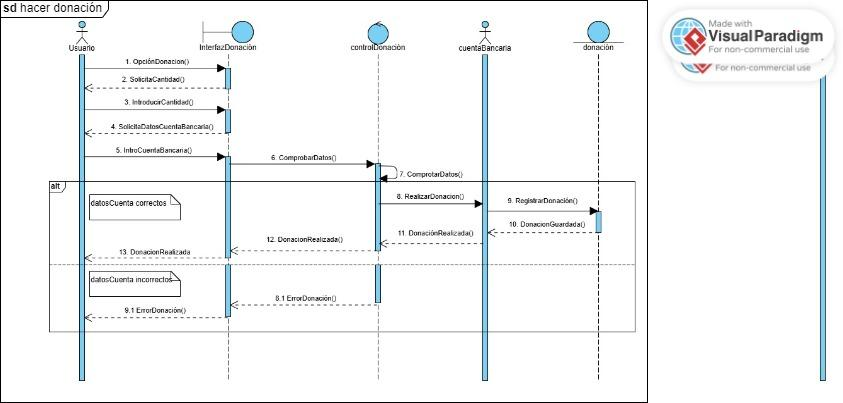
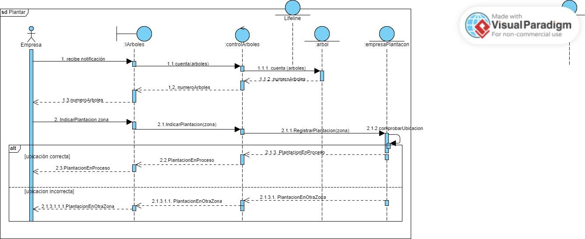
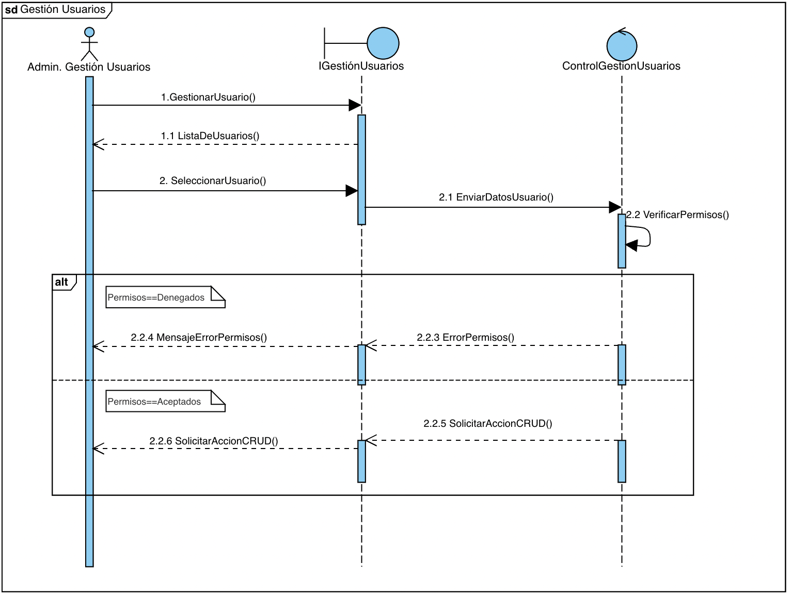
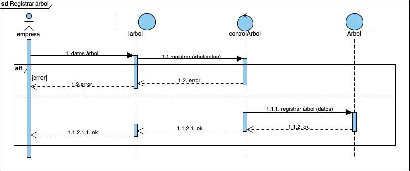
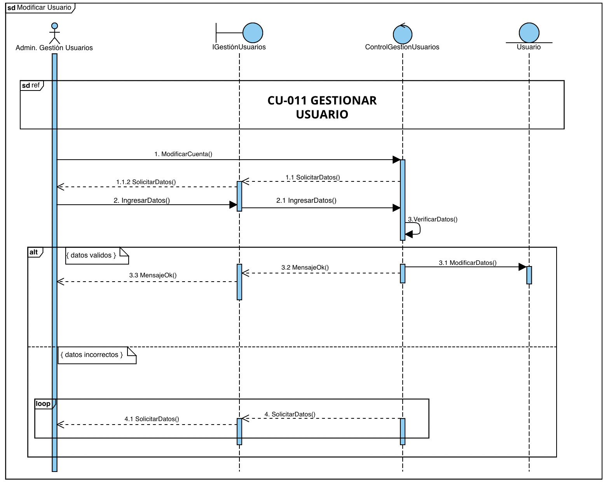
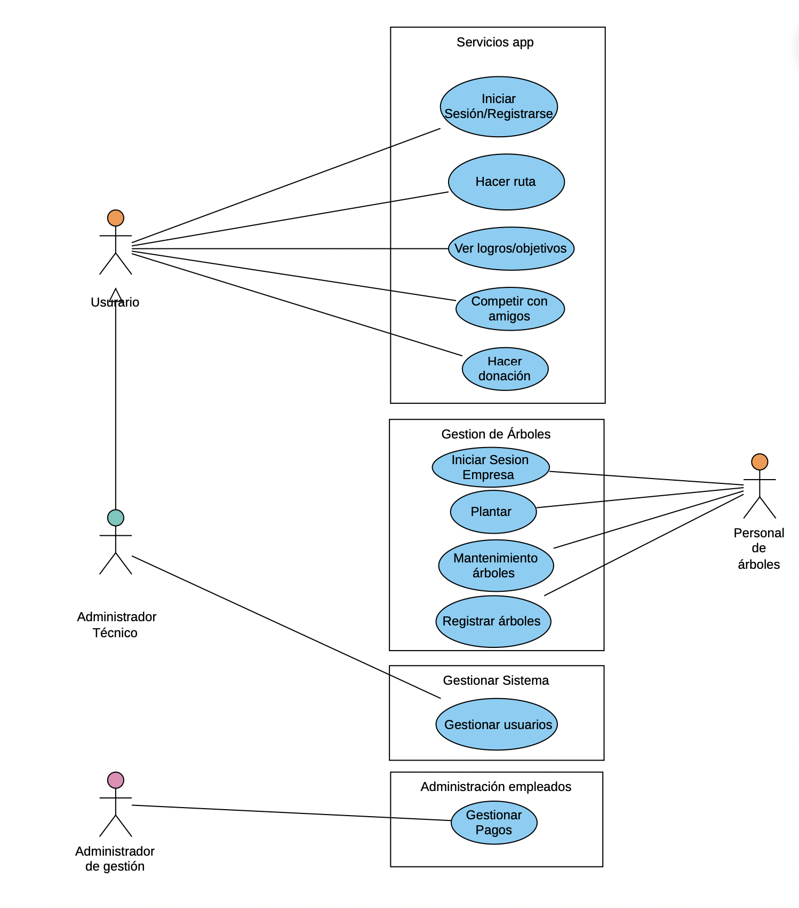
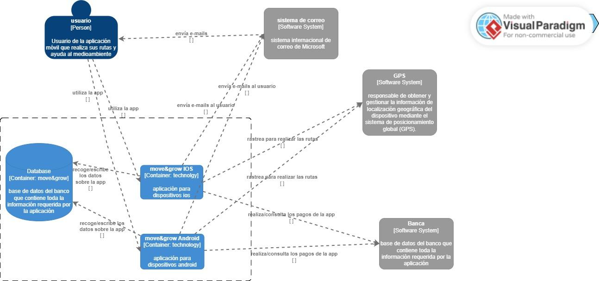
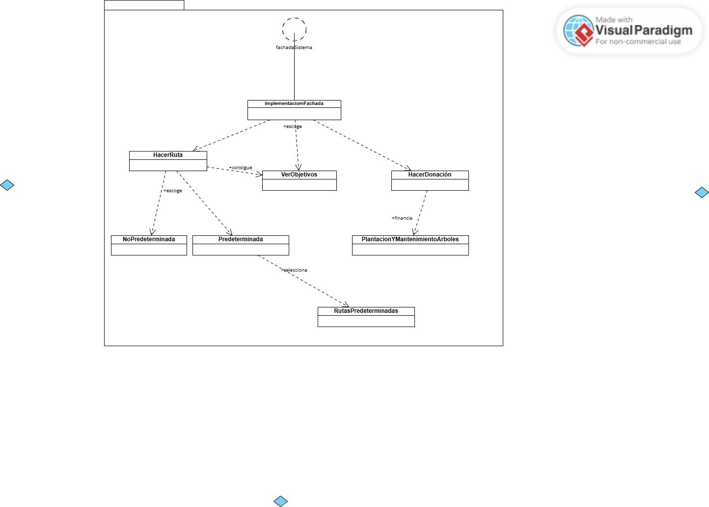
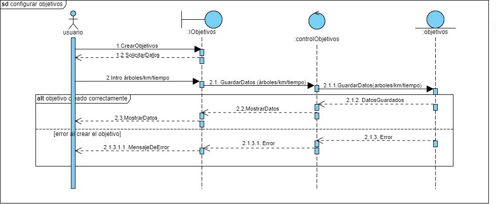

20 de mayo de 2025 - tercera versión

Ingeniería del software I

# MOVE&GROW

___

Beatriz del Barrio González

Camila Escobar Concha

Carolina Galán García

Lucía Carral Baleztena

Naroa Centurión Velasco

CAMINA, CUIDA, TRANSFORMA

Sembrando árboles gracias a tus pasos, construyendo un futuro más verde

Cada paso que das contribuye a un planeta más saludable. Los árboles son esenciales para combatir el cambio climático, absorber el dióxido de carbono y generar oxígeno.

Al caminar o usar el transporte público en lugar del coche, estás ayudando a reducir la huella de carbono y, gracias a tus pasos, estamos sembrando árboles para devolver al mundo un poco de lo que le hemos quitado.

CONTENIDOS:

## 1. Registro de Cambios

Hemos modificado la matriz de objetivos-requisitos, para que todos estén relacionados con los objetivos. Atendiendo a esta matriz los objetivos han sido añadidos correctamente a las tablas de los requisitos y los casos de uso.

Se han modificado los requisitos de acuerdo a las correcciones (han sido añadidos, eliminados y modificados), se han añadido sus tablas y se han rellenado en su mayoría. Como consecuencia, también ha habido que cambiar la matriz de requisitos con requisitos.

También hemos añadido un caso de uso más, el que ahora es el CU-004 Configurar objetivos, además de añadir las correcciones de los casos de uso indicadas en el Hito 1.

Para el Hito 3 hemos modificado los requisitos y los casos de uso. Algunos requisitos de información han sido omitidos, y se han añadido casos de uso en base a las opciones para gestionar los usuarios. Por ello, la matriz de objetivos-requisitos y la matriz de requisitos-requisitos se han corregido.

En el apartado de la memoria técnica hemos añadido información en las técnicas y herramientas.

El diagrama de clases del modelo de dominio también ha sido corregido, lo que ha implicado la creación de una tabla en el glosario de clases (la clase zona).

Se han añadido dos nuevos actores y el caso de uso gestionar usuario ha sido dividido en diferentes casos de uso.

## 2. Registro de uso de IA generativa

Durante la realización de este proyecto, hemos utilizado herramientas de inteligencia artificial generativa, como ChatGPT, de manera puntual y controlada. La hemos utilizado principalmente para reescribir algunos textos y resolver dudas puntuales que nos han ido surgiendo.

## 3. Memoria técnica

### 3.1. Introducción general del trabajo

La aplicación busca incentivar el uso de transporte sostenible (caminar, bicicleta, transporte público) de una manera divertida y competitiva. Los usuarios establecen rutas sostenibles en su vida diaria y, a medida que van logrando objetivos, se van plantando árboles en su nombre, contribuyendo así a la reforestación global y la lucha contra el cambio climático.

Esta memoria se organiza en varios apartados para facilitar su comprensión. En primer lugar, se introduce de forma general que aborda nuestra aplicación, seguida de la exposición de los objetivos funcionales identificados en la primera fase del proyecto. A continuación, se detallan las técnicas y herramientas utilizadas a lo largo del desarrollo, así como la organización interna del grupo de trabajo y la distribución de tareas. Posteriormente, se destacan los aspectos más relevantes que surgieron durante la realización de la práctica. Finalmente, se presentan las conclusiones que resumen la experiencia y los aprendizajes obtenidos durante el proyecto.

### 3.2. Objetivos

#### Rutas sostenibles:

La aplicación permitirá al usuario registrar todas sus rutas que sean beneficiosas para el medio ambiente, entre ellas el uso de transporte público (autobús, tren), caminar, utilizar bicicletas, patinete, entre otros. Permitirá registrarlas de varias maneras: rutas predeterminadas o no predeterminadas.

Rutas predeterminadas: Son aquellas que el usuario tenga ya registradas, como puede ser ir al trabajo, a la universidad o al supermercado

Rutas no predeterminadas: Son rutas espontáneas, como puede ser salir a correr, salir a dar una vuelta con amigos o pasear.

Se hace cuenta del tiempo total de estas rutas y al llegar a cierto objetivo, se planta un árbol en nombre del usuario.

#### Plantación de árboles:

A través de la donación de los usuarios a la aplicación, diversas empresas de reforestación que estén de voluntarios en el proyecto utilizaran los fondos para plantar árboles en zonas preasignadas. De esta manera se contribuye activamente al cuidado y recuperación del ecosistema.

#### Competencia amistosa:

La aplicación también fomentará la interacción entre usuarios. Estos podrán añadir amigos, y compartir con ellos sus logros y árboles que han ayudado a plantar. Este intercambio refuerza la motivación de los usuarios y su compromiso con el medio ambiente.

#### Promover actividad física:

Buscamos fomentar la actividad física incentivando a las personas a moverse más mediante el uso de la aplicación. Los usuarios serán motivados a través de recompensas relacionadas con la plantación y la interacción con amigos. De esta manera se fomenta el interés por la actividad física.

### 3.3. Técnicas y herramientas

La principal herramienta que hemos usado para este trabajo es Google Drive, esta plataforma la han sugerido los profesores para entregar el trabajo. En ella hemos creado una carpeta que luego hemos compartido con la profesora, y en ella hemos creado el documento principal, que este, y uno en sucio para poder compartir material entre nosotras más fácilmente. Como el documento principal estaba compartido entre todos los miembros, todos podíamos editarlo cuando quisiésemos, incluidos los profesores. En la corrección los profesores añadieron comentarios a ciertas partes para que nosotros pudiésemos verlos y corregir el trabajo.

Además también hemos usado mucho Telegram, una aplicación de mensajería. Creamos un chat grupal para hablar entre nosotras, al que también fue añadido un bot. Este bot ha estado registrando nuestros mensajes, y ha elaborado un informe con la participación de cada miembro que han podido leer los profesores. A través de esta aplicación nosotras hemos podido hablar y organizarnos cuando no podíamos hacerlo presencialmente. Y también hemos utilizado Trello, que era también una herramienta de comunicación. Es una especie de agenda virtual donde dejábamos constancia del trabajo realizado y a realizar para que el resto de integrantes lo viesen.

Otras herramientas usadas han sido: Studium, el campus virtual oficial de la Universidad de Salamanca, donde los profesores han colgado material de ayuda y guía; Whatsapp, otra aplicación de mensajería que también hemos usado para comunicarnos; ChatGPT, una inteligencia artificial online que hemos usado en ciertas partes específicas como recurso de información; y Google Meet, una aplicación de videollamadas que hemos usado para trabajar juntas.

Dentro del material proporcionado por los profesores, destacan el Proceso Unificado con enfoque ágil que establece los pasos principales y las herramientas necesarias para el desarrollo de un software , y el método de Durán y Bernárdez, que establece una metodología para la elicitación de requisitos. Ambos los hemos visto en clase y además disponemos de vídeos y documentos sobre ellos.

Nuestro principal método de trabajo ha sido llamarnos y repartirnos el trabajo, así si alguna tenía alguna duda o problema enseguida lo podía comunicar y pedir ayuda, ha sido muy práctico y cómodo porque hablábamos mientras trabajábamos, y también ha ayudado que este trabajo haya sido tan fácil de repartir.

### 3.4. Descripción del grupo de trabajo

Los datos de los miembros del grupo son los siguientes:

- Beatriz del Barrio González.

- Carolina Galán García.

- Camila Escobar Concha.

- Lucía Carral Baleztena.

- Naroa Centurión Velasco.

En un principio decidimos que tendríamos los siguientes roles:

- Coordinadora, Lucía.

- Controlador de Trello, Camila.

- Supervisor de tareas o analista, Carol.

- Portavoz, Naroa.

- Mediadora, Beatriz.

Finalmente, durante la realización de los dos primeros hitos no hemos dado demasiada importancia a los roles y todas hemos ido adoptando en algún momento cada rol sin darnos cuenta ni dejándolo reflejado en ningún documento.

Para el primer hito, nos organizamos repartiendo los diferentes apartados indicados en la rúbrica de evaluación, asegurándonos de que todas las secciones quedaran correctamente cubiertas. El diagrama de casos de uso fue elaborado de manera conjunta por todo el grupo.

Beatriz se encargó de la parte estética del documento, incluyendo la creación de la portada, la tabla de contenidos y la definición del estilo general. Además, junto a Carolina, desarrolló los apartados de requisitos de información y requisitos no funcionales.

Carolina, de manera individual, realizó también la matriz de rastreabilidad entre requisitos.

Por su parte, Lucía y Camila se ocuparon de describir los objetivos del proyecto y de confeccionar las tablas de casos de uso.

Naroa se encargó de la descripción de los actores y de la elaboración de la matriz de rastreabilidad entre objetivos y requisitos.

Una vez tuvimos la primera corrección cada una de las integrantes se encargó de corregir sus respectivas partes atendiendo a las anotaciones del documento.

Para la realización del segundo hito, comenzamos trabajando en conjunto en la elaboración del diagrama de clases del modelo de dominio, el cual expusimos posteriormente en clase.
Posteriormente, organizamos una reunión mediante Google Meet, en la que cada integrante se encargó de redactar una parte de la memoria técnica, además de resolver en equipo las dudas pendientes por corregir.

Para la elaboración del glosario de clases, decidimos dividirnos el trabajo: asignamos a cada integrante varias clases del diagrama para completar las respectivas tablas de manera individual.

Por otro lado, tratamos de mantener actualizado el tablero de Trello para reflejar el estado de las tareas. Sin embargo, esta herramienta no tuvo demasiado éxito, ya que al organizarnos principalmente a través de Telegram, donde resolvíamos dudas y repartíamos tareas de forma más ágil, acabamos dejando de lado el uso de Trello.

Para el tercer y último hito, usamos la misma técnica, repartir el trabajo. En una llamada nos repartimos los diagramas de secuencia, Naroa y Carolina realizaron el glosario de términos y Lucía, Camila y Beatriz se encargaron del modelo C4 y la propuesta de arquitectura.

### 3.5. Aspectos relevantes

La creación del diagrama de casos de uso ha sido una de las partes del Hito 1 que más  se nos dificultó. Definir los actores no lo fue tanto, pero identificar cada caso de uso sí, al igual que definirlo posteriormente. Además, el diseño del paso a paso de cada caso de uso en la parte de las tablas, aunque algunos no tenían gran dificultad, otros sí han sido más complejos de definir. A la hora de definir algún caso de uso, tuvimos que volver a diseñar el diagrama, lo que requería volver a invertirle tiempo a esa parte del trabajo.

A la hora de hacer la matriz de relación de objetivos con requisitos también le tuvimos que dar vueltas en conjunto, aunque algunos requisitos eran más claros con qué objetivo iban, otros en un inicio no le encontrábamos relación con ninguno.

La parte que nos resultó más difícil del segundo hito fue la del modelo de dominio. Nos costó bastante identificar las clases correctas, ya que decidir qué objetos deberían ser clases y qué relaciones debían existir entre ellas fue todo un reto, las relaciones entre clases también fueron complicadas, ya que tuvimos que definir si debían ser uno a muchos, muchos a muchos, o si había relaciones jerárquicas, lo que requirió mucho análisis y reflexión para asegurarnos de que el modelo fuera lo más preciso y eficiente posible.

### 3.6. Conclusiones

La realización de este proyecto nos ha permitido no solo aplicar los conocimientos teóricos adquiridos en clase, sino también desarrollar habilidades prácticas fundamentales para el trabajo en equipo y la gestión de proyectos. A lo largo de las distintas fases del trabajo, hemos aprendido la importancia de una buena comunicación interna, de la correcta distribución de tareas y de la flexibilidad a la hora de adaptarnos a imprevistos y dificultades.

Asimismo, hemos experimentado de primera mano el valor de combinar herramientas digitales para la colaboración, aunque también hemos aprendido que no todas las herramientas son igual de efectivas según el contexto del grupo. En nuestro caso, Telegram se consolidó como la vía principal de organización frente a otras plataformas como Trello.

Desde el punto de vista personal y grupal, este proyecto nos ha ayudado a mejorar nuestras habilidades de comunicación, organización, gestión del tiempo y resolución de conflictos, así como a reforzar nuestro compromiso con un objetivo común. Además, nos ha motivado especialmente el propósito sostenible y social de la aplicación, lo que añadió un componente de motivación y responsabilidad extra al trabajo realizado.

En conclusión, el desarrollo de este proyecto ha sido una experiencia enriquecedora tanto a nivel académico como personal, permitiéndonos consolidar conocimientos, identificar áreas de mejora y adquirir competencias esenciales para nuestro futuro profesional.

## 4. Objetivos:

### 4.1. Rutas sostenibles:

### 4.2. Plantación de árboles:

### 4.3. Competencia amistosa:

### 4.4. Promover la actividad física:

## 5. Requisitos de información (IRQ)

### 5.1.IRQ-001- Usuario

### 5.2. IRQ-002-Ruta nueva

### 5.3. IRQ- 003 Ruta predeterminada

### 5.4.IRQ-004 Objetivos

### 5.5. IRQ-005 Historial de objetivos.

### 5.6. IRQ-006 Compartir logros.

### 5.7. IRQ-007 Donación.

### 5.8. IRQ-008 Empresa.

## 6. Requisitos no funcionales (NFR)

### 6.1. NFR-001 Seguridad de los datos

### 6.2. NFR-002 Interfaz sencilla e intuitiva

### 6.3. NFR-003 Plazo de plantación

### 6.4. NFR-004 Leyes del país donde se realice la plantación

### 6.5. NFR-005 Aplicación móvil

### 6.6. NFR-006 Contestación del sistema

### 6.7. NFR-007 Actualización del código

### 6.8. NFR-008 Uso de buenas prácticas de desarrollo

### 6.9. NFR-009 Prevención de caídas

## 7 .Diagrama de casos de uso

## 8. Descripción de los actores

### 8.1. ACT-001 usuario

### 8.2. ACT-002 personal de árboles

### 8.3. ACT-003 administrador técnico

### 8.4. ACT-004 administrador de gestión

### 8.5. ACT-005 GPS

### 8.6. ACT-006 CUENTA BANCARIA

## 9. Tablas de casos de uso

Se utiliza esta tabla en vez de la tabla de Requisitos Funcionales:

### 9.1. CU-001 Iniciar sesión/registrarse

### 9.2. CU-002 Hacer ruta

### 9.3. CU 003 Ver logros/objetivos

### 9.4. CU-004 Configurar objetivos

### 9.5. CU-005 Competir con amigos

### 9.6. CU-006 Hacer donación

### 9.7. CU-007 Iniciar sesión empresa

### 9.8. CU-008 Plantar

### 9.9. CU-009 Mantenimiento de árboles

### 9.10. CU-010 Registrar árboles.

### 9.11. CU-011. Gestionar usuarios.

### 9.12. CU-012. Activar usuario.

### 9.13. CU-013. Desactivar usuario.

### 9.14. CU-014. Modificar usuarios.

### 9.15. CU-015 Gestionar pagos

## 10. Matriz de objetivos con requisitos

## 11. Matriz de requisitos con requisitos

## 12 .Diagrama de clases del modelo de dominio

## 13. Glosario de clases

## 14. Vista de interacción

A continuación se muestran los diagramas de secuencia de los diferentes casos de uso.

### 14.1. DS CU-001 Iniciar sesión/registrarse

### 14.2. DS CU-002 Hacer ruta

### 14.3. DS CU-003 Ver logros/objetivos

### 14.4. DS CU-004 Configurar objetivos

### 14.5. DS CU-005 Competir con amigos

### 14.6. DS CU-006 Hacer donación

### 14.7. DS CU-007 Iniciar sesión empresa

### 14.8. DS CU-008 Plantar

### 14.9. DS CU-009 Mantenimiento de árboles

### 14.10. DS CU-010 Registrar árboles

### 14.11. DS CU-011 Gestionar usuarios

### 14.12. DS CU-014 Activar usuario

### 14.13. DS CU-013 Desactivar Usuario

### 14.14. DS CU-014 Modificar usuario

### 14.15. DS CU-015 Gestionar pagos

## 15. Propuesta de arquitectura

## 16. Modelo C4

### Nivel de contexto

### Nivel de contenedores

### Nivel de componentes

### Nivel de código

## 17. Glosario de términos

Actores. Es un clasificador que modela un tipo de rol que juega una entidad que interacciona con el sujeto pero que es externa a él, un actor puede tener múltiples instancias físicas, una instancia física de un actor puede jugar diferentes papeles. Vendrán definidos por las plantillas del Método de Durán y Bernández, solo pueden tener asociaciones con casos de uso, subsistemas, componentes y clases, las asociaciones deben ser binarias.

Hay tres tipos de actores:

Principales: Tienen objetivos de usuario que se satisfacen mediante el uso de los servicios del sistema. Se identifican para encontrar los objetivos de usuario, los cuales dirigen los casos de uso.

De apoyo: Proporcionan un servicio al sistema, normalmente se trata de un sistema informático, pero podría ser una organización o una persona. Se identifican para clarificar las interfaces externas y los protocolos.

Pasivos: Están interesados en el comportamiento del caso de uso, pero no es principal ni de apoyo. Se identifican para asegurar que todos los intereses necesarios se han identificado y satisfecho.

Casos de uso. Conjunto de acciones realizadas por el sistema que dan lugar a un resultado observable. Especifica un comportamiento que el sujeto puede realizar en colaboración con uno o más actores, pero sin hacer referencia a su estructura interna. Puede contener posibles variaciones de su comportamiento básico incluyendo manejo de errores y excepciones. Vendrán definidos por las plantillas del Método de Durán y Bernández.

Clases. Clasificador que describe un conjunto de objetos que comparten la misma especificación de características, restricciones y semántica. Describe las propiedades y comportamiento de un grupo de objetos.

Diagrama de clases. Representación gráfica que muestra la relación entre los actores y los casos de uso o funcionalidades del sistema.

Diagrama de secuencia. Unidad de comportamiento que se centra en el intercambio de información observable entre elementos que pueden conectarse. Hacen hincapié en la secuencia de intercambio de mensajes entre objetos.

Tiene dos usos diferentes:

Forma de instancia, describe un escenario específico, una posible interacción.

Forma genérica, describe todas las posibles alternativas en un escenario. Puede incluir ramas, condiciones y bucles.

Memoria técnica. Introducción al trabajo, indica los aspectos técnicos principales y los explica.

Matriz de rastreabilidad obj-req. Matriz que relaciona los requisitos y los casos de uso con los objetivos. Si un requisito o caso de uso está relacionado con un objetivo (si viene definido en la tabla) se anota una cruz (o un 1, dependiendo de la notación).

Matriz de rastreabilidad req-req. Matriz que relaciona los requisitos entre ellos y los casos de uso. Si un requisito está relacionado con otro requisito o con un caso de uso (si viene definido en la tabla) se anota una cruz (o un 1, dependiendo de la notación).

Modelo C4.  Surge como solución para aliviar la brecha entre modelo y código, permite comunicar la arquitectura de un sistema en función del detalle que se quiera proporcionar. Está basado en cuatro niveles que describen el sistema con distintos grados de granularidad:

El nivel de contexto.

El nivel de contenedores.

El nivel de componentes.

El nivel de código.

Modelo de dominio. Representación de las clases conceptuales del mundo real, no de componentes software. No se trata de un conjunto de diagramas que describen clases software, u objetos software con responsabilidades.

Objetivos. La aplicación será creada y desarrollada para cumplir unos objetivos, pueden ser económicos, sociales, medioambientales, u otros. Vendrán definidos por las plantillas del Método de Durán y Bernández.

Propuesta arquitectónica. Define la estructura y organización de un sistema de software, incluyendo los componentes, sus interacciones y cómo se adaptan a los requisitos funcionales y no funcionales del sistema.

Requisitos de información. Condición o capacidad que un usuario necesita para resolver un problema o lograr un objetivo. Vendrán definidos por las plantillas del Método de Durán y Bernández.

Requisitos no funcionales. Condición o capacidad que debe tener un sistema o un componente de un sistema para satisfacer un contrato, una norma, una especificación u otro documento formal. Vendrán definidos por las plantillas del Método de Durán y Bernández.

### Tabla 1

| OBJ-<001> | Rutas sostenibles |

| --- | --- |

| Versión | 1.0  |

| Autores | Lucía Carral Baleztena
Camila Escobar Concha
Beatriz del Barrio González
Naroa Centurión Velasco
Carolina Galán García |

| Fuentes |  |

| Descripción | La aplicación permitirá al usuario registrar todas sus rutas que sean beneficiosas para el medio ambiente, entre ellas el uso de transporte público (autobús, tren), caminar, utilizar bicicletas, patinete, entre otros. Permitirá registrarlas de varias maneras: rutas predeterminadas o no predeterminadas. 
Rutas predeterminadas: Son aquellas que el usuario tenga ya registradas, como puede ser ir al trabajo, a la universidad o al supermercado
Rutas no predeterminadas: Son rutas espontáneas, como puede ser salir a correr, salir a dar una vuelta con amigos o pasear.
Se hace cuenta del tiempo total de estas rutas y al llegar a cierto objetivo, se planta un árbol en nombre del usuario.  |

| Importancia | Alta |

| Estado | Implementado |

### Tabla 2

| OBJ-<002> | Plantación de árboles |

| --- | --- |

| Versión |  1.0  |

| Autores | Lucía Carral Baleztena
Camila Escobar Concha
Beatriz del Barrio González
Naroa Centurión Velasco
Carolina Galán García |

| Fuentes |  |

| Descripción | A través de la donación de los usuarios a la aplicación, diversas empresas de reforestación que estén de voluntarios en el proyecto utilizaran los fondos para plantar árboles en zonas preasignadas. De esta manera se contribuye activamente al cuidado y recuperación del ecosistema.
 |

| Importancia | Alta |

| Estado | Implementado |

### Tabla 3

| OBJ-<003> | Competencia amistosa |

| --- | --- |

| Versión |  1.0  |

| Autores | Lucía Carral Baleztena
Camila Escobar Concha
Beatriz del Barrio González
Naroa Centurión Velasco
Carolina Galán García |

| Fuentes |  |

| Descripción | La aplicación también fomentará la interacción entre usuarios. Estos podrán añadir amigos, y compartir con ellos sus logros y árboles que han ayudado a plantar. Este intercambio refuerza la motivación de los usuarios y su compromiso con el medio ambiente. |

| Importancia | Alta |

| Estado | Implementado |

### Tabla 4

| OBJ-<004> | Promover la actividad física |

| --- | --- |

| Versión |  1.0  |

| Autores | Lucía Carral Baleztena
Camila Escobar Concha
Beatriz del Barrio González
Naroa Centurión Velasco
Carolina Galán García |

| Fuentes |  |

| Descripción | Buscamos fomentar la actividad física incentivando a las personas a moverse más mediante el uso de la aplicación. Los usuarios serán motivados a través de recompensas relacionadas con la plantación y la interacción con amigos. De esta manera se fomenta el interés por la actividad física. |

| Importancia | Alta |

| Estado | Implementado |

### Tabla 5

| IRQ-001 | Usuario | Usuario |

| --- | --- | --- |

| Versión | 2.0 (13 de mayo) | 2.0 (13 de mayo) |

| Autores | Camila Escobar Concha
Lucía Carral Baleztena
Beatriz del Barrio González
Carolina Galán García
Naroa Centurión Velasco
 (Universidad de Salamanca) | Camila Escobar Concha
Lucía Carral Baleztena
Beatriz del Barrio González
Carolina Galán García
Naroa Centurión Velasco
 (Universidad de Salamanca) |

| Fuentes |  |  |

| Objetivos asociados | ·        OBJ - 001 Rutas sostenibles.
·        OBJ - 002 Plantación de árboles.
·        OBJ - 003 Competición amistosa.
·        OBJ - 004 Promover la actividad física. | ·        OBJ - 001 Rutas sostenibles.
·        OBJ - 002 Plantación de árboles.
·        OBJ - 003 Competición amistosa.
·        OBJ - 004 Promover la actividad física. |

| Requisitos asociados | IRQ- 007 Compartir logros. | IRQ- 007 Compartir logros. |

| Descripción | El sistema deberá permitir al usuario:
 Registrarse, si no tiene una cuenta: deberá almacenar la información correspondiente al registro del usuario. En concreto: los datos personales del usuario.
Iniciar sesión, si ya tiene una cuenta registrada: para ello requerirá ciertos datos. En concreto: el nombre de usuario y la contraseña. 
Tener amistades, para lo que tendrá un buscador para poder encontrar a sus amigos y establecer amistades entre los usuarios. Deberá almacenar el nombre de usuario de estos. | El sistema deberá permitir al usuario:
 Registrarse, si no tiene una cuenta: deberá almacenar la información correspondiente al registro del usuario. En concreto: los datos personales del usuario.
Iniciar sesión, si ya tiene una cuenta registrada: para ello requerirá ciertos datos. En concreto: el nombre de usuario y la contraseña. 
Tener amistades, para lo que tendrá un buscador para poder encontrar a sus amigos y establecer amistades entre los usuarios. Deberá almacenar el nombre de usuario de estos. |

| Datos  | Nombre.
Apellidos. 
Edad.
Correo electrónico/número de teléfono
Contraseña.
Nombre de usuario 
Contraseña
Nombre de usuario de las amistades | Nombre.
Apellidos. 
Edad.
Correo electrónico/número de teléfono
Contraseña.
Nombre de usuario 
Contraseña
Nombre de usuario de las amistades |

| Tiempo de vida | Medio | Máximo |

| Tiempo de vida | <tiempo medio de vida> | <tiempo máximo de vida> |

| Ocurrencias simult. | Medio | Máximo |

| Ocurrencias simult. | <nº medio de ocurr. simult.> | <nº máximo de ocurr. simult.> |

| Importancia | <importancia del requisito> | <importancia del requisito> |

| Urgencia | <urgencia del requisito> | <urgencia del requisito> |

| Estado | <estado del requisito> | <estado del requisito> |

| Estabilidad | <estabilidad del requisito> | <estabilidad del requisito> |

| Comentarios | La información se comprueba y si algo no es correcto se vuelve a pedir.
Si todo sale bien se accede a la página de inicio | La información se comprueba y si algo no es correcto se vuelve a pedir.
Si todo sale bien se accede a la página de inicio |

### Tabla 6

| IRQ-002 | Ruta nueva | Ruta nueva |

| --- | --- | --- |

| Versión | 1.0 (9 de abril) | 1.0 (9 de abril) |

| Autores | Camila Escobar Concha
Lucía Carral Baleztena
Beatriz del Barrio González
Carolina Galán García
Naroa Centurión Velasco
 (Universidad de Salamanca) | Camila Escobar Concha
Lucía Carral Baleztena
Beatriz del Barrio González
Carolina Galán García
Naroa Centurión Velasco
 (Universidad de Salamanca) |

| Fuentes |  |  |

| Objetivos asociados | OBJ- 001 Rutas sostenibles. | OBJ- 001 Rutas sostenibles. |

| Requisitos asociados | 
 | 
 |

| Descripción | El sistema deberá permitir al usuario inicializar y finalizar nuevas rutas, para ello requerirá cierta información sobre ella. | El sistema deberá permitir al usuario inicializar y finalizar nuevas rutas, para ello requerirá cierta información sobre ella. |

| Datos  | Ubicación de origen y destino.
Tipo de ruta.
Método de transporte ( caminar, bicicleta, patinete, autobús y metro). | Ubicación de origen y destino.
Tipo de ruta.
Método de transporte ( caminar, bicicleta, patinete, autobús y metro). |

| Tiempo de vida | Medio | Máximo |

| Tiempo de vida | <tiempo medio de vida> | <tiempo máximo de vida> |

| Ocurrencias simult. | Medio | Máximo |

| Ocurrencias simult. | <nº medio de ocurr. simult.> | <nº máximo de ocurr. simult.> |

| Importancia | <importancia del requisito> | <importancia del requisito> |

| Urgencia | <urgencia del requisito> | <urgencia del requisito> |

| Estado | <estado del requisito> | <estado del requisito> |

| Estabilidad | <estabilidad del requisito> | <estabilidad del requisito> |

| Comentarios |  La información sobre cada ruta que hace el usuario debe quedar guardada en un historial asociado a la cuenta.
 Si al finalizar la ruta se ha alcanzado algún objetivo, se actualiza la información de objetivos asociada. |  La información sobre cada ruta que hace el usuario debe quedar guardada en un historial asociado a la cuenta.
 Si al finalizar la ruta se ha alcanzado algún objetivo, se actualiza la información de objetivos asociada. |

### Tabla 7

| IRQ-003 | Ruta predeterminada  | Ruta predeterminada  |

| --- | --- | --- |

| Versión | 1.0 (9 de abril) | 1.0 (9 de abril) |

| Autores | Camila Escobar Concha
Lucía Carral Baleztena
Beatriz del Barrio González
Carolina Galán García
Naroa Centurión Velasco
 (Universidad de Salamanca) | Camila Escobar Concha
Lucía Carral Baleztena
Beatriz del Barrio González
Carolina Galán García
Naroa Centurión Velasco
 (Universidad de Salamanca) |

| Fuentes |  |  |

| Objetivos asociados | OBJ- 001 Rutas sostenibles. | OBJ- 001 Rutas sostenibles. |

| Requisitos asociados | 
IRQ- 002 Ruta nueva. | 
IRQ- 002 Ruta nueva. |

| Descripción | El sistema deberá permitir al usuario establecer una ruta predeterminada, para ello guardará los datos obtenidos al crear una ruta y los guardará como una ruta predeterminada bajo un nombre. | El sistema deberá permitir al usuario establecer una ruta predeterminada, para ello guardará los datos obtenidos al crear una ruta y los guardará como una ruta predeterminada bajo un nombre. |

| Datos  | Nombre de la ruta.
Ubicación de origen y destino.
Tipo de ruta.
Método de transporte ( caminar, bicicleta, patinete, autobús y metro). | Nombre de la ruta.
Ubicación de origen y destino.
Tipo de ruta.
Método de transporte ( caminar, bicicleta, patinete, autobús y metro). |

| Tiempo de vida | Medio | Máximo |

| Tiempo de vida | <tiempo medio de vida> | <tiempo máximo de vida> |

| Ocurrencias simult. | Medio | Máximo |

| Ocurrencias simult. | <nº medio de ocurr. simult.> | <nº máximo de ocurr. simult.> |

| Importancia | <importancia del requisito> | <importancia del requisito> |

| Urgencia | <urgencia del requisito> | <urgencia del requisito> |

| Estado | <estado del requisito> | <estado del requisito> |

| Estabilidad | <estabilidad del requisito> | <estabilidad del requisito> |

| Comentarios |  La información sobre cada ruta que hace el usuario debe quedar guardada en un historial asociado a la cuenta.
 Si al finalizar la ruta se ha alcanzado algún objetivo, se actualiza la información de objetivos asociada. |  La información sobre cada ruta que hace el usuario debe quedar guardada en un historial asociado a la cuenta.
 Si al finalizar la ruta se ha alcanzado algún objetivo, se actualiza la información de objetivos asociada. |

### Tabla 8

| IRQ-004 | Objetivos  | Objetivos  |

| --- | --- | --- |

| Versión | 1.0 (9 de abril) | 1.0 (9 de abril) |

| Autores | Camila Escobar Concha
Lucía Carral Baleztena
Beatriz del Barrio González
Carolina Galán García
Naroa Centurión Velasco
 (Universidad de Salamanca) | Camila Escobar Concha
Lucía Carral Baleztena
Beatriz del Barrio González
Carolina Galán García
Naroa Centurión Velasco
 (Universidad de Salamanca) |

| Fuentes |  |  |

| Objetivos asociados | OBJ- 003  Competición amistosa.
OBJ- 004  Promover la actividad física. | OBJ- 003  Competición amistosa.
OBJ- 004  Promover la actividad física. |

| Requisitos asociados | 
IRQ- 002 Ruta nueva.
IRQ- 003 Ruta predeterminada.
 | 
IRQ- 002 Ruta nueva.
IRQ- 003 Ruta predeterminada.
 |

| Descripción | El sistema deberá permitir al usuario crear objetivos y ver los detalles de los objetivos establecidos por el sistema, este guardará los siguientes datos respecto a los objetivos: | El sistema deberá permitir al usuario crear objetivos y ver los detalles de los objetivos establecidos por el sistema, este guardará los siguientes datos respecto a los objetivos: |

| Datos  | Nombre del objetivo.
Descripción del objetivo.
Estado del objetivo (booleano). | Nombre del objetivo.
Descripción del objetivo.
Estado del objetivo (booleano). |

| Tiempo de vida | Medio | Máximo |

| Tiempo de vida | <tiempo medio de vida> | <tiempo máximo de vida> |

| Ocurrencias simult. | Medio | Máximo |

| Ocurrencias simult. | <nº medio de ocurr. simult.> | <nº máximo de ocurr. simult.> |

| Importancia | <importancia del requisito> | <importancia del requisito> |

| Urgencia | <urgencia del requisito> | <urgencia del requisito> |

| Estado | <estado del requisito> | <estado del requisito> |

| Estabilidad | <estabilidad del requisito> | <estabilidad del requisito> |

| Comentarios | Una vez un objetivo se marca completado (estado), este se convierte en un logro (objetivo cumplido). | Una vez un objetivo se marca completado (estado), este se convierte en un logro (objetivo cumplido). |

### Tabla 9

| IRQ-005 | Historial de objetivos  | Historial de objetivos  |

| --- | --- | --- |

| Versión | 1.0 (9 de abril) | 1.0 (9 de abril) |

| Autores | Camila Escobar Concha
Lucía Carral Baleztena
Beatriz del Barrio González
Carolina Galán García
Naroa Centurión Velasco
 (Universidad de Salamanca) | Camila Escobar Concha
Lucía Carral Baleztena
Beatriz del Barrio González
Carolina Galán García
Naroa Centurión Velasco
 (Universidad de Salamanca) |

| Fuentes |  |  |

| Objetivos asociados | OBJ- 004  Promover la actividad física. | OBJ- 004  Promover la actividad física. |

| Requisitos asociados | IRQ- 002 Ruta nueva.
IRQ- 003 Ruta predeterminada.
IRQ- 004 Objetivos  | IRQ- 002 Ruta nueva.
IRQ- 003 Ruta predeterminada.
IRQ- 004 Objetivos  |

| Descripción | El sistema deberá mostrar la información correspondiente a los objetivos y los logros, ya sean creados por el usuario o establecidos por el sistema. En concreto: | El sistema deberá mostrar la información correspondiente a los objetivos y los logros, ya sean creados por el usuario o establecidos por el sistema. En concreto: |

| Datos  | Nombre del objetivo
Descripción del objetivo.
Estado del objetivo. | Nombre del objetivo
Descripción del objetivo.
Estado del objetivo. |

| Tiempo de vida | Medio | Máximo |

| Tiempo de vida | <tiempo medio de vida> | <tiempo máximo de vida> |

| Ocurrencias simult. | Medio | Máximo |

| Ocurrencias simult. | <nº medio de ocurr. simult.> | <nº máximo de ocurr. simult.> |

| Importancia | <importancia del requisito> | <importancia del requisito> |

| Urgencia | <urgencia del requisito> | <urgencia del requisito> |

| Estado | <estado del requisito> | <estado del requisito> |

| Estabilidad | <estabilidad del requisito> | <estabilidad del requisito> |

| Comentarios | En cuanto al estado de un objetivo, al marcarse como completado (estado), este se convierte en un logro (objetivo cumplido). | En cuanto al estado de un objetivo, al marcarse como completado (estado), este se convierte en un logro (objetivo cumplido). |

### Tabla 10

| IRQ-006 | Compartir logros | Compartir logros |

| --- | --- | --- |

| Versión | 1.0 (9 de abril) | 1.0 (9 de abril) |

| Autores | Camila Escobar Concha
Lucía Carral Baleztena
Beatriz del Barrio González
Carolina Galán García
Naroa Centurión Velasco
 (Universidad de Salamanca) | Camila Escobar Concha
Lucía Carral Baleztena
Beatriz del Barrio González
Carolina Galán García
Naroa Centurión Velasco
 (Universidad de Salamanca) |

| Fuentes |  |  |

| Objetivos asociados |             ·        OBJ - 003 Competición amistosa.
·        OBJ - 004 Promover la actividad física. |             ·        OBJ - 003 Competición amistosa.
·        OBJ - 004 Promover la actividad física. |

| Requisitos asociados | IRQ- 004 Objetivos 
IRQ- 005 Historial de objetivos. | IRQ- 004 Objetivos 
IRQ- 005 Historial de objetivos. |

| Descripción | El sistema deberá permitir al usuario compartir con sus amigos los logros alcanzados. | El sistema deberá permitir al usuario compartir con sus amigos los logros alcanzados. |

| Datos  | Nombre del logro.
Descripción del logro. | Nombre del logro.
Descripción del logro. |

| Tiempo de vida | Medio | Máximo |

| Tiempo de vida | <tiempo medio de vida> | <tiempo máximo de vida> |

| Ocurrencias simult. | Medio | Máximo |

| Ocurrencias simult. | <nº medio de ocurr. simult.> | <nº máximo de ocurr. simult.> |

| Importancia | <importancia del requisito> | <importancia del requisito> |

| Urgencia | <urgencia del requisito> | <urgencia del requisito> |

| Estado | <estado del requisito> | <estado del requisito> |

| Estabilidad | <estabilidad del requisito> | <estabilidad del requisito> |

| Comentarios | Los logros solo podrán compartirse si existe una relación de amistad entre los usuarios. | Los logros solo podrán compartirse si existe una relación de amistad entre los usuarios. |

### Tabla 11

| IRQ-007 | Donación | Donación |

| --- | --- | --- |

| Versión | 1.0 (9 de abril) | 1.0 (9 de abril) |

| Autores | Camila Escobar Concha
Lucía Carral Baleztena
Beatriz del Barrio González
Carolina Galán García
Naroa Centurión Velasco
 (Universidad de Salamanca) | Camila Escobar Concha
Lucía Carral Baleztena
Beatriz del Barrio González
Carolina Galán García
Naroa Centurión Velasco
 (Universidad de Salamanca) |

| Fuentes |  |  |

| Objetivos asociados | OBJ- 002  Plantación de árboles. | OBJ- 002  Plantación de árboles. |

| Requisitos asociados |  |  |

| Descripción | Los usuarios podrán realizar donaciones para contribuir con la aplicación y favorecer la plantación de árboles. | Los usuarios podrán realizar donaciones para contribuir con la aplicación y favorecer la plantación de árboles. |

| Datos  | Cantidad a abonar.
Método de pago.
Datos necesarios para el pago. | Cantidad a abonar.
Método de pago.
Datos necesarios para el pago. |

| Tiempo de vida | Medio | Máximo |

| Tiempo de vida | <tiempo medio de vida> | <tiempo máximo de vida> |

| Ocurrencias simult. | Medio | Máximo |

| Ocurrencias simult. | <nº medio de ocurr. simult.> | <nº máximo de ocurr. simult.> |

| Importancia | <importancia del requisito> | <importancia del requisito> |

| Urgencia | <urgencia del requisito> | <urgencia del requisito> |

| Estado | <estado del requisito> | <estado del requisito> |

| Estabilidad | <estabilidad del requisito> | <estabilidad del requisito> |

| Comentarios |  |  |

### Tabla 12

| IRQ-008 | Empresa | Empresa |

| --- | --- | --- |

| Versión | 2.0 (14 de mayo) | 2.0 (14 de mayo) |

| Autores | Camila Escobar Concha
Lucía Carral Baleztena
Beatriz del Barrio González
Carolina Galán García
Naroa Centurión Velasco
 (Universidad de Salamanca) | Camila Escobar Concha
Lucía Carral Baleztena
Beatriz del Barrio González
Carolina Galán García
Naroa Centurión Velasco
 (Universidad de Salamanca) |

| Fuentes |  |  |

| Objetivos asociados | OBJ- 002  Plantación de árboles. | OBJ- 002  Plantación de árboles. |

| Requisitos asociados | IRQ-001 Usuario. | IRQ-001 Usuario. |

| Descripción | Los usuarios trabajadores del sistema de plantación o de la aplicación podrán registrarse e iniciar sesión con un rol distinto. Para ello el sistema deberá almacenar los datos personales necesarios para ello.
La empresa que haya iniciado sesión en el sistema podrá recibir las peticiones de plantación de los usuarios y registrar su proceso. El sistema almacenará esta información. | Los usuarios trabajadores del sistema de plantación o de la aplicación podrán registrarse e iniciar sesión con un rol distinto. Para ello el sistema deberá almacenar los datos personales necesarios para ello.
La empresa que haya iniciado sesión en el sistema podrá recibir las peticiones de plantación de los usuarios y registrar su proceso. El sistema almacenará esta información. |

| Datos  | Nombre.
Apellidos. 
Edad.
Correo electrónico/número de teléfono.
Contraseña.
Nombre del usuario solicitante.
Información de registro del árbol. | Nombre.
Apellidos. 
Edad.
Correo electrónico/número de teléfono.
Contraseña.
Nombre del usuario solicitante.
Información de registro del árbol. |

| Tiempo de vida | Medio | Máximo |

| Tiempo de vida | <tiempo medio de vida> | <tiempo máximo de vida> |

| Ocurrencias simult. | Medio | Máximo |

| Ocurrencias simult. | <nº medio de ocurr. simult.> | <nº máximo de ocurr. simult.> |

| Importancia | <importancia del requisito> | <importancia del requisito> |

| Urgencia | <urgencia del requisito> | <urgencia del requisito> |

| Estado | <estado del requisito> | <estado del requisito> |

| Estabilidad | <estabilidad del requisito> | <estabilidad del requisito> |

| Comentarios |  |  |

### Tabla 13

| NFR-001 | Seguridad de los datos |

| --- | --- |

| Versión | 1.0 (9 de abril) |

| Autores | Camila Escobar Concha
Lucía Carral Baleztena
Beatriz del Barrio González
Carolina Galán García
Naroa Centurión Velasco
 (Universidad de Salamanca) |

| Fuentes | ·         <fuente de la versión actual> (<organización de la fuente>)
... |

| Objetivos asociados | ·        OBJ - 001 Rutas sostenibles.
·        OBJ - 002 Plantación de árboles.
·        OBJ - 003 Competición amistosa. |

| Requisitos asociados | ·        IRQ-001 Usuario |

| Descripción | El sistema deberá asegurar que la información que se pide al iniciar sesión está totalmente encriptada y sigue patrones de alta seguridad, y que la autenticación es segura para los usuarios registrados. |

| Importancia | <importancia del requisito> |

| Urgencia | <urgencia del requisito> |

| Estado | <estado del requisito> |

| Estabilidad | <estabilidad del requisito> |

| Comentarios | <comentarios adicionales sobre el requisito> |

### Tabla 14

| NFR-002 | Interfaz sencilla e intuitiva |

| --- | --- |

| Versión | 1.0 (9 de abril) |

| Autores | Camila Escobar Concha
Lucía Carral Baleztena
Beatriz del Barrio González
Carolina Galán García
Naroa Centurión Velasco
 (Universidad de Salamanca) |

| Fuentes | ·         <fuente de la versión actual> (<organización de la fuente>)
... |

| Objetivos asociados | ·        OBJ - 001 Rutas sostenibles.
·        OBJ - 003 Competición amistosa. |

| Requisitos asociados |  |

| Descripción | El sistema deberá mostrar una interfaz sencilla e intuitiva durante cualquier tipo de uso de la aplicación, con gráficos con la suficiente calidad. |

| Importancia | <importancia del requisito> |

| Urgencia | <urgencia del requisito> |

| Estado | <estado del requisito> |

| Estabilidad | <estabilidad del requisito> |

| Comentarios | <comentarios adicionales sobre el requisito> |

### Tabla 15

| NFR-003 | Plazo de plantación |

| --- | --- |

| Versión | 1.0 (9 de abril) |

| Autores | Camila Escobar Concha
Lucía Carral Baleztena
Beatriz del Barrio González
Carolina Galán García
Naroa Centurión Velasco
 (Universidad de Salamanca) |

| Fuentes | ·         <fuente de la versión actual> (<organización de la fuente>)
... |

| Objetivos asociados | OBJ- 002 Plantación de árboles. |

| Requisitos asociados |  |

| Descripción | Cuando un usuario consigue plantar un árbol, la plantación real del árbol debe ocurrir en el plazo de un mes. |

| Importancia | <importancia del requisito> |

| Urgencia | <urgencia del requisito> |

| Estado | <estado del requisito> |

| Estabilidad | <estabilidad del requisito> |

| Comentarios | <comentarios adicionales sobre el requisito> |

### Tabla 16

| NFR-004 | Leyes del país donde se realice la plantación. |

| --- | --- |

| Versión | 1.0 (9 de abril) |

| Autores | Camila Escobar Concha
Lucía Carral Baleztena
Beatriz del Barrio González
Carolina Galán García
Naroa Centurión Velasco
 (Universidad de Salamanca) |

| Fuentes | ·         <fuente de la versión actual> (<organización de la fuente>)
... |

| Objetivos asociados | OBJ- 002 Plantación de árboles. |

| Requisitos asociados |  |

| Descripción |  La plantación de árboles debe estar regulada cumpliendo todas las leyes que deba. |

| Importancia | <importancia del requisito> |

| Urgencia | <urgencia del requisito> |

| Estado | <estado del requisito> |

| Estabilidad | <estabilidad del requisito> |

| Comentarios | <comentarios adicionales sobre el requisito> |

### Tabla 17

| NFR-005 | Aplicación móvil |

| --- | --- |

| Versión | 1.0 (9 de abril) |

| Autores | Camila Escobar Concha
Lucía Carral Baleztena
Beatriz del Barrio González
Carolina Galán García
Naroa Centurión Velasco
 (Universidad de Salamanca) |

| Fuentes | ·         <fuente de la versión actual> (<organización de la fuente>)
... |

| Objetivos asociados | ·        OBJ - 001 Rutas sostenibles.
·        OBJ - 002 Plantación de árboles.
·        OBJ - 004 Promover la actividad física. |

| Requisitos asociados |  |

| Descripción | La aplicación será móvil y estará disponible para los sistemas operativos más utilizados (Android, iOS). |

| Importancia | <importancia del requisito> |

| Urgencia | <urgencia del requisito> |

| Estado | <estado del requisito> |

| Estabilidad | <estabilidad del requisito> |

| Comentarios | <comentarios adicionales sobre el requisito> |

### Tabla 18

| NFR-006 | Contestación del sistema |

| --- | --- |

| Versión | 1.0 (9 de abril) |

| Autores | Camila Escobar Concha
Lucía Carral Baleztena
Beatriz del Barrio González
Carolina Galán García
Naroa Centurión Velasco
 (Universidad de Salamanca) |

| Fuentes | ·         <fuente de la versión actual> (<organización de la fuente>)
... |

| Objetivos asociados | ·        OBJ - 001 Rutas sostenibles.
·        OBJ - 002 Plantación de árboles.
·        OBJ - 003 Competición amistosa.
·        OBJ - 004 Promover la actividad física. |

| Requisitos asociados |  |

| Descripción | El sistema deberá responder a la mayoría de interacciones en un plazo menor a dos segundos. |

| Importancia | <importancia del requisito> |

| Urgencia | <urgencia del requisito> |

| Estado | <estado del requisito> |

| Estabilidad | <estabilidad del requisito> |

| Comentarios | <comentarios adicionales sobre el requisito> |

### Tabla 19

| NFR-007 | Actualización del código |

| --- | --- |

| Versión | 1.0 (9 de abril) |

| Autores | Camila Escobar Concha
Lucía Carral Baleztena
Beatriz del Barrio González
Carolina Galán García
Naroa Centurión Velasco
 (Universidad de Salamanca) |

| Fuentes | ·         <fuente de la versión actual> (<organización de la fuente>)
... |

| Objetivos asociados | ·        OBJ - 001 Rutas sostenibles.
·        OBJ - 003 Competición amistosa.
·        OBJ - 004 Promover la actividad física. |

| Requisitos asociados | NFR- 009 Prevención de caídas. |

| Descripción | El código debe estar documentado para facilitar futuras mejoras. |

| Importancia | <importancia del requisito> |

| Urgencia | <urgencia del requisito> |

| Estado | <estado del requisito> |

| Estabilidad | <estabilidad del requisito> |

| Comentarios | <comentarios adicionales sobre el requisito> |

### Tabla 20

| NFR-008 | Uso de buenas prácticas de desarrollo |

| --- | --- |

| Versión | 1.0 (9 de abril) |

| Autores | Camila Escobar Concha
Lucía Carral Baleztena
Beatriz del Barrio González
Carolina Galán García
Naroa Centurión Velasco
 (Universidad de Salamanca) |

| Fuentes | ·         <fuente de la versión actual> (<organización de la fuente>)
... |

| Objetivos asociados | ·        OBJ - 001 Rutas sostenibles.
·        OBJ - 003 Competición amistosa. |

| Requisitos asociados |  |

| Descripción | El sistema utilizará buenas prácticas de desarrollo (arquitectura modular, pruebas automatizadas). |

| Importancia | <importancia del requisito> |

| Urgencia | <urgencia del requisito> |

| Estado | <estado del requisito> |

| Estabilidad | <estabilidad del requisito> |

| Comentarios | <comentarios adicionales sobre el requisito> |

### Tabla 21

| NFR-009 | Prevención de caídas |

| --- | --- |

| Versión | 1.0 (9 de abril) |

| Autores | Camila Escobar Concha
Lucía Carral Baleztena
Beatriz del Barrio González
Carolina Galán García
Naroa Centurión Velasco
 (Universidad de Salamanca) |

| Fuentes | ·         <fuente de la versión actual> (<organización de la fuente>)
... |

| Objetivos asociados | ·        OBJ - 001 Rutas sostenibles.
·        OBJ - 002 Plantación de árboles.
·        OBJ - 003 Competición amistosa.
·        OBJ - 004 Promover la actividad física. |

| Requisitos asociados | NFR- 007 Actualización del código. |

| Descripción | Uso de servidores redundantes para evitar caídas del sistema. |

| Importancia | <importancia del requisito> |

| Urgencia | <urgencia del requisito> |

| Estado | <estado del requisito> |

| Estabilidad | <estabilidad del requisito> |

| Comentarios | <comentarios adicionales sobre el requisito> |

### Tabla 22

| ACT-001 | USUARIO |

| --- | --- |

| Versión | Versión 0.0 (31 de marzo) |

| Autores | Camila Escobar Concha
Lucía Carral Baleztena
Beatriz del Barrio González
Carolina Galán García
Naroa Centurión Velasco
 (Universidad de Salamanca) |

| Fuentes |  |

| Objetivos
asociados | OBJ-1
OBJ-2
OBJ-3
OBJ-4 |

| Requisitos
asociados | NFR-001
NFR-002
NFR-005
IRQ-001
IRQ-002
IRQ-003
IRQ-004
IRQ-005
IRQ-006
IRQ-007 |

| Descripción | Este actor representa a los usuarios que se descarga la app |

| Comentarios |  |

### Tabla 23

| ACT-002 | PERSONAL DE ÁRBOLES |

| --- | --- |

| Versión | Versión 0.0 (31 de marzo) |

| Autores | Camila Escobar Concha
Lucía Carral Baleztena
Beatriz del Barrio González
Carolina Galán García
Naroa Centurión Velasco
 (Universidad de Salamanca) |

| Fuentes |  |

| Objetivos
asociados | OBJ-2
 |

| Requisitos
asociados | NFR-003
NFR-004
IRQ-007
IRQ-008 |

| Descripción | Este actor representa al personal que se encarga de plantar, mantener y registrar los árboles |

| Comentarios |  |

### Tabla 24

| ACT-003 | ADMINISTRADOR TÉCNICO |

| --- | --- |

| Versión | Versión 0.0 (31 de marzo) |

| Autores | Camila Escobar Concha
Lucía Carral Baleztena
Beatriz del Barrio González
Carolina Galán García
Naroa Centurión Velasco
 (Universidad de Salamanca) |

| Fuentes |  |

| Objetivos
asociados | OBJ-1
OBJ-2
OBJ-3
OBJ-4 |

| Requisitos
asociados | NFR-001
NFR-002
NFR-005
NFR-006
NFR-007
NFR-008
NFR-009
 |

| Descripción | Este actor representa al personal que se encarga de gestionar los usuarios |

| Comentarios | Este actor hereda todo lo que hace el actor usuario por lo que también tiene los mismos objetivos y requisitos relacionados, aunque este tiene algunos de más que son los que pondremos en esta tabla y los requisitos funcionales se les ofrecerán con otros servicios |

### Tabla 25

| ACT-004 | ADMINISTRADOR DE GESTIÓN |

| --- | --- |

| Versión | Versión 0.0 (31 de marzo) |

| Autores | Camila Escobar Concha
Lucía Carral Baleztena
Beatriz del Barrio González
Carolina Galán García
Naroa Centurión Velasco
 (Universidad de Salamanca) |

| Fuentes |  |

| Objetivos
asociados | OBJ-2
 |

| Requisitos
asociados | IRQ-007
IRQ-008 |

| Descripción | Este actor representa al personal que se encarga de gestionar los pagos de las donaciones |

| Comentarios |  |

### Tabla 26

| ACT-004 | ADMINISTRADOR DE GESTIÓN |

| --- | --- |

| Versión | Versión 0.0 (31 de marzo) |

| Autores | Camila Escobar Concha
Lucía Carral Baleztena
Beatriz del Barrio González
Carolina Galán García
Naroa Centurión Velasco
 (Universidad de Salamanca) |

| Fuentes |  |

| Objetivos
asociados | OBJ-1
OBJ-3
 |

| Requisitos
asociados | IRQ-002
IRQ-003
NFR-001 |

| Descripción | Este actor representa la ubicación del móvil, la cual se usará en las rutas |

| Comentarios | Este actor no aparece en el diagrama de casos de uso ya que lo hemos usado para poder realizar el diagrama de secuencia de hacer ruta |

### Tabla 27

| ACT-004 | ADMINISTRADOR DE GESTIÓN |

| --- | --- |

| Versión | Versión 0.0 (31 de marzo) |

| Autores | Camila Escobar Concha
Lucía Carral Baleztena
Beatriz del Barrio González
Carolina Galán García
Naroa Centurión Velasco
 (Universidad de Salamanca) |

| Fuentes |  |

| Objetivos
asociados | OBJ-2
 |

| Requisitos
asociados | IRQ-007
NFR-001 |

| Descripción | Este actor representa la cuenta de banco del usuario, la cual se usará en las donaciones |

| Comentarios | Este actor no aparece en el diagrama de casos de uso ya que lo hemos usado para poder realizar el diagrama de secuencia de gestión de donaciones |

### Tabla 28

| CU-001 | Iniciar sesión/registrarse  | Iniciar sesión/registrarse  |

| --- | --- | --- |

| Versión | Versión 0.0 (24 de marzo) | Versión 0.0 (24 de marzo) |

| Autores | Camila Escobar Concha
Lucía Carral Baleztena
Beatriz del Barrio González
Carolina Galán García
Naroa Centurión Velasco
 (Universidad de Salamanca)
 | Camila Escobar Concha
Lucía Carral Baleztena
Beatriz del Barrio González
Carolina Galán García
Naroa Centurión Velasco
 (Universidad de Salamanca)
 |

| Fuentes |  |  |

| Objetivos asociados | ·         OBJ-001  Rutas sostenibles | ·         OBJ-001  Rutas sostenibles |

| Requisitos asociados | ·         IRQ-001
·         NFR-001 | ·         IRQ-001
·         NFR-001 |

| Descripción | Los usuarios podrán iniciar sesión con su cuenta y/o registrarse una vez descargada la aplicación. | Los usuarios podrán iniciar sesión con su cuenta y/o registrarse una vez descargada la aplicación. |

| Precondición | Tener la aplicación descargada en el móvil  | Tener la aplicación descargada en el móvil  |

| Secuencia normal | Paso | Acción |

| Secuencia normal | p1 | El usuario selecciona iniciar sesión |

| Secuencia normal | p2 | El sistema debe solicitar el usuario y contraseña |

| Secuencia normal | p3 | El usuario introduce los datos solicitados |

| Secuencia normal | p4 | El sistema verifica los datos  |

| Secuencia normal | p5 | Si el usuario no existe en el sistema entonces el sistema debe solicitar los datos necesarios para la creación de la cuenta |

| Secuencia normal | p6 | El sistema comprueba los datos  |

| Secuencia normal | p7 | Si el usuario  ha introducido los datos que se requieren correctamente, hay una creación de cuenta exitosa  |

|  | p8 | En caso de datos correctos, el sistema debe acceder a la cuenta del usuario y el caso de uso finaliza |

| Poscondición | El usuario accede a su cuenta | El usuario accede a su cuenta |

| Excepciones | Paso | Acción |

| Excepciones | p4 | Si el usuario intenta registrarse con una cuenta ya iniciada, le dara error y solicitará otra |

|  | p6 | Si el usuario no ha introducido los datos requeridos correctamente indicar qué datos son incorrectos o faltan, y no hay creación de cuenta aún.  |

|  | p6 | Si el usuario existe en el sistema y los datos son correctos entonces se salta al paso 8 |

| Rendimiento | Paso | Acción |

| Rendimiento | p1 | 5 minutos en registrarse |

| Rendimiento | p2 | <1 minuto en iniciar sesión |

| Frecuencia | Baja | Baja |

| Importancia | Alta | Alta |

| Urgencia | Alta | Alta |

| Estado | Definido | Definido |

| Estabilidad | Alta | Alta |

| Comentarios | Una vez iniciada sesión en un dispositivo móvil no es necesario iniciar cada que se sale de la aplicación a menos que el usuario elija cerrar sesión. | Una vez iniciada sesión en un dispositivo móvil no es necesario iniciar cada que se sale de la aplicación a menos que el usuario elija cerrar sesión. |

### Tabla 29

| CU-002 | Hacer ruta  | Hacer ruta  |

| --- | --- | --- |

| Versión | Versión 0.0 (24 de marzo) | Versión 0.0 (24 de marzo) |

| Autores | Camila Escobar Concha
Lucía Carral Baleztena
Beatriz del Barrio González
Carolina Galán García
Naroa Centurión Velasco
 (Universidad de Salamanca)
 | Camila Escobar Concha
Lucía Carral Baleztena
Beatriz del Barrio González
Carolina Galán García
Naroa Centurión Velasco
 (Universidad de Salamanca)
 |

| Fuentes |  |  |

| Objetivos asociados | ·         OBJ-001  Rutas sostenibles | ·         OBJ-001  Rutas sostenibles |

| Requisitos asociados | ·        IRQ-002
·        IRQ-003
·        NFR-001 | ·        IRQ-002
·        IRQ-003
·        NFR-001 |

| Descripción | Al elegir la opción de "Hacer ruta", el usuario podrá seleccionar el método de transporte sostenible que utilizará (caminar, bicicleta, patinete, transporte público, etc.) y registrar la información del punto de inicio y destino. Además, podrá establecer rutas predeterminadas para facilitar su uso en futuras ocasiones. Al finalizar la ruta, el sistema la registrará y actualizará el progreso del usuario en la aplicación. | Al elegir la opción de "Hacer ruta", el usuario podrá seleccionar el método de transporte sostenible que utilizará (caminar, bicicleta, patinete, transporte público, etc.) y registrar la información del punto de inicio y destino. Además, podrá establecer rutas predeterminadas para facilitar su uso en futuras ocasiones. Al finalizar la ruta, el sistema la registrará y actualizará el progreso del usuario en la aplicación. |

| Precondición | Estar registrado con una cuenta y tener el gps activado | Estar registrado con una cuenta y tener el gps activado |

| Secuencia normal | Paso | Acción  |

| Secuencia normal | p1 | El usuario elige la opción de “Hacer ruta”  |

| Secuencia normal | p2 | El usuario elige el método de transporte sostenible que utilizará |

| Secuencia normal | p3 | El usuario puede elegir una ruta predeterminada si tiene, o comenzar una ruta nueva |

| Secuencia normal | p4 | El usuario ingresa el punto de inicio y el destino  |

| Secuencia normal | p5 | El usuario inicia la ruta |

| Secuencia normal | p6 | El sistema comienza a registrar el recorrido |

| Secuencia normal | p7 | Una vez completada la ruta, el sistema la detecta automáticamente |

| Secuencia normal | p8 | El sistema registra la distancia recorrida y el tiempo empleado |

| Secuencia normal | p9 | Si el usuario ha alcanzado un objetivo de distancia o tiempo acumulado, el sistema le asigna una recompensa  |

| Secuencia normal | p10 | La ruta queda guardada en el historial del usuario y puede ser marcada como predeterminada si el usuario lo desea |

| Poscondición | El sistema actualiza el historial de rutas y logros del usuario. | El sistema actualiza el historial de rutas y logros del usuario. |

| Excepciones | Paso | Acción |

| Excepciones | p3 | Si el usuario elige una ruta predeterminada, entonces se salta al paso 5 |

| Excepciones | p6 | Si el usuario finaliza la ruta manualmente, entonces se salta al paso 7 |

| Excepciones | p1 | Si el usuario elige una ruta predeterminada y no la termina, es decir la finaliza antes o después, esta se tomará por el sistema como una ruta no  predeterminada para contar la distancia y tiempo y asignar su respectiva recompensa. |

| Rendimiento | Paso | Acción |

| Rendimiento | p1 | 2 minutos en establecer una nueva ruta |

| Rendimiento | p2 | >1 minuto en elegir una ruta predeterminada |

| Frecuencia | Media | Media |

| Importancia | Alta | Alta |

| Urgencia | Alta | Alta |

| Estado | Definido | Definido |

| Estabilidad | Media | Media |

| Comentarios | Las recompensas son sumas al usuario de llegar al objetivo de plantar uno o varios árboles, entre más recompensas y más recorridos, más se  acerca el usuario a completar sus objetivos . Adicionalmente los usuarios pueden ver su historial de rutas.  | Las recompensas son sumas al usuario de llegar al objetivo de plantar uno o varios árboles, entre más recompensas y más recorridos, más se  acerca el usuario a completar sus objetivos . Adicionalmente los usuarios pueden ver su historial de rutas.  |

### Tabla 30

| CU-<003> | Ver logros/objetivos | Ver logros/objetivos |

| --- | --- | --- |

| Versión | Versión 0.0 (24 de marzo) | Versión 0.0 (24 de marzo) |

| Autores | Camila Escobar Concha
Lucía Carral Baleztena
Beatriz del Barrio González
Carolina Galán García
Naroa Centurión Velasco
 (Universidad de Salamanca)
 | Camila Escobar Concha
Lucía Carral Baleztena
Beatriz del Barrio González
Carolina Galán García
Naroa Centurión Velasco
 (Universidad de Salamanca)
 |

| Fuentes |  |  |

| Objetivos asociados | ·         OBJ-001 Rutas sostenibles | ·         OBJ-001 Rutas sostenibles |

| Requisitos asociados | ·         IRQ-004
·         IRQ-005
·         IRQ-006 | ·         IRQ-004
·         IRQ-005
·         IRQ-006 |

| Descripción | Los usuarios pueden ver los logros y objetivos alcanzados en la aplicación como árboles plantados o metas completadas. | Los usuarios pueden ver los logros y objetivos alcanzados en la aplicación como árboles plantados o metas completadas. |

| Precondición | Tener una cuenta en la aplicación | Tener una cuenta en la aplicación |

| Secuencia normal | Paso | Acción |

| Secuencia normal | p1 | Seleccionar la opción de logros y objetivos |

| Secuencia normal | p2 | La aplicación muestra en pantalla un resumen de logros conseguidos con relación a las recompensas conseguidas por cada ruta  y futuros objetivos, como árboles plantados, kilómetros recorridos o número de rutas realizadas |

| Secuencia normal | p3 | El usuario puede seleccionar cualquiera de estas opciones para ver detalles más específicos |

| Secuencia normal | p4 | El sistema le muestra los detalles del dato elegido |

| Secuencia normal | p5 | El usuario tiene la opción de compartir sus logros |

| Secuencia normal | p6 | El usuario tiene la opción de añadir objetivos propios, selecciona “configurar objetivos” y lo personaliza |

| Secuencia normal | p7 | La aplicación guarda automáticamente los cambios realizados |

| Poscondición | Los usuarios han accedido a un resumen de sus logros y objetivos actualizados | Los usuarios han accedido a un resumen de sus logros y objetivos actualizados |

| Excepciones | Paso | Acción |

| Excepciones | p1 | Si la aplicación no puede añadir un objetivo propio, salta mensaje de error y la aplicación queda como estaba |

| Rendimiento | Paso | Acción |

| Rendimiento | p1 | <1 minuto en mostrar los logros |

| Rendimiento | p2 | <3 minutos en añadir un objetivo manualmente |

| Frecuencia | Alta | Alta |

| Importancia | Alta | Alta |

| Urgencia | Media | Media |

| Estado | Definido | Definido |

| Estabilidad | Alta | Alta |

| Comentarios | Se recomienda actualizar la aplicación regularmente para que los logros y objetivos estén bien sincronizados | Se recomienda actualizar la aplicación regularmente para que los logros y objetivos estén bien sincronizados |

### Tabla 31

| CU-004 | Configurar objetivos | Configurar objetivos |

| --- | --- | --- |

| Versión | Versión 0.0 (24 de marzo) | Versión 0.0 (24 de marzo) |

| Autores | Camila Escobar Concha
Lucía Carral Baleztena
Beatriz del Barrio González
Carolina Galán García
Naroa Centurión Velasco
 (Universidad de Salamanca)
 | Camila Escobar Concha
Lucía Carral Baleztena
Beatriz del Barrio González
Carolina Galán García
Naroa Centurión Velasco
 (Universidad de Salamanca)
 |

| Fuentes |  |  |

| Objetivos asociados | ·        OBJ - 001 Rutas sostenibles.
·        OBJ - 003 Competición amistosa.
·        OBJ - 004 Promover la actividad física. | ·        OBJ - 001 Rutas sostenibles.
·        OBJ - 003 Competición amistosa.
·        OBJ - 004 Promover la actividad física. |

| Requisitos asociados | ·         IRQ-004
·         IRQ-005
·         IRQ-006 | ·         IRQ-004
·         IRQ-005
·         IRQ-006 |

| Descripción | Los usuarios pueden configurar objetivos en la aplicación | Los usuarios pueden configurar objetivos en la aplicación |

| Precondición | Tener una cuenta en la aplicación | Tener una cuenta en la aplicación |

| Secuencia normal | Paso | Acción |

| Secuencia normal | p1 | Seleccionar la opción de crear objetivos |

| Secuencia normal | p2 | La aplicación le pide al usuario que ingrese el número objetivo de árboles plantados/kilómetros/tiempo de ruta que desea llegar a alcanzar |

| Secuencia normal | p3 | El sistema le muestra los detalles del objetivo creado |

| Secuencia normal | p4 | La aplicación guarda automáticamente los cambios realizados |

| Secuencia normal | p5 | La aplicación marcará como alcanzado el objetivo una vez el usuario lo complete |

| Poscondición | Los usuarios han accedido a un resumen de sus objetivos por alcanzar | Los usuarios han accedido a un resumen de sus objetivos por alcanzar |

| Excepciones | Paso | Acción |

| Excepciones | p2 | Si la aplicación no puede añadir un objetivo propio, salta mensaje de error y la aplicación queda como estaba |

| Rendimiento | Paso | Acción |

| Rendimiento | p1 | <3 minutos en configurar nuevo objetivo |

| Rendimiento |  |  |

| Frecuencia | Baja | Baja |

| Importancia | Media | Media |

| Urgencia | Baja | Baja |

| Estado | Definido | Definido |

| Estabilidad | Alta | Alta |

| Comentarios | Se recomienda actualizar la aplicación regularmente para que los logros y objetivos estén bien sincronizados | Se recomienda actualizar la aplicación regularmente para que los logros y objetivos estén bien sincronizados |

### Tabla 32

| CU-005 | Competir con amigos | Competir con amigos |

| --- | --- | --- |

| Versión | Versión 0.0 (24 de marzo) | Versión 0.0 (24 de marzo) |

| Autores | Camila Escobar Concha
Lucía Carral Baleztena
Beatriz del Barrio González
Carolina Galán García
Naroa Centurión Velasco
 (Universidad de Salamanca)
 | Camila Escobar Concha
Lucía Carral Baleztena
Beatriz del Barrio González
Carolina Galán García
Naroa Centurión Velasco
 (Universidad de Salamanca)
 |

| Fuentes |  |  |

| Objetivos asociados | ·         OBJ-003 Competencia amistosa | ·         OBJ-003 Competencia amistosa |

| Requisitos asociados | ·         IRQ-006 | ·         IRQ-006 |

| Descripción | Los usuarios pueden añadir amigos con los que automáticamente se comparten los objetivos alcanzados | Los usuarios pueden añadir amigos con los que automáticamente se comparten los objetivos alcanzados |

| Precondición | Tener una cuenta en la aplicación | Tener una cuenta en la aplicación |

| Secuencia normal | Paso | Acción |

| Secuencia normal | p1 | El usuario selecciona la opción de “amigos” en la aplicación |

| Secuencia normal | p2 | Si quiere añadir a un amigo, selecciona la opción e introduce el nombre con el que está registrado su amigo, le aparecerá la opción de “seguir” |

| Secuencia normal | p3 | El sistema lo añade a su lista de amigos |

| Secuencia normal | p4 | El usuario puede ver una tabla en la que aparecen sus amigos y los principales logros de cada uno |

| Secuencia normal | p5 | El sistema se encarga de actualizar en tiempo real las estadísticas de cada uno en el tablero de amigos según los usuarios van avanzando |

| Poscondición | El usuario interactúa y se motiva con los logros de sus amigos, pudiendo acceder al progreso de cada uno | El usuario interactúa y se motiva con los logros de sus amigos, pudiendo acceder al progreso de cada uno |

| Excepciones | Paso | Acción |

| Excepciones | p2 | Si el usuario no encuentra al amigo en la base de datos, el sistema le da la opción de invitación a la aplicación |

| Excepciones | p4 | Si la tabla de amigos no se sincroniza correctamente, el sistema lanza mensaje de error |

| Rendimiento | Paso | Acción |

| Rendimiento | p1 | <2 minutos en agregar amigos |

| Rendimiento | p2 | <1 minuto en compartir logros |

| Frecuencia | Media | Media |

| Importancia | Media | Media |

| Urgencia | Media | Media |

| Estado | Definido | Definido |

| Estabilidad | Media | Media |

| Comentarios | Esta opción promueve la competencia amistosa y la interacción entre usuarios | Esta opción promueve la competencia amistosa y la interacción entre usuarios |

### Tabla 33

| CU-<006> | Hacer donación | Hacer donación |

| --- | --- | --- |

| Versión | Versión 0.0 (24 de marzo) | Versión 0.0 (24 de marzo) |

| Autores | Camila Escobar Concha
Lucía Carral Baleztena
Beatriz del Barrio González
Carolina Galán García
Naroa Centurión Velasco
 (Universidad de Salamanca)
 | Camila Escobar Concha
Lucía Carral Baleztena
Beatriz del Barrio González
Carolina Galán García
Naroa Centurión Velasco
 (Universidad de Salamanca)
 |

| Fuentes |  |  |

| Objetivos asociados | ·         OBJ-002 Plantación de árboles | ·         OBJ-002 Plantación de árboles |

| Requisitos asociados | ·         IRQ-007
 | ·         IRQ-007
 |

| Descripción | Los usuarios podrán hacer donaciones monetarias que contribuyan al financiamiento de la aplicación. | Los usuarios podrán hacer donaciones monetarias que contribuyan al financiamiento de la aplicación. |

| Precondición | Estar registrado en la aplicación | Estar registrado en la aplicación |

| Secuencia normal | Paso | Acción |

| Secuencia normal | p1 | El usuario elige la opción de donaciones |

| Secuencia normal | p2 | El usuario indica el monto de donación |

| Secuencia normal | p3 | El usuario selecciona el método de pago disponible  |

| Secuencia normal | p4 | El usuario realiza el pago |

| Secuencia normal | p5 | El sistema procesa el pago y genera una comprobación de pago |

| Secuencia normal | p6 | El sistema actualiza el historial de donaciones del usuario |

| Secuencia normal | p7 | El usuario recibe una notificación de donación  |

| Poscondición | El usuario tiene una donación adicional en el historial de donaciones | El usuario tiene una donación adicional en el historial de donaciones |

| Excepciones | Paso | Acción |

| Excepciones | p5 | El usuario ingresa un método de pago inválido, por lo que no se realiza la donación y el caso de uso finaliza |

| Rendimiento | Paso | Acción |

| Rendimiento | p1 | 5 minutos en realizar donación |

| Frecuencia | Baja | Baja |

| Importancia | Alta | Alta |

| Urgencia | Alta | Alta |

| Estado | Definido | Definido |

| Estabilidad | Alta | Alta |

| Comentarios | Se pueden hacer donaciones ilimitadas por usuario. | Se pueden hacer donaciones ilimitadas por usuario. |

### Tabla 34

| CU-007 | Iniciar sesión empresa | Iniciar sesión empresa |

| --- | --- | --- |

| Versión | Versión 0.0 (24 de marzo) | Versión 0.0 (24 de marzo) |

| Autores | Camila Escobar Concha
Lucía Carral Baleztena
Beatriz del Barrio González
Carolina Galán García
Naroa Centurión Velasco
 (Universidad de Salamanca)
 | Camila Escobar Concha
Lucía Carral Baleztena
Beatriz del Barrio González
Carolina Galán García
Naroa Centurión Velasco
 (Universidad de Salamanca)
 |

| Fuentes |  |  |

| Objetivos asociados | ·         OBJ-002  Plantación de árboles | ·         OBJ-002  Plantación de árboles |

| Requisitos asociados | ·         IRQ-001
·         IRQ-008
·         NFR-001

 | ·         IRQ-001
·         IRQ-008
·         NFR-001

 |

| Descripción | Para registrar los árboles plantados las empresas deben iniciar sesión | Para registrar los árboles plantados las empresas deben iniciar sesión |

| Precondición | Tener la aplicación descargada en el móvil  | Tener la aplicación descargada en el móvil  |

| Secuencia normal | Paso | Acción  |

| Secuencia normal | p1 | Personal de empresa inicia sesión en la aplicación con usuario empresarial  |

| Secuencia normal | p2 | El sistema verifica los datos  |

| Secuencia normal | p4 | En caso de datos correctos acceder a la cuenta  |

| Poscondición | El personal de las empresas de árboles accede a su cuenta para registrar los árboles | El personal de las empresas de árboles accede a su cuenta para registrar los árboles |

| Excepciones | Paso | Acción |

| Excepciones | p1 | El personal ingresa los datos incorrectos por lo que no puede acceder a su cuenta |

| Excepciones | p2 | En caso de datos incorrectos volverlos a pedir |

| Rendimiento | Paso | Acción |

| Rendimiento | p1 | 1 minuto en iniciar sesión |

| Frecuencia | Media | Media |

| Importancia | Alta | Alta |

| Urgencia | Media | Media |

| Estado | Definido | Definido |

| Estabilidad | Alta | Alta |

| Comentarios | El personal de empresas de árboles no tendrá las mismas funciones que un usuario, solo podrá acceder a su cuenta para hacer el registro de árboles plantados | El personal de empresas de árboles no tendrá las mismas funciones que un usuario, solo podrá acceder a su cuenta para hacer el registro de árboles plantados |

### Tabla 35

| CU-008 | Plantar | Plantar |

| --- | --- | --- |

| Versión | Versión 0.0 (24 de marzo) | Versión 0.0 (24 de marzo) |

| Autores | Camila Escobar Concha
Lucía Carral Baleztena
Beatriz del Barrio González
Carolina Galán García
Naroa Centurión Velasco
 (Universidad de Salamanca)
 | Camila Escobar Concha
Lucía Carral Baleztena
Beatriz del Barrio González
Carolina Galán García
Naroa Centurión Velasco
 (Universidad de Salamanca)
 |

| Fuentes |  |  |

| Objetivos asociados | ·         OBJ-002  Plantación de árboles | ·         OBJ-002  Plantación de árboles |

| Requisitos asociados | ·         IRQ-008
·        NFR-003
·      NFR-004
 | ·         IRQ-008
·        NFR-003
·      NFR-004
 |

| Descripción | Las empresas de plantación voluntarias en la iniciativa recibirán notificaciones de los árboles a plantar asignados a su empresa, gestionando su participación. | Las empresas de plantación voluntarias en la iniciativa recibirán notificaciones de los árboles a plantar asignados a su empresa, gestionando su participación. |

| Precondición | Tener una cuenta registrada en la aplicación y estar inscrito como empresa voluntaria | Tener una cuenta registrada en la aplicación y estar inscrito como empresa voluntaria |

| Secuencia normal | Paso | Acción |

| Secuencia normal | p1 | El sistema muestra la cuenta de árboles a plantar contados durante la semana |

| Secuencia normal | p2 | La empresa voluntaria selecciona que quiere ser el que plante los árboles |

| Secuencia normal | p3 | El sistema asigna ubicación para la plantación |

| Secuencia normal | p4 | El sistema actualiza el estado de los árboles a plantar como “en proceso” |

| Poscondición | La empresa debe iniciar la actividad de plantar los árboles | La empresa debe iniciar la actividad de plantar los árboles |

| Excepciones | Paso | Acción |

| Excepciones | p2 | Si la ubicación asignada no es válida, el sistema asigna otra |

| Rendimiento | Paso | Acción |

| Rendimiento | p1 | <5 minutos confirmar participación |

| Rendimiento | p2 | <5 minutos asignar ubicación |

| Frecuencia | Media | Media |

| Importancia | Alta | Alta |

| Urgencia | Alta | Alta |

| Estado | Definido | Definido |

| Estabilidad | Alta | Alta |

| Comentarios |  |  |

### Tabla 36

| CU-009 | Mantenimiento de árboles | Mantenimiento de árboles |

| --- | --- | --- |

| Versión | Versión 0.0 (24 de marzo) | Versión 0.0 (24 de marzo) |

| Autores | Camila Escobar Concha
Lucía Carral Baleztena
Beatriz del Barrio González
Carolina Galán García
Naroa Centurión Velasco
 (Universidad de Salamanca)
 | Camila Escobar Concha
Lucía Carral Baleztena
Beatriz del Barrio González
Carolina Galán García
Naroa Centurión Velasco
 (Universidad de Salamanca)
 |

| Fuentes |  |  |

| Objetivos asociados | ·         OBJ-002  Plantación de árboles | ·         OBJ-002  Plantación de árboles |

| Requisitos asociados | ·        IRQ-008
·      NFR-004
 | ·        IRQ-008
·      NFR-004
 |

| Descripción | La empresa voluntaria de plantar los árboles, queda a cargo de su mantenimiento regular; riego, revisión de su estado, o notificación de cualquier problema al sistema. | La empresa voluntaria de plantar los árboles, queda a cargo de su mantenimiento regular; riego, revisión de su estado, o notificación de cualquier problema al sistema. |

| Precondición | La empresa debe de haber plantado los árboles asignados | La empresa debe de haber plantado los árboles asignados |

| Secuencia normal | Paso | Acción |

| Secuencia normal | p1 | El sistema muestra qué zona árboles plantados necesita mantenimiento |

| Secuencia normal | p3 | La empresa registra en el sistema la zona de árboles como “mantenido” |

|  | p4 | El sistema actualiza el estado de la zona de árboles planteados y el caso de uso finaliza |

| Poscondición | El estado de la zona de árboles queda actualizado | El estado de la zona de árboles queda actualizado |

| Excepciones | Paso | Acción |

| Excepciones | p3 | Si se presenta problemas como enfermedad o plagas, se notifica al sistema y este adapta futuros mantenimientos en base a esto |

| Excepciones |  |  |

| Rendimiento | Paso | Acción |

| Rendimiento | p1 | <10 minutos de registro de mantenimiento |

| Rendimiento | p2 | <5 minutos reprogramación de tareas |

| Frecuencia | Alta | Alta |

| Importancia | Alta | Alta |

| Urgencia | Alta | Alta |

| Estado | Definido | Definido |

| Estabilidad | Alta | Alta |

| Comentarios | Fundamental para garantizar que los árboles cumplan su función ambiental a largo plazo | Fundamental para garantizar que los árboles cumplan su función ambiental a largo plazo |

### Tabla 37

| CU-010 | Registrar árboles  | Registrar árboles  |

| --- | --- | --- |

| Versión | Versión 0.0 (24 de marzo) | Versión 0.0 (24 de marzo) |

| Autores | Camila Escobar Concha
Lucía Carral Baleztena
Beatriz del Barrio González
Carolina Galán García
Naroa Centurión Velasco
 (Universidad de Salamanca)
 | Camila Escobar Concha
Lucía Carral Baleztena
Beatriz del Barrio González
Carolina Galán García
Naroa Centurión Velasco
 (Universidad de Salamanca)
 |

| Fuentes |  |  |

| Objetivos asociados | ·         OBJ-002  Plantación de árboles | ·         OBJ-002  Plantación de árboles |

| Requisitos asociados | ·        IRQ-008 | ·        IRQ-008 |

| Descripción | Una vez las empresas voluntarias hayan realizado la plantación de árboles, esto deben ser registrados en el sistema para actualizar el proceso | Una vez las empresas voluntarias hayan realizado la plantación de árboles, esto deben ser registrados en el sistema para actualizar el proceso |

| Precondición | Tener la aplicación descargada en el móvil  | Tener la aplicación descargada en el móvil  |

| Secuencia normal | Paso | Acción |

| Secuencia normal | p1 | Selecciona la opción de "Registrar árboles plantados" |

| Secuencia normal | p2 | Ingresa los detalles de la plantación, es decir evidencia |

| Secuencia normal | p3 | Confirma la información ingresada. |

| Secuencia normal | p4 | El sistema verifica y registra los árboles como plantados. |

| Secuencia normal | p5 | Los árboles registrados aparecen reflejados en la cuenta del usuario y en el historial general de la aplicación |

| Poscondición | Los árboles quedan registrados en el sistema y se refleja en la aplicación | Los árboles quedan registrados en el sistema y se refleja en la aplicación |

| Excepciones | Paso | Acción |

| Excepciones | p1 | La empresa no ingresa una evidencia válida de que los árboles han sido plantados  |

| Rendimiento | Paso | Acción |

| Rendimiento | p1 | 10 minutos en completar el registro  |

| Frecuencia | Media | Media |

| Importancia | Alta | Alta |

| Urgencia | Alta | Alta |

| Estado | Definido | Definido |

| Estabilidad | Alta | Alta |

| Comentarios |  |  |

### Tabla 38

| CU-011 | Gestionar usuarios | Gestionar usuarios |

| --- | --- | --- |

| Versión | Versión 0.0 (24 de marzo) | Versión 0.0 (24 de marzo) |

| Autores | Camila Escobar Concha
Lucía Carral Baleztena
Beatriz del Barrio González
Carolina Galán García
Naroa Centurión Velasco
 (Universidad de Salamanca)
 | Camila Escobar Concha
Lucía Carral Baleztena
Beatriz del Barrio González
Carolina Galán García
Naroa Centurión Velasco
 (Universidad de Salamanca)
 |

| Fuentes |  |  |

| Objetivos asociados | ·         OBJ-003 Competencia amistosa | ·         OBJ-003 Competencia amistosa |

| Requisitos asociados | ·         IRQ-001
·         IRQ-008
 | ·         IRQ-001
·         IRQ-008
 |

| Descripción | El administrador técnico puede gestionar los usuarios de la aplicación, pudiendo activar, desactivar y modificar cuentas. | El administrador técnico puede gestionar los usuarios de la aplicación, pudiendo activar, desactivar y modificar cuentas. |

| Precondición | Tener permisos de administrador técnico | Tener permisos de administrador técnico |

| Secuencia normal | Paso | Acción |

| Secuencia normal | p1 | Seleccionar la opción de gestionar usuarios |

| Secuencia normal | p2 | Seleccionar usuario a gestionar |

| Secuencia normal | p3 | Elegir la acción a realizar (activar cuenta, desactivar cuenta, modificar cuenta) |

| Secuencia normal | p4 | Confirmar la acción realizada |

| Poscondición | Los cambios en la cuenta del usuario quedan registrados en el sistema | Los cambios en la cuenta del usuario quedan registrados en el sistema |

| Excepciones | Paso | Acción |

| Excepciones | p1 | Si se intenta modificar un usuario sin los permisos necesarios, se notifica al administrador |

| Excepciones | p2 | Si los datos ingresados para modificar un usuario no son válidos, se solicitan de nuevo |

| Rendimiento | Paso | Acción |

| Rendimiento | p1 | <3 minutos en gestionar un usuario |

| Frecuencia | Media | Media |

| Importancia | Alta | Alta |

| Urgencia | Media | Media |

| Estado | Definido | Definido |

| Estabilidad | Alta | Alta |

| Comentarios | El administrador debe garantizar la seguridad y privacidad de los usuarios | El administrador debe garantizar la seguridad y privacidad de los usuarios |

### Tabla 39

| CU-011 | Activar usuarios | Activar usuarios |

| --- | --- | --- |

| Versión | Versión 0.0 (24 de marzo) | Versión 0.0 (24 de marzo) |

| Autores | Camila Escobar Concha
Lucía Carral Baleztena
Beatriz del Barrio González
Carolina Galán García
Naroa Centurión Velasco
 (Universidad de Salamanca)
 | Camila Escobar Concha
Lucía Carral Baleztena
Beatriz del Barrio González
Carolina Galán García
Naroa Centurión Velasco
 (Universidad de Salamanca)
 |

| Fuentes |  |  |

| Objetivos asociados | ·         OBJ-003 Competencia amistosa | ·         OBJ-003 Competencia amistosa |

| Requisitos asociados | ·         IRQ-001
·         IRQ-008 | ·         IRQ-001
·         IRQ-008 |

| Descripción | El administrador técnico puede gestionar los usuarios de la aplicación, pudiendo activar, desactivar y modificar cuentas. | El administrador técnico puede gestionar los usuarios de la aplicación, pudiendo activar, desactivar y modificar cuentas. |

| Precondición | Tener permisos de administrador técnico y haber seleccionado activar usuario | Tener permisos de administrador técnico y haber seleccionado activar usuario |

| Secuencia normal | Paso | Acción |

| Secuencia normal | p1 | Activar cuenta |

| Secuencia normal | p2 | Mensaje de cuenta activada |

| Poscondición | Los cambios en la cuenta del usuario quedan registrados en el sistema | Los cambios en la cuenta del usuario quedan registrados en el sistema |

| Excepciones | Paso | Acción |

| Excepciones | p1 | Si se intenta activar una cuenta ya activa se enviará un mensaje diciendo que la cuenta seleccionada ya está activa |

| Rendimiento | Paso | Acción |

| Rendimiento | p1 | <3 minutos en gestionar un usuario |

| Frecuencia | Media | Media |

| Importancia | Alta | Alta |

| Urgencia | Media | Media |

| Estado | Definido | Definido |

| Estabilidad | Alta | Alta |

| Comentarios | El administrador debe garantizar la seguridad y privacidad de los usuarios | El administrador debe garantizar la seguridad y privacidad de los usuarios |

### Tabla 40

| CU-011 | Desactivar usuarios | Desactivar usuarios |

| --- | --- | --- |

| Versión | Versión 0.0 (24 de marzo) | Versión 0.0 (24 de marzo) |

| Autores | Camila Escobar Concha
Lucía Carral Baleztena
Beatriz del Barrio González
Carolina Galán García
Naroa Centurión Velasco
 (Universidad de Salamanca)
 | Camila Escobar Concha
Lucía Carral Baleztena
Beatriz del Barrio González
Carolina Galán García
Naroa Centurión Velasco
 (Universidad de Salamanca)
 |

| Fuentes |  |  |

| Objetivos asociados | ·         OBJ-003 Competencia amistosa | ·         OBJ-003 Competencia amistosa |

| Requisitos asociados | ·         IRQ-001
·         IRQ-008
 | ·         IRQ-001
·         IRQ-008
 |

| Descripción | El administrador técnico puede gestionar los usuarios de la aplicación, pudiendo activar, desactivar y modificar cuentas. | El administrador técnico puede gestionar los usuarios de la aplicación, pudiendo activar, desactivar y modificar cuentas. |

| Precondición | Tener permisos de administrador técnico | Tener permisos de administrador técnico |

| Secuencia normal | Paso | Acción |

| Secuencia normal | p1 | Desactivar usuario |

| Secuencia normal | p2 | Mensaje de cuenta desactivada |

| Poscondición | Los cambios en la cuenta del usuario quedan registrados en el sistema | Los cambios en la cuenta del usuario quedan registrados en el sistema |

| Excepciones | Paso | Acción |

| Excepciones | p1 | Si intenta desactivar una cuenta ya inactiva, el sistema enviará un mensaje de error |

| Rendimiento | Paso | Acción |

| Rendimiento | p1 | <3 minutos en gestionar un usuario |

| Frecuencia | Baja | Baja |

| Importancia | Alta | Alta |

| Urgencia | Media | Media |

| Estado | Definido | Definido |

| Estabilidad | Alta | Alta |

| Comentarios | El administrador debe garantizar la seguridad y privacidad de los usuarios | El administrador debe garantizar la seguridad y privacidad de los usuarios |

### Tabla 41

| CU-014 | Modificar usuarios | Modificar usuarios |

| --- | --- | --- |

| Versión | Versión 0.0 (24 de marzo) | Versión 0.0 (24 de marzo) |

| Autores | Camila Escobar Concha
Lucía Carral Baleztena
Beatriz del Barrio González
Carolina Galán García
Naroa Centurión Velasco
 (Universidad de Salamanca)
 | Camila Escobar Concha
Lucía Carral Baleztena
Beatriz del Barrio González
Carolina Galán García
Naroa Centurión Velasco
 (Universidad de Salamanca)
 |

| Fuentes |  |  |

| Objetivos asociados | ·         OBJ-003 Competencia amistosa | ·         OBJ-003 Competencia amistosa |

| Requisitos asociados | ·         IRQ-001
·         IRQ-008
 | ·         IRQ-001
·         IRQ-008
 |

| Descripción | El administrador técnico puede gestionar los usuarios de la aplicación, pudiendo activar, desactivar y modificar cuentas. | El administrador técnico puede gestionar los usuarios de la aplicación, pudiendo activar, desactivar y modificar cuentas. |

| Precondición | Tener permisos de administrador técnico | Tener permisos de administrador técnico |

| Secuencia normal | Paso | Acción |

| Secuencia normal | p1 | Modificar usuario |

| Secuencia normal | p2 | Ingresar los nuevos datos |

| Secuencia normal | p4 | Confirmar la acción realizada |

| Poscondición | Los cambios en la cuenta del usuario quedan registrados en el sistema | Los cambios en la cuenta del usuario quedan registrados en el sistema |

| Excepciones | Paso | Acción |

| Excepciones | p1 | Si los datos ingresados para modificar un usuario no son válidos, se solicitan de nuevo |

| Rendimiento | Paso | Acción |

| Rendimiento | p1 | <3 minutos en gestionar un usuario |

| Frecuencia | Media | Media |

| Importancia | Alta | Alta |

| Urgencia | Media | Media |

| Estado | Definido | Definido |

| Estabilidad | Alta | Alta |

| Comentarios | El administrador debe garantizar la seguridad y privacidad de los usuarios | El administrador debe garantizar la seguridad y privacidad de los usuarios |

### Tabla 42

| CU-015 | Gestionar pagos | Gestionar pagos |

| --- | --- | --- |

| Versión | Versión 0.0 (24 de marzo) | Versión 0.0 (24 de marzo) |

| Autores | Camila Escobar Concha
Lucía Carral Baleztena
Beatriz del Barrio González
Carolina Galán García
Naroa Centurión Velasco
 (Universidad de Salamanca)
 | Camila Escobar Concha
Lucía Carral Baleztena
Beatriz del Barrio González
Carolina Galán García
Naroa Centurión Velasco
 (Universidad de Salamanca)
 |

| Fuentes |  |  |

| Objetivos asociados | ·         OBJ-002  Plantación de árboles | ·         OBJ-002  Plantación de árboles |

| Requisitos asociados | ·         IRQ-008
 | ·         IRQ-008
 |

| Descripción | El administrador de gestión podrá supervisar, gestionar y revisar los pagos y donaciones realizados por los usuarios. | El administrador de gestión podrá supervisar, gestionar y revisar los pagos y donaciones realizados por los usuarios. |

| Precondición | Tener permisos de administrador de gestión | Tener permisos de administrador de gestión |

| Secuencia normal | Paso | Acción |

| Secuencia normal | p1 | Seleccionar la opción de gestión de pagos |

| Secuencia normal | p2 | Revisar los pagos y donaciones realizados |

| Secuencia normal | p3 | Validar estos pagos y donaciones |

| Secuencia normal | p4 | Confirmar el buen uso de estos fondos |

| Poscondición | Los pagos y donaciones quedan registrados y validados en el sistema | Los pagos y donaciones quedan registrados y validados en el sistema |

| Excepciones | Paso | Acción |

| Excepciones | p1 | Si el pago o donación no se ha validado correctamente, se solicita al usuario corregir o repetir el proceso de donación |

| Rendimiento | Paso | Acción |

| Rendimiento | p1 | <5 minutos validar cada donación |

| Frecuencia | Media | Media |

| Importancia | Alta | Alta |

| Urgencia | Alta | Alta |

| Estado | Definido | Definido |

| Estabilidad | Alta | Alta |

| Comentarios |  |  |

### Tabla 43

| Clase | Usuario. |

| --- | --- |

| Descripción | Representa a las personas que utilizan la aplicación. |

| Atributos | Nombre (String): nombre del usuario.
Apellidos (String): apellidos del usuario.
Correo (String): dirección de correo electrónico del usuario. |

| Operaciones | Enviar donación: el usuario puede enviar 0 o varias donaciones a una empresa de plantación.
Crear ruta predeterminada: el usuario puede establecer 0 o varias rutas predeterminadas para volver a realizarlas cuando quiera.
Competir: un usuario puede competir con 0 o varios usuarios diferentes.
Hacer una ruta: el usuario puede realizar 0 o varias rutas, ya sea una previamente predeterminada o una nueva.
Objetivos: el usuario puede completar 0 o varios objetivos.  |

### Tabla 44

| Clase | Hacer ruta. |

| --- | --- |

| Descripción | Opción de hacer una ruta, escogiendo cuál de los dos tipos definidos en las clases Ruta Predeterminada y Ruta no Predeterminada. |

| Atributos | Esta clase no tiene atributos. |

| Operaciones | Usuario: el usuario puede hacer una ruta 0 o muchas veces y la opción de hacer ruta es para 0 o más usuarios.
Ruta Predeterminada O Ruta no predeterminada: el usuario sólo puede hacer una de estas dos al mismo tiempo 0 o muchas veces. |

### Tabla 45

| Clase | Ruta predeterminada. |

| --- | --- |

| Descripción | Guardar las rutas predeterminadas del usuario. |

| Atributos | Punto de inicio (String): lugar de inicio de la ruta que se va a realizar.
Punto de destino (String): lugar de destino de la ruta que se va a realizar.
Método de transporte (Tipo de transporte): qué método de transporte se va a utilizar para la ruta.
Nombre (String): el nombre con el que se va a identificar la ruta predeterminada. |

| Operaciones | Creada por un usuario: una ruta predeterminada puede ser creada por uno o varios usuarios (ya que éstas no se comparten).
Hacer ruta Predeterminada: una misma ruta predeterminada puede realizarse 0 o muchas veces. |

### Tabla 46

| Clase | Ruta no predeterminada. |

| --- | --- |

| Descripción | Hacer una ruta no predeterminada, que no esté guardada ya previamente por el usuario. |

| Atributos | Iniciar (Boolean): “botón” de inicio, true cuando se inicia la ruta.
Parar (Boolean): “botón” de parar, true cuando el usuario termina la ruta.
Transporte (Tipo de transporte): qué método de transporte se va a utilizar para la ruta. |

| Operaciones | Hacer ruta no Predeterminada: la opción de realizar ruta no predeterminada puede realizarse 0 o muchas veces. |

### Tabla 47

| Clase | Objetivos. |

| --- | --- |

| Descripción | Representa los objetivos que establecen los usuarios con el fin de motivar al uso de la aplicación. |

|  | Nombre (String): Nombre del objetivo .
Descripción (String): Descripción del objetivo.
Completado (Boolean): “botón” para marcar la opción de completado. |

| Operaciones | Establecer objetivo: la opción de que el usuario puede establecer objetivos por su cuenta con una cantidad de árboles a plantar o distancia a recorrer.
Ver objetivos: El usuario puede ver los objetivos que ha completado y los que tiene por completar.  |

### Tabla 48

| Clase | Donaciones. |

| --- | --- |

| Descripción | Representa las donaciones monetarias realizadas por los usuarios para ayudar a la financiación de la aplicación. |

|  | Número de cuenta (String): Número de cuenta.
Cantidad (Float): Monto monetario de la donación. |

| Operaciones | Realizar donación: El usuario podrá realizar una aportación monetaria mediante la opción de donar. |

### Tabla 49

| Clase | Árbol. |

| --- | --- |

| Descripción | Representa al conjunto de árboles que planta un usuario al usar la aplicación. |

| Atributos | Usuario (String): identificador del usuario.
Cantidad (Integer): cantidad de árboles que gracias a ese usuario se han plantado. |

| Operaciones | Plantar árbol: el usuario al usar la aplicación mandará la orden de que un árbol sea plantado.
Proceso de plantación: la empresa de plantación se encargará de plantar correctamente el árbol.
Zona: La empresa planta el árbol en una zona asignada por la aplicación, esto queda registrado. |

### Tabla 50

| Clase | Tipo de transporte. |

| --- | --- |

| Descripción | Enumeración para elegir el tipo de transporte que usa el usuario. Las opciones son: andando, bus, metro, bicicleta y patinete eléctrico. |

| Atributos | Esta clase no tiene atributos. |

| Operaciones | Esta clase no tiene operaciones. |

### Tabla 51

| Clase | Mantenimiento. |

| --- | --- |

| Descripción | Se encarga de mantener los árboles |

| Atributos | Mantenimiento a realizar(Boolean): Se refiere a si hay que realizar mantenimiento o no |

| Operaciones | Zona: Un mantenimiento en específico se realiza en una zona que lo requiera. 
Empresa de plantación: es la empresa de plantación la que se encarga del mantenimiento o mantenimientos |

### Tabla 52

| Clase | Empresa de plantación |

| --- | --- |

| Descripción | Es la encargada de mantener y plantar los árboles que consiguen los usuarios mediante objetivos |

| Atributos | Nombre (String): El nombre de la empresa
Usuario (String): El usuario del empleado
Contraseña (String): La contraseña del usuario |

| Operaciones | Árbol: planta uno o varios árboles
Mantenimiento: se encarga del mantenimiento o mantenimientos
Donación: recibe 0 o varias donaciones por parte de los usuarios |

### Tabla 53

| Clase | Zona |

| --- | --- |

| Descripción | Lugares en los que están plantados los árboles conseguidos por los usuarios. |

| Atributos | Ubicación (String): Ubicación exacta de la zona de árboles
Hectáreas (float): Distancia que cubre la zona de árboles |

| Operaciones | Árbol: la zona en la que se plantan los árboles puede estar vacía todavía, o tener ya muchos registrados en ella
Mantenimiento: una misma zona es mantenida 0 o muchas veces |

> **Descripción del diagrama:**
> This diagram is a **Sequence Diagram** (in Spanish: *Diagrama de Secuencia*), which is a type of UML (Unified Modeling Language) diagram used to illustrate the interactions between objects in a system over time. The title at the top, "sd competir con amigos" (sequence diagram for competing with friends), suggests this diagram models the process of a user competing with friends within an application.

Let’s break down and describe each component of the diagram in detail:

---

### **1. Participants (Lifelines)**

There are five main participants in this sequence diagram, represented as vertical dashed lines with objects or actors at the top:

- **Usuario (User)**: An actor (human user) interacting with the system.
- **!Competir**: Likely a controller or interface object responsible for managing competition-related logic.
- **ControlObjetivos**: A controller managing objectives or goals.
- **usuario**: A data object representing the user's profile or data entity.
- **objetivos**: A data object representing objectives or goals.

Each lifeline shows the timeline of messages exchanged between these components.

---

### **2. Interactions and Message Flow**

The diagram is structured into several phases, with numbered messages indicating the order of operations.

#### **Phase 1: Selecting Friends**
1. **1. SeleccionaAmigos**  
   - The **Usuario** selects friends to compete with.
   - This triggers a message to **!Competir**.

2. **1.1 getMenuAmigos()**  
   - **!Competir** requests the list of available friends from **ControlObjetivos**.

3. **1.2 MenuAmigos**  
   - **ControlObjetivos** returns the menu of available friends.

4. **1.3 MenuAmigos**  
   - **!Competir** sends the menu back to **Usuario**.

5. **2. AñadirAmigo username**  
   - **Usuario** adds a friend by providing a username.

6. **2.1 getUsuario(username)**  
   - **!Competir** calls **ControlObjetivos** to retrieve user data using the provided username.

7. **2.1.1 getUsuario(username)**  
   - **ControlObjetivos** queries the **usuario** data object.

8. **2.1.2 UsuarioEncontrado / 2.1.3 UsuarioNoEncontrado**  
   - Two possible outcomes:
     - If the user is found, **usuario** returns **UsuarioEncontrado**.
     - Otherwise, it returns **UsuarioNoEncontrado**.
   - These are returned through **ControlObjetivos** to **!Competir**, and then to **Usuario**.

---

#### **Phase 2: Optional Invitation via Phone**
This phase is enclosed in an `opt` (optional) fragment, meaning it only occurs if the user chooses to send an invitation.

9. **3. InvitarAmigo telefono**  
   - **Usuario** initiates sending an invitation via phone number.

10. **3.1 Invitar(telefono)**  
    - **!Competir** forwards the request to **ControlObjetivos**.

11. **3.1 Invitar(telefono)**  
    - **ControlObjetivos** invokes a self-call (loopback) to handle the invitation logic.

12. **3.2 InvitacionEnviada**  
    - **ControlObjetivos** confirms the invitation was sent.

13. **3.3 InvitacionEnviada**  
    - Confirmed back to **Usuario**.

---

#### **Phase 3: Displaying Table of Competitors**
14. **4. MostrarTabla**  
    - **Usuario** requests to display the competition table.

15. **4.1 MostrarTabla**  
    - **!Competir** forwards the request to **ControlObjetivos**.

16. **4.1.1 GetUsuarios_X**  
    - **ControlObjetivos** retrieves a list of users (possibly competitors).

17. **4.1.1.1 GetLogros(X)**  
    - **ControlObjetivos** requests achievements (logros) for those users from the **objetivos** object.

18. **4.1.1.2 Logros**  
    - **objetivos** returns the achievements.

19. **4.1.2 UsuariosXLogros**  
    - **ControlObjetivos** combines user data with their achievements.

20. **4.1.1.3 Logros**  
    - Feedback loop confirming logros retrieval.

---

#### **Phase 4: Synchronization Check**
This phase uses an `alt` (alternative) fragment to model two possible outcomes: successful or failed synchronization.

- **[sincronización correcta]**  
  - If synchronization succeeds:
    - **4.2 TablaSincronizada** → **!Competir** receives confirmation.
    - **4.3 TablaSincronizada** → Sent to **Usuario**.

- **[sincronización incorrecta]**  
  - If synchronization fails:
    - **4.1.1.4 ErrorSincronizacion** → From **ControlObjetivos** to **!Competir**.
    - **4.1.1.5 ErrorSincronizacion** → From **!Competir** to **Usuario**.
    - Also, **4.1.1.3 ErrorLogros** may be returned if there's an error retrieving achievements.

---

### **3. Notes and Annotations**

At the bottom left, there's a note:
> "estaría dentro de un hilo para actualizar los cambios de la tabla en todo momento"

Translation:  
*"It would be inside a thread to update the table changes at all times."*

This indicates that the table display (likely the competition leaderboard) should be updated continuously in real-time via a background thread, possibly using polling or push notifications.

---

### **4. Structural Elements**

- **Activation Bars (Rectangles on Lifelines):** Represent the period during which an object is performing an action.
- **Dashed Arrows:** Return messages (responses).
- **Solid Arrows:** Request messages.
- **`alt` Fragment:** Alternative flow based on conditions (e.g., user found/not found, sync success/failure).
- **`opt` Fragment:** Optional interaction (invitation via phone).
- **Self-Call (Loopback Arrow):** Indicates internal processing within **ControlObjetivos** when handling invitations.

---

### **Summary of Purpose**

This sequence diagram models the process of:
1. A user selecting and adding friends to compete with.
2. Validating whether a friend exists.
3. Optionally inviting a friend via phone.
4. Displaying a synchronized competition table with user achievements.
5. Handling synchronization errors gracefully.

It emphasizes the coordination between UI (Usuario), business logic (**!Competir**, **ControlObjetivos**), and data layers (**usuario**, **objetivos**), ensuring real-time updates and proper error handling.

---

### **Key Observations**

- The system appears to support **real-time competition tracking**.
- It includes **error handling** for missing users and failed synchronizations.
- **Friend invitations** can be sent via phone number.
- There's a **separation of concerns** between controllers and data objects.
- The use of threads for continuous updates suggests a dynamic, responsive interface.

This diagram is well-structured and suitable for guiding developers in implementing the "compete with friends" feature in a social or gamified application.

> **Descripción del diagrama:**
> This diagram is a **UML Sequence Diagram** titled **"Iniciar Sesión Empresa"** (Start Enterprise Session), which illustrates the interaction between different components involved in the process of an enterprise user logging into a system. It shows the sequence of messages exchanged among objects to achieve this goal.

---

### **Key Elements in the Diagram**

#### **1. Participants (Lifelines)**
There are four main participants, each represented by a vertical dashed line with a rectangle at the top indicating their role:

- **empresa** (Enterprise/User): The actor initiating the login process.
- **:iniciarSesiónEmpresa**: An object responsible for handling the initial login request.
- **:controlIniciarSesiónEmpresa**: A controller object that manages the logic of the login process.
- **:usuario**: Represents the user account or database entity where credentials are verified.

Each lifeline has a blue vertical bar (activation bar) indicating when the object is active during the interaction.

---

#### **2. Messages and Flow**
The interactions are numbered and proceed from top to bottom in chronological order:

1. **`meterDatos()`**  
   - The `empresa` (user) sends the message `meterDatos()` (Enter Data) to `:iniciarSesiónEmpresa`.  
   - This represents the user inputting login credentials.

2. **`existeCuenta()`**  
   - `:iniciarSesiónEmpresa` forwards the request to `:controlIniciarSesiónEmpresa` by calling `existeCuenta()` (Does Account Exist?).  
   - This checks whether the provided account information exists.

3. **`comprobarCuenta()`**  
   - `:controlIniciarSesiónEmpresa` then calls `comprobarCuenta()` (Check Account) on `:usuario` to verify the credentials.

---

#### **3. Alternative (alt) Fragment**
An **alternative (alt)** fragment is used to represent two possible execution paths based on the outcome of the account verification.

##### **Branch 1: [datos erroneos] (Incorrect Data)**
- If the account does not exist or credentials are invalid:
  - **4. `noHayCuenta()`**  
    - `:usuario` returns `noHayCuenta()` (No Account Found) to `:controlIniciarSesiónEmpresa`.
  - **5. `datosErroneos()`**  
    - `:controlIniciarSesiónEmpresa` sends `datosErroneos()` (Incorrect Data) back to `:iniciarSesiónEmpresa`.
  - **6. `volverAPedirDatos()`**  
    - `:iniciarSesiónEmpresa` informs the `empresa` to `volverAPedirDatos()` (Ask for Data Again), prompting the user to re-enter credentials.

##### **Branch 2: [datos correctos] (Correct Data)**
- If the credentials are valid:
  - **4. `siHayCuenta()`**  
    - `:usuario` returns `siHayCuenta()` (Account Exists) to `:controlIniciarSesiónEmpresa`.
  - **5. `dejarPasar()`**  
    - `:controlIniciarSesiónEmpresa` sends `dejarPasar()` (Allow Passage) to `:iniciarSesiónEmpresa`, signaling successful authentication.
  - **6. `accederApp()`**  
    - `:iniciarSesiónEmpresa` notifies the `empresa` to `accederApp()` (Access Application), allowing the user to enter the system.

---

### **Message Types**
- **Solid arrows**: Synchronous method calls (e.g., `meterDatos()`, `existeCuenta()`).
- **Dashed arrows**: Return messages or responses (e.g., `noHayCuenta()`, `datosErroneos()`).

---

### **Control Flow Summary**
1. User inputs login data.
2. System checks if the account exists.
3. If no account found → error returned → prompt user to retry.
4. If account found → verify credentials → allow access → grant entry to application.

---

### **Purpose and Use**
This diagram models the **login flow** for an enterprise user, emphasizing:
- Separation of concerns (actor, UI layer, control logic, data layer).
- Error handling via conditional branching.
- Clear communication between system components.

It is useful for developers and analysts to understand how the login process behaves under both success and failure conditions.

---

### **Design Notes**
- The use of **UML sequence notation** ensures clarity in interaction timing and responsibility.
- The **`alt` fragment** effectively captures decision logic.
- Activation bars show object lifetimes and activity duration.

This diagram is a good example of modeling **interactive business processes** in software systems using UML.

> **Descripción del diagrama:**
> The diagram is a **Sequence Diagram** created using **Visual Paradigm**, as indicated by the logo in the top-right corner. It models the interaction flow for a use case titled **"hacer donación" (make a donation)**, illustrating how different objects and actors communicate to complete the donation process.

---

### **Main Components of the Diagram**

#### **Actors and Objects**
1. **Usuario (User):** The external actor initiating the donation process.
2. **InterfazDonacion (Donation Interface):** The user interface layer that interacts with the user.
3. **controlDonacion (Donation Controller):** A control object responsible for managing the logic of the donation process.
4. **cuentaBancaria (Bank Account):** Represents the bank account system or service used to verify account details.
5. **donacion (Donation):** An object representing the donation entity or service responsible for registering donations.

Each of these components has a vertical dashed line called a **lifeline**, indicating its existence over time during the interaction.

---

### **Interaction Flow**

The sequence of messages follows a top-to-bottom timeline, showing the order of method calls and responses.

---

#### **Step-by-Step Interaction:**

1. **`1. OpciónDonacion()`**  
   - The **Usuario** initiates the donation process by selecting the "Donation Option" on the interface.

2. **`2. SolicitudCredenciales()`**  
   - The **InterfazDonacion** requests the user's credentials (e.g., login info) from the **Usuario**.

3. **`3. IntroducirCredenciales()`**  
   - The **Usuario** provides their credentials back to the **InterfazDonacion**.

4. **`4. SolicitudDatosCuentaBancaria()`**  
   - The **InterfazDonacion** requests the user’s bank account information.

5. **`5. IntroducirCuentaBancaria()`**  
   - The **Usuario** inputs their bank account details.

6. **`6. ComprobarDatos()`**  
   - The **InterfazDonacion** forwards the bank account data to the **controlDonacion** for validation.

7. **`7. ComprobarDatos()`**  
   - The **controlDonacion** sends a message to **cuentaBancaria** to validate the account details.

8. **`8. RealizarDonacion()`**  
   - If the account data is valid, **controlDonacion** proceeds to initiate the donation process.

9. **`9. RegistrarDonacion()`**  
   - The **controlDonacion** instructs the **donacion** object to register the donation.

10. **`10. DonacionGuardada()`**  
    - The **donacion** object confirms that the donation has been saved.

11. **`11. DonacionRealizada()`**  
    - The **donacion** object sends a confirmation back to **controlDonacion**.

12. **`12. DonacionRealizada()`**  
    - The **controlDonacion** relays the success message to **InterfazDonacion**.

13. **`13. DonacionRealizada`**  
    - The **InterfazDonacion** informs the **Usuario** that the donation was successful.

---

### **Alternative Flow (Alt Fragment)**

An **alternative (alt) fragment** is used to model conditional behavior based on whether the bank account data is correct.

#### **Branch 1: `datosCuenta correctos` (Correct Account Data)**
- This path is followed when the account details are verified successfully.
- Leads to steps 8–13, culminating in the successful registration and confirmation of the donation.

#### **Branch 2: `datosCuenta incorrectos` (Incorrect Account Data)**
- This path occurs if the account verification fails.
- After step 7 (`ComprobarDatos()`), the **controlDonacion** returns an error:
  - **`9.1 ErrorDonacion()`** – The **controlDonacion** sends an error message back to **InterfazDonacion**.
  - **`10.1 ErrorDonacion()`** – The **InterfazDonacion** displays the error to the **Usuario**.

---

### **Key Notations Used**

- **Synchronous Messages:** Represented by solid arrows with filled arrowheads (e.g., `OpciónDonacion()`).
- **Asynchronous/Return Messages:** Dashed arrows with open arrowheads (e.g., return of `DonacionRealizada()`).
- **Activation Bars:** Rectangular bars on lifelines indicate when an object is active (executing a method).
- **Combined Fragments:** The `alt` box represents alternative execution paths depending on conditions.
- **Lifelines:** Vertical dashed lines represent the timeline of each participant.

---

### **Purpose of the Diagram**

This sequence diagram illustrates the **dynamic behavior** of the donation system, focusing on:
- User interaction
- System-level validation
- Error handling for invalid bank account data
- Successful donation registration

It helps developers and stakeholders understand the flow of control and data between components during the donation process.

---

### **Conclusion**

The diagram effectively captures the **happy path** (successful donation) and an **error path** (invalid account), demonstrating robustness in the design. It emphasizes the role of each component—user interface, controller, bank account validation, and donation registration—and clearly shows the sequence of actions required to complete a donation.

> **Descripción del diagrama:**
> This diagram is a **Sequence Diagram** (as indicated by the label `sd Mantenimiento` at the top), which is a type of UML (Unified Modeling Language) diagram used to illustrate the order of interactions between objects in a system. It shows how objects communicate with each other over time, emphasizing the sequence of messages exchanged.

---

### **Key Components and Structure:**

#### 1. **Participants (Lifelines):**
There are four main participants (objects or actors) represented vertically as lifelines:

- **empresa** (Company/Actor): Represented by a stick figure, indicating it's an external actor initiating actions.
- **izona**: Likely represents a "zone" or "area" object.
- **controlzona**: Possibly a control or management component for zones.
- **zona**: Another zone object, possibly more specific or lower-level than `izona`.

Each participant has a vertical dashed line representing its **lifeline**, showing its existence over time.

---

#### 2. **Messages (Arrows):**
Messages are horizontal arrows between lifelines, indicating communication. They are labeled with message names and numbers to indicate sequence.

##### **Initial Interaction (Get Zones):**
1. **`1.getzonas(mantenimiento)`**  
   - The `empresa` sends a request to `izona` to retrieve maintenance zones.
   - This triggers a cascading call:
     - `1.1.getzonas(mantenimiento)` from `izona` to `controlzona`.
     - `1.1.1.getzonas(mantenimiento)` from `controlzona` to `zona`.

2. **Return Messages (Dashed Arrows):**
   - Responses flow back:
     - `1.1.2.zonas`: `zona` returns zone data to `controlzona`.
     - `1.2.zonas`: `controlzona` returns to `izona`.
     - `1.3.zonas`: `izona` returns to `empresa`.

These return messages confirm that zone information has been retrieved.

---

#### 3. **Alternative Flow (alt Fragment):**
A large rectangular box labeled `alt` indicates an **alternative** path based on a condition.

The `alt` fragment has two branches:
- `[no hay plaga]` → No pest detected.
- `[hay plaga]` → Pest detected.

##### **Branch 1: [no hay plaga] (No Pest)**
- `2.marcar(mantenido)`  
  - `empresa` sends a message to `izona` to mark the zone as maintained.
- `2.1.marcar(mantenido)`  
  - `izona` forwards this to `controlzona`.
- `2.1.1.marcar(mantenido)`  
  - `controlzona` forwards it to `zona`.
- Return messages:
  - `2.1.2.ok`, `2.2.ok`, `2.3.ok`  
    - Each object confirms success back up the chain.

##### **Branch 2: [hay plaga] (Pest Detected)**
- `3.marcar(mantenido, plaga)`  
  - `empresa` sends a message to `izona` to mark the zone as maintained *and* report a pest.
- `3.1.marcar(mantenido, plaga)`  
  - `izona` forwards to `controlzona`.
- `3.1.1.marcar(mantenido, plaga)`  
  - `controlzona` forwards to `zona`.
- Return messages:
  - `3.1.2.ok`, `3.2.ok`, `3.3.ok`  
    - All confirmations are sent back up the chain.

---

### **Visual Elements:**

- **Activation Bars (Rectangles):**  
  Blue rectangles on the lifelines show when an object is active (processing a message). For example, `izona` is active during both `getzonas` and `marcar` operations.

- **Message Numbers:**  
  Sequential numbering (`1`, `1.1`, `1.1.1`, etc.) reflects the hierarchical call structure and execution order.

- **Dashed Lines:**  
  Dashed arrows represent return messages or responses.

- **Horizontal Lines:**  
  These separate different phases of interaction.

---

### **Interpretation and Purpose:**

This diagram models a **maintenance process** in a system where:
- An enterprise (`empresa`) requests maintenance-related zone data.
- The system retrieves the data through a hierarchy of components (`izona` → `controlzona` → `zona`).
- Based on whether a pest is present, the system marks the zone as maintained, optionally noting a pest issue.
- The entire process involves **delegation** of tasks down the hierarchy and **confirmation** of completion back up.

---

### **Summary of Flow:**

1. **Phase 1: Retrieve Zones**
   - `empresa` → `izona` → `controlzona` → `zona`
   - Data flows back in reverse.

2. **Phase 2: Mark Zone Status**
   - Two possible outcomes:
     - If no pest: mark as "maintained".
     - If pest exists: mark as "maintained with pest".
   - Each case propagates through the same hierarchy and receives confirmation.

---

### **Conclusion:**

This sequence diagram effectively illustrates a **modular, hierarchical maintenance reporting system** where:
- A central actor (`empresa`) interacts with a layered architecture.
- Conditions affect the behavior (via `alt` fragment).
- Communication is sequential, with clear responsibilities and feedback loops.

It emphasizes **message passing**, **object collaboration**, and **conditional logic** in a maintenance workflow.

> **Descripción del diagrama:**
> This diagram is a **Sequence Diagram**, a type of UML (Unified Modeling Language) diagram used to illustrate the interactions between objects in a system over time. It shows how objects collaborate to perform a specific function, with messages exchanged between them in a chronological order.

### **Overview**
The diagram models the process of **"Plantation Registration"** (likely in an agricultural or forestry management system), involving several actors and system components. The diagram was created using **Visual Paradigm**, as indicated by the logo in the top-right corner.

---

### **Actors and Objects**

1. **Empresa (Company)**  
   - Represented by a stick figure at the left.
   - This is the initiating actor — likely a user or organization that starts the plantation registration process.

2. **Unidades (Units)**  
   - A system object involved in managing units or divisions within the enterprise.

3. **corporaciones (Corporations)**  
   - Likely represents corporate entities or administrative divisions.

4. **Linea (Line)**  
   - Possibly a data or processing line, perhaps related to a workflow or record entry.

5. **anal (Analyst/Analysis Module)**  
   - Could represent a module responsible for data analysis or validation.

6. **empresaPlantacion (Company Plantation)**  
   - Represents a specific entity responsible for managing plantation records.

7. **AR (Alternative Route / Decision Point)**  
   - Indicates conditional logic based on the outcome of a check: whether the plantation location is correct or incorrect.

---

### **Sequence of Interactions**

#### **Step 1: Initial Request**
- **Empresa → Unidades**: Sends `1. recibe notificacion` (receives notification).
- **Unidades → corporaciones**: Sends `1.1 cuenta/unidades` (counts units).
- **corporaciones → Linea**: Sends `1.1.1 cuenta (unidades)` (counts units).
- **Linea → anal**: Sends `1.1.2 numero/unidades` (number of units).
- **anal → empresaPlantacion**: Sends `1.1.3 cuenta/unidades` (passes unit count).

> This sequence appears to be a preliminary verification or setup phase, possibly gathering data about units before proceeding with plantation registration.

---

#### **Step 2: Plantation Indexing**
- **Empresa → Unidades**: Sends `2. IndicaPlantacion(zona)` (indicates plantation zone).
- **Unidades → corporaciones**: Sends `2.1 IndicaPlantacion(zona)` (passes zone information).
- **corporaciones → empresaPlantacion**: Sends `2.1.1 RegistraPlantacion(zona)` (registers plantation in the zone).
- **empresaPlantacion → Empresa**: Sends `2.1.2 confirmaUbicacion` (confirms location).

> This step involves registering the plantation in a specific geographic zone and confirming its location.

---

#### **Step 3: Conditional Logic (AR - Alternative Route)**
An **alternative path** is introduced based on the result of the location confirmation:

##### **Option A: Location Correct**
- **empresaPlantacion → corporaciones**: Sends `2.2 PlantacionEnProceso` (plantation in progress).
- **corporaciones → Empresa**: Sends `2.3 PlantacionEnProceso` (informs company).

##### **Option B: Location Incorrect**
- **empresaPlantacion → corporaciones**: Sends `2.1.3.1.1 PlantacionEnOtraZona` (plantation in another zone).
- **corporaciones → Empresa**: Sends `2.1.3.1 PlantacionEnOtraZona` (notifies company of incorrect zone).

> This decision point ensures that the system handles both valid and invalid plantation locations appropriately.

---

### **Key Features of the Diagram**

- **Lifelines**: Vertical dashed lines extending from each object/actor, representing their existence over time.
- **Messages**: Horizontal arrows showing communication between objects. Solid arrows indicate synchronous calls; dashed arrows indicate return messages.
- **Activation Bars**: Rectangular bars on lifelines indicating when an object is active during a message exchange.
- **Guard Conditions**: The `[ubicación correcta]` and `[ubicación incorrecta]` labels define conditions for alternative paths.
- **Nested Sequence**: The `AR` box encapsulates two possible outcomes, showing a clear branching logic.

---

### **Purpose of the Diagram**
This sequence diagram illustrates the **workflow for registering a plantation**, including:
- Notification and data collection,
- Zone-based registration,
- Validation of location,
- Handling of correct vs. incorrect zones.

It emphasizes **inter-object communication**, **data flow**, and **conditional behavior**, making it useful for developers and stakeholders to understand the system's logic and ensure proper implementation.

---

### **Conclusion**
The diagram effectively captures the dynamic interaction between different components in a plantation registration system, highlighting the sequence of operations, decision points, and responsibilities. It supports system design, testing, and documentation, particularly in contexts where accurate location tracking and data validation are critical.

> **Descripción del diagrama:**
> This diagram is a **UML Sequence Diagram** titled **"sd Gestión Usuarios"**, which translates to "User Management Sequence Diagram." It illustrates the interaction flow between actors and system components during the process of managing users in a software system. The diagram uses standard UML notation to depict messages, lifelines, object interactions, and conditional logic.

---

### **Key Elements of the Diagram**

#### **1. Lifelines (Participants)**
There are three main participants in this sequence:

- **Admin. Gestión Usuarios**: This represents an actor (likely a user or administrator) who initiates the user management process.
- **IGestiónUsuarios**: This is an interface (likely a facade or service interface) responsible for handling user management operations.
- **ControlGestionUsuarios**: This is a control object (possibly a controller class) that manages the business logic related to user permissions and CRUD (Create, Read, Update, Delete) operations.

Each participant has a vertical dashed line (lifeline) representing their existence over time, with rectangular activation bars indicating when they are actively processing a message.

---

#### **2. Message Flow and Interactions**

The sequence of interactions unfolds as follows:

##### **Step 1: Initiation of User Management**
- **1. GestionarUsuario()**: The Admin sends a message to `IGestiónUsuarios` to initiate the user management process.
- **1.1 ListaDeUsuarios()**: In response, `IGestiónUsuarios` returns a list of users back to the Admin (indicated by a dashed arrow), suggesting a query or display operation.

##### **Step 2: Selecting a User**
- **2. SeleccionarUsuario()**: The Admin selects a specific user from the list and sends this selection to `IGestiónUsuarios`.

##### **Step 3: Forwarding Data and Permission Check**
- **2.1 EnviarDatosUsuario()**: `IGestiónUsuarios` forwards the selected user's data to `ControlGestionUsuarios`.
- **2.2 VerificarPermisos()**: `ControlGestionUsuarios` performs a self-call (a looped arrow) to verify if the current user has the necessary permissions to perform actions on the selected user.

---

#### **3. Alternative (alt) Fragment**
An **alternative (alt)** combined fragment is used to represent two possible outcomes based on the permission verification result. The fragment contains two branches:

##### **Branch 1: Permissions Denied**
- **Condition**: `Permisos==Denegados` (Permissions are denied).
- **2.2.3 ErrorPermisos()**: `ControlGestionUsuarios` sends an error message to `IGestiónUsuarios`.
- **2.2.4 MensajeErrorPermisos()**: `IGestiónUsuarios` relays the error message back to the Admin, informing them that they lack the required permissions.

##### **Branch 2: Permissions Accepted**
- **Condition**: `Permisos==Aceptados` (Permissions are granted).
- **2.2.5 SolicitudAccionCRUD()**: `ControlGestionUsuarios` sends a request to `IGestiónUsuarios` to proceed with a CRUD operation (e.g., edit, delete, etc.).
- **2.2.6 SolicitudAccionCRUD()**: `IGestiónUsuarios` forwards this request to the Admin, allowing them to perform the desired action.

---

### **Visual Details and Notation**

- **Solid arrows** represent synchronous method calls.
- **Dashed arrows** represent return messages or asynchronous responses.
- **Activation bars** (blue rectangles on lifelines) show the period during which an object is active or executing code.
- The **"alt"** keyword denotes an alternative path based on a condition, with guard conditions written above each branch.
- The **self-loop** (`VerificarPermisos()`) indicates internal processing within the `ControlGestionUsuarios` object.

---

### **Purpose and Interpretation**

This diagram models a **secure user management workflow** where:
- An administrator attempts to manage a user.
- The system checks permissions before allowing any modification.
- If permissions are insufficient, an error is returned.
- Otherwise, the system allows the requested CRUD operation.

It emphasizes **separation of concerns**:
- The **Admin** is the user-facing role.
- The **IGestiónUsuarios** acts as a mediator or interface layer.
- The **ControlGestionUsuarios** handles business logic and security checks.

---

### **Summary of Flow**

1. Admin starts user management → receives list of users.
2. Admin selects a user → data sent to control.
3. Control verifies permissions.
   - If denied → error message returned to admin.
   - If granted → CRUD action allowed.

This sequence ensures **security and controlled access** to user management features, preventing unauthorized modifications.

> **Descripción del diagrama:**
> This diagram is a **Sequence Diagram** (UML Sequence Diagram) titled **"Registrar árbol"**, which translates to "Register Tree" in English. It illustrates the interaction between different components or objects involved in the process of registering a tree (likely a data structure or record, not a literal tree). The diagram uses standard UML notation to show the order of messages exchanged between participants over time.

---

### **Participants (Lifelines):**

1. **empresa** (Company)  
   - Represented by a stick figure, indicating an actor (a user or external system).
   - Initiates the process.
   
2. **larbol** (Tree Manager / Interface)  
   - A boundary object (indicated by a rectangle with a circle on top), likely representing a UI or interface layer that interacts with the user and forwards requests to backend logic.

3. **controlArbol** (Tree Controller)  
   - A control object (represented by a circle with a line underneath), responsible for managing the business logic of registering a tree.

4. **Arbol** (Tree Entity)  
   - An entity object (circle with a line underneath), representing the actual data model or database object where the tree information is stored.

---

### **Flow of Interactions:**

The sequence of interactions proceeds from top to bottom, showing the chronological order of messages:

#### **Step 1: Initiation**
- **empresa → larbol**: Sends message `1. datos_árbol`  
  - The company (actor) sends the tree data to the `larbol` interface.

#### **Step 2: Forwarding to Controller**
- **larbol → controlArbol**: Sends message `1.1. registrar_árbol(datos)`  
  - The interface forwards the registration request to the controller.

#### **Alternative Path (alt): Error Handling**
- The diagram includes an **alternative fragment** (`alt`) with two branches: one for success and one for error.

##### **Branch 1: Error Case `[error]`**
- **controlArbol → larbol**: Sends message `1.2_error` (dashed arrow)  
  - If an error occurs during processing, the controller returns an error message back to the interface.
- **larbol → empresa**: Sends message `1.3_error` (dashed arrow)  
  - The interface communicates the error to the company (user).

##### **Branch 2: Success Case**
- **controlArbol → Arbol**: Sends message `1.1.1. registrar_árbol(datos)`  
  - The controller calls the `Arbol` entity to persist the data.
- **Arbol → controlArbol**: Returns message `1.1.2_ok` (dashed arrow)  
  - The entity confirms successful registration.
- **controlArbol → larbol**: Returns message `1.1.2.1_ok` (dashed arrow)  
  - The controller acknowledges success to the interface.
- **larbol → empresa**: Returns message `1.1.2.1.1_ok` (dashed arrow)  
  - The interface informs the company (user) that the registration was successful.

---

### **Key Features of the Diagram:**

- **Activation Bars (Rectangles)**: 
  - Vertical bars on each lifeline indicate when an object is active (executing a method).
  - For example, `larbol`, `controlArbol`, and `Arbol` are active during their respective operations.

- **Message Numbers**:
  - Messages are numbered sequentially (e.g., 1, 1.1, 1.1.1) to reflect the flow hierarchy and nesting.
  - This helps trace the call stack and understand dependencies.

- **Dashed Arrows**:
  - Represent return messages (responses) from called objects.

- **Alternative Fragment (`alt`)**:
  - Used to model conditional behavior based on whether an error occurs.
  - The condition `[error]` specifies the error branch; otherwise, the success path is taken.

---

### **Interpretation:**

This sequence diagram models a **tree registration process** in a software system, possibly part of an environmental or forestry management application. The steps show how a user (empresa) inputs tree data, which is validated and processed through layers of abstraction:

1. **Presentation Layer** (`larbol`)
2. **Business Logic Layer** (`controlArbol`)
3. **Data Persistence Layer** (`Arbol`)

It emphasizes **separation of concerns** and proper **error handling**, ensuring feedback is sent back to the user regardless of outcome.

---

### **Summary:**

The diagram effectively visualizes a **robust registration workflow** with clear responsibilities among components, including error handling via an alternative block. It demonstrates good software design principles such as modularity, encapsulation, and user feedback mechanisms.

> **Descripción del diagrama:**
> This diagram is a **UML Sequence Diagram** titled **"CU-011 GESTIONAR USUARIO"**, which translates to "Use Case 011: Manage User." It illustrates the interaction between various system components during the process of **deactivating a user account**. The diagram focuses on the specific use case **"Desactivar Cuenta" (Deactivate Account)**.

---

### **Key Elements in the Diagram**

#### **1. Actors and Objects (Lifelines):**
There are four main participants in this sequence:

- **Admin. Gestion Usuarios**: An actor (represented by a stick figure), likely an administrator responsible for managing users.
- **IGestionUsuarios**: A boundary object (represented by a blue circle with a line), representing the interface or facade through which the user management system is accessed.
- **ControlGestionUsuarios**: A control object (blue circle with a star), representing the business logic layer responsible for handling user management operations.
- **Usuario**: An entity object (blue circle), representing the user whose account is being managed.

Each participant has a **lifeline** (vertical dashed line) showing their existence over time.

---

#### **2. Interaction Overview:**

The sequence begins when the **Admin. Gestion Usuarios** initiates the **"DesactivarCuenta()"** operation.

##### **Step-by-step Flow:**

1. **`1. DesactivarCuenta()`**  
   - The administrator sends a message `DesactivarCuenta()` to the `IGestionUsuarios` interface.  
   - This is the starting point of the deactivation process.

2. **`2. VerificarActividadCuenta()`**  
   - The `IGestionUsuarios` forwards the request to the `ControlGestionUsuarios`, which then calls `VerificarActividadCuenta()`.  
   - This method checks whether the user account is currently active.

3. **Alternative Flow (`alt` Fragment):**  
   The diagram includes an **alternative fragment** (`alt`) that handles two possible outcomes based on the state of the account:
   
   - **Condition:** `Cuenta==Activa` (Account is Active)
     - If the account is active, the system proceeds with the deactivation.
     - **`2.3 MensajeOk()`**  
       - The `ControlGestionUsuarios` returns a success message (`MensajeOk`) to the `IGestionUsuarios`.
       - Then, `IGestionUsuarios` relays the success message back to the administrator (`2.4 MensajeOk`).
     
     - **Else (implied if not active):**
       - **`2.1 MensajeError()`**  
         - If the account is already inactive or not eligible for deactivation, the `ControlGestionUsuarios` sends an error message (`MensajeError`) to `IGestionUsuarios`.
         - `IGestionUsuarios` then sends this error back to the administrator (`2.2 MensajeError`).

---

#### **3. Notes and Annotations:**

- **`sd ref`**: Indicates a reference to another sequence diagram (not shown here). This suggests that this diagram may be part of a larger system model where other interactions are defined elsewhere.
- **`alt`**: Represents an **alternative flow**, meaning the behavior changes depending on the condition `Cuenta==Activa`. This is a common UML construct for conditional logic.
- **Message Numbers**: Messages are numbered sequentially (e.g., 1, 2, 2.1, 2.2, etc.) to show the order of execution.

---

#### **4. Message Types:**

- **Solid arrows (→)**: Synchronous messages (method calls).
- **Dashed arrows (←)**: Return messages (responses or replies).
- **Self-messages (looping arrow)**: `VerificarActividadCuenta()` is a self-call within `ControlGestionUsuarios`, indicating internal processing.

---

### **Summary of the Process:**

The **"Desactivar Cuenta"** use case involves the following steps:

1. The administrator requests to deactivate a user account.
2. The system verifies if the account is active.
3. If the account is active:
   - Deactivation proceeds successfully.
   - A success message is returned to the administrator.
4. If the account is not active (already deactivated):
   - An error message is returned to the administrator.

---

### **Purpose and Use:**

This sequence diagram serves as a detailed specification of the **"Manage User"** use case, specifically focusing on the **deactivation sub-process**. It helps developers understand:
- How different components interact.
- The flow of control and data.
- Error handling mechanisms.
- Conditional logic involved in the process.

It is useful for both design and documentation purposes in software development, particularly in systems involving user access control and administration.

> **Descripción del diagrama:**
> This diagram is a **UML Sequence Diagram** that models the interaction between various components during the process of activating a user account. It's titled **"CU-011 GESTIONAR USUARIO"**, which translates to "Use Case 011: Manage User." The specific scenario being modeled is **"Activar Cuenta" (Activate Account)**.

---

### 🔹 **Participants (Lifelines):**

There are four main participants in this sequence diagram, each represented by a vertical dashed line with a label at the top:

1. **Admin. Gestion Usuarios**  
   - An actor (user) who initiates the process — likely an administrator managing users.

2. **IGestiónUsuarios**  
   - An interface (likely a service or facade layer) responsible for handling user management operations.

3. **ControlGestionUsuarios**  
   - A controller class that manages business logic related to user management.

4. **Usuario**  
   - Represents the actual user entity or object whose account is being activated.

---

### 🔹 **Overall Structure and Flow:**

The diagram illustrates two alternative execution paths based on the state of the user’s account using an **`alt` (alternative)** fragment, indicating conditional logic.

---

### 🔹 **Step-by-Step Interaction:**

#### **1. Initiation of Activation**
- **Message:** `1. ActivarCuenta()`  
  - Sent from **Admin. Gestion Usuarios** to **IGestiónUsuarios**.
  - This message starts the process of activating a user account.

#### **2. Verification of Account Status**
- **Message:** `2. VerificarActividadCuenta()`  
  - Sent from **IGestiónUsuarios** to **ControlGestionUsuarios**.
  - The controller checks whether the user's account is already active.

> 🔄 A self-message (loop) is shown on the **ControlGestionUsuarios** lifeline, suggesting internal processing or validation logic occurs here.

---

### 🔹 **Alternative Paths (`alt` Fragment)**

The diagram splits into two branches based on the condition of the user account:

---

#### ✅ **Branch 1: Account Already Active (`Cuenta==Activa`)**
- **Condition:** `Cuenta==Activa`
- **Response:**
  - **Message:** `2.1 MensajeError()`  
    - Sent from **ControlGestionUsuarios** back to **IGestiónUsuarios**.
  - **Message:** `2.2 MensajeError()`  
    - Sent from **IGestiónUsuarios** back to **Admin. Gestion Usuarios**.
- **Interpretation:** If the account is already active, the system returns an error message to the admin, indicating no action was taken.

---

#### ✅ **Branch 2: Account Not Active (`Cuenta!=Activa`)**
- **Condition:** `Cuenta!=Activa`
- **Response:**
  - **Message:** `2.3 MensajeOk()`  
    - Sent from **ControlGestionUsuarios** to **IGestiónUsuarios**.
  - **Message:** `2.4 MensajeOk()`  
    - Sent from **IGestiónUsuarios** to **Admin. Gestion Usuarios**.
- **Interpretation:** If the account is inactive, it gets successfully activated, and a success message is returned to the admin.

---

### 🔹 **Key Elements Explained:**

| Element | Description |
|--------|-------------|
| **`sd ref`** | Indicates a reference to another sequence diagram. In this case, it references a sub-diagram named `Activar Cuenta`. |
| **`alt`** | Alternative fragment: shows conditional behavior. Only one branch executes based on the condition. |
| **Solid arrows** | Synchronous method calls (e.g., `ActivarCuenta()`). |
| **Dashed arrows** | Return messages or responses (e.g., `MensajeError()`, `MensajeOk()`). |
| **Activation bars (blue rectangles)** | Represent the period during which an object is executing an operation. |

---

### 🔹 **Summary of Logic:**

This diagram describes the **activation of a user account** through a controlled process:
1. The admin requests activation.
2. The system verifies if the account is already active.
3. If **already active**, an error is returned.
4. If **not active**, the account is activated, and a success message is sent.

---

### 🔹 **Purpose and Use:**

This sequence diagram supports the **"Manage User" use case** and helps developers understand:
- The flow of control between UI, interface, controller, and domain objects.
- How exceptions or conditions (like duplicate activation) are handled.
- The responsibilities of each component in the activation process.

It emphasizes **separation of concerns**: the admin interacts with an interface, which delegates logic to a controller, which then acts on the user data.

---

### 🔹 **Potential Improvements:**

- Add more detail about what happens inside `VerificarActividadCuenta()` (e.g., database query).
- Include possible exceptions (e.g., invalid user ID).
- Clarify whether `Usuario` is a persistent object or just a data model.

---

✅ **In conclusion**, this is a well-structured UML sequence diagram showing a clean, conditional workflow for user account activation, highlighting key interactions and decision points in a software system.

> **Descripción del diagrama:**
> This diagram is a **UML Sequence Diagram** (specifically labeled as `sd ref`), representing the interaction flow for the use case **CU-011 GESTIONAR USUARIO** ("Manage User"). It illustrates how different components and actors interact during the process of modifying a user's account. The diagram uses standard UML notation to depict messages, lifelines, control flow, and conditional logic.

---

### **Key Elements in the Diagram**

#### **Actors and Objects (Lifelines)**
There are four main participants represented by vertical dashed lines (lifelines):

1. **Admin. Gestion Usuarios**  
   - An actor (represented by a stick figure). This is likely an administrator or system manager who initiates the user modification process.

2. **IGestionUsuarios**  
   - A boundary object (blue circle with a line), representing the interface layer responsible for handling user management requests.

3. **ControlGestionUsuarios**  
   - A control object (blue circle with a small circle inside), representing the business logic layer that processes the user data and coordinates interactions.

4. **Usuario**  
   - An entity object (blue circle), representing the actual user data or database record being modified.

---

### **Overall Structure and Flow**

The diagram is divided into two main sections:
- **Main Flow**: The primary sequence of actions.
- **Alternative Flows**: Conditional paths based on data validation.

It includes:
- **Messages** (horizontal arrows) showing method calls and responses.
- **Activation bars** (vertical blue rectangles) indicating when an object is active.
- **Combined fragments** like `alt` (alternative) and `loop` (repetition) for conditional and iterative behavior.

---

### **Detailed Interaction Flow**

#### **1. Initialization: Modify Account Request**
- **Step 1**: `Admin. Gestion Usuarios` sends the message `ModificarCuenta()` to `IGestionUsuarios`.
- **Step 1.1**: `IGestionUsuarios` responds with `SolicitarDatos()` (requesting input data).
- **Step 1.1.2**: `IGestionUsuarios` receives the response from `Admin. Gestion Usuarios`, indicating data has been provided.

> This step represents the initiation of the user modification process and data collection.

---

#### **2. Data Input and Validation**
- **Step 2**: `Admin. Gestion Usuarios` sends `IngresarDatos()` to `IGestionUsuarios`.
- **Step 2.1**: `IGestionUsuarios` forwards `IngresarDatos()` to `ControlGestionUsuarios`.
- **Step 3**: `ControlGestionUsuarios` performs `VerificarDatos()` internally (self-message), validating the received data.

> At this point, the system checks whether the entered data is valid.

---

#### **3. Alternative Paths (`alt`) – Conditional Logic**

After verification, the flow splits into two possible branches:

##### **Branch 1: Valid Data (`datos validos`)**
- **Step 3.1**: `ControlGestionUsuarios` sends `ModificarDatos()` to `Usuario` to update the user record.
- **Step 3.2**: `ControlGestionUsuarios` returns `MensajeOk()` to `IGestionUsuarios`.
- **Step 3.3**: `IGestionUsuarios` returns `MensajeOk()` to `Admin. Gestion Usuarios`.

> This path confirms successful modification with a success message.

##### **Branch 2: Invalid Data (`datos incorrectos`)**
- This branch triggers a loop to re-request data until valid input is provided.
- **Step 4**: A `loop` fragment indicates repetition.
  - **Step 4.1**: `ControlGestionUsuarios` sends `SolicitarDatos()` back to `IGestionUsuarios`.
  - **Step 4.1**: `IGestionUsuarios` forwards `SolicitarDatos()` to `Admin. Gestion Usuarios`.

> This loop continues until correct data is entered, ensuring data integrity.

---

### **Diagram Features and Notation**

| Element | Meaning |
|--------|--------|
| **`sd ref`** | Indicates this is a "sequence diagram reference" — possibly part of a larger model. |
| **`CU-011 GESTIONAR USUARIO`** | Title of the use case being modeled. |
| **Solid arrows** | Synchronous method calls (e.g., `ModificarCuenta()`). |
| **Dashed arrows** | Return messages or asynchronous responses (e.g., `SolicitarDatos()`). |
| **Self-messages** | Actions performed by an object on itself (e.g., `VerificarDatos()`). |
| **`alt` fragment** | Alternative execution paths based on conditions. |
| **`loop` fragment** | Repeated execution of a set of actions until a condition is met. |

---

### **Summary of the Process**

1. The **administrator** starts the process by requesting to modify a user account.
2. The system prompts for data input.
3. The data is passed through the interface to the control layer.
4. The control layer validates the data:
   - If valid → updates the user record and returns success.
   - If invalid → repeatedly asks for corrected data until valid input is provided.
5. The process ensures data integrity and proper feedback to the user.

---

### **Purpose and Use Case**

This sequence diagram models the **user management functionality**, focusing on **modifying user information**. It emphasizes:
- Clear separation of concerns (interface, control, entity).
- Robust error handling via loops and alternatives.
- Communication between actors and system components.

It is useful for developers and analysts to understand the dynamic behavior of the system during user modification.

> **Descripción del diagrama:**
> The diagram presented is a **Use Case Diagram** or more specifically, a **System Architecture Diagram using the "4+1" View Model**, particularly resembling the **Logical View** with components organized into subsystems (or packages). It uses a **component-based structure** and shows relationships between interfaces, controls (controllers), and entities (objects) within four main subsystems: **Ruta**, **Usuarios**, **Árboles**, and **Gestión Donaciones**.

Each of the four blue boxes represents a **subsystem** (package), and inside each box are **three types of elements**:

- **Circles with a "T" symbol**: These represent **interfaces** (e.g., `Interfaz Ruta`, `Interfaz Objetivos`).
- **Circles with a small arrow or loop**: These represent **controls** or **controllers** (e.g., `Control Ruta`, `Control Objetivos`).
- **Plain circles**: These represent **entities** or **objects** (e.g., `Ruta`, `Objetivo`).

Lines connect these elements to show **interactions or dependencies**. Dashed arrows indicate **dependencies** between subsystems.

---

### 1. **Subsystems and Their Components**

#### 🔹 **Ruta (Route) Subsystem**
This subsystem manages route-related functionality.

- **Entities**:
  - `Ruta`: Represents a route.
  - `Objetivo`: Represents a goal or destination associated with a route.

- **Controls**:
  - `Control Ruta`: Manages operations related to routes.
  - `Control Objetivos`: Manages operations related to objectives.

- **Interfaces**:
  - `Interfaz Ruta`: The user interface for managing routes.
  - `Interfaz Objetivos`: The user interface for managing objectives.

- **Relationships**:
  - `Interfaz Ruta` connects to `Control Ruta`, which in turn interacts with `Ruta`.
  - `Interfaz Objetivos` connects to `Control Objetivos`, which interacts with `Objetivo`.
  - There’s a bidirectional relationship between `Control Ruta` and `Control Objetivos`, suggesting coordination between route and objective management.

#### 🔹 **Usuarios (Users) Subsystem**
This subsystem handles user management and authentication.

- **Entity**:
  - `Usuario`: Represents a user.

- **Controls**:
  - `Control GestionUsuarios`: Manages user creation, updates, and deletions.
  - `Control Iniciar Sesion Usuario`: Handles login for regular users.
  - `Control Iniciar Sesion empresa`: Handles login for business accounts.

- **Interfaces**:
  - `Interfaz GestionUsuario`: Interface for managing users.
  - `Iniciar Sesion Usuario`: Login interface for individuals.
  - `Iniciar Sesion empresa`: Login interface for businesses.

- **Relationships**:
  - `Interfaz GestionUsuario` → `Control GestionUsuarios` → `Usuario`
  - `Iniciar Sesion Usuario` → `Control Iniciar Sesion Usuario` → `Usuario`
  - `Iniciar Sesion empresa` → `Control Iniciar Sesion empresa` → `Usuario`

> This suggests that both individual and business users share the same `Usuario` entity but have different login mechanisms.

#### 🔹 **Árboles (Trees) Subsystem**
This subsystem deals with tree and zone management.

- **Entities**:
  - `Arbol`: Represents a tree.
  - `Zona`: Represents a geographic area or zone.

- **Controls**:
  - `Control árboles`: Manages tree-related operations.
  - `Control Zona`: Manages zone-related operations.

- **Interfaces**:
  - `Interfaz árboles`: Interface for interacting with trees.
  - `Interfaz Zona`: Interface for managing zones.

- **Relationships**:
  - `Interfaz árboles` → `Control árboles` → `Arbol`
  - `Interfaz Zona` → `Control Zona` → `Zona`

> This indicates a clear separation between tree and zone management, though they may be linked in application logic (not shown here).

#### 🔹 **Gestión Donaciones (Donation Management) Subsystem**
This subsystem handles donations and payments.

- **Entities**:
  - `Donación`: Represents a donation.
  - (Implied: payment records)

- **Controls**:
  - `Control Donacion`: Manages donation processes.
  - `Control Gestion Pagos`: Manages payment processing.

- **Interfaces**:
  - `Interfaz Donación`: Interface for making donations.
  - `Interfaz Gestión Pagos`: Interface for managing payments.

- **Relationships**:
  - `Interfaz Donación` → `Control Donacion` → `Donación`
  - `Interfaz Gestión Pagos` → `Control Gestion Pagos` → `Donación`

> This implies that donations are linked to payment processing, possibly indicating that a donation triggers a payment action.

---

### 2. **Inter-Subsystem Dependencies (Dashed Arrows)**

There are **dashed arrows** connecting the subsystems, indicating **dependencies** or **data flow**:

- **From Usuarios → Ruta**:  
  Users interact with route planning. Likely, users must log in before accessing route features.

- **From Usuarios → Árboles**:  
  Users may view or manage trees (e.g., planting locations), so user authentication is required.

- **From Usuarios → Gestión Donaciones**:  
  Users must be authenticated to make donations.

- **From Árboles → Gestión Donaciones**:  
  A donation may be tied to planting a tree in a specific zone. Thus, donation data depends on tree/zone information.

---

### 3. **Architectural Style and Design Pattern**

This diagram follows the **Model-View-Controller (MVC)** pattern at a high level:
- **Interfaces** = View
- **Controls** = Controller
- **Entities** = Model

It also reflects a **modular architecture**, where each subsystem is loosely coupled but interconnected through defined dependencies.

---

### 4. **Summary of Key Features**

| Feature | Description |
|--------|-------------|
| **Modularity** | Four distinct subsystems with internal cohesion and external coupling. |
| **User-Centric** | Authentication and session management are central. |
| **Data Flow** | User logs in → accesses routes/trees → makes donations tied to locations. |
| **Scalability** | Clear separation allows independent development and maintenance. |
| **Security Implication** | Access to all functional areas requires user authentication. |

---

### 5. **Possible Use Case Scenario**

A user logs in (`Usuarios`) → views available routes and objectives (`Ruta`) → selects a location (possibly involving a zone or tree location in `Árboles`) → donates to plant a tree (`Gestión Donaciones`), which involves a payment process.

---

### Conclusion

This diagram illustrates a **well-structured software system** designed around **user interaction, geographical data (routes and trees), and donation management**. It emphasizes **separation of concerns**, **modularity**, and **security via user authentication**, making it suitable for an environmental or reforestation platform where users can plan routes, locate trees, and donate to planting initiatives.

> **Descripción del diagrama:**
> This diagram is a **Sequence Diagram** (UML - Unified Modeling Language), specifically titled **"sd Gestión Pagos"**, which translates to "Payment Management Sequence Diagram". It illustrates the interactions between various system components and actors involved in processing a payment, particularly focusing on whether the payment includes a donation.

---

### 🔹 **Actors and Objects Involved**

1. **Administrador Gestión** (Management Administrator)  
   - An actor representing a user with administrative privileges who initiates the payment process.

2. **IGestiónPagos** (Interface for Payment Management)  
   - A boundary object (represented by a circle with a line) that acts as the interface layer between the administrator and the system logic.

3. **ControlGestionPagos** (Payment Management Controller)  
   - A control object (represented by a circle with a gear symbol) responsible for handling business logic related to payments.

4. **Usuario** (User)  
   - Another actor, possibly a regular user or donor, involved in the donation decision.

---

### 🔹 **Flow of Interactions (Message Sequence)**

The sequence of messages is numbered and proceeds from top to bottom:

#### 1. **Initiation of Payment Process**
- `1. OPGestiónPagos()`  
  - The **Administrador Gestión** sends a message to **IGestiónPagos** to initiate the payment management operation.
- `1.1 OPGestiónPagos()`  
  - **IGestiónPagos** forwards this request to **ControlGestionPagos**.

#### 2. **Selection of Payment Method**
- `1.3 SeleccionPago()`  
  - **ControlGestionPagos** requests the selection of a payment method.
- `1.4 SeleccionPago()`  
  - This message returns to **IGestiónPagos**, indicating the selected payment option.
- `2. SeleccionarPago()`  
  - **Administrador Gestión** confirms the selection via **IGestiónPagos**.

#### 3. **Validation of Payment**
- `3. ValidarPago()`  
  - **ControlGestionPagos** validates the payment details internally (self-message, indicated by an arrow looping back to itself).

---

### 🔹 **Alternative Flow (alt fragment)**

A conditional block labeled **`alt`** (alternative) is used to represent two possible outcomes based on the value of a boolean condition: **Donación == True** or **Donación == False**.

#### ✅ **Case 1: Donación == True (Donation is made)**
- `3.1 PagoOk()`  
  - If the donation is confirmed, **ControlGestionPagos** sends a success message (`PagoOk()`) back to **IGestiónPagos**.
- `3.1.1 PagoOk()`  
  - **IGestiónPagos** forwards the success confirmation to **Administrador Gestión**, completing the transaction successfully.

#### ❌ **Case 2: Donación == False (No donation)**
- `3.2.1 MensajeError()`  
  - If no donation is made, **ControlGestionPagos** generates an error message.
- `3.2.2 MensajeError()`  
  - This error is sent to **IGestiónPagos**.
- `3.2.3 MensajeError()`  
  - **IGestiónPagos** relays the error message to **Administrador Gestión**.
- `3.2.4 SistemaRepetirDonacion()`  
  - Additionally, **ControlGestionPagos** sends a request to **Usuario** to ask them to repeat or confirm the donation.

> ⚠️ Note: There appears to be a typo or inconsistency in the diagram:  
> - The label shows `3.2.1`, `3.2.2`, etc., but the actual message is labeled `3.2` → `SolicitarRepetirDonacion()`.  
> - Likely intended:  
>   - `3.2 MensajeError()` → sent to IGestiónPagos  
>   - `3.2.1` might be missing or mislabeled; instead, `3.2` goes to **Usuario**.

---

### 🔹 **Key Observations**

- **Lifelines**: Each participant has a vertical dashed line (lifeline) showing their involvement over time.
- **Activation Bars**: Rectangular bars on lifelines indicate periods when an object is active (executing an operation).
- **Synchronous Messages**: Solid arrows with filled arrowheads (e.g., `OPGestiónPagos()`) indicate synchronous calls.
- **Asynchronous/Return Messages**: Dashed arrows with open arrowheads (e.g., `SeleccionPago()`) indicate return values or asynchronous responses.
- **Self-Call**: The looped arrow `ValidarPago()` shows internal processing within **ControlGestionPagos**.

---

### 🔹 **Purpose of the Diagram**

This sequence diagram models the **payment processing workflow**, especially highlighting:
- How the administrator interacts with the system.
- How the controller manages validation and branching logic.
- The conditional behavior based on whether a donation is included.
- Error handling and user interaction when donations are not completed.

It emphasizes **modular design**, separation of concerns (interface vs. control), and **user feedback** mechanisms.

---

### 🔹 **Potential Improvements**
- Clarify the numbering and labeling of messages in the `alt` block.
- Add more detail about what constitutes a "donation" or how it's determined.
- Consider adding a `return` message for `SolicitarRepetirDonacion()` if the user responds.

---

### ✅ Summary

This sequence diagram depicts a structured, conditional flow for managing payments involving optional donations. It involves multiple layers of interaction between users, interfaces, and controllers, ensuring proper validation and feedback, with clear paths for both successful and failed donation scenarios.

> **Descripción del diagrama:**
> This diagram is a **Use Case Diagram** (a type of UML diagram), which illustrates the functional requirements of a system by showing interactions between **actors** and **use cases**. It describes who can do what within a software application, particularly focused on an environmental or tree-planting initiative. Below is a detailed description of its components:

---

### **Actors (External Entities)**

There are four distinct actors in the system, represented as stick figures with different colored circles above their heads:

1. **Usuario (User)**  
   - Represented with an orange circle.
   - The primary end-user of the application.
   - Interacts with the "Servicios app" module.

2. **Administrador Técnico (Technical Administrator)**  
   - Represented with a green circle.
   - Has administrative control over the system.
   - Connected to the "Gestionar sistema" use case.

3. **Personal de árboles (Tree Staff)**  
   - Represented with an orange circle.
   - Responsible for managing trees in the field.
   - Interacts with the "Gestión de Árboles" module.

4. **Administrador de gestión (Management Administrator)**  
   - Represented with a pink circle.
   - Handles financial or payment-related tasks.
   - Linked to the "Administración empleados" module.

---

### **Use Case Groups (System Modules)**

The diagram organizes use cases into four main functional modules, each enclosed in a rectangle:

---

#### **1. Servicios app (App Services)**
This module represents the core features available to regular users.

- **Iniciar Sesión/Registrarse** (Log In/Register):  
  Allows users to access the app by logging in or creating a new account.

- **Hacer ruta** (Make a Route):  
  Enables users to create or follow routes, possibly related to tree planting or environmental activities.

- **Ver logros/objetivos** (View Achievements/Goals):  
  Displays user progress, achievements, or personal goals (e.g., number of trees planted).

- **Competir con amigos** (Compete with Friends):  
  Provides a gamification feature where users can compare progress with friends.

- **Hacer donación** (Make a Donation):  
  Allows users to contribute financially to the cause, possibly linked to planting trees.

> All these use cases are directly accessible to the **Usuario** actor.

---

#### **2. Gestión de Árboles (Tree Management)**
This module handles physical tree-related operations.

- **Iniciar Sesión Empresa** (Company Log In):  
  Likely allows tree staff to log in using company credentials.

- **Plantar** (Plant Trees):  
  Records or manages the act of planting trees.

- **Mantenimiento árboles** (Tree Maintenance):  
  Tracks maintenance tasks such as watering, pruning, or health checks.

- **Registrar árboles** (Register Trees):  
  Logs new trees into the system with metadata (location, species, etc.).

> These use cases are accessed by the **Personal de árboles** actor.

---

#### **3. Gestionar Sistema (Manage System)**
This module deals with system-level administration.

- **Gestionar usuarios** (Manage Users):  
  Allows the **Administrador Técnico** to create, edit, or delete user accounts, manage roles, or permissions.

> This use case is accessible only to the **Administrador Técnico**.

---

#### **4. Administración empleados (Employee Administration)**
This module focuses on financial and personnel management.

- **Gestionar Pagos** (Manage Payments):  
  Enables the **Administrador de gestión** to oversee employee payments, donations, or other financial records.

> This use case is used exclusively by the **Administrador de gestión**.

---

### **Relationships**

- **Associations (Lines)**:
  - Lines connect actors to the use cases they interact with.
  - For example, the **Usuario** connects to all five use cases in "Servicios app".
  - The **Personal de árboles** connects to all four use cases in "Gestión de Árboles".

- **Generalization (Inheritance)**:
  - There is a generalization relationship from **Administrador Técnico** to **Usuario**, indicated by a line with a hollow triangle pointing toward **Usuario**.
  - This implies that the **Administrador Técnico** is a specialized type of **Usuario** — meaning they inherit all the capabilities of a regular user plus additional administrative functions.

---

### **Summary of Functionalities by Actor**

| Actor | Responsibilities |
|------|------------------|
| **Usuario** | Log in/register, plan routes, view achievements, compete with friends, make donations. |
| **Administrador Técnico** | All user functions + manage users in the system. |
| **Personal de árboles** | Log in as staff, plant trees, maintain trees, register trees. |
| **Administrador de gestión** | Manage employee payments. |

---

### **Purpose of the System**

This appears to be a **tree-planting or environmental conservation app** that combines:
- **User engagement** (gamification, donations, social competition),
- **Field operations** (tree planting and maintenance),
- **Administrative oversight** (user and payment management).

It supports both public participation and internal operational workflows, suggesting it's designed for NGOs, environmental organizations, or city initiatives focused on reforestation.

---

### **Diagram Style Notes**
- Uses standard UML notation: actors as stick figures, use cases as ovals, systems as rectangles.
- Color coding of actor heads may indicate roles or categories (orange = regular/user roles, green = technical, pink = managerial).
- Clean structure with logical grouping of functionalities.

---

This use case diagram effectively captures the scope of the system and clarifies responsibilities across different user types.

> **Descripción del diagrama:**
> The diagram presented is a **software architecture or system context diagram** created using **Visual Paradigm**, as indicated by the logo in the top-right corner. It illustrates the interactions between various components of a mobile application called **"move&grow"**, which appears to be a banking or financial services app focused on route tracking, payments, and user management.

Below is a detailed breakdown of the elements and their relationships:

---

### 🔹 **Key Components (Entities)**

1. **Usuario (Person)**
   - **Role**: End-user of the application.
   - **Description**: A person who uses the mobile app to perform tasks such as routing and payment management.
   - **Interactions**:
     - Sends emails via the **Microsoft email system**.
     - Uses the **move&grow Android** app.
     - Receives notifications and updates from the app.
     - Interacts with the **GPS system** for location-based features.

2. **Sistema de correo (Software System)**
   - **Description**: Microsoft's internal email system.
   - **Function**: Facilitates communication between the user and the application.
   - **Interaction**: Sends emails to users (e.g., alerts, confirmations).

3. **GPS (Software System)**
   - **Description**: Global Positioning System.
   - **Function**: Provides real-time geographic location data to the mobile device.
   - **Interaction**: Supplies location information to the **move&grow Android** app for route tracking.

4. **Banco (Software System)**
   - **Description**: The bank’s backend system.
   - **Function**: Stores all relevant banking data required by the app (e.g., account details, transaction history).
   - **Interaction**: Handles payment processing and provides data to the app.

5. **Database (Container: move&grow)**
   - **Description**: A database managed by the "move&grow" application.
   - **Function**: Stores all information needed by the app, possibly including user preferences, routes, and app-specific data.
   - **Interaction**: Receives and sends data from/to the **move&grow RTS** and **Android app**.

6. **move&grow RTS (Container: Technology)**
   - **Description**: Likely a back-end server or service component (Real-Time System or Routing & Tracking System).
   - **Function**: Manages core application logic, such as route planning, payment handling, and coordination between systems.
   - **Interactions**:
     - Communicates with the **database** to retrieve/store data.
     - Sends emails to users.
     - Processes payments via the **bank**.
     - Receives location data from **GPS**.
     - Sends route data to the **Android app**.

7. **move&grow Android (Container: Technology)**
   - **Description**: The mobile application built for Android devices.
   - **Function**: User-facing interface for interacting with the system.
   - **Interactions**:
     - Used by the **usuario**.
     - Connects to the **RTS** for data and functionality.
     - Retrieves route information.
     - Sends data to the **database**.
     - Requests payment confirmation from the **bank**.

---

### 🔹 **Relationships and Data Flows**

- **User → move&grow Android**: The user interacts with the app directly.
- **move&grow Android ↔ move&grow RTS**: Bidirectional communication for route data, user actions, and app logic.
- **move&grow RTS ↔ Database**: The RTS reads from and writes to the database for storing/retrieving app-related data.
- **move&grow RTS ↔ GPS**: The RTS receives real-time location data from GPS to support route tracking.
- **move&grow RTS ↔ Banco**: The RTS communicates with the bank to process and confirm payments.
- **move&grow RTS → Usuario (via email)**: Sends notifications or alerts to the user through the Microsoft email system.
- **Banco ↔ move&grow Android**: The Android app can request or display payment data from the bank.
- **Database ↔ move&grow Android**: The app may also pull data directly from the database (possibly for offline use or caching).
- **GPS → move&grow Android**: Location data flows from GPS to the Android app, enabling real-time positioning.

---

### 🔹 **System Context and Purpose**

This diagram represents a **mobile banking or financial navigation application** that integrates:
- **Location-based services (GPS)** for route tracking.
- **Banking integration** for secure transactions.
- **Email notifications** for user alerts.
- **Backend systems (RTS and database)** to manage business logic and data storage.

The **move&grow RTS** acts as the central orchestrator, connecting the frontend (Android app), backend (database), external systems (GPS, bank), and user communications.

---

### 🔹 **Diagram Style and Tool**

- Created with **Visual Paradigm**, a modeling tool used for UML, software architecture, and system design.
- Uses **container diagrams** (a type of C4 model), where:
  - **Person** = User.
  - **Containers** = Software systems, databases, apps.
  - **Connections** = Data flows and interactions.
- The diagram is labeled for **non-commercial use**, suggesting it may be part of an educational or prototype project.

---

### 🔹 **Summary**

This is a **system context diagram** showing how a mobile banking application ("move&grow") interacts with users, external systems (like GPS and Microsoft email), and backend services (database, bank, RTS). The primary purpose is to enable users to:
- Track and manage routes.
- Make payments securely.
- Receive updates via email.
- Use location-based features.

It emphasizes **modular architecture**, clear separation of concerns, and integration with third-party systems.

> **Descripción del diagrama:**
> The image depicts a close-up, low-angle view of a person's bare feet walking along a fallen tree trunk in a lush forest setting. The focus is on the lower legs and feet, which are balanced carefully on the log. The person appears to be stepping forward with one foot slightly ahead of the other, suggesting movement and balance.

The log is thick, weathered, and textured with natural bark patterns, showing signs of age and exposure to the elements. It lies horizontally across the frame, serving as a natural pathway through the woodland. Sunlight filters through the dense canopy of trees above, casting dappled light and creating bright highlights on the log and surrounding foliage.

The forest floor beneath and around the log is rich with greenery, including various plants, ferns, and small white flowers—possibly wood sorrel or similar wildflowers—adding delicate contrast to the earthy tones of the log and soil. The background features tall, slender tree trunks that rise into the canopy, forming a serene and immersive woodland environment.

The overall atmosphere of the image conveys a sense of tranquility, connection with nature, and mindfulness. The act of walking barefoot on the log suggests grounding, balance, and an intimate interaction with the natural world. The composition emphasizes harmony between human and nature, with the bare feet symbolizing vulnerability, simplicity, and a direct sensory experience of the environment.

> **Descripción del diagrama:**
> This diagram is a **system architecture or component diagram** created using **Visual Paradigm**, as indicated by the logo in the top-right corner. It illustrates the interaction between various components of a mobile application named **MOVE&GROW**, which appears to be designed for environmental and social impact—specifically, promoting tree planting, donations, and user engagement with nature.

---

### **Main Components and Their Roles**

#### 1. **Usuario (Person)**
- **Role**: The end-user of the MOVE&GROW mobile application.
- **Description**: This is the human actor who interacts with the system. The user can:
  - Create or edit routes.
  - Make donations.
  - Compete with friends.
  - Explore and engage with the environment through the app.
- **Interaction**:
  - Sends an email to the user (likely for notifications or feedback).
  - Receives information from the system via email (e.g., confirmation of actions).

#### 2. **MOVE&GROW [Software System]**
- **Role**: The central mobile application.
- **Description**: A mobile app that promotes sustainability by encouraging users to:
  - Track their movement (walking, running, etc.).
  - Contribute to tree planting initiatives.
  - Donate to environmental causes.
  - Interact with other users and participate in challenges.
- **Key Features**:
  - Manages user routes.
  - Integrates with GPS for location tracking.
  - Communicates with external systems (email, database, GPS).
  - Collects and uses geolocation data to support environmental goals.
- **Interactions**:
  - Sends emails via the **Correo (Email System)**.
  - Consults GPS for real-time location data.
  - Accesses user data and donation records from the **Base de Datos (Database)**.

#### 3. **GPS [Software System]**
- **Role**: Global Positioning System integration.
- **Description**: Provides real-time geographic location data.
- **Functionality**:
  - Determines the user’s current position.
  - Supplies this data to the MOVE&GROW app for route tracking and mapping.
- **Interaction**:
  - Sends location data to the MOVE&GROW app.
  - Is used by the app to manage and analyze user routes.

#### 4. **Correo (Email System) [Software System]**
- **Role**: Email communication service.
- **Description**: Likely refers to an external email platform (e.g., Gmail, Outlook, or a custom SMTP service).
- **Functionality**:
  - Sends automated emails to users (e.g., donation confirmations, updates, or reminders).
  - May also send alerts or notifications related to user activity.
- **Interaction**:
  - Receives requests from the MOVE&GROW app to send emails.
  - Sends emails back to the user.

#### 5. **Base de Datos (Database) [Software System]**
- **Role**: Centralized data storage.
- **Description**: A database system that stores all relevant information required by the application.
- **Data Stored**:
  - User profiles and preferences.
  - Route history and activity logs.
  - Donation records.
  - Information about tree planting projects and partner organizations.
- **Interaction**:
  - Provides data to the MOVE&GROW app when needed (e.g., for displaying user progress or processing donations).

---

### **Flow and Relationships**

The diagram shows **bidirectional and unidirectional interactions** between components:

1. **User ↔ MOVE&GROW**:
   - The user interacts directly with the app to perform actions like creating routes, donating, or competing.
   - The app provides feedback and services to the user.

2. **MOVE&GROW ↔ GPS**:
   - The app queries the GPS system to get the user’s current location.
   - This enables real-time tracking and route management.

3. **MOVE&GROW ↔ Correo (Email System)**:
   - The app sends email requests (e.g., "send confirmation email").
   - The email system processes and delivers the message to the user.

4. **MOVE&GROW ↔ Base de Datos**:
   - The app reads and writes data to/from the database.
   - For example, it retrieves user history or saves new donations.

5. **User ↔ Correo**:
   - The user receives emails from the system (indicated by a dashed arrow labeled “envía email al usuario”).
   - These emails may include updates, receipts, or invitations.

6. **MOVE&GROW ↔ Base de Datos (for donations and plantations)**:
   - The app consults the database to access user-specific data for donations and tree planting activities.

---

### **Purpose and Use Case**

The overall purpose of this system is to **encourage environmentally conscious behavior** through gamification and technology:
- Users walk or run, and their movement contributes to virtual or real tree planting.
- Donations are linked to user activity, possibly rewarding participation.
- Social features (like competing with friends) increase engagement.

It combines **mobile technology, geolocation, data management, and communication systems** into a cohesive platform for sustainable living.

---

### **Design Notes**
- The diagram uses **UML-like notation** (component diagram style), with:
  - Rectangles representing software systems.
  - A circle for the human actor (user).
  - Arrows indicating data flow or communication.
- Dashed lines often represent **asynchronous or indirect communication** (e.g., email).
- Labels on arrows describe the nature of the interaction (e.g., "consulta la posición", "envía email").

---

### **Conclusion**

This diagram effectively models a **mobile-based environmental engagement platform** where users interact with a smartphone app that leverages GPS, databases, and email services to promote eco-friendly behaviors. The design emphasizes **modularity**, **interoperability**, and **user-centric functionality**, making it suitable for scalable development and maintenance.

> **Descripción del diagrama:**
> The diagram you've provided appears to be a **spreadsheet-style matrix** or **cross-reference table**, likely used for mapping relationships between two sets of entities. It consists of a grid with labeled rows and columns, and specific cells marked with "X" or "A" to indicate some form of relationship or association.

Here is a detailed breakdown:

---

### **Structure of the Diagram**

1. **Grid Layout**
   - The diagram is a large rectangular grid composed of rows and columns.
   - The background is white with light gray lines forming a grid pattern, typical of spreadsheet software (e.g., Excel or Google Sheets).

2. **Column Headers (Top Row)**
   - The top row contains identifiers that appear to represent different categories or items.
   - These are grouped into several prefixes:
     - **IRQ-**: Possibly "Interrupt Request" or a similar technical term.
       - Examples: IRQ-001, IRQ-002, ..., IRQ-008
     - **NFR-**: Likely "Non-Functional Requirement" or another category.
       - Examples: NFR-001, NFR-002, ..., NFR-008
     - **CU-**: Could stand for "Customer Use Case," "Control Unit," or another domain-specific term.
       - Examples: CU-001, CU-002, ..., CU-015

3. **Row Labels (Left Column)**
   - The leftmost column lists identifiers in the same format as the headers.
   - These include:
     - **IRQ-001 to IRQ-008**
     - **NFR-001 to NFR-008**
     - **CU-001 to CU-015**
   - This suggests that the matrix is comparing or mapping these elements against themselves or other related entities.

4. **Cell Contents**
   - Most cells are empty.
   - Some contain either:
     - **"X"** — likely indicating a **direct relationship**, **presence**, or **mapping**.
     - **"A"** — possibly denoting an **alternative**, **association**, or **additional condition** (less common than "X").

5. **Distribution of Marked Cells**
   - The "X" marks are **sparsely distributed**, suggesting a **partial mapping** rather than a full cross-product.
   - The "A" marks are even rarer and appear in specific areas, such as around CU-006, CU-007, etc.

---

### **Interpretation of the Diagram**

This appears to be a **traceability matrix**, commonly used in software engineering, systems design, or project management, where one set of requirements or components is mapped to others.

#### Possible Purpose:
- **Requirement Traceability Matrix (RTM)**: Mapping functional/technical requirements (e.g., IRQs, NFRs) to use cases (CUs) or test cases.
- **Dependency Matrix**: Showing which components depend on others.
- **Mapping Between Design Elements**: For example, linking system requirements (IRQs/NFRs) to user stories or use cases (CUs).

#### Example Interpretations:
- **IRQ-001 → CU-001**: An "X" in this cell implies that Interrupt Request 001 is associated with Customer Use Case 001.
- **NFR-003 → CU-005**: A possible link between a non-functional requirement (e.g., performance) and a specific use case.
- **"A" in CU-006 → NFR-004**: Might mean an alternative or partial fulfillment of the requirement.

---

### **Observations**
- **No clear pattern**: The distribution of "X" and "A" does not follow a strict diagonal or block structure, implying irregular or complex mappings.
- **Sparse data**: Only a few cells are filled, indicating that many relationships may not exist or are yet to be defined.
- **Potential for gaps**: The absence of marks in certain regions might highlight missing traceability or unaddressed requirements.

---

### **Conclusion**
This diagram is a **traceability or relationship matrix** that maps various system elements—likely requirements (IRQ, NFR) and use cases (CU)—to each other. The "X" and "A" markers denote the presence or nature of relationships. It is useful for ensuring completeness, verifying coverage, and tracking dependencies in a system development lifecycle. However, due to its sparse population, it may represent an early-stage or incomplete analysis.

> **Descripción del diagrama:**
> The diagram you've provided is a **UML (Unified Modeling Language) Class Diagram**, created using **Visual Paradigm**, as indicated by the watermark in the top-right corner. This diagram models a system related to route planning and management, possibly for an environmental or agricultural application involving tree planting and maintenance.

Let’s break down the components of the diagram in detail:

---

### **1. Top-Level Element: `fachadaSistema`**
- **Representation**: A dashed circle labeled `fachadaSistema`.
- **Meaning**: This represents a **facade** pattern, which provides a simplified interface to a complex subsystem.
- It acts as a high-level entry point into the system, abstracting the complexity of the underlying components.

---

### **2. Central Class: `ImplementacionFachada`**
- **Representation**: A rectangle labeled `ImplementacionFachada`.
- **Role**: This class implements the facade (`fachadaSistema`) and serves as the main orchestrator.
- It connects to three primary functionalities through associations.

---

### **3. Main Functional Classes Connected to `ImplementacionFachada`**

#### **a. `HacerRuta` (Make Route)**
- **Description**: Represents the functionality to create or define routes.
- **Relationships**:
  - Associated with `ImplementacionFachada` via a solid arrow labeled `+recoge`, indicating that the facade "collects" or uses this functionality.
  - Has two subclasses:
    - `NoPreeterminada` (Non-Predetermined Route)
    - `Predeterminada` (Predetermined Route)
    - These are connected via **inheritance** (solid line with hollow triangle).
  - Also has a **dependency** (dashed arrow with open arrowhead) pointing to `VerObjetivos`, labeled `+reconoce`, suggesting that creating a route involves recognizing objectives.

#### **b. `VerObjetivos` (View Objectives)**
- **Description**: Allows users to view or manage goals or objectives.
- **Relationships**:
  - Associated with `ImplementacionFachada` via `+recoge`.
  - Receives a dependency from `HacerRuta` (`+reconoce`), meaning that route creation depends on viewing objectives.
  - Is also associated with `RutasPreeterminadas` via a dependency labeled `+selecciona`, indicating that objectives are used to select predetermined routes.

#### **c. `HacerBonacion` (Do Bonification / Do Afforestation)**
- **Description**: Likely refers to activities related to reforestation, tree planting, or environmental improvement.
- **Relationships**:
  - Associated with `ImplementacionFachada` via `+recoge`.
  - Has one subclass: `PlantacionYMantenimientoArboles` (Tree Planting and Maintenance), linked by inheritance.
  - This suggests that bonification activities are specifically tied to tree-related tasks.

---

### **4. Subclasses and Hierarchies**

#### **a. `NoPreeterminada` and `Predeterminada`**
- Both are subclasses of `HacerRuta`.
- Represent two types of routes:
  - **Non-predetermined**: Routes not pre-defined.
  - **Predetermined**: Pre-planned routes.
- The inheritance structure indicates that both share common behaviors defined in `HacerRuta`.

#### **b. `PlantacionYMantenimientoArboles`**
- Subclass of `HacerBonacion`.
- Specifies the actual implementation of bonification activities—focused on planting and maintaining trees.

#### **c. `RutasPreeterminadas`**
- A standalone class connected via a **dependency** from `VerObjetivos` (labeled `+selecciona`).
- Suggests that predefined routes can be selected based on objectives.
- Not directly connected to any other class except through this dependency.

---

### **5. Relationships Summary**

| Relationship Type | Source → Target | Meaning |
|-------------------|------------------|--------|
| Association (`+recoge`) | `ImplementacionFachada` → `HacerRuta`, `VerObjetivos`, `HacerBonacion` | The facade collects or uses these core functions. |
| Inheritance | `NoPreeterminada`, `Predeterminada` → `HacerRuta` | Specialization of route types. |
| Inheritance | `PlantacionYMantenimientoArboles` → `HacerBonacion` | Specific type of bonification activity. |
| Dependency (`+reconoce`) | `HacerRuta` → `VerObjetivos` | Route creation requires knowledge of objectives. |
| Dependency (`+selecciona`) | `VerObjetivos` → `RutasPreeterminadas` | Objectives help select predefined routes. |

---

### **6. Interpretation of the System**

This system appears to model a **route and activity management tool**, possibly for environmental conservation or forestry projects. Key features include:

- **Route Planning**: Users can create either non-predetermined or predetermined routes.
- **Objective Management**: Users can view goals, which influence route selection and planning.
- **Afforestation Activities**: Tree planting and maintenance are structured under a "bonification" module.
- **Facade Pattern**: The system uses a facade to simplify access to various functionalities, making it easier for users to interact with complex operations.

---

### **7. Design Observations**

- The use of **inheritance** shows a clear classification of activities and routes.
- **Dependencies** highlight how different modules interact logically (e.g., routes depend on objectives).
- The **facade** design improves usability by hiding internal complexity.
- The diagram focuses on **static structure** rather than behavior (no sequence or state diagrams).

---

### **8. Potential Improvements (Optional)**

While the diagram is well-structured, some enhancements could be made:
- Add **attributes and methods** to classes for more detail.
- Include **multiplicity** (e.g., 1..*, 0..1) on associations.
- Clarify the role of `RutasPreeterminadas`—is it a collection, database, or another component?

---

### **Conclusion**

This UML class diagram models a **system for managing routes and afforestation activities** using a **facade design pattern**. It organizes core functionalities like route creation, objective viewing, and tree planting into a coherent hierarchy with clear relationships. The system supports both flexible (non-predetermined) and structured (predetermined) routing, guided by user-defined objectives, and integrates environmental action plans under a unified interface.

> **Descripción del diagrama:**
> The diagram you've provided is a **matrix-style table** that maps various requirements or components to a set of objectives. It appears to be a **requirements traceability matrix (RTM)** or a **cross-mapping table**, commonly used in software engineering, systems analysis, or project management to show the relationship between different elements such as functional and non-functional requirements, use cases, or test cases, and project objectives.

---

### **Structure of the Table**

- **Rows**: Represent individual items being mapped. These are categorized into three groups:
  1. **IRQ-1 to IRQ-8**: Likely stands for "Initial Requirements" or "Functional Requirements."
  2. **NFR-1 to NFR-9**: Likely stands for "Non-Functional Requirements."
  3. **CU 001 to CU 015**: Likely stands for "Use Cases" or "Customer Use Cases."

- **Columns**: Represent four objectives labeled **OBJ-1 to OBJ-4**. These could represent project goals, system objectives, or product features.

- **Cells**: Contain either an **"X"** or are blank.
  - An **"X"** indicates that the item in the row is associated with (or traces to) the objective in the column.
  - A blank cell means no direct association.

---

### **Detailed Breakdown by Category**

#### **1. IRQ (Initial/Functional Requirements)**
These are likely core functional requirements.

| Requirement | OBJ-1 | OBJ-2 | OBJ-3 | OBJ-4 |
|------------|-------|-------|-------|-------|
| IRQ-1      | X     | X     | X     | X     |
| IRQ-2      | X     |       |       |       |
| IRQ-3      | X     |       |       |       |
| IRQ-4      |       |       | X     | X     |
| IRQ-5      |       |       |       | X     |
| IRQ-6      |       |       | X     | X     |
| IRQ-7      |       | X     |       |       |
| IRQ-8      |       | X     |       |       |

- **IRQ-1** is linked to **all four objectives**, suggesting it's a foundational or overarching requirement.
- **IRQ-2** and **IRQ-3** only relate to **OBJ-1**.
- **IRQ-4** and **IRQ-6** both map to **OBJ-3** and **OBJ-4**.
- **IRQ-5** is solely tied to **OBJ-4**.
- **IRQ-7** and **IRQ-8** are exclusively linked to **OBJ-2**.

#### **2. NFR (Non-Functional Requirements)**
These pertain to quality attributes like performance, security, usability, etc.

| Requirement | OBJ-1 | OBJ-2 | OBJ-3 | OBJ-4 |
|------------|-------|-------|-------|-------|
| NFR-1      | X     | X     | X     |       |
| NFR-2      | X     |       | X     |       |
| NFR-3      |       | X     |       |       |
| NFR-4      |       | X     |       |       |
| NFR-5      | X     | X     |       | X     |
| NFR-6      | X     | X     | X     | X     |
| NFR-7      | X     |       | X     | X     |
| NFR-8      | X     |       | X     |       |
| NFR-9      | X     | X     | X     | X     |

- **NFR-1**: Associated with **OBJ-1, OBJ-2, OBJ-3** — possibly related to scalability or integration.
- **NFR-2**: Linked to **OBJ-1** and **OBJ-3** — perhaps reliability or availability.
- **NFR-3 & NFR-4**: Both tied to **OBJ-2** — might relate to user experience or interface design.
- **NFR-5**: Maps to **OBJ-1, OBJ-2, OBJ-4** — could involve performance or responsiveness.
- **NFR-6**: Connected to **all four objectives** — possibly a critical cross-cutting concern like security or compliance.
- **NFR-7**: Tied to **OBJ-1, OBJ-3, OBJ-4** — may be about maintainability or monitoring.
- **NFR-8**: Only **OBJ-1** and **OBJ-3** — potentially data integrity or backup.
- **NFR-9**: Links all objectives — possibly a high-level quality attribute like robustness or auditability.

#### **3. CU (Use Cases)**
These represent specific user interactions or system behaviors.

| Use Case   | OBJ-1 | OBJ-2 | OBJ-3 | OBJ-4 |
|------------|-------|-------|-------|-------|
| CU 001     | X     |       |       |       |
| CU 002     | X     |       |       |       |
| CU 003     | X     |       |       |       |
| CU 004     | X     |       | X     | X     |
| CU 005     |       |       | X     |       |
| CU 006     |       | X     |       |       |
| CU 007     |       | X     |       |       |
| CU 008     |       | X     |       |       |
| CU 009     |       | X     |       |       |
| CU 010     |       | X     |       |       |
| CU 011     |       |       | X     |       |
| CU 012     |       |       | X     |       |
| CU 013     |       |       | X     |       |
| CU 014     |       |       | X     |       |
| CU 015     |       | X     |       |       |

- **CU 001–003**: All mapped to **OBJ-1** — possibly basic login, registration, or dashboard functions.
- **CU 004**: Linked to **OBJ-1, OBJ-3, OBJ-4** — more complex functionality involving multiple objectives.
- **CU 005**: Only **OBJ-3** — maybe a reporting or analytics feature.
- **CU 006–010, CU 015**: All mapped to **OBJ-2** — likely user interaction or UI-related use cases.
- **CU 011–014**: All tied to **OBJ-3** — possibly backend processing, data handling, or administrative tasks.

---

### **Summary Observations**

1. **OBJ-1** is heavily involved: It connects to most **IRQs**, several **NFRs**, and many **use cases** — indicating it’s a central objective, possibly related to core functionality or user access.

2. **OBJ-2** has strong ties to **NFRs (3, 4, 5, 6, 7, 8, 9)** and **CU 006–010, 015** — suggests it focuses on **user experience, interface, or operational aspects**.

3. **OBJ-3** is prominent in **NFRs (1, 2, 6, 7, 8, 9)** and **CU 004, 005, 011–014** — likely deals with **system behavior, data processing, or technical infrastructure**.

4. **OBJ-4** appears in **IRQ-4, 5, 6**, **NFR-5, 6, 7, 9**, and **CU 004** — may relate to **advanced features, external integration, or future scalability**.

5. **NFR-6** and **NFR-9** are the only ones linked to **all four objectives**, suggesting they are **critical cross-cutting concerns** like security, compliance, or system-wide reliability.

6. The table shows **good traceability**, with most requirements and use cases mapped to at least one objective, though some (e.g., **CU 005**) are narrowly focused.

---

### **Potential Use Cases**

This matrix could be used for:

- **Requirements validation**: Ensuring every requirement contributes to an objective.
- **Scope definition**: Identifying which objectives are covered by existing requirements.
- **Risk assessment**: Highlighting objectives with few or no mappings (potential gaps).
- **Testing strategy**: Deriving test cases based on mapped requirements.
- **Project planning**: Allocating resources based on objective coverage.

---

### **Conclusion**

This is a well-structured **traceability matrix** showing how **functional (IRQ), non-functional (NFR), and use case (CU)** elements align with **four key objectives (OBJ-1 to OBJ-4)**. The presence of "X" marks allows stakeholders to visualize relationships, identify dependencies, and ensure comprehensive coverage across the project scope. It supports transparency, accountability, and alignment between business goals and technical implementation.

> **Descripción del diagrama:**
> The diagram you've provided is a **software architecture or system interaction diagram**, created using **Visual Paradigm** (as indicated by the logo in the top right corner). It appears to represent a **component-based software system**, likely for a banking or financial application, based on the terminology used. The diagram uses **UML-style notation**, specifically resembling a **Component Diagram** with interactions and dependencies.

---

### **Overview of Structure**

The diagram is divided into **two main layers**:

1. **Top Layer**: Contains **external applications** or **client-side components**.
2. **Bottom Layer**: Contains **core systems and data sources**, including databases and external services.

These layers are connected via **APIs** and **data flows**, indicating how different components interact.

---

### **Detailed Breakdown**

#### **Top Layer: External Applications**

Two primary applications are shown at the top:

1. **`invenAgroApp iOS`**  
   - Type: `Container Technology`
   - Description: "aplicación para dispositivos iOS" (iOS application)
   - Interacts with the API via **"realiza llamadas a la API"** (makes calls to the API).
   - Connected to:
     - `login y creación de cuenta` (Login and account creation)
     - `acceso a cuentas` (Account access)
     - `cambiar contraseña` (Change password)
     - `consulta ubicación` (Location query)

2. **`invenAgroApp Android`**  
   - Type: `Container Technology`
   - Description: "aplicación para dispositivos móviles" (mobile application)
   - Also interacts with the API.
   - Connected to the same components as the iOS app, indicating **cross-platform functionality**.

> Both apps communicate with the backend through an **API layer**, suggesting a **RESTful or similar web service interface**.

---

#### **Middle Layer: Backend Components (Core Logic)**

This layer contains **functional modules** that handle business logic. All are labeled as `Component Technology`.

1. **`login y creación de cuenta`**  
   - Function: Handles user authentication and registration.
   - Sends requests to `Credenciales` (Credentials) component.

2. **`acceso a cuentas`**  
   - Function: Allows users to access their accounts.
   - Communicates with `Credenciales` and `Sesión`.
   - Likely manages session state and user permissions.

3. **`cambiar contraseña`**  
   - Function: Enables password change functionality.
   - Requires authentication and updates credentials.

4. **`consulta ubicación`**  
   - Function: Retrieves location data.
   - Uses GPS to determine user location.
   - Sends request to `GPS` system.

5. **`Sesión`**  
   - Function: Manages user sessions.
   - Stores session information like login status, user ID, etc.
   - Dependent on `Credenciales`.

6. **`Credenciales`**  
   - Function: Stores and validates user credentials.
   - Described as: "contiene información sobre los datos del usuario y su cuenta."
   - Acts as a central authentication module.
   - Connected to both `Sesión` and `Base de Datos`.

7. **`Gestión de Cuenta`**  
   - Function: Manages account-related operations.
   - Described as: "interfaz internacional de control de Microsoft."
   - Suggests integration with Microsoft's identity or account management system (e.g., Azure AD).

8. **`GPS`**  
   - Function: Determines user location.
   - Described as: "componente de obtener y gestionar la información de localización geográfica del cliente para visualizarla en el mapa."
   - Integrates with `consulta ubicación`.

9. **`Base de Datos`**  
   - Function: Central storage of all data.
   - Described as: "almacenamiento de datos del banco que contiene toda la información del negocio."
   - Connected to `Credenciales`, `Gestión de Cuenta`, and possibly others.
   - Likely a relational database (e.g., SQL Server, PostgreSQL).

---

### **Interactions and Relationships**

- **Dashed lines** indicate **dependencies** or **communication paths** between components.
- **Solid arrows** show **direction of data flow** or **method calls**.
- **API** is implied as the intermediary between mobile apps and backend components.
- The **dotted rectangle** around the middle layer suggests a **logical grouping**—possibly the **backend microservices** or **application server**.

---

### **Key Features & Design Principles**

1. **Modular Architecture**: Each component has a specific responsibility (e.g., login, location, session).
2. **Separation of Concerns**: UI (mobile apps), business logic (components), and data (database) are separated.
3. **API-Centric Design**: All client interactions go through an API, promoting scalability and maintainability.
4. **Cross-Platform Support**: Both iOS and Android apps use the same backend, ensuring consistency.
5. **Security Focus**: Credential and session management are isolated and critical components.
6. **External Integration**: Use of GPS and Microsoft’s account system indicates integration with third-party services.

---

### **Potential Use Case**

This system appears to be a **mobile banking or agricultural finance application** ("invenAgro" suggests agriculture + innovation). Users can:
- Log in securely
- View account details
- Change passwords
- Track location (possibly for field monitoring or loan verification)
- Access services via a unified API

---

### **Summary**

This is a **well-structured software architecture diagram** showing:
- Two mobile applications (iOS and Android)
- A backend composed of modular components handling authentication, session management, account access, and location services
- Integration with external systems (GPS, Microsoft account)
- A central database storing all business data
- Communication via APIs, ensuring loose coupling and scalability

It reflects modern **microservices-like architecture** with clear separation of concerns and emphasis on security and cross-platform compatibility.

> **Descripción del diagrama:**
> This diagram is a **UML Sequence Diagram** that illustrates the interaction flow between different components when a user attempts to **log in or register** in a system. The title at the top, "sd Iniciar sesión / Registrarse," indicates that this sequence diagram models the process of either logging in or registering.

---

### **Participants (Lifelines)**

There are four main participants (lifelines) involved:

1. **`:usuario`** – Represents the end user interacting with the system.
2. **`:iniciarSusuario`** – Likely a facade or controller object responsible for handling login and registration initiation.
3. **`:controlCuenta`** – A control object responsible for managing account-related logic (e.g., checking if an account exists, validating data, creating accounts).
4. **`:usuario` (second instance)** – This represents the user's account object (or a database/user repository) where account data is stored or retrieved.

Each lifeline is represented by a vertical dashed line, and activation bars (blue rectangles) indicate when an object is actively performing an operation.

---

### **Sequence of Interactions**

The diagram uses numbered messages to show the order of method calls and responses. Here’s a detailed breakdown:

---

#### **Step 1: User Input**
- **1. `meterDatos()`**  
  The user sends their credentials (e.g., username and password) to the `:iniciarSusuario` component.

---

#### **Step 2: Check Account Existence**
- **2. `existeCuenta()`**  
  `:iniciarSusuario` asks `:controlCuenta` whether the account already exists.
- **3. `comprobarCuenta()`**  
  `:controlCuenta` queries the `:usuario` (account data source) to verify if the account exists.

---

#### **Alternative Paths (alt fragments)**

The diagram includes two `alt` (alternative) fragments to represent conditional logic.

---

### **Branch 1: Account Exists (`[hay cuenta]`)**
- **4. `siHayCuenta()`**  
  The `:usuario` (account) responds that the account exists.
- **5. `dejarPasar()`**  
  `:controlCuenta` signals back to `:iniciarSusuario` that access is allowed.
- **6. `accederApp()`**  
  `:iniciarSusuario` informs the user that they can now access the application.

> ✅ **Result:** Login successful.

---

### **Branch 2: No Account Found (`[no hay cuenta]`)**
- **4. `noHayCuenta()`**  
  The `:usuario` (account) responds that no such account exists.
- **5. `pedirDatosExtra()`**  
  `:controlCuenta` requests additional information from the user (e.g., name, email, etc.) to create a new account.
- **6. `pedirDatos()`**  
  `:iniciarSusuario` prompts the user to provide these extra details.
- **7. `meterDatosExtra()`**  
  The user submits the additional data to `:iniciarSusuario`.

---

#### **Nested Alternative: Validate Extra Data**
Another `alt` fragment handles validation of the provided data.

##### **Sub-Branch A: Incorrect Data (`[datos incorrectos]`)**
- **8. `comprobarDatos()`**  
  `:controlCuenta` validates the submitted data.
- **9. `datosIncorrectos()`**  
  If validation fails, `:controlCuenta` returns an error.
- **10. `volverAPedirDatos()`**  
  `:iniciarSusuario` asks the user to re-enter the data.
- **11. `meterDatosExtra()`**  
  The user resubmits corrected data.
- **12. `comprobarDatos()`**  
  `:controlCuenta` re-validates the data.

##### **Sub-Branch B: Correct Data (`[datos correctos]`)**
- **9. `crearCuenta()`**  
  `:controlCuenta` creates a new account in the `:usuario` (account storage).
- **10. `cuentaCreada()`**  
  The `:usuario` confirms the account has been created.
- **11. `mostrarCuenta()`**  
  `:controlCuenta` notifies `:iniciarSusuario` that the account was successfully created.
- **12. `cuentaCreada()`**  
  `:iniciarSusuario` informs the user that the account was created.
- **13. `accederApp()`**  
  Finally, the user is granted access to the application.

---

### **Key Observations**

- **Conditional Logic**: The use of `alt` fragments shows decision-making based on whether an account exists and whether the provided data is valid.
- **Error Handling**: The diagram includes feedback loops for invalid data, allowing the user to retry.
- **Modular Design**: Responsibilities are separated:
  - `:iniciarSusuario` handles user interface and coordination.
  - `:controlCuenta` manages business logic.
  - `:usuario` represents the data layer or persistent storage.
- **Message Flow**: Solid arrows represent synchronous method calls; dashed arrows represent return values or asynchronous responses.

---

### **Summary**

This sequence diagram models a **user authentication and registration flow** with the following key steps:

1. User provides login credentials.
2. System checks if the account exists.
   - If yes → Grant access.
   - If no → Prompt for registration details.
3. Registration data is validated.
   - If invalid → Request correction.
   - If valid → Create account and grant access.

It effectively captures both **login** and **registration** workflows, including error handling and user feedback, demonstrating a robust and user-friendly design.

> **Descripción del diagrama:**
> This diagram is a **UML (Unified Modeling Language) Class Diagram**, created using **Visual Paradigm** (as indicated by the watermark in the top-right corner). It models a system related to **donations, routes, and transportation management**, possibly for a logistics or humanitarian aid application. Below is a detailed breakdown of the diagram:

---

### **Overall Structure**
- The diagram consists of **classes** (represented as blue rectangles), their **attributes**, **associations** (relationships between classes), and **multiplicities** (cardinalities).
- The class names are in Spanish, suggesting the system may be designed for a Spanish-speaking context.
- A `<<enumeration>>` is used to define a type.

---

### **Classes and Their Attributes**

1. **Usuario (User)**
   - Attributes:
     - `Nombre: String`
     - `Apellidos: String`
     - `Correo: String`
   - Relationships:
     - **Envia** (Sends) → **Donación** (Donation): 0..* (a user can send zero or many donations)
     - **Hacer ruta** (Make route): 0..* → **Ruta no predeterminada** (Non-preset route)

2. **Donación (Donation)**
   - Attributes:
     - `Numero de Cuenta: String`
     - `Cantidad: Float`
   - Relationships:
     - **Recibe** (Receives) → **Empresa de plantación** (Planting company): 0..1 (a donation may be received by one planting company)
     - **Crea** (Creates) → **Ruta Predeterminada** (Preset route): 0..* (a donation can create multiple preset routes)

3. **Empresa de plantación (Planting Company)**
   - Attributes:
     - `Nombre: String`
     - `Ubicación: String`
     - `Contraseña: String`
   - Relationships:
     - **Mantenimiento** (Maintenance): 0..1 → **Zona** (Zone): a company may maintain zero or one zone
     - **Arbol** (Tree): 0..* → **Arbol**: a company manages zero or many trees

4. **Zona (Zone)**
   - Attributes:
     - `Ubicación: String`
     - `Necesidad: Float`
   - Relationships:
     - **Mantenimiento**: 1 → **Empresa de plantación**: each zone is maintained by exactly one company

5. **Arbol (Tree)**
   - Attributes:
     - `Ubicación: String`
     - `Cantidad: Integer`
   - Relationships:
     - **Empresa de plantación**: 0..* → **Arbol**: a company manages zero or many trees
     - **Ruta Predeterminada**: 0..* → **Arbol**: a preset route may involve zero or many trees

6. **Objetivo (Objective)**
   - Attributes:
     - `Nombre: String`
     - `Descripción: String`
     - `Cumplido: Boolean`
   - Relationships:
     - **Usuario**: 0..* → **Objetivo**: a user may have zero or many objectives
     - **Donación**: 0..* → **Objetivo**: a donation may relate to zero or many objectives

7. **Ruta Predeterminada (Preset Route)**
   - Attributes:
     - `Punto de inicio: String`
     - `Punto de destino: String`
     - `Nombre: String`
   - Relationships:
     - **Donación**: 0..* → **Ruta Predeterminada**: a donation can create multiple preset routes
     - **Arbol**: 0..* → **Ruta Predeterminada**: a preset route may include zero or many trees
     - **Tipo Transporte**: 1 → **Ruta Predeterminada**: each preset route uses exactly one transport type

8. **Ruta no predeterminada (Non-Preset Route)**
   - Attributes:
     - `Iniciar: Boolean`
     - `Finalizar: Boolean`
     - `Tipo transporte: Tipo de transporte`
   - Relationships:
     - **Usuario**: 0..* → **Ruta no predeterminada**: a user can make zero or many non-preset routes
     - **Objetivo**: 0..* → **Ruta no predeterminada**: an objective may be linked to zero or many non-preset routes

9. **Tipo Transporte (Transport Type)** — This is an **enumeration**
   - Values:
     - `JAMAN`
     - `CARRO`
     - `BICICLETA`
     - `TRANSPORTE MEDICO`
   - Used as a data type in **Ruta Predeterminada** and **Ruta no predeterminada**

---

### **Key Associations and Multiplicities**

| Association | From → To | Multiplicity |
|-----------|---------|-------------|
| Envia | Usuario → Donación | 0..* |
| Recibe | Donación → Empresa de plantación | 0..1 |
| Crea | Donación → Ruta Predeterminada | 0..* |
| Hacer ruta | Usuario → Ruta no predeterminada | 0..* |
| Mantenimiento | Empresa de plantación → Zona | 0..1 |
| Arbol | Empresa de plantación → Arbol | 0..* |
| Ruta Predeterminada → Arbol | 0..* |
| Ruta Predeterminada → Tipo Transporte | 1 |
| Ruta no predeterminada → Objetivo | 0..* |

---

### **Notable Features**

- **Multiplicity notation**: Uses standard UML notation like `0..1`, `0..*`, `1`, etc., indicating how many instances of one class can be associated with another.
- **Generalization**: Not present here; all relationships are associations.
- **Enumeration**: `Tipo Transporte` is clearly defined as an enumeration (`<<enumeration>>`) with four possible values.
- **No methods shown**: Only attributes are listed for each class.
- **Diagram Layout**: Classes are grouped logically, with users and donations on the left, companies and zones in the center, and routes and transport types on the right.

---

### **Interpretation of System Purpose**

The system appears to model a **donation and logistics tracking system** for a tree-planting or environmental initiative. Key aspects include:
- Users make donations.
- Donations lead to the creation of delivery routes (preset or ad-hoc).
- Routes are managed based on transport types (e.g., car, bike, medical transport).
- Planting companies receive donations and manage zones and trees.
- Objectives track goals (possibly related to number of trees planted or areas covered).

---

### **Potential Improvements**
- Add **methods** to classes for more complete behavior modeling.
- Include **inheritance** if there are subtypes (e.g., different kinds of donations).
- Clarify whether "Ruta no predeterminada" is a separate entity or a variant of "Ruta Predeterminada".

---

### **Conclusion**
This is a well-structured UML class diagram that captures the core entities and relationships in a donation-based environmental project. It emphasizes **user interaction**, **donation flow**, **route planning**, and **transport logistics**, with clear multiplicities and a defined transport type enumeration.

> **Descripción del diagrama:**
> This diagram is a **Sequence Diagram** created using **Visual Paradigm**, as indicated by the watermark in the top-right corner. It models the interaction between various objects and actors during the process of "hacer ruta" (making a route), which appears to be part of a navigation or route-planning system.

---

### **Title**
- **`sd hacer ruta`**: This indicates the diagram's name, meaning "sequence diagram for making a route."

---

### **Actors and Objects Involved**
The diagram includes the following **lifelines** (vertical dashed lines representing entities involved in the sequence):

1. **Usuario** (User) – The human actor initiating the process.
2. **InterfazRuta** – The user interface component responsible for handling route-related interactions.
3. **controlRuta** – A controller object that manages business logic related to routes.
4. **Ruta** – An object representing the route itself.
5. **GPS** – A system component providing location data (likely real-time).
6. **(Unlabeled lifeline)** – Possibly a background service or external system (not labeled).

---

### **Key Elements and Flow**

#### **Initial Interaction (Steps 1–5)**
1. **`1. Opcion(Ruta)`**  
   - User selects the "route" option from the interface.
2. **`2. Seleccionar(TipoTransporte)`**  
   - User chooses a transportation type (e.g., car, bike, walking).
3. **`3. Introducir(TipoTransporte)`**  
   - The interface forwards the selected transport type to the controller.
4. **`4. Registrar(TipoTransporte)`**  
   - The `controlRuta` registers the transport type.
5. **`5. Registrar()`**  
   - A general registration action performed by the controller.

---

#### **Conditional Branch: Route Type Determination**
A **combined fragment** with the condition **`alt`** (alternative) checks whether the route is predefined or not:
- **`[ruta no predefinida]`** → If the route is not predefined.
- **`[ruta predefinida]`** → If the route is predefined.

##### **Branch 1: Non-Predefined Route (`ruta no predefinida`)**
- **`6.1 SeleccionarDestino()`**  
  - User selects a destination.
- **`7.1 Introducir(Destino)`**  
  - Interface passes the destination to the controller.
- **`9.1 Registrar(Destino)`**  
  - Controller records the destination.
- **`10.1 DestinoGuardado()`**  
  - Confirmation that the destination is saved.
- **`12.1.1 Marcar ruta como Predefinida?`**  
  - System asks if the route should be marked as predefined.
- **`12.1.1 Respuesta()`**  
  - User responds (yes/no).
- **`12.1.2 RegistrarRutaComoPredefinida()`**  
  - If yes, the route is registered as predefined.

##### **Branch 2: Predefined Route (`ruta predefinida`)**
- **`8.1 Seleccionar(Ruta)`**  
  - User selects an existing predefined route.
- **`8.2 Seleccionar(Ruta)`**  
  - Interface forwards this selection.
- **`10.2 RutaMarcada()`**  
  - Controller marks the route as selected.
- **`12.2 Ruta(Marcada)`**  
  - Feedback that the route has been marked.

---

#### **Common Steps After Route Selection**
Regardless of branch, the flow continues:

- **`13. Iniciar()`**  
  - The interface initiates the routing process.
- **`14. Iniciar()`**  
  - Controller starts processing.
- **`15. Iniciar()`**  
  - GPS begins tracking.

---

#### **Location and Navigation Logic**
- **`16. UBICACION`**  
  - GPS provides current location data.
- **`17. RutaCompletada()`**  
  - Controller checks if the route is complete.
- **`18. SincronizarConRuta()`**  
  - Synchronizes the current position with the planned route.
- **`19. GuardarRecorrido()`**  
  - Saves the traveled path.
- **`20. ok`**  
  - Success confirmation.
- **`21. ObjetivoCumplido()`**  
  - Indicates the destination has been reached.

---

#### **Optional Behavior (Conditional Fragment `opt`)**
An optional block **`opt`** with condition:  
> `[UBICACION != null] && [RAUTA registrada]`

This means the following actions occur only if:
- Location is available (`UBICACION` is not null)
- The route has been registered

Inside this block:
- **`22. RegistrarRecorrido()`**  
  - Registers the actual travel path.
- **`23. ok`**  
  - Acknowledges success.

---

#### **Final Step**
- **`20. MostrarResumenRuta()`**  
  - The interface displays a summary of the completed route.

---

### **Additional Notes**
- **Message Numbers**: Each message is numbered sequentially (1 to 23), indicating the order of operations.
- **Synchronous vs Asynchronous Messages**:
  - Solid arrows with filled arrowheads represent synchronous calls.
  - Dashed arrows with open arrowheads represent return messages.
- **Activation Bars**: Rectangular bars on lifelines show when an object is active (processing a request).
- **Notes**:
  - Two notes are attached:
    - One explains the `opt` condition.
    - Another says “no cumple objetivo” (does not meet objective), possibly indicating an alternative outcome not shown.

---

### **Purpose of the Diagram**
This sequence diagram illustrates the **complete workflow** for creating and executing a route in a navigation application. It captures:
- User interaction
- Data input (destination, transport type)
- Conditional logic (predefined vs. custom route)
- Integration with GPS
- Route completion and recording

It emphasizes **user experience**, **system coordination**, and **error handling** through conditional branching.

---

### **Tool Used**
- Created with **Visual Paradigm** (non-commercial use), a popular UML modeling tool.

---

### **Conclusion**
This is a well-structured sequence diagram showing how a user interacts with a route-planning system, including decision points, GPS integration, and feedback mechanisms. It effectively models both normal and conditional flows in a clear, step-by-step manner.

> **Descripción del diagrama:**
> The diagram you've provided appears to be a **UML (Unified Modeling Language) sequence diagram** fragment, illustrating an interaction between two objects or components in a software system. Let's break it down in detail:

---

### **1. Components of the Diagram**

#### **Left Side:**
- **Object:** A blue circle connected to a vertical line on the left.
  - The vertical line represents the **lifeline** of an object.
  - The blue circle is the **object instance**, and its name is labeled below as:
    - `:iniciarSesiónUsuario`
  - This suggests an object or component responsible for initiating a user session.

#### **Right Side:**
- **Object:** Another blue circle with a small arrow pointing into it from the top-right.
  - It also has a vertical lifeline (implied by the standard UML notation).
  - Its label is:
    - `:controlIniciarSesiónUsuario`
  - This likely represents a **controller** object that manages the process of starting a user session.

---

### **2. Interaction**

- There is **no explicit message arrow** shown between the two objects in this fragment.
- However, the presence of two distinct lifelines suggests that there may be an **interaction** between them, possibly omitted in this partial view.
- The naming convention implies a **client-server or request-response pattern**:
  - `iniciarSesiónUsuario` (user session initiator) might send a request to `controlIniciarSesiónUsuario` (session controller).
  - The controller then processes the request, perhaps validating credentials, creating a session, etc.

---

### **3. Interpretation of Names**

- **`:iniciarSesiónUsuario`**
  - Likely refers to a **use case** or **actor-level operation** related to starting a user session.
  - The colon (`:`) indicates it’s an instance of a class or role (not a specific class name), typical in UML for anonymous instances.

- **`:controlIniciarSesiónUsuario`**
  - Suggests a **controller** class or object responsible for handling the logic of user session initiation.
  - This aligns with the **MVC (Model-View-Controller)** architectural pattern, where controllers mediate between input (from the user) and business logic.

---

### **4. Missing Elements**

This appears to be a **fragment** of a larger sequence diagram because:
- No messages (arrows) are visible between the two lifelines.
- No activation bars (indicating execution) are present.
- No return messages or timing details are shown.

A complete version would typically include:
- A message from `:iniciarSesiónUsuario` to `:controlIniciarSesiónUsuario`, such as `startSession()`.
- An activation bar on the controller’s lifeline indicating processing time.
- Possibly a return message (e.g., `sessionStarted()` or `error`).

---

### **5. Possible Use Case**

This diagram could represent part of a login process:
1. A user initiates a login action (represented by `:iniciarSesiónUsuario`).
2. This triggers the `:controlIniciarSesiónUsuario` to validate credentials and create a session.
3. The controller then responds with success/failure.

---

### **Summary**

This is a **partial UML sequence diagram** showing two objects involved in a user session initiation process:
- **`:iniciarSesiónUsuario`** – the entity initiating the session (possibly a UI or client-side component).
- **`:controlIniciarSesiónUsuario`** – the controller managing the session logic.
- The diagram lacks explicit messages but implies a communication flow between these two components, likely in a layered architecture like MVC.

To fully understand the interaction, additional elements such as message arrows, activation bars, and possibly other participants (like a database or authentication service) would need to be included.

> **Descripción del diagrama:**
> This diagram is a **UML Sequence Diagram** titled **"sd configurar objetivos"**, which translates to "configure objectives" in English. It illustrates the interaction between various objects and a user during the process of setting or configuring objectives, likely within a software system.

### Key Elements:

#### 1. **Participants (Lifelines):**
There are four participants in this sequence diagram:
- **usuario**: The user interacting with the system.
- **:Objetivos**: A class or object responsible for handling objective-related operations.
- **:controlObjetivos**: A controller object that manages the logic related to objectives.
- **:objetivos**: Likely an instance of a data storage or model object representing the actual objectives.

Each participant is represented by a vertical dashed line (lifeline), indicating their existence over time during the interaction.

---

#### 2. **Messages (Interactions):**

The interactions proceed chronologically from top to bottom. Messages are labeled with numbers to indicate the order of execution.

##### Step 1: User Initiates Objective Creation
- **1. CrearObjetivos**  
  The user sends a message `CrearObjetivos` (Create Objectives) to the `:Objetivos` object.

- **1.2. SoliciteDatos**  
  In response, `:Objetivos` sends a message `SoliciteDatos` (Request Data) back to the user, asking for input.

##### Step 2: Input Data and Save
- **2. Intro árboles/km/tiempo**  
  The user provides data (e.g., trees, kilometers, time) via this message sent to `:Objetivos`.

- **2.1. GuardarDatos(árboles/km/tiempo)**  
  `:Objetivos` forwards the data to `:controlObjetivos` with the message `GuardarDatos`, passing the parameters (trees, km, time).

- **2.1.1. GuardarDatos(árboles/km/tiempo)**  
  `:controlObjetivos` then forwards the same data to `:objetivos` (likely the data persistence layer or model) to store it.

##### Step 3: Alternative Flows (Alt Fragment)

A **combined fragment** labeled `alt` (alternative) is used to show two possible outcomes based on whether the objective was saved correctly.

---

#### **Branch 1: Success Path ("objetivo guardado correctamente")**
If the objective is saved successfully:
- **2.1.2. DatosGuardados**  
  `:objetivos` sends a confirmation message `DatosGuardados` (Data Saved) back to `:controlObjetivos`.

- **2.2. MostrarDatos**  
  `:controlObjetivos` sends `MostrarDatos` (Show Data) to `:Objetivos`.

- **2.3. MostrarDatos**  
  Finally, `:Objetivos` sends `MostrarDatos` to the user, displaying the saved objective information.

---

#### **Branch 2: Error Path ("error al crear el objetivo")**
If there is an error during creation:
- **2.1.3. Error**  
  `:objetivos` sends an `Error` message to `:controlObjetivos`.

- **2.1.3.1. MensajeDeError**  
  `:controlObjetivos` sends `MensajeDeError` (Error Message) to `:Objetivos`.

- **2.1.3.1.1. MensajeDeError**  
  `:Objetivos` then sends `MensajeDeError` to the user, informing them of the failure.

---

### Visual Structure & Notation:
- **Solid arrows**: Represent synchronous method calls (the caller waits for a response).
- **Dashed arrows**: Represent return messages or asynchronous responses.
- **Activation bars (rectangles)**: Show the period during which an object is active or executing a method.
- **Combined fragments (`alt`)**: Used to represent conditional logic — in this case, success vs. failure.
- **Labels**: Each message is numbered and named to clarify its role in the flow.

---

### Summary of the Process:
The diagram models the **user workflow to create objectives** in a system:
1. The user requests to create objectives.
2. The system prompts for input (trees, km, time).
3. The user enters data, which is passed through layers (`Objetivos → controlObjetivos → objetivos`) to be stored.
4. Depending on success or failure:
   - On success: data is confirmed and displayed to the user.
   - On failure: an error message is returned to the user.

This structure reflects a typical **MVC-like architecture**, where:
- `usuario`: UI/View
- `:Objetivos`: View or interface layer
- `:controlObjetivos`: Controller
- `:objetivos`: Model/Data layer

It demonstrates good separation of concerns and proper error handling in a user-facing feature.

> **Descripción del diagrama:**
> This diagram is a **Sequence Diagram** (also known as a *UML Sequence Diagram*), used in software engineering to illustrate the order of interactions between objects or components in a system. The diagram is titled `sd Ver logros`, which suggests it models the process for viewing achievements ("logros" in Spanish).

Let’s break down and describe this sequence diagram in detail.

---

### **1. Participants (Lifelines)**

There are four main participants, represented as vertical dashed lines with labeled boxes at the top:

1. **Usuario** (User): The actor initiating the interaction.
2. **logros**: Likely a component or object responsible for managing achievements.
3. **controlObjetivos**: A controller or service that manages objectives/achievements logic.
4. **Objetivos**: Possibly a data model or database entity storing objective-related information.

Each lifeline has a blue rectangle indicating an active period when the object is performing an operation.

---

### **2. Overall Flow**

The diagram shows a series of messages exchanged between these participants, following a specific order. Messages are represented by arrows with labels indicating the action and parameters.

---

### **3. Detailed Interaction Steps**

#### **Phase 1: Viewing Achievements**
- **1. selecciona (logros)**  
  The **Usuario** sends a message to **logros** to select/view achievements.
  
- **1.1. accede (logros)**  
  The **logros** component forwards the request to **controlObjetivos**, asking to access achievements.

- **1.1.1. accede (logros)**  
  **controlObjetivos** then accesses the **Objetivos** entity to retrieve achievement data.

- **1.2.logros** → **1.3.logros**  
  Data flows back from **Objetivos** → **controlObjetivos** → **logros** → **Usuario**.  
  This completes the retrieval of achievements.

---

#### **Phase 2: Retrieving Achievement Details**
- **2. selecciona (datos logro)**  
  The user selects specific achievement details.

- **2.1. accede (datos logro)**  
  **logros** requests detailed data from **controlObjetivos**.

- **2.1.1. accede (datos logro)**  
  **controlObjetivos** retrieves the data from **Objetivos**.

- **2.2.datos logro** → **2.3.datos logro**  
  Data flows back through the chain: **Objetivos** → **controlObjetivos** → **logros** → **Usuario**.

---

#### **Phase 3: Optional Sharing of Achievements (opt block)**
This section is enclosed in an `opt` (optional) fragment, meaning this behavior may or may not occur.

- **3. selecciona (logros)**  
  User chooses to share achievements.

- **3.1.compartir (logros)**  
  **logros** sends a sharing request to **controlObjetivos**.

- **3.1.1.compartir (logros)**  
  **controlObjetivos** forwards the request to **Objetivos** (possibly to update status or record sharing).

- **3.2.ok** → **3.3.ok**  
  Success confirmation returns through the chain: **Objetivos** → **controlObjetivos** → **logros** → **Usuario**.

---

#### **Phase 4: Registering New Achievement (alt block)**
This section uses an `alt` (alternative) fragment, meaning one of two paths will be taken depending on conditions.

##### **Condition 1: [error]**
- **4. datos logro**  
  User submits achievement data.

- **4.1. accede(logros)**  
  **logros** attempts to process the data via **controlObjetivos**.

- **4.2_error**  
  **controlObjetivos** detects an error and returns an error message to **logros**.

- **4.3_error**  
  **logros** forwards the error to the **Usuario**.

##### **Condition 2: [datos correctos]** (data is valid)
- **4.1.1.registrar (logro)**  
  **controlObjetivos** sends a registration request to **Objetivos** to save the achievement.

- **4.1.2ok**  
  **Objetivos** confirms success to **controlObjetivos**.

- **4.1.2.1.ok**  
  **controlObjetivos** confirms success to **logros**.

- **4.1.2.1.1.ok**  
  **logros** informs the **Usuario** that the registration was successful.

---

### **4. Key UML Elements Used**

- **Synchronous Messages (Solid Arrows):** Represent method calls where the sender waits for a response.
- **Asynchronous Messages (Dashed Arrows):** Represent responses or return values.
- **Activation Bars (Blue Rectangles):** Show the period during which an object is active or executing.
- **Combined Fragments:**
  - `opt`: Optional behavior (sharing).
  - `alt`: Alternative behavior based on conditions (success vs. error).
- **Message Numbers:** Sequential numbering helps trace the flow logically.

---

### **5. Interpretation and Purpose**

This diagram models the **"View Achievements"** functionality in a system, likely part of a gamified application or performance tracking system. It shows how:
- A user interacts with the system to view achievements.
- The system retrieves data through layered components (UI → Service → Data).
- Users can optionally share achievements.
- The system handles both successful and erroneous data submissions.

---

### **6. Observations**

- The design follows a **three-tier architecture**: presentation (`logros`), business logic (`controlObjetivos`), and data (`Objetivos`).
- Error handling is explicitly modeled using the `alt` fragment.
- The use of `opt` allows optional features like sharing without affecting core functionality.

---

### **Conclusion**

This sequence diagram effectively illustrates the dynamic behavior of a system when a user views, shares, or registers achievements. It emphasizes proper separation of concerns, error handling, and conditional logic—key aspects of robust software design.

