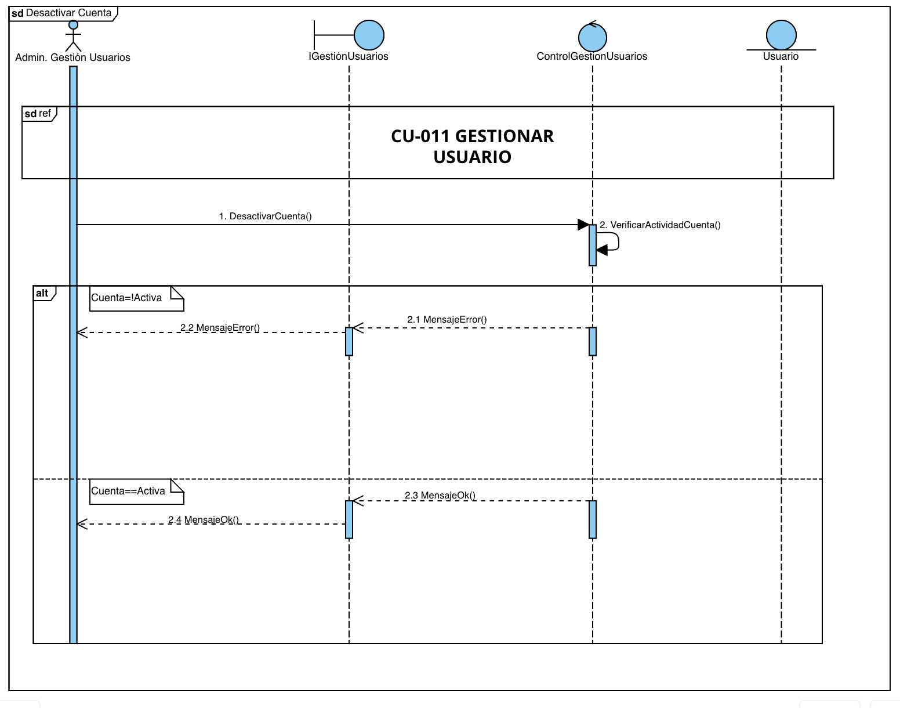
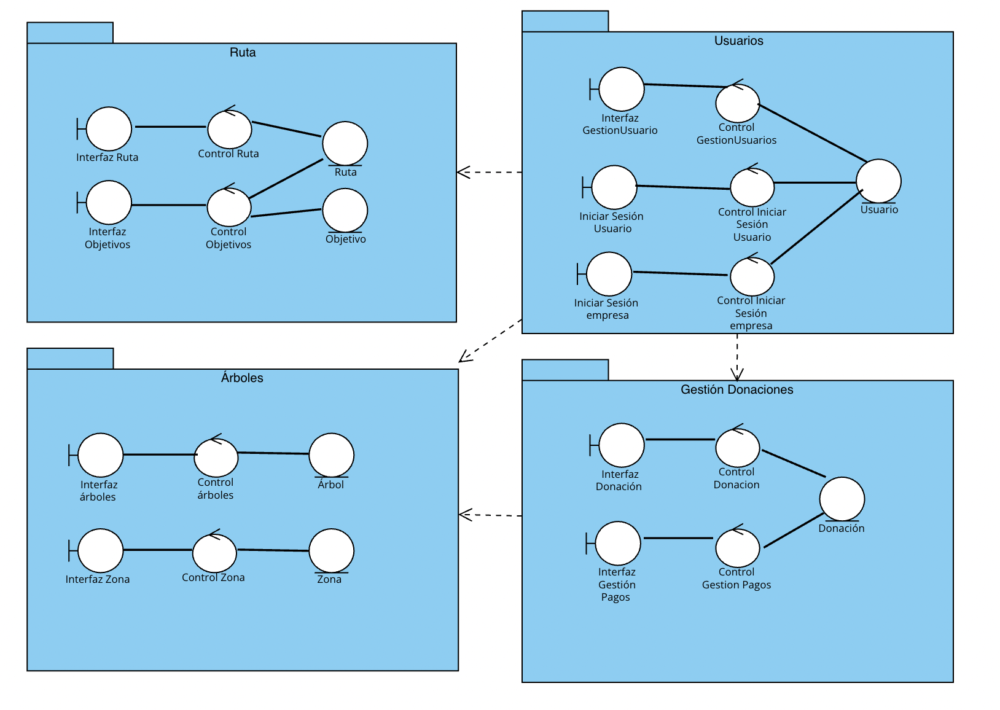
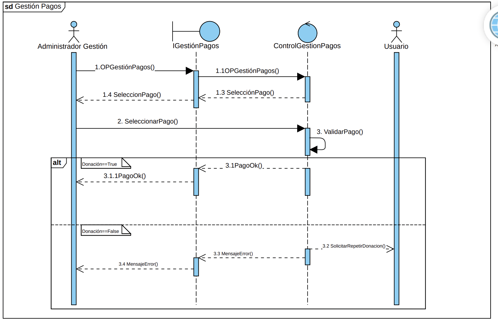
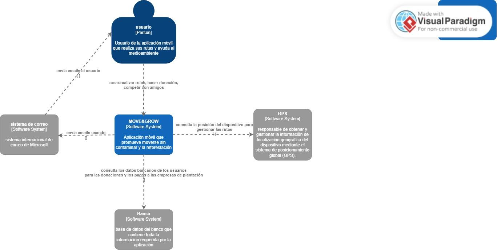

20 de mayo de 2025 - tercera versión

Ingeniería del software I

# MOVE&GROW

___

Beatriz del Barrio González

Camila Escobar Concha

Carolina Galán García

Lucía Carral Baleztena

Naroa Centurión Velasco

CAMINA, CUIDA, TRANSFORMA

Sembrando árboles gracias a tus pasos, construyendo un futuro más verde

Cada paso que das contribuye a un planeta más saludable. Los árboles son esenciales para combatir el cambio climático, absorber el dióxido de carbono y generar oxígeno.

Al caminar o usar el transporte público en lugar del coche, estás ayudando a reducir la huella de carbono y, gracias a tus pasos, estamos sembrando árboles para devolver al mundo un poco de lo que le hemos quitado.

CONTENIDOS:

## 1. Registro de Cambios

Hemos modificado la matriz de objetivos-requisitos, para que todos estén relacionados con los objetivos. Atendiendo a esta matriz los objetivos han sido añadidos correctamente a las tablas de los requisitos y los casos de uso.

Se han modificado los requisitos de acuerdo a las correcciones (han sido añadidos, eliminados y modificados), se han añadido sus tablas y se han rellenado en su mayoría. Como consecuencia, también ha habido que cambiar la matriz de requisitos con requisitos.

También hemos añadido un caso de uso más, el que ahora es el CU-004 Configurar objetivos, además de añadir las correcciones de los casos de uso indicadas en el Hito 1.

Para el Hito 3 hemos modificado los requisitos y los casos de uso. Algunos requisitos de información han sido omitidos, y se han añadido casos de uso en base a las opciones para gestionar los usuarios. Por ello, la matriz de objetivos-requisitos y la matriz de requisitos-requisitos se han corregido.

En el apartado de la memoria técnica hemos añadido información en las técnicas y herramientas.

El diagrama de clases del modelo de dominio también ha sido corregido, lo que ha implicado la creación de una tabla en el glosario de clases (la clase zona).

Se han añadido dos nuevos actores y el caso de uso gestionar usuario ha sido dividido en diferentes casos de uso.

## 2. Registro de uso de IA generativa

Durante la realización de este proyecto, hemos utilizado herramientas de inteligencia artificial generativa, como ChatGPT, de manera puntual y controlada. La hemos utilizado principalmente para reescribir algunos textos y resolver dudas puntuales que nos han ido surgiendo.

## 3. Memoria técnica

### 3.1. Introducción general del trabajo

La aplicación busca incentivar el uso de transporte sostenible (caminar, bicicleta, transporte público) de una manera divertida y competitiva. Los usuarios establecen rutas sostenibles en su vida diaria y, a medida que van logrando objetivos, se van plantando árboles en su nombre, contribuyendo así a la reforestación global y la lucha contra el cambio climático.

Esta memoria se organiza en varios apartados para facilitar su comprensión. En primer lugar, se introduce de forma general que aborda nuestra aplicación, seguida de la exposición de los objetivos funcionales identificados en la primera fase del proyecto. A continuación, se detallan las técnicas y herramientas utilizadas a lo largo del desarrollo, así como la organización interna del grupo de trabajo y la distribución de tareas. Posteriormente, se destacan los aspectos más relevantes que surgieron durante la realización de la práctica. Finalmente, se presentan las conclusiones que resumen la experiencia y los aprendizajes obtenidos durante el proyecto.

### 3.2. Objetivos

#### Rutas sostenibles:

La aplicación permitirá al usuario registrar todas sus rutas que sean beneficiosas para el medio ambiente, entre ellas el uso de transporte público (autobús, tren), caminar, utilizar bicicletas, patinete, entre otros. Permitirá registrarlas de varias maneras: rutas predeterminadas o no predeterminadas.

Rutas predeterminadas: Son aquellas que el usuario tenga ya registradas, como puede ser ir al trabajo, a la universidad o al supermercado

Rutas no predeterminadas: Son rutas espontáneas, como puede ser salir a correr, salir a dar una vuelta con amigos o pasear.

Se hace cuenta del tiempo total de estas rutas y al llegar a cierto objetivo, se planta un árbol en nombre del usuario.

#### Plantación de árboles:

A través de la donación de los usuarios a la aplicación, diversas empresas de reforestación que estén de voluntarios en el proyecto utilizaran los fondos para plantar árboles en zonas preasignadas. De esta manera se contribuye activamente al cuidado y recuperación del ecosistema.

#### Competencia amistosa:

La aplicación también fomentará la interacción entre usuarios. Estos podrán añadir amigos, y compartir con ellos sus logros y árboles que han ayudado a plantar. Este intercambio refuerza la motivación de los usuarios y su compromiso con el medio ambiente.

#### Promover actividad física:

Buscamos fomentar la actividad física incentivando a las personas a moverse más mediante el uso de la aplicación. Los usuarios serán motivados a través de recompensas relacionadas con la plantación y la interacción con amigos. De esta manera se fomenta el interés por la actividad física.

### 3.3. Técnicas y herramientas

La principal herramienta que hemos usado para este trabajo es Google Drive, esta plataforma la han sugerido los profesores para entregar el trabajo. En ella hemos creado una carpeta que luego hemos compartido con la profesora, y en ella hemos creado el documento principal, que este, y uno en sucio para poder compartir material entre nosotras más fácilmente. Como el documento principal estaba compartido entre todos los miembros, todos podíamos editarlo cuando quisiésemos, incluidos los profesores. En la corrección los profesores añadieron comentarios a ciertas partes para que nosotros pudiésemos verlos y corregir el trabajo.

Además también hemos usado mucho Telegram, una aplicación de mensajería. Creamos un chat grupal para hablar entre nosotras, al que también fue añadido un bot. Este bot ha estado registrando nuestros mensajes, y ha elaborado un informe con la participación de cada miembro que han podido leer los profesores. A través de esta aplicación nosotras hemos podido hablar y organizarnos cuando no podíamos hacerlo presencialmente. Y también hemos utilizado Trello, que era también una herramienta de comunicación. Es una especie de agenda virtual donde dejábamos constancia del trabajo realizado y a realizar para que el resto de integrantes lo viesen.

Otras herramientas usadas han sido: Studium, el campus virtual oficial de la Universidad de Salamanca, donde los profesores han colgado material de ayuda y guía; Whatsapp, otra aplicación de mensajería que también hemos usado para comunicarnos; ChatGPT, una inteligencia artificial online que hemos usado en ciertas partes específicas como recurso de información; y Google Meet, una aplicación de videollamadas que hemos usado para trabajar juntas.

Dentro del material proporcionado por los profesores, destacan el Proceso Unificado con enfoque ágil que establece los pasos principales y las herramientas necesarias para el desarrollo de un software , y el método de Durán y Bernárdez, que establece una metodología para la elicitación de requisitos. Ambos los hemos visto en clase y además disponemos de vídeos y documentos sobre ellos.

Nuestro principal método de trabajo ha sido llamarnos y repartirnos el trabajo, así si alguna tenía alguna duda o problema enseguida lo podía comunicar y pedir ayuda, ha sido muy práctico y cómodo porque hablábamos mientras trabajábamos, y también ha ayudado que este trabajo haya sido tan fácil de repartir.

### 3.4. Descripción del grupo de trabajo

Los datos de los miembros del grupo son los siguientes:

- Beatriz del Barrio González.

- Carolina Galán García.

- Camila Escobar Concha.

- Lucía Carral Baleztena.

- Naroa Centurión Velasco.

En un principio decidimos que tendríamos los siguientes roles:

- Coordinadora, Lucía.

- Controlador de Trello, Camila.

- Supervisor de tareas o analista, Carol.

- Portavoz, Naroa.

- Mediadora, Beatriz.

Finalmente, durante la realización de los dos primeros hitos no hemos dado demasiada importancia a los roles y todas hemos ido adoptando en algún momento cada rol sin darnos cuenta ni dejándolo reflejado en ningún documento.

Para el primer hito, nos organizamos repartiendo los diferentes apartados indicados en la rúbrica de evaluación, asegurándonos de que todas las secciones quedaran correctamente cubiertas. El diagrama de casos de uso fue elaborado de manera conjunta por todo el grupo.

Beatriz se encargó de la parte estética del documento, incluyendo la creación de la portada, la tabla de contenidos y la definición del estilo general. Además, junto a Carolina, desarrolló los apartados de requisitos de información y requisitos no funcionales.

Carolina, de manera individual, realizó también la matriz de rastreabilidad entre requisitos.

Por su parte, Lucía y Camila se ocuparon de describir los objetivos del proyecto y de confeccionar las tablas de casos de uso.

Naroa se encargó de la descripción de los actores y de la elaboración de la matriz de rastreabilidad entre objetivos y requisitos.

Una vez tuvimos la primera corrección cada una de las integrantes se encargó de corregir sus respectivas partes atendiendo a las anotaciones del documento.

Para la realización del segundo hito, comenzamos trabajando en conjunto en la elaboración del diagrama de clases del modelo de dominio, el cual expusimos posteriormente en clase.
Posteriormente, organizamos una reunión mediante Google Meet, en la que cada integrante se encargó de redactar una parte de la memoria técnica, además de resolver en equipo las dudas pendientes por corregir.

Para la elaboración del glosario de clases, decidimos dividirnos el trabajo: asignamos a cada integrante varias clases del diagrama para completar las respectivas tablas de manera individual.

Por otro lado, tratamos de mantener actualizado el tablero de Trello para reflejar el estado de las tareas. Sin embargo, esta herramienta no tuvo demasiado éxito, ya que al organizarnos principalmente a través de Telegram, donde resolvíamos dudas y repartíamos tareas de forma más ágil, acabamos dejando de lado el uso de Trello.

Para el tercer y último hito, usamos la misma técnica, repartir el trabajo. En una llamada nos repartimos los diagramas de secuencia, Naroa y Carolina realizaron el glosario de términos y Lucía, Camila y Beatriz se encargaron del modelo C4 y la propuesta de arquitectura.

### 3.5. Aspectos relevantes

La creación del diagrama de casos de uso ha sido una de las partes del Hito 1 que más  se nos dificultó. Definir los actores no lo fue tanto, pero identificar cada caso de uso sí, al igual que definirlo posteriormente. Además, el diseño del paso a paso de cada caso de uso en la parte de las tablas, aunque algunos no tenían gran dificultad, otros sí han sido más complejos de definir. A la hora de definir algún caso de uso, tuvimos que volver a diseñar el diagrama, lo que requería volver a invertirle tiempo a esa parte del trabajo.

A la hora de hacer la matriz de relación de objetivos con requisitos también le tuvimos que dar vueltas en conjunto, aunque algunos requisitos eran más claros con qué objetivo iban, otros en un inicio no le encontrábamos relación con ninguno.

La parte que nos resultó más difícil del segundo hito fue la del modelo de dominio. Nos costó bastante identificar las clases correctas, ya que decidir qué objetos deberían ser clases y qué relaciones debían existir entre ellas fue todo un reto, las relaciones entre clases también fueron complicadas, ya que tuvimos que definir si debían ser uno a muchos, muchos a muchos, o si había relaciones jerárquicas, lo que requirió mucho análisis y reflexión para asegurarnos de que el modelo fuera lo más preciso y eficiente posible.

### 3.6. Conclusiones

La realización de este proyecto nos ha permitido no solo aplicar los conocimientos teóricos adquiridos en clase, sino también desarrollar habilidades prácticas fundamentales para el trabajo en equipo y la gestión de proyectos. A lo largo de las distintas fases del trabajo, hemos aprendido la importancia de una buena comunicación interna, de la correcta distribución de tareas y de la flexibilidad a la hora de adaptarnos a imprevistos y dificultades.

Asimismo, hemos experimentado de primera mano el valor de combinar herramientas digitales para la colaboración, aunque también hemos aprendido que no todas las herramientas son igual de efectivas según el contexto del grupo. En nuestro caso, Telegram se consolidó como la vía principal de organización frente a otras plataformas como Trello.

Desde el punto de vista personal y grupal, este proyecto nos ha ayudado a mejorar nuestras habilidades de comunicación, organización, gestión del tiempo y resolución de conflictos, así como a reforzar nuestro compromiso con un objetivo común. Además, nos ha motivado especialmente el propósito sostenible y social de la aplicación, lo que añadió un componente de motivación y responsabilidad extra al trabajo realizado.

En conclusión, el desarrollo de este proyecto ha sido una experiencia enriquecedora tanto a nivel académico como personal, permitiéndonos consolidar conocimientos, identificar áreas de mejora y adquirir competencias esenciales para nuestro futuro profesional.

## 4. Objetivos:

### 4.1. Rutas sostenibles:

### 4.2. Plantación de árboles:

### 4.3. Competencia amistosa:

### 4.4. Promover la actividad física:

## 5. Requisitos de información (IRQ)

### 5.1.IRQ-001- Usuario

### 5.2. IRQ-002-Ruta nueva

### 5.3. IRQ- 003 Ruta predeterminada

### 5.4.IRQ-004 Objetivos

### 5.5. IRQ-005 Historial de objetivos.

### 5.6. IRQ-006 Compartir logros.

### 5.7. IRQ-007 Donación.

### 5.8. IRQ-008 Empresa.

## 6. Requisitos no funcionales (NFR)

### 6.1. NFR-001 Seguridad de los datos

### 6.2. NFR-002 Interfaz sencilla e intuitiva

### 6.3. NFR-003 Plazo de plantación

### 6.4. NFR-004 Leyes del país donde se realice la plantación

### 6.5. NFR-005 Aplicación móvil

### 6.6. NFR-006 Contestación del sistema

### 6.7. NFR-007 Actualización del código

### 6.8. NFR-008 Uso de buenas prácticas de desarrollo

### 6.9. NFR-009 Prevención de caídas

## 7 .Diagrama de casos de uso

## 8. Descripción de los actores

### 8.1. ACT-001 usuario

### 8.2. ACT-002 personal de árboles

### 8.3. ACT-003 administrador técnico

### 8.4. ACT-004 administrador de gestión

### 8.5. ACT-005 GPS

### 8.6. ACT-006 CUENTA BANCARIA

## 9. Tablas de casos de uso

Se utiliza esta tabla en vez de la tabla de Requisitos Funcionales:

### 9.1. CU-001 Iniciar sesión/registrarse

### 9.2. CU-002 Hacer ruta

### 9.3. CU 003 Ver logros/objetivos

### 9.4. CU-004 Configurar objetivos

### 9.5. CU-005 Competir con amigos

### 9.6. CU-006 Hacer donación

### 9.7. CU-007 Iniciar sesión empresa

### 9.8. CU-008 Plantar

### 9.9. CU-009 Mantenimiento de árboles

### 9.10. CU-010 Registrar árboles.

### 9.11. CU-011. Gestionar usuarios.

### 9.12. CU-012. Activar usuario.

### 9.13. CU-013. Desactivar usuario.

### 9.14. CU-014. Modificar usuarios.

### 9.15. CU-015 Gestionar pagos

## 10. Matriz de objetivos con requisitos

## 11. Matriz de requisitos con requisitos

## 12 .Diagrama de clases del modelo de dominio

## 13. Glosario de clases

## 14. Vista de interacción

A continuación se muestran los diagramas de secuencia de los diferentes casos de uso.

### 14.1. DS CU-001 Iniciar sesión/registrarse

### 14.2. DS CU-002 Hacer ruta

### 14.3. DS CU-003 Ver logros/objetivos

### 14.4. DS CU-004 Configurar objetivos

### 14.5. DS CU-005 Competir con amigos

### 14.6. DS CU-006 Hacer donación

### 14.7. DS CU-007 Iniciar sesión empresa

### 14.8. DS CU-008 Plantar

### 14.9. DS CU-009 Mantenimiento de árboles

### 14.10. DS CU-010 Registrar árboles

### 14.11. DS CU-011 Gestionar usuarios

### 14.12. DS CU-014 Activar usuario

### 14.13. DS CU-013 Desactivar Usuario

### 14.14. DS CU-014 Modificar usuario

### 14.15. DS CU-015 Gestionar pagos

## 15. Propuesta de arquitectura

## 16. Modelo C4

### Nivel de contexto

### Nivel de contenedores

### Nivel de componentes

### Nivel de código

## 17. Glosario de términos

Actores. Es un clasificador que modela un tipo de rol que juega una entidad que interacciona con el sujeto pero que es externa a él, un actor puede tener múltiples instancias físicas, una instancia física de un actor puede jugar diferentes papeles. Vendrán definidos por las plantillas del Método de Durán y Bernández, solo pueden tener asociaciones con casos de uso, subsistemas, componentes y clases, las asociaciones deben ser binarias.

Hay tres tipos de actores:

Principales: Tienen objetivos de usuario que se satisfacen mediante el uso de los servicios del sistema. Se identifican para encontrar los objetivos de usuario, los cuales dirigen los casos de uso.

De apoyo: Proporcionan un servicio al sistema, normalmente se trata de un sistema informático, pero podría ser una organización o una persona. Se identifican para clarificar las interfaces externas y los protocolos.

Pasivos: Están interesados en el comportamiento del caso de uso, pero no es principal ni de apoyo. Se identifican para asegurar que todos los intereses necesarios se han identificado y satisfecho.

Casos de uso. Conjunto de acciones realizadas por el sistema que dan lugar a un resultado observable. Especifica un comportamiento que el sujeto puede realizar en colaboración con uno o más actores, pero sin hacer referencia a su estructura interna. Puede contener posibles variaciones de su comportamiento básico incluyendo manejo de errores y excepciones. Vendrán definidos por las plantillas del Método de Durán y Bernández.

Clases. Clasificador que describe un conjunto de objetos que comparten la misma especificación de características, restricciones y semántica. Describe las propiedades y comportamiento de un grupo de objetos.

Diagrama de clases. Representación gráfica que muestra la relación entre los actores y los casos de uso o funcionalidades del sistema.

Diagrama de secuencia. Unidad de comportamiento que se centra en el intercambio de información observable entre elementos que pueden conectarse. Hacen hincapié en la secuencia de intercambio de mensajes entre objetos.

Tiene dos usos diferentes:

Forma de instancia, describe un escenario específico, una posible interacción.

Forma genérica, describe todas las posibles alternativas en un escenario. Puede incluir ramas, condiciones y bucles.

Memoria técnica. Introducción al trabajo, indica los aspectos técnicos principales y los explica.

Matriz de rastreabilidad obj-req. Matriz que relaciona los requisitos y los casos de uso con los objetivos. Si un requisito o caso de uso está relacionado con un objetivo (si viene definido en la tabla) se anota una cruz (o un 1, dependiendo de la notación).

Matriz de rastreabilidad req-req. Matriz que relaciona los requisitos entre ellos y los casos de uso. Si un requisito está relacionado con otro requisito o con un caso de uso (si viene definido en la tabla) se anota una cruz (o un 1, dependiendo de la notación).

Modelo C4.  Surge como solución para aliviar la brecha entre modelo y código, permite comunicar la arquitectura de un sistema en función del detalle que se quiera proporcionar. Está basado en cuatro niveles que describen el sistema con distintos grados de granularidad:

El nivel de contexto.

El nivel de contenedores.

El nivel de componentes.

El nivel de código.

Modelo de dominio. Representación de las clases conceptuales del mundo real, no de componentes software. No se trata de un conjunto de diagramas que describen clases software, u objetos software con responsabilidades.

Objetivos. La aplicación será creada y desarrollada para cumplir unos objetivos, pueden ser económicos, sociales, medioambientales, u otros. Vendrán definidos por las plantillas del Método de Durán y Bernández.

Propuesta arquitectónica. Define la estructura y organización de un sistema de software, incluyendo los componentes, sus interacciones y cómo se adaptan a los requisitos funcionales y no funcionales del sistema.

Requisitos de información. Condición o capacidad que un usuario necesita para resolver un problema o lograr un objetivo. Vendrán definidos por las plantillas del Método de Durán y Bernández.

Requisitos no funcionales. Condición o capacidad que debe tener un sistema o un componente de un sistema para satisfacer un contrato, una norma, una especificación u otro documento formal. Vendrán definidos por las plantillas del Método de Durán y Bernández.

### Tabla 1

| OBJ-<001> | Rutas sostenibles |

| --- | --- |

| Versión | 1.0  |

| Autores | Lucía Carral Baleztena
Camila Escobar Concha
Beatriz del Barrio González
Naroa Centurión Velasco
Carolina Galán García |

| Fuentes |  |

| Descripción | La aplicación permitirá al usuario registrar todas sus rutas que sean beneficiosas para el medio ambiente, entre ellas el uso de transporte público (autobús, tren), caminar, utilizar bicicletas, patinete, entre otros. Permitirá registrarlas de varias maneras: rutas predeterminadas o no predeterminadas. 
Rutas predeterminadas: Son aquellas que el usuario tenga ya registradas, como puede ser ir al trabajo, a la universidad o al supermercado
Rutas no predeterminadas: Son rutas espontáneas, como puede ser salir a correr, salir a dar una vuelta con amigos o pasear.
Se hace cuenta del tiempo total de estas rutas y al llegar a cierto objetivo, se planta un árbol en nombre del usuario.  |

| Importancia | Alta |

| Estado | Implementado |

### Tabla 2

| OBJ-<002> | Plantación de árboles |

| --- | --- |

| Versión |  1.0  |

| Autores | Lucía Carral Baleztena
Camila Escobar Concha
Beatriz del Barrio González
Naroa Centurión Velasco
Carolina Galán García |

| Fuentes |  |

| Descripción | A través de la donación de los usuarios a la aplicación, diversas empresas de reforestación que estén de voluntarios en el proyecto utilizaran los fondos para plantar árboles en zonas preasignadas. De esta manera se contribuye activamente al cuidado y recuperación del ecosistema.
 |

| Importancia | Alta |

| Estado | Implementado |

### Tabla 3

| OBJ-<003> | Competencia amistosa |

| --- | --- |

| Versión |  1.0  |

| Autores | Lucía Carral Baleztena
Camila Escobar Concha
Beatriz del Barrio González
Naroa Centurión Velasco
Carolina Galán García |

| Fuentes |  |

| Descripción | La aplicación también fomentará la interacción entre usuarios. Estos podrán añadir amigos, y compartir con ellos sus logros y árboles que han ayudado a plantar. Este intercambio refuerza la motivación de los usuarios y su compromiso con el medio ambiente. |

| Importancia | Alta |

| Estado | Implementado |

### Tabla 4

| OBJ-<004> | Promover la actividad física |

| --- | --- |

| Versión |  1.0  |

| Autores | Lucía Carral Baleztena
Camila Escobar Concha
Beatriz del Barrio González
Naroa Centurión Velasco
Carolina Galán García |

| Fuentes |  |

| Descripción | Buscamos fomentar la actividad física incentivando a las personas a moverse más mediante el uso de la aplicación. Los usuarios serán motivados a través de recompensas relacionadas con la plantación y la interacción con amigos. De esta manera se fomenta el interés por la actividad física. |

| Importancia | Alta |

| Estado | Implementado |

### Tabla 5

| IRQ-001 | Usuario | Usuario |

| --- | --- | --- |

| Versión | 2.0 (13 de mayo) | 2.0 (13 de mayo) |

| Autores | Camila Escobar Concha
Lucía Carral Baleztena
Beatriz del Barrio González
Carolina Galán García
Naroa Centurión Velasco
 (Universidad de Salamanca) | Camila Escobar Concha
Lucía Carral Baleztena
Beatriz del Barrio González
Carolina Galán García
Naroa Centurión Velasco
 (Universidad de Salamanca) |

| Fuentes |  |  |

| Objetivos asociados | ·        OBJ - 001 Rutas sostenibles.
·        OBJ - 002 Plantación de árboles.
·        OBJ - 003 Competición amistosa.
·        OBJ - 004 Promover la actividad física. | ·        OBJ - 001 Rutas sostenibles.
·        OBJ - 002 Plantación de árboles.
·        OBJ - 003 Competición amistosa.
·        OBJ - 004 Promover la actividad física. |

| Requisitos asociados | IRQ- 007 Compartir logros. | IRQ- 007 Compartir logros. |

| Descripción | El sistema deberá permitir al usuario:
 Registrarse, si no tiene una cuenta: deberá almacenar la información correspondiente al registro del usuario. En concreto: los datos personales del usuario.
Iniciar sesión, si ya tiene una cuenta registrada: para ello requerirá ciertos datos. En concreto: el nombre de usuario y la contraseña. 
Tener amistades, para lo que tendrá un buscador para poder encontrar a sus amigos y establecer amistades entre los usuarios. Deberá almacenar el nombre de usuario de estos. | El sistema deberá permitir al usuario:
 Registrarse, si no tiene una cuenta: deberá almacenar la información correspondiente al registro del usuario. En concreto: los datos personales del usuario.
Iniciar sesión, si ya tiene una cuenta registrada: para ello requerirá ciertos datos. En concreto: el nombre de usuario y la contraseña. 
Tener amistades, para lo que tendrá un buscador para poder encontrar a sus amigos y establecer amistades entre los usuarios. Deberá almacenar el nombre de usuario de estos. |

| Datos  | Nombre.
Apellidos. 
Edad.
Correo electrónico/número de teléfono
Contraseña.
Nombre de usuario 
Contraseña
Nombre de usuario de las amistades | Nombre.
Apellidos. 
Edad.
Correo electrónico/número de teléfono
Contraseña.
Nombre de usuario 
Contraseña
Nombre de usuario de las amistades |

| Tiempo de vida | Medio | Máximo |

| Tiempo de vida | <tiempo medio de vida> | <tiempo máximo de vida> |

| Ocurrencias simult. | Medio | Máximo |

| Ocurrencias simult. | <nº medio de ocurr. simult.> | <nº máximo de ocurr. simult.> |

| Importancia | <importancia del requisito> | <importancia del requisito> |

| Urgencia | <urgencia del requisito> | <urgencia del requisito> |

| Estado | <estado del requisito> | <estado del requisito> |

| Estabilidad | <estabilidad del requisito> | <estabilidad del requisito> |

| Comentarios | La información se comprueba y si algo no es correcto se vuelve a pedir.
Si todo sale bien se accede a la página de inicio | La información se comprueba y si algo no es correcto se vuelve a pedir.
Si todo sale bien se accede a la página de inicio |

### Tabla 6

| IRQ-002 | Ruta nueva | Ruta nueva |

| --- | --- | --- |

| Versión | 1.0 (9 de abril) | 1.0 (9 de abril) |

| Autores | Camila Escobar Concha
Lucía Carral Baleztena
Beatriz del Barrio González
Carolina Galán García
Naroa Centurión Velasco
 (Universidad de Salamanca) | Camila Escobar Concha
Lucía Carral Baleztena
Beatriz del Barrio González
Carolina Galán García
Naroa Centurión Velasco
 (Universidad de Salamanca) |

| Fuentes |  |  |

| Objetivos asociados | OBJ- 001 Rutas sostenibles. | OBJ- 001 Rutas sostenibles. |

| Requisitos asociados | 
 | 
 |

| Descripción | El sistema deberá permitir al usuario inicializar y finalizar nuevas rutas, para ello requerirá cierta información sobre ella. | El sistema deberá permitir al usuario inicializar y finalizar nuevas rutas, para ello requerirá cierta información sobre ella. |

| Datos  | Ubicación de origen y destino.
Tipo de ruta.
Método de transporte ( caminar, bicicleta, patinete, autobús y metro). | Ubicación de origen y destino.
Tipo de ruta.
Método de transporte ( caminar, bicicleta, patinete, autobús y metro). |

| Tiempo de vida | Medio | Máximo |

| Tiempo de vida | <tiempo medio de vida> | <tiempo máximo de vida> |

| Ocurrencias simult. | Medio | Máximo |

| Ocurrencias simult. | <nº medio de ocurr. simult.> | <nº máximo de ocurr. simult.> |

| Importancia | <importancia del requisito> | <importancia del requisito> |

| Urgencia | <urgencia del requisito> | <urgencia del requisito> |

| Estado | <estado del requisito> | <estado del requisito> |

| Estabilidad | <estabilidad del requisito> | <estabilidad del requisito> |

| Comentarios |  La información sobre cada ruta que hace el usuario debe quedar guardada en un historial asociado a la cuenta.
 Si al finalizar la ruta se ha alcanzado algún objetivo, se actualiza la información de objetivos asociada. |  La información sobre cada ruta que hace el usuario debe quedar guardada en un historial asociado a la cuenta.
 Si al finalizar la ruta se ha alcanzado algún objetivo, se actualiza la información de objetivos asociada. |

### Tabla 7

| IRQ-003 | Ruta predeterminada  | Ruta predeterminada  |

| --- | --- | --- |

| Versión | 1.0 (9 de abril) | 1.0 (9 de abril) |

| Autores | Camila Escobar Concha
Lucía Carral Baleztena
Beatriz del Barrio González
Carolina Galán García
Naroa Centurión Velasco
 (Universidad de Salamanca) | Camila Escobar Concha
Lucía Carral Baleztena
Beatriz del Barrio González
Carolina Galán García
Naroa Centurión Velasco
 (Universidad de Salamanca) |

| Fuentes |  |  |

| Objetivos asociados | OBJ- 001 Rutas sostenibles. | OBJ- 001 Rutas sostenibles. |

| Requisitos asociados | 
IRQ- 002 Ruta nueva. | 
IRQ- 002 Ruta nueva. |

| Descripción | El sistema deberá permitir al usuario establecer una ruta predeterminada, para ello guardará los datos obtenidos al crear una ruta y los guardará como una ruta predeterminada bajo un nombre. | El sistema deberá permitir al usuario establecer una ruta predeterminada, para ello guardará los datos obtenidos al crear una ruta y los guardará como una ruta predeterminada bajo un nombre. |

| Datos  | Nombre de la ruta.
Ubicación de origen y destino.
Tipo de ruta.
Método de transporte ( caminar, bicicleta, patinete, autobús y metro). | Nombre de la ruta.
Ubicación de origen y destino.
Tipo de ruta.
Método de transporte ( caminar, bicicleta, patinete, autobús y metro). |

| Tiempo de vida | Medio | Máximo |

| Tiempo de vida | <tiempo medio de vida> | <tiempo máximo de vida> |

| Ocurrencias simult. | Medio | Máximo |

| Ocurrencias simult. | <nº medio de ocurr. simult.> | <nº máximo de ocurr. simult.> |

| Importancia | <importancia del requisito> | <importancia del requisito> |

| Urgencia | <urgencia del requisito> | <urgencia del requisito> |

| Estado | <estado del requisito> | <estado del requisito> |

| Estabilidad | <estabilidad del requisito> | <estabilidad del requisito> |

| Comentarios |  La información sobre cada ruta que hace el usuario debe quedar guardada en un historial asociado a la cuenta.
 Si al finalizar la ruta se ha alcanzado algún objetivo, se actualiza la información de objetivos asociada. |  La información sobre cada ruta que hace el usuario debe quedar guardada en un historial asociado a la cuenta.
 Si al finalizar la ruta se ha alcanzado algún objetivo, se actualiza la información de objetivos asociada. |

### Tabla 8

| IRQ-004 | Objetivos  | Objetivos  |

| --- | --- | --- |

| Versión | 1.0 (9 de abril) | 1.0 (9 de abril) |

| Autores | Camila Escobar Concha
Lucía Carral Baleztena
Beatriz del Barrio González
Carolina Galán García
Naroa Centurión Velasco
 (Universidad de Salamanca) | Camila Escobar Concha
Lucía Carral Baleztena
Beatriz del Barrio González
Carolina Galán García
Naroa Centurión Velasco
 (Universidad de Salamanca) |

| Fuentes |  |  |

| Objetivos asociados | OBJ- 003  Competición amistosa.
OBJ- 004  Promover la actividad física. | OBJ- 003  Competición amistosa.
OBJ- 004  Promover la actividad física. |

| Requisitos asociados | 
IRQ- 002 Ruta nueva.
IRQ- 003 Ruta predeterminada.
 | 
IRQ- 002 Ruta nueva.
IRQ- 003 Ruta predeterminada.
 |

| Descripción | El sistema deberá permitir al usuario crear objetivos y ver los detalles de los objetivos establecidos por el sistema, este guardará los siguientes datos respecto a los objetivos: | El sistema deberá permitir al usuario crear objetivos y ver los detalles de los objetivos establecidos por el sistema, este guardará los siguientes datos respecto a los objetivos: |

| Datos  | Nombre del objetivo.
Descripción del objetivo.
Estado del objetivo (booleano). | Nombre del objetivo.
Descripción del objetivo.
Estado del objetivo (booleano). |

| Tiempo de vida | Medio | Máximo |

| Tiempo de vida | <tiempo medio de vida> | <tiempo máximo de vida> |

| Ocurrencias simult. | Medio | Máximo |

| Ocurrencias simult. | <nº medio de ocurr. simult.> | <nº máximo de ocurr. simult.> |

| Importancia | <importancia del requisito> | <importancia del requisito> |

| Urgencia | <urgencia del requisito> | <urgencia del requisito> |

| Estado | <estado del requisito> | <estado del requisito> |

| Estabilidad | <estabilidad del requisito> | <estabilidad del requisito> |

| Comentarios | Una vez un objetivo se marca completado (estado), este se convierte en un logro (objetivo cumplido). | Una vez un objetivo se marca completado (estado), este se convierte en un logro (objetivo cumplido). |

### Tabla 9

| IRQ-005 | Historial de objetivos  | Historial de objetivos  |

| --- | --- | --- |

| Versión | 1.0 (9 de abril) | 1.0 (9 de abril) |

| Autores | Camila Escobar Concha
Lucía Carral Baleztena
Beatriz del Barrio González
Carolina Galán García
Naroa Centurión Velasco
 (Universidad de Salamanca) | Camila Escobar Concha
Lucía Carral Baleztena
Beatriz del Barrio González
Carolina Galán García
Naroa Centurión Velasco
 (Universidad de Salamanca) |

| Fuentes |  |  |

| Objetivos asociados | OBJ- 004  Promover la actividad física. | OBJ- 004  Promover la actividad física. |

| Requisitos asociados | IRQ- 002 Ruta nueva.
IRQ- 003 Ruta predeterminada.
IRQ- 004 Objetivos  | IRQ- 002 Ruta nueva.
IRQ- 003 Ruta predeterminada.
IRQ- 004 Objetivos  |

| Descripción | El sistema deberá mostrar la información correspondiente a los objetivos y los logros, ya sean creados por el usuario o establecidos por el sistema. En concreto: | El sistema deberá mostrar la información correspondiente a los objetivos y los logros, ya sean creados por el usuario o establecidos por el sistema. En concreto: |

| Datos  | Nombre del objetivo
Descripción del objetivo.
Estado del objetivo. | Nombre del objetivo
Descripción del objetivo.
Estado del objetivo. |

| Tiempo de vida | Medio | Máximo |

| Tiempo de vida | <tiempo medio de vida> | <tiempo máximo de vida> |

| Ocurrencias simult. | Medio | Máximo |

| Ocurrencias simult. | <nº medio de ocurr. simult.> | <nº máximo de ocurr. simult.> |

| Importancia | <importancia del requisito> | <importancia del requisito> |

| Urgencia | <urgencia del requisito> | <urgencia del requisito> |

| Estado | <estado del requisito> | <estado del requisito> |

| Estabilidad | <estabilidad del requisito> | <estabilidad del requisito> |

| Comentarios | En cuanto al estado de un objetivo, al marcarse como completado (estado), este se convierte en un logro (objetivo cumplido). | En cuanto al estado de un objetivo, al marcarse como completado (estado), este se convierte en un logro (objetivo cumplido). |

### Tabla 10

| IRQ-006 | Compartir logros | Compartir logros |

| --- | --- | --- |

| Versión | 1.0 (9 de abril) | 1.0 (9 de abril) |

| Autores | Camila Escobar Concha
Lucía Carral Baleztena
Beatriz del Barrio González
Carolina Galán García
Naroa Centurión Velasco
 (Universidad de Salamanca) | Camila Escobar Concha
Lucía Carral Baleztena
Beatriz del Barrio González
Carolina Galán García
Naroa Centurión Velasco
 (Universidad de Salamanca) |

| Fuentes |  |  |

| Objetivos asociados |             ·        OBJ - 003 Competición amistosa.
·        OBJ - 004 Promover la actividad física. |             ·        OBJ - 003 Competición amistosa.
·        OBJ - 004 Promover la actividad física. |

| Requisitos asociados | IRQ- 004 Objetivos 
IRQ- 005 Historial de objetivos. | IRQ- 004 Objetivos 
IRQ- 005 Historial de objetivos. |

| Descripción | El sistema deberá permitir al usuario compartir con sus amigos los logros alcanzados. | El sistema deberá permitir al usuario compartir con sus amigos los logros alcanzados. |

| Datos  | Nombre del logro.
Descripción del logro. | Nombre del logro.
Descripción del logro. |

| Tiempo de vida | Medio | Máximo |

| Tiempo de vida | <tiempo medio de vida> | <tiempo máximo de vida> |

| Ocurrencias simult. | Medio | Máximo |

| Ocurrencias simult. | <nº medio de ocurr. simult.> | <nº máximo de ocurr. simult.> |

| Importancia | <importancia del requisito> | <importancia del requisito> |

| Urgencia | <urgencia del requisito> | <urgencia del requisito> |

| Estado | <estado del requisito> | <estado del requisito> |

| Estabilidad | <estabilidad del requisito> | <estabilidad del requisito> |

| Comentarios | Los logros solo podrán compartirse si existe una relación de amistad entre los usuarios. | Los logros solo podrán compartirse si existe una relación de amistad entre los usuarios. |

### Tabla 11

| IRQ-007 | Donación | Donación |

| --- | --- | --- |

| Versión | 1.0 (9 de abril) | 1.0 (9 de abril) |

| Autores | Camila Escobar Concha
Lucía Carral Baleztena
Beatriz del Barrio González
Carolina Galán García
Naroa Centurión Velasco
 (Universidad de Salamanca) | Camila Escobar Concha
Lucía Carral Baleztena
Beatriz del Barrio González
Carolina Galán García
Naroa Centurión Velasco
 (Universidad de Salamanca) |

| Fuentes |  |  |

| Objetivos asociados | OBJ- 002  Plantación de árboles. | OBJ- 002  Plantación de árboles. |

| Requisitos asociados |  |  |

| Descripción | Los usuarios podrán realizar donaciones para contribuir con la aplicación y favorecer la plantación de árboles. | Los usuarios podrán realizar donaciones para contribuir con la aplicación y favorecer la plantación de árboles. |

| Datos  | Cantidad a abonar.
Método de pago.
Datos necesarios para el pago. | Cantidad a abonar.
Método de pago.
Datos necesarios para el pago. |

| Tiempo de vida | Medio | Máximo |

| Tiempo de vida | <tiempo medio de vida> | <tiempo máximo de vida> |

| Ocurrencias simult. | Medio | Máximo |

| Ocurrencias simult. | <nº medio de ocurr. simult.> | <nº máximo de ocurr. simult.> |

| Importancia | <importancia del requisito> | <importancia del requisito> |

| Urgencia | <urgencia del requisito> | <urgencia del requisito> |

| Estado | <estado del requisito> | <estado del requisito> |

| Estabilidad | <estabilidad del requisito> | <estabilidad del requisito> |

| Comentarios |  |  |

### Tabla 12

| IRQ-008 | Empresa | Empresa |

| --- | --- | --- |

| Versión | 2.0 (14 de mayo) | 2.0 (14 de mayo) |

| Autores | Camila Escobar Concha
Lucía Carral Baleztena
Beatriz del Barrio González
Carolina Galán García
Naroa Centurión Velasco
 (Universidad de Salamanca) | Camila Escobar Concha
Lucía Carral Baleztena
Beatriz del Barrio González
Carolina Galán García
Naroa Centurión Velasco
 (Universidad de Salamanca) |

| Fuentes |  |  |

| Objetivos asociados | OBJ- 002  Plantación de árboles. | OBJ- 002  Plantación de árboles. |

| Requisitos asociados | IRQ-001 Usuario. | IRQ-001 Usuario. |

| Descripción | Los usuarios trabajadores del sistema de plantación o de la aplicación podrán registrarse e iniciar sesión con un rol distinto. Para ello el sistema deberá almacenar los datos personales necesarios para ello.
La empresa que haya iniciado sesión en el sistema podrá recibir las peticiones de plantación de los usuarios y registrar su proceso. El sistema almacenará esta información. | Los usuarios trabajadores del sistema de plantación o de la aplicación podrán registrarse e iniciar sesión con un rol distinto. Para ello el sistema deberá almacenar los datos personales necesarios para ello.
La empresa que haya iniciado sesión en el sistema podrá recibir las peticiones de plantación de los usuarios y registrar su proceso. El sistema almacenará esta información. |

| Datos  | Nombre.
Apellidos. 
Edad.
Correo electrónico/número de teléfono.
Contraseña.
Nombre del usuario solicitante.
Información de registro del árbol. | Nombre.
Apellidos. 
Edad.
Correo electrónico/número de teléfono.
Contraseña.
Nombre del usuario solicitante.
Información de registro del árbol. |

| Tiempo de vida | Medio | Máximo |

| Tiempo de vida | <tiempo medio de vida> | <tiempo máximo de vida> |

| Ocurrencias simult. | Medio | Máximo |

| Ocurrencias simult. | <nº medio de ocurr. simult.> | <nº máximo de ocurr. simult.> |

| Importancia | <importancia del requisito> | <importancia del requisito> |

| Urgencia | <urgencia del requisito> | <urgencia del requisito> |

| Estado | <estado del requisito> | <estado del requisito> |

| Estabilidad | <estabilidad del requisito> | <estabilidad del requisito> |

| Comentarios |  |  |

### Tabla 13

| NFR-001 | Seguridad de los datos |

| --- | --- |

| Versión | 1.0 (9 de abril) |

| Autores | Camila Escobar Concha
Lucía Carral Baleztena
Beatriz del Barrio González
Carolina Galán García
Naroa Centurión Velasco
 (Universidad de Salamanca) |

| Fuentes | ·         <fuente de la versión actual> (<organización de la fuente>)
... |

| Objetivos asociados | ·        OBJ - 001 Rutas sostenibles.
·        OBJ - 002 Plantación de árboles.
·        OBJ - 003 Competición amistosa. |

| Requisitos asociados | ·        IRQ-001 Usuario |

| Descripción | El sistema deberá asegurar que la información que se pide al iniciar sesión está totalmente encriptada y sigue patrones de alta seguridad, y que la autenticación es segura para los usuarios registrados. |

| Importancia | <importancia del requisito> |

| Urgencia | <urgencia del requisito> |

| Estado | <estado del requisito> |

| Estabilidad | <estabilidad del requisito> |

| Comentarios | <comentarios adicionales sobre el requisito> |

### Tabla 14

| NFR-002 | Interfaz sencilla e intuitiva |

| --- | --- |

| Versión | 1.0 (9 de abril) |

| Autores | Camila Escobar Concha
Lucía Carral Baleztena
Beatriz del Barrio González
Carolina Galán García
Naroa Centurión Velasco
 (Universidad de Salamanca) |

| Fuentes | ·         <fuente de la versión actual> (<organización de la fuente>)
... |

| Objetivos asociados | ·        OBJ - 001 Rutas sostenibles.
·        OBJ - 003 Competición amistosa. |

| Requisitos asociados |  |

| Descripción | El sistema deberá mostrar una interfaz sencilla e intuitiva durante cualquier tipo de uso de la aplicación, con gráficos con la suficiente calidad. |

| Importancia | <importancia del requisito> |

| Urgencia | <urgencia del requisito> |

| Estado | <estado del requisito> |

| Estabilidad | <estabilidad del requisito> |

| Comentarios | <comentarios adicionales sobre el requisito> |

### Tabla 15

| NFR-003 | Plazo de plantación |

| --- | --- |

| Versión | 1.0 (9 de abril) |

| Autores | Camila Escobar Concha
Lucía Carral Baleztena
Beatriz del Barrio González
Carolina Galán García
Naroa Centurión Velasco
 (Universidad de Salamanca) |

| Fuentes | ·         <fuente de la versión actual> (<organización de la fuente>)
... |

| Objetivos asociados | OBJ- 002 Plantación de árboles. |

| Requisitos asociados |  |

| Descripción | Cuando un usuario consigue plantar un árbol, la plantación real del árbol debe ocurrir en el plazo de un mes. |

| Importancia | <importancia del requisito> |

| Urgencia | <urgencia del requisito> |

| Estado | <estado del requisito> |

| Estabilidad | <estabilidad del requisito> |

| Comentarios | <comentarios adicionales sobre el requisito> |

### Tabla 16

| NFR-004 | Leyes del país donde se realice la plantación. |

| --- | --- |

| Versión | 1.0 (9 de abril) |

| Autores | Camila Escobar Concha
Lucía Carral Baleztena
Beatriz del Barrio González
Carolina Galán García
Naroa Centurión Velasco
 (Universidad de Salamanca) |

| Fuentes | ·         <fuente de la versión actual> (<organización de la fuente>)
... |

| Objetivos asociados | OBJ- 002 Plantación de árboles. |

| Requisitos asociados |  |

| Descripción |  La plantación de árboles debe estar regulada cumpliendo todas las leyes que deba. |

| Importancia | <importancia del requisito> |

| Urgencia | <urgencia del requisito> |

| Estado | <estado del requisito> |

| Estabilidad | <estabilidad del requisito> |

| Comentarios | <comentarios adicionales sobre el requisito> |

### Tabla 17

| NFR-005 | Aplicación móvil |

| --- | --- |

| Versión | 1.0 (9 de abril) |

| Autores | Camila Escobar Concha
Lucía Carral Baleztena
Beatriz del Barrio González
Carolina Galán García
Naroa Centurión Velasco
 (Universidad de Salamanca) |

| Fuentes | ·         <fuente de la versión actual> (<organización de la fuente>)
... |

| Objetivos asociados | ·        OBJ - 001 Rutas sostenibles.
·        OBJ - 002 Plantación de árboles.
·        OBJ - 004 Promover la actividad física. |

| Requisitos asociados |  |

| Descripción | La aplicación será móvil y estará disponible para los sistemas operativos más utilizados (Android, iOS). |

| Importancia | <importancia del requisito> |

| Urgencia | <urgencia del requisito> |

| Estado | <estado del requisito> |

| Estabilidad | <estabilidad del requisito> |

| Comentarios | <comentarios adicionales sobre el requisito> |

### Tabla 18

| NFR-006 | Contestación del sistema |

| --- | --- |

| Versión | 1.0 (9 de abril) |

| Autores | Camila Escobar Concha
Lucía Carral Baleztena
Beatriz del Barrio González
Carolina Galán García
Naroa Centurión Velasco
 (Universidad de Salamanca) |

| Fuentes | ·         <fuente de la versión actual> (<organización de la fuente>)
... |

| Objetivos asociados | ·        OBJ - 001 Rutas sostenibles.
·        OBJ - 002 Plantación de árboles.
·        OBJ - 003 Competición amistosa.
·        OBJ - 004 Promover la actividad física. |

| Requisitos asociados |  |

| Descripción | El sistema deberá responder a la mayoría de interacciones en un plazo menor a dos segundos. |

| Importancia | <importancia del requisito> |

| Urgencia | <urgencia del requisito> |

| Estado | <estado del requisito> |

| Estabilidad | <estabilidad del requisito> |

| Comentarios | <comentarios adicionales sobre el requisito> |

### Tabla 19

| NFR-007 | Actualización del código |

| --- | --- |

| Versión | 1.0 (9 de abril) |

| Autores | Camila Escobar Concha
Lucía Carral Baleztena
Beatriz del Barrio González
Carolina Galán García
Naroa Centurión Velasco
 (Universidad de Salamanca) |

| Fuentes | ·         <fuente de la versión actual> (<organización de la fuente>)
... |

| Objetivos asociados | ·        OBJ - 001 Rutas sostenibles.
·        OBJ - 003 Competición amistosa.
·        OBJ - 004 Promover la actividad física. |

| Requisitos asociados | NFR- 009 Prevención de caídas. |

| Descripción | El código debe estar documentado para facilitar futuras mejoras. |

| Importancia | <importancia del requisito> |

| Urgencia | <urgencia del requisito> |

| Estado | <estado del requisito> |

| Estabilidad | <estabilidad del requisito> |

| Comentarios | <comentarios adicionales sobre el requisito> |

### Tabla 20

| NFR-008 | Uso de buenas prácticas de desarrollo |

| --- | --- |

| Versión | 1.0 (9 de abril) |

| Autores | Camila Escobar Concha
Lucía Carral Baleztena
Beatriz del Barrio González
Carolina Galán García
Naroa Centurión Velasco
 (Universidad de Salamanca) |

| Fuentes | ·         <fuente de la versión actual> (<organización de la fuente>)
... |

| Objetivos asociados | ·        OBJ - 001 Rutas sostenibles.
·        OBJ - 003 Competición amistosa. |

| Requisitos asociados |  |

| Descripción | El sistema utilizará buenas prácticas de desarrollo (arquitectura modular, pruebas automatizadas). |

| Importancia | <importancia del requisito> |

| Urgencia | <urgencia del requisito> |

| Estado | <estado del requisito> |

| Estabilidad | <estabilidad del requisito> |

| Comentarios | <comentarios adicionales sobre el requisito> |

### Tabla 21

| NFR-009 | Prevención de caídas |

| --- | --- |

| Versión | 1.0 (9 de abril) |

| Autores | Camila Escobar Concha
Lucía Carral Baleztena
Beatriz del Barrio González
Carolina Galán García
Naroa Centurión Velasco
 (Universidad de Salamanca) |

| Fuentes | ·         <fuente de la versión actual> (<organización de la fuente>)
... |

| Objetivos asociados | ·        OBJ - 001 Rutas sostenibles.
·        OBJ - 002 Plantación de árboles.
·        OBJ - 003 Competición amistosa.
·        OBJ - 004 Promover la actividad física. |

| Requisitos asociados | NFR- 007 Actualización del código. |

| Descripción | Uso de servidores redundantes para evitar caídas del sistema. |

| Importancia | <importancia del requisito> |

| Urgencia | <urgencia del requisito> |

| Estado | <estado del requisito> |

| Estabilidad | <estabilidad del requisito> |

| Comentarios | <comentarios adicionales sobre el requisito> |

### Tabla 22

| ACT-001 | USUARIO |

| --- | --- |

| Versión | Versión 0.0 (31 de marzo) |

| Autores | Camila Escobar Concha
Lucía Carral Baleztena
Beatriz del Barrio González
Carolina Galán García
Naroa Centurión Velasco
 (Universidad de Salamanca) |

| Fuentes |  |

| Objetivos
asociados | OBJ-1
OBJ-2
OBJ-3
OBJ-4 |

| Requisitos
asociados | NFR-001
NFR-002
NFR-005
IRQ-001
IRQ-002
IRQ-003
IRQ-004
IRQ-005
IRQ-006
IRQ-007 |

| Descripción | Este actor representa a los usuarios que se descarga la app |

| Comentarios |  |

### Tabla 23

| ACT-002 | PERSONAL DE ÁRBOLES |

| --- | --- |

| Versión | Versión 0.0 (31 de marzo) |

| Autores | Camila Escobar Concha
Lucía Carral Baleztena
Beatriz del Barrio González
Carolina Galán García
Naroa Centurión Velasco
 (Universidad de Salamanca) |

| Fuentes |  |

| Objetivos
asociados | OBJ-2
 |

| Requisitos
asociados | NFR-003
NFR-004
IRQ-007
IRQ-008 |

| Descripción | Este actor representa al personal que se encarga de plantar, mantener y registrar los árboles |

| Comentarios |  |

### Tabla 24

| ACT-003 | ADMINISTRADOR TÉCNICO |

| --- | --- |

| Versión | Versión 0.0 (31 de marzo) |

| Autores | Camila Escobar Concha
Lucía Carral Baleztena
Beatriz del Barrio González
Carolina Galán García
Naroa Centurión Velasco
 (Universidad de Salamanca) |

| Fuentes |  |

| Objetivos
asociados | OBJ-1
OBJ-2
OBJ-3
OBJ-4 |

| Requisitos
asociados | NFR-001
NFR-002
NFR-005
NFR-006
NFR-007
NFR-008
NFR-009
 |

| Descripción | Este actor representa al personal que se encarga de gestionar los usuarios |

| Comentarios | Este actor hereda todo lo que hace el actor usuario por lo que también tiene los mismos objetivos y requisitos relacionados, aunque este tiene algunos de más que son los que pondremos en esta tabla y los requisitos funcionales se les ofrecerán con otros servicios |

### Tabla 25

| ACT-004 | ADMINISTRADOR DE GESTIÓN |

| --- | --- |

| Versión | Versión 0.0 (31 de marzo) |

| Autores | Camila Escobar Concha
Lucía Carral Baleztena
Beatriz del Barrio González
Carolina Galán García
Naroa Centurión Velasco
 (Universidad de Salamanca) |

| Fuentes |  |

| Objetivos
asociados | OBJ-2
 |

| Requisitos
asociados | IRQ-007
IRQ-008 |

| Descripción | Este actor representa al personal que se encarga de gestionar los pagos de las donaciones |

| Comentarios |  |

### Tabla 26

| ACT-004 | ADMINISTRADOR DE GESTIÓN |

| --- | --- |

| Versión | Versión 0.0 (31 de marzo) |

| Autores | Camila Escobar Concha
Lucía Carral Baleztena
Beatriz del Barrio González
Carolina Galán García
Naroa Centurión Velasco
 (Universidad de Salamanca) |

| Fuentes |  |

| Objetivos
asociados | OBJ-1
OBJ-3
 |

| Requisitos
asociados | IRQ-002
IRQ-003
NFR-001 |

| Descripción | Este actor representa la ubicación del móvil, la cual se usará en las rutas |

| Comentarios | Este actor no aparece en el diagrama de casos de uso ya que lo hemos usado para poder realizar el diagrama de secuencia de hacer ruta |

### Tabla 27

| ACT-004 | ADMINISTRADOR DE GESTIÓN |

| --- | --- |

| Versión | Versión 0.0 (31 de marzo) |

| Autores | Camila Escobar Concha
Lucía Carral Baleztena
Beatriz del Barrio González
Carolina Galán García
Naroa Centurión Velasco
 (Universidad de Salamanca) |

| Fuentes |  |

| Objetivos
asociados | OBJ-2
 |

| Requisitos
asociados | IRQ-007
NFR-001 |

| Descripción | Este actor representa la cuenta de banco del usuario, la cual se usará en las donaciones |

| Comentarios | Este actor no aparece en el diagrama de casos de uso ya que lo hemos usado para poder realizar el diagrama de secuencia de gestión de donaciones |

### Tabla 28

| CU-001 | Iniciar sesión/registrarse  | Iniciar sesión/registrarse  |

| --- | --- | --- |

| Versión | Versión 0.0 (24 de marzo) | Versión 0.0 (24 de marzo) |

| Autores | Camila Escobar Concha
Lucía Carral Baleztena
Beatriz del Barrio González
Carolina Galán García
Naroa Centurión Velasco
 (Universidad de Salamanca)
 | Camila Escobar Concha
Lucía Carral Baleztena
Beatriz del Barrio González
Carolina Galán García
Naroa Centurión Velasco
 (Universidad de Salamanca)
 |

| Fuentes |  |  |

| Objetivos asociados | ·         OBJ-001  Rutas sostenibles | ·         OBJ-001  Rutas sostenibles |

| Requisitos asociados | ·         IRQ-001
·         NFR-001 | ·         IRQ-001
·         NFR-001 |

| Descripción | Los usuarios podrán iniciar sesión con su cuenta y/o registrarse una vez descargada la aplicación. | Los usuarios podrán iniciar sesión con su cuenta y/o registrarse una vez descargada la aplicación. |

| Precondición | Tener la aplicación descargada en el móvil  | Tener la aplicación descargada en el móvil  |

| Secuencia normal | Paso | Acción |

| Secuencia normal | p1 | El usuario selecciona iniciar sesión |

| Secuencia normal | p2 | El sistema debe solicitar el usuario y contraseña |

| Secuencia normal | p3 | El usuario introduce los datos solicitados |

| Secuencia normal | p4 | El sistema verifica los datos  |

| Secuencia normal | p5 | Si el usuario no existe en el sistema entonces el sistema debe solicitar los datos necesarios para la creación de la cuenta |

| Secuencia normal | p6 | El sistema comprueba los datos  |

| Secuencia normal | p7 | Si el usuario  ha introducido los datos que se requieren correctamente, hay una creación de cuenta exitosa  |

|  | p8 | En caso de datos correctos, el sistema debe acceder a la cuenta del usuario y el caso de uso finaliza |

| Poscondición | El usuario accede a su cuenta | El usuario accede a su cuenta |

| Excepciones | Paso | Acción |

| Excepciones | p4 | Si el usuario intenta registrarse con una cuenta ya iniciada, le dara error y solicitará otra |

|  | p6 | Si el usuario no ha introducido los datos requeridos correctamente indicar qué datos son incorrectos o faltan, y no hay creación de cuenta aún.  |

|  | p6 | Si el usuario existe en el sistema y los datos son correctos entonces se salta al paso 8 |

| Rendimiento | Paso | Acción |

| Rendimiento | p1 | 5 minutos en registrarse |

| Rendimiento | p2 | <1 minuto en iniciar sesión |

| Frecuencia | Baja | Baja |

| Importancia | Alta | Alta |

| Urgencia | Alta | Alta |

| Estado | Definido | Definido |

| Estabilidad | Alta | Alta |

| Comentarios | Una vez iniciada sesión en un dispositivo móvil no es necesario iniciar cada que se sale de la aplicación a menos que el usuario elija cerrar sesión. | Una vez iniciada sesión en un dispositivo móvil no es necesario iniciar cada que se sale de la aplicación a menos que el usuario elija cerrar sesión. |

### Tabla 29

| CU-002 | Hacer ruta  | Hacer ruta  |

| --- | --- | --- |

| Versión | Versión 0.0 (24 de marzo) | Versión 0.0 (24 de marzo) |

| Autores | Camila Escobar Concha
Lucía Carral Baleztena
Beatriz del Barrio González
Carolina Galán García
Naroa Centurión Velasco
 (Universidad de Salamanca)
 | Camila Escobar Concha
Lucía Carral Baleztena
Beatriz del Barrio González
Carolina Galán García
Naroa Centurión Velasco
 (Universidad de Salamanca)
 |

| Fuentes |  |  |

| Objetivos asociados | ·         OBJ-001  Rutas sostenibles | ·         OBJ-001  Rutas sostenibles |

| Requisitos asociados | ·        IRQ-002
·        IRQ-003
·        NFR-001 | ·        IRQ-002
·        IRQ-003
·        NFR-001 |

| Descripción | Al elegir la opción de "Hacer ruta", el usuario podrá seleccionar el método de transporte sostenible que utilizará (caminar, bicicleta, patinete, transporte público, etc.) y registrar la información del punto de inicio y destino. Además, podrá establecer rutas predeterminadas para facilitar su uso en futuras ocasiones. Al finalizar la ruta, el sistema la registrará y actualizará el progreso del usuario en la aplicación. | Al elegir la opción de "Hacer ruta", el usuario podrá seleccionar el método de transporte sostenible que utilizará (caminar, bicicleta, patinete, transporte público, etc.) y registrar la información del punto de inicio y destino. Además, podrá establecer rutas predeterminadas para facilitar su uso en futuras ocasiones. Al finalizar la ruta, el sistema la registrará y actualizará el progreso del usuario en la aplicación. |

| Precondición | Estar registrado con una cuenta y tener el gps activado | Estar registrado con una cuenta y tener el gps activado |

| Secuencia normal | Paso | Acción  |

| Secuencia normal | p1 | El usuario elige la opción de “Hacer ruta”  |

| Secuencia normal | p2 | El usuario elige el método de transporte sostenible que utilizará |

| Secuencia normal | p3 | El usuario puede elegir una ruta predeterminada si tiene, o comenzar una ruta nueva |

| Secuencia normal | p4 | El usuario ingresa el punto de inicio y el destino  |

| Secuencia normal | p5 | El usuario inicia la ruta |

| Secuencia normal | p6 | El sistema comienza a registrar el recorrido |

| Secuencia normal | p7 | Una vez completada la ruta, el sistema la detecta automáticamente |

| Secuencia normal | p8 | El sistema registra la distancia recorrida y el tiempo empleado |

| Secuencia normal | p9 | Si el usuario ha alcanzado un objetivo de distancia o tiempo acumulado, el sistema le asigna una recompensa  |

| Secuencia normal | p10 | La ruta queda guardada en el historial del usuario y puede ser marcada como predeterminada si el usuario lo desea |

| Poscondición | El sistema actualiza el historial de rutas y logros del usuario. | El sistema actualiza el historial de rutas y logros del usuario. |

| Excepciones | Paso | Acción |

| Excepciones | p3 | Si el usuario elige una ruta predeterminada, entonces se salta al paso 5 |

| Excepciones | p6 | Si el usuario finaliza la ruta manualmente, entonces se salta al paso 7 |

| Excepciones | p1 | Si el usuario elige una ruta predeterminada y no la termina, es decir la finaliza antes o después, esta se tomará por el sistema como una ruta no  predeterminada para contar la distancia y tiempo y asignar su respectiva recompensa. |

| Rendimiento | Paso | Acción |

| Rendimiento | p1 | 2 minutos en establecer una nueva ruta |

| Rendimiento | p2 | >1 minuto en elegir una ruta predeterminada |

| Frecuencia | Media | Media |

| Importancia | Alta | Alta |

| Urgencia | Alta | Alta |

| Estado | Definido | Definido |

| Estabilidad | Media | Media |

| Comentarios | Las recompensas son sumas al usuario de llegar al objetivo de plantar uno o varios árboles, entre más recompensas y más recorridos, más se  acerca el usuario a completar sus objetivos . Adicionalmente los usuarios pueden ver su historial de rutas.  | Las recompensas son sumas al usuario de llegar al objetivo de plantar uno o varios árboles, entre más recompensas y más recorridos, más se  acerca el usuario a completar sus objetivos . Adicionalmente los usuarios pueden ver su historial de rutas.  |

### Tabla 30

| CU-<003> | Ver logros/objetivos | Ver logros/objetivos |

| --- | --- | --- |

| Versión | Versión 0.0 (24 de marzo) | Versión 0.0 (24 de marzo) |

| Autores | Camila Escobar Concha
Lucía Carral Baleztena
Beatriz del Barrio González
Carolina Galán García
Naroa Centurión Velasco
 (Universidad de Salamanca)
 | Camila Escobar Concha
Lucía Carral Baleztena
Beatriz del Barrio González
Carolina Galán García
Naroa Centurión Velasco
 (Universidad de Salamanca)
 |

| Fuentes |  |  |

| Objetivos asociados | ·         OBJ-001 Rutas sostenibles | ·         OBJ-001 Rutas sostenibles |

| Requisitos asociados | ·         IRQ-004
·         IRQ-005
·         IRQ-006 | ·         IRQ-004
·         IRQ-005
·         IRQ-006 |

| Descripción | Los usuarios pueden ver los logros y objetivos alcanzados en la aplicación como árboles plantados o metas completadas. | Los usuarios pueden ver los logros y objetivos alcanzados en la aplicación como árboles plantados o metas completadas. |

| Precondición | Tener una cuenta en la aplicación | Tener una cuenta en la aplicación |

| Secuencia normal | Paso | Acción |

| Secuencia normal | p1 | Seleccionar la opción de logros y objetivos |

| Secuencia normal | p2 | La aplicación muestra en pantalla un resumen de logros conseguidos con relación a las recompensas conseguidas por cada ruta  y futuros objetivos, como árboles plantados, kilómetros recorridos o número de rutas realizadas |

| Secuencia normal | p3 | El usuario puede seleccionar cualquiera de estas opciones para ver detalles más específicos |

| Secuencia normal | p4 | El sistema le muestra los detalles del dato elegido |

| Secuencia normal | p5 | El usuario tiene la opción de compartir sus logros |

| Secuencia normal | p6 | El usuario tiene la opción de añadir objetivos propios, selecciona “configurar objetivos” y lo personaliza |

| Secuencia normal | p7 | La aplicación guarda automáticamente los cambios realizados |

| Poscondición | Los usuarios han accedido a un resumen de sus logros y objetivos actualizados | Los usuarios han accedido a un resumen de sus logros y objetivos actualizados |

| Excepciones | Paso | Acción |

| Excepciones | p1 | Si la aplicación no puede añadir un objetivo propio, salta mensaje de error y la aplicación queda como estaba |

| Rendimiento | Paso | Acción |

| Rendimiento | p1 | <1 minuto en mostrar los logros |

| Rendimiento | p2 | <3 minutos en añadir un objetivo manualmente |

| Frecuencia | Alta | Alta |

| Importancia | Alta | Alta |

| Urgencia | Media | Media |

| Estado | Definido | Definido |

| Estabilidad | Alta | Alta |

| Comentarios | Se recomienda actualizar la aplicación regularmente para que los logros y objetivos estén bien sincronizados | Se recomienda actualizar la aplicación regularmente para que los logros y objetivos estén bien sincronizados |

### Tabla 31

| CU-004 | Configurar objetivos | Configurar objetivos |

| --- | --- | --- |

| Versión | Versión 0.0 (24 de marzo) | Versión 0.0 (24 de marzo) |

| Autores | Camila Escobar Concha
Lucía Carral Baleztena
Beatriz del Barrio González
Carolina Galán García
Naroa Centurión Velasco
 (Universidad de Salamanca)
 | Camila Escobar Concha
Lucía Carral Baleztena
Beatriz del Barrio González
Carolina Galán García
Naroa Centurión Velasco
 (Universidad de Salamanca)
 |

| Fuentes |  |  |

| Objetivos asociados | ·        OBJ - 001 Rutas sostenibles.
·        OBJ - 003 Competición amistosa.
·        OBJ - 004 Promover la actividad física. | ·        OBJ - 001 Rutas sostenibles.
·        OBJ - 003 Competición amistosa.
·        OBJ - 004 Promover la actividad física. |

| Requisitos asociados | ·         IRQ-004
·         IRQ-005
·         IRQ-006 | ·         IRQ-004
·         IRQ-005
·         IRQ-006 |

| Descripción | Los usuarios pueden configurar objetivos en la aplicación | Los usuarios pueden configurar objetivos en la aplicación |

| Precondición | Tener una cuenta en la aplicación | Tener una cuenta en la aplicación |

| Secuencia normal | Paso | Acción |

| Secuencia normal | p1 | Seleccionar la opción de crear objetivos |

| Secuencia normal | p2 | La aplicación le pide al usuario que ingrese el número objetivo de árboles plantados/kilómetros/tiempo de ruta que desea llegar a alcanzar |

| Secuencia normal | p3 | El sistema le muestra los detalles del objetivo creado |

| Secuencia normal | p4 | La aplicación guarda automáticamente los cambios realizados |

| Secuencia normal | p5 | La aplicación marcará como alcanzado el objetivo una vez el usuario lo complete |

| Poscondición | Los usuarios han accedido a un resumen de sus objetivos por alcanzar | Los usuarios han accedido a un resumen de sus objetivos por alcanzar |

| Excepciones | Paso | Acción |

| Excepciones | p2 | Si la aplicación no puede añadir un objetivo propio, salta mensaje de error y la aplicación queda como estaba |

| Rendimiento | Paso | Acción |

| Rendimiento | p1 | <3 minutos en configurar nuevo objetivo |

| Rendimiento |  |  |

| Frecuencia | Baja | Baja |

| Importancia | Media | Media |

| Urgencia | Baja | Baja |

| Estado | Definido | Definido |

| Estabilidad | Alta | Alta |

| Comentarios | Se recomienda actualizar la aplicación regularmente para que los logros y objetivos estén bien sincronizados | Se recomienda actualizar la aplicación regularmente para que los logros y objetivos estén bien sincronizados |

### Tabla 32

| CU-005 | Competir con amigos | Competir con amigos |

| --- | --- | --- |

| Versión | Versión 0.0 (24 de marzo) | Versión 0.0 (24 de marzo) |

| Autores | Camila Escobar Concha
Lucía Carral Baleztena
Beatriz del Barrio González
Carolina Galán García
Naroa Centurión Velasco
 (Universidad de Salamanca)
 | Camila Escobar Concha
Lucía Carral Baleztena
Beatriz del Barrio González
Carolina Galán García
Naroa Centurión Velasco
 (Universidad de Salamanca)
 |

| Fuentes |  |  |

| Objetivos asociados | ·         OBJ-003 Competencia amistosa | ·         OBJ-003 Competencia amistosa |

| Requisitos asociados | ·         IRQ-006 | ·         IRQ-006 |

| Descripción | Los usuarios pueden añadir amigos con los que automáticamente se comparten los objetivos alcanzados | Los usuarios pueden añadir amigos con los que automáticamente se comparten los objetivos alcanzados |

| Precondición | Tener una cuenta en la aplicación | Tener una cuenta en la aplicación |

| Secuencia normal | Paso | Acción |

| Secuencia normal | p1 | El usuario selecciona la opción de “amigos” en la aplicación |

| Secuencia normal | p2 | Si quiere añadir a un amigo, selecciona la opción e introduce el nombre con el que está registrado su amigo, le aparecerá la opción de “seguir” |

| Secuencia normal | p3 | El sistema lo añade a su lista de amigos |

| Secuencia normal | p4 | El usuario puede ver una tabla en la que aparecen sus amigos y los principales logros de cada uno |

| Secuencia normal | p5 | El sistema se encarga de actualizar en tiempo real las estadísticas de cada uno en el tablero de amigos según los usuarios van avanzando |

| Poscondición | El usuario interactúa y se motiva con los logros de sus amigos, pudiendo acceder al progreso de cada uno | El usuario interactúa y se motiva con los logros de sus amigos, pudiendo acceder al progreso de cada uno |

| Excepciones | Paso | Acción |

| Excepciones | p2 | Si el usuario no encuentra al amigo en la base de datos, el sistema le da la opción de invitación a la aplicación |

| Excepciones | p4 | Si la tabla de amigos no se sincroniza correctamente, el sistema lanza mensaje de error |

| Rendimiento | Paso | Acción |

| Rendimiento | p1 | <2 minutos en agregar amigos |

| Rendimiento | p2 | <1 minuto en compartir logros |

| Frecuencia | Media | Media |

| Importancia | Media | Media |

| Urgencia | Media | Media |

| Estado | Definido | Definido |

| Estabilidad | Media | Media |

| Comentarios | Esta opción promueve la competencia amistosa y la interacción entre usuarios | Esta opción promueve la competencia amistosa y la interacción entre usuarios |

### Tabla 33

| CU-<006> | Hacer donación | Hacer donación |

| --- | --- | --- |

| Versión | Versión 0.0 (24 de marzo) | Versión 0.0 (24 de marzo) |

| Autores | Camila Escobar Concha
Lucía Carral Baleztena
Beatriz del Barrio González
Carolina Galán García
Naroa Centurión Velasco
 (Universidad de Salamanca)
 | Camila Escobar Concha
Lucía Carral Baleztena
Beatriz del Barrio González
Carolina Galán García
Naroa Centurión Velasco
 (Universidad de Salamanca)
 |

| Fuentes |  |  |

| Objetivos asociados | ·         OBJ-002 Plantación de árboles | ·         OBJ-002 Plantación de árboles |

| Requisitos asociados | ·         IRQ-007
 | ·         IRQ-007
 |

| Descripción | Los usuarios podrán hacer donaciones monetarias que contribuyan al financiamiento de la aplicación. | Los usuarios podrán hacer donaciones monetarias que contribuyan al financiamiento de la aplicación. |

| Precondición | Estar registrado en la aplicación | Estar registrado en la aplicación |

| Secuencia normal | Paso | Acción |

| Secuencia normal | p1 | El usuario elige la opción de donaciones |

| Secuencia normal | p2 | El usuario indica el monto de donación |

| Secuencia normal | p3 | El usuario selecciona el método de pago disponible  |

| Secuencia normal | p4 | El usuario realiza el pago |

| Secuencia normal | p5 | El sistema procesa el pago y genera una comprobación de pago |

| Secuencia normal | p6 | El sistema actualiza el historial de donaciones del usuario |

| Secuencia normal | p7 | El usuario recibe una notificación de donación  |

| Poscondición | El usuario tiene una donación adicional en el historial de donaciones | El usuario tiene una donación adicional en el historial de donaciones |

| Excepciones | Paso | Acción |

| Excepciones | p5 | El usuario ingresa un método de pago inválido, por lo que no se realiza la donación y el caso de uso finaliza |

| Rendimiento | Paso | Acción |

| Rendimiento | p1 | 5 minutos en realizar donación |

| Frecuencia | Baja | Baja |

| Importancia | Alta | Alta |

| Urgencia | Alta | Alta |

| Estado | Definido | Definido |

| Estabilidad | Alta | Alta |

| Comentarios | Se pueden hacer donaciones ilimitadas por usuario. | Se pueden hacer donaciones ilimitadas por usuario. |

### Tabla 34

| CU-007 | Iniciar sesión empresa | Iniciar sesión empresa |

| --- | --- | --- |

| Versión | Versión 0.0 (24 de marzo) | Versión 0.0 (24 de marzo) |

| Autores | Camila Escobar Concha
Lucía Carral Baleztena
Beatriz del Barrio González
Carolina Galán García
Naroa Centurión Velasco
 (Universidad de Salamanca)
 | Camila Escobar Concha
Lucía Carral Baleztena
Beatriz del Barrio González
Carolina Galán García
Naroa Centurión Velasco
 (Universidad de Salamanca)
 |

| Fuentes |  |  |

| Objetivos asociados | ·         OBJ-002  Plantación de árboles | ·         OBJ-002  Plantación de árboles |

| Requisitos asociados | ·         IRQ-001
·         IRQ-008
·         NFR-001

 | ·         IRQ-001
·         IRQ-008
·         NFR-001

 |

| Descripción | Para registrar los árboles plantados las empresas deben iniciar sesión | Para registrar los árboles plantados las empresas deben iniciar sesión |

| Precondición | Tener la aplicación descargada en el móvil  | Tener la aplicación descargada en el móvil  |

| Secuencia normal | Paso | Acción  |

| Secuencia normal | p1 | Personal de empresa inicia sesión en la aplicación con usuario empresarial  |

| Secuencia normal | p2 | El sistema verifica los datos  |

| Secuencia normal | p4 | En caso de datos correctos acceder a la cuenta  |

| Poscondición | El personal de las empresas de árboles accede a su cuenta para registrar los árboles | El personal de las empresas de árboles accede a su cuenta para registrar los árboles |

| Excepciones | Paso | Acción |

| Excepciones | p1 | El personal ingresa los datos incorrectos por lo que no puede acceder a su cuenta |

| Excepciones | p2 | En caso de datos incorrectos volverlos a pedir |

| Rendimiento | Paso | Acción |

| Rendimiento | p1 | 1 minuto en iniciar sesión |

| Frecuencia | Media | Media |

| Importancia | Alta | Alta |

| Urgencia | Media | Media |

| Estado | Definido | Definido |

| Estabilidad | Alta | Alta |

| Comentarios | El personal de empresas de árboles no tendrá las mismas funciones que un usuario, solo podrá acceder a su cuenta para hacer el registro de árboles plantados | El personal de empresas de árboles no tendrá las mismas funciones que un usuario, solo podrá acceder a su cuenta para hacer el registro de árboles plantados |

### Tabla 35

| CU-008 | Plantar | Plantar |

| --- | --- | --- |

| Versión | Versión 0.0 (24 de marzo) | Versión 0.0 (24 de marzo) |

| Autores | Camila Escobar Concha
Lucía Carral Baleztena
Beatriz del Barrio González
Carolina Galán García
Naroa Centurión Velasco
 (Universidad de Salamanca)
 | Camila Escobar Concha
Lucía Carral Baleztena
Beatriz del Barrio González
Carolina Galán García
Naroa Centurión Velasco
 (Universidad de Salamanca)
 |

| Fuentes |  |  |

| Objetivos asociados | ·         OBJ-002  Plantación de árboles | ·         OBJ-002  Plantación de árboles |

| Requisitos asociados | ·         IRQ-008
·        NFR-003
·      NFR-004
 | ·         IRQ-008
·        NFR-003
·      NFR-004
 |

| Descripción | Las empresas de plantación voluntarias en la iniciativa recibirán notificaciones de los árboles a plantar asignados a su empresa, gestionando su participación. | Las empresas de plantación voluntarias en la iniciativa recibirán notificaciones de los árboles a plantar asignados a su empresa, gestionando su participación. |

| Precondición | Tener una cuenta registrada en la aplicación y estar inscrito como empresa voluntaria | Tener una cuenta registrada en la aplicación y estar inscrito como empresa voluntaria |

| Secuencia normal | Paso | Acción |

| Secuencia normal | p1 | El sistema muestra la cuenta de árboles a plantar contados durante la semana |

| Secuencia normal | p2 | La empresa voluntaria selecciona que quiere ser el que plante los árboles |

| Secuencia normal | p3 | El sistema asigna ubicación para la plantación |

| Secuencia normal | p4 | El sistema actualiza el estado de los árboles a plantar como “en proceso” |

| Poscondición | La empresa debe iniciar la actividad de plantar los árboles | La empresa debe iniciar la actividad de plantar los árboles |

| Excepciones | Paso | Acción |

| Excepciones | p2 | Si la ubicación asignada no es válida, el sistema asigna otra |

| Rendimiento | Paso | Acción |

| Rendimiento | p1 | <5 minutos confirmar participación |

| Rendimiento | p2 | <5 minutos asignar ubicación |

| Frecuencia | Media | Media |

| Importancia | Alta | Alta |

| Urgencia | Alta | Alta |

| Estado | Definido | Definido |

| Estabilidad | Alta | Alta |

| Comentarios |  |  |

### Tabla 36

| CU-009 | Mantenimiento de árboles | Mantenimiento de árboles |

| --- | --- | --- |

| Versión | Versión 0.0 (24 de marzo) | Versión 0.0 (24 de marzo) |

| Autores | Camila Escobar Concha
Lucía Carral Baleztena
Beatriz del Barrio González
Carolina Galán García
Naroa Centurión Velasco
 (Universidad de Salamanca)
 | Camila Escobar Concha
Lucía Carral Baleztena
Beatriz del Barrio González
Carolina Galán García
Naroa Centurión Velasco
 (Universidad de Salamanca)
 |

| Fuentes |  |  |

| Objetivos asociados | ·         OBJ-002  Plantación de árboles | ·         OBJ-002  Plantación de árboles |

| Requisitos asociados | ·        IRQ-008
·      NFR-004
 | ·        IRQ-008
·      NFR-004
 |

| Descripción | La empresa voluntaria de plantar los árboles, queda a cargo de su mantenimiento regular; riego, revisión de su estado, o notificación de cualquier problema al sistema. | La empresa voluntaria de plantar los árboles, queda a cargo de su mantenimiento regular; riego, revisión de su estado, o notificación de cualquier problema al sistema. |

| Precondición | La empresa debe de haber plantado los árboles asignados | La empresa debe de haber plantado los árboles asignados |

| Secuencia normal | Paso | Acción |

| Secuencia normal | p1 | El sistema muestra qué zona árboles plantados necesita mantenimiento |

| Secuencia normal | p3 | La empresa registra en el sistema la zona de árboles como “mantenido” |

|  | p4 | El sistema actualiza el estado de la zona de árboles planteados y el caso de uso finaliza |

| Poscondición | El estado de la zona de árboles queda actualizado | El estado de la zona de árboles queda actualizado |

| Excepciones | Paso | Acción |

| Excepciones | p3 | Si se presenta problemas como enfermedad o plagas, se notifica al sistema y este adapta futuros mantenimientos en base a esto |

| Excepciones |  |  |

| Rendimiento | Paso | Acción |

| Rendimiento | p1 | <10 minutos de registro de mantenimiento |

| Rendimiento | p2 | <5 minutos reprogramación de tareas |

| Frecuencia | Alta | Alta |

| Importancia | Alta | Alta |

| Urgencia | Alta | Alta |

| Estado | Definido | Definido |

| Estabilidad | Alta | Alta |

| Comentarios | Fundamental para garantizar que los árboles cumplan su función ambiental a largo plazo | Fundamental para garantizar que los árboles cumplan su función ambiental a largo plazo |

### Tabla 37

| CU-010 | Registrar árboles  | Registrar árboles  |

| --- | --- | --- |

| Versión | Versión 0.0 (24 de marzo) | Versión 0.0 (24 de marzo) |

| Autores | Camila Escobar Concha
Lucía Carral Baleztena
Beatriz del Barrio González
Carolina Galán García
Naroa Centurión Velasco
 (Universidad de Salamanca)
 | Camila Escobar Concha
Lucía Carral Baleztena
Beatriz del Barrio González
Carolina Galán García
Naroa Centurión Velasco
 (Universidad de Salamanca)
 |

| Fuentes |  |  |

| Objetivos asociados | ·         OBJ-002  Plantación de árboles | ·         OBJ-002  Plantación de árboles |

| Requisitos asociados | ·        IRQ-008 | ·        IRQ-008 |

| Descripción | Una vez las empresas voluntarias hayan realizado la plantación de árboles, esto deben ser registrados en el sistema para actualizar el proceso | Una vez las empresas voluntarias hayan realizado la plantación de árboles, esto deben ser registrados en el sistema para actualizar el proceso |

| Precondición | Tener la aplicación descargada en el móvil  | Tener la aplicación descargada en el móvil  |

| Secuencia normal | Paso | Acción |

| Secuencia normal | p1 | Selecciona la opción de "Registrar árboles plantados" |

| Secuencia normal | p2 | Ingresa los detalles de la plantación, es decir evidencia |

| Secuencia normal | p3 | Confirma la información ingresada. |

| Secuencia normal | p4 | El sistema verifica y registra los árboles como plantados. |

| Secuencia normal | p5 | Los árboles registrados aparecen reflejados en la cuenta del usuario y en el historial general de la aplicación |

| Poscondición | Los árboles quedan registrados en el sistema y se refleja en la aplicación | Los árboles quedan registrados en el sistema y se refleja en la aplicación |

| Excepciones | Paso | Acción |

| Excepciones | p1 | La empresa no ingresa una evidencia válida de que los árboles han sido plantados  |

| Rendimiento | Paso | Acción |

| Rendimiento | p1 | 10 minutos en completar el registro  |

| Frecuencia | Media | Media |

| Importancia | Alta | Alta |

| Urgencia | Alta | Alta |

| Estado | Definido | Definido |

| Estabilidad | Alta | Alta |

| Comentarios |  |  |

### Tabla 38

| CU-011 | Gestionar usuarios | Gestionar usuarios |

| --- | --- | --- |

| Versión | Versión 0.0 (24 de marzo) | Versión 0.0 (24 de marzo) |

| Autores | Camila Escobar Concha
Lucía Carral Baleztena
Beatriz del Barrio González
Carolina Galán García
Naroa Centurión Velasco
 (Universidad de Salamanca)
 | Camila Escobar Concha
Lucía Carral Baleztena
Beatriz del Barrio González
Carolina Galán García
Naroa Centurión Velasco
 (Universidad de Salamanca)
 |

| Fuentes |  |  |

| Objetivos asociados | ·         OBJ-003 Competencia amistosa | ·         OBJ-003 Competencia amistosa |

| Requisitos asociados | ·         IRQ-001
·         IRQ-008
 | ·         IRQ-001
·         IRQ-008
 |

| Descripción | El administrador técnico puede gestionar los usuarios de la aplicación, pudiendo activar, desactivar y modificar cuentas. | El administrador técnico puede gestionar los usuarios de la aplicación, pudiendo activar, desactivar y modificar cuentas. |

| Precondición | Tener permisos de administrador técnico | Tener permisos de administrador técnico |

| Secuencia normal | Paso | Acción |

| Secuencia normal | p1 | Seleccionar la opción de gestionar usuarios |

| Secuencia normal | p2 | Seleccionar usuario a gestionar |

| Secuencia normal | p3 | Elegir la acción a realizar (activar cuenta, desactivar cuenta, modificar cuenta) |

| Secuencia normal | p4 | Confirmar la acción realizada |

| Poscondición | Los cambios en la cuenta del usuario quedan registrados en el sistema | Los cambios en la cuenta del usuario quedan registrados en el sistema |

| Excepciones | Paso | Acción |

| Excepciones | p1 | Si se intenta modificar un usuario sin los permisos necesarios, se notifica al administrador |

| Excepciones | p2 | Si los datos ingresados para modificar un usuario no son válidos, se solicitan de nuevo |

| Rendimiento | Paso | Acción |

| Rendimiento | p1 | <3 minutos en gestionar un usuario |

| Frecuencia | Media | Media |

| Importancia | Alta | Alta |

| Urgencia | Media | Media |

| Estado | Definido | Definido |

| Estabilidad | Alta | Alta |

| Comentarios | El administrador debe garantizar la seguridad y privacidad de los usuarios | El administrador debe garantizar la seguridad y privacidad de los usuarios |

### Tabla 39

| CU-011 | Activar usuarios | Activar usuarios |

| --- | --- | --- |

| Versión | Versión 0.0 (24 de marzo) | Versión 0.0 (24 de marzo) |

| Autores | Camila Escobar Concha
Lucía Carral Baleztena
Beatriz del Barrio González
Carolina Galán García
Naroa Centurión Velasco
 (Universidad de Salamanca)
 | Camila Escobar Concha
Lucía Carral Baleztena
Beatriz del Barrio González
Carolina Galán García
Naroa Centurión Velasco
 (Universidad de Salamanca)
 |

| Fuentes |  |  |

| Objetivos asociados | ·         OBJ-003 Competencia amistosa | ·         OBJ-003 Competencia amistosa |

| Requisitos asociados | ·         IRQ-001
·         IRQ-008 | ·         IRQ-001
·         IRQ-008 |

| Descripción | El administrador técnico puede gestionar los usuarios de la aplicación, pudiendo activar, desactivar y modificar cuentas. | El administrador técnico puede gestionar los usuarios de la aplicación, pudiendo activar, desactivar y modificar cuentas. |

| Precondición | Tener permisos de administrador técnico y haber seleccionado activar usuario | Tener permisos de administrador técnico y haber seleccionado activar usuario |

| Secuencia normal | Paso | Acción |

| Secuencia normal | p1 | Activar cuenta |

| Secuencia normal | p2 | Mensaje de cuenta activada |

| Poscondición | Los cambios en la cuenta del usuario quedan registrados en el sistema | Los cambios en la cuenta del usuario quedan registrados en el sistema |

| Excepciones | Paso | Acción |

| Excepciones | p1 | Si se intenta activar una cuenta ya activa se enviará un mensaje diciendo que la cuenta seleccionada ya está activa |

| Rendimiento | Paso | Acción |

| Rendimiento | p1 | <3 minutos en gestionar un usuario |

| Frecuencia | Media | Media |

| Importancia | Alta | Alta |

| Urgencia | Media | Media |

| Estado | Definido | Definido |

| Estabilidad | Alta | Alta |

| Comentarios | El administrador debe garantizar la seguridad y privacidad de los usuarios | El administrador debe garantizar la seguridad y privacidad de los usuarios |

### Tabla 40

| CU-011 | Desactivar usuarios | Desactivar usuarios |

| --- | --- | --- |

| Versión | Versión 0.0 (24 de marzo) | Versión 0.0 (24 de marzo) |

| Autores | Camila Escobar Concha
Lucía Carral Baleztena
Beatriz del Barrio González
Carolina Galán García
Naroa Centurión Velasco
 (Universidad de Salamanca)
 | Camila Escobar Concha
Lucía Carral Baleztena
Beatriz del Barrio González
Carolina Galán García
Naroa Centurión Velasco
 (Universidad de Salamanca)
 |

| Fuentes |  |  |

| Objetivos asociados | ·         OBJ-003 Competencia amistosa | ·         OBJ-003 Competencia amistosa |

| Requisitos asociados | ·         IRQ-001
·         IRQ-008
 | ·         IRQ-001
·         IRQ-008
 |

| Descripción | El administrador técnico puede gestionar los usuarios de la aplicación, pudiendo activar, desactivar y modificar cuentas. | El administrador técnico puede gestionar los usuarios de la aplicación, pudiendo activar, desactivar y modificar cuentas. |

| Precondición | Tener permisos de administrador técnico | Tener permisos de administrador técnico |

| Secuencia normal | Paso | Acción |

| Secuencia normal | p1 | Desactivar usuario |

| Secuencia normal | p2 | Mensaje de cuenta desactivada |

| Poscondición | Los cambios en la cuenta del usuario quedan registrados en el sistema | Los cambios en la cuenta del usuario quedan registrados en el sistema |

| Excepciones | Paso | Acción |

| Excepciones | p1 | Si intenta desactivar una cuenta ya inactiva, el sistema enviará un mensaje de error |

| Rendimiento | Paso | Acción |

| Rendimiento | p1 | <3 minutos en gestionar un usuario |

| Frecuencia | Baja | Baja |

| Importancia | Alta | Alta |

| Urgencia | Media | Media |

| Estado | Definido | Definido |

| Estabilidad | Alta | Alta |

| Comentarios | El administrador debe garantizar la seguridad y privacidad de los usuarios | El administrador debe garantizar la seguridad y privacidad de los usuarios |

### Tabla 41

| CU-014 | Modificar usuarios | Modificar usuarios |

| --- | --- | --- |

| Versión | Versión 0.0 (24 de marzo) | Versión 0.0 (24 de marzo) |

| Autores | Camila Escobar Concha
Lucía Carral Baleztena
Beatriz del Barrio González
Carolina Galán García
Naroa Centurión Velasco
 (Universidad de Salamanca)
 | Camila Escobar Concha
Lucía Carral Baleztena
Beatriz del Barrio González
Carolina Galán García
Naroa Centurión Velasco
 (Universidad de Salamanca)
 |

| Fuentes |  |  |

| Objetivos asociados | ·         OBJ-003 Competencia amistosa | ·         OBJ-003 Competencia amistosa |

| Requisitos asociados | ·         IRQ-001
·         IRQ-008
 | ·         IRQ-001
·         IRQ-008
 |

| Descripción | El administrador técnico puede gestionar los usuarios de la aplicación, pudiendo activar, desactivar y modificar cuentas. | El administrador técnico puede gestionar los usuarios de la aplicación, pudiendo activar, desactivar y modificar cuentas. |

| Precondición | Tener permisos de administrador técnico | Tener permisos de administrador técnico |

| Secuencia normal | Paso | Acción |

| Secuencia normal | p1 | Modificar usuario |

| Secuencia normal | p2 | Ingresar los nuevos datos |

| Secuencia normal | p4 | Confirmar la acción realizada |

| Poscondición | Los cambios en la cuenta del usuario quedan registrados en el sistema | Los cambios en la cuenta del usuario quedan registrados en el sistema |

| Excepciones | Paso | Acción |

| Excepciones | p1 | Si los datos ingresados para modificar un usuario no son válidos, se solicitan de nuevo |

| Rendimiento | Paso | Acción |

| Rendimiento | p1 | <3 minutos en gestionar un usuario |

| Frecuencia | Media | Media |

| Importancia | Alta | Alta |

| Urgencia | Media | Media |

| Estado | Definido | Definido |

| Estabilidad | Alta | Alta |

| Comentarios | El administrador debe garantizar la seguridad y privacidad de los usuarios | El administrador debe garantizar la seguridad y privacidad de los usuarios |

### Tabla 42

| CU-015 | Gestionar pagos | Gestionar pagos |

| --- | --- | --- |

| Versión | Versión 0.0 (24 de marzo) | Versión 0.0 (24 de marzo) |

| Autores | Camila Escobar Concha
Lucía Carral Baleztena
Beatriz del Barrio González
Carolina Galán García
Naroa Centurión Velasco
 (Universidad de Salamanca)
 | Camila Escobar Concha
Lucía Carral Baleztena
Beatriz del Barrio González
Carolina Galán García
Naroa Centurión Velasco
 (Universidad de Salamanca)
 |

| Fuentes |  |  |

| Objetivos asociados | ·         OBJ-002  Plantación de árboles | ·         OBJ-002  Plantación de árboles |

| Requisitos asociados | ·         IRQ-008
 | ·         IRQ-008
 |

| Descripción | El administrador de gestión podrá supervisar, gestionar y revisar los pagos y donaciones realizados por los usuarios. | El administrador de gestión podrá supervisar, gestionar y revisar los pagos y donaciones realizados por los usuarios. |

| Precondición | Tener permisos de administrador de gestión | Tener permisos de administrador de gestión |

| Secuencia normal | Paso | Acción |

| Secuencia normal | p1 | Seleccionar la opción de gestión de pagos |

| Secuencia normal | p2 | Revisar los pagos y donaciones realizados |

| Secuencia normal | p3 | Validar estos pagos y donaciones |

| Secuencia normal | p4 | Confirmar el buen uso de estos fondos |

| Poscondición | Los pagos y donaciones quedan registrados y validados en el sistema | Los pagos y donaciones quedan registrados y validados en el sistema |

| Excepciones | Paso | Acción |

| Excepciones | p1 | Si el pago o donación no se ha validado correctamente, se solicita al usuario corregir o repetir el proceso de donación |

| Rendimiento | Paso | Acción |

| Rendimiento | p1 | <5 minutos validar cada donación |

| Frecuencia | Media | Media |

| Importancia | Alta | Alta |

| Urgencia | Alta | Alta |

| Estado | Definido | Definido |

| Estabilidad | Alta | Alta |

| Comentarios |  |  |

### Tabla 43

| Clase | Usuario. |

| --- | --- |

| Descripción | Representa a las personas que utilizan la aplicación. |

| Atributos | Nombre (String): nombre del usuario.
Apellidos (String): apellidos del usuario.
Correo (String): dirección de correo electrónico del usuario. |

| Operaciones | Enviar donación: el usuario puede enviar 0 o varias donaciones a una empresa de plantación.
Crear ruta predeterminada: el usuario puede establecer 0 o varias rutas predeterminadas para volver a realizarlas cuando quiera.
Competir: un usuario puede competir con 0 o varios usuarios diferentes.
Hacer una ruta: el usuario puede realizar 0 o varias rutas, ya sea una previamente predeterminada o una nueva.
Objetivos: el usuario puede completar 0 o varios objetivos.  |

### Tabla 44

| Clase | Hacer ruta. |

| --- | --- |

| Descripción | Opción de hacer una ruta, escogiendo cuál de los dos tipos definidos en las clases Ruta Predeterminada y Ruta no Predeterminada. |

| Atributos | Esta clase no tiene atributos. |

| Operaciones | Usuario: el usuario puede hacer una ruta 0 o muchas veces y la opción de hacer ruta es para 0 o más usuarios.
Ruta Predeterminada O Ruta no predeterminada: el usuario sólo puede hacer una de estas dos al mismo tiempo 0 o muchas veces. |

### Tabla 45

| Clase | Ruta predeterminada. |

| --- | --- |

| Descripción | Guardar las rutas predeterminadas del usuario. |

| Atributos | Punto de inicio (String): lugar de inicio de la ruta que se va a realizar.
Punto de destino (String): lugar de destino de la ruta que se va a realizar.
Método de transporte (Tipo de transporte): qué método de transporte se va a utilizar para la ruta.
Nombre (String): el nombre con el que se va a identificar la ruta predeterminada. |

| Operaciones | Creada por un usuario: una ruta predeterminada puede ser creada por uno o varios usuarios (ya que éstas no se comparten).
Hacer ruta Predeterminada: una misma ruta predeterminada puede realizarse 0 o muchas veces. |

### Tabla 46

| Clase | Ruta no predeterminada. |

| --- | --- |

| Descripción | Hacer una ruta no predeterminada, que no esté guardada ya previamente por el usuario. |

| Atributos | Iniciar (Boolean): “botón” de inicio, true cuando se inicia la ruta.
Parar (Boolean): “botón” de parar, true cuando el usuario termina la ruta.
Transporte (Tipo de transporte): qué método de transporte se va a utilizar para la ruta. |

| Operaciones | Hacer ruta no Predeterminada: la opción de realizar ruta no predeterminada puede realizarse 0 o muchas veces. |

### Tabla 47

| Clase | Objetivos. |

| --- | --- |

| Descripción | Representa los objetivos que establecen los usuarios con el fin de motivar al uso de la aplicación. |

|  | Nombre (String): Nombre del objetivo .
Descripción (String): Descripción del objetivo.
Completado (Boolean): “botón” para marcar la opción de completado. |

| Operaciones | Establecer objetivo: la opción de que el usuario puede establecer objetivos por su cuenta con una cantidad de árboles a plantar o distancia a recorrer.
Ver objetivos: El usuario puede ver los objetivos que ha completado y los que tiene por completar.  |

### Tabla 48

| Clase | Donaciones. |

| --- | --- |

| Descripción | Representa las donaciones monetarias realizadas por los usuarios para ayudar a la financiación de la aplicación. |

|  | Número de cuenta (String): Número de cuenta.
Cantidad (Float): Monto monetario de la donación. |

| Operaciones | Realizar donación: El usuario podrá realizar una aportación monetaria mediante la opción de donar. |

### Tabla 49

| Clase | Árbol. |

| --- | --- |

| Descripción | Representa al conjunto de árboles que planta un usuario al usar la aplicación. |

| Atributos | Usuario (String): identificador del usuario.
Cantidad (Integer): cantidad de árboles que gracias a ese usuario se han plantado. |

| Operaciones | Plantar árbol: el usuario al usar la aplicación mandará la orden de que un árbol sea plantado.
Proceso de plantación: la empresa de plantación se encargará de plantar correctamente el árbol.
Zona: La empresa planta el árbol en una zona asignada por la aplicación, esto queda registrado. |

### Tabla 50

| Clase | Tipo de transporte. |

| --- | --- |

| Descripción | Enumeración para elegir el tipo de transporte que usa el usuario. Las opciones son: andando, bus, metro, bicicleta y patinete eléctrico. |

| Atributos | Esta clase no tiene atributos. |

| Operaciones | Esta clase no tiene operaciones. |

### Tabla 51

| Clase | Mantenimiento. |

| --- | --- |

| Descripción | Se encarga de mantener los árboles |

| Atributos | Mantenimiento a realizar(Boolean): Se refiere a si hay que realizar mantenimiento o no |

| Operaciones | Zona: Un mantenimiento en específico se realiza en una zona que lo requiera. 
Empresa de plantación: es la empresa de plantación la que se encarga del mantenimiento o mantenimientos |

### Tabla 52

| Clase | Empresa de plantación |

| --- | --- |

| Descripción | Es la encargada de mantener y plantar los árboles que consiguen los usuarios mediante objetivos |

| Atributos | Nombre (String): El nombre de la empresa
Usuario (String): El usuario del empleado
Contraseña (String): La contraseña del usuario |

| Operaciones | Árbol: planta uno o varios árboles
Mantenimiento: se encarga del mantenimiento o mantenimientos
Donación: recibe 0 o varias donaciones por parte de los usuarios |

### Tabla 53

| Clase | Zona |

| --- | --- |

| Descripción | Lugares en los que están plantados los árboles conseguidos por los usuarios. |

| Atributos | Ubicación (String): Ubicación exacta de la zona de árboles
Hectáreas (float): Distancia que cubre la zona de árboles |

| Operaciones | Árbol: la zona en la que se plantan los árboles puede estar vacía todavía, o tener ya muchos registrados en ella
Mantenimiento: una misma zona es mantenida 0 o muchas veces |

> **Descripción del diagrama:**
> This diagram is a **UML Sequence Diagram**.

---

### **1) Main Elements and Their Attributes/Labels**

The diagram includes the following main elements:

- **Actors and Objects (Lifelines):**
  - `Usuario` (User): Represented as a stick figure, indicating an external actor interacting with the system.
  - `!Competir`: A system object or class responsible for handling competition-related logic.
  - `ControlObjetivos`: A controller object managing objectives.
  - `_usuario`: Likely a user data object or session representation.
  - `objetivos`: An object representing goals or objectives.

Each lifeline is represented by a vertical dashed line extending downward from a rectangle or icon at the top. These represent the participants in the interaction over time.

- **Messages:**
  - Labeled arrows between lifelines indicate method calls or signals exchanged between objects.
  - Examples:
    - `1. SeleccionaAmigos`
    - `1.1 getMenuAmigos()`
    - `2.1 getUsuario(username)`
    - `3. InvitarAmigo.telefono`
    - `4. MostrarTabla`

- **Activation Bars:**
  - Rectangular bars on the lifelines show when an object is active (executing an operation).
  - These are used to illustrate the duration of method execution.

- **Combined Fragments:**
  - `alt` (alternative): Represents conditional logic (e.g., "if...else").
  - `opt` (optional): Indicates an optional sequence of actions.
  - These are enclosed in rectangles with the keyword at the top-left.

- **Self-messages:**
  - Arrows that loop back to the same lifeline (e.g., `3.1 Invitar(telefono)` → `3.1 Invitar(telefono)`), showing internal processing.

- **Return Messages:**
  - Dashed arrows pointing backward, labeled with return values (e.g., `1.3 MenuAmigos`, `2.1.2 UsuarioEncontrado`).

---

### **2) Relationships and Multiplicities**

- **Message Flow:** The primary relationship is sequential message passing between objects.
- **Conditional Branching:**
  - `alt` fragments define two possible paths:
    - `[amigo encontrado]` → Success path
    - `[amigo no encontrado]` → Failure path
  - Another `alt` fragment handles synchronization:
    - `[sincronización correcta]`
    - `[sincronización incorrecta]`
- **Optional Behavior:**
  - `opt` fragment: Only executed if certain conditions are met (e.g., sending invitation via phone).
- **No explicit multiplicities** are shown in this diagram; it focuses on message order and control flow rather than object cardinality.

---

### **3) Notation Used**

- **Standard UML Sequence Diagram Notation:**
  - Lifelines: Vertical dashed lines with participant names at the top.
  - Messages: Solid arrows for synchronous calls, dashed arrows for returns.
  - Activation bars: Rectangles on lifelines indicating execution periods.
  - Combined fragments: Rectangles with keywords (`alt`, `opt`) and guard conditions in square brackets.
  - Self-messages: Loops back to the same lifeline.
  - Numbers: Message numbers (e.g., `1.`, `1.1`, `2.1`) indicate sequencing and nesting.
- **Guard Conditions:** Written in square brackets, e.g., `[amigo encontrado]`, `[sincronización correcta]`.

---

### **4) Visible Text or Titles**

- **Title:** `sd competir con amigos` — This likely stands for "sequence diagram: compete with friends."
- **Messages and Labels:**
  - `SeleccionaAmigos`, `getMenuAmigos()`, `AñadirAmigo username`, etc.
  - Return messages: `MenuAmigos`, `UsuarioEncontrado`, `InvitacionEnviada`, `ErrorSincronizacion`.
- **Note at Bottom:**
  - `estaría dentro de un hilo para actualizar los cambios de la tabla en todo momento`
    - Translates to: "Would be inside a thread to update table changes at all times."
    - This suggests that the `MostrarTabla` process runs in a background thread for real-time updates.

---

### Summary

This is a **UML Sequence Diagram** illustrating the interaction flow when a user attempts to compete with friends in a system. It details steps such as selecting friends, checking their existence, sending invitations (optionally via phone), displaying a table of users, and synchronizing data. The diagram uses standard UML notation including lifelines, messages, activation bars, and combined fragments (`alt`, `opt`) to model conditional and optional behaviors. The note at the bottom indicates a design consideration for real-time data updates using threads.

> **Descripción del diagrama:**
> This diagram is a **UML Sequence Diagram**.

---

### **1) Main Elements and Their Attributes/Labels**

- **Actors and Objects (Lifelines):**
  - `empresa` – Represented by a stick figure, indicating an actor (likely a user or business entity).
  - `:iniciarSesiónEmpresa` – A participant object (likely a boundary object), representing the interface or screen for initiating a session.
  - `:controlIniciarSesiónEmpresa` – A control object, responsible for managing the logic of the login process.
  - `:usuario` – An entity object (possibly a database or user management system), representing the user data storage or authentication service.

Each lifeline is represented by a vertical dashed line with a rectangle at the top showing the object name. The blue bars along the lifelines represent **activation** (execution occurrences), indicating when an object is performing an action.

---

### **2) Relationships and Multiplicities**

- **Messages (Method Calls):**
  - **1. `meterDatos()`**: Sent from `empresa` to `:iniciarSesiónEmpresa`. This is the initial input of login data.
  - **2. `existeCuenta()`**: Sent from `:iniciarSesiónEmpresa` to `:controlIniciarSesiónEmpresa`, checking if the account exists.
  - **3. `comprobarCuenta()`**: Sent from `:controlIniciarSesiónEmpresa` to `:usuario`, verifying credentials.
  - **4a. `noHayCuenta()`**: Return message from `:usuario` to `:controlIniciarSesiónEmpresa` (dashed arrow), indicating no account found.
  - **4b. `siHayCuenta()`**: Alternative return message (dashed arrow), indicating account exists.
  - **5a. `datosErroneos()`**: Returned to `:iniciarSesiónEmpresa` when data is incorrect.
  - **5b. `dejarPasar()`**: Returned when credentials are correct.
  - **6a. `volverAPedirDatos()`**: Sent back to `empresa` if data is incorrect.
  - **6b. `accederApp()`**: Sent back to `empresa` if access is granted.

- **Alternative Fragment (`alt`):**
  - A combined fragment labeled `alt` shows two alternative execution paths:
    - `[datos erroneos]`: If data is incorrect.
    - `[datos correctos]`: If data is correct.
  - These branches represent conditional logic based on the outcome of the authentication check.

---

### **3) Notation Used**

- **Standard UML Sequence Diagram Notation:**
  - **Lifelines**: Vertical dashed lines with object names at the top.
  - **Activation Bars**: Blue rectangles on lifelines showing object execution time.
  - **Synchronous Messages**: Solid arrows with filled arrowheads (e.g., `meterDatos()`).
  - **Asynchronous/Return Messages**: Dashed arrows with open arrowheads (e.g., `datosErroneos()`).
  - **Combined Fragments**: A box labeled `alt` with guard conditions in square brackets (`[datos erroneos]`, `[datos correctos]`) to denote conditional flow.
  - **Message Numbers**: Sequential numbering (1–6) indicates order of execution.

---

### **4) Visible Text or Titles**

- **Title**: `sd Iniciar Sesión Empresa` – Indicates this is a sequence diagram for "Start Session for Company."
- **Message Labels**:
  - `meterDatos()`
  - `existeCuenta()`
  - `comprobarCuenta()`
  - `noHayCuenta()`
  - `siHayCuenta()`
  - `datosErroneos()`
  - `dejarPasar()`
  - `volverAPedirDatos()`
  - `accederApp()`
- **Guard Conditions**:
  - `[datos erroneos]`
  - `[datos correctos]`

---

### **Summary**

This **UML Sequence Diagram** models the interaction flow for a company user logging into a system. It illustrates how the `empresa` (actor) provides data, which is processed through a UI (`:iniciarSesiónEmpresa`), a controller (`:controlIniciarSesiónEmpresa`), and a user verification system (`:usuario`). The diagram includes conditional logic using an `alt` fragment to handle both successful and failed login attempts, clearly showing message sequences and object interactions.

> **Descripción del diagrama:**
> ### **Diagram Type: UML Sequence Diagram**

This is a **UML Sequence Diagram**, specifically modeling the interaction flow between objects in a system during the execution of a use case — in this case, "hacer donación" (making a donation).

---

### **1) Main Elements and Their Attributes/Labels**

The diagram includes the following main elements:

#### **Actors and Objects (Lifelines):**
- **Usuario** (User): The external actor initiating the process.
- **InterfazDonacion** (Donation Interface): The user interface component.
- **controlDonacion** (Donation Controller): The business logic controller.
- **cuentaBancaria** (Bank Account): Represents the bank account object.
- **donacion** (Donation): The donation entity or object.

Each lifeline is represented by a vertical dashed line extending downward from a rectangular box at the top, indicating the timeline of the object's existence during the interaction.

#### **Messages (Method Calls and Responses):**
- Numbered messages show the order of interactions:
  1. `Open(Donacion)`
  2. `SolicitaCredenciales()`
  3. `IntroducirCredenciales()`
  4. `SolicitaDatosCuentaBancaria()`
  5. `IntroducirCuentaBancaria()`
  6. `ComprobarDatos()` (self-message to `controlDonacion`)
  7. `ComprobarDatos()` (from `controlDonacion` to `cuentaBancaria`)
  8. `RealizarDonacion()` (from `controlDonacion` to `donacion`)
  9. `RegistrarDonacion()` (from `donacion` to itself)
  10. `DonacionGuardada()` (response from `donacion`)
  11. `DonacionRealizada()` (response from `controlDonacion`)
  12. `DonacionRealizada()` (response to `InterfazDonacion`)
  13. `DonacionRealizada()` (final response to `Usuario`)
  14. `ErrorDonacion()` (alternative path)

#### **Alternative Flow (Alt Fragment):**
- A combined fragment labeled `alt` with two branches:
  - **Condition**: `datosCuenta correctos` → successful donation flow.
  - **Condition**: `datosCuenta incorrectos` → error handling flow.

---

### **2) Relationships and Multiplicities**

- **Message Sequencing**: The numbered messages indicate the sequence of method calls and responses between objects.
- **Self-Call**: Message 6 (`ComprobarDatos()`) is a self-call on `controlDonacion`, indicating internal processing.
- **Synchronous Messages**: Solid arrows with filled arrowheads represent synchronous method calls.
- **Asynchronous Messages**: Dashed arrows with open arrowheads represent return messages or asynchronous responses.
- **Conditional Flow**: The `alt` fragment shows conditional branching based on whether bank account data is correct.
- **No Explicit Multiplicity**: Since this is a sequence diagram, multiplicities are not typically shown; instead, message sequences imply interaction counts.

---

### **3) Notation Used**

- **Lifelines**: Vertical dashed lines with object names at the top.
- **Messages**: Horizontal arrows labeled with method names and numbers.
  - **Synchronous Call**: Solid arrow with filled head.
  - **Return Message**: Dashed arrow with open head.
- **Activation Bars**: Rectangular bars on lifelines showing when an object is active (executing).
- **Combined Fragment**: A rectangle labeled `alt` enclosing alternative execution paths.
- **Guard Conditions**: Text inside the alt fragment specifying conditions like `datosCuenta correctos`.
- **Object Creation**: No explicit object creation shown here.
- **Deletion**: Not applicable.

---

### **4) Visible Text and Titles**

- **Title**: `sd hacer donacion` (likely meaning "sequence diagram for making a donation").
- **Message Labels**:
  - `Open(Donacion)`
  - `SolicitaCredenciales()`
  - `IntroducirCredenciales()`
  - `SolicitaDatosCuentaBancaria()`
  - `IntroducirCuentaBancaria()`
  - `ComprobarDatos()`
  - `RealizarDonacion()`
  - `RegistrarDonacion()`
  - `DonacionGuardada()`
  - `DonacionRealizada()`
  - `ErrorDonacion()`
- **Conditions in Alt Fragment**:
  - `datosCuenta correctos`
  - `datosCuenta incorrectos`
- **Toolwatermark**: "Made with Visual Paradigm For non-commercial use"

---

### **Summary**

This **UML Sequence Diagram** illustrates the step-by-step interaction involved in processing a donation, starting from user input through validation, donation processing, and final confirmation or error handling. It uses standard UML notation including lifelines, messages, activation bars, and conditional fragments (`alt`) to depict both successful and erroneous paths. The diagram emphasizes the flow of control and data between the user, interface, controller, bank account, and donation entity.

> **Descripción del diagrama:**
> **Diagram Type:**  
This is a **UML Sequence Diagram**.

---

### **1) Main Elements and Their Attributes/Labels:**

- **Actors and Objects (Lifelines):**
  - `empresa`: Represented as a stick figure (actor), initiating the interaction.
  - `izona`: A system object or class instance, likely representing an "initial zone" or interface.
  - `controlzona`: Another object, possibly a controller managing zone operations.
  - `zona`: Represents a zone entity, potentially a physical or logical area being maintained.

  Each of these entities has a vertical dashed line (lifeline) extending downward, indicating their existence over time in the sequence.

- **Messages (Method Calls and Responses):**
  - **Synchronous Messages (solid arrows):**
    - `1.getzonas(mantenimiento)` – Request from `empresa` to `izona`.
    - `1.1.getzonas(mantenimiento)` – From `izona` to `controlzona`.
    - `1.1.1.getzonas(mantenimiento)` – From `controlzona` to `zona`.
    - `2.marcar(mantenido)` – If no plague detected.
    - `3.marcar(mantenido, plaga)` – If plague detected.
    - Similar calls with sub-numbering (`2.1`, `2.1.1`, etc.) propagate through the hierarchy.

  - **Return Messages (dashed arrows):**
    - `1.3.zonas`, `1.2.zonas`, `1.1.2.zonas` – Return values (likely lists of zones).
    - `2.3.ok`, `2.2.ok`, `2.1.2.ok` – Acknowledgment responses.
    - `3.3.ok`, `3.2.ok`, `3.1.2.ok` – Confirmations after marking.

- **Combined Fragment (Alternative Behavior):**
  - `alt` – Alternative fragment that contains two branches:
    - `[no hay plaga]` – "No plague detected"
    - `[hay plaga]` – "Plague detected"

---

### **2) Relationships and Multiplicities:**

- **Interaction Flow:**
  - The diagram shows a **call-and-response** pattern across multiple objects.
  - Messages are numbered sequentially to show order of execution.
  - The flow starts at `empresa` and cascades down through `izona → controlzona → zona`.

- **Conditional Logic (alt fragment):**
  - Based on the condition (plague or not), different message sequences are executed:
    - If **no plague**, then `marcar(mantenido)` is called.
    - If **plague**, then `marcar(mantenido, plaga)` is called.
  - This represents a conditional branching in the interaction.

- **Multiplicities:**
  - Not explicitly shown via multiplicities (like `0..*` or `1..1`) because this is a sequence diagram focused on timing and message order rather than structural relationships.
  - However, the recursive nature of `getzonas` suggests that multiple zones may be retrieved, though not quantified here.

---

### **3) Notation Used:**

- **Standard UML Sequence Diagram Notation:**
  - **Lifelines**: Vertical dashed lines under each object/actor.
  - **Activation Bars**: Rectangular bars on lifelines indicating when an object is active (executing).
  - **Synchronous Messages**: Solid arrows with filled arrowheads (e.g., `1.getzonas(...)`).
  - **Return Messages**: Dashed arrows with open arrowheads (e.g., `1.3.zonas`).
  - **Combined Fragments**: `alt` box with conditions in square brackets.
  - **Message Numbers**: Sequential numbering (1, 1.1, 1.1.1, etc.) showing call hierarchy.
  - **Actor Symbol**: Stick figure for `empresa`.

---

### **4) Visible Text or Titles:**

- **Title**: `sd Mantenimiento` – Likely stands for "Sequence Diagram: Maintenance".
- **Conditions in alt fragment**:
  - `[no hay plaga]` – "There is no plague"
  - `[hay plaga]` – "There is plague"
- **Message Labels**:
  - `getzonas(mantenimiento)` – Retrieve zones for maintenance.
  - `marcar(mantenido)` – Mark zone as maintained.
  - `marcar(mantenido, plaga)` – Mark zone as maintained with plague detected.
  - `ok` – Success confirmation.

---

### **Summary:**

This **UML Sequence Diagram** illustrates the **maintenance process** in a system where an enterprise (`empresa`) requests information about zones requiring maintenance. The system retrieves zone data through a layered architecture (`izona`, `controlzona`, `zona`). Depending on whether a plague is detected, it marks the zone accordingly. The diagram emphasizes **message ordering**, **object interactions**, and **conditional logic** using the `alt` fragment. It's typical of software systems modeling business processes involving state checks and updates.

> **Descripción del diagrama:**
> **Diagram Type:**  
This is a **UML Sequence Diagram**.

---

### 1) **Main Elements and Their Attributes/Labels**

The diagram illustrates the interaction between various objects (or actors) over time in a specific use case. The main elements are:

- **Actor**:  
  - `Empresa` (Company): Represented by a stick figure on the far left. This is the initiating actor in the process.
  
- **Objects/Lifelines**:  
  These are represented as vertical dashed lines extending downward from rectangular boxes, indicating their existence over time:
  - `Uniones`: A system or module handling union-related operations.
  - `corporaciones`: Likely represents corporate entities or a corporate management module.
  - `Lifeline`: A general lifeline possibly representing a process or system component.
  - `anual`: Could be an annual report or yearly processing module.
  - `empresaPlantacion`: Represents the plantation company entity or module.

- **Messages (Method Calls)**:  
  These are labeled arrows between lifelines indicating communication:
  - `1. recibe notificacion`: Notification received by the Empresa.
  - `1.1 cuentaLabores`: Count labor operations.
  - `1.1.1 cuentaLabores`: Sub-call within corporaciones.
  - `1.2 numeroLabores`: Return of labor count.
  - `1.3.2 numeroLabores`: Another return message.
  - `2. IndicaPlantacion zona`: Indicates plantation zone.
  - `2.1 IndicarPlantacion(zona)`: Method call to indicate plantation zone.
  - `2.1.1 RegistrarPlantacion(zona)`: Register plantation with zone.
  - `2.1.2 confirmarUbicacion`: Confirm location.
  - `2.2 PlantacionEnProceso`: Response indicating plantation is in process.
  - `2.1.3.1.1 PlantacionEnOtraZona`: Alternative path indicating plantation is in another zone.
  - `2.1.3.1 PlantacionEnOtraZona`: Similar message.

- **Combined Fragments (Alt)**:  
  - An `alt` (alternative) fragment is used to represent conditional logic:
    - `[ubicación correcta]`: If the location is correct, proceed with `PlantacionEnProceso`.
    - `[ubicación incorrecta]`: If the location is incorrect, trigger `PlantacionEnOtraZona`.

- **Activation Bars**:  
  Rectangular bars on lifelines showing when an object is active during method execution.

---

### 2) **Relationships and Multiplicities**

- **Message Flow**:  
  The diagram shows a sequential flow of messages from the `Empresa` to other system components (`Uniones`, `corporaciones`, etc.). Each message has a numbered label indicating order.

- **Synchronous vs Asynchronous Messages**:  
  - Solid arrows with filled arrowheads (e.g., `1. recibe notificacion`) indicate synchronous calls (blocking).
  - Dashed arrows with open arrowheads (e.g., `1.2 numeroLabores`) indicate return messages or asynchronous responses.

- **Conditional Branching**:  
  The `alt` fragment shows two alternative paths based on the correctness of the plantation location:
  - If correct → `PlantacionEnProceso`
  - If incorrect → `PlantacionEnOtraZona`

- **No Explicit Multiplicity**:  
  This is a sequence diagram, so multiplicities (like 1..*, 0..1) are not shown directly. However, the message numbering suggests hierarchical decomposition of actions.

---

### 3) **Notation Used**

- **Standard UML Sequence Diagram Notation**:
  - **Lifelines**: Vertical dashed lines with object names at the top.
  - **Activations**: Rectangular bars on lifelines showing execution periods.
  - **Messages**: Horizontal arrows with labels indicating method calls or returns.
  - **Synchronous Call**: Solid arrow with filled head.
  - **Return Message**: Dashed arrow with open head.
  - **Combined Fragment**: Rectangle with `alt` keyword, containing two alternatives.
  - **Object Names**: Placed above lifelines in rectangles.
  - **Actor**: Stick figure labeled `Empresa`.

---

### 4) **Visible Text or Titles**

- **Title/Context**:  
  - "SP Plantar" is written in the top-left corner, likely indicating the name of the system or process being modeled (possibly “Sistema de Plantación” or “Planting System”).

- **Tool Information**:  
  - In the top-right corner:  
    "Made with Visual Paradigm For non-commercial use" — indicates the tool used to create the diagram.

- **Messages and Labels**:  
  - All messages are labeled with numbers and descriptions like:
    - `1. recibe notificacion`
    - `2.1.1 RegistrarPlantacion(zona)`
    - `2.1.3.1 PlantacionEnOtraZona`

- **Fragment Conditions**:  
  - `[ubicación correcta]`
  - `[ubicación incorrecta]`

---

### Summary

This **UML Sequence Diagram** models the interaction between a company (`Empresa`) and several system modules (`Uniones`, `corporaciones`, `empresaPlantacion`, etc.) during the process of registering a plantation. It captures both the sequence of method calls and conditional logic for validating plantation locations. The diagram uses standard UML notation, including lifelines, activation bars, synchronous/asynchronous messages, and an `alt` fragment for decision branching. The context appears to be part of a planting or agricultural management system.

> **Descripción del diagrama:**
> This diagram is a **UML Sequence Diagram**.

---

### 1) Main Elements and Their Attributes/Labels

- **Participants (Lifelines):**
  - **Admin. Gestión Usuarios**: Represented as an actor (stick figure), indicating a user or administrator role responsible for managing users.
  - **IGestiónUsuarios**: A boundary object (represented by a rectangle with a small circle on top), likely an interface or facade that handles user management operations.
  - **ControlGestionUsuarios**: A control object (represented by a circle with a small arrow), which manages the logic and coordination of user management actions.

Each participant has a vertical dashed line (lifeline) extending downward, representing the timeline of interactions.

- **Messages:**
  - Numbered messages show the sequence of method calls:
    - `1. GestionarUsuario()`: Initiated by the admin to start user management.
    - `1.1 ListaDeUsuarios()`: Response from IGestiónUsuarios listing available users.
    - `2. SeleccionarUsuario()`: Admin selects a specific user.
    - `2.1 EnviarDatosUsuario()`: IGestiónUsuarios forwards user data to ControlGestionUsuarios.
    - `2.2 VerificarPermisos()`: ControlGestionUsuarios checks permissions (self-message).
    - `2.2.3 ErrorPermisos()`: If permissions are denied, this error message is sent back.
    - `2.2.4 MensajeErrorPermisos()`: Error message displayed to the admin.
    - `2.2.5 SolicitudAccionCRUD()`: If permissions are granted, request for CRUD operation is sent.
    - `2.2.6 SolicitudAccionCRUD()`: Confirmation or execution of CRUD action sent back.

- **Combined Fragments:**
  - An **"alt"** (alternative) fragment is used to represent conditional logic:
    - Two branches:
      - `Permisos==Denegados`: If permissions are denied.
      - `Permisos==Aceptados`: If permissions are granted.

---

### 2) Relationships and Multiplicities

- **Message Flow:** The diagram shows a clear chronological order of method calls and responses between the participants.
- **Synchronous Messages:** Solid arrows (e.g., `GestionarUsuario()`), indicating blocking calls where the sender waits for a response.
- **Asynchronous Messages:** Dashed arrows (e.g., `ListaDeUsuarios()`), indicating return messages or non-blocking responses.
- **Self-Call:** `VerificarPermisos()` is a self-message (arrow looping back to the same lifeline), showing internal processing within `ControlGestionUsuarios`.
- **Conditional Flow:** The "alt" fragment defines two alternative paths based on the outcome of permission verification (`Permisos==Denegados` vs. `Permisos==Aceptados`).

No explicit multiplicities are shown, as this is a sequence diagram focusing on interaction timing rather than structural relationships.

---

### 3) Notation Used

- **Standard UML Sequence Diagram Notation:**
  - **Actors:** Stick figures.
  - **Boundary Objects:** Rectangles with a small circle at the top.
  - **Control Objects:** Circles with a small arrow.
  - **Lifelines:** Vertical dashed lines extending from each participant.
  - **Activation Bars:** Blue rectangles on lifelines indicating when an object is active (executing a method).
  - **Messages:** Arrows between lifelines labeled with method names and numbers to indicate sequence.
  - **Combined Fragments:** Rectangular boxes with keywords like `alt` to denote alternative flows.
  - **Guard Conditions:** Text inside the fragments (e.g., `Permisos==Denegados`) specifying conditions for each branch.

---

### 4) Visible Text or Titles

- **Title:** `sd Gestión Usuarios` — indicates this is a sequence diagram for "User Management."
- **Message Labels:**
  - `1. GestionarUsuario()`
  - `1.1 ListaDeUsuarios()`
  - `2. SeleccionarUsuario()`
  - `2.1 EnviarDatosUsuario()`
  - `2.2 VerificarPermisos()`
  - `2.2.3 ErrorPermisos()`
  - `2.2.4 MensajeErrorPermisos()`
  - `2.2.5 SolicitudAccionCRUD()`
  - `2.2.6 SolicitudAccionCRUD()`
- **Fragment Guards:**
  - `Permisos==Denegados`
  - `Permisos==Aceptados`

---

### Summary

This **UML Sequence Diagram** models the interaction flow for user management in a system. It begins with an administrator initiating user management, selecting a user, and sending their data for permission verification. Based on whether permissions are granted or denied, the system either returns an error message or proceeds with a CRUD (Create, Read, Update, Delete) operation. The diagram uses standard UML notation to depict actors, objects, messages, activation periods, and conditional logic via an "alt" fragment.

> **Descripción del diagrama:**
> The diagram is a **UML Sequence Diagram**.

---

### 1) **Main Elements and Their Attributes/Labels**

- **Participants (Objects/Actors):**
  - `empresa`: Represented by a stick figure, indicating an actor (likely a user or external system).
  - `larbol`: A lifeline representing an object or component involved in the process.
  - `controlArbol`: Another object/component that manages tree registration logic.
  - `Arbol`: Represents the actual tree entity or data object being registered.

- **Lifelines:**
  - Vertical dashed lines extending downward from each participant, indicating their existence over time during the interaction.

- **Messages (Method Calls and Responses):**
  - `1. datos árbol`: Message sent from `empresa` to `larbol`.
  - `1.1. registrar árbol(datos)`: Message from `larbol` to `controlArbol`.
  - `1.1.1. registrar árbol (datos)`: Message from `controlArbol` to `Arbol`.
  - Return messages:
    - `1.2_error`: Error response from `controlArbol` back to `larbol`.
    - `1.1.2_ok`: Success response from `Arbol` to `controlArbol`.
    - `1.1.2.1.ok`: Success response from `controlArbol` to `larbol`.
    - `1.3.error`: Error response from `larbol` to `empresa`.
    - `1.1.2.1.1.ok`: Success response from `larbol` to `empresa`.

- **Combined Fragment:**
  - `alt` (Alternative): A conditional block showing two possible execution paths based on success or error.

---

### 2) **Relationships and Multiplicities**

- **Message Flow:**
  - Sequential communication between participants.
  - The flow starts with `empresa` sending data to `larbol`, which forwards it to `controlArbol`, and then to `Arbol`.

- **Conditional Logic (`alt` fragment):**
  - Two branches:
    - `[error]`: If an error occurs, the flow returns an error message up the chain.
    - Otherwise (implicit success): Proceeds with successful registration and confirmation.

- **Multiplicities:**
  - Not explicitly shown as multiplicities (like 0..*, 1..1), but implied through message numbering and branching.
  - Each message is numbered sequentially (e.g., 1, 1.1, 1.1.1), indicating nested calls and return paths.

---

### 3) **Notation Used**

- **Standard UML Sequence Diagram Notation:**
  - **Actors:** Stick figures (e.g., `empresa`).
  - **Objects:** Rectangles with names (e.g., `larbol`, `controlArbol`, `Arbol`) and vertical lifelines.
  - **Messages:** Arrows between lifelines:
    - Solid arrows for synchronous calls.
    - Dashed arrows for return messages.
  - **Activation Bars:** Rectangular bars on lifelines indicating when an object is active (executing a method).
  - **Combined Fragments:** `alt` box with condition `[error]` to denote alternative execution paths.
  - **Sequence Numbers:** Messages are labeled with hierarchical numbers (e.g., 1.1.1) to show order and nesting.

---

### 4) **Visible Text or Titles**

- **Title:** `sd Registrar árbol` — Indicates the name of the sequence diagram, meaning "Register Tree" in Spanish.
- **Participant Labels:**
  - `empresa`
  - `larbol`
  - `controlArbol`
  - `Arbol`
- **Message Labels:**
  - `1. datos árbol`
  - `1.1. registrar árbol(datos)`
  - `1.1.1. registrar árbol (datos)`
  - `1.2_error`, `1.3.error`, `1.1.2_ok`, `1.1.2.1.ok`, `1.1.2.1.1.ok`
- **Fragment Label:** `alt` with condition `[error]`

---

### Summary

This **UML Sequence Diagram** illustrates the step-by-step interaction required to register a tree (`árbol`) in a system. It shows how the `empresa` (company/actor) initiates the process, passing data through `larbol`, then to `controlArbol`, and finally to the `Arbol` object. The diagram includes an alternative path for handling errors, ensuring both success and failure scenarios are modeled. The use of activation bars, message numbering, and the `alt` fragment reflects standard UML conventions for modeling dynamic behavior.

> **Descripción del diagrama:**
> The diagram is a **UML Sequence Diagram**.

---

### 1) Main Elements and Their Attributes/Labels

- **Actors**:
  - `Admin. Gestion Usuarios`: Represented by a stick figure, this is the actor initiating the process (an administrator managing users).

- **Objects/Participants**:
  - `IGestionUsuarios`: An interface or component responsible for user management.
  - `ControlGestionUsuarios`: A control class or object that manages the logic of user operations.
  - `Usuario`: Represents the User entity being managed.

- **Lifelines**:
  - Vertical dashed lines extending downward from each participant, indicating their existence over time during the interaction.

- **Messages**:
  - `1. DesactivarCuenta()`: Message sent from `Admin. Gestion Usuarios` to `ControlGestionUsuarios`.
  - `2. VerificarActividadCuenta()`: Self-message within `ControlGestionUsuarios`, indicating an internal method call.
  - `2.1 MensajeError()`: Return message from `ControlGestionUsuarios` to `IGestionUsuarios` in case of error.
  - `2.2 MensajeError()`: Return message back to the admin (via `IGestionUsuarios`) if account is active.
  - `2.3 MensajeOk()`: Return message from `ControlGestionUsuarios` to `IGestionUsuarios` when successful.
  - `2.4 MensajeOk()`: Final return message to the admin indicating success.

- **Fragments**:
  - `sd ref`: A reference to another sequence diagram (likely external).
  - `alt`: Alternative fragment (conditional logic), showing two possible outcomes based on the condition `Cuenta==Activa`.

- **Titles and Labels**:
  - Top-level title: `CU-011 GESTIONAR USUARIO` — indicates this sequence diagram supports use case CU-011: Manage User.
  - Subtitle at top-left: `sd Desactivar Cuenta` — specifies the scenario being modeled: "Deactivate Account".

---

### 2) Relationships and Multiplicities

- **Message Flow**:
  - The diagram shows a sequential flow of messages between objects.
  - The `DesactivarCuenta()` message triggers a verification step (`VerificarActividadCuenta()`).
  - Based on the result of the verification (whether the account is active), one of two paths is taken:
    - If `Cuenta==Activa`, an error message is returned.
    - Otherwise, a success message is returned.

- **Multiplicity**:
  - Not explicitly shown with multiplicity notations like `0..*` or `1..1`. However, the interactions suggest a one-to-one communication pattern between the components involved.

- **Conditional Logic**:
  - The `alt` fragment defines two alternative execution paths depending on the state of the account (`Cuenta==Activa`).
  - Each path has its own set of outgoing messages, indicating conditional responses.

---

### 3) Notation Used

- **Standard UML Sequence Diagram Notation**:
  - **Lifelines**: Dashed vertical lines below each participant.
  - **Activation Bars**: Rectangular bars on lifelines indicating periods when an object is performing an action.
  - **Synchronous Messages**: Solid arrows with filled arrowheads (e.g., `DesactivarCuenta()`).
  - **Return Messages**: Dashed arrows with open arrowheads (e.g., `MensajeError()`).
  - **Self-Message**: A looped arrow from `ControlGestionUsuarios` to itself for `VerificarActividadCuenta()`.
  - **Combined Fragment**: `alt` keyword inside a rectangle with horizontal partitions for different conditions.
  - **Note**: A small note box labeled `Cuenta==Activa` attached to each branch of the `alt` fragment.

---

### 4) Visible Text and Titles

- **Main Title**: `CU-011 GESTIONAR USUARIO`
- **Sub-Title**: `sd Desactivar Cuenta` (top-left corner)
- **Messages**:
  - `1. DesactivarCuenta()`
  - `2. VerificarActividadCuenta()`
  - `2.1 MensajeError()`
  - `2.2 MensajeError()`
  - `2.3 MensajeOk()`
  - `2.4 MensajeOk()`
- **Fragment Label**: `alt` (for alternative paths)
- **Condition Notes**: `Cuenta==Activa` (appears twice, once for each branch)
- **Reference Fragment**: `sd ref` — indicates a reference to another sequence diagram.

---

### Summary

This is a **UML Sequence Diagram** modeling the **"Deactivate Account"** scenario as part of the **"Manage User"** use case (CU-011). It illustrates how an administrator attempts to deactivate a user account, which involves checking the account's current status. If the account is active, an error is returned; otherwise, the deactivation proceeds successfully. The diagram uses standard UML notation, including lifelines, messages, activation bars, and conditional fragments (`alt`) to represent the flow of control and data.

> **Descripción del diagrama:**
> This diagram is a **UML Sequence Diagram**.

---

### 1) **Main Elements and Their Attributes/Labels**

The sequence diagram includes the following main elements:

- **Actors (Participants):**
  - `Admin. Gestion Usuarios`: A human actor (represented by a stick figure), representing an administrator responsible for managing users.
  
- **Objects/Components (Lifelines):**
  - `IGestiónUsuarios`: An interface or boundary object, likely representing the user interface or service layer for user management.
  - `ControlGestionUsuarios`: A control object, likely representing the business logic or controller responsible for handling user-related operations.
  - `Usuario`: An entity object, representing the user data or model.

Each of these lifelines is represented as a vertical dashed line with a rectangle at the top indicating the object name.

- **Messages:**
  - `1. ActivarCuenta()`: A synchronous message sent from the admin to `IGestiónUsuarios`.
  - `2. VerificarActividadCuenta()`: A synchronous message from `IGestiónUsuarios` to `ControlGestionUsuarios`, which includes a self-call (indicated by a loop arrow).
  - `2.1 MensajeError()`: A return message from `ControlGestionUsuarios` to `IGestiónUsuarios` in case of error.
  - `2.2 MensajeError()`: Return message from `IGestiónUsuarios` to the admin.
  - `2.3 MensajeOk()`: Return message from `ControlGestionUsuarios` to `IGestiónUsuarios` in case of success.
  - `2.4 MensajeOk()`: Return message from `IGestiónUsuarios` to the admin.

- **Interaction Fragments:**
  - `alt`: Alternative fragment that shows two possible execution paths based on a condition:
    - **Condition 1:** `Cuenta==Activa` → Error path.
    - **Condition 2:** `Cuenta!=Activa` → Success path.

- **Activation Bars:**
  - Rectangular bars on the lifelines showing when an object is active during message processing.

---

### 2) **Relationships and Multiplicities**

- **Message Flow:**
  - The diagram depicts a sequential flow of messages between participants.
  - The interaction starts with the `Admin. Gestion Usuarios` initiating the `ActivarCuenta()` call.
  - The system processes this request through `IGestiónUsuarios` and `ControlGestionUsuarios`.

- **Conditional Logic:**
  - The `alt` fragment indicates a conditional branch based on whether the account is already active (`Cuenta==Activa`) or not (`Cuenta!=Activa`).
  - This implies that if the account is already active, an error message is returned; otherwise, a success message is sent.

- **No explicit multiplicities** are shown since this is a sequence diagram focused on behavior rather than structural relationships.

---

### 3) **Notation Used**

- **Standard UML Sequence Diagram Notation:**
  - Lifelines: Vertical dashed lines with participant names at the top.
  - Messages: Arrows between lifelines, labeled with message numbers and names.
  - Synchronous calls: Solid arrows with filled arrowheads.
  - Return messages: Dashed arrows with open arrowheads.
  - Activation bars: Thin rectangles on lifelines indicating method execution.
  - Self-messages: Looping arrows on a lifeline (e.g., `VerificarActividadCuenta()`).
  - Interaction fragments: `alt` keyword inside a box with horizontal partitions for alternative paths.
  - Conditions: Placed inside the `alt` fragment boxes (e.g., `Cuenta==Activa`).

---

### 4) **Visible Text and Titles**

- **Title of the Diagram:**
  - `CU-011 GESTIONAR USUARIO` — This appears to be the use case identifier and name, suggesting this sequence diagram supports the "Manage User" use case.

- **Other Visible Text:**
  - `sd rol`: Likely a note indicating the diagram's role or scope (possibly "sequence diagram role").
  - Message labels:
    - `1. ActivarCuenta()`
    - `2. VerificarActividadCuenta()`
    - `2.1 MensajeError()`
    - `2.2 MensajeError()`
    - `2.3 MensajeOk()`
    - `2.4 MensajeOk()`
  - Conditions in `alt` fragment:
    - `Cuenta==Activa`
    - `Cuenta!=Activa`

---

### Summary

This **UML Sequence Diagram** illustrates the dynamic behavior of the "Manage User" use case (CU-011), specifically focusing on the process of activating a user account. It shows how the `Admin. Gestion Usuarios` interacts with the system components (`IGestiónUsuarios`, `ControlGestionUsuarios`, and `Usuario`) to verify and activate a user account. The diagram includes conditional logic using an `alt` fragment to handle cases where the account is already active (error) or not (success). The notation follows standard UML conventions for sequence diagrams, emphasizing message exchange and object activation over time.

> **Descripción del diagrama:**
> ### **Diagram Type: UML Sequence Diagram**

This is a **UML (Unified Modeling Language) Sequence Diagram**, specifically illustrating the dynamic interaction between objects or participants in a system during the execution of a use case. It focuses on the order of messages exchanged between objects over time.

---

### **1) Main Elements and Their Attributes/Labels**

The diagram contains the following **lifelines** (participants), each representing an object or actor involved in the interaction:

1. **Admin. Gestion Usuarios**  
   - *Type:* Actor (represented by a stick figure).  
   - *Role:* The user initiating the "Modify User" process.  
   - *Lifeline:* Vertical dashed line extending downward from the actor, indicating its participation over time.

2. **IGestionUsuarios**  
   - *Type:* Interface (indicated by a blue circle with a small rectangle at the top—this is a "lollipop" notation for interface).  
   - *Role:* A defined interface that specifies operations related to user management.  
   - *Lifeline:* Vertical dashed line showing interactions through this interface.

3. **ControlGestionUsuarios**  
   - *Type:* Class or Controller (represented by a blue circle, likely a class or component).  
   - *Role:* The control object responsible for handling user management logic.  
   - *Lifeline:* Vertical dashed line showing message flow.

4. **Usuario**  
   - *Type:* Class or Object (blue circle).  
   - *Role:* Represents the actual user data being modified.  
   - *Lifeline:* Vertical dashed line indicating its involvement in data modification.

Each lifeline has **activation bars** (thin rectangles on the lifeline) that indicate when an object is actively performing an operation.

---

### **2) Relationships and Multiplicities**

- **Message Flow:**  
  The diagram shows a sequence of **synchronous and asynchronous messages** exchanged between the participants:
  - Solid arrows represent **synchronous method calls**.
  - Dashed arrows represent **return messages** (responses).

- **Control Structures:**
  - **`alt` (Alternative):** A conditional block with two branches:
    - `{datos validos}` – If data is valid.
    - `{datos incorrectos}` – If data is invalid.
  - **`loop`:** A loop construct indicating repeated behavior (repeated data request if input is invalid).
  - These are standard UML constructs used to model conditional and iterative logic.

- **Multiplicity:**  
  While not explicitly shown as multiplicity notation (like `0..*`), the diagram implies one-to-one interaction between the participants in this specific scenario. There is no indication of multiple instances of any participant.

---

### **3) Notation Used**

- **Lifelines:** Vertical dashed lines with participant names at the top.
- **Activation Bars:** Rectangles on lifelines showing periods of execution.
- **Messages:** Numbered arrows between lifelines:
  - Solid arrow → synchronous call.
  - Dashed arrow ← return message.
- **Combined Fragments:**
  - `alt` fragment: Conditional branching with guard conditions (`{datos validos}`, `{datos incorrectos}`).
  - `loop` fragment: Iterative behavior.
- **Interface Notation:** Blue circles with lollipops (standard UML for interfaces).
- **Use Case Reference:** Title "CU-011 GESTIONAR USUARIO" indicates it's part of a use case (CU = Caso de Uso, Spanish for Use Case).
- **Frame:** Outer frame labeled `sd ref` suggests this is a **reference to another sequence diagram** or a reusable interaction.

---

### **4) Visible Text and Titles**

- **Title:**  
  `CU-011 GESTIONAR USUARIO` – This is the name of the use case being modeled: "Manage User."
- **Sub-title:**  
  `sd ref` – Indicates this is a reference to a sequence diagram, possibly reused or included from elsewhere.
- **Messages:**
  - `1. ModificarCuenta()` – Start of the process.
  - `1.1.1.1.1.1.1.1.1.1.1.1.1.1.1.1.1.1.1.1.1.1.1.1.1.1.1.1.1.1.1.1.1.1.1.1.1.1.1.1.1.1.1.1.1.1.1.1.1.1.1.1.1.1.1.1.1.1.1.1.1.1.1.1.1.1.1.1.1.1.1.1.1.1.1.1.1.1.1.1.1.1.1.1.1.1.1.1.1.1.1.1.1.1.1.1.1.1.1.1.1.1.1.

> **Descripción del diagrama:**
> The diagram is a **UML (Unified Modeling Language) Package Diagram** with embedded **UML Component Diagrams** or **UML Interaction Overview Diagrams**, specifically resembling a **Component-Based Architecture View** using the **"4+1" architectural model** approach. However, upon closer inspection, it most closely aligns with a **UML Component Diagram** or a **System Context/Module Structure Diagram** that illustrates modular components and their relationships in a software system.

This diagram appears to represent a **modular software architecture**, where each blue rectangle represents a **package or module** containing related components (e.g., interfaces, controllers, entities). The circular elements inside the packages represent **components**, and the lines between them show **dependencies or interactions**.

---

### 1) **Main Elements and Their Attributes/Labels**

Each package contains three types of circular elements:

- **Interface Components** (labeled with "Interfaz" prefix):
  - `Interfaz Ruta`
  - `Interfaz Objetivos`
  - `Interfaz árboles`
  - `Interfaz Zona`
  - `Interfaz GestiónUsuario`
  - `Interfaz Donación`
  - `Interfaz Gestión Pagos`

- **Control Components** (labeled with "Control" prefix):
  - `Control Ruta`
  - `Control Objetivos`
  - `Control árboles`
  - `Control Zona`
  - `Control GestiónUsuarios`
  - `Control Iniciar Sesión Usuario`
  - `Control Iniciar Sesión empresa`
  - `Control Donación`
  - `Control Gestión Pagos`

- **Entity Components** (labeled without prefixes, representing domain objects):
  - `Ruta`, `Objetivo`, `Árbol`, `Zona`, `Usuario`, `Donación`

Each component is represented by a circle:
- **Interface**: A circle with a small **"T" symbol** (a "lollipop" notation), indicating an interface provided by the component.
- **Control/Controller**: A circle with a **small arrow** pointing inward, suggesting a control or service component.
- **Entity**: A plain circle, representing a data or business object.

---

### 2) **Relationships and Multiplicities**

- **Internal Relationships (within packages)**:
  - Lines connect components within each package, showing **dependencies** or **interactions**.
  - For example:
    - `Interfaz Ruta` → `Control Ruta` → `Ruta`
    - `Interfaz Objetivos` → `Control Objetivos` → `Objetivo`
  - These suggest a **three-layered structure**:
    - **Interface Layer** (user-facing)
    - **Control/Logic Layer** (business logic)
    - **Entity/Data Layer** (data models)

- **External Relationships (between packages)**:
  - Dashed arrows with open arrowheads point from one package to another:
    - `Usuarios` → `Ruta` (dashed arrow)
    - `Usuarios` → `Gestión Donaciones` (dashed arrow)
    - `Árboles` → `Gestión Donaciones` (dashed arrow)
  - These represent **dependency relationships**, meaning:
    - The `Ruta` module depends on the `Usuarios` module.
    - The `Gestión Donaciones` module depends on both `Usuarios` and `Árboles`.
  - No multiplicities are explicitly shown, but the **direction** indicates dependency (e.g., `Usuarios` provides services used by `Ruta`).

---

### 3) **Notation Used**

- **Packages**: Represented as **blue rectangles with a tab** at the top (standard UML package notation).
- **Components**: Circles with:
  - **Lollipop** (`T`) for **provided interfaces**
  - **Ball-and-socket** or **arrow** for **control components**
  - **Plain circles** for **entities**
- **Lines**:
  - **Solid lines** between components: indicate **associations or dependencies**.
  - **Dashed arrows** between packages: indicate **package-level dependencies**.
- **Text Labels**: All components are labeled in Spanish, indicating the system may be designed for a Spanish-speaking context.

---

### 4) **Visible Text or Titles**

- **Package Titles**:
  - `Ruta` (Route)
  - `Usuarios` (Users)
  - `Árboles` (Trees)
  - `Gestión Donaciones` (Donation Management)

- **Component Labels**:
  - Examples: `Interfaz Ruta`, `Control Objetivos`, `Usuario`, `Donación`, etc.

- **No overall title** is present on the diagram, but the content suggests it is part of a **donation-based tree planting or environmental management system**, possibly involving user routes, objectives, tree zones, and donation tracking.

---

### Summary

This is a **UML Component Diagram** or **Modular System Architecture Diagram** illustrating the high-level structure of a software application divided into four main modules:

1. **Ruta** – Manages routes and objectives
2. **Usuarios** – Handles user authentication and session management
3. **Árboles** – Manages trees and zones
4. **Gestión Donaciones** – Manages donations and payments

Each module follows a **layered design pattern** (interface → control → entity), and inter-module dependencies are shown via dashed arrows, indicating that **donation management relies on users and trees**, while **route management depends on users**.

This diagram is likely used in **software design or architectural planning** for a web or mobile application focused on environmental initiatives, such as tree planting campaigns supported by user donations.

> **Descripción del diagrama:**
> ### **Diagram Type:**  
**UML Sequence Diagram**

---

### **Detailed Description:**

#### **1) Main Elements and Their Attributes/Labels:**

- **Actors (Participants):**
  - **Administrador Gestión**: Represented by a stick figure, indicating a human user or system administrator involved in managing payments.
  - **Usuario**: Another actor (user), representing an end-user who interacts with the payment system.

- **Objects/Classes (Lifelines):**
  - **IGestiónPagos**: An interface (indicated by a circle with a small line at the top), likely representing the contract or specification for payment management.
  - **ControlGestionPagos**: A control object (represented as a blue circle with a "C" symbol inside), responsible for coordinating business logic related to payment processing.

- **Lifelines:**
  - Vertical dashed lines extending downward from each participant, showing their existence over time during the interaction.

- **Activation Bars (Execution Specifications):**
  - Rectangular bars on lifelines indicating when an object is active (executing an operation). These appear during method calls.

- **Messages:**
  - Labeled arrows between lifelines, showing the sequence of method calls and responses. Each message is numbered to indicate order.

---

#### **2) Relationships and Multiplicities:**

- **Message Flow:**
  - The diagram shows a chronological flow of interactions:
    1. `OPGestiónPagos()` is initiated by the **Administrador Gestión** to the **IGestiónPagos** interface.
    2. This is forwarded to **ControlGestionPagos** via `OPGestiónPagos()`.
    3. Then, `SeleccionarPago()` is called back from **ControlGestionPagos** to **Administrador Gestión**.
    4. The **Administrador Gestión** then sends `SeleccionarPago()` to **ControlGestionPagos**.
    5. **ControlGestionPagos** validates the payment using `ValidarPago()` (self-call).
    6. Based on validation, two alternative paths occur:
      - If `Donación==True`, it proceeds to `PagoOk()` → response `PagoOk()` returned.
      - If `Donación==False`, it triggers `MensajeError()` and requests a repeat donation (`SolicitarRepetirDonacion`).

- **Alternative Fragment (`alt`):**
  - A conditional block labeled `alt` splits the flow into two branches based on the condition:
    - `Donación==True`
    - `Donación==False`
  - This indicates a decision point where the system behaves differently depending on whether a donation was made.

- **Multiplicity:**
  - Not explicitly shown in terms of cardinality (e.g., 1..*, 0..1), but the structure implies one-to-one communication between objects in this scenario.

---

#### **3) Notation Used:**

- **Standard UML Sequence Diagram Notation:**
  - **Lifeline**: Dashed vertical line with a rectangle at the top.
  - **Message Arrows**:
    - Solid arrow: Synchronous call (e.g., `OPGestiónPagos()`).
    - Dashed arrow: Return message (e.g., `SeleccionarPago()` return).
    - Self-call: Arrow looping back to the same lifeline (e.g., `ValidarPago()`).
  - **Activation Bars**: Blue rectangles on lifelines showing execution duration.
  - **Combined Fragment**: The `alt` keyword inside a box with two conditions, indicating an alternative path.
  - **Object Names**: Placed above the lifeline; interfaces are denoted with a circle and name.

---

#### **4) Visible Text or Titles:**

- **Title of the Diagram:**  
  `sd Gestión Pagos` — indicates that this is a sequence diagram for "Payment Management."

- **Message Labels:**
  - `1.OPGestiónPagos()`, `1.3 SeleccionPago()`, `1.4 SeleccionPago()`, etc.
  - Numbering reflects the sequence of operations.
  - `2. SeleccionarPago()`, `3. ValidarPago()`, `3.1 PagoOk()`, `3.2 SolicitarRepetirDonacion()`, `3.3 MensajeError()`, `3.4 MensajeError()`.

- **Conditions in Alternative Fragment:**
  - `Donación==True`
  - `Donación==False`

- **Participant Labels:**
  - `Administrador Gestión`, `IGestiónPagos`, `ControlGestionPagos`, `Usuario`

---

### **Summary:**
This is a **UML Sequence Diagram** illustrating the interaction flow for managing payments within a system. It involves two actors (**Administrador Gestión**, **Usuario**) and two key system components (**IGestiónPagos**, **ControlGestionPagos**). The process begins with a request to manage payments, followed by selecting a payment, validating it, and handling two possible outcomes based on whether a donation was made. The use of an `alt` fragment highlights conditional behavior, making this diagram useful for understanding dynamic logic in payment processing workflows.

> **Descripción del diagrama:**
> ### **Diagram Type:**  
**UML Use Case Diagram**

---

### **1) Main Elements and Their Attributes/Labels:**

#### **Actors (Stick Figures):**
- **Usuario** (User): Represented by a stick figure with an orange circle head. This is the primary user of the application.
- **Administrador Técnico** (Technical Administrator): A stick figure with a green circle head, specializing in technical system management.
- **Personal de árboles** (Tree Staff): A stick figure with an orange circle head, responsible for tree-related operations.
- **Administrador de gestión** (Management Administrator): A stick figure with a pink circle head, handling financial and administrative tasks.

#### **Use Cases (Ovals):**
These are grouped into four main functional areas (packages), each represented as a rectangle:

1. **Servicios app** (App Services):
   - *Iniciar Sesión/Registrarse* (Log In/Register)
   - *Hacer ruta* (Create Route)
   - *Ver logros/objetivos* (View Achievements/Goals)
   - *Competir con amigos* (Compete with Friends)
   - *Hacer donación* (Make Donation)

2. **Gestión de Árboles** (Tree Management):
   - *Iniciar Sesion Empresa* (Company Log In)
   - *Plantar* (Plant Trees)
   - *Mantenimiento árboles* (Tree Maintenance)
   - *Registrar árboles* (Register Trees)

3. **Gestionar Sistema** (Manage System):
   - *Gestionar usuarios* (Manage Users)

4. **Administración empleados** (Employee Administration):
   - *Gestionar Pagos* (Manage Payments)

---

### **2) Relationships and Multiplicities:**

- **Associations (Lines):**
  - **Usuario** interacts with all five use cases in **Servicios app**.
  - **Administrador Técnico** has an association with **Gestionar usuarios**.
  - **Personal de árboles** interacts with all four use cases in **Gestión de Árboles**.
  - **Administrador de gestión** is linked to **Gestionar Pagos**.

- **Generalization (Inheritance):**
  - There is a generalization relationship between **Usuario** and **Administrador Técnico**, indicated by a solid line with a hollow triangle pointing from the child (Administrador Técnico) to the parent (Usuario). This means that the Technical Administrator is a specialized type of User.

- **No explicit multiplicities** are shown on the associations. However, based on standard UML conventions, each actor typically performs the associated use case in a one-to-many or many-to-one fashion depending on context, though this diagram does not specify cardinality.

---

### **3) Notation Used:**

- **Actors**: Stick figures with colored circles (orange, green, pink) indicating different roles.
- **Use Cases**: Ellipses (ovals) labeled with actions.
- **Packages/Systems**: Rectangles grouping related use cases (e.g., "Servicios app").
- **Associations**: Solid lines connecting actors to use cases.
- **Generalization**: Solid line with a hollow triangle arrowhead pointing from subclass to superclass (e.g., Administrador Técnico → Usuario).
- **Text Labels**: All elements are labeled in Spanish, using clear, readable font.

---

### **4) Visible Text or Titles:**

- **Main Title/Heading**: None explicitly stated at the top.
- **Package Titles**:
  - *Servicios app*
  - *Gestión de Árboles*
  - *Gestionar Sistema*
  - *Administración empleados*
- **Actor Labels**:
  - *Usuario*
  - *Administrador Técnico*
  - *Personal de árboles*
  - *Administrador de gestión*
- **Use Case Labels**:
  - *Iniciar Sesión/Registrarse*, *Hacer ruta*, *Ver logros/objetivos*, etc.

---

### **Summary:**
This is a **UML Use Case Diagram** illustrating the functional requirements of a system likely related to environmental or community-based tree planting and tracking, possibly an app where users can engage in eco-friendly activities. It defines four types of users (actors) and their interactions with various system functionalities, organized into logical modules. The diagram emphasizes user roles, their responsibilities, and how they interact with core features such as route creation, donations, tree planting, user management, and payment administration.

> **Descripción del diagrama:**
> The diagram is a **UML (Unified Modeling Language) Component Diagram**.

---

### 1) **Main Elements and Their Attributes/Labels**

This diagram models the architectural components of a software system, showing how different components interact. The main elements are:

- **`usuario` (Person)**  
  - Type: Actor (represented as a stick figure in UML).  
  - Description: "Usuario de la aplicación móvil que realiza sus rutas y ayuda al medioambiente" (Mobile app user who performs routes and helps the environment).

- **`sistema de correo` (Software System)**  
  - Description: "sistema informacional de correo de Microsoft" (Microsoft email information system).  
  - Role: Sends emails to users.

- **`GPS` (Software System)**  
  - Description: "responsable de obtener y gestionar la información de localización geográfica del dispositivo mediante el sistema de posicionamiento global (GPS)" (Responsible for obtaining and managing geographic location data via GPS).

- **`Banco` (Software System)**  
  - Description: "base de datos del banco que contiene toda la información requerida por la aplicación" (Bank database containing all required application data).

- **`Database` (Container: move&grow)**  
  - Type: Container (database).  
  - Description: "base de datos del banco que contiene toda la información requerida por la aplicación" (Same as above; likely a duplication or synonym for the bank’s database).

- **`move&grow iOS` (Container: Technology)**  
  - Type: Software component (mobile app for iOS devices).  
  - Description: "aplicación para dispositivos ios" (App for iOS devices).

- **`move&grow Android` (Container: Technology)**  
  - Type: Software component (mobile app for Android devices).  
  - Description: "aplicación para dispositivos android" (App for Android devices).

---

### 2) **Relationships and Multiplicities**

The relationships are shown with dashed lines and labeled arrows indicating interactions. There are no explicit multiplicities (like `1..*`, `0..1`) visible, but some implied one-to-many or bidirectional interactions can be inferred:

- **`usuario` → `move&grow iOS` / `move&grow Android`**:  
  - Label: "utiliza la app" (uses the app).  
  - Direction: One-way from user to apps.

- **`move&grow iOS` / `move&grow Android` → `Database`**:  
  - Label: "recupera/actualiza los datos sobre la app" (retrieves/updates data about the app).  
  - Bidirectional interaction with the database.

- **`move&grow iOS` / `move&grow Android` → `GPS`**:  
  - Label: "obtiene para registrar las rutas" (obtains to register routes).  
  - Interaction: Apps request location data from GPS.

- **`move&grow iOS` / `move&grow Android` → `Banco`**:  
  - Label: "realiza/consulta los pagos de la app" (performs/queries app payments).  
  - Interaction: Payment processing with the bank system.

- **`move&grow iOS` / `move&grow Android` → `sistema de correo`**:  
  - Label: "envía e-mails al usuario" (sends emails to user).  
  - Interaction: App sends notifications via email.

- **`sistema de correo` → `usuario`**:  
  - Label: "envía e-mails" (sends emails).  
  - Interaction: Email delivery to the user.

- **`Banco` → `move&grow iOS` / `move&grow Android`**:  
  - Label: "realiza/confirma los pagos de la app" (performs/confirms app payments).  
  - Reverse interaction: Bank confirms payment status back to the app.

- **`Database` ↔ `move&grow iOS` / `move&grow Android`**:  
  - Bidirectional: Data retrieval and updates.

---

### 3) **Notation Used**

- **Component Notation**:  
  - Rectangular boxes with rounded corners represent **components** (e.g., `move&grow iOS`, `Database`).  
  - Each component has a label and a stereotype like `<<Container: Technology>>` or `<<Software System>>`.

- **Actor Notation**:  
  - The `usuario` is depicted as a **stick figure**, standard in UML for actors.

- **Connections**:  
  - Dashed lines with open arrowheads indicate **dependencies or communication** between components.  
  - Arrows show direction of interaction.

- **Stereotypes**:  
  - `<<Container: Technology>>`, `<<Software System>>`, `<<Person>>` are used to classify components.

- **Text Labels on Lines**:  
  - Descriptive text such as "envía e-mails", "obtiene para registrar las rutas", etc., describe the nature of the interaction.

- **Grouping**:  
  - A large dashed rectangle encloses `Database`, `move&grow iOS`, and `move&grow Android`, suggesting they are part of a logical group or subsystem.

---

### 4) **Visible Text or Titles**

- **Title/Label**: No explicit title is present at the top of the diagram.
- **Toolwatermark**: "Made with Visual Paradigm For non-commercial use" appears in the top-right corner.
- **Descriptive Texts**: All components have descriptive labels in Spanish, explaining their roles:
  - E.g., "aplicación para dispositivos ios", "base de datos del banco", etc.
- **Interaction Labels**: All connections are labeled with actions in Spanish, such as:
  - "envía e-mails al usuario"
  - "obtiene para registrar las rutas"
  - "realiza/consulta los pagos de la app"

---

### Summary

This is a **UML Component Diagram** that illustrates the high-level architecture of a mobile application called **move&grow**, which tracks user routes (likely for environmental or fitness purposes), integrates with GPS, manages user data via a database, processes payments through a banking system, and communicates via email. The diagram emphasizes **component interactions**, **data flow**, and **system dependencies** within a distributed software ecosystem.

> **Descripción del diagrama:**
> This is **not a technical diagram** (such as a UML, ER, or flowchart). Instead, it is a **photograph** depicting a natural scene.

### Description of the Content:
- **Main Elements**: The image shows a close-up view of a person's bare feet carefully balancing on a fallen tree trunk in a forest. The surrounding environment includes green foliage, tall trees, and some white wildflowers growing near the base of the log.
- **Perspective**: The photo is taken from a low angle, focusing on the lower legs and feet, emphasizing balance and connection with nature.
- **Lighting and Atmosphere**: Natural sunlight filters through the trees, creating dappled light and shadow on the log and surrounding plants, contributing to a serene, peaceful ambiance.
- **Visible Text or Titles**: There is no visible text, labels, or titles in the image.

### Interpretation:
The photograph captures a moment of mindfulness, physical balance, and harmony with nature. It may symbolize grounding, simplicity, or the experience of being present in a natural environment. The absence of footwear suggests a direct, unmediated interaction with the natural world.

In summary, this is a **nature photograph**, not a technical or schematic diagram.

> **Descripción del diagrama:**
> The diagram is a **UML (Unified Modeling Language) Use Case Diagram**.

---

### 1) **Main Elements and Their Attributes/Labels**

- **Actor**:  
  - **usuario [Person]**: Represents the user of the mobile application. The description states: *"Usuario de la aplicación móvil que realiza sus rutas y ayuda al medioambiente"* (User of the mobile app who performs routes and helps the environment).

- **Use Cases (System Functions)**:  
  - **MOVE&GROW [Software System]**: This is the central software system, described as *"Aplicación móvil que promueve deporte, el contamino y la reforestación"* (Mobile application that promotes sports, reduces pollution, and reforestation). It acts as the main system being modeled.
  - The use cases are not explicitly listed as separate ovals but are implied through the interactions between the system and other components.

- **External Systems (Other Software Systems)**:  
  - **sistema de correo [Software System]**: Refers to an email system, specifically mentioned as *"sistema internacional de correo de Microsoft"* (Microsoft's international email system).
  - **GPS [Software System]**: Described as *"responsable de obtener y gestionar la información de localización geográfica del dispositivo mediante el sistema de posicionamiento global (GPS)"* (responsible for obtaining and managing geographic location information via GPS).
  - **Banca [Software System]**: A database system described as *"base de datos del banco que contiene toda la información requerida por la aplicación"* (bank database containing all required information for the application).

---

### 2) **Relationships and Multiplicities**

- **Associations (Interactions)**:
  - **usuario → MOVE&GROW**: Solid arrow indicating the user interacts with the MOVE&GROW app. The label says: *"crear/editar rutas, hacer donación, competir con amigos"* (create/edit routes, make donations, compete with friends).
  - **MOVE&GROW ↔ GPS**: Dashed arrow labeled *"consulta la posición del dispositivo para gestionar las rutas"* (queries device position to manage routes). This indicates a dependency or communication.
  - **MOVE&GROW ↔ Banca**: Dashed arrow labeled *"consulta los datos bancarios de los usuarios para las donaciones y los pagos a las empresas de plantación"* (queries users' banking data for donations and payments to planting companies).
  - **MOVE&GROW ↔ sistema de correo**: Dashed arrow labeled *"envía emails al usuario"* (sends emails to the user), and another reverse dashed arrow from the email system back to MOVE&GROW with the same label, suggesting bidirectional communication.

- **Multiplicities**:  
  - Not explicitly shown in this diagram. However, based on context, it’s likely one-to-many relationships (e.g., one user interacts with the app, which may send multiple emails or query GPS multiple times).

---

### 3) **Notation Used**

- **Actors**: Represented by stick figures (though here stylized as a blue rounded rectangle with a human icon at the top).
- **Systems/Components**: Represented by rectangles with labels and sub-labels like `[Software System]`.
- **Use Case/Functionality**: The central system "MOVE&GROW" is depicted as a large blue rectangle, acting as the primary software system.
- **Dependencies/Communication**: Dashed lines with arrows indicate communication or data flow between systems.
- **Associations**: Solid lines with arrows show direct interaction between actors and systems.
- **Text Labels**: All relationships have descriptive text annotations explaining the nature of the interaction.

This is consistent with **UML Use Case Diagram notation**, though slightly adapted—using rectangles instead of ovals for use cases, which is unconventional. Typically, use cases are ovals, but here the entire system ("MOVE&GROW") is treated as a single entity with external interactions.

---

### 4) **Visible Text or Titles**

- **Title/Label**: No explicit title for the diagram, but the central system is named **MOVE&GROW**.
- **Top-right corner**: Contains a logo and text: *"Made with Visual Paradigm For non-commercial use"*, indicating the tool used to create the diagram.
- **All elements include descriptive Spanish text**:
  - User: *"Usuario de la aplicación móvil..."*
  - MOVE&GROW: *"Aplicación móvil que promueve deporte, el contamino y la reforestación"*
  - GPS: *"responsable de obtener y gestionar la información de localización geográfica..."*
  - Banca: *"base de datos del banco que contiene toda la información requerida por la aplicación"*
  - Email system: *"sistema internacional de correo de Microsoft"*

---

### Summary

This is a **UML Use Case Diagram** depicting the interactions between a user and the **MOVE&GROW** mobile application, along with its integration with external systems such as **GPS**, **Banking**, and **Email (Microsoft)**. It shows how the user interacts with the app (creating routes, donating, competing), and how the app communicates with supporting systems to perform these functions. While the notation is slightly non-standard (e.g., using rectangles for use cases), the overall structure aligns with UML conventions for showing system boundaries and actor interactions.

> **Descripción del diagrama:**
> This diagram is a **Matrix Diagram**, specifically a **Cross-Functional Matrix** or **Requirements Traceability Matrix (RTM)**. It is commonly used in systems engineering, software development, and project management to show the relationships between different sets of elements—such as requirements, test cases, or components.

---

### 1) **Main Elements and Their Attributes/Labels**

- **Rows (Vertical Axis):**
  - Labeled with identifiers such as:
    - `IRQ-001` to `IRQ-008` → Likely "Input/Interface Requirements" or "Initial Requirements".
    - `NFR-001` to `NFR-008` → Likely "Non-Functional Requirements".
    - `CU-001` to `CU-024` → Likely "Customer Use Cases" or "User Stories".
  - These represent **requirements or functional elements** that are being traced or mapped.

- **Columns (Horizontal Axis):**
  - Labeled with similar identifiers: `IRQ-001`, `IRQ-002`, ..., `CU-025`.
  - This suggests the matrix maps **requirements against other requirements, use cases, or design components**.
  - The column labels appear to be **design elements, features, or test cases**.

- **Cells:**
  - Contain either an **'X'** or are blank.
  - An 'X' indicates a **relationship or traceability link** between the row element and the column element.

---

### 2) **Relationships and Multiplicities**

- **Relationship Type:** One-to-many or many-to-many associations.
  - A single requirement (e.g., `IRQ-001`) may relate to multiple design elements (e.g., `CU-001`, `CU-003`, etc.).
  - A single design component (e.g., `CU-001`) may satisfy multiple requirements.
- **Multiplicity:** Not explicitly shown with cardinality symbols, but implied by the number of 'X's per row/column.
  - For example, `IRQ-001` has 'X's in several columns, indicating it impacts multiple design components.
  - Some design elements (like `CU-007`) have no 'X's, suggesting they are not linked to any of the listed requirements.

---

### 3) **Notation Used**

- **Grid-based layout**: Standard for matrix diagrams.
- **Cell Marking**: 'X' marks presence of a relationship.
- **No arrows or connectors** — relationships are implicit via the placement of 'X'.
- **No color coding or special shapes** — purely text and grid-based.
- **No UML or ER notation** — this is not a modeling language like UML or ERD.
- **No flow or sequence** — static mapping, not process-oriented.

---

### 4) **Visible Text or Titles**

- **No title or legend** is visible in the image.
- **Row and column headers** are present and consist of alphanumeric codes (e.g., `IRQ-001`, `NFR-002`, `CU-003`), which suggest a structured naming convention.
- **No units, dates, or additional metadata** are included.

---

### Summary

This is a **Requirements Traceability Matrix (RTM)** or **Cross-Mapping Matrix** used to track how requirements (functional and non-functional) map to design components, use cases, or test cases.

- **Purpose:** To ensure all requirements are implemented and tested.
- **Use Case:** Commonly used in software development, system validation, and compliance audits.
- **Strengths:** Clear visualization of dependencies; helps identify gaps (missing 'X's).
- **Limitations:** No detail on nature of the relationship (e.g., "implements", "tests", "depends on"); only binary presence/absence.

---

### Conclusion

✅ **Diagram Type:** **Requirements Traceability Matrix (RTM)** or **Cross-Functional Mapping Matrix**

It is a **non-UML, non-ER, non-flowchart** type of diagram, focused on **traceability and alignment** between different project artifacts.

> **Descripción del diagrama:**
> The diagram is a **UML Use Case Diagram**.

---

### **1) Main Elements and Their Attributes/Labels**

- **Actors**:
  - `TachadaSistema` (represented as a stick figure with a dashed circle, indicating it may be an abstract or system-level actor).
  
- **Use Cases** (rectangular boxes):
  - `ImplementacionTachada`
  - `HacerRuta`
  - `VerObjetivos`
  - `HacerBonacion`
  - `NoPreeterminada`
  - `Predeterminada`
  - `PlantacionYMantenimientoArboles`
  - `RutasPreeterminadas`

> Note: Some labels appear to have typos (e.g., "Preeterminada" likely meant "Predeterminada", and "TachadaSistema" might be intended as "TachadaSistema" — possibly a domain-specific term).

---

### **2) Relationships and Multiplicities**

- **Actor-Use Case Relationship**:
  - `TachadaSistema` is connected to `ImplementacionTachada` via a solid line, indicating that the actor interacts with this use case.
  
- **Generalization (Inheritance)**:
  - `HacerRuta` and `HacerBonacion` are shown as generalizations of `ImplementacionTachada` using solid lines with hollow triangle arrows pointing from the child to the parent. This indicates they are specialized forms of `ImplementacionTachada`.
  - `NoPreeterminada` and `Predeterminada` are specializations of `HacerRuta`.
  - `PlantacionYMantenimientoArboles` is a specialization of `HacerBonacion`.

- **Association Relationships**:
  - `HacerRuta` has a dashed arrow labeled `<<include>>` pointing to `VerObjetivos`, indicating that `HacerRuta` includes the functionality of `VerObjetivos` as part of its execution.
  - `Predeterminada` has a dashed arrow labeled `<<extend>>` pointing to `RutasPreeterminadas`. This suggests that `RutasPreeterminadas` extends the behavior of `Predeterminada` under certain conditions.

- **Multiplicity**:
  - No explicit multiplicity values (like 0..*, 1, etc.) are shown on the associations. The relationships are binary without cardinality notation.

---

### **3) Notation Used**

- **Standard UML Use Case Notation**:
  - Actors: Stick figures (here represented with a dashed outline for `TachadaSistema`).
  - Use cases: Rectangles with names inside.
  - Generalization: Solid lines with hollow triangular arrowheads.
  - Include relationship: Dashed arrow with `<<include>>` stereotype.
  - Extend relationship: Dashed arrow with `<<extend>>` stereotype.
  - Associations: Solid lines between actors and use cases.
  - The diagram uses **stereotypes** (`<<include>>`, `<<extend>>`) in angle brackets.

---

### **4) Visible Text or Titles**

- **Title**: None explicitly visible at the top of the diagram.
- **Text Labels**:
  - `TachadaSistema`
  - `ImplementacionTachada`
  - `HacerRuta`
  - `VerObjetivos`
  - `HacerBonacion`
  - `NoPreeterminada`
  - `Predeterminada`
  - `PlantacionYMantenimientoArboles`
  - `RutasPreeterminadas`
  - Stereotypes: `<<include>>`, `<<extend>>`
  - Association labels: `<<include>>`, `<<extend>>`, and some unnamed associations.
- **Tool Information**:
  - In the top-right corner: "Made with Visual Paradigm – For non-commercial use."

---

### Summary

This is a **UML Use Case Diagram** modeling a system where the primary actor `TachadaSistema` performs various tasks such as implementing routes, viewing objectives, and performing bonifications. The diagram shows hierarchical relationships (generalization), inclusion of common behaviors (via `<<include>>`), and optional extensions (via `<<extend>>`). It appears to describe a route-planning or field management system involving predefined and non-predefined routes, tree planting/maintenance, and objective tracking. However, there are likely typographical errors in the labels (e.g., "Preeterminada" instead of "Predeterminada").

> **Descripción del diagrama:**
> This diagram is a **Traceability Matrix**, specifically a **Requirements Traceability Matrix (RTM)**, commonly used in software engineering and systems development to track the relationships between requirements and other artifacts such as design elements, test cases, or objects.

---

### 1) **Main Elements and Their Attributes/Labels**

- **Rows**: Represent various types of requirements and components:
  - **IRQ-1 to IRQ-8**: Likely stand for "Functional Requirements" or "Initial Requirements".
  - **NFR-1 to NFR-9**: Likely stand for "Non-Functional Requirements" (e.g., performance, security, usability).
  - **CU 001 to CU 015**: Likely represent "Use Cases" or "Customer Use Cases", indicating user-level interactions with the system.
  
- **Columns**: Represent **Objects** or **System Components**:
  - **OBJ-1 to OBJ-4**: These are likely software modules, classes, components, or architectural elements that implement or satisfy the requirements.

- **Cells**: Contain either an "X" or are blank. An "X" indicates a **traceable relationship** between the requirement/use case in the row and the object in the column.

---

### 2) **Relationships and Multiplicities**

- **Relationships**: The "X" marks indicate that a given requirement (IRQ, NFR) or use case (CU) is **implemented by**, **related to**, or **mapped to** the corresponding object (OBJ).
- **Multiplicity**: Each "X" represents a **one-to-one or one-to-many** traceability link. For example:
  - A single requirement (e.g., IRQ-1) may be implemented by multiple objects (OBJ-1, OBJ-2, OBJ-3, OBJ-4).
  - A single object (e.g., OBJ-1) may satisfy multiple requirements (e.g., IRQ-1, IRQ-2, NFR-1, etc.).
- This matrix allows tracking of **forward traceability** (from requirements to implementation) and **backward traceability** (from implementation back to requirements).

---

### 3) **Notation Used**

- **Tabular format**: A simple table with rows and columns.
- **"X" notation**: Used to denote the presence of a traceable link.
- **No arrows, lines, or symbols**: Unlike UML diagrams, this uses plain text and table structure.
- **Alphanumeric labels**: Rows and columns are labeled with codes (e.g., IRQ-1, NFR-5, OBJ-3), suggesting a formalized naming convention typical in project documentation.

---

### 4) **Visible Text or Titles**

- **Column headers**: "OBJ-1", "OBJ-2", "OBJ-3", "OBJ-4"
- **Row headers**: 
  - "IRQ-1" to "IRQ-8"
  - "NFR-1" to "NFR-9"
  - "CU 001" to "CU 015"
- **Cell content**: Only "X" or empty cells; no additional annotations.

---

### Summary

This is a **Requirements Traceability Matrix (RTM)** that maps:
- Functional and non-functional requirements (IRQ, NFR)
- Use cases (CU)
- To system objects (OBJ)

It ensures that all requirements are properly implemented and can be verified, supporting **requirements validation**, **impact analysis**, and **test planning**. It is not a visual modeling diagram like UML but a **structured documentation tool** used in systems and software engineering.

> **Descripción del diagrama:**
> This diagram is a **UML Component Diagram**.

---

### 1) **Main Elements and Their Attributes/Labels**

The diagram consists of several components, each represented as a rectangular box with a name and sometimes a stereotype or description. The components are categorized into two main groups: **software components (blue boxes)** and **external systems (gray boxes)**.

#### Blue Components (Software Components):
- **`inventAppweb OCS`**  
  - Stereotype: `<<Container Technology>>`
  - Description: "aplicación para dispositivos PC"
- **`inventAppweb Android`**  
  - Stereotype: `<<Container Technology>>`
  - Description: "aplicación para dispositivos móviles"
- **`componente de la cuenta`**  
  - Stereotype: `<<Component Technology>>`
  - Description: "permite al usuario crear la información (nombre, correo, etc.)"
- **`cuenta_migrada`**  
  - Stereotype: `<<Component Technology>>`
  - Description: "permite al usuario indicar si migra su cuenta o no"
- **`seguridad`**  
  - Stereotype: `<<Component Technology>>`
  - Description: "funcionalidades relacionadas con seguridad: sesiones, contraseñas, etc."
- **`email`**  
  - Stereotype: `<<Component Technology>>`
  - Description: "envía e-mail a los usuarios"
- **`consulta_sincroniza`**  
  - Stereotype: `<<Component Technology>>`
  - Description: "servicio de API que consulta y sincroniza datos"
- **`facturaElectronica`**  
  - Stereotype: `<<Component Technology>>`
  - Description: "interfaz para la creación y envío de facturas"

#### Gray Components (External Systems):
- **`Catálogo`**  
  - Stereotype: `<<Database System>>`
  - Description: "contiene información sobre los datos del servidor y las cuentas"
- **`Sistema de Cierre`**  
  - Stereotype: `<<Database System>>`
  - Description: "sistema internacional de cierre de Microsoft"
- **`CIFS`**  
  - Stereotype: `<<Database System>>`
  - Description: "componente de sistema y gestión de interacción de localización geográfica en redes y sistemas de control de acceso global (CPTS)"
- **`Banco`**  
  - Stereotype: `<<Database System>>`
  - Description: "almacena datos del banco que contiene toda la información requerida por la aplicación"

---

### 2) **Relationships and Multiplicities**

The relationships between components are depicted using lines with various arrow styles and labels indicating the nature of interaction:

- **Dependency Relationships (dashed arrows):**
  - Labeled with text such as:
    - "requiere servicios a la API"
    - "realiza llamadas a la API"
    - "requiere conexión a la API"
  - These indicate that one component depends on another for functionality.
  - Example: `inventAppweb OCS` → `componente de la cuenta` via "realiza llamadas a la API"

- **Association Relationships (solid lines):**
  - Used to show interactions between components, often with multiplicity notations.
  - Example: `seguridad` ↔ `email` with multiplicity `0..*` and `0..1`, suggesting multiple security instances may interact with zero or one email instance.

- **Interfaces and Provided/Required Interfaces:**
  - Some components have labeled interfaces (e.g., `API`), indicating they provide or require specific services.
  - For example, `consulta_sincroniza` provides an interface for API calls.

- **Grouping via Dashed Boundaries:**
  - A large dashed rectangle encloses most of the blue software components, possibly representing a **system boundary** or **application layer**.
  - This suggests separation between internal application logic and external systems.

---

### 3) **Notation Used**

- **UML Component Notation:**
  - Components are shown as rectangles with the name and stereotype inside.
  - Stereotypes like `<<Container Technology>>` and `<<Database System>>` are used to classify component types.
  - Interface connectors (lollipop symbols) are not explicitly visible, but dependencies imply interface usage.
- **Dependencies:**
  - Represented by dashed arrows with open arrowheads.
- **Associations:**
  - Solid lines with optional multiplicities (`0..*`, `0..1`, `1`) at ends.
- **System Boundary:**
  - Dashed rectangle enclosing internal components.
- **Text Labels:**
  - Descriptions within components clarify their purpose.
  - Relationship labels explain the nature of interaction (e.g., "realiza llamadas a la API").

---

### 4) **Visible Text and Titles**

- **Top-right Corner:**  
  "Made with Visual Paradigm" logo and "For non-commercial use" note.
- **Component Names and Descriptions:**  
  As listed above, all components include names, stereotypes, and descriptive text in Spanish.
- **Relationship Labels:**  
  Phrases like "realiza llamadas a la API", "requiere servicios a la API", "gestiona", "envía e-mails", etc., describe the flow of interaction.
- **No Title or Header:**  
  The diagram does not have a formal title, but its structure suggests it models a **software architecture** involving web and mobile applications interacting with backend services and external systems.

---

### Summary

This is a **UML Component Diagram** illustrating the architectural design of a system involving:
- Two front-end applications (web and Android).
- Several internal software components managing user accounts, security, email, synchronization, and electronic invoicing.
- Integration with external systems such as a catalog database, Microsoft’s closure system, CIFS, and a banking system.

It emphasizes **component responsibilities**, **inter-component dependencies**, and **interaction with external databases and services**, typical of a high-level software architecture overview.

> **Descripción del diagrama:**
> This diagram is a **UML Sequence Diagram**.

---

### 1) **Main Elements and Their Attributes/Labels**

The diagram includes the following main elements:

- **Actors and Objects (Lifelines):**
  - `:usuario` – Represented by a stick figure, this is the user actor interacting with the system.
  - `:iniciarSusuario` – A system object responsible for initiating the user session or registration process.
  - `:controlCuenta` – An object that manages account-related logic (e.g., checking if an account exists).
  - `:usuario` (again) – Likely represents a database or persistent user entity (possibly a user object in the system).

Each of these has a **lifeline** (vertical dashed line) indicating their existence over time. Activation bars (blue rectangles) on the lifelines show when each object is active during message exchanges.

---

### 2) **Relationships and Multiplicities**

- **Messages (Method Calls):**
  The diagram shows **13 numbered messages** exchanged between objects:
  1. `meterDatos()` – User inputs data.
  2. `existeCuenta()` – Check if the account exists.
  3. `comprobarCuenta()` – Verify account details.
  4. `siHayCuenta()` / `noHayCuenta()` – Return results based on account existence.
  5. `dejarPasar()` – Allow access if account exists.
  6. `accederApp()` – User accesses the application.
  7. `pedirDatosExtra()` – Request additional information.
  8. `meterDatosExtra()` – User enters extra data.
  9. `comprobarDatos()` – Validate entered data.
  10. `datosIncorrectos()` – Data validation failed.
  11. `volverAPedirDatos()` – Prompt user to re-enter data.
  12. `crearCuenta()` – Create a new account.
  13. `cuentaCreada()` – Account creation confirmed.
  14. `mostrarCuenta()` – Display account info.
  15. `accederApp()` – Final access after registration.

- **Alternatives (alt fragments):**
  - Two `alt` (alternative) combined fragments are used:
    - First `alt`: Checks whether `[hay cuenta]` (account exists) or `[no hay cuenta]` (account doesn't exist).
    - Second `alt`: Checks whether `[datos incorrectos]` (data invalid) or `[datos correctos]` (data valid).

  These represent conditional execution paths.

- **Message Types:**
  - Solid arrows → Synchronous method calls.
  - Dashed arrows ← Return messages or responses.

---

### 3) **Notation Used**

- **Standard UML Sequence Diagram Notation:**
  - Lifelines: Vertical dashed lines from participant objects.
  - Activation bars: Rectangular blocks on lifelines showing object activity duration.
  - Messages: Numbered horizontal arrows labeled with method names.
  - Combined Fragments: `alt` boxes with guards (`[condition]`) to denote alternative flows.
  - Object names prefixed with `:` (e.g., `:iniciarSusuario`) indicate instances.
  - Actor symbol (stick figure) for user interaction.

---

### 4) **Visible Text and Titles**

- **Title:** `sd Iniciar sesión / Registrarse` – Indicates this sequence diagram models the login or registration process.
- **Guard Conditions:**
  - `[hay cuenta]`
  - `[no hay cuenta]`
  - `[datos incorrectos]`
  - `[datos correctos]`
- **Method Names:**
  - `meterDatos()`, `existeCuenta()`, `comprobarCuenta()`, etc.
- **Return Messages:**
  - `siHayCuenta()`, `noHayCuenta()`, `datosIncorrectos()`, `cuentaCreada()`

---

### Summary

This **UML Sequence Diagram** models the **user login and registration flow**, detailing interactions between the user, the session initiation module, account control, and the user data store. It captures two main scenarios:
1. **Login**: If the user already has an account, they log in directly.
2. **Registration**: If no account exists, the user is prompted to provide additional data, which is validated; upon success, a new account is created.

The use of `alt` fragments clearly separates conditional behavior based on account existence and data correctness, making it a comprehensive behavioral model of the authentication process.

> **Descripción del diagrama:**
> This diagram is a **UML Class Diagram**.

---

### 1) **Main Elements and Their Attributes/Labels**

The diagram contains the following classes (rectangular boxes), each with attributes listed inside:

- **Usuario**  
  - Atributos: `Nombre: String`, `Apellidos: String`, `Correo: String`

- **Donación**  
  - Atributos: `Numero de Cuenta: String`, `Cantidad: Float`

- **Objetivo**  
  - Atributos: `Nombre: String`, `Descripción: String`, `Completado: Boolean`

- **Hacer ruta**  
  - Atributos: `Fecha: Date`, `Hora inicio: String`, `Hora fin: String`, `Distancia recorrida: Float`, `Medio de transporte: Tipo de transporte`

- **Ruta Predeterminada**  
  - Atributos: `Punto de inicio: String`, `Punto de destino: String`, `Nombre: String`

- **Ruta no predeterminada**  
  - Atributos: `Iniciar: boolean`, `Parar: boolean`, `Transporte: Tipo de transporte`

- **Empresa de plantación**  
  - Atributos: `Nombre: String`, `Usuario: String`, `Contraseña: String`

- **Mantenimiento**  
  - Atributos: `Mantenimiento a realizar: Boolean`

- **Zona**  
  - Atributos: `Ubicación: String`, `Necesidad: Float`

- **Árbol**  
  - Atributos: `Ubicación: String`, `Cantidad: Integer`

- **Tipo Transporte**  
  - Notation: `<<enumeration>>`  
  - Values: `CAMINAR`, `BICICLETA`, `AUTO`, `BUS`, `TRANSPORTE PÚBLICO`

---

### 2) **Relationships and Multiplicities**

The relationships between classes are represented by lines connecting the classes, with multiplicities indicated at each end:

- **Usuario → Donación**: "Envía"  
  - Multiplicity: `0..*` (Usuario) to `0..1` (Donación)

- **Usuario → Objetivo**:  
  - Multiplicity: `0..*` (Usuario) to `0..*` (Objetivo)

- **Donación → Empresa de plantación**: "Recibe"  
  - Multiplicity: `0..1` (Donación) to `1` (Empresa de plantación)

- **Empresa de plantación → Zona**:  
  - Multiplicity: `1` (Empresa) to `0..*` (Zona)

- **Empresa de plantación → Árbol**:  
  - Multiplicity: `0..*` (Empresa) to `0..*` (Árbol)

- **Zona → Mantenimiento**:  
  - Multiplicity: `1` (Zona) to `0..1` (Mantenimiento)

- **Hacer ruta → Ruta Predeterminada**:  
  - Multiplicity: `0..*` (Hacer ruta) to `0..1` (Ruta Predeterminada)

- **Hacer ruta → Ruta no predeterminada**:  
  - Multiplicity: `0..*` (Hacer ruta) to `0..1` (Ruta no predeterminada)

- **Ruta Predeterminada → Hacer ruta**:  
  - Labeled as "Crear", multiplicity: `0..*` (Ruta Predeterminada) to `0..*` (Hacer ruta)

- **Hacer ruta → Tipo Transporte**:  
  - Indirect via attribute (`Medio de transporte`), but also shown with a line from `Hacer ruta` to `Tipo Transporte` (an enumeration). The relationship is associative.

- **Ruta no predeterminada → Tipo Transporte**:  
  - Similar association through the `Transporte` attribute.

---

### 3) **Notation Used**

- **Class Representation**: Rectangles divided into three sections: class name (top), attributes (middle), and operations (bottom — not used here).
- **Associations**: Solid lines between classes.
- **Multiplicity**: Notations like `0..1`, `1`, `0..*`, etc., indicating cardinality.
- **Roles**: Labels on associations such as "Envía", "Recibe", "Crear".
- **Enumeration**: `<<enumeration>>` stereotype used for `Tipo Transporte`.
- **Generalization/Inheritance**: Not present in this diagram.
- **Aggregation/Composition**: Not explicitly shown (no filled or unfilled diamonds).
- **Navigation**: Arrows indicate direction of navigation where applicable (e.g., "Envía" from Usuario to Donación).

---

### 4) **Visible Text or Titles**

- **Title/Label**: The diagram has no explicit title, but the top right corner shows:
  - "Made with Visual Paradigm"
  - "For non-commercial use"
- **Legend**: Two small blue boxes labeled "Class" appear in the bottom-left and top-left corners — likely placeholders or labels for the diagram type.
- **Additional Notes**:
  - The class `Tipo Transporte` is marked as an enumeration with values: `CAMINAR`, `BICICLETA`, `AUTO`, `BUS`, `TRANSPORTE PÚBLICO`.

---

### Summary

This is a **UML Class Diagram** modeling a system related to environmental or ecological activities, possibly involving tree planting, donations, route tracking, and maintenance. It includes entities such as users, donations, objectives, routes (both predetermined and ad-hoc), companies, zones, trees, and transportation types. The diagram emphasizes relationships between these elements, especially around user contributions, company operations, and route planning. The use of an enumeration for transport types suggests a structured approach to mobility within the system.

> **Descripción del diagrama:**
> ### **Diagram Type: UML Sequence Diagram**

This is a **UML (Unified Modeling Language) Sequence Diagram**, specifically illustrating the interaction flow between objects or participants in a system over time. It focuses on the order of messages exchanged between different entities during a particular use case or scenario.

---

### **1) Main Elements and Their Attributes/Labels**

The diagram contains the following main elements:

#### **Lifelines (Participants):**
- **Usuario** (User): Represents the end-user interacting with the system.
- **InterfazRuta** (Route Interface): The user interface component responsible for handling route-related interactions.
- **controlRuta** (Route Controller): A control object that manages business logic related to routes.
- **Ruta** (Route): An object representing a route entity.
- **GPS**: A system component providing location data.

Each lifeline is represented as a vertical dashed line extending downward from a rectangle at the top, indicating the participant's existence over time.

#### **Messages (Method Calls):**
These are labeled arrows showing communication between lifelines:
- Examples:  
  - `1. Opcion(Ruta)`  
  - `2. Seleccion(TipoTransporte)`  
  - `3. Introducir(TipoTransporte)`  
  - `4. Registrar(TipoTransporte)`  
  - `5. Registrar()`  
  - `6.1 SeleccionDestino()`  
  - `7.1 IntroducirDestino()`  
  - `8.1 Registrar(Destino)`  
  - `9.1 DeseaGuardear?`  
  - `10.1 DestinoGuardado()`  
  - `11.1 DestinoGuardado()`  
  - `12.1.1 Marcar ruta como Preeterminada?`  
  - `12.1.2 RegistrarRutaComoPreeterminada()`  
  - `12.1.3 ok`  
  - `12.2 Ruta(Marcada)`  
  - `13. Iniciar()`  
  - `14. Iniciar()`  
  - `15. Iniciar()`  
  - `16. UBICACION`  
  - `17. RutaCompletada()`  
  - `18. SincronizarRuta()`  
  - `19. GuardarRecorrido()`  
  - `20. ok`  
  - `21. ObjetoCumplido()`  
  - `22. MostrarResumenRuta()`

Each message is numbered sequentially to indicate the order of execution.

#### **Activation Bars:**
- Rectangular bars on lifelines show when an object is active (executing a method).
- For example, when `InterfazRuta` receives a message, its activation bar starts and ends when it finishes processing.

#### **Notes (Annotations):**
- Several notes are attached to parts of the diagram:
  - **"IF ruta no preeterminada"**: Conditional branch indicating behavior if the route is not predefined.
  - **"IF ruta preeterminada"**: Another conditional branch for predefined routes.
  - **"PARAMETER: id"**: Indicates a parameter passed in a message.
  - **"note"**: Contains a condition: `IF (UBICACION == null) || (RAUTA RECHAZADA)`.
  - **"IF usuario inhabilitado"**: Condition for disabled users.
  - **"no cumple objetivos"**: Alternative path if objectives are not met.

---

### **2) Relationships and Multiplicities**

- **Message Flow:** The diagram shows a **sequential flow** of messages from one lifeline to another.
- **Conditional Logic:** 
  - Two main `IF` conditions are used:
    - If the route is not predefined → proceed with destination input and registration.
    - If the route is predefined → skip some steps and directly register the route.
  - Another `IF` condition checks whether the user is enabled or if location is invalid.
- **Alternative Paths:**
  - After `13. Iniciar()`, there’s a decision point based on GPS data (`UBICACION`).
  - If the user is disabled or objectives not met, the flow diverges to `22. MostrarResumenRuta()` without completing the full process.
- **Return Messages:**
  - Dashed arrows (e.g., `12.1.3 ok`) represent return values or responses to earlier calls.
- **Synchronous vs Asynchronous:**
  - Solid arrows indicate synchronous calls (blocking).
  - Dashed arrows indicate asynchronous responses or returns.

---

### **3) Notation Used**

- **Standard UML Sequence Diagram Notation:**
  - Lifelines: Vertical dashed lines with a rectangle at the top.
  - Objects: Represented by their names at the top of each lifeline.
  - Messages: Arrows between lifelines, labeled with method names and parameters.
  - Activation Bars: Rectangles on lifelines showing execution duration.
  - Return Messages: Dashed arrows pointing back.
  - Notes: Rectangular boxes with folded corners, connected via dotted lines.
  - Conditional Fragments: `IF` blocks enclosed in rectangles with labels like `IF ruta no preeterminada`.

- **Visual Paradigm Tool Signature:**
  - Watermark: "Made with Visual Paradigm" appears in the top-right corner, indicating the tool used to create the diagram.

---

### **4) Visible Text and Titles**

- **Title:** `"sd hacer ruta"` — This likely stands for "sequence diagram: make route" or "create route".
- **Participant Labels:** 
  - `Usuario`, `InterfazRuta`, `controlRuta`, `Ruta`, `GPS`
- **Message Labels:** Numbered and descriptive, such as `1. Opcion(Ruta)`, `12.1.2 RegistrarRutaComoPreeterminada()`, etc.
- **Notes and Conditions:**
  - `"IF ruta no preeterminada"`
  - `"IF ruta preeterminada"`
  - `"PARAMETER: id"`
  - `"note: IF (UBICACION == null) || (RAUTA RECHAZADA)"`
  - `"IF usuario inhabilitado"`
  - `"no cumple objetivos"`

---

### **Summary**

This **UML Sequence Diagram** models the **"hacer ruta" (make route)** use case in a navigation or route-planning application. It details the step-by-step interaction between the user, interface, controller, route object, and GPS service, including conditional logic for predefined routes, user status, and location availability. The diagram uses standard UML notation, clearly showing message flow, object activations, and decision points, making it suitable for software development and system design documentation.

> **Descripción del diagrama:**
> The diagram is a **UML (Unified Modeling Language) Sequence Diagram**.

---

### 1) **Main Elements and Their Attributes/Labels**

- **Actor (User)**: Represented by a stick figure (though only the line and circle are visible here), labeled as `:iniciarSesiónUsuario`. This is an instance of a user or participant initiating an action.
  - The colon (`:`) indicates it is an object instance, not a class.
  - The label `iniciarSesiónUsuario` suggests this is an object responsible for starting a user session.

- **Object (Control Object)**: A blue circle with a small arrow on top (a standard UML notation for an object), labeled as `:controlIniciarSesiónUsuario`.
  - This represents an object that handles the logic for initiating a user session.
  - The prefix `:control` implies it is a controller object in a layered architecture (e.g., MVC).

---

### 2) **Relationships and Multiplicities**

- There is a **horizontal line** connecting the two objects, which represents a **message** being sent from one object to another.
  - In sequence diagrams, messages are typically shown as arrows between lifelines.
  - However, in this simplified version, the message is implied but not explicitly drawn as an arrow. It may be missing or represented implicitly.
  - No explicit multiplicities are shown, so we assume a one-to-one interaction.

---

### 3) **Notation Used**

- **Lifeline Representation**: 
  - The first element uses a vertical line (lifeline) attached to a circle — this is a common way to represent an object’s existence over time in a sequence diagram.
  - The second element is a circle with a small triangle (or "arrowhead") at the top — this is a simplified representation of an object’s lifeline.
- **Object Notation**: Both elements use the format `:ObjectName`, indicating they are instances rather than classes.
- **Message Flow**: Though no arrow is visible, the horizontal connection suggests a message exchange, likely representing a method call such as `iniciarSesión()` from the user object to the control object.

---

### 4) **Visible Text or Titles**

- The text labels are:
  - `:iniciarSesiónUsuario`
  - `:controlIniciarSesiónUsuario`

These names suggest a Spanish-language context:
- `iniciarSesiónUsuario` = "start user session"
- `controlIniciarSesiónUsuario` = "control start user session"

There is no title or additional text visible in the diagram.

---

### Summary

This is a **simplified UML Sequence Diagram** showing an interaction between two objects:
- A user-initiated session object (`:iniciarSesiónUsuario`)
- A controller object (`:controlIniciarSesiónUsuario`)

It illustrates the flow of a message (likely a method call) from the user object to the controller object to initiate a session. The diagram lacks full sequence diagram features like activation bars, explicit messages, or time ordering, but the structure aligns with UML sequence diagram conventions.

> **Descripción del diagrama:**
> **Diagram Type:**  
This is a **UML Sequence Diagram**.

---

### **1) Main Elements and Their Attributes/Labels**

The diagram consists of the following main elements:

- **Actor**:  
  - `usuario` (User) – represented as a stick figure on the far left. This is the external participant initiating interactions.

- **Lifelines (Objects/Components)**:  
  These are vertical dashed lines representing the participants in the interaction over time. Each lifeline has an associated object or class:
  - `:Objetivos` – likely a boundary object (e.g., interface or GUI component).
  - `:controlObjetivos` – a control object, responsible for managing logic related to objectives.
  - `:objetivos` – an entity object (likely a data model or database representation).

- **Messages (Method Calls)**:  
  Horizontal arrows between lifelines represent messages exchanged during the sequence:
  - `1 CrearObjetivos` – message from `usuario` to `:Objetivos`.
  - `1.2 SolicitudDatos` – return message from `:Objetivos` to `usuario`.
  - `2 Intro árboles/km/tiempo` – user input sent to `:Objetivos`.
  - `2.1 GuardarDatos(árboles/km/tiempo)` – call from `:Objetivos` to `:controlObjetivos`.
  - `2.1.1 GuardarDatos(árboles/km/tiempo)` – call from `:controlObjetivos` to `:objetivos`.
  - `2.1.2 DatosGuardados` – return from `:objetivos` to `:controlObjetivos`.
  - `2.2 MostrarDatos` – return from `:controlObjetivos` to `:Objetivos`.
  - `2.3 MostrarDatos` – return from `:Objetivos` to `usuario`.
  - `2.1.3 Error` – error message returned from `:objetivos` to `:controlObjetivos`.
  - `2.1.3.1 MensajeDeError` – error message returned from `:controlObjetivos` to `:Objetivos`.

- **Activation Bars (Execution Occurrences)**:  
  Rectangular boxes on the lifelines indicating when an object is performing an action (e.g., executing a method). These show the duration of method execution.

- **Alternative Fragment (`alt`)**:  
  A combined fragment that represents conditional logic:
  - Two branches:
    - `[objeto guardado correctamente]` – success path.
    - `[error al crear el objetivo]` – failure path.

---

### **2) Relationships and Multiplicities**

- **Message Flow**:  
  The diagram shows a clear chronological flow of messages from the user through the system components.
  - The user starts the process by sending `CrearObjetivos`.
  - Data is collected and passed down the chain.
  - The `controlObjetivos` orchestrates the logic.
  - The `objetivos` object handles persistence.
  - Responses are returned up the chain based on success or failure.

- **No explicit multiplicities** are shown (e.g., 0..*, 1, etc.), as this is not a class or ER diagram. However, the sequence implies a one-to-one interaction pattern between objects.

- **Control Flow**:  
  The `alt` fragment introduces branching based on the outcome of the save operation:
  - If successful → display data.
  - If failed → show error message.

---

### **3) Notation Used**

- **Standard UML Sequence Diagram Notation**:
  - **Actor**: Stick figure labeled `usuario`.
  - **Lifelines**: Vertical dashed lines with object names at the top.
  - **Messages**: Solid arrows for synchronous calls, dashed arrows for returns.
  - **Activation bars**: Rectangles on lifelines showing execution periods.
  - **Combined fragments**: `alt` keyword with rectangular frame and conditions.
  - **Ordering**: Messages are numbered sequentially (1, 1.2, 2, etc.) to indicate order.

- **Synchronous vs Asynchronous Messages**:
  - Solid arrows with filled arrowheads (e.g., `CrearObjetivos`) are synchronous calls.
  - Dashed arrows with open arrowheads (e.g., `SolicitudDatos`) are return messages.

---

### **4) Visible Text or Titles**

- **Title of the Diagram**:  
  `sd configurar objetivos` – indicates this is a sequence diagram for "configuring objectives".

- **Message Labels**:
  - `CrearObjetivos`, `SolicitaDatos`, `Intro árboles/km/tiempo`, etc.
  - Numbers like `1`, `1.2`, `2.1`, etc., denote the sequence of operations.

- **Conditions in Alternatives**:
  - `[objeto guardado correctamente]`
  - `[error al crear el objetivo]`

- **Error Handling Message**:
  - `MensajeDeError` – returned in case of failure.

---

### Summary

This **UML Sequence Diagram** models the interaction flow for configuring objectives in a system, involving a user, a UI component (`:Objetivos`), a controller (`:controlObjetivos`), and a data entity (`:objetivos`). It captures both the **success path** (saving data and displaying confirmation) and the **failure path** (handling errors during creation). The use of activation bars and the `alt` fragment clearly illustrates the dynamic behavior and conditional logic in the system.

> **Descripción del diagrama:**
> This diagram is a **UML Sequence Diagram**.

---

### 1) **Main Elements and Their Attributes/Labels**

- **Actors and Objects (Lifelines):**
  - **Usuario** (User): Represented as a stick figure at the top left, indicating an external actor interacting with the system.
  - **logros**: A system object or class responsible for managing achievements.
  - **controlObjetivos**: A controller object that manages objectives-related logic.
  - **Objetivos**: A class or object representing the objectives data store or entity.

  Each of these entities has a **lifeline** (vertical dashed line) extending downward, representing their existence over time during the interaction.

- **Messages:**
  - Labeled arrows between lifelines represent method calls or messages exchanged.
  - Examples:
    - `1.selecciona (logros)` – User selects achievements.
    - `1.1.accede (logros)` – Accessing logros from controlObjetivos.
    - `2.3.datos_logro` – Return message containing achievement data.
    - `4.1.1.registrar (logro)` – Registering a new achievement.
    - `4.3_error` – Error response message.

- **Activation Bars:**
  - Rectangular blue bars on each lifeline indicate periods when an object is actively executing an operation.

- **Interaction Fragments:**
  - **`opt` (Optional)**: Encloses a sequence that may or may not occur.
    - Example: "3.selecciona (logros)" → sharing functionality.
  - **`alt` (Alternative)**: Represents conditional branching.
    - Two branches:
      - `[error]`: If an error occurs.
      - `[datos correctos]`: If data is valid.

---

### 2) **Relationships and Multiplicities**

- **Message Flow:** The diagram shows **ordered communication** between objects using numbered messages (e.g., 1, 1.1, 1.2, etc.), indicating the **sequence of operations**.
- **Synchronous Messages:** Solid arrows (e.g., `1.selecciona (logros)`) represent synchronous calls (caller waits for response).
- **Asynchronous/Return Messages:** Dashed arrows (e.g., `1.3.logros`) indicate return values or responses.
- **No explicit multiplicities** are shown, as this is a sequence diagram focusing on timing and order rather than structural relationships like in class diagrams.

---

### 3) **Notation Used**

- **Standard UML Sequence Diagram Notation:**
  - **Lifelines**: Vertical dashed lines with participant names at the top.
  - **Messages**: Horizontal arrows with labels showing method names and parameters.
  - **Activation Bars**: Blue rectangles on lifelines showing execution duration.
  - **Interaction Fragments**:
    - `opt`: Optional block (enclosed rectangle labeled `opt`).
    - `alt`: Alternative block with guard conditions in square brackets (`[error]`, `[datos correctos]`).
  - **Sequence Numbers**: Hierarchical numbering (e.g., 1, 1.1, 1.2) to show message ordering.
  - **Return Messages**: Dashed arrows pointing back to the sender.

---

### 4) **Visible Text and Titles**

- **Title**: `sd Ver logros` — Indicates the name of the sequence diagram, likely meaning “Sequence Diagram: View Achievements.”
- **Participant Labels**:
  - `Usuario`
  - `logros`
  - `controlObjetivos`
  - `Objetivos`
- **Message Labels**:
  - `1.selecciona (logros)`
  - `1.1.accede (logros)`
  - `1.2.logros`
  - `2.selecciona (datos logro)`
  - `3.selecciona (logros)` → inside `opt` block
  - `3.1.compartir (logros)` → inside `opt` block
  - `4.datos_logro` → triggers `alt` block
  - `4.1.accede(logros)`
  - `4.2_error` (returned if error)
  - `4.1.1.registrar (logro)` (if data is correct)
  - `4.1.2.1.ok` (success confirmation)

---

### Summary

This **UML Sequence Diagram** models the interaction flow for viewing and possibly sharing or registering achievements ("logros") in a system. It details how the **Usuario** interacts with the system components (`logros`, `controlObjetivos`, `Objetivos`) through a series of method calls, including optional actions (like sharing) and alternative paths (error vs. success). The use of `opt` and `alt` fragments highlights conditional behavior, making it a detailed behavioral model of the system’s dynamic aspects.

