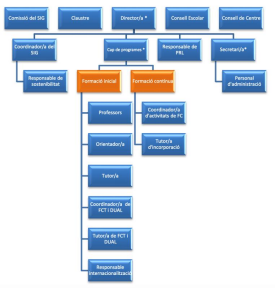
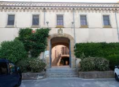
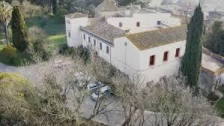

PRÀCTICUM II

Memòria de pràctiques

19 de maig, 2025

LAURA PAGÈS BARCELÓ

MÀSTER UNIVERSITARI EN FORMACIÓ DEL PROFESSORATD'EDUCACIÓ SECUNDÀRIA OBLIGATÒRIA I BATXILLERAT,FORMACIÓ  PROFESSIONAL I ENSENYAMENT D'IDIOMES

Índex:

A. DADES DE L’ESTUDIANT/A:......................................................................................... 2 B. DESENVOLUPAMENT DELS DIFERENTS APARTATS DE LA MEMÒRIA:.................. 4

PRIMERA PART. EL CENTRE I LA SEVA ORGANITZACIÓ................................................. 4 1. Coneixement i funcionament del centre...................................................................... 4 2. Professorat, alumnat, famílies .................................................................................... 7 3. Recursos ...................................................................................................................11 4. L’estada en l’empresa. La FP Dual (general / intensiva)............................................13 5. Destaqueu algunes experiències que penseu que són rellevants a nivell de centre i

altres que no funcionen. Argumenteu la vostra resposta. ..................................................15 6. Quines connexions realitzes entre el que has vist en el centre i els continguts tractats  en les assignatures del Mòdul genèric (organització escolar, aprenentatge i conducta i  societat i família)? .............................................................................................................16

SEGONA PART. DIDÀCTICA ESPECÍFICA I ACTUACIÓ A L’AULA....................................20 1. L’organització didàctica del departament...................................................................20 2. Els grups-classe i el professorat ................................................................................22 3. Elaboració de l’activitat d’ensenyament-aprenentatge i actuació ...............................25 4. Destaqueu algunes experiències que penseu que són rellevants, a nivell didàctic. ...34 5. Assistència a alguna de les Jornades o fires sobre innovació a l'ensenyament. ........36

C. REFLEXIÓ FINAL:.........................................................................................................38 Bibliografia: ...............................................................................................................................40 Annexos:...................................................................................................................................41

1

Laura Pagès Barceló - Memòria de pràctiques - Curs 24/25

A.DADES DE L’ESTUDIANT/A:

a) Resum biogràfic:

Sóc llicenciada en Biologia per la Universitat de Barcelona (UB). La meva trajectòria professional  abasta diversos àmbits de l'educació ambiental i la docència. Actualment, i des de novembre de  2017, treballo com a biòloga, educadora ambiental i coordinadora del simposi amb Puerto Rico  Luquillo Long Term Ecological Research (LTER) a la Fundació Bosque Ecosystem Monitoring  Program a Albuquerque, EUA, on també hi he realitzat treball de camp i a l'aula amb estudiants  de diverses edats. Des de 2021, treballo en línia desenvolupant material didàctic i coordinant  diferents aspectes de la fundació.

A més, he exercit de professora substituta en diversos instituts de secundària i cicles formatius  de grau mitjà, impartint matèries com biologia, tecnologia i cures auxiliars d'infermeria. També he  estat assistent de docència a la Facultat de les Ciències de la Salut de la Universitat de Nou  Mèxic, així com educadora ambiental en projectes internacionals com a Costa Rica. La meva  experiència docent és variada, i m'ha permès treballar amb estudiants de diferents edats i  contextos, aportant la meva passió per l'educació i la ciència.

b) Descripció de la docència realitzada fins al moment:

Fins al moment, he tingut diverses experiències docents en diferents contextos, tant en l'àmbit  de la formació formal com informal, la qual cosa m'ha permès desenvolupar una gran versatilitat  en la meva pràctica educativa.

A nivell de formació formal, he exercit com a professora substituta en diversos instituts i cicles  formatius de grau mitjà. He impartit matèries com biologia, tecnologia i cures auxiliars d'infermeria  en institucions com l'INS Bosc de la Coma, l'INS Narcís Xifra, l'INS Tossa de Mar, l'INS Cassà  de la Selva o l'INS Castelló d'Empúries. Aquestes tasques m'han permès treballar amb estudiants  de secundària i cicles formatius, adaptant les meves classes a les necessitats de l'alumnat i  utilitzant metodologies actives que inclouen tant classes teòriques com pràctiques.

A banda d'aquestes experiències docents en l'àmbit formal, també he desenvolupat una àmplia  experiència en l'educació ambiental i la docència en projectes no formals. Des de fa vuit anys, treballo com a biòloga i educadora ambiental per la Fundació Bosque Ecosystem Monitoring  Program. Durant els primers anys vaig impartir activitats tant a l’aula com a l’aire lliure sobre  ecosistemes de ribera dirigides a estudiants de diverses edats (de 3 a 25 anys). A més, vaig  exercir com a tutora de diversos projectes individuals de recerca d’estudiants de batxillerat.  Aquesta experiència m’ha permès combinar metodologies experimentals a l’aula amb activitats  pràctiques en l’entorn natural, promovent un aprenentatge actiu i participatiu que afavoreix la  comprensió dels conceptes científics a través de l’experimentació i la descoberta.

També he treballat com a assistent de docència a la Facultat de les Ciències de la Salut de la  Universitat de Nou Mèxic, on vaig ser responsable d'ensenyar Biologia a estudiants de primer  curs en un entorn acadèmic universitari. Aquesta experiència em va permetre desenvolupar

2

Laura Pagès Barceló - Memòria de pràctiques - Curs 24/25

competències en la gestió de grups i l’adaptació a les necessitats d’estudiants adults, millorant la  meva capacitat de transmetre coneixements en un context acadèmic formal.

En l'àmbit de l'educació ambiental informal, he estat involucrada en projectes internacionals com  el de Costa Rica, on he realitzat activitats educatives amb grups de nens, joves i adults, amb un  enfocament en la preservació de la natura i la conscienciació ecològica.

En general, la meva experiència docent ha estat molt variada i m’ha permès treballar amb una  àmplia gamma d’edats i contextos educatius, des de l’ensenyament acadèmic fins a la formació  en el medi natural. Aquesta diversitat m'ha ajudat a desenvolupar una metodologia flexible i  adaptativa, capaç de respondre a les necessitats i interessos de l'alumnat en diferents entorns.

c) Filosofia docent:

En aquest moment inicial de la meva trajectòria com a docent, em veig com una professional que  aposta per una metodologia educativa que prioritza les competències socioemocionals i  comunicatives. Aquestes competències considero que són fonamentals per establir relacions  empàtiques amb l’alumnat i per gestionar de manera efectiva els conflictes que puguin sorgir a  l’aula. Per a mi, la competència socioemocional va més enllà de la simple interacció; és clau per  a la creació d'un ambient d’aprenentatge positiu i respectuós. D'altra banda, entenc la  competència comunicativa com una eina essencial no només per a la transmissió de  coneixements teòrics, sinó també per transmetre valors, emocions i idees de manera clara i  eficaç.

Tot i que considero aquestes competències com els meus punts forts en aquest moment inicial,  també reconec que cal continuar treballant altres àmbits com la planificació de l’ensenyament,  l’avaluació dels aprenentatges i el desenvolupament professional continuat. Un bon docent ha de  ser capaç de planificar les seves classes de manera que els continguts siguin comprensibles i  aplicables, i avaluar-los de forma que afavoreixi el màxim rendiment de l’alumnat. Per a mi, la  pràctica constant en aquestes àrees és fonamental per millorar com a docent. També crec que  el desenvolupament professional és una tasca que s’ha de realitzar al llarg de tota la carrera, ja  que les metodologies educatives canvien amb el temps i és important mantenir-se al dia amb  aquestes novetats per poder adaptar-se als canvis i necessitats de l’alumnat.

3

Laura Pagès Barceló - Memòria de pràctiques - Curs 24/25

B.DESENVOLUPAMENT DELS DIFERENTS APARTATS DE  LA MEMÒRIA:

PRIMERA PART. EL CENTRE I LA SEVA ORGANITZACIÓ 1. Coneixement i funcionament del centre

a) Entorn i infraestructura del centre:

L'Escola Agrària i Alimentària de l'Empordà es un centre públic de formació professional que  forma part de la xarxa d’escoles del Servei de Formació Agrària (SFA) del Departament d’Acció  Climàtica, Alimentació i Agenda Rural (DACC). L’escola està situada en la Finca Camps i Armet,  al municipi de Monells, al Baix Empordà, on comparteix espai amb altres institucions com l'IRTA  (Institut de Recerca i Tecnologia Agroalimentàries) i el Gremi de carnissers de Girona per  conformar el Campus Agroalimentari del Gironès en un entorn rural.

L'edifici és una antiga casa senyorial adaptada per acollir els estudiants del Cicle Formatiu de  Grau Superior de Processos i Qualitat en Indústries Alimentàries. Les instal·lacions del centre  inclouen dos laboratoris (un de microbiologia i un d'anàlisi d'aliments), un obrador de pràctiques,  una cuina industrial per elaborar productes alimentaris, una sala d'estudi/biblioteca i una sala  d'actes. A més, l'alumnat té accés a instal·lacions addicionals de l'IRTA.

b) Oferta formativa del centre:

L'Escola Agrària de Monells, a més d'impartir el Cicle Formatiu de Grau Superior en Processos i  Qualitat en la Indústria Alimentària, ofereix una àmplia oferta de formació contínua orientada al  sector agroalimentari, distribuïda en dos àmbits principals. D'una banda, el centre proporciona  cursos i jornades de formació i serveis específics per al sector agroalimentari, incloent-hi una  formació exclusiva per als carnissers de Catalunya, de sis mesos durant dos anys, en  col·laboració amb la Fundació d'Oficis de la Carn. Aquesta formació té com a objectiu millorar les  competències professionals i contribuir a la professionalització del sector.

Aquesta vessant de les escoles agràries permet establir una relació estreta amb el sector privat  i facilita la identificació de les habilitats i competències que els estudiants han de desenvolupar  per obrir-se camí en el món laboral un cop acabin els seus estudis.

4

Laura Pagès Barceló - Memòria de pràctiques - Curs 24/25

D'altra banda, l'Escola Agrària de Monells també ofereix formació i serveis adreçats al sector  agrari en general, amb especialització en àrees com la vinya, l'olivera, els cereals, l'horta i la  producció agrària ecològica. A més, el centre imparteix formació obligatòria i proporciona  tutorització per a la incorporació de joves al sector agrari de la província de Girona. També  col·labora amb la Formació a Distància del Servei de Formació Agrària i valida cursos d'altres  entitats per a garantir l'actualització i qualificació contínua del sector.

c) Gestió, coordinació i avaluació del centre:

L’equip humà de l’escola està compost per set professors/es i dues auxiliars administratives. La  coordinació i gestió del centre està a càrrec del director, el cap de programes i la secretaria.  Aquests òrgans unipersonals de govern conformen l’equip directiu. D'altra banda, el consell  escolar, el consell de centre i el claustre de professors són els òrgans col·legiats que participen  en el control i gestió del centre. A continuació, es pot observar l’organigrama de l’escola:

L’escola, de mida reduïda, permet que l’equip docent treballi de manera coordinada i flexible. Tot  i que existeixen rols específics i cada docent té uns mòduls assignats, en cas d’absència d’algun  membre de l’equip, un company es fa càrrec de les seves tasques, ja que no es disposa de  personal substitut ni de sistema de guàrdies. Aquest model de treball presenta tant avantatges  com desavantatges. D’una banda, afavoreix una millor coordinació i cohesió entre els membres  de l’equip docent. D’altra banda, quan un docent es troba de baixa, els companys han d’assumir  les seves responsabilitats fins que es reincorpora o fins que es troba un substitut en cas de baixa  permanent, fet que comporta un augment de la càrrega de treball per a la resta del personal.

5

Laura Pagès Barceló - Memòria de pràctiques - Curs 24/25

A més, l’escola està certificada amb els sistemes ISO 9001 de gestió de la qualitat i ISO 14001  de gestió ambiental. Aquestes certificacions asseguren que el centre educatiu opera de manera  eficient i efectiva, prioritzant la satisfacció de les necessitats dels estudiants i altres parts  implicades, i promovent bones pràctiques en termes de qualitat i sostenibilitat.

d) Organització i la gestió dels centres

Dintre els documents d’organització i gestió de centre, la Norma d'Organització i Funcionament  del Centre (NOFC) estableix les directrius generals de funcionament que regulen tant els  aspectes pedagògics com administratius de l’escola. Aquest document es pot consultar a la  pàgina web de l’escola. Un dels aspectes que m’ha cridat l’atenció és la condició que els  estudiants han d'haver aprovat un mínim del 90% de les hores curriculars del primer curs per  poder iniciar les pràctiques a l’empresa, i dins d’aquestes hores, cal haver superat quatre dels  mòduls considerats essencials. Tot i que comprenc la necessitat d’aquest requisit elevat,  considero que una reducció del percentatge podria ser beneficiós per a aquells alumnes que, tot  i no destacar acadèmicament, mostren una bona capacitat en l'execució pràctica. Aquesta  mesura podria servir com a font de motivació per completar la part teòrica del cicle formatiu.

El Projecte Educatiu de Centre (PEC) és un dels documents fonamentals del centre, ja que  reflecteix la visió i els objectius pedagògics del centre, així com les línies mestres d'organització  i les metodologies utilitzades. Un aspecte destacat d’aquest document és l'apartat dedicat al  Sistema Integrat de Gestió, que es considera clau per al desenvolupament d'un model de gestió  eficient, orientat a millorar els processos interns de l'escola i garantir la satisfacció de tota la  comunitat educativa. Aquest document també està disponible a la pàgina web del centre.

Del Projecte de Direcció de Centre corresponent a l'any 2022, destacaria l'anàlisi i valoració  dels resultats dels darrers anys, especialment en relació al nombre d’alumnes matriculats tant al  CFGS com en la formació contínua. Aquesta anàlisi s’utilitza com a eina per guiar els objectius  establerts en el document. Pel que fa a la Memòria Anual, em crida l'atenció la inclusió d'apartats  com el Projecte de Convivència, el Projecte Lingüístic i la Cultura Digital del Centre, ja que  aquests es presenten en un document que considerava més orientat a l’avaluació, i no a la  presentació de projectes.

A través de la pàgina web també es poden consultar altres documents rellevants, com el Pla  Estratègic, el Projecte de Convivència i el Pla d'Acció Tutorial i d'Orientació (PATO). El Pla  Estratègic, tot i que comparteix algunes similituds amb el PEC, té una dimensió més global i de  llarga durada. Inclou dades rellevants, com l'evolució del nombre d'alumnes matriculats al llarg  dels anys, així com una anàlisi DAFO, que permet identificar les fortaleses, febleses, oportunitats  i amenaces del centre. El Projecte de Convivència realitza un diagnòstic exhaustiu dels punts  forts i febles pel que fa a la resolució de conflictes, l’organització, i els valors i actituds del centre.  A més, aquest projecte recull els objectius generals i específics vinculats a la convivència.  Finalment, el PATO recull les activitats previstes per a les sessions de tutoria, destacant  especialment la rellevància de les xerrades amb ex-alumnes i experts del sector, que considero  una font essencial d’informació i referència per als estudiants durant el seu període formatiu.

6

Laura Pagès Barceló - Memòria de pràctiques - Curs 24/25

e) Projectes transversals de centre:

L’escola compta amb diversos projectes transversals que aborden diferents àmbits del  funcionament del centre, dels quals destaquen el programa d'internacionalització Erasmus+ i el  projecte lingüístic.

El programa Erasmus+ per a Formació Professional (FP) és una iniciativa de la Unió Europea  dissenyada per promoure la mobilitat internacional dels estudiants, docents i personal d'FP. El  seu objectiu principal és millorar la qualitat de la formació i fomentar el desenvolupament de  competències professionals. Mitjançant aquest programa, es crea un pont de connexió entre  diversos països europeus, oferint oportunitats de creixement tant a nivell professional com  personal per als estudiants i docents. Així mateix, Erasmus+ contribueix a la millora de la qualitat  educativa, promou la mobilitat dins de la Unió Europea i facilita l'intercanvi cultural i educatiu entre  els països participants.

D'altra banda, el projecte lingüístic de l’escola estableix el català com a llengua vehicular  d’ensenyament-aprenentatge i com a llengua de relació en tots els àmbits del centre. L’objectiu  principal d’aquest projecte és promoure l'ús correcte i habitual del català i del castellà, assegurant  que els estudiants desenvolupin una competència lingüística sòlida en ambdues llengües. Aquest  document busca reforçar la cohesió lingüística i cultural, afavorint un ambient de respecte i  integració, així com contribuint a la formació d'alumnes capaços de comunicar-se eficaçment en  el seu context acadèmic i professional.

Ambdós projectes són fonamentals per garantir una formació de qualitat, internacionalitzada i  inclusiva, que afavoreixi tant el creixement personal com la preparació dels estudiants per a  afrontar els reptes d’un món globalitzat.

2. Professorat, alumnat, famílies

a) Tipologia de l’alumnat:

L’alumnat de la formació reglada inicial prové principalment de les comarques gironines, amb  una presència destacada d’estudiants de localitats properes a l’escola. En termes  socioeconòmics, la majoria pertany a famílies amb un estatus mitjà-alt, fet que es reflecteix en la  seva estabilitat acadèmica i en la disponibilitat de recursos per afrontar els estudis. Pel que fa a  les necessitats educatives especials, no es detecten casos habituals en aquesta formació. No  obstant això, cal assenyalar que l’escola no disposa de les adaptacions necessàries per atendre  estudiants amb mobilitat reduïda, fet que suposa una limitació per a aquells que requereixin  infraestructures específiques per garantir un entorn d’aprenentatge accessible.

D'acord amb els resultats d'una enquesta realitzada durant el curs acadèmic 2020-2021, el 50%  de l'alumnat va accedir al cicle formatiu immediatament després de cursar el batxillerat o estudis  universitaris, mentre que només el 25% provenia d'un grau mitjà. Quant a la situació laboral en

7

Laura Pagès Barceló - Memòria de pràctiques - Curs 24/25

el moment d'iniciar el cicle, el 50% dels estudiants es dedica exclusivament als estudis, mentre  que l'altre 50% combina la formació amb una activitat laboral, ja sigui a temps parcial o amb una  jornada reduïda. Aquestes dades són rellevants i haurien de ser considerades durant el  desenvolupament del curs, ja que permeten comprendre millor el perfil de l’alumnat, així com les  seves necessitats i disponibilitat.

En el cas de la formació contínua, la procedència geogràfica de l’alumnat es fa més diversa. Els  estudiants provenien de diferents regions, incloent-hi persones nouvingudes del Magrib, la Xina  i Hispanoamèrica, la qual cosa enriqueix la diversitat cultural i social del grup. En aquests casos,  els estudiants poden presentar una situació social més heterogènia, amb una varietat de recursos  econòmics i familiars, així com una comprensió limitada de la llengua catalana, fet que pot  representar un repte per a la seva integració en el sistema educatiu.

Per afavorir la seva participació i avaluació en igualtat de condicions, es permet als estudiants  realitzar els exàmens en català o castellà, segons la seva preferència, la qual cosa ajuda a  minimitzar les barreres idiomàtiques i a garantir una avaluació més justa. A més, es fomenta un  ambient inclusiu i respectuós amb la diversitat lingüística i cultural, que facilita la integració i el  desenvolupament personal i acadèmic dels estudiants de diferents orígens.

b) Funcions del professorat:

El professorat del centre assumeix diverses funcions que contribueixen al bon funcionament  acadèmic i organitzatiu de l’escola. L’orientador/a escolar s’encarrega d’assessorar i donar  suport als alumnes en l’àmbit acadèmic i professional, ajudant-los en la presa de decisions  educatives i en la seva inserció laboral. Els tutors/es de grup classe tenen la responsabilitat  d’acollir l’alumnat a l’inici de curs, fer un seguiment de la seva evolució acadèmica i personal,  controlar l’assistència i fomentar la convivència i la participació en les activitats escolars. A més,  convoquen les sessions d’avaluació i trameten els resultats acadèmics, alhora que assumeixen  tasques encomanades per la direcció del centre o el Departament d’Educació. Aquests dos rols  són fonamentals per garantir l’èxit escolar de l’estudiantat, ja que proporcionen un suport  personalitzat i contribueixen a crear un entorn educatiu favorable.

Pel que fa a la gestió interna del centre, el coordinador/a de Qualitat és responsable de la  implementació i millora del Sistema Integrat de Gestió de Qualitat i Ambiental, garantint el  compliment dels estàndards establerts. En relació a aquest primer, el coordinador/a de  Sostenibilitat promou la cultura ecològica dins del centre, impulsant iniciatives per fomentar  pràctiques responsables amb el medi ambient. D’altra banda, el coordinador/a digital lidera la  integració de les tecnologies digitals en l’ensenyament, gestionant els recursos tecnològics,  formant el professorat i garantint l’ús eficient d’aquestes eines per a la millora educativa. Crec  que aquests rols són fonamentals per al bon funcionament del centre ja que la seva tasca no  només millora l’experiència acadèmica de l’alumnat, sinó que també reforça el compromís de  l’escola amb la innovació, la responsabilitat ambiental i l’excel·lència en la gestió.

En l’àmbit internacional, el coordinador/a de Mobilitat Internacional gestiona els programes  d’intercanvi per a estudiants i docents, facilitant estades a l’estranger i promovent la participació

8

Laura Pagès Barceló - Memòria de pràctiques - Curs 24/25

en projectes internacionals per enriquir la formació acadèmica i professional. Així mateix, el  coordinador/a de Formació Continuada s’encarrega de dissenyar, organitzar i gestionar  programes formatius adreçats a professionals del sector agroalimentari, amb l’objectiu de  millorar-ne les competències i garantir-ne l’actualització constant en tècniques i coneixements  vinculats a l’agricultura, la ramaderia i la indústria alimentària. Tot i l'existència d'una figura de  coordinació, cada docent assumeix la responsabilitat d'organitzar i gestionar un nombre  determinat de jornades i cursos de formació continuada, a més de les seves tasques docents i  altres funcions assignades. Aquest fet pot suposar una càrrega laboral superior a la desitjada, fet  que pot afectar la dedicació i el rendiment en altres àmbits. Per tal de compensar aquesta  situació, en les escoles agràries, la càrrega lectiva del professorat és inferior a la d'altres centres  de secundària, permetent així una millor distribució del temps i recursos entre les diferents  responsabilitats.

Pel que fa a la relació amb el sector productiu, el coordinador/a de Pràctiques a l’Empresa  (DUAL) té la responsabilitat de gestionar i coordinar les estades formatives en empreses,  assegurant una formació de qualitat en l’entorn laboral i facilitant la connexió entre el centre i el  teixit empresarial. Considero que aquest càrrec és essencial per assegurar el desenvolupament  òptim de les competències pràctiques de l’alumnat, facilitant la seva inserció en el mercat laboral  i establint vincles sòlids entre el centre educatiu i el sector productiu, la qual cosa contribueix a  orientar els estudiants en els seus futurs passos professionals.

A més de les funcions específiques desenvolupades per l’equip docent, el centre compta amb  diversos responsables que garanteixen el correcte funcionament d’àrees estratègiques. El  responsable de màrqueting s’encarrega de la difusió i promoció del centre, mentre que el  responsable de Prevenció de Riscos Laborals (PRL) vetlla per la seguretat i el compliment de la  normativa. En l’àmbit científic i tècnic, el responsable del laboratori de química, el responsable  del laboratori de microbiologia i el responsable dels obradors i del taller de producció gestionen  les instal·lacions i asseguren la qualitat i seguretat en les pràctiques. A més, el responsable del  centre de Futura FP impulsa la innovació en la formació professional, i el responsable del Pla de  prevenció de pèrdues i malbaratament alimentari implementa estratègies per reduir el  desaprofitament d’aliments i fomentar una gestió més sostenible.

c) Atenció a la diversitat:

Tot i que l’escola no disposa d’un Pla d’Atenció a la Diversitat específic, aquest principi es troba  recollit en el Projecte Educatiu de Centre com un dels seus valors fonamentals. A més, el Projecte  de Convivència estableix com a objectiu "potenciar l’equitat i el respecte a la diversitat de  l’alumnat en un marc de valors compartits", reforçant així el compromís del centre amb la inclusió  i el respecte a la diversitat. No obstant això, a causa de la mida reduïda de l’escola i a la relativa  homogeneïtat de l’alumnat i del professorat, aquesta qüestió no ha estat un focus principal en el  desenvolupament de les polítiques educatives. La manca de diversitat en el centre pot suposar  un repte a l’hora d’abordar i aplicar estratègies d’inclusió i d’atenció a la diversitat de manera  efectiva. Tot i això, la sensibilització envers aquest tema continua sent present, i el centre podria

9

Laura Pagès Barceló - Memòria de pràctiques - Curs 24/25

explorar noves iniciatives per afavorir una cultura educativa més oberta i inclusiva, adaptant-se  millor a les necessitats d’un alumnat cada cop més divers.

d) Convivència i clima escolar. Prevenció, gestió i resolució de conflictes:

El centre educatiu ha de promoure un ambient positiu, basat en una convivència saludable i en  el respecte a la dignitat de les persones, creant un clima adequat per a l'estudi i el treball, on les  relacions interpersonals siguin respectuoses i igualitàries. En aquest sentit, l'escola assumeix el  compromís de garantir la igualtat de gènere, el tracte igualitari i la no discriminació en tots els  àmbits de la seva activitat. Per tal de garantir aquest ambient, s’han establert les Normes de  Convivència de l’escola, que inclouen aspectes com el respecte per la dignitat i les funcions de  tots els membres de la comunitat, la col·laboració i el respecte durant les activitats formatives i  entre companys, així com l’execució de les tasques encomanades pel professorat, entre altres.

Pel que fa a la gestió de conflictes, el Projecte de Convivència de l’escola especifica que no  existeix un procés definit ni una formació específica per al personal en aquest àmbit. Tot i això,  el centre disposa de diverses estratègies preventives per fomentar un ambient escolar  harmoniós. Una d’elles és la distribució d’un Dossier d’Informació General als alumnes el primer  dia de curs, on s’inclouen les normes de funcionament del centre per evitar situacions conflictives  i garantir-ne una resolució adequada si es produeixen. A més, l’alumnat té accés a tutories  individualitzades, que permeten abordar de manera personalitzada qualsevol problema o  desacord que pugui sorgir. Paral·lelament, el seguiment continu de l’assistència facilita la  detecció precoç de casos d’absentisme, un factor clau en la prevenció de conflictes. El Projecte  també recull un conjunt de protocols de prevenció, detecció i intervenció davant situacions  conflictives, seguint les directrius del Departament d’Educació. Tenint en compte l’experiència en  altres centres, es comprèn per què la gestió de conflictes no és una prioritat en aquesta escola:  el fet de comptar amb un alumnat reduït i relativament homogeni fa que les situacions conflictives  siguin poc freqüents, a diferència del que pot succeir en altres contextos educatius amb una  major diversitat i volum d’estudiants.

e) Relació amb les famílies:

La majoria de l’alumnat de l’escola és major d’edat, ja que cursa un Cicle Formatiu de Grau  Superior (CFGS). En aquest context, la relació del centre amb les famílies no és tan directa ni  sistemàtica com en els cicles formatius de grau mitjà, on l’alumnat és menor de 18 anys. En el  cas dels estudiants adults, la relació amb les famílies queda relegada a un segon pla, atès que  són els propis alumnes qui assumeixen la responsabilitat sobre el seu aprenentatge i  desenvolupament acadèmic i personal.

Tanmateix, quan l’alumne ho sol·licita expressament, el centre pot implicar les famílies en  qüestions relacionades amb el seu progrés acadèmic, mitjançant reunions per tractar el  rendiment escolar o altres aspectes personals i emocionals que puguin influir en la seva  trajectòria formativa. Aquesta col·laboració es duu a terme sempre amb el consentiment de  l’alumne, qui continua sent l’interlocutor principal amb l’escola. És important que les famílies  puguin intervenir quan sigui necessari, ja que poden aportar informació valuosa que pot passar

10

Laura Pagès Barceló - Memòria de pràctiques - Curs 24/25

desapercebuda o que l’alumne no desitja compartir directament. Aquest coneixement addicional  pot contribuir a contextualitzar millor la situació de l’estudiant i a adaptar millor l’acompanyament  educatiu a les seves necessitats.

D’altra banda, en el cas de l’alumnat menor d’edat, el centre estableix una comunicació més  regular amb les famílies per garantir-ne el seguiment acadèmic i el benestar general, promovent  així un entorn de suport que afavoreixi el seu desenvolupament integral.

3. Recursos

a) Relacions del centre educatiu amb els recursos de l’entorn:

L'escola manté una estreta col·laboració amb l’Institut de Recerca i Tecnologia Alimentària  (IRTA), un organisme de recerca de la Generalitat de Catalunya, vinculat al Departament  d’Agricultura, Ramaderia, Pesca i Alimentació, que forma part del Campus Agroalimentari del  Gironès, en associació amb el Gremi de Carnissers de Girona.

A més, l’escola ha establert aliances amb diverses empreses privades del sector agroalimentari,  entre les quals destaca Llet Nostra per la seva proximitat, ja que es troba situada adjacent al  campus, fet que facilita visites periòdiques dels alumnes.

Per complementar aquestes col·laboracions, l’escola treballa conjuntament amb entitats i  empreses del territori amb l’objectiu d’impulsar projectes i iniciatives orientades a la innovació en  el sector agroalimentari i al suport dels petits productors i elaboradors. Entre les accions més  rellevants, cal destacar la participació en la trobada de la Xarxa Agroalimentària del Baix  Empordà, en col·laboració amb l’àrea de Promoció Econòmica del Consell Comarcal, així com la  seva implicació en el desenvolupament del Pla Estratègic per al Desenvolupament Local i  l’Ocupació 2023-2027 per als municipis de la Bisbal d’Empordà, Forallac, Cruïlles, Monells i Sant  Sadurní de l’Heura, Corçà i Ullastret.

Aquestes col·laboracions representen un gran avantatge per a l’alumnat, ja que els permeten  accedir a una formació més pràctica i connectada amb la realitat del sector agroalimentari. El fet  de poder observar de primera mà processos productius i d’innovació els proporciona un  coneixement més profund i aplicat, difícil d’aconseguir en altres contextos formatius. A més,  aquesta proximitat amb empreses i institucions de referència afavoreix la inserció laboral dels  estudiants, ja que els facilita el contacte amb professionals del sector i els ofereix oportunitats  per establir relacions que poden ser clau per al seu futur professional. Aquest vincle amb l’entorn  productiu no només millora la qualitat de l’aprenentatge, sinó que també contribueix a posicionar  l’escola com un centre de referència dins del sector agroalimentari.

b) Recursos organitzatius i metodològics:

11

Laura Pagès Barceló - Memòria de pràctiques - Curs 24/25

L’escola disposa de dues aules (una per curs) dedicades a la impartició de classes teòriques. A  més, els alumnes tenen accés a una aula informàtica, un taller, un obrador, dos laboratoris i una  sala d’estudi/biblioteca.

Pel que fa a la metodologia, s’utilitza principalment la classe magistral per al contingut teòric i les  pràctiques al laboratori per a l’aspecte pràctic del curs. Tot i que els alumnes treballen  majoritàriament de forma individual, durant les sessions pràctiques tenen l’oportunitat de  col·laborar en petits grups per a l’agilització de les tasques.

En aquest sentit, considero que seria important iniciar la transició cap a metodologies actives  d’ensenyament-aprenentatge, ja que crec que beneficiarien tant l’alumnat com el professorat.  Aquestes metodologies fomenten un aprenentatge més dinàmic i participatiu, on l’estudiant  esdevé protagonista del seu propi procés formatiu i desenvolupa habilitats com el treball en equip,  el pensament crític i la resolució de problemes. A través del meu període de pràctiques, ja he fet  suggeriments que impliquen canvis metodològics, com la incorporació d’aprenentatge basat en  projectes i l’ús de tècniques més interactives a l’aula, i han estat molt ben rebuts. Crec que  continuar en aquesta direcció permetria als alumnes adquirir competències d’una manera més  significativa i adaptada a les necessitats reals del sector.

c) Grau de desenvolupament de l’estratègia digital de centre. Reflexioneu sobre: a. tenen definida una estratègia digital de centre (EDC)?

L’escola compta amb una EDC, que es pot consultar a la següent pàgina web:  https://sites.google.com/xtec.cat/edc-eaemporda/.

D’aquesta, m’agradaria destacar una particularitat de les escoles agràries que  desconeixia: a diferència dels centres de secundària, no reben dotació econòmica del  Departament d’Educació ni ordinadors en préstec del PEDC. Aquesta diferència pot  suposar un desavantatge en termes de recursos tecnològics i suport institucional, fet que  considero rellevant a l’hora de reflexionar sobre les necessitats específiques d’aquests  centres.

b. fan servir plataforma virtual? quina?

Principalment l’escola fa servir el Moodle com a plataforma virtual. Una altra particularitat  del centre es que no poden gestionar-lo directament ells i això ha portat alguns problemes.  Aquesta es una de les altres particularitats com a escola agrària que pot dificultar el  funcionament general de les classes.

c. quin és el posicionament del centre respecte a la utilització de dispositius mòbils?

L’ús de telèfons mòbils, aparells electrònics o qualsevol altre dispositiu que pugui  interrompre el bon desenvolupament de l’activitat escolar dins les instal·lacions del centre  no està permès durant les hores lectives, excepte si és autoritzat pel professorat per a

12

Laura Pagès Barceló - Memòria de pràctiques - Curs 24/25

finalitats pedagògiques. Aquesta norma té com a objectiu fomentar la concentració, evitar  distraccions i garantir un ambient d’aprenentatge adequat.

En general, els alumnes respecten aquesta normativa; tanmateix, com que tenen els seus  portàtils a classe, en ocasions els utilitzen de manera similar als mòbils per comunicar-se  entre ells o consultar contingut no relacionat amb les assignatures. Això pot representar  un repte per al professorat a l’hora de mantenir l’atenció dels estudiants i assegurar que  la tecnologia s’utilitzi amb una finalitat educativa. En aquest sentit, podria ser interessant  establir mecanismes de control més efectius o promoure una reflexió sobre l’ús  responsable dels dispositius electrònics a l’aula.

d. si no tenen una EDC, quin tipus de gestió de dispositius mòbils es fa servir? Sí que en tenen.

e. es dedica temps a l'aprenentatge amb el mòbil?

En general, no es dedica temps específic a l’aprenentatge amb el mòbil. Tot i això, els  alumnes el poden utilitzar en moments puntuals quan el docent els dona permís per a  tasques concretes. Comparteixo aquesta visió, ja que, segons la meva experiència, és difícil integrar el mòbil de manera eficaç en el procés d’aprenentatge. Tot i el seu potencial  com a eina educativa, sovint esdevé una font de distracció, i la seva implementació  requereix una regulació clara i un ús molt dirigit per obtenir resultats positius.

f. els materials són creats pel professorat?

En general, els materials utilitzats a classe, principalment presentacions en PowerPoint,  són elaborats pel docent responsable del mòdul. Tot i això, de manera esporàdica també  s’hi incorporen llibres o vídeos addicionals com a suport. Crec que el fet que la majoria  dels materials siguin de creació pròpia afavoreix la implicació del docent en les  explicacions, fent-les més personalitzades i adaptades a les necessitats dels alumnes.  Aquest enfocament acostuma a ser ben rebut per l’estudiantat, ja que percep un major  compromís per part del professorat, fet que alhora pot incrementar la seva motivació i  implicació en l’aprenentatge.

g. compten amb l’assessorament d’un “mentor digital”?

Disposen de l’assessorament d’un coordinador o coordinadora digital, una figura clau per  garantir el bon funcionament de les classes i resoldre possibles incidències tecnològiques,  facilitant així una experiència d’aprenentatge fluida i eficient.

4. L’estada en l’empresa. La FP Dual (general / intensiva)

a) Implementació del sistema dual al centre (convivència dels dos sistemes)

L’estada a l’empresa dins de la Formació Professional Dual (tant en la modalitat general com en  la intensiva) és una part fonamental del procés formatiu dels alumnes, ja que els permet combinar  els coneixements teòrics adquirits al centre educatiu amb l’experiència pràctica en l’entorn

13

Laura Pagès Barceló - Memòria de pràctiques - Curs 24/25

laboral. Aquest model afavoreix una connexió directa entre la formació acadèmica i les  necessitats del sector professional, proporcionant als estudiants una visió més realista i aplicada  de la seva futura professió.

L’escola ofereix la modalitat Dual des del curs 2015-2016, i des d’aleshores no s’han introduït  modificacions significatives en el seu funcionament. Durant la meva experiència, he pogut  observar com els alumnes comparaven allò que aprenien a classe amb el que veien a l’empresa,  fet que els ajudava a valorar positivament els continguts acadèmics i, al mateix temps, a apreciar  l’experiència pràctica en l’entorn laboral.

b) El paper dels tutors i les tutores i les seves relacions (del centre i d’empresa)

Tot i que durant les pràctiques no he pogut observar directament aspectes relacionats amb  l’estada a l’empresa, considero que els tutors i les tutores tenen un paper clau en aquest procés,  tant al centre educatiu com a l’empresa.

Al centre, el tutor guia l’alumne en el seguiment acadèmic i en el desenvolupament de  competències professionals, mentre que, a l’empresa, el tutor empresarial s’encarrega d’orientar lo en l’aplicació pràctica dels coneixements adquirits i en la seva adaptació al ritme i a les  exigències del lloc de treball.

La coordinació entre el tutor del centre i el tutor de l’empresa és essencial per garantir el bon  desenvolupament de l’estada. Per això, és fonamental establir mecanismes de comunicació  regulars que permetin avaluar el progrés de l’alumne, resoldre possibles incidències i ajustar els  continguts formatius segons les necessitats específiques de l’empresa i de l’estudiant.

c) El pla de formació. Activitats formatives a realitzar a l’empresa.

L’empresa i el centre educatiu estableixen un pla de formació que es comparteix amb l’alumne  per facilitar-ne el seguiment i garantir l’adquisició de les competències professionals. Aquest pla  defineix les activitats formatives que l’estudiant haurà de realitzar durant l’estada, assegurant una  progressió estructurada en l’aprenentatge.

La implementació del pla pot variar en funció del tipus d’empresa i de les seves necessitats  específiques. Així, les tasques assignades s’adapten a les característiques del lloc de treball,  permetent a l’alumne aplicar els coneixements adquirits al centre en un context real i  desenvolupar habilitats pràctiques essencials per al seu futur professional.

d) Seguiment i avaluació de les pràctiques. L’avaluació de l’empresa.

El seguiment i l’avaluació de les pràctiques es duen a terme a través de l’aplicació qBID, que  permet registrar i monitorar el progrés de l’alumne durant la seva estada a l’empresa.

14

Laura Pagès Barceló - Memòria de pràctiques - Curs 24/25

Per al seguiment, l’estudiant ha de completar mensualment un informe en el qual detalla les hores  dedicades a cadascun dels apartats del pla de formació i realitza una autoavaluació de les  tasques desenvolupades. Posteriorment, el mentor de l’empresa revisa i valora aquestes  mateixes tasques, i, finalment, el tutor del centre educatiu supervisa i valida els informes. Aquest  procés constitueix la base per a la qualificació final de l’avaluació per part de l’empresa.

A més, al llarg del curs es programen un mínim de tres seguiments formals entre el tutor del  centre i el mentor de l’empresa, que es duen a terme mitjançant correu electrònic, trucades o  reunions presencials. Aquestes trobades tenen com a objectiu analitzar l’evolució de l’estudiant,  resoldre possibles incidències i assegurar que el procés formatiu s’està desenvolupant segons  les expectatives establertes.

e) Quina és la vostra valoració general de la formació DUAL en el centre de pràctiques?

No puc fer una valoració objectiva d’aquest apartat, ja que durant les meves pràctiques no he  pogut observar directament aspectes relacionats amb l’estada a l’empresa. Tot i així, després de  conversar amb el mentor del centre, he pogut conèixer la seva perspectiva sobre el procés.

D’una banda, sembla que l’aplicació utilitzat per al seguiment de la Formació Dual no és prou  intuïtiu, fet que dificulta la gestió i el control del progrés de l’alumnat. D’altra banda, tots els tutors  estan obligats a realitzar una formació específica sobre la Formació Dual, la qual cosa suposa  una càrrega addicional per al professorat. Aquesta gestió extra s’afegeix a la ja elevada càrrega  de treball dels docents en centres de dimensions reduïdes, complicant encara més la situació.

5. Destaqueu algunes experiències que penseu que són rellevants a nivell de  centre i altres que no funcionen. Argumenteu la vostra resposta.

Una de les característiques que fa destacar el centre és el l’estreta relació amb el sector  professional. El meu primer dia a l’escola, vaig tenir l’oportunitat d’acompanyar els estudiants de  primer a una sortida a la granja de vaques de Llet Nostra, situada al costat de l’escola. Aquesta  sortida no ha estat un fet aïllat, ja que el cicle formatiu dona molta importància a la formació  pràctica. Els estudiants realitzen pràctiques al laboratori, elaboren productes alimentaris a  l’obrador i visiten diverses empreses del sector agroalimentari de la zona, ja sigui per  complementar els continguts d’un mòdul específic o per oferir una visió més àmplia del sector. A  més, l’escola ofereix formació contínua extracurricular, incloent jornades dins del període lectiu  per establir vincles directes amb el món empresarial, permetent als estudiants veure el que hi ha  més enllà de l’aula. Aquestes experiències són possibles gràcies als grups reduïts d’alumnes, fet  que afavoreix un aprenentatge més personalitzat i permet als docents adaptar-se millor a les  necessitats individuals. Aquesta dinàmica també fomenta la cohesió entre alumnes i professors,  creant un ambient de suport mutu i col·laboració a l’escola.

No obstant això, malgrat els avantatges que comporta treballar amb grups reduïts, la tendència  a la baixa en el nombre de matriculacions podria representar un desafiament significatiu a llarg  termini per a la viabilitat del centre. Un dels principals obstacles per a l'increment de nous

15

Laura Pagès Barceló - Memòria de pràctiques - Curs 24/25

estudiants és la seva ubicació geogràfica. Situada en un municipi del Baix Empordà, l'escola es  veu afectada per la manca d’una xarxa de transport públic eficient, amb horaris que no s'ajusten  a la jornada escolar. Aquesta situació obliga els alumnes a disposar de mitjans de transport privat  o a dependre de companys que en tinguin i resideixin en zones properes, fet que pot dificultar  l’accés d’estudiants procedents d’altres localitats.

Un altre aspecte susceptible de millora és l’adequació de les instal·lacions. L’escola es troba en  un edifici històric, la qual cosa, malgrat el seu valor patrimonial, pot limitar la funcionalitat i  l’adaptació a les necessitats actuals del sector agroalimentari. Aquesta circumstància pot  dificultar la incorporació de noves tecnologies i metodologies formatives que exigeixen  infraestructures modernes i equipaments especialitzats.

Finalment, una altra àrea de millora és la disponibilitat de personal especialitzat en l’atenció a les  necessitats educatives específiques de l’alumnat. La manca de professionals, com psicòlegs i  psicopedagogs, pot suposar una limitació en l’acompanyament i suport d’aquells estudiants que  requereixen una atenció personalitzada, afectant així la qualitat de la seva experiència educativa  i el seu rendiment acadèmic.

6. Quines connexions realitzes entre el que has vist en el centre i els continguts  tractats en les assignatures del Mòdul genèric (organització escolar,  aprenentatge i conducta i societat i família)?

16

Laura Pagès Barceló - Memòria de pràctiques - Curs 24/25

1) En l'assignatura d'Organització Escolar, impartida per en Toni, hem après que, en termes  generals, tot el que es realitza en un centre educatiu està subjecte a una normativa  establerta. Així, les diferents activitats que es duen a terme, incloses les sortides  programades, tenen un marc regulador que determina els procediments a seguir. Un  exemple d'aquesta normativa es dóna, fins i tot, en activitats tan quotidianes com les  sortides puntuals de l’aula, encara que aquestes es realitzin durant l'horari escolar i en  zones properes al centre, com ara un espai a prop de l'escola.

En el meu cas concret, vaig tenir l'oportunitat de fer de substituta en una optativa  experimental per a l'alumnat de 4t d'ESO. Durant aquesta experiència, vaig proposar als  meus companys la possibilitat de realitzar una sortida amb els estudiants durant l'hora de  classe, al riu situat al costat de l'escola, a només cinc minuts a peu. En parlar amb ells,  em van explicar que les professores de biologia realitzaven sortides freqüents durant les  hores de classe, i que, per a poder-les dur a terme, només calia que ho anotessin a la  plataforma iEduca amb una antelació d'uns quants dies.

No obstant això, més endavant, en converses amb en Toni, em va explicar que, en teoria,  aquestes sortides no es podrien realitzar sense una autorització formal prèvia.  Concretament, em va indicar que fins i tot aquestes activitats, que poden semblar de poca  envergadura, han de ser aprovades pel Consell Escolar del centre abans de dur-les a  terme.

Aquesta explicació em va portar a reflexionar sobre la rigidesa de la normativa en relació  amb les sortides de caràcter més informal i proper al centre. Si bé és cert que la regulació  té la seva importància, crec que s'hauria de permetre un cert grau de flexibilitat per part  dels centres i els docents en determinades situacions. Aquesta flexibilitat seria  especialment útil en situacions en què la demanda de les classes no es pot preveure amb  massa antelació, com és el cas de les activitats que depenen de factors puntuals o  espontanis. La capacitat de poder adaptar-se a les necessitats i dinàmiques del grup  sense que es requereixi una autorització formal cada vegada, en aquells casos en què la  seguretat i el bon ús del temps escolar es garanteixin, pot ser beneficiós tant per als  professors com per als alumnes, millorant l'aprenentatge i l'experiència educativa.

2) Durant l'assignatura d'Aprenentatge i Conducta, impartida per la Cristina, un dels temes  principals que vam abordar a classe i que vam treballar també mitjançant diferents treballs  escrits, va ser la importància del vincle en el procés d'aprenentatge. A mesura que  avançava en la meva tasca de substituta, em vaig adonar que al principi estava molt  centrada en cobrir tot el temari establert per al curs, amb l'objectiu de complir amb els  continguts previs. Aquesta preocupació per seguir estrictament el programa va fer que  deixés en segon pla les necessitats emocionals i relacionals dels alumnes que tenia  davant. No obstant això, al cap d'un temps, vaig començar a notar que alguna cosa no  anava bé, ja que els alumnes no semblaven gaire motivats ni implicats en les classes.

17

Laura Pagès Barceló - Memòria de pràctiques - Curs 24/25

Va ser llavors quan una companya de feina em va oferir un consell valuós: em va suggerir  que era fonamental crear un vincle més sòlid amb els estudiants, a través de pràctiques  com l'escolta activa i l'atenció a les seves necessitats emocionals. Aquesta recomanació  va marcar un punt d'inflexió en la meva forma d'ensenyar i d'interactuar amb els alumnes.  Progressivament, vaig començar a aplicar aquestes estratègies i, com a resultat, vaig  observar una millora notable tant en l'ambient de classe com en la motivació i implicació

dels estudiants en la matèria.

Posteriorment, durant les sessions en què vam estudiar la neurociència del vincle i la  manera en què aquest vincle afecta el comportament dels adolescents, vaig comprendre  amb més profunditat el perquè d'aquest canvi en el meu comportament docent i en el de  la meva classe. Em vaig adonar que el vincle afectiu és un element essencial en el procés  d'aprenentatge, ja que els adolescents necessiten sentir-se segurs i valorats per poder  estar motivats i compromesos amb el seu aprenentatge. Aquesta reflexió em va portar a  pensar que seria molt beneficiós que molts més docents tinguessin coneixements sobre  neurociència i neuroeducació, ja que aquests camps ofereixen eines i comprensió  fonamentals per a millorar la qualitat de l'ensenyament i, per tant, per entendre millor les  necessitats dels alumnes i adaptar-se a elles de manera més efectiva.

3) Un dels temes que hem tractat amb la Patricia en l'assignatura de Societat i Família ha  estat el de l'autoritat, un concepte complex i multifacètic que pot ser interpretat i aplicat  de moltes maneres diferents. Un dels aspectes que em va cridar especialment l'atenció  va ser aquell apartat dedicat a la pèrdua d'autoritat, concretament en els casos en què la  família qüestiona les decisions dels docents. Aquest tema va ressonar molt amb una  experiència personal que vaig viure en el meu període de pràctiques en un centre  educatiu.

En el meu cas, vaig estar treballant amb un alumne en particular que, des de l'inici, no  semblava mostrar gaire respecte per la meva figura com a docent. No sabia exactament  quin era el motiu d'aquesta falta de respecte, però vaig començar a notar una certa tensió  a l'aula. Tot va canviar després de l'examen final de la matèria, quan, poc després de  corregir-lo, em va arribar una petició de reunió per part del tutor del grup. Em va comunicar  que els pares de l'alumne volien parlar amb mi, ja que el seu fill els havia comentat que  no estava d'acord amb la nota que li havia assignat.

La reunió amb els pares va ser un moment força revelador i, per sorpresa meva, en lloc  d'escoltar els criteris que havia seguit per puntuar l'examen—criteris que havien estat  aplicats de manera uniforme per a tota la classe—els pares van començar a qüestionar  el meu criteri de puntuació. Aquest comportament em va sorprendre profundament, ja que  no m'esperava que la discussió es desviés cap a la meva manera d'ensenyar i avaluar en  lloc de ser una conversa constructiva sobre el rendiment de l'alumne.

Des de que vam tractar aquest tema a classe, he reflexionat molt sobre aquell episodi, i  amb el temps m'ha ajudat a entendre millor la dinàmica que es va crear amb aquell

18

Laura Pagès Barceló - Memòria de pràctiques - Curs 24/25

alumne. Vaig arribar a la conclusió que, en aquell moment, havia perdut l'autoritat davant  d'aquesta família, i per extensió, també davant de l'alumne. La postura dels pares va influir  directament en la percepció que l'alumne tenia sobre la meva figura autoritària, fet que va  afectar el seu respecte cap a mi com a docent. Aquesta experiència m'ha fet adonar de  com les dinàmiques familiars i les relacions entre els pares i els mestres poden jugar un  paper fonamental en l'establiment i manteniment de l'autoritat a l'aula.

19

Laura Pagès Barceló - Memòria de pràctiques - Curs 24/25

SEGONA PART. DIDÀCTICA ESPECÍFICA I ACTUACIÓ A L’AULA 1. L’organització didàctica del departament

a) Funcionament del departament:

L'Escola Agrària i Alimentària de l'Empordà no es divideix en departaments com altres  centres educatius més grans. A causa de la seva estructura reduïda —amb un únic Cicle  Formatiu de Grau Superior i una sola línia—, els set docents que hi treballen organitzen  la tasca docent i formativa de manera col·lectiva, funcionant com un únic equip.

El claustre es reuneix presencialment un cop per setmana a la biblioteca del centre.  Aquestes reunions serveixen per coordinar tant les classes del cicle com la resta  d’activitats formatives que s’hi imparteixen. La durada de les sessions depèn dels temes  a tractar, però habitualment és d’una hora.

Les reunions s'inicien amb la lectura i aprovació de l’acta anterior. Tot seguit, es fa un  seguiment dels acords presos i s’organitza el calendari de les setmanes vinents, amb  especial atenció a possibles incompatibilitats d’horaris —ja que aquests poden variar  segons la setmana— i a la planificació d’activitats com jornades tècniques, sortides o  visites formatives. Finalment, es dona pas a un torn obert de paraules per abordar temes  pendents o imprevistos.

A banda dels aspectes pedagògics i organitzatius, també es tracten qüestions  relacionades amb el funcionament intern del centre, com ara l’ús del vehicle d’empresa,  la gestió i neteja dels espais després del seu ús o la revisió i actualització de documents interns.

b) Tipologies d’activitats d’ensenyament-aprenentatge i estratègies d’aprenentatge:

Les activitats d’ensenyament-aprenentatge que es desenvolupen al cicle combinen  classes magistrals, pràctiques al laboratori i/o als obradors, i l’elaboració de treballs — tant individuals com en grup—. Aquesta diversitat metodològica permet abordar els  continguts des de diferents enfocaments i adaptar-se als diferents estils d’aprenentatge  de l’alumnat.

Durant les sessions teòriques a l’aula, els alumnes adquireixen coneixements sobre la  indústria alimentària amb el suport de presentacions en PowerPoint, vídeos explicatius  sobre diversos processos productius i l’exploració de recursos web especialitzats,  especialment aquells vinculats a la normativa alimentària vigent.

Les pràctiques constitueixen una part fonamental del cicle i es duen a terme de manera  setmanal al laboratori o als obradors del centre. Aquestes activitats inclouen tant  l’elaboració de productes alimentaris com l’anàlisi fisicoquímic i microbiològic d’aquests.

20

Laura Pagès Barceló - Memòria de pràctiques - Curs 24/25

Un exemple característic és l’elaboració de suc de poma de l’Empordà, on l’alumnat posa  en pràctica coneixements procedents de diverses matèries —com la legislació  alimentària, l’etiquetatge o les anàlisis de qualitat— per desenvolupar un producte final.  Aquestes pràctiques es fan en grups, tot simulant un entorn de treball real dins d’una  empresa del sector.

En aquest sentit, el treball col·laboratiu és un eix transversal del cicle. Els projectes en  grup es duen a terme a totes les matèries i afavoreixen el desenvolupament de  competències clau com l’autonomia, la responsabilitat, la comunicació i el treball en equip. Aquest enfocament no només contribueix a assolir els objectius d’aprenentatge,  sinó que també prepara els estudiants per a l’entorn professional que trobaran en acabar  la seva formació.

c) Innovació educativa lligades a l’especialitat:

Per tal de promoure la innovació educativa, el professorat de l’escola participa  regularment en jornades formatives organitzades pel Departament d’Educació amb  l’objectiu d’explorar i incorporar noves metodologies i recursos didàctics aplicables a  l’àmbit agroalimentari.

A més, el centre forma part del projecte Futura FP, una iniciativa que té com a finalitat  principal la identificació, implementació, millora contínua i difusió de pràctiques  innovadores en la Formació Professional. Aquest projecte facilita espais de reflexió i  col·laboració entre docents per transformar les metodologies i connectar millor  l’aprenentatge amb les necessitats actuals del sector.

L’escola també està inscrita en el programa Erasmus+, que ofereix oportunitats de  mobilitat i cooperació internacional. Tot i que en els darrers cursos l’activitat dins d’aquest  programa ha estat més limitada, es preveu reprendre’n el dinamisme en els propers anys.

Finalment, cal destacar que l’oferta de formació contínua pròpia de les escoles agràries  suposa un valor afegit per a l’alumnat, ja que complementa la seva formació reglada amb  continguts relacionats amb tendències i innovacions actuals del sector agroalimentari.  Aquesta formació, sovint vinculada a les demandes del territori, permet als estudiants  ampliar competències i mantenir-se actualitzats en un entorn professional en constant  evolució.

21

Laura Pagès Barceló - Memòria de pràctiques - Curs 24/25

d) Recursos propis del departament:

Tot i que a l’Escola Agrària i Alimentària de l’Empordà no es treballa amb departaments  diferenciats, sinó amb un únic equip docent coordinat, el centre disposa d’un conjunt ampli de  recursos propis que afavoreixen l’aprenentatge i el desenvolupament de les activitats formatives. Entre els recursos destacats, trobem els espais i equipaments habituals d’un centre educatiu,  com ara:

• Aules polivalents equipades amb ordinadors, projectors i connexió a internet, que  permeten desenvolupar classes amb suport TIC.

• Aula d’informàtica i altres equips informàtics disponibles per a l’alumnat i el  professorat.

• Sala d’estudi i espais comuns que faciliten el treball individual i col·laboratiu fora de  l’horari lectiu.

A més, com a centre especialitzat en l’àmbit agroalimentari, l’escola disposa de recursos tècnics  específics que permeten aplicar un enfocament molt pràctic de l’aprenentatge, com: • Laboratori d’anàlisi físico-química i microbiològica, equipat per a realitzar pràctiques  relacionades amb el control de qualitat alimentària.

• Obradors agroalimentaris, on es duen a terme processos d’elaboració d’aliments com  sucs, conserves o làctics, integrant coneixements transversals de diverses matèries. • Taller per a pràctiques de manteniment o manipulació d’equipaments utilitzats en el  sector.

També cal destacar:

a) Materials didàctics propis, elaborats pel mateix equip docent i adaptats a la realitat del  territori.

b) Vehicles del centre, que permeten realitzar visites tècniques, activitats externes i facilitar  el contacte amb empreses i institucions del sector.

La combinació d’aquests recursos, juntament amb una gestió col·laborativa i propera, permet  oferir una formació pràctica, contextualitzada i molt vinculada amb les necessitats del món laboral  agroalimentari.

e) Treball interdepertamental:

No s’escau.

2. Els grups-classe i el professorat

a) L’alumnat:

Al llarg del període de pràctiques he tingut l’oportunitat d’observar principalment el grup de primer  curs, ja que el meu professor-mentor imparteix la major part de la seva docència en aquest nivell.  Tanmateix, també he pogut assistir a algunes sessions del grup de segon, cosa que m’ha permès  fer comparacions entre nivells.

22

Laura Pagès Barceló - Memòria de pràctiques - Curs 24/25

El grup de primer està format per sis alumnes (tres nois i tres noies), fet que facilita un seguiment  molt proper del comportament i de les dinàmiques individuals. He observat aquest grup en  diverses matèries tècniques vinculades a la indústria alimentària, com ara anàlisi de laboratori,  elaboració de productes i coneixement del sector, així com en activitats transversals relacionades  amb el treball en equip.

Pel que fa a les dinàmiques observades, destaca una diferència clara segons el gènere. Les  noies solen mostrar una actitud més receptiva i participativa a l’aula. S’impliquen en les activitats,  tant individuals com col·laboratives, i segueixen les indicacions del professorat amb més facilitat.  Per contra, els nois —amb l’excepció d’un alumne— es mostren més reactius davant les  instruccions, es distreuen fàcilment (especialment amb l’ús del mòbil) i presenten més resistència  a l’hora de treballar en grup o dur a terme tasques pràctiques. Aquestes diferències també  s’evidencien en el rendiment general i en la predisposició cap a l’aprenentatge.

Aquestes observacions aporten indicis clars per reflexionar sobre la coeducació i com els  processos d’aprenentatge poden veure’s condicionats per actituds i expectatives socials  vinculades al gènere. En aquest cas concret, les noies responen millor a metodologies actives i  cooperatives, mentre que els nois semblen més còmodes amb formats més tradicionals com les  classes magistrals, tot i mostrar menys interès general per les matèries.

Dins el grup s’hi poden identificar perfils molt diversos: des de l’alumne molt aplicat i motivat, fins  a l’alumne amb actituds més desconnectades o apàtiques. També hi ha estudiants tímids, però  compromesos, i d’altres amb un paper més cohesionador dins del grup. Aquestes dinàmiques  individuals encaixen amb alguns rols estudiats durant el màster, com les figures del “jeta” o del  “manta”, que poden alterar l’equilibri col·lectiu si no es gestionen adequadament.

Pel que fa al grup de segon, tot i no haver-lo observat amb la mateixa intensitat, he pogut detectar  diferències significatives. Es tracta d’un grup més nombrós i heterogeni, tant pel que fa a edats  com a interessos. A diferència del grup de primer (on els alumnes tenen entre 18 i 22 anys), a  segon hi ha estudiants més grans, amb recorreguts diversos. Aquesta diversitat fa que els perfils  individuals quedin més diluïts dins de la dinàmica grupal. També es percep una certa  desconnexió, probablement relacionada amb el fet que es troben al final del cicle i focalitzen els  seus esforços en aprovar i preparar-se per a la seva incorporació al món laboral.

En general, l’alumnat de l’escola presenta un perfil força homogeni pel que fa a procedència i  condicions socioeconòmiques. Molts tenen vincles amb l’entorn rural o el sector agroalimentari,  cosa que facilita una connexió amb els continguts del cicle, tot i que la motivació i la implicació  varien en funció de les trajectòries personals.

b) El professorat:

Durant les pràctiques he pogut observar la feina d’un nombre divers de docents, amb edats i  trajectòries professionals diferents, fet que es tradueix en estils docents força variats a l’aula.

23

Laura Pagès Barceló - Memòria de pràctiques - Curs 24/25

Aquestes diferències es poden atribuir, principalment, a factors com l’experiència en la docència,  el grau de coneixement del sector i de les matèries impartides, així com a la personalitat i a les  preferències metodològiques de cada docent.

En general, he notat que els professors més joves o amb menys anys d’experiència tendeixen a  aplicar metodologies més interactives i participatives. Utilitzen preguntes obertes, dinàmiques  grupals i activitats pràctiques per motivar l’alumnat i afavorir la implicació activa a classe. Per  contra, els docents amb més experiència, si bé compten amb un discurs més estructurat i  treballat, tendeixen sovint a fer un ús més tradicional de la classe magistral. Aquest estil pot  resultar més atractiu i clar per a alguns alumnes, especialment quan el professor domina  profundament els continguts, però en certs casos pot provocar una menor participació o atenció  per part d’alguns estudiants.

Pel que fa a la influència de la matèria en la metodologia, és evident que els professors que  imparteixen assignatures que coneixen bé i que els entusiasmen transmeten aquest interès als  alumnes, la qual cosa contribueix a un millor ambient d’aprenentatge i una major motivació. En  matèries teòriques, predomina un esquema de classe magistral complementat amb explicacions  i exemples; mentre que en matèries pràctiques, com laboratoris o obradors, la participació activa  i el treball manual són predominants. Tanmateix, he observat que en la majoria de casos la  metodologia és bastant tradicional, alternant classes magistrals amb pràctiques i alguna activitat  puntual en grup o individual per reforçar els continguts. Crec que hi ha marge per a l’aplicació  d’estratègies més innovadores i participatives, com ara l’aprenentatge basat en problemes (ABP),  el treball cooperatiu o metodologies centrades en l’alumne, que podrien afavorir un aprenentatge  més significatiu i durable.

Pel que fa a la gestió del grup, cal destacar que els alumnes, amb una edat més avançada i major  maduresa, no presenten gaire conflictes de disciplina. Tot i això, és habitual detectar moments  puntuals de desmotivació generalitzada, sovint vinculats a l’estadi avançat del curs o a la  naturalesa d’algunes assignatures. En aquests casos, he observat que les respostes docents no  sempre són les més adequades, ja que alguns professors adopten una actitud més autoritària o  rígida, que pot contribuir a augmentar el desànim i no a generar un ambient positiu i estimulant.

Aquestes observacions posen de manifest la importància de desenvolupar competències docents  que incorporin no només el domini dels continguts, sinó també habilitats pedagògiques i  socioemocionals que facilitin la motivació i la participació de tot l’alumnat. La reflexió sobre les  diferents metodologies i estils observats em confirma que el repte del docent és combinar  coneixement, flexibilitat i creativitat per adaptar-se a les necessitats i característiques  específiques del grup classe.

c) Les interaccions:

Durant el període d’observació, he pogut apreciar que les interaccions entre l’alumnat són en  general positives i respectuoses, especialment tenint en compte que els grups són petits i amb  alumnes d’edat madura. A nivell d’alumnes, es detecten diferents dinàmiques segons el perfil

24

Laura Pagès Barceló - Memòria de pràctiques - Curs 24/25

dels participants: mentre alguns assumeixen rols de lideratge o cohesió del grup, altres tendeixen  a una actitud més passiva o fins i tot desmotivada. En els treballs en grup, tot i que la majoria  col·labora activament, hi ha casos en què alguns estudiants deleguen la responsabilitat als altres,  cosa que genera certa tensió puntual però que el professorat gestiona adequadament.

Pel que fa a la relació entre alumnes i professorat, es percep un clima general de respecte i  confiança. Els docents acostumen a fomentar la participació a través de preguntes directes o  retòriques i procuren involucrar tant els alumnes més actius com els més reservats, sovint  adreçant-se individualment als estudiants més tímids per animar-los a intervenir. No obstant això,  en moments de desmotivació, alguns professors adopten un estil més autoritari que pot afectar  negativament l’ambient i la implicació del grup. Aquesta actitud, encara que entesa com una  manera de mantenir l’ordre, podria beneficiar-se d’estratègies més empàtiques i motivadores per  promoure una participació més entusiasta.

Pel que fa a la relació entre el professorat, he observat una col·laboració professional basada en  el respecte i l’intercanvi d’idees. Hi ha una predisposició per part dels docents a adaptar-se i a  innovar quan es presenta l’oportunitat, tot i que la diversitat d’estils i experiència genera també  diferents maneres d’enfocar la docència i la gestió de l’aula. Aquesta pluralitat pot enriquir el  centre si es fomenta la comunicació i la reflexió conjunta sobre pràctiques pedagògiques.

En general, les interaccions al centre són respectuoses i positives, tot i que hi ha espai per millorar  especialment en com es gestiona la motivació i la participació dels alumnes. Si es treballés més  en fomentar un ambient més participatiu i proper, tant entre alumnes com entre professors i  alumnes, segur que l’experiència d’aprenentatge seria més agradable i efectiva per a tothom.

3. Elaboració de l’activitat d’ensenyament-aprenentatge i actuació a) Programació didàctica:

25

Laura Pagès Barceló - Memòria de pràctiques - Curs 24/25

es compartirà, si fos necessari, una possible font d’informació (https://mapaperills.uab.cat/perills-aliments/ o https://seguridadalimentaria.elika.eus/fichas-de-peligros/anisakis/) perquè tothom, independentment del  coneixement previ, tingui la mateixa informació al començar la sessió.

Fase 2: Fase d’investigació en grups "d'experts"

Els estudiants es separen per formar grups d'experts: Tots els estudiants que treballaran sobre un mateix tema  s'agrupen. Aquest grup d'experts serà responsable d'investigar a fons un aspecte específic, que després  compartiran amb el seu grup de base. Cada membre del grup haurà d’investigar els diferents aspectes  relacionats amb l’origen d’una de les tres tipologies de perills alimentaris:

• Biològic (Marina, Marçal)

• Químic (David, Íngrid)

• Físic (Aina, Pau)

En aquests grups d'experts, els estudiants es concentren per compartir i elaborar una taula del que han après  després de llegir la informació adient a partir de les fonts que s’han donat a classe. L’objectiu es que discuteixin  els punts més importants i preparin una taula/esquema de forma individual sobre el tema que han investigat  amb els punts més importants indicats a continuació:

• Tipus (nom complet)

• On es troba (endògen/exògen)

• Efectes

• Mesures preventives i/o correctores

Fase 3: Retorn als grups de base i integració del coneixement

Els estudiants tornen als seus grups de base. En aquesta fase, cada estudiant compartirà el coneixement  adquirit dins del seu grup d'experts amb els altres membres del seu grup de base. Cada membre del grup  de base serà responsable de transmetre el seu coneixement sobre el tema que ha investigat, i tots els  membres hauran de prendre notes i ampliar així les taules que han elaborat individualment amb els altres  orígens que no han treballat al grup d’experts.

Així, els membres del grup de base combinaran la informació de totes les parts per construir un  coneixement complet i integrat sobre els perills alimentaris segons l’origen.

Els membres de cada grup es coordinen per compartir les seves investigacions i discutir com els diferents  aspectes del tema es relacionen entre si. Cada grup haurà de sintetitzar i crear una única taula conjunta  que reflecteixi tota la informació obtinguda i que s’entregarà al final de la sessió per ser avaluada.

2. Sessió Presencial 3-4 (26-27/3/2025) – (~3 h)

Fase 1: Fase d’investigació en grups "d'experts"

Els estudiants es tornen a separar per formar grups d'experts de l’última sessió. Aquest cop però, en  comptes d’investigar sobre els diferents orígens dels perills alimentaris, investigaran els tres principals  productes derivats del peix a través d’uns vídeos proporcionats a través del Moodle:

o Congelats (Aina, Marçal): https://www.youtube.com/watch?v=UUxEDJpQPgE (sense cocció);  https://www.youtube.com/watch?v=kmsLTGjxCrY (amb cocció)

o Salaons (Marina, David): https://www.youtube.com/watch?v=trulKpf9GuA (anxoves l’Escala);  https://www.youtube.com/watch?v=Bkom73U9IBY (anxoves Cantàbric)

o Conserves (Íngrid, Pau): https://www.youtube.com/watch?v=UNIXNi9lul8 (sardines);

https://www.youtube.com/watch?v=hDO4saDrJJQ (tonyina)

Cada alumne elabora un diagrama del procés, considera quins són els paràmetres de control (punt de  control crític del procés) i els paràmetres tècnics (equips, temperatura, aigua...). Un cop elaborat aquest  document el comparteixen amb el company del grup d’experts per comparar quines diferències han trobat  entre els dos vídeos.

26

Laura Pagès Barceló - Memòria de pràctiques - Curs 24/25

27

Laura Pagès Barceló - Memòria de pràctiques - Curs 24/25

28

Laura Pagès Barceló - Memòria de pràctiques - Curs 24/25

29

Laura Pagès Barceló - Memòria de pràctiques - Curs 24/25

b) Recursos didàctics:

Els recursos didàctics d’elaboració pròpia utilitzats en la intervenció inclouen: la plantilla de treball  per a la recollida d’informació sobre els perills alimentaris (veure annexos), les rúbriques  d’avaluació (coavaluació i autoavaluació), el formulari de retroacció final per a l’alumnat i les  preguntes de debat amb perspectiva de gènere, dissenyades per fomentar la reflexió crítica  durant la posada en comú.

Pel que fa als recursos existents i disponibles en línia, s’han emprat vídeos de YouTube sobre  els processos de transformació del peix, el material allotjat al Moodle (incloent-hi els enllaços al  Mapa de Perills Alimentaris), així com diverses eines digitals com Canva, Google Slides i Google  Docs per elaborar presentacions i treballs col·laboratius.

c) Disseny de recursos didàctics que comporti alguna dimensió de la Competència Digital  Docent (CDD):

Al llarg de la proposta d’ensenyament-aprenentatge, s’incorporen diferents activitats que  afavoreixen el desenvolupament de la Competència Digital Docent (CDD) en diverses de les

30

Laura Pagès Barceló - Memòria de pràctiques - Curs 24/25

seves dimensions. Pel que fa a l’ús de recursos digitals per a l’aprenentatge actiu, vinculat a la  dimensió 3 (Ensenyament i aprenentatge), els estudiants treballen amb vídeos educatius  disponibles a YouTube i consulten fonts digitals específiques, com el portal "mapaperills", per  desenvolupar la seva recerca i generar coneixement de manera autònoma i guiada.

En relació amb la creació de continguts digitals col·laboratius, associada a la dimensió 2  (Continguts digitals), els grups d’alumnes elaboren documents compartits mitjançant Google  Docs i presentacions amb eines com Google Slides o Canva, fet que fomenta tant l’organització  del contingut com la comunicació visual eficaç. A més, per a l’avaluació i la retroalimentació,  vinculades a la dimensió 4, es fa ús de rúbriques compartides digitalment que permeten  l’autoavaluació i la coavaluació, així com la recollida de retroacció a través d’un formulari digital,  afavorint l’anàlisi i la reflexió sobre el procés d’aprenentatge.

També es promou el desenvolupament de la competència digital de l’alumnat, d’acord amb la  dimensió 6, mitjançant el treball col·laboratiu en entorns digitals que contribueix a desenvolupar  habilitats relacionades amb l’organització, la negociació i la comunicació respectuosa dins l’ús de  tecnologies.

Aquesta integració de la competència digital no només dona suport als objectius d’aprenentatge  de l’activitat, sinó que també contribueix a preparar l’alumnat per a un entorn professional cada  vegada més digitalitzat.

d) Metodologies docents:

En la proposta d’activitat d’ensenyament-aprenentatge s’han aplicat diverses metodologies  actives amb l’objectiu de fomentar un aprenentatge significatiu, participatiu i vinculat a la realitat  del sector alimentari. Una de les metodologies centrals ha estat el treball cooperatiu mitjançant  el mètode del puzle d’Aronson, que ha permès que l’alumnat treballés de manera  interdependent i organitzada, assumint diferents rols dins de grups d’experts i de base. Cada  alumne ha esdevingut responsable de dominar una part del contingut i transmetre-la als seus  companys, afavorint l’adquisició de coneixement compartit i el desenvolupament d’habilitats  comunicatives.

També s’ha aplicat l’Aprenentatge Basat en Problemes (ABP), a través de l’anàlisi de casos  reals relacionats amb els perills alimentaris i els processos d’elaboració de productes derivats del  peix. Aquesta metodologia ha promogut el pensament crític i l’autonomia dels estudiants a l’hora  de cercar informació, prendre decisions i proposar solucions. Al llarg de l’activitat s’ha fomentat  el treball en equip i la col·laboració digital mitjançant eines com Google Docs i Google Slides,  que han facilitat l’elaboració col·lectiva de materials i presentacions.

Així mateix, s’han utilitzat recursos digitals diversos com vídeos educatius de YouTube, l’eina  Canva per a la creació de materials visuals, i la web del “Mapa de perills alimentaris” de la UAB  com a font de consulta, afavorint una aproximació multimodal i adaptada a diferents estils  d’aprenentatge.

31

Laura Pagès Barceló - Memòria de pràctiques - Curs 24/25

Finalment, durant la fase de tancament s’ha incorporat un espai de debat guiat amb perspectiva  de gènere, en què l’alumnat ha reflexionat sobre les desigualtats existents en el sector alimentari  pel que fa als rols i condicions laborals, promovent així una mirada crítica i inclusiva. Aquest  conjunt de metodologies ha propiciat un entorn d’aprenentatge actiu i contextualitzat que potencia  tant les competències professionals com personals i digitals de l’alumnat.

e) Reflexió sobre la transferència a l’aula de la programació dissenyada:

Al llarg del període de pràctiques i abans de la implementació definitiva de l’activitat  d’ensenyament-aprenentatge a l’aula, vaig fer diverses modificacions a la proposta inicial.  Aquestes adaptacions van ser possibles gràcies, en part, a les orientacions del meu mentor, però  també van estar condicionades pel temps real que finalment se’m va assignar per dur-la a terme.  La programació inicial va anar evolucionant progressivament fins a adaptar-se a les  circumstàncies concretes del context i del grup classe.

Durant la seva aplicació a l’aula, vaig haver de fer diversos ajustos i improvisacions. Per exemple,  un dels canvis més rellevants va ser la gestió del temps destinat a cada activitat. En general, tot  el procés es va allargar més del previst, principalment perquè no es va poder fer la introducció  prèvia al tema fora de l’aula, tal com tenia previst inicialment. Seguint la recomanació del meu  mentor, aquesta fase d’entrada es va fer directament durant la primera sessió, cosa que va  requerir més temps del que havia planificat i va condicionar l’organització global.

També vaig haver de modificar la composició dels grups entre una activitat i una altra, ja que la  configuració inicial no va afavorir la dinàmica cooperativa ni la participació equitativa. A més, vaig  revisar i adaptar alguns dels recursos digitals que havia compartit a l’inici, perquè no acabaven  d’encaixar amb els objectius de les tasques i generaven confusió en l’alumnat.

Tot i aquestes modificacions, la valoració per part dels estudiants va ser positiva. Segons es pot  veure en la retroacció recollida (veure annex), l’activitat va ser ben rebuda i l’alumnat va mostrar  interès i implicació en el seu desenvolupament.

f) Aplicació de la pràctica reflexiva en les intervencions:

Fase 1. Actuació, pràctica concreta.

Durant la implementació de la unitat didàctica, una de les activitats clau requeria que l’alumnat  treballés en grups cooperatius. Inicialment, havia planificat aquests grups abans de començar  l’activitat, tenint en compte aspectes com la diversitat de perfils i la participació observada en  sessions anteriors. La primera dinàmica grupal es va portar a terme el dijous 13 de març a les  10.30 h, amb l’objectiu que cada grup analitzés un risc alimentari específic i elaborés una  proposta de millora per garantir la seguretat alimentària.

Fase 2. Anàlisi i verbalització de la pròpia actuació.

32

Laura Pagès Barceló - Memòria de pràctiques - Curs 24/25

Tot i la planificació prèvia, vaig observar durant el desenvolupament de l’activitat que els grups  no funcionaven de manera equilibrada. Alguns alumnes no participaven gaire i es generaven  situacions de desequilibri pel que fa a la distribució de tasques i la presa de decisions. Això va  generar tensions internes i una manca d’eficiència en alguns dels equips. La meva intenció era  fomentar la col·laboració i la corresponsabilitat, però la configuració prèvia dels grups no ho va  afavorir del tot.

Fase 3. Procés de conscienciació:

3.a. Reflexió individual.

En revisar el que havia passat, vaig adonar-me que havia prioritzat criteris de distribució massa  rígids i que no havia tingut prou en compte la dinàmica real dels grups, ni les preferències ni les  relacions interpersonals entre l’alumnat. Em vaig adonar que, en aquest cas, una actitud més  flexible i una observació més atenta durant les primeres sessions haurien pogut ajudar-me a  configurar millor els equips. També vaig entendre que la manera com es distribueixen els grups  pot tenir un impacte directe en la implicació de l’alumnat i en la qualitat del seu aprenentatge.

3.b. Reflexió compartida (amb el mentor/a).

Després de la sessió, vaig compartir aquestes observacions amb el meu mentor, qui va coincidir  que la dinàmica de grup és clau en aquest tipus d’activitats i que sovint cal ajustar-la durant el  procés. Em va suggerir fer canvis als grups si calia, i em va animar a observar com interactuaven  i a intervenir amb naturalitat si detectava situacions de desequilibri. També vam parlar sobre com  implicar l’alumnat en la reflexió sobre el treball en equip, per afavorir una major consciència  col·lectiva del procés col·laboratiu.

Fase 4. Cerca d’alternatives i creació de nous mètodes que milloren les pràctiques posteriors.

A partir d’aquesta reflexió, vaig decidir reorganitzar els grups per a la següent sessió. Aquesta  vegada, vaig combinar criteris pedagògics amb una observació més directa de les afinitats i les  actituds col·laboratives dels alumnes. També vaig introduir una breu dinàmica inicial per fomentar  el diàleg dins els equips, i vaig explicitar més clarament els rols i les responsabilitats de cada  membre. A més, vaig compartir amb l’alumnat els criteris amb què s’avaluaria la col·laboració per  fer-los més conscients de la importància del treball en equip.

Fase 5. Aplicació dels nous mètodes. Noves intervencions i avaluació.

A la sessió següent, els nous grups van funcionar millor. Es va notar una major implicació per  part de l’alumnat, una millor distribució de les tasques i una comunicació més fluïda dins dels  equips. Vaig poder observar una millora significativa en la qualitat dels resultats finals i també en  l’ambient de treball. A més, la incorporació de la coavaluació i de la reflexió grupal posterior va  reforçar aquest aprenentatge. Aquesta experiència m’ha ajudat a prendre consciència de la  importància de ser flexible i d’observar constantment l’aula per adaptar la meva intervenció a les  necessitats reals del grup.

33

Laura Pagès Barceló - Memòria de pràctiques - Curs 24/25

4. Destaqueu algunes experiències que penseu que són rellevants, a nivell  didàctic.

Descripció de l’experiència:

Els alumnes de primer curs del Cicle Formatiu de Grau Superior en Processos i Qualitat en la  Indústria Alimentària de la nostra escola van participar en la 4a trobada de CFGS del sector,  organitzada per una escola agrària del Pallars. Aquesta trobada va reunir diferents centres que  imparteixen cicles formatius del sector agroalimentari, i va oferir una jornada de convivència i  intercanvi d'experiències. Cada grup d'alumnes va liderar una activitat relacionada amb el seu  cicle, com ara l'extracció de mel per a l’elaboració de productes apícoles o la preparació de  begudes probiòtiques a partir de fruita fermentada.

A més de les activitats pràctiques, cada centre va compartir productes d’elaboració pròpia i es  van realitzar sessions teòriques, com una classe sobre el control d’al·lèrgens. Per finalitzar la  jornada, es va fer un reconeixement als millors productes presentats. Van assistir-hi també els  directors dels centres participants, així com representants institucionals com el cap de serveis  del Departament, Joan Minguet.

Objectius de l’experiència:

Els objectius didàctics principals eren promoure la cohesió del grup, fomentar el treball  col·laboratiu i facilitar l’intercanvi de coneixements i tècniques d’elaboració pròpies de diferents  zones del territori. Aquesta activitat pretenia generar aprenentatge entre iguals en un context  pràctic i real.

Els continguts de l’experiència es van relacionar directament amb el mòdul de Tecnologia  Alimentària. Els alumnes que van participar en la trobada van preparar una presentació per  compartir el que havien après amb la resta del grup classe, facilitant així una transferència de  coneixements significativa.

Metodologia utilitzada:

La metodologia es va basar en una experiència vivencial i participativa, amb un fort component  pràctic i col·laboratiu. Les activitats es van adaptar a les necessitats i interessos de l’alumnat,  permetent diferents nivells d’implicació. Per exemple, en l’activitat d’extracció de mel, alguns  alumnes van optar per no participar directament per incomoditat amb la presència d’abelles, i  se’ls va assignar una altra tasca complementària.

Abans de cada sessió es va fer un repàs dels coneixements previs mitjançant una presentació i  un debat obert, per tal que tot l’alumnat partís d’un nivell comú. També es van tenir en compte  aspectes de diversitat, com el cas d’una alumna amb mobilitat reduïda, a qui es van assignar  tasques adaptades durant les activitats a l’exterior.

Resultats i impacte:

Els resultats van ser molt positius. L’alumnat va valorar molt bé l’experiència en el qüestionari  final, destacant el fet d’haver pogut conèixer altres joves amb interessos comuns i d’aprendre

34

Laura Pagès Barceló - Memòria de pràctiques - Curs 24/25

noves tècniques de manera pràctica. També es va observar un reforç en la cohesió del grup i  una millora de la motivació general. L’activitat va afavorir una actitud més oberta i participativa a  l’aula en els dies posteriors.

Reflexió personal:

D’aquesta experiència, he après el valor del treball cooperatiu i la potència de l’aprenentatge  entre iguals. Quan els alumnes comparteixen coneixements entre ells i es veuen com a referents,  l’interès i la implicació augmenten. Crec que aquest tipus d’activitats haurien de formar part  regular del currículum.

Tanmateix, també he detectat àrees de millora. En algunes activitats, els grups eren massa grans  i això va dificultar la participació activa de tothom. En el futur, caldria fer grups més reduïts per  garantir que tothom pugui tenir un rol actiu i significatiu.

Expectatives inicials:

L’activitat es va dissenyar amb l’objectiu de fomentar la cohesió del grup i l’aprenentatge  compartit entre estudiants de diferents centres. Es pretenia que l’alumnat visqués una  experiència educativa fora del centre que els permetés posar en pràctica els seus coneixements  i aprendre d’altres contextos.

Problemes identificats:

El principal obstacle va ser l’organització de les activitats pràctiques amb grups nombrosos, cosa  que va limitar la participació individual. A més, algunes activitats inicialment no estaven prou  adaptades a les necessitats del grup, com en el cas d’activitats a l’exterior per a alumnes amb  mobilitat reduïda. També el mal temps va afectar el desenvolupament de determinades  dinàmiques a l’aire lliure.

Anàlisis de la situació:

Per millorar l’experiència, hauria estat útil tenir prèviament informació detallada del grup  (necessitats específiques, preferències, limitacions) i planificar activitats més personalitzades.  També es podria haver previst una estructura més flexible per poder reorganitzar els grups i les  tasques segons les circumstàncies meteorològiques.

Reflexió personal final:

He après la importància de conèixer bé el grup abans de planificar activitats i de tenir en compte  la seva diversitat. També he pres consciència de la necessitat de fer grups més reduïts i de  dissenyar activitats amb espais per a la participació activa de tots els membres. Aquesta  experiència em fa replantejar com estructuro la meva pràctica docent en el futur i em confirma el  valor de les activitats entre iguals com a eina per enriquir l’aprenentatge i enfortir els vincles dins  el grup.

35

Laura Pagès Barceló - Memòria de pràctiques - Curs 24/25

5. Assistència a alguna de les Jornades o fires sobre innovació a l'ensenyament. a) Descripció de l’activitat:

El passat 2 d’abril de 2025 vaig assistir a la jornada "Tu, jo i el mòbil", organitzada pel Centre  Jove de Salut de l’Ajuntament de Girona en el marc de l’Expojove, un esdeveniment educatiu i  formatiu adreçat a joves. L’activitat es va dur a terme de manera presencial i va consistir en una  dinàmica participativa centrada en l’ús dels telèfons mòbils i les xarxes socials, així com en la  reflexió sobre la petjada digital i la permanència de les dades a Internet.

Durant la sessió, es va demanar als participants que escrivíssim tres fets rellevants de la nostra  vida durant l’any 2024. Posteriorment, vam comparar aquestes vivències amb el que havíem  compartit a les xarxes socials, fet que va generar una reflexió col·lectiva sobre la diferència entre  la vida real i la imatge projectada en línia. També es va tractar el tema de la visibilitat de les dades  personals i de com aquestes poden ser utilitzades per empreses a través d’algoritmes per  personalitzar la publicitat.

b) Aprenentatges obtinguts:

Un dels aprenentatges més significatius de la jornada va ser la necessitat de ser conscients del  que compartim en línia, així com les implicacions d’aquesta exposició en la nostra identitat digital  i la nostra salut mental. Em va impactar especialment la reflexió sobre la comparació constant  amb les vides aparentment "perfectes" que veiem a les xarxes socials, i com això pot afectar  negativament l’autoestima, especialment en adolescents.

També va ser reveladora la idea que, sovint, mostrem només una versió seleccionada i embellida  de la nostra vida, i que les empreses tecnològiques utilitzen aquestes dades per dirigir-nos  continguts i anuncis que poden condicionar les nostres decisions i preferències.

c) Implementació en la practica educativa:

Considero fonamental que l’escola assumeixi un paper actiu en l’educació digital crítica. Una  primera acció seria establir normatives clares sobre l’ús del mòbil a l’aula, combinades amb tallers  formatius sobre privacitat, identitat digital i ús responsable de la tecnologia. També seria molt  interessant impulsar activitats de "desconnexió conscient", com ara setmanes sense mòbil, tallers  de "dieta digital" o reflexions guiades sobre l’ús de pantalles, per ajudar l’alumnat a fer-ne un ús  més equilibrat i saludable.

Aquestes propostes poden contribuir a reduir la dependència tecnològica, millorar l’atenció a  l’aula i fomentar una cultura digital més crítica i reflexiva.

d) Valoració personal:

Personalment, considero que aquesta jornada ha estat molt enriquidora i necessària. M’ha ajudat  a prendre consciència dels efectes emocionals i socials de l’ús constant del mòbil i les xarxes  socials, especialment entre els joves. A nivell professional, ha contribuït al meu desenvolupament

36

Laura Pagès Barceló - Memòria de pràctiques - Curs 24/25

com a futura docent, ja que m’ha permès treballar competències com l’empatia, la comprensió  del context juvenil actual i la capacitat de dissenyar intervencions educatives adaptades a les  necessitats reals de l’alumnat.

M’agradaria poder aprofundir més en estratègies pedagògiques per integrar l’educació digital a  l’aula, amb l’objectiu de formar alumnes autònoms, crítics i emocionalment sans en relació amb  l’ús de la tecnologia. Aquesta jornada connecta plenament amb la meva pràctica docent actual,  especialment pel que fa a la detecció de l’addicció al mòbil i la manca de presència emocional i  atenció de certs alumnes, fet que reforça la necessitat de tractar aquest tema des de l’educació.

37

Laura Pagès Barceló - Memòria de pràctiques - Curs 24/25

C.REFLEXIÓ FINAL:

Fa temps que estic vinculada al món de la docència, de manera directa o indirecta, i això ha fet  que la meva perspectiva s’hagi anat transformant amb els anys. La meva visió sobre què significa  ensenyar ha evolucionat i madurat progressivament, i estic convençuda que continuarà canviant,  perquè considero que l’autoreflexió constant és una part essencial per ser una bona professional  de l’educació.

Amb el temps, he après a apropar-me als alumnes des d’un lloc més humà, a escoltar què  necessiten de mi més enllà dels continguts que he de transmetre. També he après a detectar  què funciona i què no dins de l’aula, i m’he anat tornant més flexible, tant en les meves  expectatives com en les meves exigències. Tot i això, en alguns moments encara em mostro  exigent amb el que demano, i reconec que em pregunto sovint si això és una fortalesa o una  debilitat. En qualsevol cas, és un aspecte que continuo revisant.

Durant aquests últims anys exercint com a docent a Catalunya, he reflexionat molt sobre el nostre  paper i sobre com ha canviat el sistema educatiu. Potser pel fet que vinc d’una família on la  docència ha estat sempre present —el meu pare hi ha dedicat gran part de la seva vida—,  l’educació sempre ha estat un tema de debat a casa, i per tant, m’ha interpel·lat des de fa temps.

Un dels temes que més m’interessen és el de trobar l’equilibri entre l’exigència i la permissivitat.  Tinc la sensació que l’educació al nostre país ha passat d’un extrem a l’altre: d’un model massa  rígid i dur a un de massa permissiu i individualitzat. Em pregunto sovint quin podria ser el punt  mig, i crec que és un dilema que continuaré explorant, dins i fora de l’aula. En aquest sentit,  també m’agradaria implicar-me més en projectes docents amb una vessant social, perquè crec  que vivim en una societat complexa, i l’educació és una eina fonamental per fer-hi front.

A més, crec que el meu bagatge personal i professional m’ha dotat d’un conjunt d’eines  pedagògiques que he anat adquirint, fins i tot de manera inconscient. Especialment durant la  meva etapa com a educadora ambiental, vaig incorporar recursos i estratègies que sovint no es  tenen en compte en el context estrictament acadèmic, però que considero molt valuoses dins  l’aula.

Pel que fa a les pràctiques del màster, m’enduc moments molt especials, com els que anomeno  “moments aha”: aquells instants en què, després d’explicar un concepte d’una manera diferent,  veus com a l’alumnat li fa “click” i, de cop, ho entén. Són moments màgics que donen sentit a la  professió, i crec que molts docents hi estem per això, o almenys hi esperem trobar aquests  instants.

Una altra experiència significativa ha estat tornar a posar-me al lloc d’alumna. Fer aquest màster  m’ha fet recordar què significa ser estudiant, i això m’ha permès empatitzar millor amb l’alumnat,  especialment quan es troben en situacions d’estrès, frustració o desmotivació, com les que jo  mateixa he viscut.

38

Laura Pagès Barceló - Memòria de pràctiques - Curs 24/25

Durant les pràctiques, he pogut posar en marxa diverses metodologies actives que he après al  màster, i tot i que m’hauria agradat aprofundir-hi més, he vist l’impacte positiu que tenen en  l’alumnat. Per això, vull continuar formant-me en aquest àmbit i aplicar-les de manera més  conscient i sistemàtica.

Tot i que en aquest centre no he pogut treballar gaire amb la diversitat a l’aula per la seva pròpia  naturalesa, sí que he tingut experiències prèvies com a substituta on aquest aspecte ha estat  molt present. En aquest sentit, el màster m’ha ajudat a reflexionar sobre com abordar situacions  diverses, i sento que ara disposo de més recursos per afrontar-les.

Un altre aprenentatge important ha estat constatar, un cop més, la importància del treball en  equip. He viscut experiències en centres d’alta complexitat que funcionaven molt bé gràcies a la  cohesió del claustre. Quan hi ha col·laboració real entre docents, es nota, i molt, en el benestar i  l’aprenentatge de l’alumnat. Malauradament, també he vist què passa quan això no hi és, i  l’impacte negatiu que pot tenir.

Els meus objectius professionals passen per continuar a l’aula, però també per seguir formant me, especialment en metodologies d’aprenentatge i en tot allò relacionat amb la dimensió social  de l’educació. Sento que encara em cal aprofundir en com fer arribar els aprenentatges a tot  l’alumnat, especialment en grups heterogenis, i aquest és un repte que em motiva.

Finalment, aquest màster m’ha ajudat a reafirmar la importància de l’educació emocional en el  procés d’aprenentatge. Com a docents, no només transmetem coneixements, sinó que també  acompanyem persones en el seu creixement. I això, per mi, és una responsabilitat i un privilegi  alhora.

39

Laura Pagès Barceló - Memòria de pràctiques - Curs 24/25

Bibliografia:

Escola Agrària i Alimentària de l’Empordà. (2024). Normes d’Organització i Funcionament del  Centre (versió 7). Generalitat de Catalunya.

Escola Agrària i Alimentària de l’Empordà. (2024). Projecte Educatiu de Centre (versió 6).  Generalitat de Catalunya.

Escola Agrària i Alimentària de l’Empordà. (2022). Projecte de Direcció (versió 1). Generalitat de  Catalunya.

Escola Agrària i Alimentària de l’Empordà. (2024). Pla Anual (versió 0). Generalitat de Catalunya.

Escola Agrària i Alimentària de l’Empordà. (2023). Projecte Curricular de Centre (versió 5).  Generalitat de Catalunya.

Escola Agrària i Alimentària de l’Empordà. (2023). Pla d’Actuació Tutorial i Orientació (PATO)  (versió 4). Generalitat de Catalunya.

Escola Agrària i Alimentària de l’Empordà. (2023). Resum de l’Estratègia Digital de Centre (versió  0). Generalitat de Catalunya.

Escola Agrària i Alimentària de l’Empordà. (2023). Projecte de Convivència (versió 0). Generalitat  de Catalunya.

Escola Agrària de l’Empordà. (s.d.). Escola Agrària de l’Empordà. Generalitat de Catalunya.  Recuperat el [5 Febrer 2025], de https://agora.xtec.cat/eaemporda/

40

Laura Pagès Barceló - Memòria de pràctiques - Curs 24/25

Annexos:

Retroacció Activitat d’Ensenyament-Aprenentatge

41

Laura Pagès Barceló - Memòria de pràctiques - Curs 24/25

42

Laura Pagès Barceló - Memòria de pràctiques- Curs 24/25

43

Laura Pagès Barceló - Memòria de pràctiques- Curs 24/25

Taula perills Alimentaris (corregida)

44

Laura Pagès Barceló - Memòria de pràctiques - Curs 24/25

Exemple material dissenyat: diagrama de processos

45

Laura Pagès Barceló - Memòria de pràctiques - Curs 24/25

Rúbrica d’auto i coavaluació

46

Laura Pagès Barceló - Memòria de pràctiques - Curs 24/25

Espai moodle amb el contingut de l’AEA

47

Laura Pagès Barceló - Memòria de pràctiques - Curs 24/25

Exemple material dissenyat: taules perills alimentaris

48

Laura Pagès Barceló - Memòria de pràctiques - Curs 24/25

### Tabla 1

| Experiència viscuda,  
activitat... | Contingut concret i  
assignatura | Reflexiona, argumenta  la connexió feta |

| --- | --- | --- |

| 1) Incompliment calendari  sortides planificades i  
aprovades a principi de  curs. | Projecte Educatiu de Centre  (PEC) i altres documents  per a l’organització i la  gestió dels centres com el  Reglament d’Organització i  Funcionament (ROF) – Organització Escolar  | Hi ha un desencaix entre  el que diu la normativa i  la realitat dels centres. Hi  hauria d’haver una mica  de marge de maniobra. |

| 2) Canvi que vaig viure en  començar a prioritzar  
l'establiment del vincle  
amb els alumnes per  
sobre de la simple  
transmissió de  
continguts. | El vincle: Pautes per  
millorar la comunicació  entre professors i alumnes  – Aprenentatge i conducta | La neurociència del vincle  m’ha ajudat a entendre la  importància de dedicar  temps a la relació amb  els alumnes. |

| 3) Experiència de com la  pèrdua d’autoritat davant  la família influïa  
negativament en el  
respecte de l’alumne. | Autoritat: Per què perdem  autoritat? La família  
qüestiona les decisions del  professorat – Societat i  família | Les dinàmiques familiars  poden influir en el  
respecte dels alumnes  cap al docent. |

### Tabla 2

| Mòdul professional: Tecnologia Alimentària  | Codi activitat: A2.3 |

| --- | --- |

| Nom de l’activitat: De la mar a la taula: Desxifrant les alteracions i la Seguretat dels  Productes Derivats. | Durada: 10 hores |

| Descripció: 
En aquesta activitat, els estudiants utilitzaran el mètode de puzzle d'Aronson i altres per investigar i compartir  coneixements sobre els productes derivats del peix i els problemes de deteriorament tot treballant en grups  cooperatius. 
1. Sessió presencial 1 i 2 (19-21/3/2025) – Aplicació del mètode de puzzle d’Aronson (~3 h)  Introducció a la primera activitat – puzle d’Aronson 
Fase 1: Creació de grups de "base"  
El docent divideix els estudiants en 2 grups de base de 3 persones: 
• Grup 1: Marina, David, Aina 
• Grup 2: Íngrid, Pau, Marçal 
Cada grup de base serà responsable de compartir la informació recollida i de reunir tot el coneixement necessari  per completar el "puzzle" en forma de taula. A part de la informació treballada prèviament accessible al Moodle,  | Descripció: 
En aquesta activitat, els estudiants utilitzaran el mètode de puzzle d'Aronson i altres per investigar i compartir  coneixements sobre els productes derivats del peix i els problemes de deteriorament tot treballant en grups  cooperatius. 
1. Sessió presencial 1 i 2 (19-21/3/2025) – Aplicació del mètode de puzzle d’Aronson (~3 h)  Introducció a la primera activitat – puzle d’Aronson 
Fase 1: Creació de grups de "base"  
El docent divideix els estudiants en 2 grups de base de 3 persones: 
• Grup 1: Marina, David, Aina 
• Grup 2: Íngrid, Pau, Marçal 
Cada grup de base serà responsable de compartir la informació recollida i de reunir tot el coneixement necessari  per completar el "puzzle" en forma de taula. A part de la informació treballada prèviament accessible al Moodle,  |

### Tabla 3

| Cada grup haurà de sintetitzar tota la informació referent als diferents productes derivats del peix i afegir-hi la informació recopilada anteriorment sobre els perills alimentaris. Aquesta informació conjunta es  presentarà a la resta de la classe durant l’última sessió d’aquesta Activitat d’Ensenyament-Aprenentatge. 
Perspectiva de gènere: Finalment, un cop analitzat els vídeos, s’obrirà un debat que convidi a analitzar  quin paper han tingut històricament dones i homes dins la producció i manipulació d’aquests productes. El  debat es farà reflexionant al voltant de les següents preguntes: 
• Quin paper hi juguen les dones i els homes en aquestes cadenes de producció? 
• Es perceben desigualtats de tasques, responsabilitats o presència? 
• Quines professions vinculades al processament de productes derivats del peix han estat  tradicionalment feminitzades? Hi ha estereotips associats? 
Aquesta els punts principals d’aquesta reflexió es recolliran a la presentació final. 
3. Sessió Presencial 5-6 (26-27/3/2025) – (~4 h) 
Fase 1: Presentació i debat en grups (~2 h) 
Cada grup de base presentarà a la classe un resum dels seus aprenentatges. Durant la presentació, els  membres de cada grup explicaran els següents punts: 
o Quins productes derivats del peix són més comuns i com es produeixen. 
o Quins són els principals problemes de deteriorament que poden afectar els productes  derivats del peix i com es poden prevenir. 
Debat i feedback: Els altres grups podran fer preguntes i donar feedback a les presentacions. El professor guiarà la  discussió i reflexionarà sobre les connexions entre els diferents aspectes (productes i deteriorament) i la seva  aplicació en la indústria alimentària. 
Fase 2: Tancament i Avaluació (~2h) 
• Conclusió final: El professor resumirà els punts clau de l’activitat i destacarà la importància de comprendre  com es produeixen, s'avaluen i es deterioren els productes derivats del peix per garantir la seguretat  alimentària i la qualitat. 
• Autoavaluació i reflexió: Els estudiants completaran una breu reflexió escrita (després de contestar la  rúbrica d’autoavaluació) sobre què han après i com aquest coneixement pot influir en la seva futura feina en  la indústria alimentària. 
• Avaluació de grup: Els grups seran avaluats en funció de la qualitat de la informació compartida, la  presentació final i la participació activa en el procés d'aprenentatge cooperatiu a través d’una rúbrica de co avaluació. 
• Feedback a l’alumnat: El docent donarà feedback de forma individual al final de l’activitat. • Retroacció de l’alumnat: Els alumnes valoraran com els ha anat aquesta activitat pel seu aprenentatge. | Cada grup haurà de sintetitzar tota la informació referent als diferents productes derivats del peix i afegir-hi la informació recopilada anteriorment sobre els perills alimentaris. Aquesta informació conjunta es  presentarà a la resta de la classe durant l’última sessió d’aquesta Activitat d’Ensenyament-Aprenentatge. 
Perspectiva de gènere: Finalment, un cop analitzat els vídeos, s’obrirà un debat que convidi a analitzar  quin paper han tingut històricament dones i homes dins la producció i manipulació d’aquests productes. El  debat es farà reflexionant al voltant de les següents preguntes: 
• Quin paper hi juguen les dones i els homes en aquestes cadenes de producció? 
• Es perceben desigualtats de tasques, responsabilitats o presència? 
• Quines professions vinculades al processament de productes derivats del peix han estat  tradicionalment feminitzades? Hi ha estereotips associats? 
Aquesta els punts principals d’aquesta reflexió es recolliran a la presentació final. 
3. Sessió Presencial 5-6 (26-27/3/2025) – (~4 h) 
Fase 1: Presentació i debat en grups (~2 h) 
Cada grup de base presentarà a la classe un resum dels seus aprenentatges. Durant la presentació, els  membres de cada grup explicaran els següents punts: 
o Quins productes derivats del peix són més comuns i com es produeixen. 
o Quins són els principals problemes de deteriorament que poden afectar els productes  derivats del peix i com es poden prevenir. 
Debat i feedback: Els altres grups podran fer preguntes i donar feedback a les presentacions. El professor guiarà la  discussió i reflexionarà sobre les connexions entre els diferents aspectes (productes i deteriorament) i la seva  aplicació en la indústria alimentària. 
Fase 2: Tancament i Avaluació (~2h) 
• Conclusió final: El professor resumirà els punts clau de l’activitat i destacarà la importància de comprendre  com es produeixen, s'avaluen i es deterioren els productes derivats del peix per garantir la seguretat  alimentària i la qualitat. 
• Autoavaluació i reflexió: Els estudiants completaran una breu reflexió escrita (després de contestar la  rúbrica d’autoavaluació) sobre què han après i com aquest coneixement pot influir en la seva futura feina en  la indústria alimentària. 
• Avaluació de grup: Els grups seran avaluats en funció de la qualitat de la informació compartida, la  presentació final i la participació activa en el procés d'aprenentatge cooperatiu a través d’una rúbrica de co avaluació. 
• Feedback a l’alumnat: El docent donarà feedback de forma individual al final de l’activitat. • Retroacció de l’alumnat: Els alumnes valoraran com els ha anat aquesta activitat pel seu aprenentatge. | Cada grup haurà de sintetitzar tota la informació referent als diferents productes derivats del peix i afegir-hi la informació recopilada anteriorment sobre els perills alimentaris. Aquesta informació conjunta es  presentarà a la resta de la classe durant l’última sessió d’aquesta Activitat d’Ensenyament-Aprenentatge. 
Perspectiva de gènere: Finalment, un cop analitzat els vídeos, s’obrirà un debat que convidi a analitzar  quin paper han tingut històricament dones i homes dins la producció i manipulació d’aquests productes. El  debat es farà reflexionant al voltant de les següents preguntes: 
• Quin paper hi juguen les dones i els homes en aquestes cadenes de producció? 
• Es perceben desigualtats de tasques, responsabilitats o presència? 
• Quines professions vinculades al processament de productes derivats del peix han estat  tradicionalment feminitzades? Hi ha estereotips associats? 
Aquesta els punts principals d’aquesta reflexió es recolliran a la presentació final. 
3. Sessió Presencial 5-6 (26-27/3/2025) – (~4 h) 
Fase 1: Presentació i debat en grups (~2 h) 
Cada grup de base presentarà a la classe un resum dels seus aprenentatges. Durant la presentació, els  membres de cada grup explicaran els següents punts: 
o Quins productes derivats del peix són més comuns i com es produeixen. 
o Quins són els principals problemes de deteriorament que poden afectar els productes  derivats del peix i com es poden prevenir. 
Debat i feedback: Els altres grups podran fer preguntes i donar feedback a les presentacions. El professor guiarà la  discussió i reflexionarà sobre les connexions entre els diferents aspectes (productes i deteriorament) i la seva  aplicació en la indústria alimentària. 
Fase 2: Tancament i Avaluació (~2h) 
• Conclusió final: El professor resumirà els punts clau de l’activitat i destacarà la importància de comprendre  com es produeixen, s'avaluen i es deterioren els productes derivats del peix per garantir la seguretat  alimentària i la qualitat. 
• Autoavaluació i reflexió: Els estudiants completaran una breu reflexió escrita (després de contestar la  rúbrica d’autoavaluació) sobre què han après i com aquest coneixement pot influir en la seva futura feina en  la indústria alimentària. 
• Avaluació de grup: Els grups seran avaluats en funció de la qualitat de la informació compartida, la  presentació final i la participació activa en el procés d'aprenentatge cooperatiu a través d’una rúbrica de co avaluació. 
• Feedback a l’alumnat: El docent donarà feedback de forma individual al final de l’activitat. • Retroacció de l’alumnat: Els alumnes valoraran com els ha anat aquesta activitat pel seu aprenentatge. | Cada grup haurà de sintetitzar tota la informació referent als diferents productes derivats del peix i afegir-hi la informació recopilada anteriorment sobre els perills alimentaris. Aquesta informació conjunta es  presentarà a la resta de la classe durant l’última sessió d’aquesta Activitat d’Ensenyament-Aprenentatge. 
Perspectiva de gènere: Finalment, un cop analitzat els vídeos, s’obrirà un debat que convidi a analitzar  quin paper han tingut històricament dones i homes dins la producció i manipulació d’aquests productes. El  debat es farà reflexionant al voltant de les següents preguntes: 
• Quin paper hi juguen les dones i els homes en aquestes cadenes de producció? 
• Es perceben desigualtats de tasques, responsabilitats o presència? 
• Quines professions vinculades al processament de productes derivats del peix han estat  tradicionalment feminitzades? Hi ha estereotips associats? 
Aquesta els punts principals d’aquesta reflexió es recolliran a la presentació final. 
3. Sessió Presencial 5-6 (26-27/3/2025) – (~4 h) 
Fase 1: Presentació i debat en grups (~2 h) 
Cada grup de base presentarà a la classe un resum dels seus aprenentatges. Durant la presentació, els  membres de cada grup explicaran els següents punts: 
o Quins productes derivats del peix són més comuns i com es produeixen. 
o Quins són els principals problemes de deteriorament que poden afectar els productes  derivats del peix i com es poden prevenir. 
Debat i feedback: Els altres grups podran fer preguntes i donar feedback a les presentacions. El professor guiarà la  discussió i reflexionarà sobre les connexions entre els diferents aspectes (productes i deteriorament) i la seva  aplicació en la indústria alimentària. 
Fase 2: Tancament i Avaluació (~2h) 
• Conclusió final: El professor resumirà els punts clau de l’activitat i destacarà la importància de comprendre  com es produeixen, s'avaluen i es deterioren els productes derivats del peix per garantir la seguretat  alimentària i la qualitat. 
• Autoavaluació i reflexió: Els estudiants completaran una breu reflexió escrita (després de contestar la  rúbrica d’autoavaluació) sobre què han après i com aquest coneixement pot influir en la seva futura feina en  la indústria alimentària. 
• Avaluació de grup: Els grups seran avaluats en funció de la qualitat de la informació compartida, la  presentació final i la participació activa en el procés d'aprenentatge cooperatiu a través d’una rúbrica de co avaluació. 
• Feedback a l’alumnat: El docent donarà feedback de forma individual al final de l’activitat. • Retroacció de l’alumnat: Els alumnes valoraran com els ha anat aquesta activitat pel seu aprenentatge. |

| --- | --- | --- | --- |

| Objectius ODS vinculats: 
- ODS 2: Fam Zero 
- ODS 3: Salut i Benestar 
- ODS 4: Qualitat Educativa 
- ODS 12: Producció i Consum Responsable 
- ODS 14: Vida Submarina 
- ODS 17: Aliances per als objectius | Objectius ODS vinculats: 
- ODS 2: Fam Zero 
- ODS 3: Salut i Benestar 
- ODS 4: Qualitat Educativa 
- ODS 12: Producció i Consum Responsable 
- ODS 14: Vida Submarina 
- ODS 17: Aliances per als objectius | Objectius ODS vinculats: 
- ODS 2: Fam Zero 
- ODS 3: Salut i Benestar 
- ODS 4: Qualitat Educativa 
- ODS 12: Producció i Consum Responsable 
- ODS 14: Vida Submarina 
- ODS 17: Aliances per als objectius | Objectius ODS vinculats: 
- ODS 2: Fam Zero 
- ODS 3: Salut i Benestar 
- ODS 4: Qualitat Educativa 
- ODS 12: Producció i Consum Responsable 
- ODS 14: Vida Submarina 
- ODS 17: Aliances per als objectius |

| Resultats d’aprenentatge  | Criteris d’avaluació  | Continguts  | Capacitats clau |

### Tabla 4

| RA2: Caracteritza els 
processos d'elaboració de  productes derivats de la  
pesca i aqüicultura descrivint  els seus fonaments.  | 2.2. Descriu les característiques i  propietats de les matèries  
primeres, auxiliars i productes en  curs i acabats de la indústria de  productes derivats de la pesca i de  l'aqüicultura. 
2.5. Descriu les transformacions  que es produeixen en les matèries  primeres i productes derivats de la  pesca i de l'aqüicultura durant el  seu emmagatzematge i  
elaboració. 
2.7. Identifica les característiques  específiques del processament de  productes acollits a denominació  d'origen o identificacions  
geogràfiques protegides. 
2.8. Reconeix els processos  d'alteració dels productes derivats  de la pesca i de l'aqüicultura, les  causes originàries, les  
conseqüències derivades i les  mesures de prevenció  
corresponents. | 2.2. Descriu les característiques i  propietats de les matèries  
primeres, auxiliars i productes en  curs i acabats de la indústria de  productes derivats de la pesca i de  l'aqüicultura. 
2.5. Descriu les transformacions  que es produeixen en les matèries  primeres i productes derivats de la  pesca i de l'aqüicultura durant el  seu emmagatzematge i  
elaboració. 
2.7. Identifica les característiques  específiques del processament de  productes acollits a denominació  d'origen o identificacions  
geogràfiques protegides. 
2.8. Reconeix els processos  d'alteració dels productes derivats  de la pesca i de l'aqüicultura, les  causes originàries, les  
conseqüències derivades i les  mesures de prevenció  
corresponents. | 2. Procés  
d'elaboració  
de productes  derivats de la  pesca i  
aqüicultura: 
2.5 Productes  derivats de la  pesca i de  
l'aqüicultura.  Classificació.  Processos  
tecnològics.  
Factors que  
influeixen en  el  
processament . Tipus.  
Equips. 
2.6  
Subproductes  derivats del  
peix. 
2.7  
Denominacion s d'origen,  
identificacions  geogràfiques  protegides i  
altres  
marques de  
qualitat dels  
productes de  la pesca. 
2.8  
Alteracions  
del peix i  
marisc. | Treball en equip
Autonomia 
Relacions interpersonals Resolució de problemes 
Organització del treball 
Iniciativa |

| --- | --- | --- | --- | --- |

| Competències professionals, personals i socials del  cicle 
b) Programar i organitzar la producció alimentària i els  sistemes automàtics de producció observant les  exigències de qualitat, de seguretat i de protecció  ambiental establertes. 
m) Mantenir una actitud d’actualització i d’innovació  respecte als canvis tecnològics, organitzatius i  socioculturals en la indústria alimentària, especialment  en el desenvolupament de nous productes, de processos  i de models de comercialització. | Competències professionals, personals i socials del  cicle 
b) Programar i organitzar la producció alimentària i els  sistemes automàtics de producció observant les  exigències de qualitat, de seguretat i de protecció  ambiental establertes. 
m) Mantenir una actitud d’actualització i d’innovació  respecte als canvis tecnològics, organitzatius i  socioculturals en la indústria alimentària, especialment  en el desenvolupament de nous productes, de processos  i de models de comercialització. | Objectius del cicle 
b) Identificar tècniques de programació i de gestió de la  producció, i descriure’n els fonaments i els procediments  d’aplicació per programar i organitzar la producció  alimentària. 
c) Caracteritzar les operacions d’elaboració de productes  alimentaris, i descriure’n les tècniques i els paràmetres de  control per conduir-les. | Objectius del cicle 
b) Identificar tècniques de programació i de gestió de la  producció, i descriure’n els fonaments i els procediments  d’aplicació per programar i organitzar la producció  alimentària. 
c) Caracteritzar les operacions d’elaboració de productes  alimentaris, i descriure’n les tècniques i els paràmetres de  control per conduir-les. | Objectius del cicle 
b) Identificar tècniques de programació i de gestió de la  producció, i descriure’n els fonaments i els procediments  d’aplicació per programar i organitzar la producció  alimentària. 
c) Caracteritzar les operacions d’elaboració de productes  alimentaris, i descriure’n les tècniques i els paràmetres de  control per conduir-les. |

| Organitzadors previs: 
Haver realitzat les activitats 2.1 i 2.2 
Penjar els materials per la preparació prèvia al moodle abans de començar l’activitat. | Organitzadors previs: 
Haver realitzat les activitats 2.1 i 2.2 
Penjar els materials per la preparació prèvia al moodle abans de començar l’activitat. | Organitzadors previs: 
Haver realitzat les activitats 2.1 i 2.2 
Penjar els materials per la preparació prèvia al moodle abans de començar l’activitat. | Organitzadors previs: 
Haver realitzat les activitats 2.1 i 2.2 
Penjar els materials per la preparació prèvia al moodle abans de començar l’activitat. | Organitzadors previs: 
Haver realitzat les activitats 2.1 i 2.2 
Penjar els materials per la preparació prèvia al moodle abans de començar l’activitat. |

### Tabla 5

| Seqüència de l’activitat  d’ensenyament 
aprenentatge | Organització  aula | Temporització  | Metodologia  | Recursos  | Localització |

| --- | --- | --- | --- | --- | --- |

| Sessió Presencial 1-2 
Introducció Activitat | Grup classe  | 20 minuts  | Classe  
magistral | Ordinador,  projector i  
pissarra | Aula |

| Sessió Presencial 1-2 
Fase 1: Creació de grups  base | Subgrups  | 10 minuts  | TIC  
(generador de  grups  
aleatoris) | Ordinador,  projector i  
pissarra | Aula |

| Sessió Presencial 1-2 
Fase 2: Investigació grups  d’experts | Subgrups  | 1.25 hores  | Aprenentatge  Cooperatiu 
Graella  
d’observació | Ordinadors  individuals,  documents  addicionals 
, paper i  
llapis | Aula |

| Sessió Presencial 1-2 
Fase 3: Retorn grups base i  integració coneixement  
adquirit | Subgrups  | 1.25 hores  | Aprenentatge  Cooperatiu i  
participatiu 
Graella  
d’observació | Ordinadors  individuals,  documents  addicionals 
, paper i  
llapis | Aula |

| Sessió Presencial 3-4 
Fase 1: Investigació grups  d’experts | Subgrups  | 3 hores  | Aprenentatge  Cooperatiu 
Graella  
d’observació | Ordinadors  individuals,  documents  addicionals 
, paper i  
llapis | Aula |

| Sessió Presencial 5-6 
Fase 4: Presentació i debat | Grup classe  | 2 hores  | Classe  
Inversa 
Rúbrica | Ordinador,  projector i  
pissarra | Aula |

| Sessió Presencial 3-4 
Tancament i avaluació | Grup classe  
/Individual | 2 hores  | Corubrics  
(coavaluació i  auto 
avaluació) | Ordinador  
individual | Aula |

| Documentació 
▪ Qüestionari (Socrative), rúbrica, Edpuzzle i graella d’observació 
▪ Recursos i vídeos: 
1. Perills alimentaris (Fase 2) 
2. Principals productes derivats del peix: 
▪ Congelats: https://www.youtube.com/watch?v=UUxEDJpQPgE (sense  
cocció); https://www.youtube.com/watch?v=kmsLTGjxCrY (amb cocció) 
▪ Salaons: https://www.youtube.com/watch?v=trulKpf9GuA (anxoves  
l’Escala); https://www.youtube.com/watch?v=Bkom73U9IBY (anxoves  
Cantàbric) 
▪ Conserves: https://www.youtube.com/watch?v=UNIXNi9lul8 (sardines);  
https://www.youtube.com/watch?v=hDO4saDrJJQ (tonyina) | Documentació 
▪ Qüestionari (Socrative), rúbrica, Edpuzzle i graella d’observació 
▪ Recursos i vídeos: 
1. Perills alimentaris (Fase 2) 
2. Principals productes derivats del peix: 
▪ Congelats: https://www.youtube.com/watch?v=UUxEDJpQPgE (sense  
cocció); https://www.youtube.com/watch?v=kmsLTGjxCrY (amb cocció) 
▪ Salaons: https://www.youtube.com/watch?v=trulKpf9GuA (anxoves  
l’Escala); https://www.youtube.com/watch?v=Bkom73U9IBY (anxoves  
Cantàbric) 
▪ Conserves: https://www.youtube.com/watch?v=UNIXNi9lul8 (sardines);  
https://www.youtube.com/watch?v=hDO4saDrJJQ (tonyina) | Documentació 
▪ Qüestionari (Socrative), rúbrica, Edpuzzle i graella d’observació 
▪ Recursos i vídeos: 
1. Perills alimentaris (Fase 2) 
2. Principals productes derivats del peix: 
▪ Congelats: https://www.youtube.com/watch?v=UUxEDJpQPgE (sense  
cocció); https://www.youtube.com/watch?v=kmsLTGjxCrY (amb cocció) 
▪ Salaons: https://www.youtube.com/watch?v=trulKpf9GuA (anxoves  
l’Escala); https://www.youtube.com/watch?v=Bkom73U9IBY (anxoves  
Cantàbric) 
▪ Conserves: https://www.youtube.com/watch?v=UNIXNi9lul8 (sardines);  
https://www.youtube.com/watch?v=hDO4saDrJJQ (tonyina) | Documentació 
▪ Qüestionari (Socrative), rúbrica, Edpuzzle i graella d’observació 
▪ Recursos i vídeos: 
1. Perills alimentaris (Fase 2) 
2. Principals productes derivats del peix: 
▪ Congelats: https://www.youtube.com/watch?v=UUxEDJpQPgE (sense  
cocció); https://www.youtube.com/watch?v=kmsLTGjxCrY (amb cocció) 
▪ Salaons: https://www.youtube.com/watch?v=trulKpf9GuA (anxoves  
l’Escala); https://www.youtube.com/watch?v=Bkom73U9IBY (anxoves  
Cantàbric) 
▪ Conserves: https://www.youtube.com/watch?v=UNIXNi9lul8 (sardines);  
https://www.youtube.com/watch?v=hDO4saDrJJQ (tonyina) | Documentació 
▪ Qüestionari (Socrative), rúbrica, Edpuzzle i graella d’observació 
▪ Recursos i vídeos: 
1. Perills alimentaris (Fase 2) 
2. Principals productes derivats del peix: 
▪ Congelats: https://www.youtube.com/watch?v=UUxEDJpQPgE (sense  
cocció); https://www.youtube.com/watch?v=kmsLTGjxCrY (amb cocció) 
▪ Salaons: https://www.youtube.com/watch?v=trulKpf9GuA (anxoves  
l’Escala); https://www.youtube.com/watch?v=Bkom73U9IBY (anxoves  
Cantàbric) 
▪ Conserves: https://www.youtube.com/watch?v=UNIXNi9lul8 (sardines);  
https://www.youtube.com/watch?v=hDO4saDrJJQ (tonyina) | Documentació 
▪ Qüestionari (Socrative), rúbrica, Edpuzzle i graella d’observació 
▪ Recursos i vídeos: 
1. Perills alimentaris (Fase 2) 
2. Principals productes derivats del peix: 
▪ Congelats: https://www.youtube.com/watch?v=UUxEDJpQPgE (sense  
cocció); https://www.youtube.com/watch?v=kmsLTGjxCrY (amb cocció) 
▪ Salaons: https://www.youtube.com/watch?v=trulKpf9GuA (anxoves  
l’Escala); https://www.youtube.com/watch?v=Bkom73U9IBY (anxoves  
Cantàbric) 
▪ Conserves: https://www.youtube.com/watch?v=UNIXNi9lul8 (sardines);  
https://www.youtube.com/watch?v=hDO4saDrJJQ (tonyina) |

### Tabla 6

| Instruments d’avaluació 
- Taula grupal sessió 1-2 – 10% 
- Graella d’observació – 20% 
- Rúbrica d’avaluació de la presentació (70%):  
▪ Coavaluació – 10% 
▪ Autoavaluació – 10% 
▪ Avaluació professor – 50% |

| --- |

| Mesures flexibilitzadores 
- Divisió flexible de grups: Grups heterogenis o homogeneïtzats per afavorir el treball cooperatiu i  la diversitat de perspectives si el grup és molt divers en termes de coneixements previs o  
habilitats. Si es necessita un enfocament més individualitzat dins el grup, assignar rols específics a  estudiants amb necessitats educatives especials. 
- Accés a recursos complementaris: Donar suport amb materials addicionals (vídeos, gràfics o  infografies per ajudar a aquells alumnes amb dificultats de comprensió lectora), recursos en línia o,  si fos necessari, tutories individualitzades. 
- Temps ampliat: Temps extra per la recerca i preparació de materials o fins i tot ampliació del  temps total adjudicat per aquesta AEA. 
- Alternatives de presentació oral: presentació escrita, vídeo o presentació més estructurada a  través d’una plantilla. 
- Avaluació flexible: avaluació continua o per components, autoavaluació i coavaluació. |

| Perspectiva de gènere 
La perspectiva de gènere s’ha integrat de manera transversal durant la segona part de l’activitat, especialment en  l’anàlisi dels vídeos sobre els processos d’elaboració de productes derivats del peix. Un cop visualitzats els vídeos,  l’alumnat ha reflexionat sobre el paper que han tingut històricament dones i homes en la producció i manipulació  d’aquests productes, identificant possibles desigualtats o estereotips de gènere dins el sector. Aquesta reflexió s’ha  guiat mitjançant preguntes orientadores i s’ha compartit dins els grups base, formant part de les conclusions  exposades en la presentació final. A més, durant el debat col·lectiu, s’ha obert una pregunta sobre com garantir  condicions de treball equitatives i no discriminatòries en la indústria alimentària. Com a proposta de millora, es podria  incorporar a la rúbrica d’autoavaluació un ítem específic que convidi a valorar el respecte, la igualtat i l’equitat en la  comunicació i la distribució de tasques dins dels grups cooperatius. |

