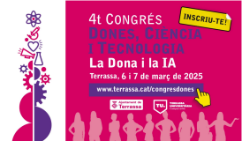

JONATAN ARGIZ VARELA Màster en Formació del Professorat d'Educació Secundària PràcCcum

MEMÒRIA DE PRÀCTIQUES PRACTICUM I i II

AUTOR: JONATAN ARGIZ

INSTITUT: Ins0tut Mar6 Pous

TEC2

1

JONATAN ARGIZ VARELA Màster en Formació del Professorat d'Educació Secundària PràcCcum

ÍNDEX

A. DADES DE L’ESTUDIANT:................................................................................................ 4 1. Resum biogràfic i docència realitzada fins al moment: .............................................. 4 2. Filosofia docent: ....................................................................................................... 4

B. EL CENTRE I LA SEVA ORGANITZACIÓ............................................................................. 6

1. Coneixement i funcionament del centre.................................................................... 6 a) Entorn i infraestructura del centre.............................................................................. 6

b) Oferta forma8va del centre......................................................................................... 6 c) Òrgans de govern, coordinació i avaluació del centre................................................. 7 d) Organització i la ges8ó del centre ............................................................................... 7 e) Projectes transversals de centre.................................................................................. 8

2. Professorat, alumnat, famílies................................................................................. 10 a) Tipologia de l’alumnat............................................................................................... 10

b) Funcions del professorat ........................................................................................... 10 c) Atenció a la diversitat................................................................................................ 10 d) Convivència i clima escolar. Prevenció, ges8ó i resolució de conflictes..................... 11 e) Relació amb les famílies............................................................................................ 11

3. Recursos................................................................................................................. 12 4. Experiències rellevants del centre i experiències que no funcionen......................... 13 5. Connexió entre realitat (PràcLcum) i conLnguts de les assignatures........................ 16

C. DIDÀCTICA ESPECÍFICA I ACTUACIÓ A L’AULA ........................................................... 18

1. L’organització didàcLca del departament ................................................................ 18 a) Funcionament del departament corresponent......................................................... 18

b) Tipologies d’ac8vitats d’ensenyament-aprenentatge i estratègies d’aprenentatge .. 19 c) Innovació educa8va................................................................................................... 19 d) Recursos propis del departament ............................................................................. 19 e) Treball interdepartamental ....................................................................................... 19

2. Els grups classe i el professorat............................................................................... 20

3. Programació (situacions d’aprenentatge) i actuació ................................................ 22 a) Descripció del grup-classe on es desenvolupa la intervenció ................................... 22

b) Situació d’aprenentatge ............................................................................................ 22 c) Components transversals.......................................................................................... 24 d) Ac8vitats i recursos CDD ........................................................................................... 24 e) Metodologies docents............................................................................................... 25 f) Transferència i adaptacions....................................................................................... 25

2

JONATAN ARGIZ VARELA Màster en Formació del Professorat d'Educació Secundària PràcCcum

g) Ac8vitat amb perspec8va de gènere......................................................................... 26 h) Pràc8ca reflexiva (Model ALACT - Mètode R5).......................................................... 27 4. Experiències rellevants, a nivell docent, i experiències que no funcionen................ 29 5. Assistència a 4t Congrés Dones, Ciència i Tecnologia – WSCITECH25 ....................... 31 D. REFLEXIÓ FINAL........................................................................................................... 33

3

JONATAN ARGIZ VARELA Màster en Formació del Professorat d'Educació Secundària PràcCcum

A. DADES DE L’ESTUDIANT:

1. Resum biogràfic i docència realitzada fins al moment:

Soc Enginyer Industrial amb un Grau en Enginyeria en Tecnologies Industrials per l'ETSEIB-UPC i  més de deu anys d'experiència en l'àmbit privat, principalment en el sector del fitness, on he  liderat equips i ges8onat projectes amb una marcada orientació a resultats. Actualment,  exerceixo com a professor d'Electromedicina al Cicle Forma8u de Grau Superior de l'Ins8tut  Indústria Sostenible de Barcelona, on combino el meu coneixement tècnic amb la meva passió  per la docència.

Durant la meva etapa universitària, vaig començar a desenvolupar la meva trajectòria docent  impar8nt classes par8culars de Matemà8ques i Física a alumnes d’ESO i Batxillerat.  Paral·lelament, vaig treballar com a professor d'acadèmia, especialitzat en l’assignatura  d’Equacions Diferencials de segon curs de la carrera d’Enginyeria Industrial, oferint suport  intensiu tant en cursos regulars com en preparació per a exàmens. Aquesta experiència em va  permetre adquirir una sòlida base pedagògica i entendre les necessitats forma8ves dels  estudiants en diferents etapes educa8ves.

En l'àmbit professional, la meva trajectòria destaca per més d’una dècada d’experiència al sector  privat, on vaig ocupar càrrecs de responsabilitat en empreses destacades com Gestora Clubs DIR,  Danone i Deloihe. Com a Sales i Club Manager a Clubs DIR, vaig liderar equips mul8disciplinaris,  ges8onant l’estratègia comercial, la sa8sfacció del client i l’op8mització dels recursos per  aconseguir els objec8us mensuals establerts. Aquesta experiència em va proporcionar una gran  capacitat de lideratge, ges8ó d'equips i resolució de problemes.

L’any 2022 vaig decidir reorientar la meva carrera cap a la docència, retornant als meus orígens  professionals i personals. Actualment, es8c prematriculat al Màster Universitari de Formació del  Professorat amb especialitat en Tecnologia, un pas més en el meu objec8u de consolidar-me com  a educador en l’àmbit tècnic i tecnològic.

La meva trajectòria docent està marcada per la meva voluntat d’apropar els conceptes tècnics i  cienifics a l’alumnat, adaptant els con8nguts a les seves necessitats individuals i fomentant el  pensament crí8c i la resolució de problemes. A més, la meva experiència en el sector empresarial  m’aporta una visió pràc8ca i aplicada que transmeto a les meves classes, buscant que  l’aprenentatge sigui significa8u i connec8 amb el món professional.

En l’àmbit personal, em considero una persona responsable, organitzada i amb dots de lideratge.  Parlo diverses llengües: català (nivell C2), castellà (llengua na8va), anglès (nivell C1) i francès  (nivell intermedi), una habilitat que m’ha permès comunicar-me en diferents entorns i connectar  amb estudiants i professionals de diverses cultures.

2. Filosofia docent:

Com a docent en aquest moment inicial de la meva trajectòria, reflexiono profundament sobre  els valors i els principis que considero essencials per exercir aquesta tasca tan significa8va. La  docència és molt més que transmetre coneixements tècnics; és una oportunitat per inspirar,  guiar i ajudar l’alumnat a desenvolupar-se no només com a professionals, sinó també com a  persones crí8ques i compromeses amb el seu entorn.

4

JONATAN ARGIZ VARELA Màster en Formació del Professorat d'Educació Secundària PràcCcum

Un dels elements més importants en la meva manera d’entendre la docència és el respecte per  la diversitat de l’alumnat. Cada estudiant és únic, amb les seves pròpies fortaleses, dificultats i  formes d’aprendre. La meva funció com a docent és iden8ficar aquestes diferències i crear un  entorn que fomen8 l’aprenentatge per a tothom. Això implica dissenyar metodologies  adapta8ves que atenguin les necessitats individuals, u8litzant eines tant teòriques com  pràc8ques que perme8n a l’alumnat connectar el con8ngut amb situacions reals.

També considero que l’empa8a és un valor fonamental en la docència. Cal entendre que  l’alumnat no és només un receptor de coneixement sinó també un individu amb experiències,  emocions i mo8vacions que poden influir en el seu aprenentatge. Com a docent, vull estar atent  a aquestes necessitats emocionals, oferint suport i orientació en moments de dificultat. Aquesta  atenció no només enforteix la relació amb l’alumnat, sinó que també fomenta un ambient de  respecte i col·laboració a l’aula.

La meva formació en Enginyeria Industrial i l’experiència en el sector privat em donen una  perspec8va única que vull incorporar a la meva pràc8ca docent. He treballat amb equips  mul8disciplinaris, ges8onant projectes complexos i afrontant reptes reals del mercat laboral.  Aquesta experiència m’ha ensenyat que els coneixements tècnics són essencials, però també  que les competències transversals, com el treball en equip, la resolució de problemes i la  comunicació, són igualment crí8ques. A l’aula, vull integrar aquestes lliçons, proporcionant  ac8vitats que desenvolupin no només el coneixement tècnic sinó també les habilitats  interpersonals de l’alumnat.

M’imagino com un docent que guia i acompanya. Vull ser algú que genera curiositat i que mo8va  l’alumnat a explorar més enllà del temari. La meva ambició és fomentar un aprenentatge ac8u,  on els estudiants no es limi8n a escoltar, sinó que par8cipin, experimen8n i prenguin  responsabilitat del seu propi aprenentatge. Crec fermament que aquesta autonomia és clau per  al seu èxit futur, tant en l’àmbit professional com personal.

Un altre aspecte fonamental que vull aportar a la professió docent és la connexió entre l’escola i  el món laboral. Els estudiants han de veure com els coneixements que adquireixen a l’aula tenen  una aplicació pràc8ca en la vida real. Per tant, treballaré per incloure exemples concrets, casos  pràc8cs i col·laboracions amb empreses en els meus plans d’ensenyament. Vull que els  estudiants sur8n de les meves classes preparats per afrontar els reptes reals amb seguretat i  competència.

També és essencial promoure un ambient d’innovació i millora constant en la docència. La  tecnologia és un aliat poderós que pot transformar l’educació, i vull explorar com eines digitals  poden enriquir l’aprenentatge. A més, considero fonamental mantenir-me actualitzat, aprenent  de les noves metodologies pedagògiques i adaptant-les a les necessitats canviants dels  estudiants.

La relació amb l’alumnat també és un aspecte que vull cuidar especialment. La comunicació  oberta i sincera és essencial per construir un ambient de confiança on l’alumnat se sen8 còmode  per expressar els seus dubtes, inquietuds i opinions. Vull ser un docent proper, que escolta i que  està disponible per donar suport. Alhora, 8nc clar que la relació ha de basar-se en el respecte  mutu i en l’exigència equilibrada, fomentant la responsabilitat de l’alumnat en el seu propi  aprenentatge.

5

JONATAN ARGIZ VARELA Màster en Formació del Professorat d'Educació Secundària PràcCcum

Finalment, crec que un bon docent també ha de ser un model de valors. L’educació no és només  transmetre coneixements, sinó també ajudar a formar ciutadans responsables i compromesos  amb el seu entorn. Per això, vull inculcar valors com l’esforç, la constància, la curiositat, el treball  en equip i el respecte. Aquests valors no són només ideals abstractes, sinó principis que intento  prac8car cada dia, tant dins com fora de l’aula.

En resum, veig la docència com una oportunitat per impactar posi8vament en la vida de les  persones, ajudant-les a desenvolupar el seu potencial i a preparar-se per a un futur ple de  possibilitats. Encara que es8c al començament del meu camí com a docent, afronto aquest repte  amb entusiasme, responsabilitat i la ferma convicció que l’educació és una eina poderosa per  transformar vides i construir una societat millor.

B. EL CENTRE I LA SEVA ORGANITZACIÓ

1. Coneixement i funcionament del centre

a) Entorn i infraestructura del centre

L’Ins8tut Mari Pous es troba situat al barri de Sant Andreu, al recinte històric de l’an8ga fàbrica  Fabra i Coats, un espai emblemà8c de Barcelona que ha estat rehabilitat per acollir instal·lacions  educa8ves modernes i funcionalment adaptades. Aquest entorn combina elements industrials  rehabilitats amb zones urbanes i comunitàries, oferint un marc idoni per a la integració d’un  projecte educa8u innovador. Les instal·lacions inclouen aules equipades amb tecnologia  actualitzada, espais per al treball col·labora8u, laboratoris, una biblioteca moderna i zones  comuns que afavoreixen l’aprenentatge interac8u.

A més de l’equipament intern, l’entorn de l’ins8tut facilita la connexió amb el teixit social del  barri, permetent col·laboracions amb en8tats locals i una relació directa amb la comunitat. La  ubicació en un recinte històric també aporta una perspec8va cultural i patrimonial que es  reflecteix en les ac8vitats del centre, promovent un fort vincle entre l’educació i l’entorn  sociocultural.

b) Oferta formaLva del centre.

L’Ins8tut Mari Pous ofereix un i8nerari complet d’educació secundària obligatòria (ESO) i  Batxillerat, amb la previsió de consolidar tres línies d’ESO i dues de Batxillerat. L’oferta forma8va  es caracteritza per la seva metodologia centrada en l’alumnat, que n’és el protagonista ac8u. Es  treballa amb estratègies didàc8ques innovadores com el treball per projectes, la docència  compar8da i el desenvolupament d’habilitats competencials, que inclouen la col·laboració, la  resolució de problemes i el pensament crí8c.

El centre també aposta per una formació personalitzada i inclusiva, tenint en compte les  necessitats i els interessos de cada estudiant. Això inclou programes d’atenció a la diversitat i  plans individuals d’aprenentatge per a l’alumnat amb necessitats educa8ves especials (NESE).  Dins del marc forma8u, es promou l’educació plurilingüe, incloent-hi projectes AICLE  (Aprenentatge Integrat de Con8nguts i Llengües Estrangeres), que potencien l’ús de llengües  estrangeres en assignatures no lingüís8ques.

6

JONATAN ARGIZ VARELA Màster en Formació del Professorat d'Educació Secundària PràcCcum

c) Òrgans de govern, coordinació i avaluació del centre

Òrgans de govern

L’organització del centre es basa en una estructura clara d’òrgans de govern, que inclou:

• Direcció: Responsable de liderar el projecte educa8u i representar el centre davant  l’Administració i la comunitat educa8va.

• Cap d’estudis: Coordina l’organització acadèmica i pedagògica, garan8nt el  funcionament diari de l’ins8tut.

• Secretaria: Ges8ona les tasques administra8ves i econòmiques del centre. Òrgans col·legiats

• Claustre de professorat: Espai de debat i presa de decisions pedagògiques.

• Consell Escolar: Composat per representants de les famílies, alumnat, professorat i  personal d’administració, aquest òrgan garanteix la par8cipació democrà8ca en la ges8ó  del centre.

• Comissions específiques: Grups de treball dedicats a temes concrets com la convivència,  la inclusió i la transformació digital.

Avaluació

Els processos d’avaluació del centre se centren en el seguiment del PEC i la revisió de la  Programació General Anual (PGA). S’u8litzen indicadors per mesurar l’impacte de les accions  educa8ves, incloent-hi l'increment de la par8cipació de les famílies, la millora del clima de  convivència, el grau d’inclusió de l’alumnat amb necessitats específiques, la implicació en  projectes comunitaris i internacionals, així com el desenvolupament de competències personals,  emocionals i socials de l’alumnat. Aquests indicadors permeten valorar de manera qualita8va i  quan8ta8va la cohesió social dins del centre, i això juntament amb la millora del rendiment  acadèmic permet veure l’eficàcia de les accions pedagògiques implementades.

d) Organització i la gesLó del centre

Normes d’Organització i Funcionament de Centre (NOFC)

Després d’haver conegut de prop el funcionament de l’Ins8tut Mari Pous, considero que les  Normes d’Organització i Funcionament del Centre (NOFC) no són només un document  norma8u, sinó una eina viva que reflecteix el tarannà col·labora8u i inclusiu del centre. El que  m’ha cridat més l’atenció és com aquestes normes no es limiten a regular, sinó que proposen  una manera concreta de conviure, de comunicar-nos i de treballar junts dins la comunitat  educa8va.

És especialment rellevant com es dona veu a tots els col·lecLus, i això es percep en l’èmfasi que  es posa en la par8cipació ac8va: consells, comissions, reunions... tot pensat perquè ningú quedi  al marge. M’ha semblat molt potent la incorporació de metodologies restauraLves per resoldre  conflictes, deixant enrere enfocaments més sancionadors i apostant per una resolució educaLva  i transformadora. Aquesta visió, en el context actual, em sembla molt coherent amb els valors  que volem transmetre com a docents.

7

JONATAN ARGIZ VARELA Màster en Formació del Professorat d'Educació Secundària PràcCcum

També valoro com es posa en pràc8ca la coresponsabilitat, tant entre el professorat com amb  les famílies i l’alumnat. S’estableixen normes clares sobre la convivència, però també s’ofereixen  canals de comunicació per escoltar i actuar amb empa8a. Com a docent en formació, aquesta  estructura m’ha ajudat a entendre que les NOFC no són només burocràcia: són el marc que  permet construir confiança, ordre i respecte, i que, ben aplicades, poden ser un gran motor per  al benestar i l’èxit educa8u.

Projecte EducaLu de Centre (PEC)

El Projecte EducaLu de Centre (PEC) de l’Ins8tut Mari Pous no és només un conjunt de línies  marcades sobre paper; és una expressió del seu compromís amb una educació transformadora  i humana. El que més m’ha impactat en conèixer-lo és com tot el que s’hi proposa s’encarna  realment en el dia a dia del centre: no queda en una declaració d’intencions, sinó que es fa  tangible en els passadissos, a les aules, en les relacions entre alumnes i professors.

Des de la meva mirada com a docent en formació, valoro especialment com el PEC situa  l’alumnat al centre de tot el procés educa8u. Es nota que darrere hi ha una voluntat clara de  personalitzar l’aprenentatge, d’arribar a tothom, amb independència del seu origen o  necessitats. No és una educació que busca que tothom s’adap8 a una sola forma de fer, sinó una  escola que s’adapta als camins de cadascú.

També m’ha semblat molt inspirador veure com el PEC aposta de manera decidida per la  coeducació, la inclusió i el benestar emocional. Aquest no és un centre que es limi8 a transmetre  coneixements, sinó que treballa per formar persones crí8ques, empà8ques i socialment  compromeses. En aquest sen8t, la connexió amb el barri i amb projectes com Stolpersteine,  Escoles Verdes o Erasmus+ dona encara més sen8t al que s’aprèn dins les aules.

El que destacaria, sobretot, és la seva vocació de canvi i millora constant: és un projecte que es  revisa, que evoluciona i que escolta. Per a mi, el PEC del Mari Pous és un exemple viu de com  una comunitat educa8va pot construir, de manera col·lec8va, una escola que pensa en el futur  però actua amb compromís des del present.

Documents destacats

• PGA: Recull les actuacions planificades per al curs, alineades amb els objec8us del PEC. • Memòria anual: Avalua l’execució dels objec8us marcats.

• Acords de corresponsabilitat: Promouen el compromís compar8t entre famílies,  alumnat i professorat, fomentant la col·laboració per a la millora de la qualitat educa8va.

e) Projectes transversals de centre

L’Ins8tut Mari Pous lidera diversos projectes transversals que reforcen la seva iden8tat com a  centre innovador:

Projectes europeus i d’innovació

• Erasmus+: Facilita la mobilitat i intercanvi d’alumnes i professorat. Aquest programa no  només permet conèixer altres sistemes educa8us sinó que també fomenta valors com la  diversitat cultural i la cooperació internacional.

8

JONATAN ARGIZ VARELA Màster en Formació del Professorat d'Educació Secundària PràcCcum

• Programes d’autonomia de centre: Potencien l’adaptació de l’ensenyament a les  necessitats locals, donant llibertat al centre per desenvolupar projectes personalitzats  segons les caracterís8ques del seu alumnat i entorn.

Educació inclusiva i convivència

El centre ha implementat inicia8ves per fomentar la convivència, com ara:

• Mediació entre iguals: Els estudiants reben formació específica per actuar com a  mediadors en situacions de conflicte, promovent un ambient de respecte i resolució  pacífica.

• Programes contra l’assetjament escolar: Es treballa amb protocols clars per prevenir i  intervenir en casos d’assetjament, assegurant el benestar emocional de l’alumnat.

• Mesures restauraLves: Aquests mètodes permeten que les parts implicades en un  conflicte par8cipin ac8vament en la resolució, reforçant valors com la responsabilitat i  l’empa8a.

Transformació digital

S’ha desenvolupat una estratègia digital que inclou:

• Formació del professorat en tecnologies educaLves: Es realitzen tallers i formacions per  assegurar que el professorat domina les eines digitals més actualitzades.

• Millora de les infraestructures digitals: S’han renovat equips informà8cs i s’ha garan8t  l’accés a internet a totes les aules.

• Promoció de competències digitals en l’alumnat: A través d’assignatures específiques i  ac8vitats transversals, els estudiants adquireixen habilitats digitals essencials per al  futur.

Programes lingüísLcs

L’educació plurilingüe és una prioritat. Es promou l’ús de llengües estrangeres en diversos  contextos acadèmics, integrant-les en assignatures com ciències o matemà8ques. També es  realitzen ac8vitats culturals i intercanvis lingüís8cs per reforçar l’aprenentatge de llengües.

Projectes de sostenibilitat i salut

• Escoles verdes: El centre par8cipa en inicia8ves per promoure la sostenibilitat  ambiental, com ara la reducció de residus i la conscienciació sobre el canvi climà8c.

• Programa Salut i Escola: Aquesta inicia8va treballa per millorar la salut rsica i emocional  dels estudiants a través de tallers, xerrades i campanyes de sensibilització.

Col·laboració amb la comunitat

El centre manté una relació estreta amb en8tats del barri, par8cipant en ac8vitats culturals i  socials que reforcen el vincle entre l’ins8tut i la comunitat. Aquesta col·laboració també inclou  projectes d’aprenentatge-servei, en els quals l’alumnat aplica els seus coneixements a situacions  reals amb impacte posi8u en l’entorn.

Aquests projectes reflecteixen el compromís de l’Ins8tut Mari Pous amb una educació de  qualitat, inclusiva i connectada amb els desafiaments del segle XXI.

9

JONATAN ARGIZ VARELA Màster en Formació del Professorat d'Educació Secundària PràcCcum

2. Professorat, alumnat, famílies

a) Tipologia de l’alumnat

L’alumnat de l’Ins8tut Mari Pous prové principalment del barri de Sant Andreu i de zones  properes, amb una diversitat notable en termes socioeconòmics i culturals. La majoria dels  estudiants són de classe mitjana, però també hi ha un percentatge significa8u d’alumnat  procedent de contextos amb més vulnerabilitat social. Aquesta realitat reflecteix la riquesa i  heterogeneïtat del teixit social del barri. Això permet al centre desenvolupar estratègies  educa8ves que promoguin la integració i la igualtat d’oportunitats.

El centre també acull estudiants amb necessitats educa8ves especials (NESE) i d’altres perfils  diversos, incloent-hi alumnat amb necessitats derivades de la inclusió social, cultural o  lingüís8ca. Per atendre’ls, l’ins8tut ofereix un ampli ventall de recursos com plans individuals  d’aprenentatge, suport psicològic i aules d’acollida per a nouvinguts, que faciliten l’aprenentatge  de la llengua i la seva integració cultural. Aquest enfocament assegura que cada estudiant pugui  desenvolupar plenament el seu potencial acadèmic i personal, independentment de les seves  circumstàncies.

b) Funcions del professorat

A més de les funcions docents, el professorat de l’Ins8tut Mari Pous assumeix diverses  responsabilitats complementàries que contribueixen al bon funcionament del centre. Entre  aquestes es troben:

• Coordinacions pedagògiques: Figures com la coordinació d’àmbit, nivell o coeducació  treballen per garan8r la coherència metodològica i pedagògica. Aquestes coordinacions  lideren reunions periòdiques per revisar les estratègies educa8ves i promoure una  millora constant del projecte educa8u.

• Tutories: Els tutors realitzen un seguiment personalitzat de l’alumnat, promovent-ne el  benestar acadèmic i emocional. També són l’enllaç directe amb les famílies, mantenint  una comunicació fluida que permet abordar qualsevol necessitat o conflicte.

• ParLcipació en projectes: El professorat lidera inicia8ves d’innovació educa8va,  projectes europeus i programes d’inclusió que enriqueixen l’oferta forma8va. Aquesta  implicació permet introduir metodologies noves i enfor8r la dimensió internacional del  centre.

• Mediació i convivència: Alguns docents par8cipen en la ges8ó de conflictes i en la  implementació de mesures restaura8ves per millorar el clima escolar. Aquest rol implica  formació específica i una gran dedicació per garan8r que la convivència sigui un element  fonamental del dia a dia del centre.

c) Atenció a la diversitat

L’atenció a la diversitat és un dels pilars fonamentals del projecte educa8u del centre. Això es  tradueix en:

• Plans Individualitzats (PI): Dissenyats per adaptar l’ensenyament a les necessitats  específiques de l’alumnat, aquests plans inclouen estratègies pedagògiques  personalitzades, adaptacions curriculars i recursos addicionals.

10

JONATAN ARGIZ VARELA Màster en Formació del Professorat d'Educació Secundària PràcCcum

• Aula d’acollida: Adreçada a estudiants nouvinguts, facilita l’aprenentatge del català i la  integració cultural. Aquest espai no només proporciona suport lingüís8c, sinó que també  ajuda els alumnes a adaptar-se a la nova comunitat educa8va i social.

• Programes de diversificació curricular: Pensats per aquells estudiants que necessiten un  enfocament més personalitzat en els seus aprenentatges, aquests programes tenen com  a objec8u evitar l’abandonament escolar i promoure la seva par8cipació ac8va.

• Estratègies d’inclusió: S’incorporen metodologies par8cipa8ves com el treball  coopera8u i per projectes per afavorir la inclusió i l’aprenentatge compar8t. Aquesta  perspec8va inclusiva també es veu reforçada per la col·laboració amb famílies i serveis  externs especialitzats

d) Convivència i clima escolar. Prevenció, gesLó i resolució de conflictes

El clima escolar és una prioritat per a l’Ins8tut Mari Pous, que aposta per una convivència  posi8va basada en el respecte i la mediació. Per aconseguir-ho:

• Programes prevenLus: Inicia8ves com cercles de diàleg i tutories entre iguals ajuden a  an8cipar conflictes i millorar les relacions interpersonals. Aquestes ac8vitats fomenten  un ambient de respecte i diàleg obert entre tots els membres de la comunitat educa8va.

• Mediació escolar: Es fomenta la resolució pacífica de conflictes a través de la mediació  entre iguals i mesures restaura8ves. Aquesta estratègia implica la par8cipació ac8va de  l’alumnat en la ges8ó de problemes, desenvolupant habilitats com l’empa8a i la  responsabilitat.

• Protocols clars de gesLó de conflictes: Inclouen actuacions específiques en casos  d’assetjament escolar o altres incidents greus, assegurant una resposta ràpida i eficaç.  Aquests protocols s’actualitzen regularment per adaptar-se a les necessitats canviants  del centre.

• Promoció del benestar emocional: S’organitzen ac8vitats per reforçar la cohesió de grup  i el suport emocional, implicant tant l’alumnat com el professorat. Tallers sobre ges8ó  de l’estrès, mindfulness i educació emocional són exemples d’aquest enfocament  integral.

e) Relació amb les famílies

L’Ins8tut Mari Pous manté una relació estreta amb les famílies, considerant-les un actor clau en  el procés educa8u. Les principals accions inclouen:

• Canals de comunicació acLus: L’ús de plataformes digitals i trobades periòdiques  garanteixen una comunicació fluida. Això inclou aplicacions que permeten un seguiment  detallat del progrés acadèmic i la comunicació directa amb el professorat.

• Entrevistes personalitzades: Tutors i famílies es reuneixen regularment per fer  seguiment del progrés de l’alumnat, iden8ficant fortaleses i aspectes a millorar.

• Implicació en la vida del centre: Les famílies par8cipen en ac8vitats culturals i  educa8ves, així com en el Consell Escolar i altres òrgans de decisió. Aquesta implicació  reforça el sen8ment de comunitat i corresponsabilitat.

11

JONATAN ARGIZ VARELA Màster en Formació del Professorat d'Educació Secundària PràcCcum

• Tallers i formacions: S’ofereixen ac8vitats per ajudar les famílies a acompanyar l’alumnat  en el seu procés educa8u i emocional. Aquestes sessions aborden temes com la ges8ó  del temps d’estudi, l’educació emocional i la prevenció de l’assetjament escolar.

En conjunt, aquesta relació fomenta un ambient de col·laboració i corresponsabilitat que  contribueix a l'èxit educa8u i personal de l’alumnat. Les famílies s’han conver8t en una part  integral de la comunitat educa8va, treballant conjuntament amb el professorat i l’equip direc8u  per assolir els objec8us comuns.

3. Recursos

L’Ins8tut Mari Pous es dis8ngeix per la seva col·laboració ac8va amb en8tats i ins8tucions que  reforcen la qualitat i diversitat del seu projecte educa8u. El centre manté una estreta relació amb  l’ajuntament de Barcelona, par8cipant en inicia8ves com el programa “Com funciona  Barcelona?”, que introdueix l’alumnat en la ges8ó de serveis essencials com l’aigua, la neteja i  altres recursos urbans. Aquest programa permet als estudiants entendre el funcionament dels  serveis municipals i desenvolupar un sen8t de responsabilitat cívica. A més, l’ajuntament  col·labora amb el centre en projectes de sostenibilitat i ac8vitats culturals que integren l’alumnat  amb la comunitat local.

Les universitats són socis clau per a l’ins8tut. Amb la Universitat Autònoma de Barcelona (UAB),  la Universitat de Barcelona (UB) i la Universitat Politècnica de Catalunya (UPC), el centre  col·labora en programes de recerca, seminaris educa8us i la par8cipació d’alumnat universitari  en pràc8ques al centre. Aquesta col·laboració enforteix la connexió entre la formació secundària  i els estudis superiors, oferint orientació acadèmica als estudiants i fomentant la seva transició  educa8va.

Pel que fa a les empreses, l’ins8tut manté acords amb empreses tecnològiques i industrials per  garan8r una formació pràc8ca i adaptada al mercat laboral. Aquestes col·laboracions inclouen  estades forma8ves i projectes de col·laboració en els quals l’alumnat aplica els seus  coneixements en situacions reals, especialment en l’àmbit de la tecnologia i les ciències  aplicades.

Dins dels recursos organitza8us i metodològics, el centre aposta per agrupaments flexibles que  responen a les necessitats individuals de l’alumnat. Els tallers pràc8cs en ciències, tecnologia,  expressió i humanitats, juntament amb espais equipats per al treball per projectes, promouen  l’aprenentatge transversal. Per exemple, el projecte “Stolpersteine” connecta l’alumnat amb la  memòria històrica a través de la recerca i la creació d’expressions aris8ques, generant  consciència social i implicació amb el patrimoni cultural.

Pel que fa a la digitalització, l’Ins8tut Mari Pous compta amb una Estratègia Digital de Centre  (EDC) consolidada, que guia la integració de tecnologies en l’ensenyament. La plataforma virtual  u8litzada permet una comunicació fluida entre el professorat, l’alumnat i les famílies, facilitant  el seguiment acadèmic i l’accés a recursos pedagògics. Aquesta eina ha esdevingut fonamental  en la ges8ó diària del centre i en el desenvolupament de competències digitals. Això es  complementa amb l’assessorament d’un mentor digital, que proporciona suport con8nu per a la  formació del professorat i l’op8mització de les eines digitals. A més, el programa AVANCEM  ofereix formacions con8nuades al professorat per millorar les pràc8ques educa8ves i integrar  noves metodologies basades en l’ús de tecnologies innovadores.

12

JONATAN ARGIZ VARELA Màster en Formació del Professorat d'Educació Secundària PràcCcum

El programa Erasmus+ és un altre punt fort del centre, fomentant la mobilitat d’alumnat i  professorat a diversos països d’Europa. Aquest programa ofereix l’oportunitat de compar8r  bones pràc8ques, desenvolupar competències interculturals i millorar les habilitats lingüís8ques.  La par8cipació en Erasmus+ enriqueix l’experiència educa8va i connecta el centre amb una xarxa  global d’educadors i estudiants.

El Programa SENSEI és una experiència de formació en residència adreçada principalment a  docents novells de primer any, amb l’objec8u d’enfor8r les seves competències professionals des  del primer moment de la seva carrera. Es desenvolupa dins d’un centre educa8u, on el docent  en formació és acompanyat per un mentor que vetlla per la seva inserció i creixement.

En relació amb els disposi8us mòbils, el centre en regula l’ús per garan8r que s’u8litzin de  manera responsable i pedagògica. Aquesta regulació es combina amb projectes com el programa  “Com funciona Barcelona?” i altres ac8vitats que promouen la interacció entre tecnologia i  con8nguts curriculars, assegurant un ús significa8u de les eines digitals.

El compromís amb la innovació es reflecteix en la implementació d’aquests programes i  projectes, assegurant que l’Ins8tut Mari Pous es man8ngui com un referent en educació de  qualitat i en la preparació de l’alumnat per als desafiaments del futur.

4. Experiències rellevants del centre i experiències que no funcionen

L’Ins8tut Mari Pous és un centre educa8u reconegut per la seva aposta per la innovació  pedagògica i la inclusió, destacant en diversos àmbits. Tot i els èxits aconseguits, encara enfronta  reptes que requereixen atenció. A con8nuació, s’amplien les experiències posi8ves i els  desafiaments iden8ficats, destacant les seves fortaleses i les àrees de millora.

Experiències rellevants

1. Erasmus+ i la dimensió internacional

El programa Erasmus+ és un dels pilars més destacats del centre. Permet que l’alumnat par8cipi  en programes de mobilitat a altres països europeus, ampliant les seves competències  lingüís8ques, interculturals i socials. Aquesta experiència també ajuda a enfor8r l’autonomia i la  confiança de l’alumnat, mentre fomenta la col·laboració entre docents d’arreu d’Europa, que  comparteixen bones pràc8ques i enfocaments pedagògics innovadors. El suport logís8c i  econòmic que ofereix el programa garanteix que molts estudiants 8nguin accés a aquestes  oportunitats sense barreres significa8ves.

2. Projecte Stolpersteie

El projecte Stolpersteine, centrat en la recuperació de la memòria històrica, és una inicia8va  interdisciplinària que integra recerca, art i compromís social. L’alumnat par8cipa ac8vament en  la inves8gació de la història local, especialment en relació amb les víc8mes del nazisme. Aquest  projecte no només potencia competències acadèmiques com la inves8gació i la crea8vitat, sinó  que també fomenta valors com l’empa8a, la reflexió crí8ca i la responsabilitat ciutadana. Les  ac8vitats realitzades tenen un gran impacte comunitari, connectant l’educació amb l’entorn local  i cultural.

13

JONATAN ARGIZ VARELA Màster en Formació del Professorat d'Educació Secundària PràcCcum

3. Estratègia Digital de Centre (EDC)

L’Ins8tut compta amb una Estratègia Digital de Centre (EDC) que guia la integració de tecnologies  en tots els nivells educa8us. Aquesta estratègia assegura que tant l’alumnat com el professorat  disposin d’eines modernes per potenciar l’aprenentatge. La plataforma virtual del centre facilita  la comunicació i el seguiment acadèmic, millorant l’accessibilitat als recursos educa8us. A més,  el suport constant del mentor digital ajuda a capacitar el professorat en l’ús d’eines innovadores,  promovent un aprenentatge adapta8u i personalitzat.

4. Com funciona Barcelona?

Aquest programa connecta l’educació amb l’entorn urbà i els serveis públics. Mitjançant  ac8vitats pràc8ques i visites guiades, l’alumnat coneix com funcionen els serveis essencials de la  ciutat, com la ges8ó de l’aigua, la neteja i el transport. Aquest projecte enforteix la consciència  ciutadana i fomenta la responsabilitat social, connectant l’aprenentatge amb les necessitats reals  de la societat. Els estudiants valoren molt posi8vament aquest programa pel seu caràcter  pragmà8c i aplicat.

5. Programes inclusius com SENSEI i AVANCEM

Els programes SENSEI i AVANCEM són dues inicia8ves del Departament d’Educació que tenen  com a finalitat millorar la qualitat educa8va des de dues perspec8ves complementàries. El  programa SENSEI se centra en l’acompanyament i formació dels docents novells, mitjançant una  experiència de residència en centres educa8us on reben mentoria, formació pràc8ca i suport per  desenvolupar una tasca docent autònoma, reflexiva i transformadora. Aquesta experiència  incideix directament en la professionalització docent i en la millora dels resultats educa8us, ja  que es basa en evidències que demostren l’impacte posi8u de les inicia8ves d’inducció. Per la  seva banda, el programa AVANCEM promou un enfocament integrat i competencial de  l’ensenyament de les llengües, fomentant el treball conjunt del professorat de català, castellà i  llengües estrangeres a través de projectes interdisciplinaris i formació en Tractament Integrat de  Llengües (TIL). Aquest programa reforça la competència plurilingüe de l’alumnat i afavoreix una  educació inclusiva i adaptada a contextos diversos. Tots dos programes contribueixen a  consolidar una escola més inclusiva, col·labora8va i orientada a l’èxit de tot l’alumnat, com en el  cas de l’Ins8tut Mari Pous.

Experiències que presenten dificultats

o Implementació desigual de la tecnologia

Tot i l’impacte posi8u de l’EDC, la seva aplicació no és uniforme a totes les assignatures i nivells.  Algunes matèries no aprofiten plenament les eines digitals disponibles, sovint per manca de  formació o recursos. Aquesta desigualtat crea diferències significa8ves en l’experiència educa8va  de l’alumnat i limita l’eficàcia global de l’estratègia. Per exemple, en algunes assignatures com  educació rsica o aris8ca, les tecnologies es perceben menys aplicables, tot i el seu potencial en  l’anàlisi de dades espor8ves o en el disseny digital. La manca d’una formació homogènia per al  professorat també dificulta l’adopció efec8va de les eines digitals, fet que repercuteix en la  qualitat de l’ensenyament.

14

JONATAN ARGIZ VARELA Màster en Formació del Professorat d'Educació Secundària PràcCcum

o ParLcipació familiar limitada

Malgrat els esforços per involucrar les famílies, la seva par8cipació en ac8vitats escolars segueix  sent limitada en alguns casos. Això pot deure’s a factors com la manca de temps, desconeixement  de les inicia8ves o dificultats per percebre el valor de la seva implicació. Aquesta situació dificulta  la construcció d’una col·laboració plena entre l’escola i les famílies. A més, hi ha una necessitat  de diversificar els canals de comunicació amb les famílies per adaptar-se a les seves realitats,  com ara mitjançant trobades virtuals o comunicacions en diversos idiomes. Els programes que  fomenten la par8cipació de les famílies en ac8vitats del centre han demostrat tenir èxit, però cal  una difusió més efec8va. Malgrat els esforços per involucrar les famílies, la seva par8cipació en  ac8vitats escolars segueix sent limitada. Això pot deure’s a factors com la manca de temps,  desconeixement de les inicia8ves o dificultats per percebre el valor de la seva implicació. Aquesta  situació dificulta la construcció d’una col·laboració plena entre l’escola i les famílies.

o Sobrecàrrega de projectes i professorat

La par8cipació en nombrosos programes i projectes, tot i enriquidora, genera una sobrecàrrega  per al professorat. Aquesta situació afecta a la qualitat de l’ensenyament i la mo8vació del  personal docent. Molts professors se senten pressionats per complir amb els terminis i les  expecta8ves d’aquests projectes, fet que pot provocar estrès i esgotament. A més, l’elevada  demanda d’innovació i desenvolupament pedagògic redueix el temps disponible per a tasques  essencials com la preparació de classes i l’atenció individualitzada a l’alumnat. Per abordar  aquest repte, seria beneficiós establir prioritats clares i reduir el nombre de projectes simultanis.

o Integració de nouvinguts

Tot i els èxits de l’aula d’acollida, la integració plena d’alumnat nouvingut con8nua sent un repte.  Les barreres lingüís8ques i culturals dificulten la seva adaptació i par8cipació ac8va en totes les  assignatures. A més, la manca de recursos humans i materials dedicats a aquesta integració  limita les possibilitats d’atendre les necessitats específiques d’aquests estudiants. Cal reforçar els  programes d’immersió lingüís8ca i cultural, així com fomentar la par8cipació de les famílies  d’alumnat nouvingut en ac8vitats escolars, per garan8r una integració completa i equita8va. És  fonamental reforçar els recursos d’acollida i assegurar un suport constant a aquest col·lec8u.

o GesLó de conflictes complexa

Encara que el centre aplica metodologies restaura8ves i programes de mediació, la ges8ó de  conflictes, especialment en casos d’assetjament escolar, segueix sent un desafiament. Els casos  més greus requereixen un abordatge integral que impliqui no només el professorat, sinó també  les famílies i, en alguns casos, professionals externs. Tot i que els protocols actuals són efec8us  en la majoria de situacions, hi ha marge per intensificar la formació del professorat i incorporar  noves eines per prevenir i ges8onar conflictes. Programes addicionals d’educació emocional  podrien ajudar a reduir la incidència de conflictes i millorar la convivència escolar.

15

JONATAN ARGIZ VARELA Màster en Formació del Professorat d'Educació Secundària PràcCcum

5. Connexió entre realitat (PràcLcum) i conLnguts de les assignatures

16

JONATAN ARGIZ VARELA Màster en Formació del Professorat d'Educació Secundària PràcCcum

17

JONATAN ARGIZ VARELA Màster en Formació del Professorat d'Educació Secundària PràcCcum

C. DIDÀCTICA ESPECÍFICA I ACTUACIÓ A L’AULA

1. L’organització didàcLca del departament

a) Funcionament del departament corresponent

El departament de l’àrea STEM de l’Ins8tut Mari Pous presenta una organització par8cular  respecte a altres centres, ja que no es treballa l’assignatura de Tecnologia (ni tampoc Medi) com  a matèries separades de 1r a 3r d’ESO. En el seu lloc, l’alumnat rep sis hores setmanals de STEM (2 hores seguides 3 dies a la setmana), un espai on es combinen con8nguts de ciències naturals,  rsica, química i tecnologia. Aquest enfocament es basa en propostes interdisciplinàries de  situacions d’aprenentatge, elaborades per equips docents mul8disciplinaris. Això implica que  els mateixos professors poden abordar àmbits diferents dins d’una mateixa seqüència didàc8ca,  i es pretén fomentar una visió integrada de les ciències i la tecnologia.

18

JONATAN ARGIZ VARELA Màster en Formació del Professorat d'Educació Secundària PràcCcum

Tot i que puc reconèixer l’ambició i el potencial d’aquesta organització, a nivell personal em  genera certs dubtes. Des de la meva perspec8va, el fet de no tenir Tecnologia com a assignatura  diferenciada pot provocar que certs conLnguts específics es difuminin o directament quedin  fora. A més, he percebut que les situacions d’aprenentatge no sempre tenen una formulació  clara en clau de repte ni resulten especialment mo8vadores per a l’alumnat. Aquesta absència  de narra8va o context que connec8 amb els seus interessos fa que, en alguns casos, les propostes  perdin força o sen8t.

b) Tipologies d’acLvitats d’ensenyament i estratègies d’aprenentatge

Malgrat les meves reserves amb la formulació de les situacions d’aprenentatge, he de reconèixer  que les acLvitats que s’hi despleguen són diverses i ben orientades metodològicament. He  pogut observar com l’alumnat realitza debats, podcasts, presentacions orals, gravació de vídeos  explica8us i pe8tes inves8gacions. Aquest ventall metodològic, molt vinculat al treball  competencial, permet desenvolupar múl8ples habilitats i connecta amb els enfocaments del  currículum per competències. Són propostes que fomenten l’expressió oral, la capacitat  d’argumentació, la crea8vitat i la cooperació. Ara bé, crec que caldria enllaçar millor aquestes  acLvitats amb reptes més engrescadors i amb contextos propers, de manera que es potenciï  també la mo8vació intrínseca de l’alumnat.

c) Innovació educaLva

Pel que fa a la innovació educa8va, el centre aposta clarament per propostes interdisciplinàries i metodologies ac8ves. S’implementen situacions d’aprenentatge pròpies, elaborades dins del  claustre o en pe8ts equips docents, i hi ha una clara voluntat de produir materials propis. A més,  la par8cipació en projectes com Erasmus+, Stolpersteine o Escoles Verdes ofereix un entorn ric  per a la innovació. En el cas concret de l’àrea STEM, sí que he trobat a faltar una aposta més  decidida per projectes tecnològics potents a l’ESO, especialment en els primers cursos. En canvi,  a 4t d’ESO, on sí s’imparteix una assignatura pròpiament dita (anomenada “Construcció”), la  dinàmica canvia radicalment. Aquí sí que he pogut veure veritables situacions de repte, treball  per projectes i una relació significa8va entre teoria i pràc8ca. Aquest docent —malgrat el nom  an8c de l’assignatura— planteja ac8vitats molt connectades amb el currículum de tecnologia i  amb un enfocament molt vivencial i aplicat. Per mi ha estat un dels referents més inspiradors  dins del departament.

d) Recursos propis del departament

Pel que fa als recursos, el centre disposa d’espais específics com tallers i aules amb equipament  tecnològic, així com disposiLus digitals que faciliten el treball amb eines mul8mèdia. He vist que  s’u8litza programari per editar àudio i vídeo, recursos per treballar amb Arduino i impressores  3D, tot i que en cursos inferiors no sempre s’arriben a u8litzar amb con8nuïtat. També disposen  d’espais flexibles i amb mobiliari mòbil, que afavoreix el treball coopera8u. A banda del material,  cal destacar l’enfocament col·labora8u del professorat a l’hora de comparLr recursos i construir  situacions d’aprenentatge de manera conjunta, encara que amb una certa variabilitat segons  els equips.

e) Treball interdepartamental

En aquest sen8t, el model STEM que implementa el centre requereix i afavoreix la interacció  entre departaments. Per exemple, he pogut veure com professorat amb formació en ciències i

19

JONATAN ARGIZ VARELA Màster en Formació del Professorat d'Educació Secundària PràcCcum

tecnologia co-creen ac8vitats conjuntament, plantejant situacions que integren con8nguts de  biologia, rsica, química i tecnologia. Aquest treball interdepartamental es materialitza  especialment en la creació de situacions d’aprenentatge transversals i en les estratègies  d’avaluació comparLdes. Ara bé, aquesta interdisciplinarietat no sempre és fàcil d’equilibrar: en  alguns casos, pot derivar en una pèrdua de profunditat o especificitat dels con8nguts  tecnològics.

En conclusió, tot i que el funcionament del departament d’STEM del Mari Pous mostra elements  posi8us —com la varietat metodològica, la cultura col·labora8va i la presència d’experiències  d’èxit com les de 4t d’ESO—, també hi ha espai per repensar com reforçar el pes i la idenLtat de  la tecnologia com a disciplina. Per això, quan vaig tenir l’oportunitat de fer la meva situació  d’aprenentatge a 2n de batxillerat, vaig optar per preparar i impar8r el tema de corrent altern,  que s’introduïa per primera vegada a aquest nivell. Va ser una experiència intensa, però  gra8ficant: vaig poder aportar coneixement, ajudar l’equip docent i, sobretot, posar en pràcLca  una metodologia rigorosa però propera, que preparés l’alumnat per la selecLvitat i per  entendre l’electricitat amb senLt. Aquesta experiència em va reafirmar en la importància de  tenir espais per aprofundir en la tecnologia, i no només integrar-la superficialment.

2. Els grups classe i el professorat

a) L’alumnat

Durant les meves estades d’observació i pràc8ques a l’Ins8tut Mari Pous, he 8ngut l’oportunitat  d’observar diversos grups classe, especialment a 2n de batxillerat, 4t d’ESO i també cursos de 1r  i 2n d’ESO dins l’àrea STEM. L’alumnat es caracteritza per una gran diversitat de perfils: tant en  termes culturals com d’es8ls d’aprenentatge i mo8vació. Aquesta heterogeneïtat obliga el  professorat a adaptar-se constantment, i es fa evident la necessitat d’una educació flexible i  inclusiva.

Pel que fa a la dinàmica de grup, en general he trobat grups amb una ac8tud bastant posi8va  cap a l’aprenentatge, especialment a batxillerat i 4t d’ESO, on el grau d’implicació és més alt. A  1r i 2n d’ESO, però, he observat que el grau de dispersió i la manca de vinculació amb els  con8nguts STEM és més acusada, probablement per la manca d’un enfocament clarament  mo8vador i contextualitzat. A més, he detectat una presència molt significa8va d’alumnes amb  perfils de TDAH, que es distreuen coninuament i que, en alguns casos, arriben a boicotejar les  classes, afectant el ritme general. Aquesta situació dificulta no només el desenvolupament de  les sessions, sinó també la implementació real d’un DUA (Disseny Universal per a l’Aprenentatge)  que pugui atendre la diversitat.

També considero que el nivell STEM en els cursos inferiors és bastant baix, possiblement a causa  de les dificultats de ges8ó de grup i la manca de con8nuïtat i profunditat en els con8nguts. Cal  afegir que les sessions d’STEM tenen una durada de dues hores seguides, fet que, en el cas de  l’alumnat més jove, es fa especialment feixuc. Aquest factor pot contribuir al desinterès i a la  dificultat per mantenir l’atenció durant tot el temps lec8u.

Pel que fa a la coeducació, sí que he detectat certes diferències en la par8cipació. Per exemple,  en ac8vitats relacionades amb la programació o el muntatge de circuits, els nois tendeixen a  ocupar més espai i assumir rols més ac8us, mentre que les noies sovint prenen un paper més  organitzador o d’observació. Tot i que no es tracta de patrons absoluts, és important estar alerta

20

JONATAN ARGIZ VARELA Màster en Formació del Professorat d'Educació Secundària PràcCcum

perquè aquestes dinàmiques no es reprodueixin de manera sistemà8ca. He pogut veure com, en  grups amb una atenció explícita a la distribució de rols, les noies par8cipen amb més seguretat,  i això confirma la importància de ges8onar conscientment la coeducació dins les ac8vitats  tecnològiques.

b) El professorat

Durant l’estada, he 8ngut l’oportunitat d’observar diversos professors i professores de l’àmbit  STEM, tant en contextos de l’ESO com de batxillerat. Els es8ls docents són molt variats, i això és  una riquesa, però també suposa reptes de cohesió metodològica. Per exemple, al cicle inicial de  l’ESO he vist professors amb una orientació molt enfocada al treball coopera8u i l’expressió oral,  u8litzant metodologies com el debat, el podcast o les presentacions orals. En canvi, en altres  casos, he observat docents amb un es8l més direc8u i transmissiu, especialment en àrees on el  domini del con8ngut és alt però la pedagogia més tradicional.

Un aspecte que m’ha cridat especialment l’atenció és la relació entre el to i l’autoritat percebuda:  he pogut veure com professors amb un to de veu més ferm, una ac8tud més estructurada i amb  més capacitat de marcar límits clars, porten millor el grup i mantenen un millor control de l’aula.  En canvi, altres docents amb un to més suau i menys autoritari sovint veuen com el grup se’ls  descontrola, especialment en cursos inferiors. Això no vol dir que calgui autoritarisme, però sí  una presència docent clara, segura i coherent, que ajudi a crear un marc d’aprenentatge estable.

En cursos superiors, com 4t d’ESO i batxillerat, m’ha agradat especialment veure professors que  proposaven projectes i reptes, amb una clara intenció competencial i aplica8va. A 4t d’ESO, la  matèria de “Construcció” —tot i el nom— integra con8nguts tecnològics molt ben enfocats, i el  docent que la imparteix ha estat per a mi un referent pel seu lideratge a l’aula, capacitat de  generar interès i de guiar l’alumnat cap a solucions pròpies.

c) Les interaccions

Pel que fa a les interaccions entre alumnes, he observat un ambient en general posi8u, tot i que  no exempt de conflictes puntuals, sobretot a 1r i 2n d’ESO. Els grups mostren una interacció  fluida, especialment en ac8vitats coopera8ves o crea8ves, com la producció de vídeos o els  debats. Ara bé, és en aquestes ac8vitats on també s’evidencien les dinàmiques de poder:  alumnes més segurs o extrover8ts assumeixen el lideratge, i potser no sempre es fa un  repar8ment equita8u de les tasques. Aquí el rol del docent és clau per intervenir, redistribuir  rols i visibilitzar el valor de totes les aportacions.

Les interaccions entre alumnat i professorat, en general, són properes, respectuoses i basades  en la confiança, especialment en els casos de docents que es mostren disponibles i propers, però  exigents. L’alumnat respon millor quan percep que el docent creu en les seves capacitats i li dona  espai per créixer, però també quan estableix límits clars. També he vist, però, casos on la manca  de claredat en les normes o la baixa mo8vació del docent s’ha traduït en passivitat o conflictes.

Entre el professorat, les relacions que he pogut observar són cordials i col·labora8ves,  especialment en els moments de coordinació entre àrees dins del model STEM. Es comparteixen  materials, es comenten estratègies i s’intenta trobar línies comunes. No obstant això, també es  perceben inèrcies o diferències de criteri, especialment entre qui aposta per la  interdisciplinarietat i qui prefereix una especialització més definida. Aquesta tensió no és

21

JONATAN ARGIZ VARELA Màster en Formació del Professorat d'Educació Secundària PràcCcum

nega8va per se, però caldria més espais de reflexió pedagògica compar8da per alinear objec8us  i expecta8ves, especialment en contextos tan híbrids com l’actual.

3. Programació (situacions d’aprenentatge) i actuació

a) Descripció del grup-classe on es desenvolupa la intervenció

La situació d’aprenentatge es va dur a terme a un grup de 2n de Batxillerat, a l’assignatura de  Tecnologia i Enginyeria. El grup estava format per 18 alumnes, amb una gran diversitat tant pel  que fa al nivell acadèmic com a les necessitats educa8ves. Una de les caracterís8ques singulars  d’aquest centre és que permet fer batxillerat lliure, fet que comporta que alguns alumnes cursin  Tecnologia i Enginyeria, tot i haver triat Matemà8ques del batxillerat social. Aquest desajust  curricular ha dificultat molt l’aterratge de conceptes clau com el corrent altern, especialment per  part d’alumnes que no tenien la base necessària de corrent con8nu de l’ESO. El grup també  comptava amb un alumne amb dislèxia, fet que ha requerit l’adaptació dels materials i de les  proves d’avaluació.

Per respondre a aquestes necessitats, vaig considerar necessari fer una sessió prèvia sobre  nombres complexos, per tal de garan8r que tot l’alumnat pogués entendre els fonaments  matemà8cs imprescindibles per abordar correctament la SA. Aquesta pràc8ca, tot i que va  implicar ajustar el calendari previst, va ser clau per evitar que una part del grup es quedés enrere  des del primer moment.

b) Situació d’aprenentatge

La situació d’aprenentatge es 8tula “Dissenyem la distribució elèctrica d’un barri” i es va  desenvolupar a 2n de Batxillerat dins l’assignatura de Tecnologia i Enginyeria. Aquesta situació,  tot i estar inicialment plantejada com una ac8vitat basada en el treball per projectes (STEM), ha  estat adaptada i reorientada perquè sigui més competencial i coherent amb les exigències de  les PAU, especialment per reforçar la comprensió i aplicació de conceptes de corrent altern.

Descripció general

L’alumnat assumeix el repte de dissenyar una xarxa elèctrica per a un barri fic8ci, assegurant una  distribució eficient, segura i sostenible d’electricitat. A través d’aquesta proposta, s’introdueixen  i consoliden conceptes com el corrent altern, la tensió, la potència, la impedància, els  transformadors, i l’ús de simuladors digitals. El projecte culmina amb la presentació i defensa  oral del disseny realitzat.

Competències específiques

- CE1. Resoldre problemes tecnològics reals aplicant el coneixement cienific i tècnic del  corrent altern.

- CE2. Interpretar i aplicar les lleis elèctriques a circuits complexos (RL, RC, RLC). - CE3. Aplicar el càlcul vectorial i el maneig de nombres complexos per a l’anàlisi de circuits. - CE4. U8litzar eines digitals per al disseny i simulació de sistemes elèctrics. - CE5. Desenvolupar la competència comunica8va en contextos cienifics i tècnics (defensa  oral, informes, presentacions).

ObjecLus d’aprenentatge

- Comprendre el funcionament i les aplicacions del corrent altern.

22

JONATAN ARGIZ VARELA Màster en Formació del Professorat d'Educació Secundària PràcCcum

- Saber calcular potències ac8va, reac8va i aparent.

- Interpretar i representar vectors (fasors) i impedàncies en circuits.

- Dissenyar una xarxa elèctrica tenint en compte criteris tècnics i de sostenibilitat. - Millorar les habilitats digitals, comunica8ves i de treball coopera8u.

Criteris d’avaluació i indicadors

- Resolució correcta de problemes i exercicis relacionats amb CA.

- Aplicació dels nombres complexos i vectors al càlcul elèctric (indicador: ús del formulari i  jus8ficació del procés).

- Par8cipació ac8va en la presa de decisions del projecte.

- Defensa oral clara i fonamentada del projecte final (avaluada amb rúbrica específica). - Ús adequat del simulador i altres eines digitals (indicador: qualitat de la simulació i del m - untatge virtual).

Sabers treballats

- Corrent altern: magnituds, generació, valors caracterís8cs.

- Circuits elèctrics: resistència, capacitat, inductància, impedància.

- Càlcul vectorial i nombres complexos aplicats a l’electricitat.

- Transformació i distribució d’energia.

- Seguretat elèctrica i eficiència energè8ca.

- Eines digitals per al càlcul i la simulació (ex: simuladors de circuits).

AcLvitats d’aprenentatge

- Sessió inicial per avaluar coneixements previs i contextualitzar el projecte. - Sessió específica de reforç sobre nombres complexos per unificar nivells, especialment  per a l’alumnat que prové de les matemà8ques del batxillerat social.

- Classes teòriques i pràc8ques amb resolució de problemes 8pus PAU (basats en els  documents de McGraw Hill, formularis i ac8vitats pròpies).

- Ac8vitats d’anàlisi de xarxes elèctriques amb simuladors.

- Disseny coopera8u del projecte de barri: càlculs de potències, tensió, situació de  transformadors, etc.

- Presentació oral del projecte (amb rúbrica i feedback).

- Adaptació de les acLvitats i de l’examen per a alumnat amb dislèxia, reduint densitat  textual, afegint gràfics i optant per preguntes més visuals i concretes.

Vectors i competències transversals

- Pensament críLc i resolució de problemes: cal prendre decisions tècniques i jus8ficar les.

- ODS: energia assequible i no contaminant (ODS 7), ciutats sostenibles (ODS 11). - Treball cooperaLu i comunicació cienufica.

- Competència digital docent (CDD): ús de simuladors, eines gràfiques, formularis i  rúbriques digitals (ex. rúbrica de presentació).

Mesures i suports

- Universals: rúbriques clares, ús de material visual, pautes de treball per grups,  seqüenciació per etapes.

23

JONATAN ARGIZ VARELA Màster en Formació del Professorat d'Educació Secundària PràcCcum

- Addicionals: sessió extra de reforç en càlcul de circuits i números complexos, orientació  en l’ús del simulador.

- Intensius: adaptació de l’examen final i suport personalitzat per a l’alumne amb dislèxia. c) Components transversals

La situació d’aprenentatge incorpora diversos components transversals que enriqueixen el  procés forma8u més enllà dels con8nguts tècnics. Al llarg de tot el projecte es fomenta la  resolució de problemes reals i la presa de decisions raonades, la qual cosa desenvolupa el  pensament críLc de l’alumnat en un context aplicat. El treball al voltant del corrent altern i la  distribució energèLca permet connectar directament amb els ObjecLus de Desenvolupament  Sostenible, especialment l’ODS 7 (energia assequible i no contaminant) i l’ODS 11 (ciutats  sostenibles), promovent reflexions sobre l’eficiència energè8ca, les pèrdues de potència i  l’impacte social de l’accés a l’electricitat. En paral·lel, es treballa la perspecLva de gènere mitjançant una ac8vitat específica centrada en referents femenins de l’àmbit cienific i tècnic,  que contribueix a trencar estereo8ps i a visibilitzar el paper de les dones en la història de  l’electricitat. Aquest component es complementa amb una distribució equita8va dels rols dins  els grups i amb espais de reflexió crí8ca sobre la invisibilització històrica femenina en l’àmbit  STEM. A més, es promou una educació per a la ciutadania tecnològica, posant sobre la taula  debats sobre la sostenibilitat, la responsabilitat en l’ús de l’energia i l’è8ca de les decisions  tècniques. Així, la proposta no només consolida sabers específics, sinó que contribueix a formar  ciutadans compromesos, crí8cs i socialment responsables.

d) AcLvitats i recursos CDD

Per desenvolupar la situació d’aprenentatge, he u8litzat una combinació d’ac8vitats pròpies i  altres adaptades a par8r de materials didàc8cs, manuals de referència i recursos digitals. En  primer lloc, he dissenyat una acLvitat de reforç inicial sobre nombres complexos, especialment  pensada per a l’alumnat que provenia de la modalitat de batxillerat social, amb menys bagatge  matemà8c. Aquesta ac8vitat incloïa exercicis visuals, aplicacions contextualitzades i una pe8ta  simulació gràfica de vectors per facilitar-ne la comprensió. Posteriorment, vaig elaborar una  bateria de problemes i qüesLons aplicades de circuits de corrent altern, molts dels quals han  estat dissenyats o adaptats a par8r del recull de problemes del llibre de McGraw Hill i d’exemples  d’anys anteriors de les PAU. En aquest sen8t, vaig procurar que les ac8vitats no fossin només de  càlcul, sinó que requerissin interpretació de resultats, jusLficació de decisions i connexions amb  contextos reals, com ara la potència en aparells domès8cs o la transformació de tensió en línies  de distribució.

En el marc de la Competència Digital Docent (CDD), vaig incorporar una acLvitat basada en la  simulació digital de circuits u8litzant la plataforma Phet Colorado, en què els alumnes podien  crear circuits RL, RC i RLC, observar el comportament del corrent, la tensió i la potència, i  experimentar amb diferents freqüències i valors. Aquesta ac8vitat va permetre visualitzar  fenòmens que habitualment són abstractes i dircils d’entendre, i va fomentar la manipulació  ac8va i l’autoavaluació. A més, es van u8litzar eines digitals com formularis amb preguntes  d’opció múl8ple i explicacions visuals (Google Forms), presentacions col·labora8ves en línia  (Google Slides) i rúbriques digitals per fer l’avaluació de la presentació final del projecte.

Una altra ac8vitat pròpia destacada va ser l’elaboració d’un esquema col·laboraLu en línia, on  cada grup d’alumnes havia de resumir visualment una part del temari (ex. circuits en sèrie i

24

JONATAN ARGIZ VARELA Màster en Formació del Professorat d'Educació Secundària PràcCcum

paral·lel, potència ac8va/reac8va/aparent, etc.) i penjar-ho al classroom per compar8r amb els  companys. Aquesta ac8vitat, més enllà del con8ngut, va treballar la sinteLtzació de la  informació, la comunicació digital i el treball en equip, consolidant habilitats digitals i  coopera8ves. En conjunt, aquestes ac8vitats han estat dissenyades per afavorir un aprenentatge  significaLu, visual i pràcLc, incorporant la tecnologia no com a afegit, sinó com a recurs essencial  del procés d’ensenyament-aprenentatge.

e) Metodologies docents

Per al desenvolupament de la situació d’aprenentatge, he optat per una combinació de  metodologies acLves, amb l’objec8u de promoure un aprenentatge significa8u, competencial i  connectat amb la realitat. La metodologia principal emprada ha estat el mètode de projectes, ja  que tota la seqüència d’ac8vitats gira al voltant d’un repte concret i realista: planificar la xarxa  de distribució elèctrica d’un entorn urbà. Això ha permès que l’alumnat connec8 el con8ngut  curricular amb contextos d’aplicació pràc8ca i comprengui per què és important dominar  conceptes com la tensió, la potència o l’ús del corrent altern. A més, el fet que el projecte 8ngui  un producte final clar (una presentació oral jus8ficada i un disseny tècnic) ha donat sen8t a tot  el procés i ha mo8vat els estudiants a implicar-se.

Una altra metodologia clau ha estat el treball cooperaLu, organitzant l’alumnat en pe8ts grups  heterogenis que havien de repar8r-se les tasques, consensuar solucions i elaborar conjuntament  els materials finals. A través del treball en equip s’han treballat valors com la responsabilitat  compar8da, la comunicació asser8va i la ges8ó de conflictes. També s’ha 8ngut cura de distribuir  els rols de forma equita8va, garan8nt que tots els membres par8cipessin ac8vament i evitant la  segregació per gènere o capacitat.

Finalment, si bé no he aplicat una gamificació estructurada, sí que he u8litzat elements lúdics i  mo8vadors per dinamitzar l’aprenentatge, com ara pe8tes compe8cions de resolució ràpida de  problemes, simulacions digitals que perme8en “experimentar” amb circuits, i la u8lització de  recursos audiovisuals com vídeos, esquemes interac8us i formularis autocorrec8us. Aquest ús  puntual d’elements de gamificació ha contribuït a mantenir l’interès i la implicació de l’alumnat,  especialment en moments més intensos del projecte.

En conjunt, aquesta varietat metodològica ha permès adaptar-me a les necessitats d’un grup  molt heterogeni, fomentar la par8cipació ac8va i consolidar els con8nguts clau de manera  funcional i transversal.

f) Transferència i adaptacions

La transferència de la programació dissenyada a l’aula ha estat un procés enriquidor, però també  ple de reptes inesperats que m’han obligat a prendre decisions sobre la marxa i a adaptar la  planificació inicial per respondre a les necessitats reals del grup. Tot i haver dissenyat una situació  d’aprenentatge seqüenciada i estructurada, pensada per desenvolupar-se en cinc sessions, he  hagut de reformular part del conLngut i la temporització després de la primera sessió, quan  vaig constatar que una part important de l’alumnat no tenia els coneixements previs esperats,  especialment pel que fa al càlcul amb nombres complexos i al funcionament bàsic del corrent  con8nu.

Aquest desajust es deu en gran part al fet que el centre permet cursar Tecnologia i Enginyeria  amb les matemàLques del batxillerat social, fet que genera una escletxa significa8va de nivell

25

JONATAN ARGIZ VARELA Màster en Formació del Professorat d'Educació Secundària PràcCcum

dins del grup. Per tal de no deixar enrere una part dels estudiants, vaig decidir improvisar una  sessió addicional sobre nombres complexos, reforçant conceptes com el mòdul, l’argument, la  forma polar i la conversió entre formes. Aquesta sessió no estava prevista, però va ser essencial  per garan8r la comprensió del càlcul fasorial aplicat als circuits de corrent altern.

També vaig detectar que certs alumnes tenien dificultats greus de base, fruit d’una manca  d’assoliment dels con8nguts de tecnologia de l’ESO (corrent con8nu, llei d’Ohm, circuits bàsics).  Aquest fet va suposar un altre repte important, ja que la situació d’aprenentatge havia estat  dissenyada per construir coneixement sobre una base ja consolidada. En resposta, vaig decidir  incorporar ac8vitats de repàs puntual, formularis de diagnosi i exemples guiats addicionals, tot  adaptant el ritme a la realitat del grup. Això, evidentment, va reduir el temps disponible per  aprofundir en alguns con8nguts, però va afavorir una millor comprensió general i va evitar una  fractura entre l’alumnat.

Un altre element que va requerir una adaptació va ser la presència d’un alumne amb dislèxia,  per a qui vaig adaptar les ac8vitats i les proves escrites, reduint la càrrega textual, u8litzant frases  més curtes i clares, i proporcionant suport visual sempre que era possible. Aquesta adaptació no  només va beneficiar aquest alumne en concret, sinó que va resultar úLl per a tot el grup,  reforçant la importància de les mesures universals dins el DUA (Disseny Universal per a  l’Aprenentatge).

Pel que fa a la interacció amb el grup classe, en general ha estat molt posi8va. L’alumnat va  mostrar interès pel repte plantejat i es va implicar en les ac8vitats pràc8ques, especialment en  les que requerien simulació o resolució de problemes contextualitzats. Tot i això, la  heterogeneïtat del grup va fer que alguns alumnes avancessin molt ràpidament, mentre que  altres requerien un acompanyament molt més proper. Per respondre-hi, vaig optar per  estructurar algunes ac8vitats amb nivells de dificultat escalonats i proposar reptes addicionals  a l’alumnat més avançat.

En resum, la programació dissenyada ha estat funcional i coherent amb el currículum, però la  seva aplicació real m’ha ensenyat que l’adaptació constant és imprescindible quan treballes  amb grups tan diversos. L’experiència m’ha reafirmat en la importància de ser flexible,  observador i capaç de reaccionar pedagògicament davant les necessitats reals, prioritzant  sempre l’aprenentatge de l’alumnat per sobre de la rigidesa del guió inicial. Aquesta vivència ha  estat clau en la meva formació com a docent i ha reforçat el meu compromís amb una educació  més inclusiva i ajustada a la realitat de l’aula.

g) AcLvitat amb perspecLva de gènere

Per integrar de manera explícita la perspec8va de gènere dins la situació d’aprenentatge, vaig  dissenyar i implementar una ac8vitat específica 8tulada “Dones que han il·luminat el món”, que  tenia com a objec8u visibilitzar el paper històric de les dones en el desenvolupament de  l’enginyeria elèctrica i trencar amb els estereoLps de gènere encara molt presents en les  assignatures STEM.

Descripció de l’acLvitat

L’ac8vitat es va plantejar com una recerca guiada i una presentació breu en grups coopera8us.  Cada grup d’alumnes havia de cercar informació sobre una dona cienufica, enginyera o  inventora que hagués fet una aportació rellevant al camp de l’electricitat o a l’enginyeria en

26

JONATAN ARGIZ VARELA Màster en Formació del Professorat d'Educació Secundària PràcCcum

general. Es va proporcionar una llista inicial de referents, però es va deixar llibertat perquè cada  grup pogués inves8gar més enllà i descobrir noves figures femenines. Alguns exemples proposats  van ser:

- Hertha Ayrton, inventora britànica especialitzada en arcs elèctrics i ven8lació. - Edith Clarke, primera enginyera elèctrica als EUA, pionera en càlcul de xarxes elèctriques. - Mildred Dresselhaus, coneguda com la “Reina del Carboni” per les seves inves8gacions  en nanotecnologia.

- Mary Jackson, matemà8ca i enginyera aeroespacial a la NASA.

Un cop feta la recerca, els grups van preparar una presentació oral de 3-5 minuts, amb suport  visual (diaposi8ves, esquemes, imatges o vídeos curts), on explicaven qui era la persona  escollida, quina va ser la seva aportació, i quins obstacles va haver d’afrontar per desenvolupar  la seva carrera en un entorn masculinitzat. Es va demanar que finalitzessin la presentació amb  una reflexió personal sobre per què aquestes figures no apareixen habitualment als llibres de  text i com poden servir com a model per a futures generacions.

A més, vaig demanar a cada alumne que redactés una breu reflexió individual (100-150  paraules) sobre què li havia cridat l’atenció del procés i si havia canviat en alguna mesura la seva  percepció sobre la presència femenina al món tecnològic.

Valoració de la transferència a l’aula

L’ac8vitat va tenir una acollida molt posiLva per part de l’alumnat. Molts van expressar sorpresa  per no conèixer cap d’aquests noms malgrat estar estudiant una assignatura tècnica, i alguns nois  van reconèixer que mai s’havien plantejat fins a quin punt les dones han estat invisibilitzades en  aquest àmbit. També va generar debats molt enriquidors a l’aula, especialment quan es van  tractar temes com l’accés desigual a estudis tècnics, les dificultats per desenvolupar una carrera  professional en enginyeria sent dona, o la manca de models femenins en els materials escolars  habituals.

A nivell metodològic, l’ac8vitat va servir per millorar les habilitats de comunicació oral, el treball  coopera8u i l’ús de recursos digitals (presentacions, cerca d’informació fiable), alhora que  contribuïa a formar una consciència críLca i coeducaLva, absolutament necessària en el context  educa8u actual.

Com a docent, considero que ha estat una de les acLvitats amb més valor transformador de  tota la SA, perquè va obrir la porta a tractar la ciència i la tecnologia des d’una mirada més  humana, històrica i social. Aquesta ac8vitat no només ha aportat coneixement, sinó que ha  generat preguntes, inquietuds i noves mirades que con8nuen més enllà del projecte. Per això, la  valoro molt posi8vament i la penso replicar i adaptar a futures situacions d’aprenentatge, tant a  nivell de batxillerat com en altres etapes educa8ves.

h) PràcLca reflexiva (Model ALACT - Mètode R5)

Per tal de garan8r un creixement professional significa8u i millorar progressivament la pràc8ca  docent, he aplicat el model de pràcLca reflexiva basat en el model ALACT (Korthagen, 2001) i el  mètode R5 (A. Domingo, 2009) al llarg de la meva intervenció com a docent de la situació  d’aprenentatge sobre el corrent altern a 2n de batxillerat. Aquest procés m’ha permès passar de

27

JONATAN ARGIZ VARELA Màster en Formació del Professorat d'Educació Secundària PràcCcum

l’acció immediata a la presa de consciència, i d’aquesta a la transformació de la meva manera  d’ensenyar. A con8nuació detallo el desenvolupament de cada fase:

Fase 1. Actuació – PràcLca concreta

La pràc8ca concreta s’ha centrat en la implementació de la SA “Dissenyem la distribució  elèctrica d’un barri”, impar8da de forma autònoma a l’Ins8tut Mari Pous. Durant el  desenvolupament, vaig impar8r sessions teòriques i pràc8ques sobre el corrent altern, incloent hi la introducció de nombres complexos, resolució de circuits i ac8vitats de disseny coopera8u.  També vaig dur a terme adaptacions específiques per a un alumne amb dislèxia i vaig reforçar  conceptes previs per a l’alumnat amb mancances derivades del batxillerat lliure.

Fase 2. Anàlisi i verbalització de la pròpia actuació

Un cop finalitzada la seqüència d’ac8vitats, vaig analitzar la meva intervenció. Em vaig adonar  que, malgrat tenir la seqüència planificada de forma coherent, l’heterogeneïtat del grup i el  desajust entre el nivell previst i el real van fer necessària una constant adaptació. Vaig  verbalitzar aquestes observacions en un diari de pràc8ques i en converses amb el mentor. També  vaig iden8ficar moments clau com la sessió extra sobre nombres complexos i l’ús del simulador  de circuits com a punts d’inflexió que van millorar la comprensió global de l’alumnat.

Fase 3. Procés de conscienciació

3a. Reflexió individual

A nivell personal, vaig adonar-me que una bona programació no és suficient si no s’acompanya  de capacitat d’adaptació, observació constant i flexibilitat pedagògica. També vaig reconèixer  que la diversitat d’es8ls d’aprenentatge i els diferents ritmes requereixen un disseny més  modular, amb més punts d’entrada i sor8da dins la mateixa situació d’aprenentatge. Em vaig  adonar que havia subes8mat el grau de dificultat que pot tenir per a alguns alumnes accedir a  conceptes com la potència reac8va o l’anàlisi fasorial si no tenen una base sòlida.

3b. Reflexió comparLda (amb el mentor/a)

En la reflexió conjunta amb el mentor, vam analitzar l’efec8vitat de les estratègies didàc8ques  emprades, coincidint en la importància de la sessió inicial de diagnosi i de la posterior introducció  d’una sessió de reforç en matemà8ques. El mentor també va destacar l’efec8vitat de l’ac8vitat  sobre dones en la ciència com a element transversal valuós, i vam valorar conjuntament la  necessitat d’un sistema d’agrupaments més adaptat per a futures implementacions. Aquesta  conversa va ser clau per detectar millores i validar les decisions preses en context.

Fase 4. Cerca d’alternaLves i creació de nous mètodes

A par8r d’aquesta anàlisi, vaig dissenyar noves propostes per millorar futures intervencions. Per  exemple:

- Incorporar una sessiò diagnòsLca inicial sistema8tzada amb Google Forms per detectar  mancances prèvies.

- Oferir iLneraris d’aprenentatge diferenciats dins la mateixa SA (amb reptes bàsics i  avançats).

- Desenvolupar un quadern interacLu digital amb vídeos curts, resums visuals i exercicis  autocorrec8us.

28

JONATAN ARGIZ VARELA Màster en Formació del Professorat d'Educació Secundària PràcCcum

- U8litzar la coavaluació entre parelles durant les presentacions per potenciar la  metacognició.

També vaig proposar per a futures situacions crear un banc de recursos visuals i vídeos  explicaLus curts per a conceptes com el desfasament o la transformació de tensió, pensats  especialment per a alumnat amb dificultats d’abstracció.

Fase 5. Aplicació dels nous mètodes. Noves intervencions i avaluació

Tot i que algunes d’aquestes propostes s’aplicaran en futures SA, vaig poder implementar ja  algunes millores abans d’acabar el projecte. Per exemple, vaig oferir als alumnes amb més  dificultats una presentació interacLva que resumís el formulari del corrent altern, i vaig  modificar l’avaluació oral per permetre l’ús de suports visuals en pantalla, adaptant la situació a  perfils amb dislèxia o dificultats d’expressió.

Els resultats van ser posi8us: va augmentar la par8cipació, la seguretat a l’hora de presentar i es  van reduir les confusions conceptuals. Aquestes intervencions em van reafirmar en la  importància de l’avaluació conunua i la millora constant de la pràcLca docent a parLr de  l’experiència viscuda, tal com recullen els models ALACT i R5. En defini8va, el cicle reflexiu m’ha  ajudat a evolucionar com a docent, a entendre millor l’aula com un espai viu i canviant, i a  consolidar una ac8tud oberta i millorable cap a l’ensenyament.

4. Experiències rellevants, a nivell docent, i experiències que no funcionen.

Durant la meva estada al centre i l’experiència com a docent a l’Ins8tut Mari Pous, he pogut  observar i viure en primera persona un ventall ampli de situacions didàc8ques que m’han  permès iden8ficar algunes experiències especialment relevants i inspiradores, així com altres  que considero que presenten dificultats o limitacions importants. Aquesta anàlisi ha estat clau  per a la meva formació docent, ja que m’ha ajudat a desenvolupar una mirada crí8ca i  fonamentada sobre la pràc8ca educa8va.

Experiències que considero rellevants

Una de les pràc8ques que més m’ha impactat posi8vament ha estat el model STEM que  implementa el centre a l’ESO, amb una aposta clara per la interdisciplinarietat i per situacions  d’aprenentatge contextualitzades. Encara que he detectat mancances (que exposaré més  endavant), sí que considero molt rellevant que s’apos8 per una visió integrada de la ciència i la  tecnologia, amb projectes que posen l’alumne al centre del procés. A més, el fet que el  professorat sigui mulLdisciplinari i col·labori entre especialitats (ciències, tecnologia,  matemà8ques...) obre la porta a una planificació més rica i a una coordinació més fluïda.

Una altra experiència especialment significa8va ha estat el clima de respecte i confiança que he  percebut en molts grups. La relació entre alumnat i professorat és propera, basada en el diàleg  i l’empa8a, i això afavoreix l’aprenentatge. També vull destacar la tasca d’alguns professors de  4t d’ESO i batxillerat, especialment en l’àmbit tecnològic, que combinen rigor acadèmic amb  capacitat mo8vadora. El docent que imparteix l’assignatura de “Construcció” a 4t, per exemple,  planteja reptes reals, treball per projectes i fa un ús molt encertat del treball cooperaLu,  aspectes que tenen un impacte clar en l’ac8tud i en el rendiment de l’alumnat.

29

JONATAN ARGIZ VARELA Màster en Formació del Professorat d'Educació Secundària PràcCcum

Experiències que considero que no funcionen

Tot i els aspectes posi8us, també he iden8ficat elements estructurals i metodològics que  generen dificultats importants. En primer lloc, el model de batxillerat lliure (que permet que  l’alumnat combini assignatures de diferents modalitats) genera una heterogeneïtat de nivells  molt di{cil de gesLonar. En el meu cas concret, vaig haver d’impar8r la situació d’aprenentatge  de corrent altern a alumnes que havien cursat les matemà8ques del batxillerat social. Això  implicava que no tenien el domini mínim dels nombres complexos, i vaig haver d’improvisar  una sessió de reforç per garan8r-ne la comprensió. Aquesta situació evidencia una manca de  coherència curricular i, sobretot, una certa manca d’exigència ins8tucional a l’hora de delimitar  quines combinacions són pedagògicament viables.

Una altra dificultat destacada ha estat la gesLó de l’aula en grups d’ESO amb perfils molt  disrupLus. En alguns grups de 1r i 2n d’ESO, he observat alumnes amb diagnòsLc de TDAH i  altres dificultats conductuals, que interferien constantment en el desenvolupament de les  sessions. En alguns casos, el to excessivament permissiu d’alguns docents (veu suau, manca de  límits clars) feia que la dinàmica se’ls escapés de les mans. En canvi, professors amb un to més  ferm i una estructura clara aconseguien mantenir l’ordre i avançar en els con8nguts. Aquesta  experiència m’ha fet valorar molt la importància de l’autoritat pedagògica ben entesa, de les  ruLnes clares i de la coherència docent, especialment amb grups complexos.

També he detectat que, malgrat la voluntat d’apostar per la competencialitat i els projectes,  algunes situacions d’aprenentatge no estan ben formulades. Sovint no parteixen d’un repte  real, no tenen una narra8va clara o no connecten amb els interessos de l’alumnat. Això fa que,  tot i tenir potencial, no generin implicació ni moLvació, i acaben sent una seqüència d’ac8vitats  sense massa cohesió.

Descripció de la gesLó d’aula: situacions i intervencions

Una de les situacions més significa8ves que vaig viure va ser durant la segona sessió del projecte  de corrent altern. Un alumne amb dislèxia no entenia els enunciats del dossier de problemes i  començava a mostrar símptomes de frustració (parlava sol, es tancava, s’aïllava del grup). En lloc  d’insis8r a seguir el ritme del grup, vaig optar per intervenir de manera individualitzada,  adaptant-li l’enunciat de l’exercici amb frases més curtes, afegint pictogrames i llegint-li  l’enunciat en veu alta. Aquesta pe8ta adaptació va tenir un gran impacte, ja que va tornar a  implicar-se i va acabar resolent correctament el problema. Aquesta experiència m’ha confirmat  la importància de mirar l’alumnat de manera personalitzada i d’oferir recursos que respec8n els  seus ritmes i necessitats.

En altres sessions, he hagut d’intervenir davant conductes disrupLves puntuals, especialment a  l’ESO. En aquests casos, vaig aplicar estratègies de proximitat {sica, contacte visual i redirecció  posiLva, evitant l’escalada i aprofitant les pauses per parlar individualment amb l’alumne i  redirigir el seu comportament. En general, aquestes estratègies han estat efec8ves, però també  m’han mostrat la necessitat de tenir una xarxa de suport emocional i conductual més sòlida

dins el centre.

Valoració final

En conjunt, considero que la meva experiència al centre ha estat una oportunitat excel·lent  d’aprenentatge professional i personal. He viscut experiències molt enriquidores i inspiradores,

30

JONATAN ARGIZ VARELA Màster en Formació del Professorat d'Educació Secundària PràcCcum

però també he detectat mancances estructurals i metodològiques que em fan reflexionar sobre  la necessitat d’una millor coordinació curricular, una formació docent conunua i una aposta  més clara per l’equitat real. El procés m’ha ensenyat a ser més flexible, pacient i resoluLu, i ha  reforçat la meva convicció que la tasca docent no és només transmetre coneixements, sinó  acompanyar, entendre i adaptar-se a una realitat canviant i diversa. Aquesta reflexió coninua  i aquesta capacitat d’autocrí8ca són, al meu entendre, part essencial del que significa ser un bon  professional de l’educació.

5. Assistència a 4t Congrés Dones, Ciència i Tecnologia – WSCITECH25

Descripció de l’acLvitat

Aquest curs vaig assis8r al 4t Congrés Dones, Ciència i Tecnologia – WSCITECH25, celebrat els  dies 6 i 7 de març de 2025 a Barcelona. Aquesta jornada, impulsada per diverses ins8tucions  públiques i acadèmiques, inclòs el Departament d’Educació, va girar entorn d’un tema de  màxima actualitat: la Intel·ligència ArLficial (IA) i el seu impacte en les dones, tant en l’àmbit  professional com en l’educa8u i social. Aquesta quarta edició del congrés va posar sobre la taula  no només la situació desigual que encara es viu en els sectors STEM, sinó també com la pròpia  IA, en la seva estructura i funcionament, pot reproduir o agreujar les desigualtats de gènere si  no es treballa des d’una mirada crí8ca.

Durant els dos dies de la jornada es van presentar ponències molt potents, taules rodones i  espais de debat on expertes en IA, enginyeres, docents i invesLgadores compar8en  experiències, inves8gacions i propostes educa8ves. Van destacar temes com el biaix de gènere  en les dades amb què s’entrena la IA, la invisibilitat femenina en els equips de desenvolupament,  la necessitat de formar alumnat crí8c amb la tecnologia i de potenciar referents femenins en  l’àmbit cienufic-tecnològic. També es va parlar de la necessitat urgent d’alfabeLtzació digital  amb perspecLva de gènere, tant a les escoles com a nivell social, i del paper que hi podem tenir  els docents per transformar aquestes dinàmiques des de l’aula.

Aprenentatges obLnguts

Un dels aprenentatges que més m’ha marcat és la idea que la tecnologia, i en especial la IA, no  són neutres. Fins fa poc pensava que la IA simplement "aprèn" de les dades i pren decisions de  manera objec8va, però al congrés es va mostrar amb claredat com, si les dades que u8litza  reflecteixen desigualtats socials i de gènere, l’algoritme pot reproduir aquests biaixos sense  control humà aparent. Això té implicacions educa8ves profundes: no podem con8nuar

31

JONATAN ARGIZ VARELA Màster en Formació del Professorat d'Educació Secundària PràcCcum

ensenyant tecnologia sense parlar de qui la crea, amb quines dades s’alimenta i a qui pot  beneficiar o perjudicar.

Una ponència que em va impactar especialment va ser la d’una inves8gadora que mostrava com  diversos sistemes d’IA u8litzats en recursos humans discriminaven sistemàLcament les dones en processos de selecció, simplement perquè els models s’havien entrenat amb dades  històriques de perfils majoritàriament masculins. Altres exemples anaven en la línia de  reconeixement facial menys fiable per a dones i persones racialitzades, o assistents virtuals amb  noms i veus femenines que reforcen estereo8ps de gènere.

També es va parlar molt de com l'absència de dones als equips de desenvolupament de  tecnologia té conseqüències directes sobre els productes creats, i de la importància d’introduir  la coeducació digital com a línia central a les escoles.

Aquestes idees em van fer adonar que, com a docent de tecnologia, no puc limitar-me a ensenyar  eines o programació: he de donar eines per pensar la tecnologia de manera críLca, inclusiva i  èLca. Per això, considero que l’enfocament d’aquesta jornada ha estat no només revelador, sinó  fonamental per construir una mirada docent compromesa amb la jusicia social.

Implementació en la pràcLca educaLva

Des del meu punt de vista, hi ha múl8ples maneres d’aplicar el que he après a l’aula. En primer  lloc, crec que és urgent introduir el debat sobre la IA com a conLngut transversal dins les  assignatures de tecnologia, però també de tutoria o educació en valors. Es poden dissenyar  ac8vitats en què l’alumnat analitzi com funcionen alguns sistemes d’IA, quines dades u8litzen i  com poden contenir biaixos. Per exemple, una ac8vitat concreta podria consis8r a comparar com  un algoritme de reconeixement facial tracta diferents perfils (homes/dones, orígens diversos) i  reflexionar sobre per què passa això.

També m’agradaria desenvolupar un projecte de treball a l’aula en què l’alumnat creï el seu propi  "algoritme" de decisió a par8r de dades ficicies, i pugui experimentar com els biaixos en la base  de dades poden condicionar el resultat. Això pot ser especialment interessant per fer evident la  necessitat de construir dades diverses i inclusives.

D’altra banda, crec que és fonamental començar a construir espais de reflexió críLca sobre la  presència femenina a les disciplines tecnològiques. Això pot incloure, per exemple, dedicar una  part del currículum a conèixer referents femenins de la IA o de la robò8ca, entrevistar dones  professionals del sector, o crear materials divulga8us que visibilitzin les seves aportacions.

Finalment, crec que tot aquest enfocament pot ajudar a augmentar la moLvació i la parLcipació  de les noies a les matèries STEM, tot contribuint a trencar els estereo8ps que encara  condicionen les seves eleccions acadèmiques. I no només això: també pot ajudar a formar nois  més conscients, respectuosos i crí8cs amb les desigualtats.

Valoració personal

Aquesta jornada m’ha impactat profundament. He sor8t amb la sensació que Lnc una  responsabilitat com a futur docent de tecnologia, no només de transmetre coneixements  tècnics, sinó d’oferir una mirada transformadora sobre el món tecnològic. He après que educar  en tecnologia avui no pot desvincular-se de la formació è8ca, del pensament crí8c i de la  perspec8va de gènere.

32

JONATAN ARGIZ VARELA Màster en Formació del Professorat d'Educació Secundària PràcCcum

He treballat competències com la reflexió críLca, la comprensió dels sistemes tecnològics, la  sensibilitat per la igualtat i la planificació didàcLca amb intenció social. Em sento mo8vat a  con8nuar aprofundint en aquests temes, a llegir més, a buscar col·laboracions i a incorporar  ac8vament aquesta mirada a la meva pràc8ca docent.

A més, he pogut connectar moltes de les idees exposades amb experiències viscudes en el meu  període de pràc8ques, especialment pel que fa a la poca presència de noies a les optaLves de  tecnologia, i a com el 8pus de reptes o llenguatge emprats poden generar una barrera invisible.  Aquesta jornada m’ha donat recursos, arguments i idees per començar a transformar l’aula des  d’allò peLt, però significaLu. La tecnologia pot ser una eina de poder, però també ho pot ser per  empoderar, i és responsabilitat nostra decidir com la fem servir.

D. REFLEXIÓ FINAL

Després d’haver completat les meves pràc8ques al centre docent Ins8tut Mari Pous, puc afirmar  amb total convicció que la meva filosofia docent ha evolucionat profundament. He entrat a  l’aula amb una concepció bastant acadèmica del rol docent, centrada en la transmissió de  coneixements tècnics i la importància del rigor conceptual, especialment en assignatures com  Tecnologia i Enginyeria. No obstant això, sor8r-ne m’ha deixat amb una mirada molt més àmplia,  humana i contextualitzada. Ara entenc el docent com un agent facilitador, emocionalment  conscient, flexible i capaç de gesLonar la complexitat d’una aula diversa, més enllà dels  con8nguts.

Un dels moments més impactants ha estat les sessions amb l’alumne amb dislèxia: adaptar-li els  materials i veure com la seva ac8tud canviava ha estat una lliçó sobre el valor de l’empaLa,  l’accessibilitat i la inclusió. Aquesta experiència m’ha fet replantejar profundament com  presento els con8nguts, i m’ha fet entendre que el coneixement només és ú8l si és accessible  per a tothom. També m’ha ajudat a comprendre que el DUA no és una teoria bonica sinó una  necessitat real.

En relació amb el rol del docent, he passat de veure’l com a únic responsable de transmetre  coneixement a entendre que és un coordinador de processos, un acompanyant i un referent  que crea condicions per a l’aprenentatge autènLc. Treballar amb l’alumnat m’ha mostrat que,  per molt que dominis la matèria, si no connectes amb els seus ritmes, interessos i emocions,  l’aprenentatge es fa superficial. Aquesta idea s’ha anat consolidant amb cada sessió, cada  intervenció i cada conversa de passadís.

He après i consolidat metodologies que, tot i conèixer teòricament, no havia pogut posar en  pràc8ca: ABP, treball cooperaLu, flipped classroom, coavaluació... I m’he adonat que aquestes  estratègies només funcionen quan es treballen des del convenciment i amb una adaptació  constant a cada grup i context. També he descobert el valor de la tecnologia educaLva ben  uLlitzada, com els simuladors o els esquemes visuals interac8us, i he constatat que aquestes  eines poden transformar l’experiència d’aprenentatge, especialment en temes abstractes com el  corrent altern.

La diversitat dins l’aula m’ha sacsejat i m’ha fet créixer. He constatat que, sovint, les dificultats  no són de capacitat sinó d’accés, moLvació i autoesLma. La presència d’alumnat amb TDAH,  amb dificultats emocionals o amb manca de base, m’ha obligat a repensar la manera  d’interactuar, de donar instruccions, de planificar i d’avaluar. També he après a normalitzar

33

JONATAN ARGIZ VARELA Màster en Formació del Professorat d'Educació Secundària PràcCcum

l’error, a acceptar els silencis i a no interpretar com a desinterès el que pot ser angoixa o  confusió.

La col·laboració amb el meu mentor i amb altres docents del centre ha estat clau. El programa  Sensei m’ha ajudat a veure el valor de la mentoria com a pràcLca professional, no només com  a acompanyament emocional, sinó també com a espai de reflexió conjunta, d’autoavaluació i de  creixement compar8t. He entès que la pràc8ca docent necessita una cultura col·laboraLva per  evolucionar. Sense espais per compar8r dubtes, èxits i fracassos, no hi ha transformació real.

Ara que he completat les pràc8ques, els meus objec8us professionals han canviat: més enllà de  dominar la meva matèria, vull ser un docent capaç d’arribar a tot l’alumnat, d’adaptar-se,  d’innovar pedagògicament i d’incidir posiLvament en el clima d’aula. Vull par8cipar ac8vament  en equips docents, contribuir a projectes interdisciplinaris i promoure la coeducació i la igualtat  d’oportunitats. També m’interessa seguir formant-me en educació emocional, gesLó de la  diversitat i tecnologies aplicades a l’aprenentatge, àrees que considero crucials per al futur de  l’educació.

Crec que la meva aportació a un centre pot anar més enllà de les classes: puc contribuir amb una  mirada oberta, crí8ca i construc8va, amb la voluntat d’implementar pràcLques innovadores,  impulsar la reflexió metodològica i afavorir espais d’aprenentatge inclusius i significaLus.  M’interessa molt col·laborar en la creació de situacions d’aprenentatge amb enfocament  competencial i en la millora dels processos d’avaluació, especialment pel que fa a rúbriques i  feedback construc8u.

Finalment, valoro molt posi8vament aquest pràc8cum. Ha estat una experiència intensa,  exigent i absolutament transformadora. He sor8t de la meva zona de confort, he fet classes  reals, he improvisat, he escoltat, he adaptat, he fracassat en algun moment i he après molissim.  Aquesta experiència ha reforçat la meva vocació docent i la meva convicció que l’educació ha de  ser transformadora, inclusiva i emocionalment conscient. Ser docent no és només una  professió; és un compromís amb la societat, amb la jusicia educa8va i amb el potencial de cada  alumne. I es8c més preparat i mo8vat que mai per formar-ne part.

34

### Tabla 1

| Experiència viscuda,  activitat... | Contingut concret i  assignatura  | Reflexiona, argumenta la connexió feta 
Aquesta experiència evidencia una organització escolar  sòlida que fomenta la internacionalització. Erasmus+  connecta el centre amb altres comunitats educatives,  promovent la col·laboració i l’aprenentatge intercultural.  Segons el DOIGC, aquesta pràctica respon a la necessitat de  coordinar projectes que afavoreixin la innovació educativa i  la participació de l’alumnat en entorns internacionals. A més,  el programa Erasmus+ no només fomenta competències  globals i lingüístiques, sinó també contribueix al  desenvolupament d’habilitats socials com la capacitat  d’adaptació i la gestió de la diversitat cultural. Aquesta  connexió amb altres països amplia la visió del professorat i  l’alumnat sobre les pràctiques educatives, generant un  intercanvi que també enriqueix les metodologies del centre.  Aquest projecte també respon al codi deontològic docent,  que promou la formació continua i el compromís amb valors  globals. 
En aquest taller, l’alumnat desenvolupa habilitats STEM i  millora la seva capacitat de resolució de problemes. Aquest  tipus d’aprenentatge actiu i col·laboratiu fomenta el  pensament crític i creatiu, elements clau per al  desenvolupament de la personalitat i la preparació per a  reptes futurs. També s'alinea amb les teories sobre  aprenentatge significatiu del Màster, que prioritzen  l’adquisició de competències transversals i pràctiques.  Aquest taller proporciona un entorn segur per experimentar,  equivocar-se i millorar, elements essencials per a  l’autonomia de l’alumnat. Les activitats de robòtica també  contribueixen a enfortir el treball en equip, ja que  requereixen una col·laboració constant entre els  participants, que aprenen a distribuir tasques i resoldre conflictes dins del grup. A més, aquestes competències  tècniques estan alineades amb les directrius del DOIGC sobre  innovació educativa i l’educació basada en la resolució de  problemes. |

| --- | --- | --- |

| Implementació del  programa Erasmus+ per  fomentar la mobilitat | Organització  
Escolar | Reflexiona, argumenta la connexió feta 
Aquesta experiència evidencia una organització escolar  sòlida que fomenta la internacionalització. Erasmus+  connecta el centre amb altres comunitats educatives,  promovent la col·laboració i l’aprenentatge intercultural.  Segons el DOIGC, aquesta pràctica respon a la necessitat de  coordinar projectes que afavoreixin la innovació educativa i  la participació de l’alumnat en entorns internacionals. A més,  el programa Erasmus+ no només fomenta competències  globals i lingüístiques, sinó també contribueix al  desenvolupament d’habilitats socials com la capacitat  d’adaptació i la gestió de la diversitat cultural. Aquesta  connexió amb altres països amplia la visió del professorat i  l’alumnat sobre les pràctiques educatives, generant un  intercanvi que també enriqueix les metodologies del centre.  Aquest projecte també respon al codi deontològic docent,  que promou la formació continua i el compromís amb valors  globals. 
En aquest taller, l’alumnat desenvolupa habilitats STEM i  millora la seva capacitat de resolució de problemes. Aquest  tipus d’aprenentatge actiu i col·laboratiu fomenta el  pensament crític i creatiu, elements clau per al  desenvolupament de la personalitat i la preparació per a  reptes futurs. També s'alinea amb les teories sobre  aprenentatge significatiu del Màster, que prioritzen  l’adquisició de competències transversals i pràctiques.  Aquest taller proporciona un entorn segur per experimentar,  equivocar-se i millorar, elements essencials per a  l’autonomia de l’alumnat. Les activitats de robòtica també  contribueixen a enfortir el treball en equip, ja que  requereixen una col·laboració constant entre els  participants, que aprenen a distribuir tasques i resoldre conflictes dins del grup. A més, aquestes competències  tècniques estan alineades amb les directrius del DOIGC sobre  innovació educativa i l’educació basada en la resolució de  problemes. |

| Taller de robòtica  
educativa | Aprenentatge,  
Conducta i  
Desenvolupament  de la Personalitat | Reflexiona, argumenta la connexió feta 
Aquesta experiència evidencia una organització escolar  sòlida que fomenta la internacionalització. Erasmus+  connecta el centre amb altres comunitats educatives,  promovent la col·laboració i l’aprenentatge intercultural.  Segons el DOIGC, aquesta pràctica respon a la necessitat de  coordinar projectes que afavoreixin la innovació educativa i  la participació de l’alumnat en entorns internacionals. A més,  el programa Erasmus+ no només fomenta competències  globals i lingüístiques, sinó també contribueix al  desenvolupament d’habilitats socials com la capacitat  d’adaptació i la gestió de la diversitat cultural. Aquesta  connexió amb altres països amplia la visió del professorat i  l’alumnat sobre les pràctiques educatives, generant un  intercanvi que també enriqueix les metodologies del centre.  Aquest projecte també respon al codi deontològic docent,  que promou la formació continua i el compromís amb valors  globals. 
En aquest taller, l’alumnat desenvolupa habilitats STEM i  millora la seva capacitat de resolució de problemes. Aquest  tipus d’aprenentatge actiu i col·laboratiu fomenta el  pensament crític i creatiu, elements clau per al  desenvolupament de la personalitat i la preparació per a  reptes futurs. També s'alinea amb les teories sobre  aprenentatge significatiu del Màster, que prioritzen  l’adquisició de competències transversals i pràctiques.  Aquest taller proporciona un entorn segur per experimentar,  equivocar-se i millorar, elements essencials per a  l’autonomia de l’alumnat. Les activitats de robòtica també  contribueixen a enfortir el treball en equip, ja que  requereixen una col·laboració constant entre els  participants, que aprenen a distribuir tasques i resoldre conflictes dins del grup. A més, aquestes competències  tècniques estan alineades amb les directrius del DOIGC sobre  innovació educativa i l’educació basada en la resolució de  problemes. |

### Tabla 2

| Resolució de conflictes  mitjançant mediació  entre iguals | Aprenentatge,  
Conducta i  
Desenvolupament  de la Personalitat | La mediació entre iguals promou habilitats socials com  l’empatia i la resolució pacífica de conflictes. Aquesta  pràctica millora el clima escolar i reforça les competències  emocionals de l’alumnat, seguint els principis de Bisquerra  sobre l’educació emocional vist a l’assignatura. També ajuda  a desenvolupar la personalitat en un entorn d’aprenentatge  positiu i participatiu, que afavoreix la cohesió i la convivència  dins del centre. A més, la mediació genera un espai de diàleg  que empodera els estudiants, convertint-los en agents actius  de canvi dins de la seva comunitat educativa. Aquesta  experiència també promou una cultura de responsabilitat  compartida, on els conflictes es perceben com oportunitats  d’aprenentatge més que com a problemes a evitar. Les  estratègies mediadores s’alineen amb el Codi Deontològic  docent, que demana promoure un clima de respecte i  convivència positiva. 
Aquestes sessions treballen valors d’igualtat i respecte,  ajudant l’alumnat a comprendre rols de gènere i qüestionar  estereotips. Això reflecteix la importància de l’educació en  valors per millorar la convivència i la sensibilització social,  connectant amb els continguts del Màster sobre la promoció  d’una societat més justa i inclusiva. Aquest tipus d’activitat  també promou la participació activa de les famílies en la  transmissió d’aquests valors. Aquestes sessions també tenen  un impacte directe en la millora de l’autoestima i la confiança  de l’alumnat, especialment de les nenes i adolescents, que  poden trobar models positius dins d’aquests espais  educatius. Aquests valors també estan recollits al DOIGC,  que destaca la importància de fomentar un marc de  coeducació i igualtat dins dels centres. 
Aquestes visites connecten els aprenentatges del centre  amb el món laboral, orientant l’alumnat cap a oportunitats  professionals reals. Es tracta d’una experiència rellevant per  establir vincles entre educació i societat, promovent  vocacions i preparant l’alumnat per al futur. Segons el  Màster, aquestes experiències també reforcen el paper de  les famílies com a guies en l’orientació professional dels seus  fills i filles. A més, aquesta activitat dona a l’alumnat una  millor comprensió del mercat laboral local, ajudant-los a  identificar quines habilitats són més rellevants i necessàries  en sectors en creixement. El Codi Deontològic també  |

| --- | --- | --- |

| Sessions de coeducació  i igualtat de gènere | Societat, Família i  Educació | La mediació entre iguals promou habilitats socials com  l’empatia i la resolució pacífica de conflictes. Aquesta  pràctica millora el clima escolar i reforça les competències  emocionals de l’alumnat, seguint els principis de Bisquerra  sobre l’educació emocional vist a l’assignatura. També ajuda  a desenvolupar la personalitat en un entorn d’aprenentatge  positiu i participatiu, que afavoreix la cohesió i la convivència  dins del centre. A més, la mediació genera un espai de diàleg  que empodera els estudiants, convertint-los en agents actius  de canvi dins de la seva comunitat educativa. Aquesta  experiència també promou una cultura de responsabilitat  compartida, on els conflictes es perceben com oportunitats  d’aprenentatge més que com a problemes a evitar. Les  estratègies mediadores s’alineen amb el Codi Deontològic  docent, que demana promoure un clima de respecte i  convivència positiva. 
Aquestes sessions treballen valors d’igualtat i respecte,  ajudant l’alumnat a comprendre rols de gènere i qüestionar  estereotips. Això reflecteix la importància de l’educació en  valors per millorar la convivència i la sensibilització social,  connectant amb els continguts del Màster sobre la promoció  d’una societat més justa i inclusiva. Aquest tipus d’activitat  també promou la participació activa de les famílies en la  transmissió d’aquests valors. Aquestes sessions també tenen  un impacte directe en la millora de l’autoestima i la confiança  de l’alumnat, especialment de les nenes i adolescents, que  poden trobar models positius dins d’aquests espais  educatius. Aquests valors també estan recollits al DOIGC,  que destaca la importància de fomentar un marc de  coeducació i igualtat dins dels centres. 
Aquestes visites connecten els aprenentatges del centre  amb el món laboral, orientant l’alumnat cap a oportunitats  professionals reals. Es tracta d’una experiència rellevant per  establir vincles entre educació i societat, promovent  vocacions i preparant l’alumnat per al futur. Segons el  Màster, aquestes experiències també reforcen el paper de  les famílies com a guies en l’orientació professional dels seus  fills i filles. A més, aquesta activitat dona a l’alumnat una  millor comprensió del mercat laboral local, ajudant-los a  identificar quines habilitats són més rellevants i necessàries  en sectors en creixement. El Codi Deontològic també  |

| Visites a empreses  tecnològiques locals | Societat, Família i  Educació | La mediació entre iguals promou habilitats socials com  l’empatia i la resolució pacífica de conflictes. Aquesta  pràctica millora el clima escolar i reforça les competències  emocionals de l’alumnat, seguint els principis de Bisquerra  sobre l’educació emocional vist a l’assignatura. També ajuda  a desenvolupar la personalitat en un entorn d’aprenentatge  positiu i participatiu, que afavoreix la cohesió i la convivència  dins del centre. A més, la mediació genera un espai de diàleg  que empodera els estudiants, convertint-los en agents actius  de canvi dins de la seva comunitat educativa. Aquesta  experiència també promou una cultura de responsabilitat  compartida, on els conflictes es perceben com oportunitats  d’aprenentatge més que com a problemes a evitar. Les  estratègies mediadores s’alineen amb el Codi Deontològic  docent, que demana promoure un clima de respecte i  convivència positiva. 
Aquestes sessions treballen valors d’igualtat i respecte,  ajudant l’alumnat a comprendre rols de gènere i qüestionar  estereotips. Això reflecteix la importància de l’educació en  valors per millorar la convivència i la sensibilització social,  connectant amb els continguts del Màster sobre la promoció  d’una societat més justa i inclusiva. Aquest tipus d’activitat  també promou la participació activa de les famílies en la  transmissió d’aquests valors. Aquestes sessions també tenen  un impacte directe en la millora de l’autoestima i la confiança  de l’alumnat, especialment de les nenes i adolescents, que  poden trobar models positius dins d’aquests espais  educatius. Aquests valors també estan recollits al DOIGC,  que destaca la importància de fomentar un marc de  coeducació i igualtat dins dels centres. 
Aquestes visites connecten els aprenentatges del centre  amb el món laboral, orientant l’alumnat cap a oportunitats  professionals reals. Es tracta d’una experiència rellevant per  establir vincles entre educació i societat, promovent  vocacions i preparant l’alumnat per al futur. Segons el  Màster, aquestes experiències també reforcen el paper de  les famílies com a guies en l’orientació professional dels seus  fills i filles. A més, aquesta activitat dona a l’alumnat una  millor comprensió del mercat laboral local, ajudant-los a  identificar quines habilitats són més rellevants i necessàries  en sectors en creixement. El Codi Deontològic també  |

### Tabla 3

| Acompanyament  
familiar en trobades  periòdiques 
Participació al projecte  Stolpersteine sobre  memòria històrica |  | subratlla la necessitat de connectar el currículum amb  oportunitats professionals i la realitat laboral. 
L’acompanyament familiar afavoreix la col·laboració entre  famílies i escola, reforçant el paper de les famílies com a  agents educatius. Segons el Codi Deontològic, aquestes  trobades són essencials per establir objectius compartits que  millorin el rendiment acadèmic i emocional de l’alumnat.  Aquest tipus de relació també afavoreix la confiança i la  comunicació, assegurant una major implicació en el procés  educatiu. Aquestes trobades també permeten crear  estratègies comunes entre docents i famílies per abordar  qualsevol dificultat acadèmica o emocional, oferint a  l’alumnat un entorn coherent i solidari tant a casa com a  l’escola. L’estratègia d’acompanyament també està en  consonància amb el DOIGC, que remarca la importància de  la corresponsabilitat entre escola i famílies per assolir èxits  educatius. 
Aquest projecte connecta l’alumnat amb la història local i  fomenta valors com la responsabilitat cívica i l’empatia.  Relaciona el currículum amb temes socials i culturals  significatius, promovent una educació rellevant i  transformadora. També enforteix el vincle amb la comunitat,  com es destaca en els principis del Màster sobre la implicació  de l’escola en la societat. Aquesta activitat ajuda a crear  ciutadans més crítics i compromesos amb el seu entorn,  connectant també amb els principis del DOIGC que  destaquen la necessitat de potenciar el compromís cívic a  través de projectes pedagògics. |

| --- | --- | --- |

| Acompanyament  
familiar en trobades  periòdiques 
Participació al projecte  Stolpersteine sobre  memòria històrica | Societat, Família i  Educació | subratlla la necessitat de connectar el currículum amb  oportunitats professionals i la realitat laboral. 
L’acompanyament familiar afavoreix la col·laboració entre  famílies i escola, reforçant el paper de les famílies com a  agents educatius. Segons el Codi Deontològic, aquestes  trobades són essencials per establir objectius compartits que  millorin el rendiment acadèmic i emocional de l’alumnat.  Aquest tipus de relació també afavoreix la confiança i la  comunicació, assegurant una major implicació en el procés  educatiu. Aquestes trobades també permeten crear  estratègies comunes entre docents i famílies per abordar  qualsevol dificultat acadèmica o emocional, oferint a  l’alumnat un entorn coherent i solidari tant a casa com a  l’escola. L’estratègia d’acompanyament també està en  consonància amb el DOIGC, que remarca la importància de  la corresponsabilitat entre escola i famílies per assolir èxits  educatius. 
Aquest projecte connecta l’alumnat amb la història local i  fomenta valors com la responsabilitat cívica i l’empatia.  Relaciona el currículum amb temes socials i culturals  significatius, promovent una educació rellevant i  transformadora. També enforteix el vincle amb la comunitat,  com es destaca en els principis del Màster sobre la implicació  de l’escola en la societat. Aquesta activitat ajuda a crear  ciutadans més crítics i compromesos amb el seu entorn,  connectant també amb els principis del DOIGC que  destaquen la necessitat de potenciar el compromís cívic a  través de projectes pedagògics. |

| Acompanyament  
familiar en trobades  periòdiques 
Participació al projecte  Stolpersteine sobre  memòria històrica | Societat, Família i  Educació | subratlla la necessitat de connectar el currículum amb  oportunitats professionals i la realitat laboral. 
L’acompanyament familiar afavoreix la col·laboració entre  famílies i escola, reforçant el paper de les famílies com a  agents educatius. Segons el Codi Deontològic, aquestes  trobades són essencials per establir objectius compartits que  millorin el rendiment acadèmic i emocional de l’alumnat.  Aquest tipus de relació també afavoreix la confiança i la  comunicació, assegurant una major implicació en el procés  educatiu. Aquestes trobades també permeten crear  estratègies comunes entre docents i famílies per abordar  qualsevol dificultat acadèmica o emocional, oferint a  l’alumnat un entorn coherent i solidari tant a casa com a  l’escola. L’estratègia d’acompanyament també està en  consonància amb el DOIGC, que remarca la importància de  la corresponsabilitat entre escola i famílies per assolir èxits  educatius. 
Aquest projecte connecta l’alumnat amb la història local i  fomenta valors com la responsabilitat cívica i l’empatia.  Relaciona el currículum amb temes socials i culturals  significatius, promovent una educació rellevant i  transformadora. També enforteix el vincle amb la comunitat,  com es destaca en els principis del Màster sobre la implicació  de l’escola en la societat. Aquesta activitat ajuda a crear  ciutadans més crítics i compromesos amb el seu entorn,  connectant també amb els principis del DOIGC que  destaquen la necessitat de potenciar el compromís cívic a  través de projectes pedagògics. |

