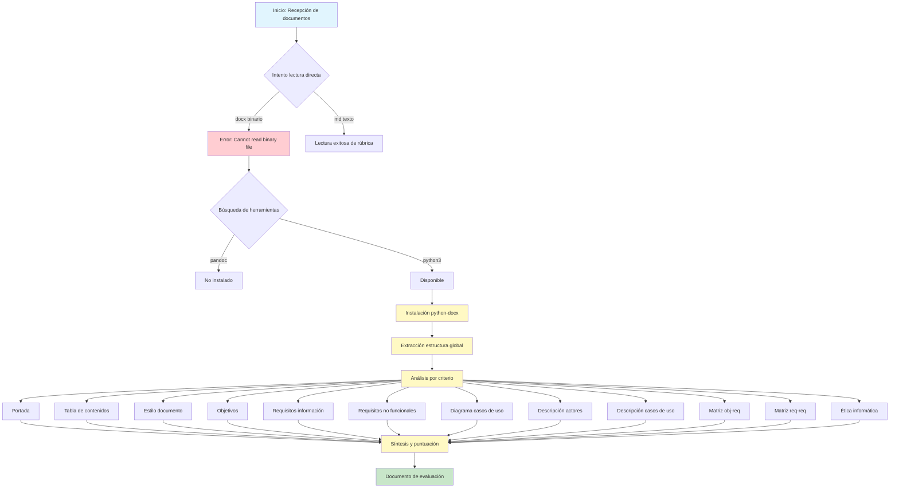

# Workflow de Evaluación de Documento - Rúbrica Hito 1

## Descripción del proceso de evaluación del documento `A1.1 Memoria trabajo final.docx`

---

## Diagrama Visual del Flujo de Trabajo

---

## Fase 1: Acceso al Contenido del Documento

### Paso 1.1: Intento de lectura directa
- **Tool:** `Read`
- **Acción:** Intenté leer directamente ambos archivos proporcionados por el usuario.
- **Resultado:**
  - `rubrica-hito-1.md` → Lectura exitosa (formato texto plano Markdown).
  - `A1.1 Memoria trabajo final.docx` → **Error:** `Cannot read binary file`. El formato `.docx` es un archivo binario comprimido (ZIP con XML interno) que no puede leerse como texto plano.

### Paso 1.2: Detección de herramientas disponibles
- **Tool:** `Bash`
- **Comando:** `which pandoc || which python3`
- **Acción:** Verifiqué qué herramientas de conversión de documentos estaban disponibles en el sistema.
- **Resultado:** `pandoc` no instalado, `python3` disponible.

### Paso 1.3: Instalación de librería de parsing
- **Tool:** `Bash`
- **Comando:** `pip3 install python-docx --break-system-packages`
- **Acción:** Instalé la librería `python-docx` que permite extraer texto, tablas, imágenes y metadatos de archivos `.docx` programáticamente.
- **Resultado:** Instalación exitosa de `python-docx` y su dependencia `lxml`.

---

## Fase 2: Extracción de la Estructura Global del Documento

### Paso 2.1: Listado de párrafos con estilos
- **Tool:** `Bash` (ejecutando script Python con `python3 -c`)
- **Librería:** `python-docx`
- **Acción:** Iteré sobre todos los párrafos del documento extrayendo su estilo (`para.style.name`) y contenido.
- **Hallazgos clave:**
  - `Title`: MOVE&GROW
  - `Subtitle`: 5 autoras, "CONTENIDOS:"
  - `Heading 1`: 17 secciones principales
  - `Heading 2/3`: Subsecciones anidadas
  - `normal`: Contenido de texto

### Paso 2.2: Extracción de las 53 tablas
- **Tool:** `Bash` + `python-docx`
- **Acción:** Iteré sobre `doc.tables` clasificando cada tabla por su contenido:

| Rango Tablas | Contenido | Cantidad |
|---|---|---|
| 1-4 | Objetivos (OBJ-001 a OBJ-004) | 4 |
| 5-12 | Requisitos de información (IRQ-001 a IRQ-008) | 8 |
| 13-21 | Requisitos no funcionales (NFR-001 a NFR-009) | 9 |
| 22-27 | Actores (ACT-001 a ACT-006) | 6 |
| 28-42 | Casos de uso (CU-001 a CU-015) | 15 |
| 43-53 | Glosario de clases | 11 |

### Paso 2.3: Detección de imágenes
- **Tool:** `Bash` + `python-docx`
- **Acción:** Accedí a `doc.inline_shapes` para contar y dimensionar las imágenes incrustadas.
- **Resultado:** 22 imágenes detectadas (diagramas de casos de uso, secuencia, C4, etc.).

---

## Fase 3: Análisis Detallado por Criterio de la Rúbrica

### 3.1 Portada
- **Tool:** `Bash` + `python-docx`
- **Acción:** Verifiqué los primeros párrafos del documento buscando: título, subtítulo, versión, fecha, autores.
- **Hallazgo:** Título (`Title`), autores (`Subtitle`), fecha presente. Falta campo "versión" formal en portada.
- **Puntuación:** 7/10

### 3.2 Tabla de Contenidos
- **Tool:** `Bash` + `python-docx`
- **Acción:** Busqué campos TOC en el XML interno del documento: `'TOC' in run.element.xml`.
- **Hallazgo:** `False`. Solo existe el texto "CONTENIDOS:" como `Subtitle`, no es una tabla generada automáticamente por Word.
- **Puntuación:** 4/10

### 3.3 Estilo del Documento
- **Tool:** `Bash` + `python-docx`
- **Acción:** Verifiqué uso de estilos `Heading 1/2/3` y busqué saltos de página explícitos: `w:br type="page"` en el XML de los runs.
- **Hallazgo:** Estilos correctos. 10 saltos de página encontrados, pero algunos en párrafos vacíos (aplicación poco limpia).
- **Puntuación:** 7/10

### 3.4 Objetivos
- **Tool:** `Bash` + `python-docx`
- **Acción:** Leí tablas 1-4 y párrafos de la sección 3.2.
- **Hallazgo:** 4 objetivos bien definidos con tablas completas (versión, autores, descripción, objetivos asociados).
- **Puntuación:** 7/10

### 3.5 Requisitos de Información
- **Tool:** `Bash` + `python-docx`
- **Acción:** Leí tablas 5-12 en detalle.
- **Hallazgo:** 8 IRQs correctamente descritos. Problema detectado: tablas de 3 columnas con contenido duplicado (columna 2 y 3 idénticas).
- **Puntuación:** 7/10

### 3.6 Requisitos No Funcionales
- **Tool:** `Bash` + `python-docx`
- **Acción:** Leí tablas 13-21 completas, incluyendo todos los campos.
- **Hallazgo:** 9 NFRs definidos (>3, máximo). Campos sin rellenar detectados: `<importancia del requisito>`, `<urgencia del requisito>`, `<estado del requisito>`, `<estabilidad del requisito>`, `<comentarios adicionales>`.
- **Puntuación:** 10/10

### 3.7 Diagrama de Casos de Uso
- **Tool:** `Bash` + `python-docx`
- **Acción:** Confirmé existencia de imágenes. Crucé información con descripciones de actores.
- **Hallazgo:** Imágenes presentes. Inconsistencia detectada: actores GPS y Cuenta Bancaria "no aparecen en el diagrama de casos de uso" según las propias autoras.
- **Puntuación:** 7/10

### 3.8 Descripción de Actores
- **Tool:** `Bash` + `python-docx`
- **Acción:** Leí tablas 22-27 en detalle.
- **Hallazgo:** 6 actores descritos. **Error crítico:** Tablas 25, 26 y 27 todas etiquetadas como "ACT-004 ADMINISTRADOR DE GESTIÓN" cuando deberían ser ACT-004, ACT-005 (GPS) y ACT-006 (CUENTA BANCARIA).
- **Puntuación:** 7/10

### 3.9 Descripción de Casos de Uso
- **Tool:** `Bash` + `python-docx`
- **Acción:** Leí tablas 28-42 verificando precondiciones, secuencia normal, excepciones, poscondiciones.
- **Hallazgo:** 15 casos de uso descritos. Problemas: excepciones poco detalladas (solo "paso p4", "paso p6" sin descripción); CU-011 duplicado para "Activar usuarios" y "Desactivar usuarios".
- **Puntuación:** 7/10

### 3.10 Matriz de Rastreabilidad: obj-req
- **Tool:** `Bash` + `python-docx`
- **Acción:** Busqué tablas con más de 3 columnas (formato matriz). Busqué párrafos alrededor de la sección 10.
- **Hallazgo:** Sección 10 completamente vacía. Solo encabezado `Heading 1` y párrafos vacíos.
- **Puntuación:** 0/10

### 3.11 Matriz de Rastreabilidad: req-req
- **Tool:** `Bash` + `python-docx`
- **Acción:** Misma búsqueda que la anterior para la sección 11.
- **Hallazgo:** Sección 11 completamente vacía. Solo encabezado `Heading 1` y párrafos vacíos.
- **Puntuación:** 0/10

### 3.12 Ética Informática
- **Tool:** `Bash` + `python-docx`
- **Acción:** Revisé descripciones de NFRs y texto general buscando referencias a ética, privacidad, leyes.
- **Hallazgo:** NFR-001 (seguridad/encriptación), NFR-004 (cumplimiento de leyes), propósito medioambiental de la app. No hay sección explícita de ética.
- **Puntuación:** 7/10

---

## Fase 4: Síntesis y Puntuación Final

### Paso 4.1: Asignación de puntuaciones
Para cada criterio comparé los hallazgos con los 4 niveles de la rúbrica (0, 4, 7, 10) y asigné la nota que mejor encajaba.

### Paso 4.2: Cálculo de nota ponderada

| Criterio | Peso | Nota | Puntos |
|---|---|---|---|
| Portada | 4% | 7 | 0.28 |
| Tabla de contenidos | 4% | 4 | 0.16 |
| Estilo del documento | 4% | 7 | 0.28 |
| Objetivos | 8% | 7 | 0.56 |
| Requisitos de información | 10% | 7 | 0.70 |
| Requisitos no funcionales | 8% | 10 | 0.80 |
| Diagrama de casos de uso | 10% | 7 | 0.70 |
| Descripción de actores | 10% | 7 | 0.70 |
| Descripción de casos de uso | 25% | 7 | 1.75 |
| Matriz obj-req | 5% | 0 | 0.00 |
| Matriz req-req | 5% | 0 | 0.00 |
| Ética informática | 7% | 7 | 0.49 |
| **TOTAL** | **100%** | | **6.42/10** |

---

## Resumen de Tools y Skills Utilizados

| Tool | Uso | Fases |
|---|---|---|
| **Read** | Lectura inicial de archivos | Fase 1 |
| **Bash** | Instalación de dependencias, ejecución de scripts Python, búsqueda en XML | Fase 1, 2, 3 |
| **python-docx** | Parsing del documento .docx (párrafos, tablas, imágenes, XML interno) | Fase 2, 3 |
| **Write** | Creación de este documento de workflow | Fase 4 |

---

## Principales Problemas Detectados

1. **Matrices de rastreabilidad ausentes** - Las secciones 10 y 11 están completamente vacías (10% del total penalizado).
2. **Tabla de contenidos no automática** - Texto estático, no campo TOC generado por Word.
3. **Errores en actores** - Tres tablas comparten el mismo identificador "ACT-004".
4. **Inconsistencias en casos de uso** - CU-011 duplicado; excepciones poco detalladas.
5. **Campos sin rellenar** - Tablas de NFR con placeholders sin completar.
